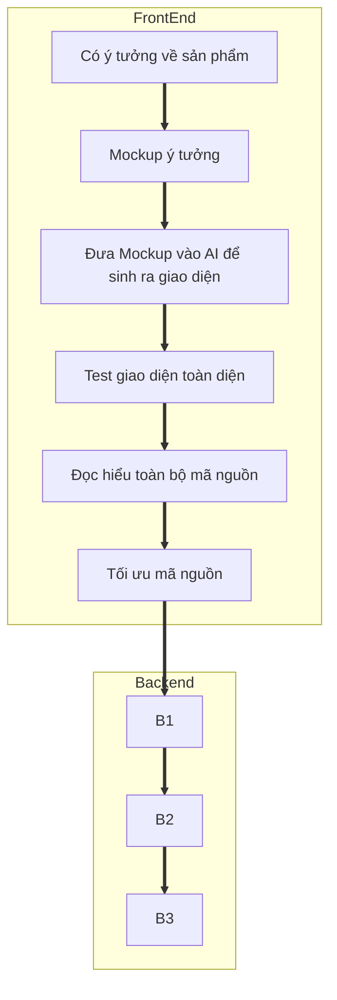

# Quy trình làm App trong kỷ nguyên AI

>AI không thể thay thế con người, con người càng phải học nền tảng cơ bản để làm chủ AI, cộng tác với AI để tăng hiệu quả làm việc, tạo ra năng suất x1000 

> Quy trình này không hoàn thiện, sữa được update từ từ 

