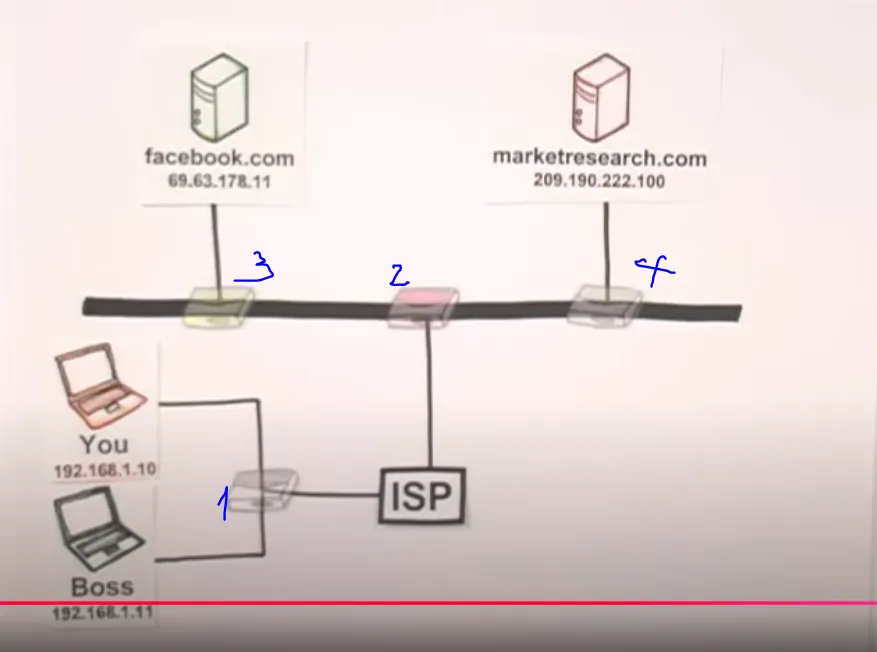

# Hiểu về cách hoạt động của Internet   
Internet là 1 hệ thống phần cứng gồm các đường cáp có thể là fiber, đồng…mạng lưới này gồm hơn 1,2 triệu km cáp ngầm dưới biển, đôi khi nằm sâu bằng chiều cao của đỉnh Everest. Các cáp này kết nối với các tòa nhà máy chủ khổng lồ và vô số các cáp nhỏ hơn kết nối với những máy tính cá nhân (thông qua các ISPs). Mạng lưới các cáp liên kết này gọi là Internet. Các máy tính kết nối trực tiếp với mạng lưới Internet được gọi là máy chủ (server). Những máy tính cá nhân của chúng ta không gọi là máy chủ mà gọi là máy khách (client) bởi vì nó không trực tiếp kết nối với hệ thống Internet, nó kết nối với Internet gián tiếp thông qua các Internet Service Providers (ISP - nhà cung cấp dịch vụ Internet).

Hãy xem mạng Internet làm việc ra sao qua ví dụ này, ví dụ bạn muốn xem một video dễ thương về một con mèo, yêu cầu xem video của bạn sẽ được gửi ra khỏi thiết bị của bạn, dọc theo các mạng khu vực và băng qua toàn cầu đến nơi video được lưu trữ (máy chủ), đây là điểm thực sự thông minh: xem, gửi toàn bộ video cùng một lúc trên một tuyến đường có khả năng sẽ bị kẹt giao thông và mất rất nhiều thời gian, vì vậy, video được xé nhỏ, chia thành các gói nhỏ, và mỗi gói đi theo con đường riêng của nó xuống các tuyến khác nhau, và khi chúng bắt đầu đến thiết bị của bạn, chúng được sắp xếp lại đúng thứ tự. Khi đủ phần đầu của video đã đến, video về con mèo của bạn sẽ hiện ra, dễ thương như bạn muốn. Đây là cách mà thông tin được truyền đi khắp thế giới.

Tất cả mọi thiết bị kết nối với mạng Internet đều được có 1 địa chỉ IP (Internet Protocol), nó tương tự như địa chỉ bưu điện. ĐỊa chỉ IP của mỗi thiết bị là duy nhất, từ laptop, điện thoại di động, đến máy chủ…

Bây giờ xem xét vấn đề sau: Giả sử bạn và sếp của bạn đều đang sử dụng máy tính laptop để vào mạng Internet. Sếp của bạn đang truy cập vào marketresearch.com để nghiên cứu thị trường, còn bạn đang truy cập facebook.com để chat với bạn bè. Vậy làm cách nào để phân biệt các gói dữ liệu từ máy của bạn và sếp bạn, để các dữ liệu về facebook được gửi và nhận về đúng máy của bạn chứ không xuất hiện trên máy của sếp. Đó là nhờ các bộ định tuyến. Giữa các thiết bị và máy chủ có rất nhiều bộ thiết bị định tuyến gọi là router. Vai trò của chúng là định hướng các gói dữ liệu được chuyển và nhận đúng đích IP. Khi 1 gói dữ liệu được gửi đi từ máy của bạn. Nó được bọc 1 lớp đầu tiên, lớp này chứa địa chỉ IP của máy tính của bạn, khi nó đi đến Router đầu tiên, nó sẽ được bọc 1 lớp tiếp theo và lớp này sẽ chưa địa chỉ IP của Router này,… cho đến khi gói dữ liệu đến máy chủ nó được bọc qua rất nhiều lớp khác nhau. Dựa trên các lớp này khi máy chủ gửi trả về dữ liệu theo đường ngược lại, các lớp này sẽ lần lượt được bóc ra khi đi ngược về qua các Router cho đến máy tính của bạn.

Điều quan trọng cần hiểu là Internet không phải là World Wide Web. Web là một phát minh tuyệt vời, đó là cách dữ liệu, các trang web, dịch vụ và tài liệu được sắp xếp, truy cập và địa chỉ hóa, nhưng tất cả những thứ đó đều nằm trên phần cứng là Internet, thứ cho phép nhiều mạng lưới nói chuyện với nhau một cách thực sự thông minh.

## ĐỌc tài liệu này trong lần đóng cọc 2:
>- Nguồn học 1 : GCFGlobal
>- Nguồn học 2 (tham khảo): Bài giảng freeCodeCamp

> ⭐ **Theo dõi [kênh Threads](https://www.threads.com/@kaitaku.88) để đọc bài mới mỗi ngày!** ⭐  

**[<== Bài Trước  ](./Day04-XYProblems.md)          |[  Trang Chủ  ](./README.md)|           [  Bài Sau ==>](link)**
