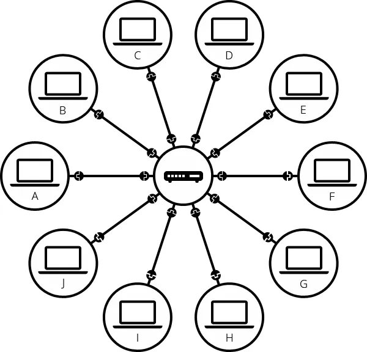

# CÁC KHÁI NIỆM CƠ BẢN VỀ WEB 
# 1. Sự khác biệt giữa web page, website, web server, web service, browser và search engine
Chúng ta sẽ bắt đầu bằng việc mô tả các khái niệm khác nhau liên quan đến Web: web page, websites, web servers và search engines. Những thuật ngữ này thường bị lẫn lộn bởi những người mới bắt đầu dùng web. Nhưng để trở thành 1 nhà phát triển web, bạn cần phải phân biệt chính xác chúng có nghĩa là gì.
## 1.1 Web page (=page = document)
Web page là 1 document (tài liệu) mà có thể được hiển thị trong 1 trình duyệt web (web browser.). Web page cũng thường được gọi là “pages”. Những web page như thế này được viết bằng ngôn ngữ HTML .

Một web page có thể nhúng nhiều loại tài nguyên khác nhau như:
- *Style information* — Kiểm soát giao diện của 1 trang .

- *Scripts* — thêm tính tương tác vào trang .

- *Media* — images, sounds, và videos.  

**Lưu ý**: Các trình duyệt có thể hiển thị các tài liệu khác nhau như các file PDF và các tài nguyên khác như các image và video, nhưng thuật ngữ “Web page” đặc biệt đề cập đến các HTML document.

Tất cả các web pages có thể được tìm thấy tại 1 vị trí duy nhất gọi là web address (URL). Để truy cập 1 page chỉ cần nhập địa chỉ của nó vào thanh địa chỉ của trình duyệt:
>
## 1.2 Website (=site)

Website là 1 tập hợp các web pages được nhóm lại với nhau thành 1 nguồn (resource) duy nhất, với các đường link kết nối chúng lại với nhau. Website cũng thường được gọi là một “site” .

Một website là 1 tập hợp các web pages được liên kết (cộng với các tài liên liên quan của chúng) và cùng share chung 1 domain name duy nhất (tên miền).

Mỗi web page của 1 website nhất định cung cấp các đường link rõ ràng - hầu hết thời gian dưới dạng các đoạn text có thể click - điều này cho phép người dùng di chuyển từ page này đến page khác trong một website.

Khi bạn tải 1 website trong 1 trình duyệt, nó có xu hướng hiển thị đầu tiên một web page chính của website đó, được gọi là homepage (hoặc home).
>

Note: Cũng có thể có [single-page-app](https://developer.mozilla.org/en-US/docs/Glossary/SPA): Là 1 website mà chứa 1 web page duy nhất, được update động nội dung mới khi cần thiết.
## 1.3 Web server (máy chủ)
Là một máy tính kết nối trực tiếp với mạng Internet, là nơi lưu trữ các website. Một web server lưu trữ (hosting) một hoặc nhiều websites. “Hosting” có nghĩa là tất cả các web pages và các files liên quan của chúng là có sẵn sàng trên máy tính đó (server đó). Một web server sẽ gửi các file của web page đang được lưu trữ trên đó đến trình duyệt của người dùng khi họ cố gắng load nó.

Đừng nhầm lẫn giữa websites và web servers. Ví dụ khi bạn nghe ai đó nói rằng “My website không phản hồi”, nó thực sự có nghĩa là web server không phản hồi và vì vậy bạn không xem được website.

ĐIều quan trọng hơn là khi 1 web server có thể host nhiều websites, thuật ngữ web server không bao giờ được sử dụng để chỉ định 1 website, vì nó có thể gây ra sự bối rối lớn. Ví dụ như nếu tôi nối “My web server is not responding” thì có nghĩa là nhiều websites trên web server đó không thể truy cập (not available).
## 1.4 Web service (Dịch vụ web)  
Web service là 1 phần mềm mà sẽ trả lời các yêu cầu thông qua Internet để thực hiện 1 chức năng hoặc cung cấp dữ liệu. Một dịch vụ web thường được hỗ trợ bởi 1 web server, và có thể cung cấp các web pages cho người dùng tương tác. Nhiều websites cũng là các web services, mặc dù một số website như MDN chỉ bao gồm nội dung tĩnh. Các ví dụ của web services như là resize ảnh, cung cấp báo cáo thời tiết, hoặc xử lý đăng nhập của người dùng.

## 1.5 Search engine (công cụ tìm kiếm)
Search Engine là 1 loại web service mà sẽ giúp bạn tìm kiếm những trang web khác, giống như là Google, Bing, Baidu. Search engine thường được truy cập thông qua 1 web browser (tức là tìm kiếm trực tiếp tại address bar của trình duyệt), hoặc thông qua một web page (ví dụ như trang bing.com hoặc google.com)

Hãy nhìn vào 1 điều tương tự, đó là 1 thư viện công cộng. Đây là những điều bạn sẽ làm khi đến thăm 1 thư viện:
1. Tìm một search index và tìm kiếm tiêu đề của cuốn sách mà bạn muốn

2. Ghi chú lại catalog number của cuốn sách (tức là tìm ra xem cuốn sách đó thuộc danh mục nào)

3. Đi đến danh mục mà chứa cuốn sách, và lấy cuốn sách.
>

Search engines là một loại thuật ngữ gây nhầm lẫn phổ biến trên web. Một search engine là một loại website đặc biệt, nó cũng là một web service (dịch vụ web), nó được dùng để tìm ra các web pages từ các websites khác.

Có rất nhiều Search Engine ngoài kia như Google, Bing, Yandex, DuckDuckGo, Baido,…Một số là chung chung (tổng quát), một số thì cụ thể quanh các topic nào đó.

Nhiều beginners nhầm lẫn giữa search engine và browser. Một Browser là 1 phần mềm mà truy xuất và hiển thị các web pages, còn 1 search engine là 1 website (chạy trên Browser) mà giúp mọi người tìm các web pages từ các websites khác. Sự nhầm lẫn này là bởi vì thường khi lần đầu tiên ai đó mở 1 browser, thì browser thường hiển thị 1 homepage của 1 search engine, hoặc một search box cho phép họ tìm kiếm 1 thuật ngữ bằng search engine đó. Hầu hết các trình duyệt cũng cho phép người dùng sử dụng 1 search engine bằng cách gõ tìm kiếm trực tiếp vào thanh địa chỉ của trình duyệt. Điều này là có ý nghĩa bởi vì điều đầu tiên mà mọi người có xu hướng muốn muốn làm với 1 trình duyệt là tìm kiếm 1 web page để hiển thị.

Đừng nhầm lẫn giữa một software (trình duyệt) với một service (search engine).

Bạn có thể biết mình đang dùng trình duyệt nào khi bấm vào đây: [Trình duyệt](https://www.whatsmybrowser.org/)

Ví dụ dưới đây là trình duyệt Firefox đang hiển thị một hộp thoại tìm kiếm của Google Search Engine là trang mặc định khi khởi động trình duyệt:
>

# 2. CÁCH THỨC HOẠT ĐỘNG CỦA WEB  
Ở nhiều nơi trên thế giới, web đã trở thành một công cụ cần thiết cho cuộc sống hàng ngày giống như dao kéo, xe đạp hoặc kem đánh răng. Thậm chí có thể bạn không gõ 1 địa chỉ web vào 1 trình duyệt để truy cập nội dung thì rất có những những ứng dụng mà bạn đang dùng vẫn đang sử dụng công nghệ web ở đằng sau hậu trường để lấy dữ liệu để hiện thị cho bạn.

Khi bạn truy cập web có khá nhiều điều xảy ra từ lúc bạn tương tác lần đầu (ví dụ gõ URL vào trình duyệt và nhấn Enter) cho đến khi kết quả trả về hiện thị cho bạn (ví dụ website xuất hiện trong trình duyệt của bạn):
1. Trình duyệt web sẽ yêu cầu tài nguyên mà bạn muốn truy cập từ web server (ví dụ như web page, dữ liệu, image lưu trữ trên máy chủ đó). Request như vậy (tương ứng là sự phản hồi Response) được thực hiện bằng cách một công nghệ gọi là HTTP (Hypertext Transfer Protocol - Giao thức truyền siêu văn bản), Giao thức này sử dụng một động từ để mô tả điều gì sẽ xảy ra, ví dụ như GET.

2. Nếu request thành công, web server sẽ gửi 1 HTTP response trở lại web browser.

>3. Trong vài trường hợp, các request ban đầu sẽ dẫn đến nhiều HTTP request sau đó, và sẽ có response hơn:    
>-  Khi truy cập 1 trang web, trình duyệt đầu tiên sẽ gửi yêu cầu để tải tệp HTML chính của trang web (thường là index.html)  
>-  Sau khi nhận được tệp HTML, trình duyệt bắt đầu phân tích nó (parse). Trong quá trình phân tích trình duyệt có thể sẽ tìm thấy các yêu cầu tải thêm các tài nguyên khác như image, tệp CSS (thông tin kiểu dáng), tệp lênh JavaScript…
>-  Các yêu cầu thêm này sẽ tạo ra thêm các phản hồi HTTP để tải thêm các thành phần bổ sung .

4. Khi tất cả các tài nguyên đã được yêu cầu, trình duyệt sẽ phân tích chúng và render chúng theo yêu cầu, trước khi hiển thị kết quả cho người dùng.

Mô tả này về các hoạt động của web đã được đơn giản hóa rất nhiều, nhưng đây là tất cả những gì bạn cần biết ở thời điểm này. Bạn sẽ được học chi tiết hơn trong module Web standards module (sau này).

## 2.1 Clients and servers (Máy khách và Máy chủ)
Cách thức hoạt động của web cung cấp mô tả cấp cao về những gì xảy ra khi bạn sử dụng trình duyệt web để điều hướng đến một trang web, giải thích phép thuật diễn ra đằng sau hậu trường để cung cấp mã có liên quan đến máy tính của bạn để trình duyệt lắp ráp thành thứ gì đó bạn có thể xem.

Lý thuyết này không phải là điều cần thiết để viết mã web trong thời gian ngắn, nhưng chẳng mấy chốc bạn sẽ thực sự bắt đầu được hưởng lợi từ việc hiểu những gì đang diễn ra ở chế độ nền.

Máy tính được kết nối với Internet được gọi là máy khách và máy chủ. Sơ đồ đơn giản về cách chúng tương tác có thể trông như thế này:
>

Clients là các thiết bị kết nối internet thông thường của người dùng web (ví dụ: máy tính của bạn được kết nối với Wi-Fi hoặc điện thoại của bạn được kết nối với mạng di động) và phần mềm truy cập web có sẵn trên các thiết bị đó (thường là trình duyệt web như Firefox hoặc Chrome).

Servers là máy tính lưu trữ các web pages, website hoặc ứng dụng. Khi máy khách muốn truy cập trang web, một bản sao của mã trang web sẽ được tải xuống từ máy chủ vào máy khách để trình duyệt kết xuất và hiển thị cho người dùng.
## 2.2 Các phần khác của hộp công cụ
Máy khách và máy chủ mà chúng tôi đã mô tả ở trên không kể hết toàn bộ câu chuyện. Có nhiều phần khác liên quan và chúng tôi sẽ mô tả chúng bên dưới.

Bây giờ, hãy tưởng tượng rằng internet là một con đường. Một đầu của con đường là máy khách, giống như ngôi nhà của bạn. Đầu kia của con đường là máy chủ, giống như một cửa hàng mà bạn muốn mua thứ gì đó.  

Để dữ liệu có thể truyền đi và nhận lại, chúng ta cần những thứ sau:
Kết nối internet của bạn: Cho phép bạn gửi và nhận dữ liệu trên internet. Về cơ bản, nó giống như con đường giữa nhà bạn và cửa hàng.

#### TCP/IP (Transmission Control Protocol/Internet Protocol): 
- Giao thức điều khiển truyền và Giao thức Internet (TCP/IP) là các giao thức truyền thông xác định cách dữ liệu sẽ di chuyển qua internet. Điều này giống như các cơ chế vận chuyển cho phép bạn đặt hàng, đến cửa hàng và mua hàng. Trong ví dụ của chúng tôi, điều này giống như một chiếc ô tô hoặc xe đạp (hoặc bất kỳ phương tiện nào khác mà bạn có thể di chuyển trên đường) (= Phương tiện)

#### DNS: 
- (Domain Name System) Hệ thống tên miền (DNS) giống như một sổ địa chỉ cho các trang web. Khi bạn nhập địa chỉ web vào trình duyệt, trình duyệt sẽ xem DNS để tìm địa chỉ IP của trang web — địa chỉ thực tế mà web đó đặt trên máy chủ — trước khi có thể truy xuất trang web. Trình duyệt cần tìm ra máy chủ nào đang lưu trữ trang web để có thể gửi tin nhắn HTTP đến đúng nơi. Điều này giống như việc tra cứu địa chỉ của cửa hàng trước khi bạn đến đó. Hãy tưởng tượng bạn có 1 cuốn sổ tay ghi chép tên các cửa hàng mà bạn hay đến (chính là DNS), tên các cửa hàng này chính là địa chỉ web, Ví dụ Bách Hóa Xanh chẳng hạn. Còn địa chỉ cụ thể của cửa hàng này, ví dụ 13 Nguyễn Trãi thì tương đương với địa chỉ IP của website.

#### HTTP (Hypertext Transfer Protocol): 
- Giao thức truyền siêu văn bản (HTTP) là một giao thức ứng dụng xác định ngôn ngữ để máy khách và máy chủ giao tiếp với nhau. Điều này giống như ngôn ngữ bạn sử dụng để đặt hàng.

#### Files: 
- Một trang web được tạo thành từ nhiều tệp khác nhau, giống như các loại hàng hóa khác nhau mà bạn mua từ cửa hàng. Các tệp này có hai loại chính:
  - Code: Các trang web chủ yếu được xây dựng từ HTML, CSS và JavaScript — các ngôn ngữ lập trình khác nhau được viết trên trang web, trình duyệt sẽ diễn giải và lắp ráp thành trang web để hiển thị cho người dùng.

  - Assets: Đây là thuật ngữ chung cho tất cả các mục khác xuất hiện trên trang web — chẳng hạn như hình ảnh, nhạc, video, tài liệu Word và PDF — không phải là mã mà trình duyệt diễn giải.

# 3. Chính xác thì điều gì xảy ra khi bạn truy cập 1 trang web?
Khi bạn nhập địa chỉ web (về mặt kỹ thuật là một phần của URL) vào thanh địa chỉ của trình duyệt, các bước sau sẽ diễn ra:

- Trình duyệt sẽ đến máy chủ DNS và tìm địa chỉ thực của máy chủ mà trang web đang hoạt động (bạn tra cứu địa chỉ của cửa hàng). Trình duyệt sẽ gửi tin nhắn HTTP request đến máy chủ, yêu cầu máy chủ gửi một bản sao của trang web đến máy khách (bạn đến cửa hàng và đặt hàng). Tin nhắn này và tất cả dữ liệu khác được gửi giữa máy khách và máy chủ sẽ được gửi qua kết nối internet của bạn bằng giao thức TCP/IP (Giao thức là phương tiện vận tải, phương tiện này chở theo các dữ liệu về trang web).

- Nếu máy chủ chấp thuận yêu cầu của máy khách, máy chủ sẽ gửi cho máy khách thông báo "200 OK", có nghĩa là "Tất nhiên bạn có thể xem trang web đó! Đây này ", sau đó bắt đầu gửi các tệp của trang web đến trình duyệt dưới dạng một loạt các phần nhỏ (small chunk) gọi là gói dữ liệu (data packet) (cửa hàng giao hàng cho bạn và bạn mang chúng về nhà). Trình duyệt sẽ lắp ráp các phần nhỏ (small chunk ) thành một trang web hoàn chỉnh và hiển thị cho bạn (bạn nhận được hàng về nhà — hàng mới sáng bóng, tuyệt vời!).

## 3.1 Giải thích về DNS
DNS = Domain Name System = Hệ thống tên miền.
Địa chỉ web thực (URL) không phải là chuỗi ký tự đẹp, dễ nhớ mà bạn nhập vào thanh địa chỉ để tìm các trang web yêu thích. Chúng là những con số đặc biệt trông như thế này: 192.0.2.172.

Địa chỉ này được gọi là địa chỉ IP và nó biểu thị một vị trí duy nhất trên web. Tuy nhiên, không dễ để nhớ, phải không? Đó là lý do tại sao Hệ thống tên miền được phát minh. Hệ thống này sử dụng các máy chủ đặc biệt để khớp địa chỉ web mà bạn nhập vào trình duyệt (như "mozilla.org") với địa chỉ (IP) thực của trang web.

Có thể truy cập trực tiếp các trang web thông qua địa chỉ IP của chúng. Bạn có thể sử dụng công cụ tra cứu DNS để tìm địa chỉ IP của trang web.

Công cụ tra cứu: https://www.nslookup.io/website-to-ip-lookup/

## 3.2 Giải thích về gói tin (packets)
Trước đây chúng tôi đã sử dụng thuật ngữ "Packet" để mô tả định dạng mà dữ liệu được truyền giữa máy khách và máy chủ. Chúng tôi muốn nói gì ở đây?

Về cơ bản, khi dữ liệu được gửi qua web, dữ liệu được gửi thành hàng nghìn khối nhỏ. Có nhiều lý do tại sao dữ liệu được gửi thành các gói tin nhỏ, nhưng quan trọng nhất là:

- Đôi khi chúng bị rời ra hoặc bị hỏng và khi điều này xảy ra, việc thay thế các khối nhỏ nhanh hơn và dễ dàng hơn so với toàn bộ tệp.

- Ngoài ra, các gói tin có thể được định tuyến theo các đường dẫn khác nhau, giúp việc trao đổi nhanh hơn và cho phép nhiều người dùng khác nhau tải xuống cùng một trang web cùng một lúc. Nếu mỗi trang web được gửi dưới dạng một khối lớn duy nhất, thì chỉ có một người dùng có thể tải xuống tại một thời điểm, điều này sẽ khiến web trở nên rất kém hiệu quả và không thú vị khi sử dụng.

## 3.3 HTTP basics
HTTP sử dụng ngôn ngữ động từ đơn giản để thực hiện các hành động như đưa ra yêu cầu. Phương thức HTTP GET là phương thức thường được sử dụng để đưa ra yêu cầu HTTP thuộc loại được mô tả ở trên. Ví dụ, yêu cầu cho trang chủ MDN có thể trông như thế này:
```
GET /en-US/ HTTP/2

Host: developer.mozilla.org
```
Phản hồi được máy chủ gửi có thể trông giống như thế này:
```
HTTP/2 200

date: Tue, 11 Feb 2025 11:13:30 GMT
expires: Tue, 11 Feb 2025 11:40:01 GMT
server: Google frontend
last-modified: Tue, 11 Feb 2025 00:49:32 GMT
etag: "65f26b7f6463e2347f4e5a7a2adcee54"
content-length: 45227
content-type: text/html

<!doctype html> ... (the 45227 bytes of the requested web page HTML)
```
Câu trả lời đầy đủ phức tạp hơn thế này, nhưng chúng tôi đã lược bỏ hầu hết để ngắn gọn. Các phần chính như sau:

#### HTTP/2 200

- Phiên bản HTTP mà máy chủ sử dụng để gửi phản hồi, trong trường hợp này là HTTP/2, theo sau là mã trạng thái cho biết yêu cầu có thành công hay không. 200 biểu thị thành công.

#### date, expires, etc.

- Các HTTP headers chứa thông tin bổ sung về phản hồi (lưu ý rằng các yêu cầu cũng có thể có tiêu đề), cung cấp thông tin bổ sung và/hoặc sửa đổi hành vi của yêu cầu.

#### <!doctype html>, etc.

- Phần response body, trong trường hợp này chứa tài liệu HTML của trang chủ MDN.

### Một số status codes khác
>Ở trên, chúng ta đã gặp mã trạng thái 200, cho biết yêu cầu HTTP đã thành công. Có nhiều mã trạng thái HTTP có ý nghĩa và cách sử dụng cụ thể, nhưng bạn sẽ chỉ thường thấy một số ít:

>**301**  
>Tài nguyên được yêu cầu đã được di chuyển vĩnh viễn đến một vị trí mới, được cung cấp trong phản hồi. Điều này được sử dụng để chuyển hướng nội dung khi nó được di chuyển.

>**400**  
>Máy chủ không thể xử lý yêu cầu. Điều này thường xảy ra khi yêu cầu không ở định dạng mà máy chủ hiểu được hoặc có lỗi.

>**403** 
>Máy chủ sẽ không cấp cho máy khách quyền truy cập vào tài nguyên được yêu cầu. Điều này thường xảy ra khi máy chủ biết máy khách là ai, nhưng họ không có quyền truy cập vào trang được yêu cầu.

>**404**  
>Máy chủ không tìm thấy tài nguyên được yêu cầu. Trạng thái này thường được trả về nếu URL sai hoặc nếu nội dung bị xóa mà không có lệnh chuyển hướng.

>**503**  
>Yêu cầu không thể xử lý do sự cố với máy chủ. Điều này thường xảy ra khi máy chủ ngoại tuyến để bảo trì và dự kiến ​​chỉ là tạm thời.

## 3.4 Các thành phần của một URL
Về mặt kỹ thuật, các địa chỉ web mà bạn nhập vào thanh địa chỉ của trình duyệt tạo thành một phần của Uniform Resource Locators (URL). URL xác định vị trí của các tài nguyên duy nhất trên internet.

**URL là một địa chỉ web cộng với một giao thức**: ví dụ, nếu bạn mở một tab mới trong trình duyệt của mình, nhập developer.mozilla.org vào thanh địa chỉ và nhấn Enter/Return, bạn sẽ được chuyển hướng đến một URL như sau:

https://developer.mozilla.org/en-US/

Các phần chính của URL là:
#### https

Giao thức (protocol) được sử dụng để gửi yêu cầu. Trong trường hợp này, chúng tôi đang sử dụng HTTPS, đây là phiên bản bảo mật của HTTP giúp ngăn chặn những kẻ xấu đọc dữ liệu của bạn trong khi dữ liệu đang được truyền tải. Trên web hiện đại, hầu như mọi máy chủ đều sử dụng HTTPS, vì vậy nếu bạn không bao gồm HTTPS một cách rõ ràng, trình duyệt sẽ cho rằng đó là giao thức bạn đang sử dụng và thêm giao thức này cho bạn.

#### developer.mozilla.org

Đây là domain name của URL, đại diện cho vị trí cấp cao nhất của máy chủ mà bạn đang kết nối đến. Trong trường hợp này, địa chỉ web bạn đã nhập bằng với tên miền, nhưng không phải lúc nào cũng vậy — bạn có thể chọn nhập địa chỉ web phức tạp hơn. Lưu ý rằng phần developer là một miền phụ subdomain (khu vực nội dung riêng biệt) của tên miền mozilla.org của Mozilla. Có những tên miền phụ khác trên trang web của Mozilla lưu trữ nội dung riêng biệt — hãy xem support.mozilla.org và bugzilla.mozilla.org, chẳng hạn. Thì trong đó mozilla.org là tên miền chính. Còn developer, support, bugzilla là các tên miền phụ.

#### /en-US/

Đường dẫn (path) đến tài nguyên trên máy chủ mà bạn đang truy cập. MDN lưu trữ tất cả nội dung tiếng Anh Hoa Kỳ trong một thư mục có tên là en-US, đó là URL mà URL này đang trỏ đến. Nếu bạn thiết lập trình duyệt để ưu tiên nội dung tiếng Anh theo mặc định, thì đây là URL bạn sẽ được chuyển hướng đến khi bạn nhập developer.mozilla.org. Nếu bạn thiết lập trình duyệt để ưu tiên ngôn ngữ khác mà MDN hỗ trợ, chẳng hạn như tiếng Pháp, bạn sẽ được chuyển hướng đến một URL khác, chẳng hạn như https://developer.mozilla.org/fr/. Theo mặc định, tính năng này không khả dụng cho mọi trang web; các nhà phát triển MDN đã thiết lập MDN như thế này để mọi người có thể dễ dàng truy cập ngôn ngữ họ thích. Để thay đổi ngôn ngữ thiết lập này trên trình duyệt vào phần Setup/Language

**Lưu ý**: Có nhiều thành phần khác có thể xuất hiện trong URL. Xem URL là gì? để biết thêm chi tiết.

## 3.5 Phân biệt các giao thức TCP/IP và HTTPS
- IP đảm bảo dữ liệu đến đúng địa chỉ.

- TCP đảm bảo dữ liệu được truyền đầy đủ và đáng tin cậy, không bị lỗi hoặc thất lạc trong quá trình truyền.

- HTTPS thêm một lớp bảo mật bằng cách mã hóa dữ liệu, bảo vệ nó khỏi bị đánh cắp hoặc sửa đổi khi truyền trên internet.

Theo thứ tự "Đúng nơi - Đáng tin cậy - An toàn" rất dễ hiểu và hợp lý. Nó mô tả cách dữ liệu di chuyển qua mạng, từ việc định tuyến chính xác đến đảm bảo chất lượng rồi bảo vệ khỏi rủi ro.

TCP/IP là nền tảng giúp mọi thiết bị kết nối và giao tiếp trên mạng, còn HTTPS là một giao thức ứng dụng cụ thể hoạt động trên TCP/IP để truyền dữ liệu web một cách an toàn. Ngoài HTTPS ra còn nhiều giao thức ứng dụng khác, ví dụ Email thường dùng các giao thức khác, nhưng các website thường sử dụng HTTPS.

# 4. Tìm hiểu Switch (bộ chuyển mạch), Router (bộ định tuyến), Modem. Mạng Intranet, Extranet và Internet.
## 4.1 Một Network đơn giản
Khi hai máy tính cần giao tiếp, bạn phải liên kết chúng, hoặc là vật lý (thường là bằng cáp Ethernet-Ethernet cable) hoặc không dây (ví dụ như bằng hệ thống Wi-Fi hoặc Bluetooth ). Tất cả các máy tính hiện đại đều có thể duy trì bất kỳ kết nối nào trong số đó.

Lưu ý: Trong phần còn lại của bài viết này, chúng ta sẽ chỉ nói về cáp vật lý, nhưng mạng không dây cũng hoạt động như vậy.
>

Một Network như vậy không giới hạn ở hai máy tính. Bạn có thể kết nối nhiều máy tính tùy ý. Nhưng nó nhanh chóng trở nên phức tạp. Nếu bạn đang cố gắng kết nối, chẳng hạn, mười máy tính, bạn cần 45 dây cáp, với chín phích cắm cho mỗi máy tính!
>

Để giải quyết vấn đề này, mỗi máy tính trên mạng được kết nối với một máy tính nhỏ đặc biệt gọi là bộ chuyển mạch mạng (hay gọi tắt là bộ chuyển mạch - network switch hoặc switch). Bộ chuyển mạch này chỉ có một nhiệm vụ: giống như một người phát tín hiệu tại nhà ga xe lửa, nó đảm bảo rằng các tin nhắn được gửi từ một máy tính nhất định chỉ đến được máy tính đích mục tiêu của chúng. Để gửi tin nhắn đến máy tính B, máy tính A gửi tin nhắn đến bộ chuyển mạch, sau đó bộ chuyển mạch chuyển tiếp tin nhắn đến máy tính B — máy tính B không nhận được tin nhắn dành cho các máy tính khác và không có tin nhắn nào cho máy tính B đến được các máy tính khác trên mạng cục bộ.

Khi chúng ta thêm một bộ chuyển mạch vào hệ thống, mạng lưới 10 máy tính của chúng ta chỉ cần 10 dây cáp: một phích cắm duy nhất cho mỗi máy tính và một bộ chuyển mạch có 10 phích cắm.
>

## 4.2 A network of networks
Cho đến giờ thì vẫn ổn. Nhưng còn việc kết nối hàng trăm, hàng nghìn, hàng tỷ máy tính thì sao? Tất nhiên một bộ chuyển mạch đơn lẻ không thể mở rộng đến mức đó, nhưng nếu bạn đọc kỹ, chúng tôi đã nói rằng một bộ chuyển mạch cũng là một máy tính như bất kỳ máy tính nào khác, vậy điều gì ngăn cản chúng ta kết nối hai bộ chuyển mạch với nhau? Không có gì cả, vậy hãy làm điều đó.
>

Bạn có thể tưởng tượng rằng chúng ta có thể kết nối các bộ chuyển mạch với nhau vô hạn để tạo thành một mạng lưới như thế này:
>

Trên thực tế, điều này dẫn đến nhiều vấn đề kỹ thuật. Một gói tin phải đi qua càng nhiều bộ chuyển mạch thì thời gian để đến đích càng lâu. Và bạn không thể chỉ có một cây các bộ chuyển mạch, vì khi đó, một bộ chuyển mạch lỗi có thể ngắt kết nối một phần lớn các thiết bị. Để giải quyết vấn đề này, chúng tôi giữ cho mỗi mạng cục bộ càng nhỏ càng tốt và chúng ta kết nối các mạng cục bộ này bằng một thiết bị riêng biệt gọi là bộ định tuyến (router). Bộ định tuyến là một máy tính biết cách làm thế nào để chuyển tiếp tin nhắn giữa các mạng. Bộ định tuyến giống như một bưu điện: khi một gói tin đến, nó sẽ đọc địa chỉ người nhận và chuyển tiếp gói tin đến đúng người nhận trực tiếp mà không cần thông qua các lớp chuyển tiếp.

Một mạng như vậy rất gần với cái mà chúng ta gọi là Internet. Chúng ta chỉ cần phương tiện vật lý (cáp) để kết nối tất cả các bộ định tuyến này. May mắn thay, một cơ sở hạ tầng như vậy đã tồn tại trước khi có Internet, và đó là mạng điện thoại. Để kết nối mạng của chúng ta với cơ sở hạ tầng điện thoại, chúng ta cần một thiết bị đặc biệt gọi là modem. Modem này chuyển thông tin từ mạng của chúng ta thành thông tin mà cơ sở hạ tầng điện thoại có thể quản lý và ngược lại.
>

Lưu ý rằng bộ định tuyến thương mại (commercial router) trong nhà bạn có thể là sự kết hợp của một bộ chuyển mạch (switch), một bộ định tuyến (router) và một modem, tất cả trong một thiết bị.

Vì vậy, chúng ta được kết nối với cơ sở hạ tầng điện thoại. Bước tiếp theo là gửi tin nhắn từ mạng của chúng ta đến mạng mà chúng ta muốn tiếp cận. Để làm điều đó, chúng ta sẽ kết nối mạng của mình với Nhà cung cấp dịch vụ Internet (ISP). ISP là công ty quản lý một số bộ định tuyến đặc biệt được liên kết với nhau và cũng có thể truy cập vào bộ định tuyến của các ISP khác. Vì vậy, tin nhắn từ mạng của chúng ta được truyền qua mạng của các mạng ISP đến mạng đích. Internet bao gồm toàn bộ cơ sở hạ tầng mạng này.
>


## 4.3 Internet and the web
Như bạn có thể thấy, khi chúng ta duyệt Web bằng trình duyệt Web, chúng ta thường sử dụng tên miền để truy cập một trang web. Điều đó có nghĩa là Internet và Web là một không? Không đơn giản như vậy. Như chúng ta đã thấy, Internet là một cơ sở hạ tầng kỹ thuật cho phép hàng tỷ máy tính được kết nối với nhau. Trong số những máy tính đó, một số máy tính (gọi là máy chủ Web) có thể gửi các thông điệp dễ hiểu cho trình duyệt web. Internet là một cơ sở hạ tầng, trong khi Web là một dịch vụ được xây dựng trên cơ sở hạ tầng đó. Cần lưu ý rằng có một số dịch vụ khác được xây dựng trên Internet, chẳng hạn như email.

## 4.4 Intranets and Extranets
Intranet là mạng riêng chỉ dành cho các thành viên của một tổ chức cụ thể. Chúng thường được sử dụng để cung cấp cổng thông tin cho các thành viên truy cập an toàn vào các tài nguyên được chia sẻ, cộng tác và giao tiếp. Ví dụ: mạng nội bộ của một tổ chức có thể lưu trữ các trang web để chia sẻ thông tin của phòng ban hoặc nhóm, ổ đĩa dùng chung để quản lý các tài liệu và tệp quan trọng, cổng thông tin để thực hiện các tác vụ quản trị kinh doanh và các công cụ cộng tác như wiki, bảng thảo luận và hệ thống nhắn tin.

Extranet rất giống với Intranet, ngoại trừ việc chúng mở toàn bộ hoặc một phần mạng riêng để cho phép chia sẻ và cộng tác với các tổ chức khác. Chúng thường được sử dụng để chia sẻ thông tin một cách an toàn và bảo mật với khách hàng và các bên liên quan làm việc chặt chẽ với một doanh nghiệp. Thường thì các chức năng của chúng tương tự như các chức năng do mạng nội bộ cung cấp: chia sẻ thông tin và tệp, công cụ cộng tác, bảng thảo luận, v.v.

Cả mạng nội bộ và mạng ngoại bộ đều chạy trên cùng một loại cơ sở hạ tầng như Internet và sử dụng cùng một giao thức. Do đó, các thành viên được ủy quyền từ các vị trí vật lý khác nhau có thể truy cập chúng.
>


## Tài liệu phải đọc khi ĐÓNG CỌC LẦN ...

> ⭐ **Theo dõi [kênh Threads](https://www.threads.com/@kaitaku.88) để đọc bài mới mỗi ngày!** ⭐  

**[<== Bài Trước  ](link)          |[  Trang Chủ  ](./README.md)|           [  Bài Sau ==>](link)**