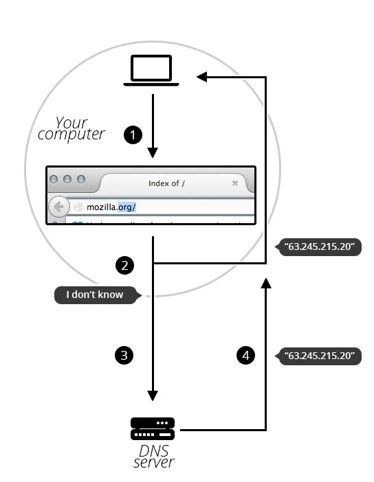

# What is a Domain Name?
Tên miền là một phần quan trọng của cơ sở hạ tầng Internet. Chúng cung cấp địa chỉ có thể đọc được bằng con người cho bất kỳ máy chủ web nào có trên Internet.

Bất kỳ máy tính nào được kết nối Internet đều có thể được truy cập thông qua Địa chỉ IP công cộng, có thể là địa chỉ IPv4 (ví dụ: 192.0.2.172) hoặc địa chỉ IPv6 (ví dụ: 2001:db8:8b73:0000:0000:8a2e:0370:1337).

Máy tính có thể xử lý các địa chỉ như vậy một cách dễ dàng, nhưng mọi người gặp khó khăn trong việc tìm ra ai đang chạy máy chủ hoặc trang web cung cấp dịch vụ gì. Địa chỉ IP khó nhớ và có thể thay đổi theo thời gian.

Để giải quyết tất cả các vấn đề đó, chúng ta sử dụng các địa chỉ mà con người có thể đọc được gọi là tên miền.

## 1. Cấu trúc của tên miền
Tên miền có cấu trúc đơn giản gồm nhiều phần (có thể chỉ có một phần, hai, ba phần…), được phân tách bằng dấu chấm và đọc từ phải sang trái:
>

Mỗi phần đó cung cấp thông tin cụ thể về toàn bộ tên miền.

### TLD (Top-Level Domain) - Miền cấp cao nhất
TLD cho người dùng biết mục đích chung của dịch vụ đằng sau tên miền. Các TLD chung nhất (.com, .org, .net) không yêu cầu các dịch vụ web phải đáp ứng bất kỳ tiêu chí cụ thể nào, nhưng một số TLD áp dụng các chính sách chặt chẽ hơn để làm rõ mục đích của chúng. Ví dụ:

- Các TLD cục bộ như .us, .fr, or .se có thể yêu cầu dịch vụ phải được cung cấp bằng một ngôn ngữ nhất định hoặc được lưu trữ tại một quốc gia nhất định — chúng được cho là để chỉ ra một tài nguyên bằng một ngôn ngữ hoặc quốc gia cụ thể.

- Các TLD có chứa .gov chỉ được phép sử dụng bởi các cơ quan chính phủ.

- TLD .edu chỉ được sử dụng bởi các tổ chức giáo dục và học thuật.

TLD có thể chứa các ký tự đặc biệt cũng như ký tự La-tinh. Độ dài tối đa của TLD là 63 ký tự, mặc dù hầu hết chỉ khoảng 2–3 ký tự. Danh sách đầy đủ các TLD được duy trì bởi ICANN.

### Label (or component)
Nhãn là những gì theo sau TLD. Nhãn là chuỗi ký tự không phân biệt chữ hoa chữ thường dài từ một đến sáu mươi ba ký tự, chỉ chứa các chữ cái từ A đến Z, các chữ số từ 0 đến 9 và ký tự '-' (có thể không phải là ký tự đầu tiên hoặc cuối cùng trong nhãn). a, 97, and hello-strange-person-16-how-are-you đều là ví dụ về nhãn hợp lệ.

Nhãn nằm ngay trước TLD cũng được gọi là Tên miền cấp độ thứ cấp (SLD) ( Secondary Level Domain ).

Một tên miền có thể có nhiều nhãn (hoặc thành phần). Không bắt buộc hoặc không cần thiết phải có 3 nhãn để tạo thành một tên miền. Ví dụ, informatics.ed.ac.uk là một tên miền hợp lệ. Đối với bất kỳ tên miền nào bạn kiểm soát (ví dụ mozilla.org), bạn có thể tạo "tên miền phụ" (subdomain) với nội dung khác nhau được đặt ở mỗi tên miền phụ, như developer.mozilla.org, support.mozilla.org, hoặc bugzilla.mozilla.org..

## 2. Mua một tên miền
### 2.1 Ai sở hữu tên miền?
Bạn không thể "mua tên miền". Điều này là để các tên miền chưa sử dụng cuối cùng có thể được người khác sử dụng lại. Nếu mọi tên miền đều được mua, web sẽ nhanh chóng đầy những tên miền chưa sử dụng đã bị khóa và không ai có thể sử dụng.

Thay vào đó, bạn trả tiền cho quyền sử dụng tên miền trong một hoặc nhiều năm. Bạn có thể gia hạn quyền của mình và việc gia hạn của bạn được ưu tiên hơn các đơn đăng ký của người khác. Nhưng bạn không bao giờ sở hữu tên miền.

- Registrars (Nhà đăng ký tên miền) là các công ty giúp bạn đăng ký tên miền. Họ sử dụng domain name registries (các cơ quan quản lý tên miền) để lưu trữ thông tin kỹ thuật và hành chính, đảm bảo rằng tên miền của bạn hoạt động đúng cách.

- Không phải mọi tên miền đều do nhà đăng ký quản lý – Một số tên miền không được quản lý bởi registrar mà do một công ty hoặc tổ chức trực tiếp kiểm soát. Ví dụ, tất cả tên miền có đuôi ".fire" được Amazon quản lý, tức là Amazon chịu trách nhiệm theo dõi và điều phối các tên miền này thay vì một registrar thông thường.

### 2.2 Tìm 1 tên miền sẵn có (có thể đăng ký được, available)
Tìm 1 tên miền sẵn có (có thể đăng ký được, available)
Để tìm hiểu xem tên miền nào đó có khả dụng không:

- Truy cập trang web của công ty đăng ký tên miền. Hầu hết các công ty này đều cung cấp dịch vụ "whois" cho bạn biết tên miền đó có khả dụng không.

- Nếu bạn đang sử dụng một hệ thống có trình shell tích hợp sẵn, bạn có thể chạy lệnh whois trực tiếp trong shell để tra cứu thông tin về tên miền. Ví dụ, bạn có thể nhập lệnh này để kiểm tra thông tin của tên miền mozilla.org.  
*Shell là một giao diện dòng lệnh, thường có sẵn trên các hệ điều hành như Linux, macOS hoặc thông qua Command Prompt trên Windows (nếu có cài đặt công cụ phù hợp).*

```
whois mozilla.org
```
- Output sẽ như sau:
```
Domain Name:MOZILLA.ORG
Domain ID: D1409563-LROR
Creation Date: 1998-01-24T05:00:00Z
Updated Date: 2013-12-08T01:16:57Z
Registry Expiry Date: 2015-01-23T05:00:00Z
Sponsoring Registrar:MarkMonitor Inc. (R37-LROR)
Sponsoring Registrar IANA ID: 292
WHOIS Server:
Referral URL:
Domain Status: clientDeleteProhibited
Domain Status: clientTransferProhibited
Domain Status: clientUpdateProhibited
Registrant ID:mmr-33684
Registrant Name:DNS Admin
Registrant Organization:Mozilla Foundation
Registrant Street: 650 Castro St Ste 300
Registrant City:Mountain View
Registrant State/Province:CA
Registrant Postal Code:94041
Registrant Country:US
Registrant Phone:+1.6509030800
```
Như bạn thấy, tôi không thể đăng ký mozilla.org vì Mozilla Foundation đã đăng ký rồi.

Mặt khác, hãy xem liệu tôi có thể đăng ký afunkydomainname.org không:

```
whois afunkydomainname.org
```
Điều này sẽ xuất ra kết quả sau (tại thời điểm viết bài):
```
NOT FOUND
```
Như bạn thấy, tên miền không tồn tại trong cơ sở dữ liệu whois, vì vậy chúng tôi có thể yêu cầu đăng ký tên miền đó. Thật tốt khi biết điều đó!
## 2.3 Nhận 1 tên miền
Quy trình khá đơn giản:

1. Truy cập trang web của đơn vị đăng ký.

1. Thông thường sẽ có lời kêu gọi hành động "Nhận tên miền" nổi bật. Nhấp vào đó.

1. Điền vào biểu mẫu với tất cả các thông tin bắt buộc. Đặc biệt, hãy đảm bảo rằng bạn không viết sai tên miền mong muốn. Khi đã thanh toán, thì đã quá muộn!

1. Đơn vị đăng ký sẽ cho bạn biết khi tên miền được đăng ký đúng cách. Trong vòng vài giờ, tất cả các máy chủ DNS sẽ nhận được thông tin DNS của bạn.

**Lưu ý**: Trong quy trình này, đơn vị đăng ký sẽ yêu cầu bạn cung cấp địa chỉ thực tế của mình. Hãy đảm bảo rằng bạn điền đúng, vì ở một số quốc gia, đơn vị đăng ký có thể bị buộc phải đóng tên miền nếu họ không thể cung cấp địa chỉ hợp lệ.

## 2.4 Làm mới DNS
DNS database được lưu trữ trên mọi máy chủ DNS trên toàn thế giới và tất cả các máy chủ này đều tham chiếu đến một số máy chủ đặc biệt được gọi là "authoritative name servers" hoặc "top-level DNS servers" — chúng giống như boss servers quản lý hệ thống. (Cũng là DNS Server nhưng cũng phân ra boss server và server thông thường).

Bất cứ khi nào đơn vị đăng ký của bạn tạo hoặc cập nhật bất kỳ thông tin nào cho một tên miền nhất định, thông tin đó phải được làm mới trong mọi DNS database. Mỗi DNS server biết về một tên miền nhất định sẽ lưu trữ thông tin trong một thời gian trước khi thông tin đó tự động bị vô hiệu hóa và sau đó được làm mới (DNS server truy vấn Boss DNS Server và lấy thông tin đã cập nhật từ máy chủ đó). Do đó, cần một khoảng thời gian để các DNS server biết về tên miền này có được thông tin cập nhật.
# 3. DNS request hoạt động như thế nào?

Như chúng ta đã thấy, khi bạn muốn hiển thị một trang web trong trình duyệt của mình, việc nhập tên miền dễ hơn là nhập địa chỉ IP. Hãy cùng xem xét quy trình này:

1. Nhập mozilla.org vào thanh địa chỉ của trình duyệt.

1. Trình duyệt sẽ hỏi máy tính của bạn xem nó đã nhận dạng được địa chỉ IP được xác định bởi tên miền này chưa (sử dụng local DNS cache). Nếu có, tên miền sẽ được dịch thành địa chỉ IP và trình duyệt sẽ đàm phán (trao đổi nội dung) nội dung với web server. Kết thúc câu chuyện.

1. Nếu máy tính của bạn không biết IP nào nằm sau tên miền mozilla.org, trình duyệt sẽ tiếp tục hỏi máy chủ DNS, nhiệm vụ của máy chủ DNS là cho máy tính của bạn biết địa chỉ IP nào khớp với từng tên miền đã đăng ký.

1. Bây giờ máy tính đã biết địa chỉ IP được yêu cầu, trình duyệt của bạn có thể trao đổi nội dung với máy chủ web.

Ở đây đề cập đến 2 loại máy chủ: Máy chủ DNS sẽ lưu trữ và quản lý tên miền, nó sẽ trả về địa chỉ IP tương ứng với tên miền khi trình duyệt yêu cầu.

Còn máy chủ web sẽ lưu trữ web pages, website và các tài nguyên liên quan, nó sẽ trả về các tài nguyên này khi trình duyệt yêu cầu và hiển thị cho người dùng xem.
>

## Tài liệu phải đọc khi ĐÓNG CỌC LẦN ...

> ⭐ **Theo dõi [kênh Threads](https://www.threads.com/@kaitaku.88) để đọc bài mới mỗi ngày!** ⭐  

**[<== Bài Trước  ](link)          |[  Trang Chủ  ](./README.md)|           [  Bài Sau ==>](link)**