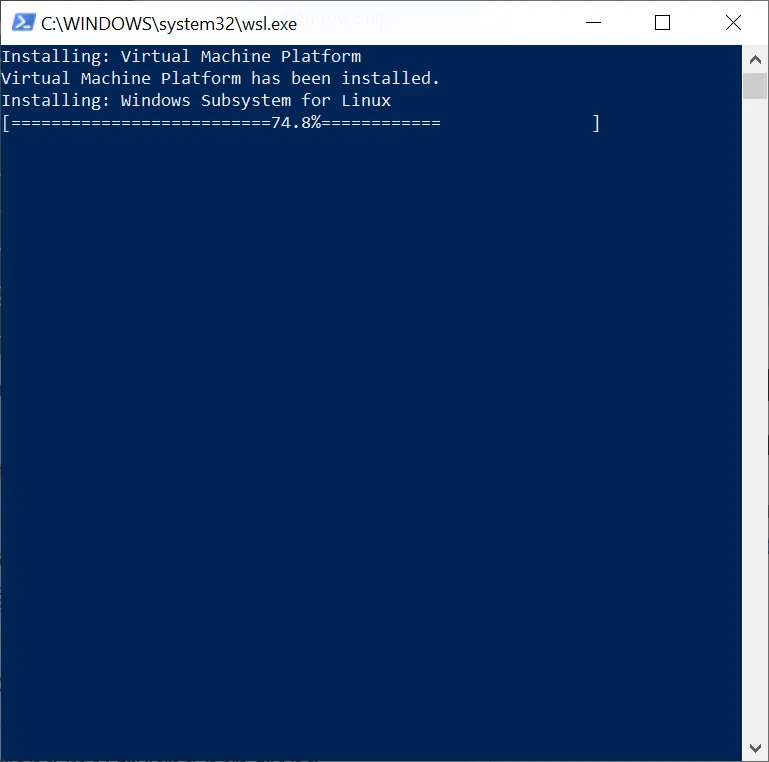
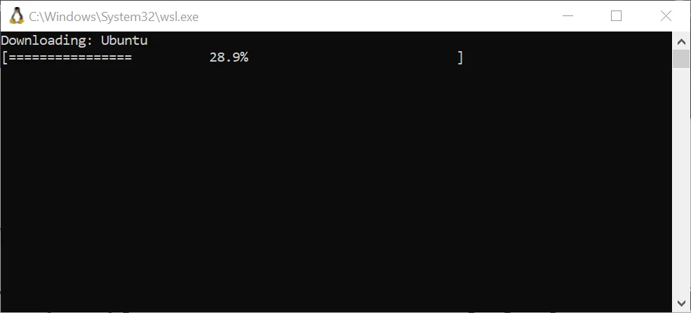
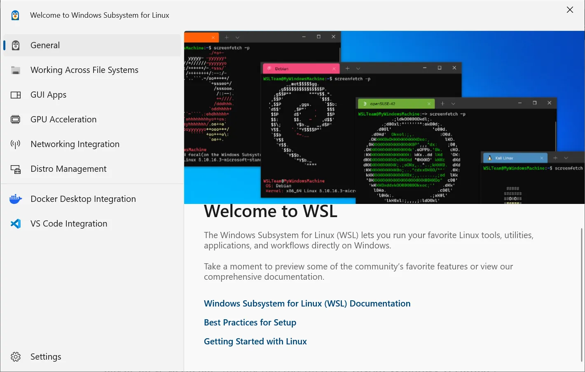
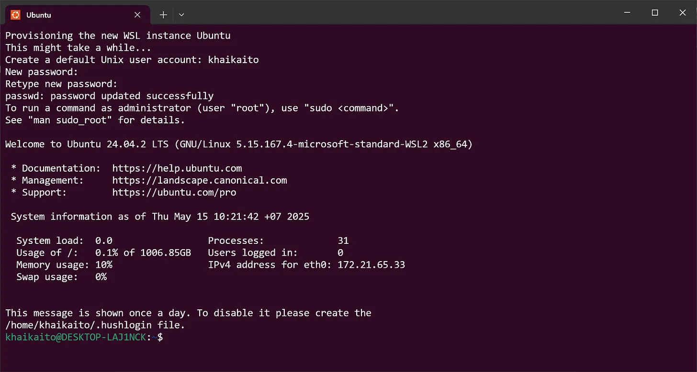
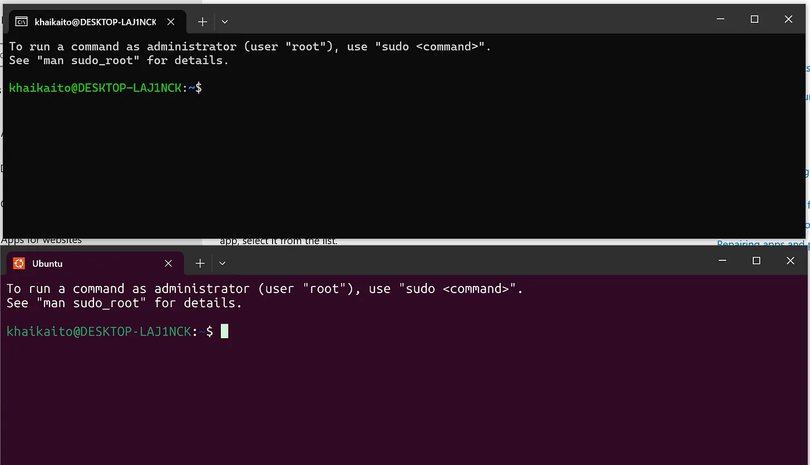

# Môi trường Linux
# 1. 10 Lý do tại sao các Developer nên sử dụng Linux
Bước đầu tiên trong việc xây dựng bất kỳ trang web nào là có các công cụ phù hợp. Đối với chúng tôi, điều đó có nghĩa là thiết lập một môi trường phát triển để viết mã tốt.

Nhiều khóa học phát triển trực tuyến sử dụng trình chỉnh sửa mã trong trình duyệt hoặc "hộp cát - sandbox", cung cấp cho bạn các công cụ và chương trình cần thiết để hoàn thành nhiệm vụ trong tầm tay và không có gì khác. Bạn sẽ sử dụng một số sandbox này trong suốt giai đoạn đầu của quá trình học vì chúng rất tuyệt để bắt đầu nhanh chóng. Tuy nhiên, cách tốt nhất để thiết lập cho mình thành công lâu dài là hoạt động trong một môi trường phát triển thực tế.

Chúng tôi sẽ không nói dối bạn: việc cài đặt các package, editor và thậm chí toàn bộ hệ điều hành có thể rất khó chịu. Tuy nhiên, có kinh nghiệm thiết lập môi trường phát triển để chạy mã bạn sẽ viết là một kỹ năng thực tế vô giá mà bạn sẽ mang theo trong suốt sự nghiệp của mình.
## 1.0 Các tùy chọn về hệ điều hành
Linux là một hệ điều hành đa năng và được sử dụng rộng rãi trong thế giới công nghệ, với nhiều lợi thế cho các nhà phát triển. Do bản chất mã nguồn mở và các công cụ phát triển mở rộng, cũng như khả năng tùy chỉnh, bảo mật và hỗ trợ cộng đồng, Linux là một lựa chọn tuyệt vời cho các nhà phát triển đang tìm kiếm một nền tảng đáng tin cậy cho các dự án của họ. Trong bài viết này, chúng ta sẽ xem xét mười lý do tại sao các nhà phát triển nên sử dụng Linux và tại sao nó lại là một lựa chọn phổ biến như vậy. Bài viết này sẽ giải thích tại sao Linux lại là một nguồn tài nguyên có giá trị như vậy đối với các nhà phát triển, cho dù bạn là người mới vào nghề hay là một lập trình viên có kinh nghiệm. 

Nếu đang dùng máy tính MAC là tốt nhất. Chỉ cần cài đặt một vài chương trình, bạn sẽ có thể bắt đầu và chạy chương trình học của mình ngay lập tức!

Nếu không thể dùng máy MAC thì lựa chọn tiếp theo là Linux. Linux là hệ điều hành miễn phí và mã nguồn mở, hoạt động tốt với mọi ngôn ngữ lập trình. Cụ thể là phiên bản Ubuntu chính thức.

**Nếu sử dụng Windows thì có 1 số tùy chọn sau:**

- A VirtualBox Virtual Machine: Dùng máy ảo và cài đặt Ubuntu lên máy ảo

- Cài 2 hệ điều hành song song lên ổ cứng: Ubuntu và Window cho phép tùy chọn khi khởi động máy (Dual boot): Tùy chọn này cho phép Ubuntu sử dụng toàn bộ chức năng của 1 máy tính.

- Windows Subsystem for Linux (WSL) : cho phép bạn chạy một môi trường Linux đầy đủ từ bên trong một cài đặt Windows hiện có, cung cấp cho bạn tất cả các lợi thế của Linux thông qua một quy trình cài đặt đơn giản. Chúng tôi sẽ sử dụng phiên bản 2 của WSL, thường được gọi là WSL2, trong chương trình giảng dạy.

- Chromebook: Đối với người dùng Chromebook, bạn có thể chạy một thiết bị đầu cuối Linux trên thiết bị của mình. Chi tiết hơn sẽ được cung cấp trong bài học tiếp theo.

## 1.1 Linux là miễn phí và mã nguồn mở
Linux là lựa chọn phổ biến trong số các nhà phát triển do tính năng chính của nó là miễn phí và mã nguồn mở. Điều này có nghĩa là mã nguồn của hệ điều hành này được công khai cho công chúng và có thể được xem, sửa đổi và phân phối miễn phí. Tính minh bạch này thúc đẩy cộng đồng nhà phát triển hợp tác toàn cầu, dẫn đến cải tiến và đổi mới nền tảng liên tục. Các nhà phát triển có thể tùy chỉnh hệ thống để đáp ứng các yêu cầu cụ thể của họ đồng thời đóng góp cho cộng đồng bằng cách chia sẻ các cải tiến của họ. Bản chất mã nguồn mở của Linux cũng thúc đẩy tính minh bạch và bảo mật bằng cách cho phép xác định và giải quyết các lỗi tiềm ẩn càng sớm càng tốt.

## 1.2  Linux có giao diện dòng lệnh mạnh mẽ
Một trong những lợi thế quan trọng nhất của Linux đối với các nhà phát triển là giao diện dòng lệnh (CLI) mạnh mẽ của nó. CLI cung cấp cho các nhà phát triển mức độ kiểm soát và độ chính xác cao, cho phép họ hoàn thành nhiều tác vụ khác nhau một cách nhanh chóng và hiệu quả. Không giống như giao diện người dùng đồ họa (GUI), yêu cầu nhiều lần nhấp chuột và điều hướng menu, CLI tương tác với hệ thống thông qua các lệnh dựa trên văn bản. Phương pháp này cho phép các nhà phát triển dễ dàng hoàn thành các tác vụ phức tạp như cài đặt phần mềm, cấu hình hệ thống và quản lý tệp. Ngoài ra, CLI hỗ trợ tự động hóa và viết tập lệnh, có thể giúp các nhà phát triển tiết kiệm thời gian và tăng năng suất. Hơn nữa, CLI nhẹ và tiêu thụ ít tài nguyên hệ thống hơn, khiến nó trở thành lựa chọn tuyệt vời cho các nhà phát triển muốn cải thiện quy trình làm việc của mình.

## 1.3 Linux an toàn
Linux đi kèm với một số tính năng bảo mật giúp bảo vệ chống lại nhiều mối đe dọa bảo mật. Ví dụ, Linux sử dụng quyền dựa trên người dùng và kiểm soát truy cập để đảm bảo rằng người dùng chỉ thực hiện các hành động mà họ đã được cấp quyền. Ngoài ra, Linux có quy trình khởi động an toàn đảm bảo chỉ có mã đáng tin cậy được thực thi khi hệ thống khởi động. Hơn nữa, Linux hỗ trợ một số giao thức truyền thông an toàn, chẳng hạn như HTTPS và SSH, cho phép truy cập từ xa an toàn vào hệ thống. Cuối cùng, Linux bao gồm nhiều công cụ và tiện ích liên quan đến bảo mật, chẳng hạn như tường lửa, hệ thống phát hiện xâm nhập và các gói phần mềm tập trung vào bảo mật, tất cả đều giúp ngăn chặn các cuộc tấn công độc hại.

## 1.4 Linux có khả năng tùy chỉnh cao
Linux là hệ điều hành phổ biến trong cộng đồng các nhà phát triển vì tính linh hoạt và khả năng kiểm soát cao. Nó cung cấp cho các nhà phát triển khả năng kiểm soát hoàn toàn đối với máy, cho phép họ tùy chỉnh theo nhu cầu cụ thể của mình và thử nghiệm các phương pháp tiếp cận mới. Các nhà phát triển có thể sử dụng Linux theo bất kỳ cách nào họ muốn, từ việc thay đổi toàn bộ môi trường máy tính để bàn đến việc chuyển sang một bản phân phối Linux hoàn toàn mới. Các môi trường máy tính để bàn phổ biến bao gồm GNOME, KDE và Cinnamon, mỗi môi trường có giao diện riêng. Linux cũng hỗ trợ nhiều hệ thống shell, cho phép các nhà phát triển lựa chọn hệ thống phù hợp nhất với nhu cầu của mình.

## 1.5  Linux nhận được các bản cập nhật nhất quán
Linux nổi tiếng với các bản cập nhật thường xuyên và ổn định, cực kỳ có lợi cho các nhà phát triển. Điều này có nghĩa là các nhà phát triển có thể thường xuyên dự đoán các tính năng mới, bản sửa lỗi và bản vá bảo mật. Quá trình cập nhật cũng được thiết kế để diễn ra suôn sẻ và không gây gián đoạn nhằm giảm thiểu thời gian chết và đảm bảo hệ thống vẫn ổn định ngay cả sau khi đã cài đặt các bản cập nhật. Các bản phát hành hỗ trợ dài hạn (LTS) của các bản phân phối Linux thường cung cấp các bản cập nhật trong thời gian dài hơn, cho phép các nhà phát triển tự tin lập kế hoạch và quản lý hệ thống của họ. Do đó, Linux là một nền tảng đáng tin cậy và an toàn để phát triển, thử nghiệm và triển khai phần mềm.

## 1.6 Linux cung cấp nhiều tùy chọn
Linux cung cấp nhiều bản phân phối, mỗi bản có bộ tính năng và khả năng riêng dành cho nhà phát triển. Nhiều tùy chọn này cho phép nhà phát triển chọn bản phân phối đáp ứng tốt nhất các yêu cầu của họ, cho dù họ đang tìm kiếm một hệ điều hành có khả năng tùy chỉnh cao hay một bản phân phối được tối ưu hóa cho một trường hợp sử dụng cụ thể. Nhà phát triển cũng có thể chọn từ nhiều bản phân phối chuyên biệt được thiết kế cho các ứng dụng cụ thể như bảo mật hoặc chơi game. Với rất nhiều tùy chọn, Linux cung cấp cho nhà phát triển sự linh hoạt và lựa chọn mà họ cần để tìm hệ điều hành tốt nhất cho nhu cầu của mình.

**Sau đây là một số bản phân phối thân thiện với nhà phát triển:**  
>Ubuntu - Ubuntu là một bản phân phối Linux thân thiện với người dùng với cộng đồng các nhà phát triển lớn, khiến nó trở thành lựa chọn tuyệt vời cho các nhà phát triển mới. Nó được cài đặt sẵn nhiều công cụ phát triển và thư viện, bao gồm Python, Ruby và Git.

>Fedora - Fedora là một bản phân phối Linux do cộng đồng điều hành, cung cấp công nghệ tiên tiến và các tính năng thân thiện với nhà phát triển, khiến nó trở thành lựa chọn tuyệt vời cho các nhà phát triển giàu kinh nghiệm. Nó bao gồm một bộ công cụ lập trình và thư viện toàn diện, khiến nó trở thành hệ điều hành lý tưởng cho phát triển phần mềm.

>Debian - Debian là một bản phân phối Linux đáng tin cậy và an toàn, lý tưởng cho các nhà phát triển tìm kiếm sự ổn định. Nó bao gồm một bộ công cụ lập trình, trình biên dịch và thư viện toàn diện, khiến nó trở thành lựa chọn phổ biến cho các nhà phát triển đang tìm kiếm một hệ điều hành có khả năng cho các dự án phát triển phần mềm của họ.

>Linux Mint - Linux Mint, dựa trên Ubuntu, là bản phân phối Linux thân thiện với người dùng, dễ cài đặt và sử dụng, có nhiều ứng dụng và công cụ được cài đặt sẵn, bao gồm trình soạn thảo lập trình và bộ công cụ phát triển phần mềm, khiến đây trở thành lựa chọn tuyệt vời cho các nhà phát triển ở mọi cấp độ kỹ năng.

>Arch Linux - Arch Linux là bản phân phối Linux tối giản cung cấp khả năng kiểm soát toàn bộ hệ thống cũng như các công cụ và thư viện phát triển mới nhất, khiến nó trở thành lựa chọn tuyệt vời cho các nhà phát triển nâng cao muốn kiểm soát toàn bộ hệ thống của mình.

## 1.7 Linux có cộng đồng hỗ trợ mạnh mẽ
Linux có cộng đồng người dùng và nhà phát triển tích cực đóng góp vào quá trình phát triển và hỗ trợ của mình. Nhờ có cộng đồng hỗ trợ mạnh mẽ, Linux là lựa chọn hấp dẫn cho các nhà phát triển cần hỗ trợ đáng tin cậy và dễ tiếp cận. Cộng đồng Linux nổi tiếng với cơ sở kiến ​​thức lớn có thể dễ dàng truy cập thông qua các diễn đàn trực tuyến, danh sách gửi thư và các nguồn khác. Ngoài ra, cộng đồng Linux cung cấp nhiều hướng dẫn, tài liệu và hướng dẫn để hỗ trợ các nhà phát triển làm quen với hệ điều hành và các thành phần khác nhau của nó. Hơn nữa, vì Linux là mã nguồn mở, các nhà phát triển có thể truy cập vào mã nguồn và đóng góp vào quá trình phát triển của nó, có khả năng dẫn đến các tính năng mới, sửa lỗi và cải thiện hiệu suất.

## 1.8 Linux nhẹ
Linux được thiết kế để nhỏ, hiệu quả và nhanh, phù hợp với nhiều ứng dụng bao gồm hệ thống nhúng, điện toán đám mây và phần cứng cấp thấp. Nhờ kiến ​​trúc mô-đun của Linux, các nhà phát triển có thể chọn chỉ các thành phần họ cần, giảm lượng bộ nhớ và dung lượng lưu trữ cần thiết và cho phép Linux chạy trên các thiết bị có tài nguyên hạn chế. Hơn nữa, Linux được thiết kế với dấu chân bộ nhớ nhỏ (footprint - dấu chân kỹ thuật số chỉ các dữ liệu mà chúng ta để lại khi hoạt động trên Internet), nghĩa là nó tiêu thụ ít tài nguyên hệ thống hơn, tạo nhiều không gian hơn cho các quy trình khác. Do đó, hệ thống cực kỳ nhạy và phù hợp với môi trường hạn chế tài nguyên.

## 1.9 Linux thân thiện với nhà phát triển
Linux là hệ điều hành thân thiện với nhà phát triển, hỗ trợ nhiều ngôn ngữ lập trình. Linux cung cấp môi trường phát triển ổn định, đáng tin cậy và an toàn, được nhiều nhà phát triển sử dụng cho nhiều dự án, từ phát triển web đến điện toán khoa học. Nhiều ngôn ngữ lập trình phổ biến, chẳng hạn như C, C++, Java, Python và các ngôn ngữ khác, được nền tảng này hỗ trợ. Điều này có nghĩa là các nhà phát triển có nhiều công cụ và thư viện để hỗ trợ công việc của họ và họ có thể dễ dàng chuyển đổi giữa các ngôn ngữ tùy theo yêu cầu của dự án. Hơn nữa, Linux bao gồm một số công cụ phát triển, chẳng hạn như môi trường phát triển tích hợp (IDE), trình soạn thảo văn bản và hệ thống kiểm soát phiên bản, để giúp các nhà phát triển tạo, thử nghiệm và gỡ lỗi mã. Các nhà phát triển có thể dễ dàng đóng góp cho Linux và chia sẻ công việc của họ với cộng đồng lớn hơn vì nó là mã nguồn mở. Các tính năng thân thiện với nhà phát triển của Linux khiến nó trở thành nền tảng tuyệt vời cho mọi loại dự án phát triển.

## 1.10 Linux ở khắp mọi nơi
Linux được sử dụng rộng rãi và có thể được tìm thấy trên nhiều thiết bị và nền tảng khác nhau, chẳng hạn như hệ thống nhúng nhỏ, máy chủ quy mô lớn và siêu máy tính. Linux được sử dụng trong nhiều ứng dụng khác nhau, bao gồm thiết bị điện tử tiêu dùng, thiết bị di động, tự động hóa công nghiệp và máy tính hiệu suất cao. Nó cung cấp năng lượng cho nhiều điện thoại thông minh và TV thông minh, cũng như siêu máy tính được sử dụng trong nghiên cứu khoa học và phân tích dữ liệu. Nó cũng được sử dụng rộng rãi trong các hệ thống tự động hóa công nghiệp trong các ngành sản xuất, vận tải và sản xuất năng lượng. Khả năng chạy trên nhiều kiến ​​trúc phần cứng khác nhau của Linux đã làm tăng tính phổ biến của nó, cung cấp cho các nhà phát triển một nền tảng nhất quán để phát triển các ứng dụng có thể sử dụng trên nhiều thiết bị.

# 2. Cài đặt WSL2 (Advanced)
Sử dụng WSL2 là cách nhanh chóng và dễ dàng để bắt đầu sử dụng Linux, cho phép bạn chạy bản phân phối Linux từ trong Windows. WSL2 khả dụng trên Windows 10 phiên bản 2004 trở lên (Bản dựng 19041 trở lên) và Windows 11.

Để làm rõ: bạn sẽ sử dụng một hệ điều hành khác, đây không phải là cách để tránh sử dụng Linux. Do cách WSL2 được tích hợp với Windows nên thường gây ra sự nhầm lẫn đáng kể cho người mới học. Sử dụng Máy ảo nếu bạn muốn phân tách rõ ràng giữa Windows và Linux để dễ theo dõi chương trình giảng dạy hơn.

Vì WSL2 là bản phân phối Linux hoàn chỉnh, hầu như mọi thứ mà chương trình giảng dạy về Linux cũng có thể áp dụng cho WSL2.

## 2.1 : Installations
### 2.1.1: Installing WSL2
Mở PowerShell ở chế độ quản trị viên bằng cách tìm kiếm PowerShell trong ứng dụng của bạn, nhấp chuột phải vào tùy chọn trên cùng, sau đó chọn chạy với tư cách quản trị viên. Bạn có thể nhận được lời nhắc hỏi xem bạn có muốn cho phép Windows Powershell thực hiện thay đổi đối với thiết bị của mình không: nhấp vào có: click yes.

Nhập lệnh sau:
```
wsl --install
```
>

Phía trên là màn hình quá trình cài đặt.

Sau vài phút, bạn sẽ được nhắc khởi động lại máy tính; hãy làm như vậy. Đây là màn hình sau khi khởi động lại:
>

Bạn sẽ thấy một cửa sổ Powershell mở ra, nhắc bạn nhập **tên người dùng và mật khẩu**. Tên người dùng của bạn phải là chữ thường, nhưng có thể là bất kỳ chữ nào phù hợp với bạn. Bạn cũng sẽ cần nhập mật khẩu mới.

Khi nhập mật khẩu, bạn có thể nhận thấy rằng bạn không thấy bất kỳ phản hồi trực quan nào. Đây là tính năng bảo mật tiêu chuẩn trong Linux và cũng sẽ xảy ra trong mọi trường hợp trong tương lai khi bạn cần nhập mật khẩu. Chỉ cần nhập mật khẩu của bạn và nhấn **Enter**.

Kết quả sau khi cài đặt xong:
>

### 2.1.2: Install Windows Terminal (Windows 10 only)
Windows Terminal là ứng dụng terminal cho phép bạn tùy chỉnh và chạy terminal dễ dàng hơn, cũng như hỗ trợ nhiều tab, mỗi tab có thể chạy terminal riêng.

Cài đặt Windows Terminal bằng cách sử dụng tùy chọn cài đặt trực tiếp. [Bấm vào đây để tải về và cài đặt](https://apps.microsoft.com/detail/9n0dx20hk701?hl=vi-VN&gl=VN). (hướng dẫn đầy đủ ở đây [Install Windows Terminal](https://learn.microsoft.com/en-us/windows/terminal/install) )

###  2.1.3: Setting WSL2 as default (Optional)
Cách thiết lập WSL2 (Windows Subsystem for Linux 2) làm chương trình terminal mặc định trong Windows Terminal, trừ khi bạn thường xuyên sử dụng các terminal khác trên máy tính. Các bước cụ thể như sau:

1. Mở Windows Terminal bằng cách tìm kiếm "terminal" trong danh sách ứng dụng.

1. Nhấp vào mũi tên thả xuống bên cạnh nút tab mới (ở đầu cửa sổ) và chọn "Settings" (Cài đặt).

1. Trong phần "Default Profile" (Hồ sơ mặc định), sẽ có một menu thả xuống.

1. Trong menu thả xuống, chọn "Ubuntu".

1. Nhấp vào nút "Save" (Lưu) ở cuối trang để lưu thay đổi.

Bây giờ giao diện của Terminal sẽ là Ubuntu như thế này:
>

### 2.1.4 Mối quan hệ giữa WSL2 và Terminal:
WSL2 cung cấp môi trường Linux, bao gồm shell (thường là bash hoặc zsh).

Để sử dụng WSL2, bạn cần một terminal (như Windows Terminal, Command Prompt, hoặc thậm chí VS Code terminal) để truy cập và chạy các lệnh Linux.

Khi bạn đặt WSL2 làm "mặc định" trong Windows Terminal, bạn đang yêu cầu Windows Terminal tự động mở shell của WSL2 (ví dụ: bash của Ubuntu) mỗi khi khởi động.

**Tóm lại:**
WSL2 không phải terminal mà là một môi trường Linux chạy trên Windows. Terminal (như Windows Terminal) là công cụ bạn sử dụng để tương tác với WSL2. Nói cách khác, WSL2 cung cấp nội dung (shell Linux), còn terminal là giao diện để truy cập nội dung đó.

## 2.2 Step 2 Opening WSL2
Trên Windows có 3 cách chính để mở WSL2.

- Nếu bạn thiết lập Windows Terminal để mở một terminal Ubuntu terminal theo mặc định, bạn có thể bắt đầu một phiên WSL2 mới bằng cách mở ứng dụng terminal.

- NNếu không, bạn có thể mở Windows Terminal, nhấp vào menu thả xuống bên cạnh nút tab mới (ở đầu cửa sổ) và chọn Ubuntu.

- NNếu bạn tìm kiếm Ubuntu trong thanh tìm kiếm ứng dụng, bạn sẽ thấy một ứng dụng có tên là Ubuntu; hãy mở ứng dụng đó để bắt đầu một phiên terminal mới.

Bạn có thể nhận thấy khi mở WSL2 qua Windows Terminal, bạn sẽ thấy một cửa sổ có bảng màu khác và biểu tượng khác so với khi mở terminal qua Ubuntu trong các ứng dụng của bạn. Điều này là do Windows Terminal đi kèm với một bảng màu mặc định cho Ubuntu nhằm mô phỏng giao diện của terminal Ubuntu thực. Sự khác biệt này hoàn toàn mang tính thẩm mỹ và không có sự khác biệt thực tế nào giữa hai giao diện.
>

Khi mở terminal WSL2, hãy đảm bảo rằng bạn không thấy /mnt/c ở đầu dòng. /mnt/c là nơi cài đặt Windows của bạn khi làm việc trong WSL2 và việc can thiệp vào đó có thể gây ra hậu quả không mong muốn.

Khi bở WSL2 sẽ thấy đường dẫn là khaikaito@DESKTOP-LAJINCK . Đây là định dạng mặc định của bash prompt trong Ubuntu (và các bản phân phối Linux khác), giúp bạn dễ dàng nhận biết:

>- Bạn đang đăng nhập với tư cách ai (username).

>- Bạn đang làm việc trên máy nào (hostname).

>- Vị trí hiện tại trong hệ thống tệp (thư mục).

**Trong đó:**

```khaikaito:``` 

- Đây là tên người dùng (username) của bạn trong hệ thống Ubuntu. Khi cài đặt WSL/Ubuntu, bạn đã được yêu cầu tạo username và password riêng cho môi trường Linux này.

- Username này độc lập với tên người dùng Windows của bạn.

```@DESKTOP-LAJINCK:```

- Đây là tên máy chủ (hostname) của hệ thống WSL2.

- Mặc định, WSL2 sẽ kế thừa hostname từ máy tính Windows của bạn (ví dụ: DESKTOP-LAJINCK là tên máy tính Windows).

## 2.3 Cài đặt Google Chrome cho WSL2
Tại sao lại là Google Chrome?

Vì các bài học của chúng tôi sử dụng Google Chrome và Chrome/Chromium được các nhà phát triển và người tiêu dùng sử dụng rất nhiều nên các khuyến nghị mà chúng tôi đưa ra đều có chủ đích. Hãy xem xét tỷ lệ sử dụng trình duyệt web này và xem những người khác đang sử dụng trình duyệt nào nhiều nhất.

WSL không có giao diện người dùng đồ họa (GUI) như Windows, vì vậy bước này sẽ hướng dẫn bạn cài đặt Google Chrome cho Windows thay thế. Sau đó, chúng tôi sẽ đề cập đến cách bạn có thể sử dụng Chrome được cài đặt trên Windows để xem trước công việc của mình trong WSL.

## Tài liệu phải đọc khi ĐÓNG CỌC LẦN ...

> ⭐ **Theo dõi [kênh Threads](https://www.threads.com/@kaitaku.88) để đọc bài mới mỗi ngày!** ⭐  

**[<== Bài Trước  ](link)          |[  Trang Chủ  ](./README.md)|           [  Bài Sau ==>](link)**