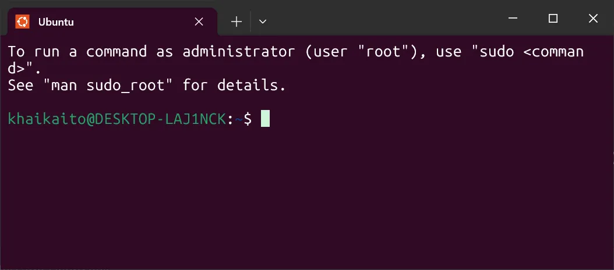
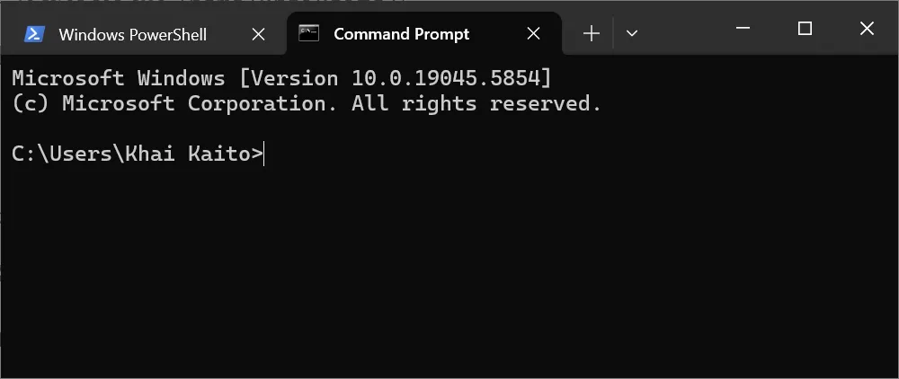
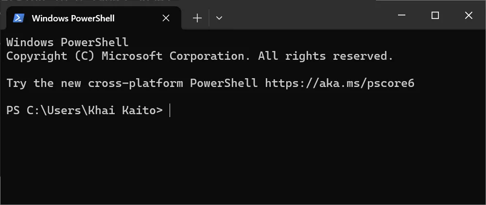

# Phân biệt các loại Terminal dựa vào giao diện
# Windows Terminal (PowerShell hoặc Command Prompt) và Ubuntu Terminal (WSL2) khác nhau ra sao

## 1. **Khác biệt về đường dẫn**
### 1.1  Ubuntu Terminal (WSL2)
>

>khaikaito: Tên người dùng Linux trong WSL2.

>@DESKTOP-LAJINCK: Hostname của WSL2 (thường kế thừa từ Windows).

>~: Thư mục hiện tại (~ là viết tắt của /home/khaikaito/).

>$: Dấu hiệu cho biết bạn đang dùng quyền người dùng thường (nếu là # nghĩa là root).

>Môi trường:
>>- Chạy bash/zsh trong môi trường Linux (Ubuntu).
>>- Sử dụng hệ thống tệp Linux (ví dụ: /home/, /etc/).
### 1.2. Windows Terminal (PowerShell hoặc Command Prompt)
>
>

>**Ý nghĩa:**
>- PS: Viết tắt của PowerShell (nếu là cmd thì là Command Prompt).
>- C:\Users\Khai Kaito: Đường dẫn thư mục hiện tại trong hệ thống tệp Windows.
>-  Dấu nhắc lệnh (tương tự $ trong Linux) **`>`**

>**Môi trường:**
>- Chạy PowerShell/cmd trong môi trường Windows.
>- Sử dụng hệ thống tệp Windows (ví dụ: C:\, D:\).

>**Note**: `Command Prompt ra đời sớm từ thời MS-DOS 1981 , chỉ chạy tác vụ đơn giản hơn so với Window Shell (ra đời 2006)`
## 2. **Tại sao có sự khác biệt này?**
**Hệ điều hành khác nhau:**

>- Ubuntu terminal chạy trên WSL2 (một máy ảo Linux nhẹ tích hợp trong Windows).
>- Windows terminal chạy trực tiếp trên Windows kernel.

**Hệ thống tệp tách biệt:**

>- Ubuntu: Truy cập tệp Linux tại /home/ hoặc /mnt/c/ (nếu muốn truy cập ổ đĩa Windows).
>- Windows: Truy cập trực tiếp tệp Windows tại C:\Users\.

**Cách chuyển qua lại giữa 2 hệ thống**
>Nếu muốn chuyển đổi giữa hai môi trường trong cùng một cửa sổ terminal, bạn có thể:
>- Từ PowerShell: Gõ wsl để vào Ubuntu.
>- Từ Ubuntu: Gõ exit để quay lại PowerShell.

## Tài liệu phải đọc:

> ⭐ **Theo dõi [kênh Threads](https://www.threads.com/@kaitaku.88) để đọc bài mới mỗi ngày!** ⭐  

**[<== Bài Trước  ](link)          |[  Trang Chủ  ](./README.md)|           [  Bài Sau ==>](link)**