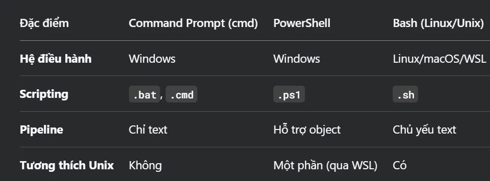

# Phân biệt giữa Shell và Bash
> Câu "`The default Unix Shell for Linux operating systems is usually Bash`." có nghĩa là: "Shell mặc định của các hệ điều hành Linux thường là `Bash`."

## 1. Giải thích sự khác nhau giữa Shell và Bash:
### 1.1 Shell là gì?

`Shell` là một chương trình giao tiếp giữa người dùng và hệ điều hành (Linux/Unix). Nó nhận lệnh từ người dùng (hoặc script) và chuyển đến hệ điều hành để thực thi.

Có nhiều loại Shell khác nhau, ví dụ:

- `Bash` (Bourne-Again Shell)
- sh (Bourne Shell)
- zsh (Z Shell)
- fish (Friendly Interactive Shell)
- csh/tcsh (C Shell)

### 1.2 Bash là gì?

- `Bash` là một loại Shell cụ thể, ra đời năm 1989, kế thừa từ sh (Bourne Shell) và bổ sung nhiều tính năng mới (auto-completion, scripting mạnh mẽ, biến môi trường, v.v.).

- `Bash` là Shell mặc định trên hầu hết hệ điều hành Linux (Ubuntu, Fedora, CentOS) và macOS (trước phiên bản Catalina 10.15).

- Khi bạn mở `Terminal` trên Linux, thường sẽ chạy `Bash`.

- Nếu bạn gõ `echo $SHELL`, kết quả thường là `/bin/bash`.

- Bạn có thể chuyển sang Shell khác (vd: chsh -s /bin/zsh để dùng Z Shell).

→ `Tóm lại: Shell là giao diện dòng lệnh nói chung, còn Bash là một Shell phổ biến, mặc định trên Linux`.

## 2. Vậy Window PowerShell và Command Prompt là loại shell hay bash
`Windows PowerShell` và `Command Prompt (cmd.exe)` đều là `shell trên Windows`, nhưng chúng `không phải là Bash` và cũng `không thuộc họ Unix/Linux shell`:
### 2.1. Command Prompt (cmd.exe)
>- Là shell gốc của Windows, ra đời từ thời MS-DOS.
>- Không phải Unix/Linux shell, mà là một shell riêng của Windows.
>- Cú pháp đơn giản, chủ yếu dùng để chạy lệnh cơ bản (dir, copy, ping, ...).
>- Không hỗ trợ scripting mạnh như Bash (dùng file .bat hoặc .cmd thay vì .sh).

### 2.2. Windows PowerShell
>- Là shell hiện đại của Microsoft, tích hợp sâu với hệ thống Windows.
>- Không phải Bash, nhưng có một số tính năng tương tự (pipeline, scripting).
>- Dùng cú pháp khác Bash, nhưng mạnh mẽ hơn Command Prompt:
>- Hỗ trợ đối tượng (object) thay vì chỉ văn bản (vd: lệnh trả về object có thuộc tính).
>- Scripting dùng file .ps1 (tương tự `.sh của Bash`).
>- `Có thể chạy lệnh Unix-like nếu cài thêm Windows Subsystem for Linux (WSL)`.

### 2.3. So sánh với Bash (Linux/Unix Shell)
>
### 2.4. Bash trên Windows?
>- Nếu muốn dùng Bash trên Windows, bạn cần cài:
>- Windows Subsystem for Linux (WSL): Chạy Bash và các lệnh Linux trực tiếp.
>- Git Bash (đi kèm Git for Windows): Mô phỏng Bash cơ bản.

## **Tóm lại:**
Command Prompt và PowerShell là shell của Windows, không phải Bash.

Bash là shell mặc định của Linux/macOS, nhưng có thể chạy trên Windows qua WSL hoặc Git Bash.

PowerShell mạnh hơn Command Prompt nhờ hỗ trợ scripting và đối tượng, nhưng vẫn khác biệt so với Bash.

> ⭐ **Theo dõi [kênh Threads](https://www.threads.com/@kaitaku.88) để đọc bài mới mỗi ngày!** ⭐  

**[<== Bài Trước  ](link)          |[  Trang Chủ  ](./README.md)|           [  Bài Sau ==>](link)**