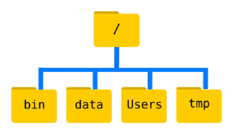
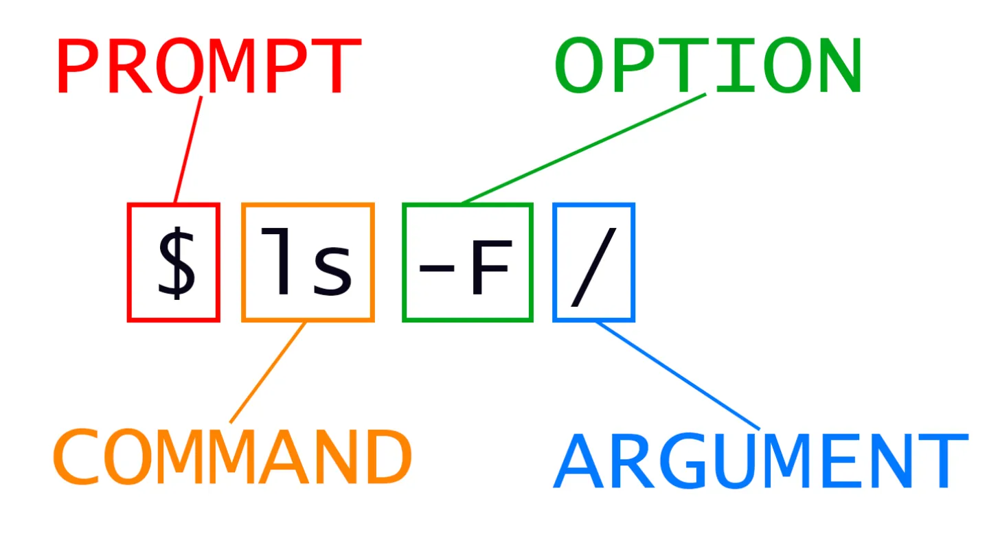

# Điều hướng File và Thư mục dùng CLI
## 1. Xem Ta Đang làm việc ở đâu
Phần của hệ điều hành chịu trách nhiệm quản lý tệp và thư mục được gọi là `file system`. Nó sắp xếp dữ liệu của chúng ta thành các `file` , chứa thông tin và các `directories` (còn gọi là '`folders`'), chứa các tệp hoặc các thư mục khác.

Một số lệnh thường được sử dụng để tạo, kiểm tra, đổi tên và xóa các tệp và thư mục. Để bắt đầu khám phá chúng, chúng ta sẽ vào cửa sổ shell đang mở của mình.

Trước tiên, hãy tìm hiểu xem chúng ta đang ở đâu bằng cách chạy lệnh `pwd` (viết tắt của `‘print working directory’`). Thư mục giống như địa điểm (places ) — bất kỳ lúc nào khi chúng ta sử dụng shell, chúng ta sẽ ở đúng một nơi gọi là thư mục làm việc hiện tại (`current working directory`). Các lệnh chủ yếu đọc và ghi files trong thư mục làm việc hiện tại, vì vậy việc biết bạn đang ở đâu trước khi chạy lệnh là rất quan trọng. pwd cho bạn biết bạn đang ở đâu:
```
$ pwd
```
Kết quả Output:
```
/Users/nelle
```
***Ở đây, phản hồi của máy tính là /Users/nelle, đây là thư mục home của Nelle (Home Directory).***

Đường dẫn thư mục `home` sẽ trông khác nhau trên các hệ điều hành khác nhau. Trên Linux, nó có thể trông giống như `/home/nelle`, và trên Windows, nó sẽ giống như `C:\Documents and Settings\nelle` or `C:\Users\nelle`. *(Lưu ý rằng nó có thể trông hơi khác nhau đối với các phiên bản Windows khác nhau.*) Trong các ví dụ sau, chúng tôi đã sử dụng đầu ra Mac làm mặc định - đầu ra Linux và Windows có thể hơi khác nhau nhưng nhìn chung sẽ giống nhau.

Chúng tôi cũng sẽ giả định rằng lệnh `pwd` của bạn trả về thư mục `home` của người dùng. Nếu `pwd` trả về thứ gì đó khác, bạn có thể cần điều hướng đến đó bằng `cd` *(nếu không thì một số lệnh trong bài học này sẽ không hoạt động như đã viết)*. [Xem Khám phá các thư mục khác để biết thêm chi tiết về lệnh `cd`](https://swcarpentry.github.io/shell-novice/02-filedir.html#exploring-other-directories).

## 2. `home directory` (thư mục người dùng ) và `root directory` (thư mục gốc)
Để hiểu `‘thư mục gốc’` là gì, chúng ta hãy xem xét cách hệ thống tệp được tổ chức như một tổng thể. Vì mục đích của ví dụ này, chúng ta sẽ minh họa hệ thống tệp trên máy tính của nhà khoa học Nelle. Sau minh họa này, bạn sẽ học các lệnh để khám phá hệ thống tệp của riêng bạn, được xây dựng theo cách tương tự, nhưng không hoàn toàn giống hệt nhau.

Trên máy tính của Nelle, hệ thống tệp trông như thế này:


Nhìn `file system` giống như 1 cái cây ngược . Thư mục cao nhất chính là thư mục gốc (`root directory`), nó chứa mọi thứ khác. Chúng tôi gọi nó bằng `ký tự gạch chéo, /`, ký tự này là `dấu gạch chéo đầu tiên trong /Users/nelle..`

Bên trong thư mục đó có một số thư mục khác: `bin` (nơi lưu trữ một số chương trình tích hợp), `data` (dành cho các tệp dữ liệu hỗn hợp), `Users` (nơi lưu trữ các thư mục cá nhân của người dùng), `tmp` (dành cho các tệp tạm thời không cần lưu trữ lâu dài), v.v.

Chúng ta biết rằng thư mục làm việc hiện tại của chúng ta /`Users/nelle` được lưu trữ bên trong `/Users` vì `/Users` là phần đầu tiên của tên của nó. Tương tự như vậy, chúng ta biết rằng `/Users` được lưu trữ bên trong `thư mục gốc / `vì tên của nó bắt đầu bằng` /`.

***`Slashes (Dấu gạch chéo)`***  
>- Lưu ý rằng có hai ý nghĩa cho ký tự` /`. Khi nó xuất hiện ở phía trước tên tệp hoặc thư mục, nó ám chỉ thư mục gốc (`root directory)`.   
>- Khi nó xuất hiện bên trong đường dẫn, `nó chỉ là dấu phân cách`.

Bên dưới `/Users`, chúng ta tìm thấy một thư mục cho mỗi người dùng có tài khoản trên máy của Nelle, các đồng nghiệp của cô ấy là `imhotep` và `larry`.


Các tệp của người dùng imhotep được lưu trữ trong `/Users/imhotep`, của người dùng larry trong `/Users/larry `và của Nelle trong `/Users/nelle`. Nelle là người dùng trong các ví dụ của chúng tôi ở đây; do đó, chúng tôi lấy `/Users/nelle` làm `thư mục người dùng` của mình. Thông thường, khi bạn mở command prompt mới, bạn sẽ ở trong `home directory` của mình để bắt đầu.  
>`Thư mục người dùng (home directory)` → nơi mỗi người có "không gian riêng" để lưu trữ dữ liệu của mình.

>`Thư mục gốc toàn hệ thống (root directory)` → như "cái nôi" của toàn bộ hệ điều hành, nơi bắt đầu của mọi đường dẫn.

Bây giờ chúng ta hãy tìm hiểu lệnh cho phép chúng ta xem nội dung của hệ thống tệp của riêng mình. Chúng ta có thể xem những gì có trong thư mục `home` của mình bằng cách chạy `ls`:
```
$ ls
```
Kết quả là:
```

Applications Documents    Library      Music        Public
Desktop      Downloads    Movies       Pictures
```

*(Một lần nữa, kết quả của bạn có thể hơi khác một chút tùy thuộc vào hệ điều hành và cách bạn tùy chỉnh hệ thống tệp của mình.)*

`ls` in tên các tệp và thư mục trong thư mục hiện tại. Chúng ta có thể làm cho đầu ra của nó dễ hiểu hơn bằng cách sử dụng tùy chọn `-F`, tùy chọn này yêu cầu `ls` phân loại đầu ra bằng cách thêm một dấu hiệu vào tên tệp và thư mục để chỉ ra chúng là gì:

>- dấu `/` theo sau chỉ ra rằng đây là một thư mục
>- `@` chỉ ra một liên kết
>- `*` chỉ ra một tệp thực thi

Tùy thuộc vào cài đặt mặc định của shell, shell cũng có thể sử dụng màu để chỉ ra liệu mỗi mục nhập là tệp hay thư mục.
```
$ ls -F
```

Kết quả đầu ra:
```
Applications/ Documents/    Library/      Music/        Public/
Desktop/      Downloads/    Movies/       Pictures/
```

Ở đây, chúng ta có thể thấy rằng thư mục `home` chỉ chứa các thư mục con. Bất kỳ tên nào trong đầu ra không có ký hiệu phân loại đều là các tệp trong thư mục làm việc hiện tại.

## 3. Lệnh `clear` 
Khi thấy màn hình quá lộn xộn có thể dùng lệnh `clear` để xóa. Bạn vẫn có thể truy cập các lệnh trước đó bằng cách sử dụng `↑` và `↓` để di chuyển từng dòng hoặc bằng cách cuộn trong `terminal` của bạn.
## 4. Lệnh trợ giúp `help`

`ls `có nhiều tùy chọn khác. Có hai cách phổ biến để tìm hiểu cách sử dụng lệnh và các tùy chọn mà nó chấp nhận — tùy thuộc vào môi trường của bạn, bạn có thể thấy rằng chỉ có một trong những cách sau hoạt động:

- Sử dụng tùy chọn `--help `cho bất kỳ lệnh nào (available on Linux and Git Bash), ví dụ:
```
$ ls --help
```
- Có thể sổ tay (manual) với lệnh `man` (available on Linux and macOS):
```
$ man ls
```
- Lệnh này sẽ biến terminal của bạn thành một trang mô tả về lệnh ls và các tùy chọn của lệnh này.

- Để điều hướng qua các trang hướng dẫn, bạn có thể sử dụng ↑ và ↓ để di chuyển từng dòng, hoặc thử b và phím cách để bỏ qua lên và xuống một trang đầy đủ. Để tìm kiếm một ký tự hoặc từ trong các trang hướng dẫn, hãy sử dụng / theo sau là ký tự hoặc từ bạn đang tìm kiếm. Đôi khi tìm kiếm sẽ cho ra nhiều kết quả. Nếu vậy, bạn có thể di chuyển giữa các kết quả bằng cách sử dụng N (để di chuyển về phía trước) và Shift+N (để di chuyển về phía sau). Để thoát khỏi các trang hướng dẫn, hãy nhấn q.

- Tất nhiên, có một cách thứ ba để truy cập trợ giúp cho các lệnh: tìm kiếm trên internet thông qua trình duyệt web của bạn. Khi sử dụng tìm kiếm trên internet, hãy bao gồm cụm từ unix man page trong truy vấn tìm kiếm của bạn sẽ giúp tìm thấy kết quả có liên quan. GNU cung cấp các liên kết đến các hướng dẫn sử dụng của mình bao gồm các tiện ích GNU cốt lõi, bao gồm nhiều lệnh được giới thiệu trong bài học này.


### 4.1 Dùng lệnh `help` cho các lệnh tích hợp sẵn
Vài lệnh được tích hợp sẵn trong Bash shell hơn là tồn tại như 1 chương trình riêng biệt trên filesystem. Một ví dụ là lệnh `cd (change directory)` . Nếu nhận được thông báo `No manual entry for cd`, hãy thử `help cd`. Lệnh `help` là cách mà bạn nhận được thông tin hữu ích cho các lệnh tích hợp sẵn (xem [`Bash built-ins`](https://www.gnu.org/software/bash/manual/html_node/Bash-Builtins.html)).

Như mình thử nghiệm thì thấy 2 lệnh `cd - - help` và `help cd `đều hoạt động, còn lệnh `man cd` sẽ cho thông báo là `No manual entry for cd`
## 5. Tùy chọn --help

Hầu hết các lệnh và chương trình mà mọi người đã viết để chạy trong bash đều hỗ trợ tùy chọn `--help` để hiển thị thêm thông tin về cách sử dụng các lệnh hoặc chương trình đó. Ví dụ khi gõ lệnh `ls--help`:
```
Usage: ls [OPTION]... [FILE]...
List information about the FILEs (the current directory by default).
Sort entries alphabetically if neither -cftuvSUX nor --sort is specified.

Mandatory arguments to long options are mandatory for short options, too.
  -a, --all                  do not ignore entries starting with .
  -A, --almost-all           do not list implied . and ..
      --author               with -l, print the author of each file
  -b, --escape               print C-style escapes for nongraphic characters
      --block-size=SIZE      scale sizes by SIZE before printing them; e.g.,
                               '--block-size=M' prints sizes in units of
                               1,048,576 bytes; see SIZE format below
  -B, --ignore-backups       do not list implied entries ending with ~
  -c                         with -lt: sort by, and show, ctime (time of last
                               modification of file status information);
                               with -l: show ctime and sort by name;
                               otherwise: sort by ctime, newest first
  -C                         list entries by columns
      --color[=WHEN]         colorize the output; WHEN can be 'always' (default
                               if omitted), 'auto', or 'never'; more info below
  -d, --directory            list directories themselves, not their contents
  -D, --dired                generate output designed for Emacs' dired mode
  -f                         do not sort, enable -aU, disable -ls --color
  -F, --classify             append indicator (one of */=>@|) to entries
...        ...        ...
```

**List information about the FILEs (the current directory by default):**
Liệt kê thông tin về tệp/thư mục được chỉ định (nếu không chỉ định, mặc định là thư mục hiện tại).

**Sort entries alphabetically if neither -cftuvSUX nor --sort is specified:**
Nếu không dùng các tùy chọn sắp xếp (-cftuvSUX hoặc --sort), kết quả sẽ được sắp xếp theo bảng chữ cái.

**Mandatory arguments to long options are mandatory for short options, too:**
Các đối số bắt buộc của tùy chọn dài (ví dụ: --block-size=SIZE) cũng bắt buộc với tùy chọn ngắn tương ứng (ví dụ: -B).

## 6. Tùy chọn ngắn và Tùy chọn dài (Short Option và Long Option)
Trong các lệnh Linux/Unix (như `ls, grep, find`,...), tùy chọn ngắn (**short option**) và tùy chọn dài (**long option**) là hai cách khác nhau để chỉ định cùng một tính năng. Dưới đây là cách phân biệt chúng:

### 6.1. Tùy chọn ngắn (Short Option)
**Cú pháp:** 
`Một dấu gạch ngang -` và  `một ký tự đơn (ví dụ: -a, -l, -h)`.

**Đặc điểm:**

- Ngắn gọn, dễ gõ nhanh.

- Thường là viết tắt của tính năng (ví dụ: `-a = --all`, `-h = --human-readable`).
- Có thể kết hợp nhiều tùy chọn ngắn thành một nhóm sau một dấu `-` (ví dụ: `ls -la = ls -l -a`). hoặc `ls - h - l = ls -hl`

- Lệnh `ls -t` : Liệt kê theo thứ tự thời gian, theo thứ từ từ mới nhất đến cũ nhất.
- Lệnh `ls -r` : Liệt kê theo thứ tự ngược lại,
- Khi kết hợp sẽ có: `ls -tr`: Liệt kê theo thứ tự thời gian từ cũ nhất đến mới nhất. Khi đó Tệp được thay đổi gần đây nhất được liệt kê cuối cùng khi sử dụng `-rt`. Điều này có thể rất hữu ích để tìm các chỉnh sửa gần đây nhất của bạn hoặc kiểm tra xem tệp đầu ra mới có được ghi hay không.

**Ví dụ:**
```
ls -a          # Hiển thị tất cả tệp (bao gồm tệp ẩn)
grep -i "text" # Tìm kiếm không phân biệt hoa thường
```
**Dùng tùy chọn ngắn khi:**

- Làm việc trực tiếp trên Terminal, muốn gõ nhanh.

- Kết hợp nhiều tùy chọn (ví dụ: `tar -xzf file.tar.gz`).
### 6.2. Tùy chọn dài (Long Option)
**Cú pháp:**
`Hai dấu gạch ngang --` và  `từ/cụm từ đầy đủ` (ví dụ: `--all`, `--human-readable`).

**Đặc điểm:**

- Dễ đọc, dễ nhớ vì sử dụng tên đầy đủ.

- Thường dùng trong script để tăng tính rõ ràng.

- Không thể kết hợp như tùy chọn ngắn (phải viết riêng lẻ).

**Ví dụ:**
```
ls --all       # Tương đương `ls -a`
grep --ignore-case "text" # Tương đương `grep -i "text"`
```

**Dùng tùy chọn dài khi:**

- Viết script (để code dễ đọc, bảo trì).

- Sử dụng các tùy chọn phức tạp (ví dụ: `--block-size=1M`).
- ***Một số tùy chọn chỉ có dạng dài*** (ví dụ: `ls --color=auto`).

## 7. Exploring Other Directories
Chúng ta không chỉ có thể sử dụng `ls` trên thư mục làm việc hiện tại mà còn có thể sử dụng nó để liệt kê nội dung của một thư mục khác. Hãy xem xét thư mục Desktop của chúng ta bằng cách chạy `ls -F Desktop`, tức là lệnh `ls` với tùy chọn `-F` và đối số `Desktop`. Đối số `Desktop` cho `ls` biết rằng chúng ta muốn liệt kê một thứ gì đó khác với thư mục làm việc hiện tại của chúng ta:

```
$ ls -F Desktop
```
Output:
```
shell-lesson-data/
```
Lưu ý rằng nếu thư mục có tên ``Desktop`` không tồn tại trong thư mục làm việc hiện tại của bạn, lệnh này sẽ trả về lỗi. Thông thường, thư mục ``Desktop`` tồn tại trong thư mục home của bạn, và chúng ta giả định rằng home là thư mục làm việc hiện tại của bash shell của bạn. (Nếu chưa có thứ mục `Desktop` thì cần tạo bằng lệnh `mkdir Desktop` ở bài học trước).

Đầu ra của bạn phải là danh sách tất cả các tệp và thư mục con trong thư mục ``Desktop`` của bạn, bao gồm thư mục `shell-lesson-data` mà bạn đã tải xuống khi thiết lập cho bài học này. (Trên hầu hết các hệ thống, nội dung của thư mục ``Desktop`` trong shell sẽ hiển thị dưới dạng biểu tượng trong giao diện người dùng đồ họa đằng sau tất cả các cửa sổ đang mở. Hãy xem đây có phải là trường hợp của bạn không.)

Việc sắp xếp mọi thứ theo thứ bậc giúp chúng ta theo dõi công việc của mình. Mặc dù có thể đặt hàng trăm file vào thư mục gốc cũng như có thể xếp hàng trăm tờ giấy in trên bàn làm việc, nhưng sẽ dễ tìm hơn nhiều khi chúng được sắp xếp thành các thư mục con có tên hợp lý.

Bây giờ ta đã biết thư mục `shell-lesson-data` được đặt trong thư mục ``Desktop``, chúng ta có thể làm 2 điều:

>**Đầu tiên**, sử dụng cùng chiến lược như trước, chúng ta có thể xem nội dung của nó bằng cách truyền tên thư mục cho `ls`:
```
$ ls -F Desktop/shell-lesson-data
```
OUTPUT
```
exercise-data/  north-pacific-gyre/
```
>**Thứ hai**, chúng ta thực sự có thể thay đổi vị trí của mình sang một thư mục khác, vì vậy chúng ta không còn ở trong thư mục người dùng `home` nữa.

Lệnh để thay đổi vị trí là `cd `theo sau là tên thư mục để thay đổi thư mục làm việc của chúng ta. `cd` là viết tắt của '`thay đổi thư mục - change directory`', có một chút gây hiểu lầm. Lệnh không thay đổi thư mục; nó thay đổi thư mục làm việc hiện tại của shell. Nói cách khác, nó thay đổi cài đặt của shell cho thư mục mà chúng ta đang ở. Lệnh `cd` tương tự như nhấp đúp vào một thư mục trong giao diện đồ họa để vào thư mục đó.

Giả sử chúng ta muốn chuyển đến thư mục `exercise-data` mà chúng ta đã thấy ở trên. Chúng ta có thể sử dụng chuỗi lệnh sau để đến đó:
```
$ cd Desktop
$ cd shell-lesson-data
$ cd exercise-data
```
Các lệnh này sẽ di chuyển chúng ta từ thư mục `home` vào thư mục `Desktop` , sau đó vào thư mục `shell-lesson-data`, rồi vào thư mục `exercise-data`. Bạn sẽ thấy rằng `cd` không in ra bất cứ thứ gì. Điều này là bình thường. Nhiều lệnh shell sẽ không xuất bất cứ thứ gì ra màn hình khi được thực thi thành công. Nhưng nếu chúng ta chạy `pwd` sau lệnh này, chúng ta có thể thấy rằng hiện tại chúng ta đang ở trong `/Users/nelle/Desktop/shell-lesson-data/exercise-data`.

Nếu chúng ta chạy `ls -F` mà không có đối số ngay bây giờ, nó sẽ liệt kê nội dung của `/Users/nelle/Desktop/shell-lesson-data/exercise-data`, vì đó là nơi chúng ta đang ở:
```
$ pwd

//OUTPUT

/Users/nelle/Desktop/shell-lesson-data/exercise-data
```
```
$ ls -F

//OUTPUT

alkanes/  animal-counts/  creatures/  numbers.txt  writing/
```
Bây giờ chúng ta biết cách đi xuống cây thư mục (tức là cách vào một thư mục con), nhưng làm thế nào để đi lên (tức là làm thế nào để rời khỏi một thư mục và đi vào thư mục cha của nó)? Chúng ta có thể thử như sau:
```
$ cd shell-lesson-data

//ERROR

-bash: cd: shell-lesson-data: No such file or directory
```
Nhưng chúng ta gặp lỗi! Tại sao lại như vậy?

Với các phương pháp của chúng ta cho đến nay, cd chỉ có thể thấy các thư mục con bên trong thư mục hiện tại của bạn. Có nhiều cách khác nhau để xem các thư mục ở trên vị trí hiện tại của bạn; chúng ta sẽ bắt đầu với cách đơn giản nhất.

Có một phím tắt trong shell để di chuyển lên một cấp thư mục. Nó hoạt động như sau:
```
$ cd ..
```
`..` là tên thư mục đặc biệt có nghĩa là "`thư mục chứa thư mục này`", hoặc ngắn gọn hơn, là thư mục cha của thư mục hiện tại. Chắc chắn rồi, nếu chúng ta chạy `pwd` sau khi chạy `cd ..`, chúng ta sẽ trở lại `/Users/nelle/Desktop/shell-lesson-data`:
```
$ pwd

//OUTPUT

/Users/nelle/Desktop/shell-lesson-data
```
Thư mục đặc biệt `..` thường không hiển thị khi chúng ta chạy `ls`. Nếu chúng ta muốn hiển thị nó, chúng ta có thể thêm tùy chọn `-a `vào `ls -F`:
```
$ ls -F -a

//OUTPUT

./  ../  exercise-data/  north-pacific-gyre/
```
`-a `là viết tắt của ‘`hiển thị tất cả show all’ (bao gồm cả các tệp ẩn)`; lệnh này buộc `ls` phải hiển thị cho chúng ta tên tệp và thư mục bắt đầu bằng `.`, chẳng hạn như `..` (nếu chúng ta đang ở trong `/Users/nelle`, lệnh này sẽ đề cập đến thư mục `/Users`). Như bạn có thể thấy, lệnh này cũng hiển thị một thư mục đặc biệt khác có tên là `.`, có nghĩa là ‘`thư mục làm việc hiện tại - the current working directory`’. Có vẻ thừa khi đặt tên cho thư mục này, nhưng chúng ta sẽ sớm thấy một số cách sử dụng.

Lưu ý rằng trong hầu hết các công cụ dòng lệnh, nhiều tùy chọn có thể được kết hợp với `một dấu - `và không có khoảng trắng giữa các tùy chọn;` ls -F -a `tương đương với `ls -Fa.`
### 7.1 Other Hidden Files (Các File ẩn khác)
Ngoài các thư mục ẩn `..` và `.`, bạn cũng có thể thấy một tệp có tên là `.bash_profile`. Tệp này thường chứa các thiết lập cấu hình shell. Bạn cũng có thể thấy các tệp và thư mục khác bắt đầu bằng `..` Đây thường là các tệp và thư mục được sử dụng để cấu hình các chương trình khác nhau trên máy tính của bạn. Tiền tố `.` được sử dụng để ngăn các tệp cấu hình này làm lộn xộn thiết bị đầu cuối khi sử dụng lệnh `ls` chuẩn.

Ba lệnh này là các lệnh cơ bản để điều hướng hệ thống tệp trên máy tính của bạn: ***`pwd, ls và cd`***. Hãy cùng khám phá một số biến thể của các lệnh đó. Điều gì xảy ra nếu bạn nhập `cd` riêng lẻ mà không cung cấp thư mục?

```
$ cd
$ pwd

//OUTPUT

/Users/nelle
```
Hóa ra lệnh `cd không có đối số sẽ đưa bạn trở về thư mục home`, điều này rất tuyệt nếu bạn bị lạc trong hệ thống tệp của riêng mình.

Hãy thử quay lại thư mục `exercise-data` từ trước. Lần trước, chúng ta đã sử dụng ba lệnh, nhưng thực ra chúng ta có thể xâu chuỗi danh sách các thư mục để di chuyển đến `exercise-data` trong một bước:
```
$ cd Desktop/shell-lesson-data/exercise-data
```
Kiểm tra xem chúng ta đã di chuyển đến đúng nơi chưa bằng cách chạy `pwd` và `ls -F`  

Nếu muốn di chuyển lên một cấp từ thư mục dữ liệu, chúng ta có thể sử dụng `cd ..` Nhưng có một cách khác để di chuyển đến bất kỳ thư mục nào, bất kể vị trí hiện tại của bạn là gì.

Cho đến nay, khi chỉ định tên thư mục hoặc thậm chí là đường dẫn thư mục (như trên), chúng ta đã sử dụng đường dẫn tương đối (`relative paths`). Khi bạn sử dụng đường dẫn tương đối với lệnh như `ls` hoặc `cd`, nó sẽ cố gắng tìm vị trí đó từ nơi chúng ta đang ở, thay vì từ gốc của hệ thống tệp (root of the file system).

Tuy nhiên, có thể chỉ định đường dẫn tuyệt đối (`absolute path`) đến một thư mục bằng cách bao gồm toàn bộ đường dẫn của nó từ thư mục gốc, được chỉ ra bằng dấu gạch chéo dẫn đầu. Dấu `slash /` dẫn đầu cho máy tính biết phải theo đường dẫn từ gốc của hệ thống tệp, do đó nó luôn tham chiếu chính xác đến một thư mục, bất kể chúng ta đang ở đâu khi chạy lệnh.

Điều này cho phép chúng ta di chuyển đến thư mục `shell-lesson-data` của mình từ bất kỳ đâu trên hệ thống tệp (bao gồm cả từ bên trong `exercise-data`). Để tìm đường dẫn tuyệt đối mà chúng ta đang tìm kiếm, chúng ta có thể sử dụng `pwd` và sau đó trích xuất phần chúng ta cần di chuyển đến `shell-lesson-data`.

```
$ pwd

//OUTPUT

/Users/nelle/Desktop/shell-lesson-data/exercise-data
```
```
$ cd /Users/nelle/Desktop/shell-lesson-data
```
Chạy `pwd` và `ls -F` để đảm bảo rằng chúng ta đang ở trong thư mục mong đợi.

### 7.2 Two More Shortcuts (Thêm 2 shortcut nữa)

Shell diễn giải `ký tự dấu ngã (~)` ở đầu đường dẫn có nghĩa là `"thư mục home của người dùng hiện tại"`. Ví dụ, nếu thư mục home của Nelle là /`Users/nelle`, thì `~/data` tương đương với `/Users/nelle/data`. Điều này chỉ hoạt động nếu đó là ký tự đầu tiên trong đường dẫn; `here/there/~/elsewhere` không phải là `here/there/Users/nelle/elsewhere`.

Như vậy ta thấy `cd` và `cd ~` đều giúp quay trở về thư mục `home`.

Một phím tắt khác là `ký tự - (gạch ngang, dash)`. `cd` sẽ dịch `-` thành `thư mục trước đó tôi đã ở`, nhanh hơn là phải nhớ, sau đó nhập đường dẫn đầy đủ. Đây là một cách rất hiệu quả để di chuyển qua lại giữa hai thư mục – tức là nếu bạn thực thi cd - hai lần, bạn sẽ quay lại thư mục bắt đầu.

Sự khác biệt giữa `cd ..` và `cd -` là lệnh trước đưa bạn lên (trong hệ thống cây thư mục), trong khi lệnh sau đưa bạn trở lại.

```
$ cd ~/Desktop/shell-lesson-data
$ cd exercise-data/creatures
```
```
$ cd -
```
bạn sẽ thấy bạn quay lại `~/Desktop/shell-lesson-data`. Chạy `cd -` một lần nữa sẽ thấy quay lại: 
```
~/Desktop/shell-lesson-data/exercise-data/creatures
```
## 8. Absolute và Relative Paths (Đường dẫn Tuyệt đối và Tương đối)

Bắt đầu từ `/Users/nelle/data`, Nelle có thể sử dụng lệnh nào sau đây để điều hướng đến thư mục `home` của mình là `/Users/nelle`?

>`cd . ` 
>- Không: `.` là viết tắt của `thư mục hiện tại`.

>`cd /`  
>- Không: `/` là viết tắt của `thư mục gốc / (root directory)`.

>`cd /home/nelle`
>- Không: Thư mục home của Nelle là /Users/nelle.

>`cd ../..`
>- Không: lệnh này tăng lên hai cấp, tức là kết thúc bằng /Users.

>`cd ~` hoặc `cd`
>- Có: `~` là viết tắt của `thư mục home` của người dùng, trong trường hợp này là /Users/nelle.

>`cd home`
>- Không: lệnh này sẽ điều hướng đến một thư mục home trong thư mục hiện tại nếu nó tồn tại (home nay không phải là thư mục `home` của người dùng)

>`cd ~/data/..`
>- Có: phức tạp không cần thiết, nhưng đúng.


>`cd ..`
>- Có: tăng lên một cấp.

### 8.1 Relative Path Resolution
Sử dụng sơ đồ hệ thống tập tin bên dưới, nếu `pwd` hiển thị `/Users/thing`, thì lệnh `ls -F ../backup` sẽ hiển thị gì?

>1. `../backup: No such file or directory`

>2. `2012-12-01 2013-01-08 2013-01-27`

>3. `2012-12-01/ 2013-01-08/ 2013-01-27/`

>4. `original/ pnas_final/ pnas_sub/`


`pwd` hiển thị `/Users/thing` tức là thư mục làm việc hiện tại đang là `/thing`. Khi đó `../backup`, ta thấy `..` sẽ là lên 1 cấp tức là `Users`. Khi đó `../backup` chính là `Users/backup`. Vì vậy lệnh `ls -F /Users/backup` sẽ trả về đáp án số 4.


### 8.2 `ls` Đọc hiểu lệnh
Sử dụng sơ đồ hệ thống tập tin bên dưới, nếu `pwd` hiển thị `/Users/backup` và `-r `yêu cầu `ls` hiển thị mọi thứ theo thứ tự ngược lại, lệnh nào sẽ cho kết quả đầu ra sau:

```pnas_sub/ pnas_final/ original/```


>`ls pwd`
>- Không phải, vì `pwd` không phải tên 1 thư mục

>`ls -r -F`
>- Đúng, vì `ls` không có tên thư mục sẽ liệt kê các file và thư mục trong thư mục làm việc hiện tại

>`ls -r -F /Users/backup`
>- Đúng, với đường dẫn thư mục tuyệt đối được khai báo rõ ràng.

## 9. General Syntax of a Shell Command (Cú pháp chung của lệnh Shell)
Bây giờ chúng ta đã gặp các lệnh, tùy chọn và đối số, nhưng có lẽ sẽ hữu ích khi chính thức hóa một số thuật ngữ.

Hãy xem xét lệnh bên dưới như một ví dụ chung về lệnh, mà chúng ta sẽ phân tích thành các thành phần của nó:

```
$ ls -F /
```


`ls` là lệnh, với tùy chọn `-F` và đối số `/`. Chúng ta đã gặp các tùy chọn bắt đầu bằng `một dấu gạch ngang (-)`, được gọi là tùy chọn ngắn hoặc `hai dấu gạch ngang (--)`, được gọi là tùy chọn dài. [Tùy chọn] thay đổi hành vi của lệnh và Đối số cho lệnh biết lệnh cần thao tác trên cái gì (ví dụ: tệp và thư mục). Đôi khi `tùy chọn` và `đối số` được gọi là tham số (`parameters`). Một lệnh có thể được gọi với nhiều hơn một tùy chọn và nhiều hơn một đối số, nhưng một lệnh không phải lúc nào cũng yêu cầu một đối số hoặc một tùy chọn (tức là `1 lệnh có thể không có tùy chọn và đối số`).

Đôi khi bạn có thể thấy các tùy chọn (Options) được gọi là công tắc (`switches`) hoặc cờ (`flags`), đặc biệt là đối với các tùy chọn không có đối số. Trong bài học này, chúng ta sẽ tiếp tục sử dụng thuật ngữ `tùy chọn` option.

Mỗi phần được phân cách bằng `khoảng trắng`. Nếu bạn bỏ khoảng trắng giữa `ls` và `-F`, shell sẽ tìm kiếm lệnh có tên ls-F, lệnh này không tồn tại. Ngoài ra, `chữ hoa có thể quan trọng`. Ví dụ, `ls -s` sẽ hiển thị kích thước của tệp và thư mục cùng với tên, trong khi `ls -S` sẽ sắp xếp tệp và thư mục theo kích thước, như được hiển thị bên dưới:
```
$ cd ~/Desktop/shell-lesson-data
$ ls -s exercise-data
```
Output:
```
total 28
 4 animal-counts   4 creatures  12 numbers.txt   4 alkanes   4 writing
```
Lưu ý rằng kích thước được trả về bởi lệnh `ls -s `là `blocks`. Vì chúng được định nghĩa khác nhau cho các hệ điều hành khác nhau, bạn có thể không nhận được cùng một số liệu như trong ví dụ.
```
$ ls -S exercise-data
```

Output:

```
animal-counts  creatures  alkanes  writing  numbers.txt
```
Kết hợp tất cả lại với nhau, lệnh `ls -F /` ở trên cung cấp cho chúng ta danh sách các tệp và thư mục trong thư mục gốc `/ (root directory)`. Một ví dụ về kết quả bạn có thể nhận được từ lệnh trên được đưa ra dưới đây:
```
$ ls -F /
```
Output:
```
Applications/         System/
Library/              Users/
Network/              Volumes/
```
### 9.1 Chú ý phân biệt tránh nhầm lẫn giữa:

- `ls /` trong đó `/ `là thư mục gốc `root directory` (đường dẫn tuyệt đối)

- `ls ~` trong đó `~` là thư mục `home directory` của người dùng hiện tại (đường dẫn tuyệt đối)

- `ls .` trong đó `.` là `thư mục hiện tại đang làm việc` (tức là `ls .` và `ls` sẽ có cùng kết quả)

- `ls ..` trong đó `..` là `thư mục cao hơn 1 cấp`

- `ls -` trong đó `-` là thư mục lúc trước đó vừa mới làm việc

## 10. Nelle’s Pipeline: Tổ chức các file
Biết nhiều về các tệp và thư mục như vậy, Nelle đã sẵn sàng sắp xếp các tệp mà máy phân tích sẽ tạo ra.

Cô ấy tạo một thư mục có tên là `north-pacific-gyre` (để nhắc nhở bản thân về nguồn gốc của dữ liệu), thư mục này sẽ chứa các tệp dữ liệu từ máy phân tích và các tập lệnh xử lý dữ liệu của cô ấy.

Mỗi mẫu vật lý của cô ấy đều được dán nhãn theo quy ước của phòng thí nghiệm với một ID mười ký tự duy nhất, chẳng hạn như '`NENE01729A`'. ID này là ID mà cô ấy đã sử dụng trong nhật ký thu thập của mình để ghi lại vị trí, thời gian, độ sâu và các đặc điểm khác của mẫu, vì vậy cô ấy quyết định sử dụng ID này trong tên tệp của mỗi tệp dữ liệu. Vì đầu ra của máy phân tích là văn bản thuần túy, cô ấy sẽ gọi các tệp của mình là `NENE01729A.txt`, `NENE01812A.txt`, v.v. Tất cả 1520 tệp sẽ nằm trong cùng một thư mục.

Bây giờ trong thư mục hiện tại của mình là `shell-lesson-data`, Nelle có thể xem những tệp nào cô ấy có bằng lệnh:

BASH
```
$ ls north-pacific-gyre/
```
Lệnh này cần phải nhập rất nhiều, nhưng cô ấy có thể để shell thực hiện hầu hết công việc thông qua cái gọi là `tab completion`. Nếu cô ấy nhập:

BASH
```
$ ls nor
```
và sau đó nhấn Tab (phím tab trên bàn phím của cô ấy), shell sẽ tự động hoàn thành tên thư mục cho cô ấy:

BASH
```
$ ls north-pacific-gyre/
```
Nhấn Tab một lần nữa không có tác dụng gì, vì có nhiều khả năng; nhấn Tab hai lần sẽ hiển thị danh sách tất cả các tệp.

Nếu Nelle sau đó nhấn `G` rồi nhấn Tab một lần nữa, shell sẽ thêm `‘goo’` vì tất cả các tệp bắt đầu bằng ‘`g`’ đều có chung ba ký tự đầu tiên là `‘goo’`.

BASH
```
$ ls north-pacific-gyre/goo
```
Để xem tất cả các tập tin đó, cô ấy có thể `nhấn Tab thêm hai` lần nữa.

BASH
```
ls north-pacific-gyre/goo
```
Output:
```
goodiff.sh   goostats.sh
```
Tính năng này được gọi là `tab completion` và chúng ta sẽ thấy nó trong nhiều công cụ khác khi tìm hiểu thêm.

## 11. Key Points (Những điểm chính trong bài)
> `Hệ thống tệp (File System)` chịu trách nhiệm quản lý thông tin trên đĩa.

> Thông tin được lưu trữ trong các `Files`, và các Files được lưu trữ trong các `thư mục directories` (`folders`)

> `Thư mục` cũng có thể lưu trữ các thư mục khác, sau đó tạo thành `cây thư mục`.

> `pwd` in thư mục làm việc hiện tại của người dùng (`user’s current working directory`).

> `ls [đường dẫn]` in một danh sách các file hoặc thư mục cụ thể; `ls` tự nó liệt kê thư mục làm việc hiện tại.

> `cd [đường dẫn]` thay đổi thư mục làm việc hiện tại.

> Hầu hết các lệnh đều có các tùy chọn bắt đầu bằng một dấu  `-`.

> Tên thư mục trong đường dẫn được phân tách bằng `/ trên Unix`, nhưng `\ trên Windows`.

> `/` tự nó là `thư mục gốc (root directory)` của toàn bộ hệ thống tệp (File system).

> `Đường dẫn tuyệt đối (absolute path)` chỉ định một vị trí từ gốc của hệ thống tệp (root of the file system).

> `Đường dẫn tương đối (relative path)` chỉ định một vị trí bắt đầu từ vị trí hiện tại.

> `.` tự nó có nghĩa là '`thư mục hiện tại`'; `..` có nghĩa là '`thư mục phía trên thư mục hiện tại`'


## Tài liệu phải đọc tham khảo 
>1. https://swcarpentry.github.io/shell-novice/02-filedir.html
---
> ⭐ **Theo dõi [kênh Threads](https://www.threads.com/@kaitaku.88) để đọc bài mới mỗi ngày!** ⭐  

**[<== Bài Trước  ](link)          |[  Trang Chủ  ](./README.md)|           [  Bài Sau ==>](link)**

