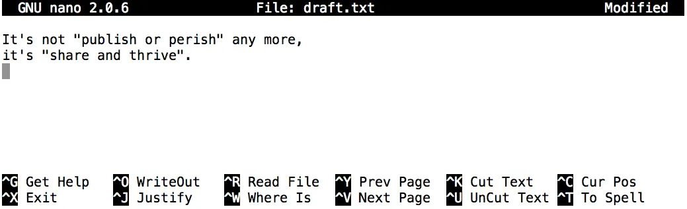

# LÀM VIỆC VỚI FILE VÀ THƯ MỤC 
> **Bài rất dài, nhưng rất hay**
>>- Tạo thư mục
>>- Tạo file
>>- Tạo file bằng cách khác
>>- Đổi tên file, Di chuyển file và thư mục
>>- Sao chép file và thư mục
>>- Xóa file và thư mục
>>- Thao tác với nhiều file và thư mục cùng lúc
>>- Tổ chức file và thư mục >>- 

# 1. Creating directories (Tạo thư mục)
Trước hết xem chúng ta đang ở đâu và chúng ta đã có những gì.

Chúng ta vẫn phải ở trong thư mục `shell-lesson-data` trong `Desktop`, chúng ta có thể kiểm tra bằng cách sử dụng:
```
$ pwd
```
OUTPUT

```
/Users/nelle/Desktop/shell-lesson-data
```

Tiếp theo chúng ta sẽ chuyển đến thư mục `exercise-data/writing` và xem nó chứa những gì:

```
$ cd exercise-data/writing/
$ ls -F
```
OUTPUT
```
haiku.txt  LittleWomen.txt
```
## 1.1 Tạo 1 thư mục
Hãy tạo một thư mục mới có tên là `thesis` bằng lệnh `mkdir thesis` (không có kết quả đầu ra):

```
$ mkdir thesis
```

Như bạn có thể đoán từ tên của nó, `mkdir` có nghĩa là '`make directory`'. Vì `thesis` là `đường dẫn tương đối (tức là không có dấu gạch chéo ở đầu`, như `/what/ever/thesis`), vì vậy thư mục mới được tạo trong thư mục làm việc hiện tại:

```
$ ls -F
```

OUTPUT
```
haiku.txt  LittleWomen.txt  thesis/
```
Vì chúng ta vừa tạo thư mục `thesis` nên chưa có gì trong đó:

```
$ ls -F thesis
```
Lưu ý rằng `mkdir` không giới hạn ở việc tạo từng thư mục riêng lẻ. Tùy chọn `-p` cho phép `mkdir` tạo một thư mục với các thư mục con lồng nhau trong một thao tác duy nhất:

```
$ mkdir -p ../project/data ../project/results
```
Tùy chọn `-R` cho lệnh `ls` sẽ liệt kê tất cả các thư mục con lồng nhau trong một thư mục. Hãy sử dụng `ls -FR` để `liệt kê đệ quy hệ thống phân cấp thư mục` mới mà chúng ta vừa tạo trong thư mục `project`:

```
$ ls -FR ../project
```

OUTPUT

```
../project/:
data/  results/

../project/data:

../project/results:
```
## 1.2 Hai cách để thực hiện cùng một việc
Sử dụng `shell` để tạo thư mục không khác gì sử dụng `File explore`. Nếu bạn mở thư mục hiện tại bằng `File explore` đồ họa của hệ điều hành, thư mục `thesis` cũng sẽ xuất hiện ở đó.  Như vậy `shell` và `File explore` là hai cách khác nhau để tương tác với tệp Một cách là dùng dòng lệnh, 1 cách là dùng giao diện đồ họa.

## 1.3 Good names cho files và directories
Tên tệp và thư mục phức tạp có thể khiến bạn gặp khó khăn khi làm việc trên dòng lệnh. Sau đây, chúng tôi cung cấp một số mẹo hữu ích cho tên tệp và thư mục của bạn.

>`Không sử dụng khoảng trắng.`
- Khoảng trắng có thể làm cho tên có ý nghĩa hơn, nhưng vì khoảng trắng được sử dụng để phân tách các đối số trên dòng lệnh nên tốt hơn là tránh sử dụng chúng trong tên tệp và thư mục. Bạn có thể sử dụng `-` hoặc `_` thay thế (ví dụ: `north-pacific-gyre/` thay vì `north pacific gyre/`).

>`Không bắt đầu tên bằng - (dấu gạch ngang)`.
- Các lệnh coi tên bắt đầu bằng `-` là tùy chọn.

>`Sử dụng các chữ cái, số, . (period or ‘full stop’), - (dash) và _ (underscore).`
- Nhiều ký tự khác có ý nghĩa đặc biệt trên dòng lệnh. Chúng ta sẽ tìm hiểu về một số ký tự này trong bài học này. Có những ký tự đặc biệt có thể khiến lệnh của bạn không hoạt động như mong đợi và thậm chí có thể dẫn đến mất dữ liệu.

Nếu bạn cần tham chiếu đến tên tệp hoặc thư mục có khoảng trắng hoặc các ký tự đặc biệt khác, bạn nên đặt tên trong dấu nháy đơn, ví dụ `'Thư mục'`.

# 2. Tạo 1 text file

Hãy thay đổi thư mục làm việc của chúng ta thành `thesis` bằng cách sử dụng `cd`, sau đó chạy trình soạn thảo văn bản có tên là `Nano` để tạo một tệp có tên là `draft.txt`:

```
$ cd thesis
$ nano draft.txt
```
### **Which Editor? (trình chỉnh sửa văn bản nào)**  
Khi chúng tôi nói, '`nano là trình soạn thảo văn bản`', chúng tôi thực sự muốn nói đến 'văn bản - text '. Nó chỉ có thể hoạt động với dữ liệu ký tự thuần túy, không phải bảng (tables), hình ảnh hoặc bất kỳ phương tiện thân thiện với con người nào khác. Chúng tôi sử dụng nó trong các ví dụ vì nó là một trong những trình soạn thảo văn bản ít phức tạp nhất. Tuy nhiên, vì đặc điểm này, nó có thể không đủ mạnh hoặc đủ linh hoạt cho công việc bạn cần làm sau này. Trên các hệ thống Unix (như Linux và macOS), nhiều lập trình viên sử dụng `Emacs` hoặc `Vim` (cả hai đều cần nhiều thời gian hơn để học) hoặc trình soạn thảo đồ họa như `Gedit` hoặc `VScode`. Trên Windows, bạn có thể muốn sử dụng `Notepad++`. Windows cũng có một trình soạn thảo tích hợp có tên là `notepad` có thể chạy từ dòng lệnh theo cùng cách như nano cho mục đích của bài học này.

Bất kể bạn sử dụng trình soạn thảo nào, bạn sẽ cần biết nơi nó tìm kiếm và lưu tệp. Nếu bạn khởi động nó từ shell, nó (có thể) sẽ sử dụng thư mục làm việc hiện tại của bạn làm vị trí mặc định. Nếu bạn sử dụng `Start Menu` của máy tính, có thể nó sẽ muốn lưu tệp vào thư mục `Desktop` hoặc `Documents`. Bạn có thể thay đổi điều này bằng cách điều hướng đến thư mục khác khi bạn lần đầu tiên `‘Save As…’`

Hãy nhập một vài dòng văn bản.

Khi đã hài lòng với văn bản của mình, chúng ta có thể nhấn `Ctrl+O` (nhấn phím `Ctrl` hoặc `Control` và trong khi giữ phím này, nhấn phím `O`) để ghi dữ liệu vào đĩa ( write our data to disk). Chúng ta sẽ được yêu cầu cung cấp tên cho tệp sẽ chứa văn bản của mình. Nhấn `Return` (hoặc `Enter`) để chấp nhận mặc định được đề xuất là `draft.txt`.

Sau khi tệp của chúng ta được lưu, chúng ta có thể sử dụng `Ctrl+X `để thoát khỏi trình soạn thảo và quay lại `shell`.
### Control, Ctrl, or ^ Key
Phím `Control` cũng được gọi là phím `‘Ctrl’`. Có nhiều cách khác nhau để mô tả cách sử dụng phím `Control`. Ví dụ, bạn có thể thấy hướng dẫn nhấn phím `Control` và trong khi giữ phím này, nhấn phím `X`, được mô tả như sau:

- `Control-X`

- `Control+X`

- `Ctrl-X`

- `Ctrl+X`

- `^X`

- `C-x`

Trong `nano`, dọc theo phía dưới màn hình, bạn sẽ thấy `^G Get Help` `^O WriteOut`. Điều này có nghĩa là bạn có thể sử dụng `Control-G` để nhận trợ giúp và `Control-O` để lưu tệp của mình.

`nano` không để lại bất kỳ đầu ra nào trên màn hình sau khi thoát, nhưng `ls` hiện cho thấy chúng ta đã tạo một tệp có tên là `draft.txt`:
```
$ ls
```
OUTPUT
```
draft.txt
```

# 3. Creating Files a Different Way (Tạo các file bằng cách khác)
Chúng ta đã thấy cách tạo tệp văn bản bằng trình soạn thảo nano. Bây giờ, hãy thử lệnh sau:
```
$ touch my_file.txt
```
Lệnh `touch` tạo ra một tệp mới có tên là `my_file.txt` trong thư mục hiện tại của bạn. Bạn có thể quan sát tệp mới được tạo này bằng cách nhập `ls` tại dấu nhắc dòng lệnh. `my_file.txt` cũng có thể được xem trong trình khám phá tệp GUI của bạn.

Khi bạn kiểm tra tệp bằng lệnh `ls -l`(nó hiển thị kèm theo các kích thước), hãy lưu ý rằng kích thước của `my_file.txt` là 0 byte. Nói cách khác, nó không chứa dữ liệu. Nếu bạn mở `my_file.txt` bằng trình soạn thảo văn bản, nó sẽ trống.

Một số chương trình không tự tạo ra các tệp đầu ra, mà thay vào đó yêu cầu các tệp trống đã được tạo ra trước đó (bởi chương trình khác). Khi chương trình được chạy, nó sẽ tìm kiếm một tệp hiện có để điền vào đầu ra của nó. Lệnh `touch` cho phép bạn tạo hiệu quả một tệp văn bản trống để các chương trình đó sử dụng.

Để tránh nhầm lẫn sau này, chúng tôi khuyên bạn nên xóa tệp bạn vừa tạo trước khi tiếp tục , nếu không, các kết quả đầu ra trong tương lai có thể khác với những kết quả được đưa ra trong bài học. Để thực hiện việc này, hãy sử dụng lệnh sau:
```
$ rm my_file.txt
```
## 3.1 What’s In A Name? (Thành phần của 1 tên file)


Bạn có thể nhận thấy rằng tất cả các files của Nelle đều được đặt tên là '`something dot something`' và trong phần này của bài học, chúng ta luôn sử dụng phần mở rộngrộng. Đây chỉ là một quy ước; chúng ta có thể gọi một tệp là `mythesis` hoặc bất kỳ tên nào khác mà chúng ta muốn. Tuy nhiên, hầu hết mọi người thường sử dụng tên gồm hai phần để giúp họ (và các chương trình của họ) phân biệt các loại tệp khác nhau. Phần thứ hai của tên như vậy được gọi là `phần mở rộng tên tệp (filename extension)` và chỉ ra loại dữ liệu mà tệp chứa: `.txt` báo hiệu tệp văn bản thuần túy, `.pdf` chỉ ra tài liệu PDF, `.cfg `là tệp cấu hình chứa đầy đủ các tham số cho một số chương trình hoặc chương trình khác, `.png` là hình ảnh PNG, v.v.

Đây chỉ là một quy ước, mặc dù là một quy ước quan trọng. Các tệp chỉ chứa byte; chúng ta và các chương trình của chúng ta phải diễn giải các byte đó theo các quy tắc dành cho tệp văn bản thuần túy, tài liệu PDF, tệp cấu hình, hình ảnh, v.v.

Đặt tên cho hình ảnh PNG của một con cá voi là `whale.mp3` không phải là cách kỳ diệu để biến nó thành bản ghi âm bài hát của cá voi, mặc dù nó có thể khiến hệ điều hành liên kết tệp với chương trình phát nhạc. Trong trường hợp này, nếu ai đó nhấp đúp vào `whale.mp3` trong File explorer, trình phát nhạc sẽ tự động (và nhầm lẫn) cố gắng mở tệp `whale.mp3`.

# 4. Đổi tên, Di chuyển các File và Thư mục

Chuyển đến thư mục sau bằng lệnh dưới `shell-lesson-data/exercise-data/writing`
```
$ cd ~/Desktop/shell-lesson-data/exercise-data/writing
```
Trong thư mục `thesis`, chúng ta có một tệp `draft.txt` mà tên không chứa nhiều thông tin, vì vậy hãy đổi tên tệp bằng lệnh `mv`, viết tắt của '`move'`:
```
$ mv thesis/draft.txt thesis/quotes.txt
```
Đối số đầu tiên cho `mv` biết chúng ta đang '`di chuyển - moving' cái gì`, trong khi đối số thứ hai là nơi nó sẽ đến. Trong trường hợp này, chúng ta đang di chuyển `thesis/draft.txt` đến `thesis/quotes.txt`, có tác dụng tương tự như đổi tên tệp. Quả nhiên, chạy lệnh `ls` cho chúng ta thấy rằng `thesis` hiện chứa một tệp có tên là `quotes.txt`:
```
$ ls thesis

//OUTPUT
quotes.txt
```
`Phải cẩn thận` khi chỉ định tên tệp đích (`target file name`), vì `mv` sẽ âm thầm ghi đè lên bất kỳ tệp hiện có nào có cùng tên, điều này có thể dẫn đến mất dữ liệu (*tức là ví dụ nếu như trước đó có 1 tệp là `quotes.txt` đã tồn tại và trong tệp này có dữ liệu, nếu như ta lại chạy lệnh `mv thesis/draft.txt thesis/quotes.txt` thì lúc này toàn bộ dữ liệu trong tệp `quotes.txt` ban đầu sẽ bị ghi đè bởi dữ liệu của `draft.txt`, lúc này `quotes.txt` mới là 1 file hoàn toàn khác cái ban đầu*) Theo mặc định, `mv` sẽ không yêu cầu xác nhận trước khi ghi đè lên tệp. Tuy nhiên, một tùy chọn bổ sung, `mv -i` (hoặc `mv --interactive`), sẽ khiến `mv` yêu cầu xác nhận như vậy.

**Lưu ý rằng `mv` cũng hoạt động trên các thư mục**.

Hãy di chuyển `quotes.txt` vào thư mục làm việc hiện tại (`current working directory`). Chúng ta sử dụng `mv` một lần nữa, nhưng lần này chúng ta sẽ chỉ sử dụng tên của thư mục làm đối số thứ hai để cho `mv` biết rằng chúng ta muốn giữ nguyên tên tệp nhưng đặt tệp ở một nơi mới. (Đây là lý do tại sao lệnh được gọi là 'move'.) Trong trường hợp này, tên thư mục chúng ta sử dụng là tên thư mục đặc biệt . mà chúng ta đã đề cập trước đó (ta đang làm việc trong thư mục writing, lúc này ta sẽ di chuyển tệp từ thư mục `writing/thesis` lên thư mục `writing`):
```
$ mv thesis/quotes.txt 
```
`ls` hiện cho chúng ta thấy `thesis` đang trống:
```
$ ls thesis

//OUTPUT
$
```
Ngoài ra, chúng ta có thể xác nhận tệp `quotes.txt` không còn tồn tại trong thư mục `thesis` bằng cách thử liệt kê tệp đó một cách rõ ràng:

```
$ ls thesis/quotes.txt
```
ERROR
```
ls: cannot access 'thesis/quotes.txt': No such file or directory
```
`ls` với tên tệp hoặc thư mục làm đối số chỉ liệt kê tệp hoặc thư mục được yêu cầu. Nếu tệp được cung cấp làm đối số không tồn tại, shell trả về lỗi như chúng ta đã thấy ở trên. Chúng ta có thể sử dụng điều này để xem `quotes.txt` hiện có trong thư mục hiện tại của chúng ta:

```
$ ls quotes.txt

//OUTPUT
quotes.txt
```
## 4.1 Di chuyển Files đến 1 thư mục mới
Sau khi chạy các lệnh sau, Jamie nhận ra rằng cô ấy đã đặt các tệp `sucrose.dat `và `maltose.dat` vào thư mục sai. Các tệp này phải được đặt trong thư mục `raw`.
```
$ ls -F
 analyzed/ raw/
$ ls -F analyzed
fructose.dat glucose.dat maltose.dat sucrose.dat
$ cd analyzed
```
Điền vào chỗ trống để di chuyển các tập tin này đến thư mục `raw/` (tức là thư mục mà cô ấy quên đặt chúng vào).

```
$ mv sucrose.dat maltose.dat ____/____
```
Câu trả lời:
```
$ mv sucrose.dat maltose.dat ../raw
```
Hãy nhớ rằng `.. `đề cập đến thư mục cha (tức là thư mục phía trên thư mục hiện tại) và `.` đề cập đến thư mục hiện tại.

## 4.2 Các trường hợp khi sử dụng lệnh `mv`
Giả sử trong thư mục làm việc hiện tại ta có thư mục tên là `FolderA`và file `fileA.txt` . 
Vậy nếu ta chạy lệnh sau thì kết quả sẽ là gì?
```
$ mv FolderA FolderB
```
Kết quả sẽ tùy thuộc vào xem trong thư mục làm việc hiện tại có tồn tại `FolderB` hay không.

**Trường hợp 1**: Nếu `FolderB` chưa tồn tại thì lệnh này sẽ là lệnh đổi tên, tức là `FolderA` sẽ được đổi tên thành `FolderB`.

**Trường hợp 2**: Nếu có tồn tại `FolderB` sẵn rồi thì lệnh này sẽ trở thành lệnh di chuyển thực sự, nó sẽ chuyển `FolderA` vào bên trong `FolderB`.

 Giờ ta chạy lệnh:
 ```
 $ mv fileA.txt FolderB 
 ```
 **Trường hợp 1** nếu như thư mục `FolderB` này tồn tại sẵn, shell sẽ di chuyển `fileA.txt` vào bên trong thư mục `FolderB`.

**Trường hợp 2** nếu thực mục `FolderB` này không tồn tại, thì shell sẽ đổi tên `fileA.txt` thành `FolderB` (*và file mới này không có phần mở rộng `.txt`*). Ta chỉ cần chạy lệnh `ls -F` thì sẽ thấy lúc này `FolderB` sẽ xuất hiện không có dấu `/` ở sau cùng (`FolderB/` là thư mục còn `FolderB` sẽ là tên file).

**Tiếp theo ta chạy lệnh sau:**
```
$ mv fileA fileB
```
Lúc này bất kể là `fileB` có tồn tại hay không thì chỉ có 1 kết quả là `fileA` sẽ được đổi tên thành `fileB`, và `fileB` lúc này sẽ chưa nội dung của `fileA` trước đó (*nếu `fileB` có tồn tại trước đó thì nội dung của nó cũng đã bị ghi đè*). Vì làm việc với 2 file nên lệnh `mv` sẽ có tác dụng `rename` chứ không có tác dụng `moving`.

> **QUAN TRỌNG**: `Thay vì đề Shell tự quyết định, chúng ta nên tự mình quyết định sự tồn tại của các file và thư mục trước khi sử dụng lệnh mv.`


# 5. Copying files and directories (Sao chép file, thư mục)
Lệnh `cp` hoạt động rất giống `mv`, ngoại trừ việc nó sao chép một tệp thay vì di chuyển tệp đó. Chúng ta có thể kiểm tra xem nó đã làm đúng chưa bằng cách sử dụng `ls` với hai đường dẫn làm đối số — giống như hầu hết các lệnh Unix, `ls` có thể được cung cấp nhiều đường dẫn cùng một lúc:
## 5.1 Sao chép 1 file

Lệnh dưới đây tạo 1 bản sao của file `quotes.txt` và đặt nó vào trong thư mục `thesis` dưới tên khác là `quotations.txt`:
```
$ cp quotes.txt thesis/quotations.txt
$ ls quotes.txt thesis/quotations.txt
```
Output:
```
quotes.txt   thesis/quotations.txt
```
Trường hợp không chỉ rõ tên của bản sao là `quotations.txt` mà chỉ viết `cp quotes.txt thesis` thì sẽ tạo ra 1 bản sao cùng tên.

## 5.2 Sao chép 1 thư mục
Chúng ta cũng có thể sao chép một thư mục và toàn bộ nội dung của nó bằng cách sử dụng tùy chọn đệ quy `-r`, ví dụ để sao lưu một thư mục `(r là recursive là đệ quy`):
```
$ cp -r thesis thesis_backup
```
Chúng ta có thể kiểm tra kết quả bằng cách liệt kê nội dung của cả thư mục thesis và thesis_backup:
```
$ ls thesis thesis_backup

//OUTPUT
thesis:
quotations.txt

thesis_backup:
quotations.txt
```
Điều quan trọng là phải bao gồm tùy chọn `-r`. Nếu bạn muốn sao chép một thư mục và bạn bỏ qua tùy chọn này, bạn sẽ thấy thông báo rằng thư mục đã bị bỏ qua vì `-r` không được chỉ định. Lý do cần có `r (đệ quy)` vì nó mang ý nghĩa là sao chép cả thư mục và những nội dung bên trong thư mục đó (*sau này học lệnh xóa file là `rm` cũng vậy, nếu cần xóa 1 thư mục thì cần đến `rm -r` với ý nghĩa xóa cả những nội dung bên trong thư mục đó*).

```
$ cp thesis thesis_backup

//Output 
cp: -r not specified; omitting directory 'thesis'
```
## 5.3 Đổi tên Files
Giả sử bạn đã tạo một tệp văn bản thuần túy trong thư mục hiện tại của mình để chứa danh sách các bài kiểm tra thống kê mà bạn sẽ cần thực hiện để phân tích dữ liệu của mình và đặt tên là `statstics.txt`

Sau khi tạo và lưu tệp này, bạn nhận ra mình đã viết sai tên tệp! Bạn muốn sửa lỗi, bạn có thể sử dụng lệnh nào sau đây để thực hiện việc đó?

1. `cp statstics.txt statistics.txt`

- Không. Mặc dù điều này sẽ tạo ra một tệp có tên đúng, nhưng tệp có tên không đúng vẫn tồn tại trong thư mục và cần phải xóa.

2. `mv statstics.txt statistics.txt`

- Có, điều này sẽ có tác dụng đổi tên tệp.

3. `mv statstics.txt .`

- Không, dấu chấm `.` chỉ ra nơi di chuyển tệp, nhưng không cung cấp tên tệp mới; không thể tạo tên tệp giống hệt nhau trong cùng thư mục, nó sẽ báo lỗi là `statstics.txt` và `./statstics.txt` là cùng 1 file.

4. `cp statstics.txt .`

- Tương tự như 3.

## 5.4 Moving và Copying
Đầu ra của lệnh `ls` theo trình tự hiển thị bên dưới là gì?
```
$ pwd

//OUTPUT
/Users/jamie/data
```
```
$ ls

//OUTPUT
proteins.dat
```
```
$ mkdir recombined


//Chúng ta bắt đầu trong thư mục /Users/jamie/data và tạo một thư mục mới có tên là recombined

$ mv proteins.dat recombined/

//di chuyển (mv) tệp proteins.dat đến thư mục mới (recombined).

$ cp recombined/proteins.dat ../proteins-saved.dat

//tạo một bản sao của tệp mà chúng ta vừa di chuyển. 
Phần khó ở đây là nơi tệp được sao chép đến. Hãy nhớ rằng .. có nghĩa là 'lên một cấp', vì vậy tệp được sao chép hiện nằm trong /Users/jamie. Lưu ý rằng .. được diễn giải theo thư mục làm việc hiện tại, không phải theo vị trí của tệp đang được sao chép

$ ls

//Vì vậy, thứ duy nhất sẽ hiển thị khi sử dụng ls (trong /Users/jamie/data) là thư mục recombined.
```
1. `proteins-saved.dat recombined`

2. `recombined`

3. `proteins.dat recombined`

4. `proteins-saved.dat`

=> Đáp án 2


# 6. Removing files and directories (Xóa file, thư mục)
Quay lại thư mục `shell-lesson-data/exercise-data/writing`, chúng ta hãy dọn dẹp thư mục này bằng cách xóa tệp `quotes.txt` mà chúng ta đã tạo. Lệnh Unix mà chúng ta sẽ sử dụng cho việc này là `rm` (viết tắt của `‘remove’`):
## 6.1 Xóa 1 file
```
$ rm quotes.txt
```
Chúng ta có thể xác nhận tập tin đã biến mất bằng cách sử dụng `ls`:
```
$ ls quotes.txt
ERROR
ls: cannot access 'quotes.txt': No such file or directory
```
### Xóa là mãi mãi
Unix shell không có thùng rác để chúng ta có thể khôi phục các tệp đã xóa (mặc dù hầu hết các giao diện đồ họa của Unix đều có). Thay vào đó, khi chúng ta xóa các tệp, chúng sẽ bị hủy liên kết khỏi hệ thống tệp (file system) để không gian lưu trữ của chúng trên đĩa có thể được tái chế. Các công cụ để tìm và khôi phục các tệp đã xóa hiện có, nhưng không có gì đảm bảo chúng sẽ hoạt động trong bất kỳ tình huống cụ thể nào, vì máy tính có thể tái chế không gian ổ đĩa của tệp ngay lập tức.

### Sử dụng `rm` một cách an toàn
Điều gì xảy ra khi chúng ta thực hiện `rm -i thesis_backup/quotations.txt`? Tại sao chúng ta lại muốn có sự bảo vệ này khi sử dụng `rm`?

OUTPUT
```
rm: remove regular file 'thesis_backup/quotations.txt'? y
```
Tùy chọn `-i` sẽ nhắc trước (mỗi) lần xóa (sử dụng `Y `để xác nhận xóa hoặc `N` để giữ lại tệp). Shell Unix không có thùng rác, vì vậy tất cả các tệp đã xóa sẽ biến mất mãi mãi. Bằng cách sử dụng tùy chọn `-i`, chúng ta có cơ hội kiểm tra xem chúng ta chỉ xóa các tệp mà chúng ta muốn xóa.
`i là viết tắt của interactive (tương tác)`, bởi Terminal sẽ yêu cầu bạn tương tác bằng cách nhập `Y` hoặc `N` để xác nhận. 
## 6.2 Xóa 1 thư mục
Nếu chúng ta thử xóa thư mục `thesis` bằng lệnh `rm thesis`, chúng ta sẽ nhận được thông báo lỗi:
```
$ rm thesis
ERROR
rm: cannot remove 'thesis': Is a directory
```
Điều này xảy ra vì theo mặc định, `rm` chỉ hoạt động trên các tệp, không phải thư mục.

`rm` có thể xóa một thư mục và tất cả nội dung của nó nếu chúng ta sử dụng `tùy chọn đệ quy -r` và nó sẽ thực hiện mà không cần bất kỳ lời nhắc xác nhận nào:
```
$ rm -r thesis
```
Do không có cách nào để khôi phục các tệp đã xóa bằng shell, nên `rm -r` phải được sử dụng hết sức thận trọng (*bạn có thể cân nhắc thêm tùy chọn tương tác `rm -r -i` hoặc viết ngắn là `rm -ri`* ).

# 7. Thao tác với nhiều tệp và thư mục cùng 1 lúc 

# 8. Organizing Directories and Files (Tổ chức thư mục và tập tin)
