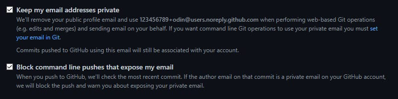

# **Day 13 - Cài đặt Git** Hệ thống quản lý phiên bản (version control system)

> **Git** là một hệ thống kiểm soát phiên bản (**version control system**) rất phổ biến. Bạn sẽ trở nên rất quen thuộc với phần mềm này trong suốt quá trình học, vì vậy đừng quá lo lắng về việc hiểu nó tại thời điểm này. Có nhiều bài học tập trung vào Git sau này trong chương trình.

> **GitHub** là dịch vụ cho phép bạn tải lên, lưu trữ và quản lý mã của mình bằng Git với giao diện web đẹp mắt.

> Mặc dù GitHub và Git nghe có vẻ giống nhau nhưng chúng không giống nhau và thậm chí không được tạo ra bởi cùng một công ty.

## Bước 1 [Cài đặt Git cho Linux](https://www.theodinproject.com/lessons/foundations-setting-up-git#step-1-install-git) 
> (với MacOS và ChromeOS thì xem [tại đây](https://www.theodinproject.com/lessons/foundations-setting-up-git))  
### 1.1 Cập nhật hệ thống
Chạy các lệnh này trong terminal để cập nhật hệ thống Linux:
```
sudo apt update
sudo apt upgrade
```
>- `apt update` Cập nhật danh sách các gói phần mềm từ các `repository` (kho lưu trữ) được cấu hình trong hệ thống. Chỉ cập nhật danh sách gói từ internet (không cài đặt gì).

>- `apt upgrade` Tải và Cài đặt phiên bản mới cho các gói đã có (không thay đổi phụ thuộc).

>- Khi sử dụng lệnh trong terminal yêu cầu bạn nhập mật khẩu để xác thực (chẳng hạn như sudo), bạn sẽ thấy các ký tự không hiển thị khi bạn nhập chúng. Mặc dù có vẻ như terminal không phản hồi, nhưng đừng lo lắng!

>- Đây là tính năng bảo mật để bảo vệ thông tin bí mật, chẳng hạn như cách các trường mật khẩu trên trang web sử dụng dấu hoa thị hoặc dấu chấm. Bằng cách không hiển thị các ký tự bạn viết, terminal sẽ giữ cho mật khẩu của bạn an toàn.

>- Bạn vẫn có thể nhập mật khẩu bình thường và nhấn `Enter` để gửi.

### 1.2 [Cài đặt Git](https://www.theodinproject.com/lessons/foundations-setting-up-git#step-12-install-git) 
Có thể bạn đã cài đặt `git` rồi, nhưng để đảm bảo rằng chúng ta có phiên bản git mới nhất, hãy chạy các lệnh sau:  

```
sudo add-apt-repository ppa:git-core/ppa
sudo apt update
sudo apt install git
```
### 1.3 Verify version (xác nhận phiên bản)
Đảm bảo phiên bản `Git` của bạn ít nhất là 2.28 bằng cách chạy lệnh này:  
```
git --version
```
Nếu số phiên bản nhỏ hơn 2.28, hãy làm theo hướng dẫn một lần nữa.
## Bước 2 [Cấu hình Git và GitHub](https://www.theodinproject.com/lessons/foundations-setting-up-git#step-2-configure-git-and-github)  
### 2.1 Tạo 1 tài khoản GitHub
Truy cập `GitHub.com` và tạo một tài khoản! Trong quá trình thiết lập tài khoản, bạn sẽ được yêu cầu cung cấp địa chỉ email. Đây phải là email thật và sẽ được sử dụng theo mặc định để xác định các đóng góp của bạn. Nếu bạn quan tâm đến quyền riêng tư hoặc chỉ không muốn địa chỉ email của mình được công khai, hãy đảm bảo rằng bạn đánh dấu vào hai ô sau trên trang [`Email Settings`](https://github.com/settings/emails) sau khi bạn đã đăng nhập:
>

Bật hai tùy chọn này sẽ giúp bạn tránh vô tình tiết lộ địa chỉ email cá nhân khi làm việc với Git và GitHub.

Bạn cũng có thể thấy một địa chỉ email bên dưới tùy chọn `Keep my email addresses private`. Đây là địa chỉ **email GitHub riêng tư** của bạn. Nếu bạn định sử dụng địa chỉ này, hãy ghi chú lại ngay vì bạn sẽ cần đến nó khi thiết lập Git ở bước tiếp theo.

### 2.2 [Setup Git](https://www.theodinproject.com/lessons/foundations-setting-up-git#step-22-setup-git)
Để `Git` hoạt động bình thường, chúng ta cần cho nó biết chúng ta là ai để nó có thể liên kết người dùng `Git cục bộ (local Git user = bạn)` với `GitHub`. Khi làm việc trong một nhóm, điều này cho phép mọi người thấy những gì bạn đã committed và ai đã committed từng dòng mã.

Các lệnh bên dưới sẽ cấu hình `Git`. Hãy chắc chắn nhập thông tin của riêng bạn vào trong dấu ngoặc kép (bao gồm cả dấu ngoặc kép!) - nếu bạn chọn giữ email riêng tư trên GitHub, hãy sử dụng email GitHub riêng tư đặc biệt của bạn từ bước 2.1.
```
git config --global user.name "Your Name"
git config --global user.email yourname@example.com
```
Ví dụ, nếu bạn đặt email của mình là riêng tư trên GitHub, lệnh thứ hai sẽ trông giống như thế này:
```
git config --global user.email 123456789+odin@users.noreply.github.com 

# Hãy nhớ sử dụng email GitHub riêng của bạn ở đây.
```
`GitHub` gần đây đã thay đổi nhánh mặc định (`default branch`) trên các kho lưu trữ mới (New repositories) `từ master thành main`. Thay đổi nhánh mặc định cho Git bằng lệnh này:
```
git config --global init.defaultBranch main
```
Bạn cũng có thể muốn đặt hành vi đối chiếu nhánh mặc định của mình thành `merging` (`**Đọc thêm phần phụ lục cuối bài viết**`). Bạn sẽ tìm hiểu ý nghĩa của tất cả các thuật ngữ đó sau trong chương trình giảng dạy, nhưng hiện tại, bạn chỉ cần biết rằng chúng tôi đề xuất chạy lệnh bên dưới như một phần của quy trình thiết lập Git:
```
git config --global pull.rebase false
```
Để xác minh mọi thứ hoạt động bình thường, hãy nhập các lệnh này và kiểm tra xem đầu ra có khớp với tên và địa chỉ email của bạn không:
```
git config --get user.name
git config --get user.email
```
[Đối người dùng macOS cần thực hiện thêm bước này. (Tôi dùng Linux, không phải Mac nên sẽ bỏ qua nó, nhưng để lại link này cho bạn nào cần xem)](https://www.theodinproject.com/lessons/foundations-setting-up-git#for-macos-users)
### 2.3 Create an SSH key
Nếu bạn đã thiết lập cặp khóa `ssh (ssh key pair)` với `GitHub` trên một máy khác trước khi bắt đầu học, `GitHub` cho phép bạn có nhiều cặp khóa được liên kết với tài khoản của mình. Bạn chỉ cần làm theo các hướng dẫn này một lần nữa để thiết lập một cặp khóa khác và đăng ký nó với `GitHub`.

`Khóa SSH` là một mã định danh an toàn về mặt mật mã (`identifier`). Nó giống như một mật khẩu thực sự dài được sử dụng để xác định máy của bạn. `GitHub` sử dụng khóa SSH để cho phép bạn tải lên kho lưu trữ (repository hay repo) của mình mà không cần phải nhập tên người dùng và mật khẩu mỗi lần.

Đầu tiên, chúng ta cần xem bạn đã cài đặt khóa SSH dùng thuật toán `Ed25519` chưa. Nhập lệnh này vào terminal và kiểm tra đầu ra với thông tin bên dưới:
```
ls ~/.ssh/id_ed25519.pub
```
Nếu một thông báo xuất hiện trong console có chứa văn bản` “No such file or directory”`, thì bạn vẫn chưa có khóa `SSH Ed25519` và bạn sẽ cần tạo một khóa. Nếu không có thông báo nào như vậy xuất hiện trong đầu ra của console , bạn có thể tiến hành **bước 2.4**.

Để tạo khóa `SSH` mới, hãy chạy lệnh sau bên trong Terminal:
```
ssh-keygen -t ed25519
```
Khi nó nhắc bạn nhập vị trí để lưu khóa đã tạo, chỉ cần nhấn `Enter`.

Tiếp theo, nó sẽ yêu cầu bạn nhập `mật khẩu`. Mật khẩu này được sử dụng để mã hóa `private SSH key` được lưu trữ trên máy tính của bạn và bạn sẽ được yêu cầu nhập mật khẩu này mỗi khi sử dụng SSH với các khóa này. Nếu bạn không sử dụng mật khẩu, `private SSH key` sẽ có thể được đọc bởi bất kỳ ai có quyền truy cập vào máy tính của bạn và sẽ có thể sửa đổi tất cả các kho lưu trữ `GitHub (repositories)` của bạn. Nhập một mật khẩu nếu bạn muốn, nhưng không bắt buộc. Nếu bạn chọn không sử dụng mật khẩu, chỉ cần nhấn `Enter` mà không cần nhập bất kỳ thứ gì.

### 2.4 Liên kết SSH key với GitHub
Bây giờ, bạn cần cho `GitHub` biết `khóa SSH` của bạn để có thể đẩy mã mà không cần phải nhập mật khẩu mỗi lần.

Đầu tiên, bạn sẽ điều hướng đến nơi `GitHub` nhận `khóa SSH`. Đăng nhập vào `GitHub` và nhấp vào ảnh hồ sơ của bạn ở góc trên bên phải. Sau đó, nhấp vào Cài đặt trong menu thả xuống.

Tiếp theo, ở phía bên trái, nhấp vào `SSH` và `GPG keys`. Sau đó, nhấp vào nút màu xanh lá cây ở góc trên bên phải có ghi `New SSH Key`. Đặt tên cho key của bạn là một cái gì đó đủ mô tả để bạn nhớ khóa `SSH Key` đến từ thiết bị nào, ví dụ `linux-ubuntu`. Để cửa sổ này mở trong khi bạn thực hiện các bước tiếp theo.

Bây giờ bạn cần sao chép `public SSH key` của mình. Để thực hiện việc này, chúng ta sẽ sử dụng lệnh có tên là `cat` để đọc file vào console. (*Lưu ý rằng phần mở rộng tệp `.pub` rất quan trọng trong trường hợp này*.)
```
cat ~/.ssh/id_ed25519.pub
```
Từ `cat` trong lệnh trên là viết tắt của `concatenate` (`nối/ghép nội dung`), nhưng trong trường hợp này, nó được dùng để hiển thị nội dung của file ra màn hình

Đánh dấu và sao chép toàn bộ đầu ra từ lệnh. Nếu bạn làm theo hướng dẫn ở trên, đầu ra có thể sẽ bắt đầu bằng `ssh-ed25519` và kết thúc bằng `tên người dùng@tên máy chủ` của bạn. (`username@hostname`)

Bây giờ, hãy quay lại `GitHub` trong cửa sổ trình duyệt của bạn và dán `key` bạn đã sao chép vào trường `Key`. Giữ nguyên loại khóa là `Authentication Key (Khóa xác thực)` và sau đó, nhấp vào `Add SSH key`. Bạn đã hoàn tất! Bạn đã thêm khóa `SSH` thành công!

### 2.5  Kiểm tra Key
Trong Terminal gõ lệnh:
```
ssh -T git@github.com
# Attempts to ssh to GitHub
```
Bạn có thể thấy một cảnh báo như thế này:
```
The authenticity of host 'github.com (20.205.243.166)' can't be established.
ED25519 key fingerprint is SHA256:+DiY3wvvV6TuJJhbpZisF/zLDA0zPMSvHdkr4UvCOqU.
This key is not known by any other names.
Are you sure you want to continue connecting (yes/no/[fingerprint])?
```
Hãy Xác minh `dấu vân tay (fingerprint)` trong tin nhắn bạn thấy có khớp với dấu vân tay khóa công khai của `GitHub` không (`public key fingerprint`).

Nếu khớp, hãy nhập yes: Kết quả là:
```
> Hi USERNAME! You've successfully authenticated, but GitHub does not
> provide shell access.  
```
Như vậy là đã test thành công. Mặc dù bạn thấy thông báo rằng `“GitHub does not provide shell access.”` Nếu bạn thấy thông báo này, bạn đã thêm khóa `SSH` thành công và bạn có thể tiếp tục. Nếu đầu ra không khớp chính xác, hãy thử thực hiện lại các bước này hoặc vào trò chuyện Discord để yêu cầu trợ giúp.

Nếu xuất hiện lỗi dưới đây thì hãy [tham khảo tại đây](https://docs.github.com/en/authentication/troubleshooting-ssh/error-agent-admitted-failure-to-sign) và [tại đây](https://docs.github.com/en/authentication/troubleshooting-ssh/error-permission-denied-publickey) , Đây là một vấn đề đã biết với một số bản phân phối Linux.
```
...
Agent admitted failure to sign using the key.
debug1: No more authentication methods to try.
Permission denied (publickey).
```

> ***Xem `SSH key fingerprints` ở phụ lục bên dưới.***


# Phụ Lục
>### Hiểu thêm về SSH Key
> `SSH` trong `SSH Key` là viết tắt của `Secure Shell` (tạm dịch: `Giao thức Truyền thông Mạng An toàn`).
>- `Secure (An toàn)`: Dùng mã hóa mạnh (như thuật toán `AES, Ed25519`) để đảm bảo dữ liệu truyền giữa máy bạn và `server` (ví dụ: `GitHub`) không bị đọc trộm.
>- `Shell (Giao diện dòng lệnh)`: Cho phép bạn điều khiển hệ thống từ xa qua cửa sổ `Terminal/Command Prompt`.

>`SSH Key` là một cặp khóa mã hóa gồm:
>- `Private Key (Khóa riêng tư)`: Giống như "chìa khóa nhà" — bạn phải giữ bí mật, không chia sẻ với ai. Lưu ở máy cá nhân (thường nằm trong `~/.ssh/id_rsa`).
>- `Public Key (Khóa công khai)`: Giống như "ổ khóa" — có thể công khai, dùng để xác thực. Bạn upload lên `GitHub/GitLab/server` để hệ thống nhận diện bạn.

→ Khi kết nối, máy chủ (`GitHub`) sẽ kiểm tra xem `Private Key` của bạn có khớp với `Public Key` đã đăng ký hay không. Nếu đúng, bạn được truy cập mà không cần nhập mật khẩu!

Khi tạo `SSH Key` bằng lệnh `ssh-keygen -t ed25519` thì `-t ed25519 `chính là nói kiểu thuật toán mã hóa là `ed25519`, trong đó `t` là viết tắt của `type`. Về bản chất thì sau khi lệnh này hoàn tất nó sẽ tạo ra một thư mục là `.ssh/` và trong thư mục này sẽ chứa 2 file là `id_ed25519` `id_ed25519.pub`. Trong đó cái có phần mở rộng `.pub` chính là `Public Key`, cái còn lại là `Private Key`. Khi ta dùng lệnh sau thì sẽ thấy được cấu trúc thư mục và file trong `home directory`.
```
$ ls ~/.ssh
```
Kết quả: `id_ed25519`  `id_ed25519.pub`
---

> ### GitHub's SSH key fingerprints
`Public key fingerprints` có thể được sử dụng để xác thực một kết nối đến một máy chủ từ xa (`remote server`).

**Hiện này `GitHub` có 4 loại `SSH Key Fingerprint`**:

`SHA256:uNiVztksCsDhcc0u9e8BujQXVUpKZIDTMczCvj3tD2s (RSA)`

`SHA256:br9IjFspm1vxR3iA35FWE+4VTyz1hYVLIE2t1/CeyWQ (DSA - closing down)`

`SHA256:p2QAMXNIC1TJYWeIOttrVc98/R1BUFWu3/LiyKgUfQM (ECDSA)`

`SHA256:+DiY3wvvV6TuJJhbpZisF/zLDA0zPMSvHdkr4UvCOqU (Ed25519)`

---

>### Liên quan đến việc thiết lập hành vi mặc định của Git khi bạn đồng bộ hóa (reconcile) các nhánh (branches), cụ thể là tự động sử dụng phương pháp merge (gộp) thay vì rebase khi bạn kéo code từ remote (ví dụ: git pull).

***Giải thích chi tiết:***

"`Default branch reconciliation behavior" (Hành vi đồng bộ nhánh mặc định)`:

- Khi bạn chạy lệnh `git pull` để cập nhật code từ `remote branch`, `Git` cần kết hợp (`reconcile`) thay đổi từ `remote` với nhánh `local` của bạn.

- Có 2 cách chính để làm điều này:

    - `merge`: Tạo một `commit merge` mới để kết hợp thay đổi.

    - `rebase`: "Di chuyển" `commit local` của bạn lên đầu `commit` mới nhất từ `remote`.

`"Set to merging" (Thiết lập mặc định là merge):`

- Git khuyến nghị dùng `merge` làm mặc định vì nó an toàn hơn (không làm thay đổi lịch sử `commit`), phù hợp với người mới.

- Nếu bạn muốn dùng `rebase` làm mặc định, bạn cần cấu hình rõ ràng.

***Cách thiết lập:***
- Thiết lập `git pull` mặc định sử dụng `merge` (mặc định trên nhiều hệ thống)
```
git config --global pull.rebase false
```

-  Nếu muốn dùng `rebase` làm mặc định (chỉ dành cho người hiểu rõ)
```
git config --global pull.rebase true
```

***Tại sao lại khuyên dùng merge?***  
- `Merge` giữ nguyên lịch sử `commit`, dễ `debug` hơn.

- `Rebase` làm `commit history` "sạch sẽ" hơn nhưng có thể gây rủi ro nếu bạn làm việc trên nhánh công khai (vì nó thay đổi lịch sử).

***Ví dụ minh họa:***  
- Khi bạn chạy `git pull origin main`:

- Nếu `pull.rebase = false` (mặc định): `Git` sẽ tạo một `commit merge` để kết hợp thay đổi.

- Nếu `pull.rebase = true`: `Git` sẽ `rebase commit local` của bạn lên đầu `origin/main`.

**`Nếu bạn không chắc, hãy giữ mặc định là merge để tránh rắc rối!`**
---
> ⭐ **Theo dõi [kênh Threads](https://www.threads.com/@kaitaku.88) để đọc bài mới mỗi ngày!** ⭐  

**[<== Bài Trước  ](link)          |[  Trang Chủ  ](./README.md)|           [  Bài Sau ==>](link)**