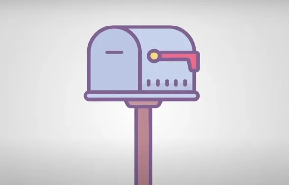
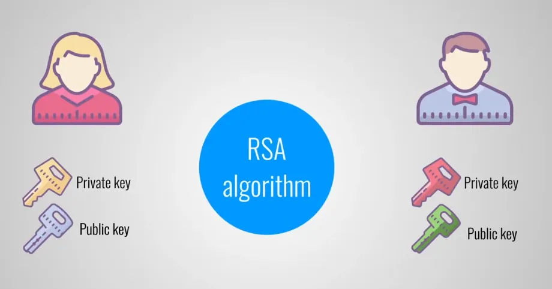
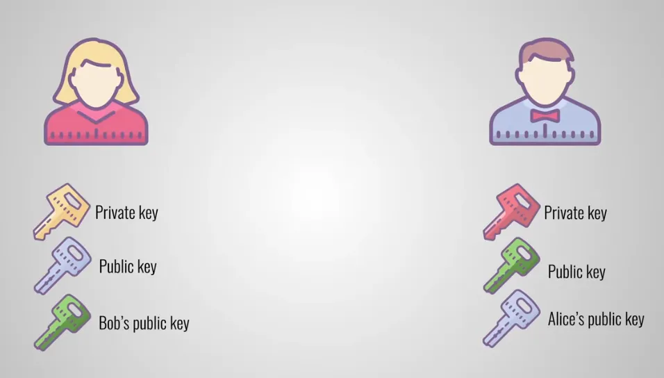
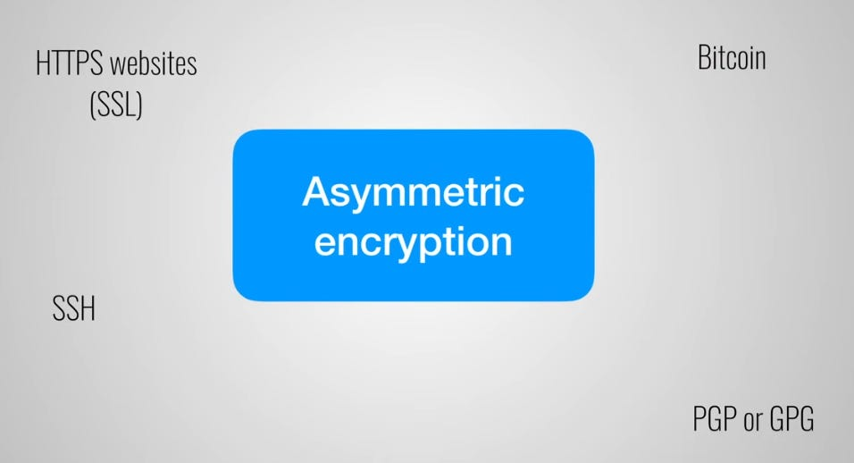

# Hiểu thêm về SSH Key Pairs
> Mã hóa bất đối xứng, Cặp khóa SSH 

> [!Xem video](https://www.youtube.com/watch?v=AQDCe585Lnc) 


Mã hóa (Encryption ) là quá trình lấy một thông điệp và xáo trộn nội dung của nó để chỉ những người nhất định mới có thể xem thông điệp của bạn. Có hai loại mã hóa: mã hóa đối xứng (symmetric )và mã hóa bất đối xứng (asymmetric encryption).

Trước tiên, hãy cùng xem xét mã hóa đối xứng để hiểu lý do tại sao mã hóa bất đối xứng được tạo ra.

Giả sử có 2 người bạn là Alice và Bob. Alice sử dụng một chương trình mã hóa để bảo vệ tài liệu của mình bằng mật khẩu hoặc cụm mật khẩu do cô ấy chọn. Sau đó, cô ấy gửi tài liệu đã mã hóa cho Bob. Tuy nhiên, Bob không thể mở tin nhắn này vì anh ta không biết mật khẩu mà Alice đã sử dụng để mã hóa tài liệu. Nói cách khác: anh ta không có chìa khóa (key) để mở khóa (the lock). Buộc Alice phải chia sẻ mật khẩu với Bob.

Bây giờ đến một vấn đề thực sự: Alice chia sẻ mật khẩu này một cách an toàn với Bob như thế nào?

Gửi qua email là rủi ro vì người khác có thể tìm thấy mật khẩu và sử dụng nó để giải mã bất kỳ tin nhắn nào giữa Alice và Bob.

**`Đây chính xác là loại vấn đề mà mã hóa bất đối xứng muốn giải quyết.`**

Việc sử dụng Mã hóa bất đối xứng có thể so sánh với một hộp thư trên phố. Vị trí của hộp thư là hoàn toàn công khai. Bất kỳ ai biết địa chỉ đều có thể đến hộp thư và bỏ thư vào. Tuy nhiên, chỉ có chủ sở hữu hộp thư mới có chìa khóa để mở hộp thư và đọc tin nhắn.



Quay lại với các chi tiết kỹ thuật. Khi sử dụng mã hóa bất đối xứng, cả Alice và Bob đều phải tạo cặp khóa (key pairs) trên máy tính của họ. Một cách phổ biến và an toàn để thực hiện việc này là sử dụng thuật toán RSA.



Thuật toán này sẽ tạo ra khóa công khai (public key) và khóa riêng tư (private key) được liên kết toán học với nhau. public key có thể được sử dụng để mã hóa dữ liệu và chỉ có private key phù hợp mới có thể được sử dụng để giải mã dữ liệu.

Mặc dù các khóa được liên kết với nhau thành 1 cặp (key pairs) nhưng chúng không thể được lấy từ nhau. Nói cách khác: nếu bạn biết public key của ai đó, bạn cũng không thể suy luận hay tính toán ra được private key của họ.

Nếu chúng ta quay lại ví dụ về hòm thư trên phố thì địa chỉ hòm thư sẽ là khóa công khai, thứ mà mọi người đều được phép biết. Chủ sở hữu hộp thư là người duy nhất có khóa riêng và cần có khóa đó để mở hộp thư.

Bây giờ chúng ta hãy xem xét cách Alice và Bob có thể sử dụng mã hóa bất đối xứng để giao tiếp an toàn với nhau. Họ bắt đầu bằng cách trao đổi khóa công khai của mình. Bob đưa khóa công khai của mình cho Alice và Alice đưa khóa công khai của mình cho Bob. Bây giờ Alice có thể gửi lại tài liệu nhạy cảm của mình. Cô ấy lấy tài liệu và mã hóa nó bằng khóa công khai của Bob. Sau đó, cô ấy gửi tệp cho Bob, người sử dụng khóa riêng của mình để mở khóa tài liệu và đọc nó.



Vì họ sử dụng mã hóa bất đối xứng nên chỉ có Bob mới có thể giải mã được tin nhắn. Ngay cả Alice cũng không thể giải mã được vì cô ấy không có khóa riêng của Bob.

Sức mạnh và tính bảo mật của mã hóa bất đối xứng hiện phụ thuộc vào việc Alice và Bob bảo vệ khóa riêng của họ tốt như thế nào.

Nếu kẻ tấn công đánh cắp được khóa riêng của Alice, khóa đó có thể được sử dụng để giải mã tất cả các tin nhắn dành cho Alice.

Tuy nhiên, kẻ tấn công không thể giải mã các tin nhắn do Alice gửi vì điều đó yêu cầu khóa riêng của Bob.

Mã hóa bất đối xứng được sử dụng ở nhiều nơi mà tính bảo mật thực sự quan trọng.



Bạn có thể không biết, nhưng mỗi lần bạn truy cập một trang web an toàn qua HTTPS, thực ra bạn đang sử dụng mã hóa bất đối xứng. Nó cũng được sử dụng để gửi email an toàn bằng giao thức PGP.

Và một ví dụ cuối cùng: Bitcoin cũng sử dụng mã hóa bất đối xứng để đảm bảo rằng chỉ chủ sở hữu ví tiền mới có thể rút hoặc chuyển tiền từ ví đó.

## **Tại sao lại gọi là “bất đối xứng”**
Public key và private key không thể thay thế cho nhau, sử dụng 2 khóa không thể đổi vai trò. Nếu dữ liệu được mã hóa bằng public key, chỉ private key mới giải mã được (không thể dùng ngược lại).

Mã hóa bất đối xứng (RSA, hay Ed25519) dựa trên Toán học phi đối xứng:

Dựa trên các bài toán một chiều (one-way functions).

- 
# **SSH Key Pairs**
Trong mọi kết nối SSH/SFTP, có bốn khóa (hoặc hai cặp khóa - key pairs) liên quan. Sau đây sẽ giải thích sự khác biệt giữa chúng và những Key mà người dùng máy khách SFTP cần quan tâm.

SSH là một loại mã hóa bất đối xứng, vì vậy nó bao gồm 2 khóa là public-key và private-key, nên chúng được gọi là 1 cặp (key-pairs). 4 khóa này bao gồm:

- User Private Key

- User Public Key - được sử dụng theo hướng từ máy chủ (host) đến máy khách (User).

- Host Private Key

- Host Public Key - được sử dụng theo hướng từ máy khách đến máy chủ.

Như bài trước khi tạo SSH Key để kết nối với máy chủ GitHub bằng lệnh:
```
ssh-keygen -t ed25519
```
Là ta đang tạo ra mã hóa bất đối xứng sử dụng thuật toán Ed25519, thuật toán này hiện đại hơn so với thuật toán RSA đã trình bày ở trên.

Ed25519 là lựa chọn mặc định cho khóa SSH (thay thế RSA 2048-bit)

## User Private Key
Khóa riêng tư của người dùng

Khóa riêng tư của người dùng là khóa được người dùng SSH giữ bí mật trên máy khách của họ. Người dùng không bao giờ được tiết lộ khóa riêng tư cho bất kỳ ai, kể cả máy chủ (quản trị viên máy chủ), để không làm lộ danh tính của họ.

Để bảo vệ khóa riêng, khóa này phải được tạo cục bộ trên máy của người dùng (ví dụ: sử dụng PuTTYgen) và được lưu trữ dưới dạng mã hóa bằng cụm mật khẩu. Cụm mật khẩu phải đủ dài (đó là lý do tại sao nó được gọi là cụm mật khẩu, không phải mật khẩu) để có thể chịu được một cuộc tấn công bằng cách dùng vũ lực (Brute-force attack) trong một thời gian khá dài, trong trường hợp kẻ tấn công lấy được tệp khóa riêng (private key file).

**Brute-force attack**
- Brute-force attack (tấn công vét cạn) là phương pháp tấn công mật mã bằng cách thử tất cả các tổ hợp có thể của mật khẩu hoặc khóa mã hóa cho đến khi tìm ra đúng giá trị. Đây là kiểu tấn công "trâu bò" nhất, dựa trên sức mạnh tính toán để phá bảo mật thay vì khai thác lỗ hổng hệ thống (dùng vũ lực).

**PuTTYgen**
- PuTTYgen là một công cụ miễn phí đi kèm với PuTTY (phần mềm kết nối SSH phổ biến trên Windows), dùng để tạo, quản lý và chuyển đổi khóa SSH (RSA, ECDSA, Ed25519). Nó giúp người dùng tạo cặp khóa public-private key để xác thực an toàn thay vì dùng mật khẩu.

**- **

- OpenSSH format (thường có đuôi id_rsa, id_ed25519) – dùng phổ biến trên Linux/macOS.

- PuTTY format (.ppk) – dùng cho PuTTY/WinSCP trên Windows.

- PEM format (.pem) – thường dùng trong AWS, OpenSSL.

Ta hoàn toàn có thể sử dụng lệnh trong Linux Terminal để tạo cặp key-pair này (xem bài trước về Cài đặt Git)
```
ssh-keygen -t ed25519
```
## User Public Key
Khóa công khai của người dùng

Khóa công khai của người dùng là đối trọng với khóa riêng của người dùng. Chúng được tạo cùng lúc. Khóa công khai của người dùng có thể được tiết lộ an toàn cho bất kỳ ai mà không làm ảnh hưởng đến danh tính người dùng.

Để cho phép xác thực người dùng trên máy chủ, khóa công khai (public key) của người dùng cần được đăng ký trên máy chủ. Trong triển khai máy chủ SSH phổ biến nhất là OpenSSH, file `~/.ssh/authorized_keys` được sử dụng cho mục đích này. (Ở bài trước ta đã nhập Public-Key vào phần Cài đặt của GitHub chính là điều này).

## Host Private Key
Khóa riêng của máy chủ được tạo khi SSH server được thiết lập. Khóa này được lưu trữ an toàn ở một vị trí mà chỉ có quản trị viên máy chủ mới có thể truy cập được. Người dùng kết nối với SSH server không cần quan tâm đến khóa riêng của máy chủ nói chung.

## Host Public Key
Khóa công khai của máy chủ là đối trọng với khóa riêng của máy chủ. Chúng được tạo ra cùng lúc. Khóa công khai của máy chủ có thể được tiết lộ an toàn cho bất kỳ ai mà không làm ảnh hưởng đến danh tính của máy chủ.

Để cho phép ủy quyền máy chủ cho người dùng, người dùng phải được cung cấp khóa công khai máy chủ trước khi kết nối. Ứng dụng máy khách thường nhắc người dùng nhập khóa công khai máy chủ trong lần kết nối đầu tiên để cho phép người dùng xác minh/ủy quyền khóa. Sau đó, khóa công khai máy chủ được lưu và tự động xác minh trong các kết nối tiếp theo. Ứng dụng máy khách sẽ cảnh báo người dùng nếu khóa máy chủ thay đổi.

Cơ chế xác thực máy chủ (host verification) trong kết nối SSH, giúp người dùng tránh bị tấn công "Man-in-the-Middle" (MITM, Nếu không có xác thực host key, hacker có thể chèn mình vào giữa client và server, đánh cắp dữ liệu). Khi kết nối SSH, client (máy người dùng) cần xác nhận rằng server (máy chủ) là đối tượng hợp lệ, không phải server giả mạo. Để làm điều này, server cung cấp host public key cho client kiểm tra trước khi thiết lập kết nối. Lần đầu tiên kết nối đến máy chủ, bằng cách sử dụng dòng lệnh trong terminal, client sẽ nhận được host public key từ server, người dùng cần phải tự xác định xem host public key này có đúng là của máy chủ hay không (làm theo hướng dẫn trong console), nếu đúng thì host public key sẽ được lưu vào máy khách và sẽ được xác thực tự động trong những lần kết nối sau này. Nếu những host public key có sự thay đổi thì ứng dụng trên máy khách sẽ cảnh báo người dùng.

Như vậy sử dụng mã hóa SSH chính là Bảo mật 2 chiều: Không chỉ server xác thực user (bằng user public key), mà user cũng phải xác thực server (bằng host public key)


> ⭐ **Theo dõi [kênh Threads](https://www.threads.com/@kaitaku.88) để đọc bài mới mỗi ngày!** ⭐  

**[<== Bài Trước  ](link)          |[  Trang Chủ  ](./README.md)|           [  Bài Sau ==>](link)**
