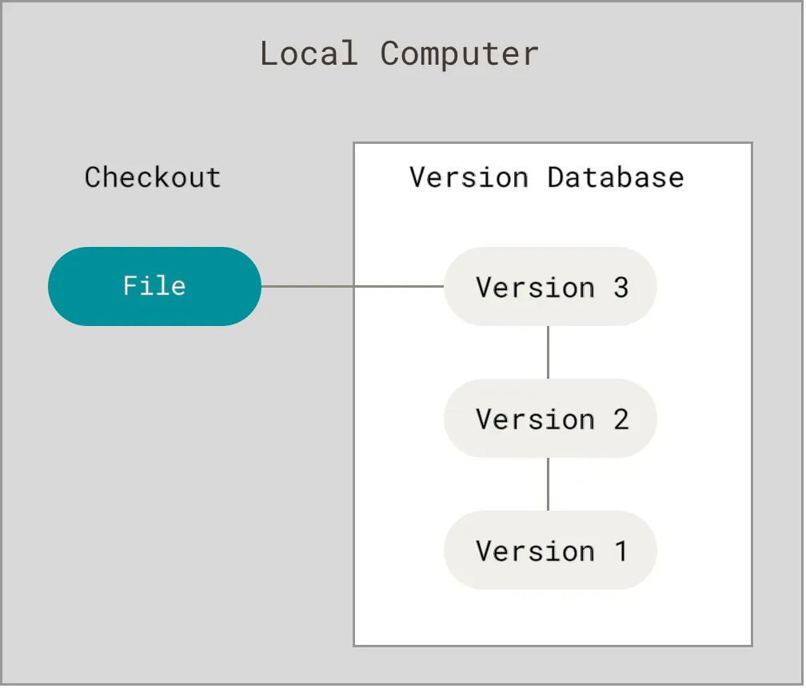
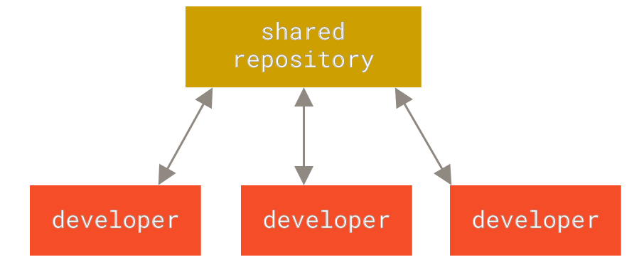
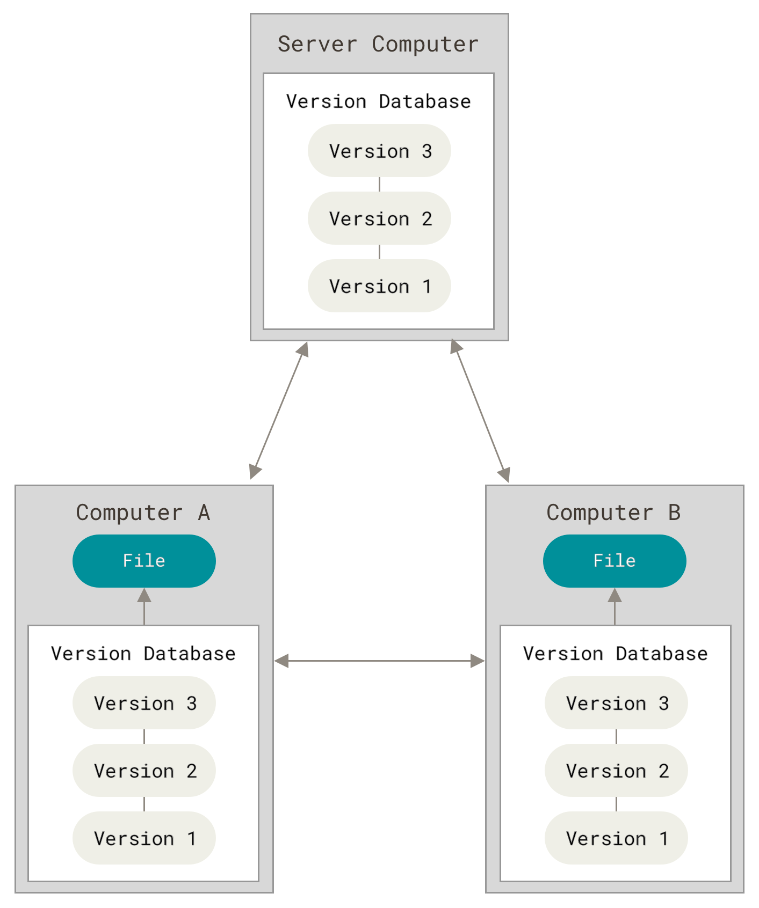
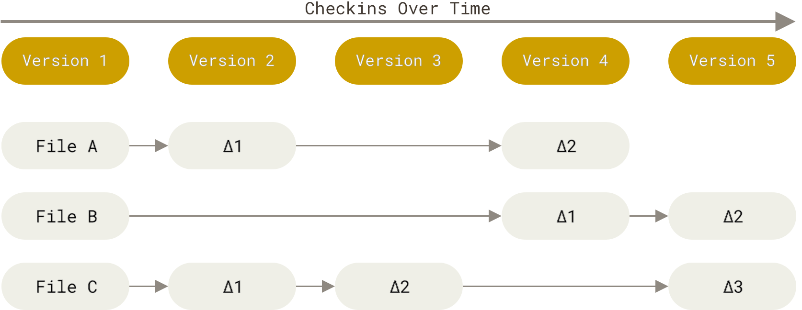
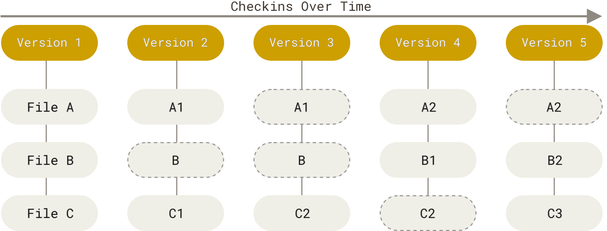
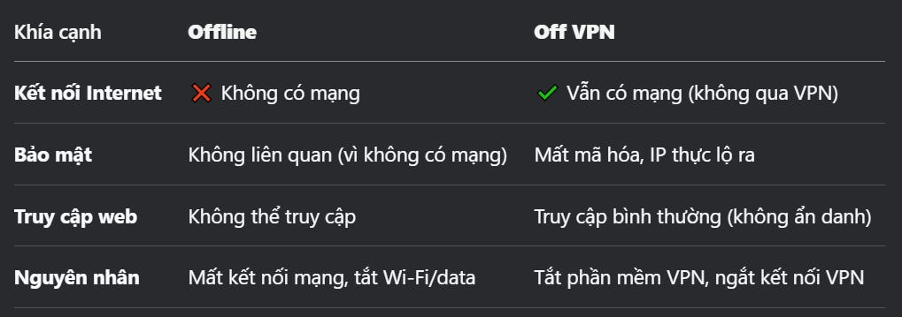
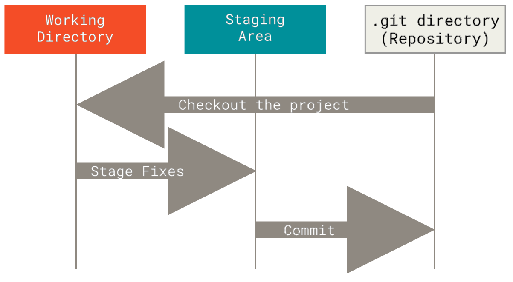

# **Day 15 - Hệ thống quản lý phiên bản Git - Các lệnh thường xuyên sử dụng**

# **A. Các hệ thống quản lý phiên bản**
## `1. Version Control - Quản lý phiên bản`
Chương này sẽ nói về việc bắt đầu sử dụng Git. Chúng ta sẽ bắt đầu bằng cách giải thích một số thông tin cơ bản về các công cụ kiểm soát phiên bản, sau đó chuyển sang cách chạy Git trên hệ thống của bạn và cuối cùng là cách thiết lập để bắt đầu làm việc. Vào cuối chương này, bạn sẽ hiểu lý do tại sao Git lại tồn tại, tại sao bạn nên sử dụng nó và bạn nên thiết lập mọi thứ để làm như vậy.

`“version control - Kiểm soát phiên bản”` là gì và tại sao bạn nên quan tâm? Kiểm soát phiên bản là hệ thống ghi lại các thay đổi đối với một tệp hoặc một tập hợp các tệp theo thời gian để bạn có thể nhớ lại (gọi lại, recall) các phiên bản cụ thể sau này. Bạn có thể thực hiện việc này với hầu hết mọi loại files trên máy tính.

Nếu bạn là một nhà thiết kế đồ họa hoặc web và muốn giữ lại mọi version của hình ảnh hoặc layout (mà bạn chắc chắn muốn), thì Hệ thống kiểm soát phiên bản (VCS) là một thứ rất khôn ngoan để sử dụng. Nó cho phép bạn khôi phục các files đã chọn về trạng thái trước đó, khôi phục toàn bộ dự án về trạng thái trước đó, so sánh các thay đổi theo thời gian, xem ai là người sửa đổi lần cuối thứ gì đó có thể gây ra sự cố, ai đã đưa ra sự cố và khi nào, v.v. Sử dụng VCS cũng thường có nghĩa là nếu bạn làm hỏng mọi thứ hoặc mất files, bạn có thể dễ dàng khôi phục. Ngoài ra, bạn có được tất cả những điều này với rất ít chi phí.

## `2. Local Version Control Systems`
(Hệ thống quản lý phiên bản cục bộ)

Phương pháp kiểm soát phiên bản mà nhiều người lựa chọn là sao chép các tệp vào một thư mục khác (có thể là một thư mục có dấu thời gian, nếu họ thông minh). Cách tiếp cận này rất phổ biến vì nó rất đơn giản, nhưng cũng cực kỳ dễ xảy ra lỗi. Thật dễ quên bạn đang ở thư mục nào và vô tình ghi vào tệp sai hoặc sao chép các tệp mà bạn không muốn.

Để giải quyết vấn đề này, các lập trình viên từ lâu đã phát triển các VCS cục bộ có cơ sở dữ liệu đơn giản lưu giữ tất cả các thay đổi đối với các tệp dưới sự kiểm soát sửa đổi.


Hình 1. Sơ đồ Local version control

Một trong những công cụ VCS phổ biến nhất là hệ thống có tên là RCS, hiện vẫn được phân phối trên nhiều máy tính. RCS hoạt động bằng cách lưu giữ các tập bản vá (patch sets - tức là sự khác biệt giữa các tệp) ở định dạng đặc biệt trên đĩa (ổ cứng); sau đó, nó có thể tạo lại bất kỳ tệp nào trông như thế nào tại bất kỳ thời điểm nào bằng cách cộng tất cả các bản vá.

Vấn đề lớn tiếp theo mà mọi người gặp phải là họ cần phải cộng tác với các nhà phát triển trên các hệ thống khác. Để giải quyết vấn đề này, Hệ thống kiểm soát phiên bản tập trung (CVCS) đã được phát triển.

**`Local = Cục bộ = Tức là không thể cộng tác với người khác`**.
## `3. Centralized Version Control Systems`
(Hệ thống kiểm soát phiên bản tập trung)

Các hệ thống này (như CVS, Subversion và Perforce) có một máy chủ duy nhất chứa tất cả các tệp được phiên bản hóa (versioned files) và một số máy khách kiểm tra các tệp từ vị trí trung tâm đó. Trong nhiều năm, đây đã là tiêu chuẩn cho kiểm soát phiên bản.



Thiết lập này mang lại nhiều lợi thế, đặc biệt là so với VCS cục bộ. Ví dụ, mọi người đều biết ở một mức độ nhất định những gì mọi người khác trong dự án đang làm. Người quản trị có quyền kiểm soát chi tiết đối với việc ai có thể làm gì và việc quản lý CVCS dễ hơn nhiều so với việc xử lý cơ sở dữ liệu cục bộ trên mọi máy khách.t

Tuy nhiên, thiết lập này cũng có một số nhược điểm nghiêm trọng. Nhược điểm rõ ràng nhất là Nếu máy chủ đó ngừng hoạt động trong một giờ, thì trong giờ đó không ai có thể cộng tác hoặc lưu các thay đổi cho bất kỳ thứ gì họ đang làm việc. Nếu ổ cứng (máy chủ) chứa cơ sở dữ liệu trung tâm bị hỏng và không có bản sao lưu phù hợp, bạn sẽ mất hoàn toàn mọi thứ - toàn bộ lịch sử của dự án ngoại trừ bất kỳ ảnh chụp nhanh nào mà mọi người tình cờ có trên máy cục bộ của họ. Các VCS cục bộ cũng gặp phải vấn đề này - bất cứ khi nào bạn có toàn bộ lịch sử của dự án ở một nơi duy nhất, bạn có nguy cơ mất mọi thứ.

**`Centralized = Tập trung = “Bỏ hết trứng vào 1 rổ” = Rủi rỏ mất hết tất cả mọi thứ`**

## `4. Distributed Version Control Systems`
(Hệ thống kiểm soát phiên bản phân tán)  
Đây là nơi Hệ thống kiểm soát phiên bản phân tán (DVCS) bước vào. Trong DVCS (như Git, Mercurial hoặc Darcs), máy khách không chỉ kiểm tra ảnh chụp nhanh (snapshot ) mới nhất của các tệp; thay vào đó, chúng phản ánh toàn bộ kho lưu trữ (repository), bao gồm toàn bộ lịch sử của nó. Do đó, nếu bất kỳ máy chủ nào bị hỏng và các hệ thống (các máy khách) này đang cộng tác thông qua máy chủ đó, bất kỳ kho lưu trữ máy khách nào (client repositories) cũng có thể được sao chép trở lại máy chủ để khôi phục lại. Mỗi bản sao (clone ) thực sự là bản sao lưu đầy đủ (full backup) của tất cả dữ liệu.  



Hơn nữa, nhiều hệ thống trong số này xử lý khá tốt việc có nhiều kho lưu trữ từ xa mà chúng có thể làm việc cùng, do đó bạn có thể cộng tác với nhiều nhóm người khác nhau theo nhiều cách khác nhau cùng lúc trong cùng một dự án. Điều này cho phép bạn thiết lập nhiều loại quy trình công việc (workflows )không thể thực hiện được trong các hệ thống tập trung, chẳng hạn như mô hình phân cấp (hierarchical models.).

**`Distributed = Phân tán = Hạn chế rủi ro`**

# **B. Mở đầu về Git**

Chính thức thì, Git là một hệ thống kiểm soát phiên bản (phân tán). Nó thực sự giống như là một Save Button cho files và thư mục của bản. Nếu chỉ đơn giản là Save thông tin cho files hoặc thư mục thì cần gì đến Git?

Thông thường khi thực hiện hành động Save trong 1 trình soạn thảo văn bản thì sẽ ghi lại tất cả các từ (words) trong tài liệu dưới dạng một file duy nhất. Bạn chỉ được cung cấp một bản ghi của file, chẳng hạn như essay.doc, trừ khi bạn tạo các bản sao trùng lặp (rất khó nhớ và theo dõi): essay-draft1.doc, essay-draft2.doc, essay-final.doc.

Tuy nhiên, một lần Save trong Git sẽ ghi lại sự khác biệt (sự thay đổi) trong các files và thư mục VÀ lưu lại hồ sơ lịch sử của mỗi lần Save (historical record of each save). Tính năng này là một bước ngoặt. Là một nhà phát triển cá nhân, Git cho phép bạn xem lại cách mà dự án của mình phát triển và dễ dàng xem hoặc khôi phục trạng thái file từ quá khứ (từ 1 thời điểm nào đó trong quá khứ). Sau khi kết nối với mạng, Git cho phép bạn đẩy dự án của mình lên GitHub hoặc các giải pháp thay thế khác như: Bitbucket, Beanstalk hoặc GitLab để chia sẻ và cộng tác với các nhà phát triển khác.

Lưu ý rằng có nhiều giải pháp thay thế, nhưng trong suốt lộ trình học chúng ta sẽ chỉ đề cập đến GitHub.

Trong khi Git hoạt động trên máy cục bộ của bạn, GitHub là một cơ sở lưu trữ từ xa trên web cho tất cả các dự án mã hóa của bạn. Điều này có nghĩa là bằng cách học Git, bạn sẽ có thể giới thiệu portfolio của mình trên GitHub! Điều này thực sự quan trọng vì hầu hết các công ty phát triển phần mềm đều coi việc sử dụng Git là một kỹ năng thiết yếu đối với các nhà phát triển web hiện đại. Có GitHub portfolio sẽ cung cấp bằng chứng cho các nhà tuyển dụng tiềm năng trong tương lai về khả năng của bạn.

> **`Ngoài lề:`**
>- Portfolio là tổng hợp toàn bộ dự án mà ứng viên đã từng tham gia thực hiện. Thông tin của Portfolio thể hiện năng lực, kỹ năng, kinh nghiệm của ứng viên qua quá trình học tập, làm việc. Portfolio được nhà tuyển dụng chú ý bởi đây là tài liệu giúp doanh nghiệp có cái nhìn tổng quan nhất về khả năng của ứng viên.
>- Nếu như CV bao gồm thông tin cá nhân, quá trình học tập, làm việc, kỹ năng, thành tích, chứng chỉ đạt được, hoạt động ngoại khóa, sở thích cá nhân… Thì, Portfolio chú trọng đến sản phẩm, dự án mà ứng viên đã thực hiện. Portfolio được thể hiện dưới dạng mô hình, hình ảnh, tranh ảnh, bản thảo, sản phẩm… có số lượng cụ thể tùy vào hoạt động.

**`Vậy tóm lại Git là gì? Các tính chất của nó?`**  
Đây là một phần quan trọng cần tiếp thu, vì nếu bạn hiểu Git là gì và những nguyên tắc cơ bản về cách thức hoạt động của nó, thì việc sử dụng Git hiệu quả có thể sẽ dễ dàng hơn nhiều đối với bạn. Khi bạn học Git, hãy cố gắng xóa bỏ những điều bạn có thể biết về các VCS khác, chẳng hạn như CVS, Subversion hoặc Perforce — làm như vậy sẽ giúp bạn tránh được sự nhầm lẫn tinh tế khi sử dụng công cụ. Mặc dù giao diện người dùng của Git khá giống với các VCS khác, nhưng Git lưu trữ và suy nghĩ về thông tin theo một cách rất khác và việc hiểu những điểm khác biệt này sẽ giúp bạn tránh bị nhầm lẫn khi sử dụng công cụ.

## **`1. Snapshots, Not Differences`**
(Ảnh chụp nhanh, chứ không phải sự khác biệt)

Sự khác biệt chính giữa Git và bất kỳ VCS nào khác là cách Git nghĩ về dữ liệu của nó.

Về mặt khái niệm, hầu hết các hệ thống khác lưu trữ thông tin dưới dạng danh sách các thay đổi dựa trên tệp (list of file-based changes). Các hệ thống khác này (CVS, Subversion, Perforce, v.v.) coi thông tin mà chúng lưu trữ là một tập hợp các tệp và các thay đổi được thực hiện đối với từng tệp theo thời gian (set of files and the changes made to each file over time) (thường được mô tả là kiểm soát phiên bản dựa trên delta - delta-based version control).



Git không nghĩ hoặc lưu trữ dữ liệu theo cách này. Thay vào đó, Git nghĩ về dữ liệu của mình giống như một loạt ảnh chụp nhanh của một hệ thống tệp thu nhỏ. Với Git, mỗi lần bạn commit (lệnh commit sẽ học sau này) hoặc lưu trạng thái của dự án, về cơ bản Git sẽ chụp ảnh tất cả các tệp của bạn trông như thế nào tại thời điểm đó và lưu trữ tham chiếu đến ảnh chụp nhanh đó. Để hiệu quả, nếu các tệp không thay đổi, Git không lưu trữ tệp đó lại, chỉ lưu trữ liên kết đến tệp giống hệt trước đó mà nó đã lưu trữ. Git nghĩ về dữ liệu của mình giống như một luồng ảnh chụp nhanh hơn. (stream of snapshots).

Hãy tưởng tượng Git giống như 1 nhà nhiếp ảnh và hệ thống files của bạn giống như 1 đám đông đang chụp ảnh kỷ niệm tốt nghiệp. Mỗi khi đám đông thay đổi tư thế thì nhà nhiếp ảnh sẽ bấm máy chụp ngay khoảnh khắc đó (Thao tác bấm máy chính là lệnh commit). (Mỗi bức ảnh là 1 version)

Còn những hệ thống quản lý phiên bản khác thì không phải 1 nhà nhiếp ảnh, mà giống 1 họa sĩ hơn. Sau khi vẽ 1 bức tranh về các nhân vật đang tạo dáng. Khi có 1 nhân vật nào đó đổi tư thế, anh ta sẽ lấy 1 tờ giấy khác xếp đè lên bức tranh ban đầu, và anh ta chỉ vẽ lại tư thế của những người đã đổi tư thế. Còn những người không đổi tư thế thì anh ta không vẽ lại trên tờ giấy mới. (mỗi tờ giấy là 1 version).



Chúng ta sẽ khám phá một số lợi ích mà bạn đạt được khi suy nghĩ về dữ liệu theo cách này khi chúng ta tìm hiểu về nhánh Git trong [Git Branching](https://git-scm.com/book/en/v2/Git-Branching-Branches-in-a-Nutshell#ch03-git-branching).

## **`2. Nearly Every Operation Is Local`**
(Gần như mọi hoạt động là cục bộ)
Hầu hết các hoạt động trong Git chỉ cần các files và tài nguyên cục bộ để vận hành — nói chung là không cần thông tin từ máy tính khác trên mạng của bạn. Nếu như với các hệ thống quản lý phiên bản tập trung (CVCS), nơi hầu hết các hoạt động đều có độ trễ mạng, thì Git sẽ giống như một vị thần tốc độ với sức mạnh siêu phàm. Vì bạn có toàn bộ lịch sử của dự án ngay trên đĩa cục bộ (ổ cứng) của mình, nên hầu hết các hoạt động có vẻ diễn ra gần như ngay lập tức.

Ví dụ, để duyệt lịch sử của dự án, Git không cần phải truy cập vào máy chủ để lấy lịch sử và hiển thị cho bạn - nó chỉ cần đọc trực tiếp từ cơ sở dữ liệu cục bộ (local database ) của bạn. Điều này có nghĩa là bạn có thể thấy lịch sử dự án gần như ngay lập tức. Nếu bạn muốn xem những thay đổi được đưa vào giữa phiên bản hiện tại của file và file cách đây một tháng, Git có thể tra cứu file cách đây một tháng và thực hiện tính toán chênh lệch cục bộ (local difference calculation), thay vì phải yêu cầu máy chủ từ xa thực hiện hoặc kéo (pull) phiên bản cũ hơn của file từ máy chủ từ xa (remote server) để thực hiện tính toán cục bộ.

Điều này cũng có nghĩa là có rất ít việc bạn không thể làm nếu bạn ngoại tuyến (offline ) hoặc không có VPN (off VPN). Nếu bạn lên máy bay hoặc tàu hỏa và muốn làm một chút việc, bạn có thể commit một cách vui vẻ (vào bản sao cục bộ của bạn - local copy) cho đến khi bạn có kết nối mạng để tải lên. Nếu bạn về nhà và không thể khiến máy khách VPN của mình hoạt động bình thường, bạn vẫn có thể làm việc. Trong nhiều hệ thống khác, việc làm như vậy là không thể hoặc rất khó khăn. Ví dụ, trong hệ thống Perforce, bạn không thể làm được nhiều việc khi không được kết nối với máy chủ; còn trong Subversion và CVS, bạn có thể chỉnh sửa tệp, nhưng bạn không thể commit các thay đổi đối với cơ sở dữ liệu của mình (vì cơ sở dữ liệu của bạn ngoại tuyến). Điều này có vẻ không phải là vấn đề lớn, nhưng bạn có thể ngạc nhiên về sự khác biệt lớn mà nó có thể tạo ra.

**`Ngoài lề: Sự khác biệt giữa offline và off VPN`**
> **`1. Offline (Ngoại tuyến)`**   
>**Định nghĩa:** Khi một thiết bị hoặc ứng dụng ở trạng thái offline, có nghĩa là nó không có kết nối Internet hoặc mạng cục bộ (LAN).  
>**Ảnh hưởng:**
> - Không thể truy cập các dịch vụ trực tuyến (web, email, cloud...).
>- Chỉ có thể sử dụng các chức năng hoạt động nội bộ (local files, ứng dụng không cần mạng).
> - Ví dụ: 
Máy tính không kết nối Wi-Fi hoặc cáp mạng, 
Điện thoại ở chế độ máy bay (Airplane Mode).

**`2. Off VPN (Ngắt kết nối VPN)`**  
>**Định nghĩa**: Khi bạn tắt VPN (Off VPN), thiết bị vẫn có thể kết nối Internet nhưng không sử dụng mạng riêng ảo (Virtual Private Network) nữa.  
>**Ảnh hưởng:**
>- Truy cập Internet trực tiếp thông qua ISP (Nhà cung cấp dịch vụ Internet) thay vì thông qua máy chủ VPN.
>- Địa chỉ IP thực của bạn sẽ hiển thị thay vì IP ảo do VPN cung cấp.
>- Các dữ liệu không còn được mã hóa thông qua VPN, có thể bị theo dõi bởi ISP hoặc hacker.
>- Ví dụ: Bạn tắt phần mềm VPN như NordVPN, ExpressVPN, Ngắt kết nối OpenVPN/WireGuard trên router.  


Khi VPN máy khách gặp sự cố, làm việc không đúng có thể dẫn đến việc hoàn toàn không truy cập được vào mạng Internet (thì cũng ngang với Offline).


## **` 3. Git Has Integrity`**
(Git có tính toàn vẹn)  
Toàn vẹn tức là dữ liệu trong Git luôn nguyên vẹn, không bị thay đổi hoặc hỏng mà không bị phát hiện.

Mọi thứ trong Git đều được kiểm tra tổng (checksum)trước khi lưu trữ và sau đó được tham chiếu bởi tổng kiểm đó. Điều này có nghĩa là không thể thay đổi nội dung của bất kỳ tệp hoặc thư mục nào mà Git không biết. Chức năng này được tích hợp vào Git ở cấp độ thấp nhất và là một phần không thể thiếu trong triết lý của Git. Bạn không thể mất thông tin trong quá trình truyền tải hoặc bị hỏng tệp mà Git không thể phát hiện ra.

Cơ chế (mechanism ) mà Git sử dụng cho phép kiểm tra tổng này được gọi là băm SHA-1 (SHA-1 hash). Git dùng thuật toán SHA-1 để tạo checksum. Checksum này là chuỗi 40 ký tự bao gồm các ký tự thập lục phân (0–9 và a–f) và được tính toán dựa trên nội dung của file hoặc cấu trúc thư mục trong Git. Một mã Băm SHA-1 trông giống như thế này:

`24b9da6552252987aa493b52f8696cd6d3b00373`  

Bạn sẽ thấy những giá trị băm này ở khắp mọi nơi trong Git vì nó sử dụng chúng rất nhiều. Trên thực tế, Git lưu trữ mọi thứ trong cơ sở dữ liệu của nó không theo tên tệp mà theo giá trị băm của nội dung.

Git theo dõi mọi thứ thông qua checksum, nên:

- Nếu bạn sửa tên hoặc nội dung file → checksum thay đổi → Git nhận ra.

- Nếu dữ liệu bị hỏng khi tải về → checksum không khớp → Git báo lỗi

Trong các tài liệu kỹ thuật, chuỗi 40 ký tự trên thường được gọi là mã băm SHA-1.

## **`4. Git Generally Only Adds Data`**
(Git thường chỉ thêm dữ liệu)  

Đây là tính chất cốt lõi của Git: Hầu hết thao tác trong Git chỉ thêm dữ liệu vào database, rất hiếm khi xóa hoặc mất dữ liệu đã được commit. Cơ chế lưu trữ của Git là Git hoạt động như một cơ sở dữ liệu hướng đối tượng (object database). Mỗi lần bạn commit, Git tạo ra một snapshot (ảnh chụp trạng thái files) và lưu vào database dưới dạng một object (được định danh bằng SHA-1 hash). Các object này không bị ghi đè mà luôn được giữ lại (trừ khi dọn dẹp thủ công. Ví dụ khi bạn:

- Sửa file → Git tạo object mới, không xóa object cũ.

- Xóa file → Git chỉ đánh dấu "file đã xóa" trong commit mới, nhưng object chứa nội dung file vẫn tồn tại trong database.

- Reset commit → Git chỉ di chuyển branch pointer, commit cũ vẫn còn trong lịch sử.

→ Git gần như không bao giờ xóa dữ liệu một cách vĩnh viễn, trừ khi bạn chủ động dọn dẹp (và cảnh báo rõ ràng).

Cơ chế này của Git khiến nó trở nên thú vị vì rất an toàn khi thử nghiệm, ví dụ có thể tạo 1 nhánh mới, thử nghiệm code, nếu hỏng thì chỉ cần xóa nhánh đó, code gốc vẫn an toàn.

**Vậy Khi Nào Git "Mất" Dữ Liệu?**  
Khi nội dung thay đổi chưa được commit thì có nguy cơ mất dữ liệu, khi chủ động dọn dẹp thủ công, hoặc khi ép ghi đè lên lịch sử (git push --force) (sẽ học lệnh sau, nên không cần lo lắng).

Xem [Undoing Things](https://git-scm.com/book/en/v2/ch00/_undoing)

## **`5. The Three States`**
**(3 trạng thái và 3 khu vực chính)**  
Hãy THẬT TẬP TRUNG  — đây là điều chính cần nhớ về Git nếu bạn muốn phần còn lại của quá trình học diễn ra suôn sẻ. Các file của bạn trong Git có ba trạng thái chính là : modified (đã sửa đổi), staged (đã dàn dựng) và committed (đã cam kết):

- Modified nghĩa là bạn đã thay đổi file nhưng chưa commit tệp đó với cơ sở dữ liệu của mình.

- Staged có nghĩa là bạn đã đánh dấu một file đã sửa đổi ở phiên bản hiện tại để đưa vào commit tiếp theo của bạn (snapshot tiếp theo).

- Committed có nghĩa là dữ liệu đã được lưu trữ an toàn trong cơ sở dữ liệu cục bộ của bạn.

**Điều này đưa chúng ta đến ba phần chính của một dự án Git:**
- Working tree/Working Directory (cây làm việc/thư mục làm việc), 
- Staging area (khu vực trung gian) và 
- (Git directory/Repository) thư mục Git. 

**Git quản lý dữ liệu thông qua 3 khu vực chính này.**



**`Working Tree (Thư mục làm việc): `**
Là bản sao hiện tại của project mà bạn đang làm việc trực tiếp, Các file được giải nén từ Git directory (đây là repo trên máy khách) và đặt trên ổ đĩa cứng (Git lấy dữ liệu từ object database (trong .git/objects) giải nén thành file trong working tree.), Bạn có thể tự do chỉnh sửa, xóa hoặc thêm file mới ở đây, Đây là nơi bạn code hàng ngày. Ví dụ: Khi bạn mở folder project trong VS Code, đó chính là working tree

**`Staging Area (Index):`** Là khu vực trung gian chuẩn bị cho commit tiếp theo. Được lưu trong file .git/index. Giống như "khay chứa đồ" trước khi đóng gói (commit). Bạn dùng lệnh git add để đưa thay đổi từ working tree vào đây. Cho phép bạn chọn lọc những thay đổi muốn commit.

**`Git Directory (Repository):`** Là "bộ não" của Git, chứa toàn bộ lịch sử project. Nằm trong thư mục .git/.

- **Bao gồm:**

    - Metadata (thông tin cấu hình)

    - Object database (commit history, trees, blobs)

    - Các reference (branch, tag)

- Khi bạn clone repository, chính là đang sao chép Git directory này

Lưu ý khi nói Git directory: Sẽ có Git directory trên máy chủ và trên máy khách.

**Mối quan hệ giữa 3 khu vực:**
`Working Tree -> (git add) -> Staging Area -> (git commit) -> Git Directory`

**`Cơ bản thì Luồng làm việc của Git sẽ như sau:`**

1. Bạn sửa đổi các tệp trong cây làm việc của mình.

1. Bạn chọn những thay đổi mà bạn muốn đưa vào commit tiếp theo (tức là không phải là mọi thay đổi, sẽ có những thay đổi mà bạn không muốn commit thì không chọn). Và chỉ những thay đổi được bạn chọn mới được đưa vào vùng Staging area (vùng trung gian).

1. Bạn thực hiện commit các files , khi đó Git sẽ chụp ảnh (snapshot) các files đó trong vùng trung gian và lưu trữ ảnh chụp nhanh đó vĩnh viễn vào thư mục Git của bạn (your Git directory) (thư mục này ở trên máy cục bộ của bạn).

Nếu một phiên bản cụ thể của file nằm trong thư mục Git (Git directory), thì file đó được coi là đã committed. Nếu file đó đã được sửa đổi và đã được thêm vào vùng staging area, thì file đó được coi là đã staged. Và nếu file đó đã thay đổi kể từ khi được kiểm tra nhưng chưa được thêm vào vùng staging area, thì file đó được coi là đã modified.

## **`6. Sử dụng Git bằng dòng lệnh (thay vì giao diện đồ họa)`**
Có rất nhiều cách khác nhau để sử dụng Git. Có các công cụ dòng lệnh gốc và có nhiều giao diện người dùng đồ họa có nhiều khả năng khác nhau. Chúng ta sẽ dùng dòng lệnh trong suốt khóa học này vì:

Đầu tiên, dòng lệnh là nơi duy nhất bạn có thể chạy tất cả các lệnh Git - hầu hết các GUI (Giao diện đồ họa) chỉ triển khai một phần chức năng Git để đơn giản hóa. Nếu bạn biết cách chạy phiên bản dòng lệnh, có lẽ bạn cũng có thể tìm ra cách chạy phiên bản GUI, trong khi điều ngược lại không nhất thiết đúng.


# **`C. Các lệnh thường xuyên sử dụng`**

Trong bài này, chúng ta sẽ tìm hiểu các lệnh Git phổ biến được sử dụng để quản lý các dự án của bạn và tải công việc của bạn lên GitHub. Chúng tôi gọi các lệnh này là quy trình làm việc Git cơ bản. Khi bạn sử dụng Git, đây là các lệnh mà bạn sẽ sử dụng 70-80% thời gian. Nếu bạn có thể nắm vững các lệnh này, bạn đã hoàn thành hơn một nửa quá trình thành thạo Git!

**Phần này bao gồm:**

- Cách tạo kho lưu trữ (repository hay repo) trên GitHub

- Cách lấy Files từ GitHub và đẩy files lên GitHub.

- Cách chụp "snapshots" mã của bạn.

## **`1. Tạo repository`**
Trước khi bắt đầu hãy đảm bảo phiên bản Git bạn đang dùng ít nhất là 2.28. Bạn có thể kiểm tra phiên bản của mình bằng cách chạy: `git --version`

Đặt nhánh Git mặc định cục bộ của bạn thành `main`. Bạn có thể thực hiện bằng cách chạy: `git config --global init.defaultBranch main`

**`Các bước để tạo Repository:`**

1. Bạn cần phải có một tài khoản GitHub (Nếu chưa có thì Xem lại bài cài đặt Git)

1. Từ trang chủ GitHub, tạo một repository (kho lưu trữ )mới bằng cách nhấp vào nút “+” ở góc trên bên phải và chọn “New repository”. Nếu bạn đang sử dụng chế độ xem nhỏ hơn (smaller viewport), nút đó có thể bị ẩn. Trong trường hợp đó, hãy nhấp vào ảnh hồ sơ của bạn ở góc trên bên phải và nút sẽ xuất hiện bên cạnh tên hồ sơ của bạn

1. Đặt tên repository là “git_test” trong trường “repository name”. Tích chọn “Add a README file”. Sau đó tạo kho lưu trữ bằng cách nhấp vào nút “Create repository” ở cuối trang.

1. Thao tác này sẽ chuyển hướng bạn đến repository mới của bạn trên GitHub. Để chuẩn bị sao chép (nhân bản - clone) kho lưu trữ này vào máy cục bộ của bạn (sao chép về ổ cứng máy tính), hãy nhấp vào nút "Code" màu xanh lá cây, nằm bên phải nút hiển thị nhánh hiện tại (thường thì nó sẽ hiển thị nhánh chính - main branch). Sau đó, chọn tùy chọn SSH trong phần "Clone" và sao chép dòng bên dưới. LƯU Ý: BẠN PHẢI nhấp vào tùy chọn SSH để có được URL chính xác (có 3 lựa chọn là HTTPS, SSH, GitHub CLI và chúng ta sẽ chọn SSH)

1. Hãy sử dụng dòng lệnh trên máy cục bộ của bạn để tạo một thư mục mới cho tất cả các dự án của bạn. Tạo một thư mục có tên là repos bằng lệnh mkdir trong thư mục home của bạn. Thư mục home của bạn được biểu thị bằng ~. Lưu ý rằng tùy thuộc vào hệ điều hành của bạn, có thể có một số biến thể thư mục home - đôi khi ~ là viết tắt của /Users/your_username và đôi khi nó là viết tắt của /home/your_username. Nếu bạn không chắc mình có đang ở trong thư mục home của mình hay không, chỉ cần nhập cd ~ hoặc cd. Sau khi tạo xong, hãy di chuyển vào đó bằng lệnh cd.
```
mkdir repos
cd repos/
```
6. Bây giờ là lúc nhân bản (clone) repository từ GitHub về thư mục repos vừa mới tạo bằng lệnh git clone được theo sau bởi URL vừa mới copy ở bước trước đó. Chú ý rằng nếu URL của bạn có có dạng https://… thì chứng tỏ bạn đã chọn tùy chọn HTTPS chứ không phải SSH (hãy copy lại URL với tùy chọn SSH) trên GitHub:
```
git clone git@github.com:USER-NAME/REPOSITORY-NAME.git
```
7. Vậy là xong! Bạn đã kết nối thành công kho lưu trữ (repository ) mà bạn đã tạo trên GitHub với máy cục bộ của mình. Để kiểm tra điều này, hãy cd vào thư mục git_test đã tải xuống và sau đó nhập git remote -v trên dòng lệnh của bạn. Bạn sẽ thấy đầu ra tương tự như sau, trong đó USER-NAME là tên người dùng GitHub của bạn:
```
origin  git@github.com:USER-NAME:git_test.git (fetch)
origin  git@github.com:USER-NAME:git_test.git (push) 
```
> ***`Ta sẽ giải thích về lệnh cũng như output như sau:`***
>   - Trong lệnh git remote -v thì remote chính là remote repository, còn -v (dạng short option) hoặc --verbose (dạng long option) nghĩa là rườm rà/dài dòng. Toàn bộ dòng lệnh có nghĩa là “Hãy hiển thị danh sách các remote repository (kho lưu trữ từ xa) mà local repository (kho lưu trữ cục bộ) của tôi đang kết nối, cùng với URL tương ứng của chúng”.
>   - Tùy chọn -v sẽ hiển thị chi tiết URL của remote repository thay vì chỉ tên.
>   - Nó hiển thị cả fetch URL (dùng để tải dữ liệu về, pull) và push URL (dùng để đẩy dữ liệu lên, push).
>   - Như bạn thấy trong output thì fetch URL và push URL giống hệt nhau, vậy thì cần quái gì phải liệt kê ra. Thông thường, fetch URL và push URL giống nhau, nhưng Git cho phép chúng khác nhau trong một số trường hợp đặc biệt. Ví dụ trường hợp bạn fetch từ repo A trên GitHub nhưng lại Push lên repo B thì 2 URL này sẽ khác nhau. Hoặc trong trường hợp giao thức để fetch và push khác nhau. Ví dụ bạn Fetch qua giao thức https (dễ dàng, không cần SSH key), nhưng push qua SSH (để xác thực an toàn hơn).
>   - Vậy còn origin là gì? Nó chính là tên mặc định của remote repository mà local repository mà bạn đang kết nối.
>   - Ví dụ bạn đang trong local repo A trên máy tính thì origin là tên của remote repo A trên GitHub. Còn nếu bạn đang ở trong local repo B trên máy tính (và chạy lệnh trên) thì origin cũng là tên của remote repo B trên GitHub. 2 tên origin này là khác nhau, giống như 2 người cùng tên là Nam mà ở 2 lớp học khác nhau.
>   - Như vậy khi chạy lênh git remote -v thì nó sẽ hiển thị cả tên (là origin) và cả đường dẫn URL của của remote repo trên GitHub.
>   - Nếu chạy lệnh git remote (tức là không có tùy chọn -v) thì terminal sẽ chỉ hiện thị tên của remote repo là origin, và không hiển thị đường dẫn.
>   - Hiểu một cách dễ hiểu thì khi bạn làm việc trong 1 thư mục cục bộ, khi bạn muốn thao tác kéo dữ liệu từ hoặc đẩy dữ liệu lên kho lưu trữ, thì thay vì gõ cả đường dẫn URL dài ngoằng thì chỉ cần gọi tên kho lưu trữ đó (là origin) là xong. origin cũng kiểu tương tự như tên miền thay thế cho địa chỉ IP của website cho dễ gọi thôi. Hoàn toàn có thể đổi tên origin bằng 1 cái tên khác.

**`Ví dụ về cách sử dụng tên origin như thế này (các lệnh này sau này sẽ được học)`**

- Khi bạn gõ `git pull origin main`, Git sẽ hiểu là: "Lấy code từ branch main của remote repository có URL là `https://github.com/user/B.git` ".

- Nếu không có tên origin thì phải viết quá dài là: `git pull https://github.com/user/B.git main`

- Khi bạn gõ `git push origin main`, Git sẽ:
"Đẩy code lên branch main của remote repository có URL là `https://github.com/user/B.git".`


## **`2. Quy trình sử dụng Git`**
1. Tạo một tệp mới trong thư mục git_test có tên là “hello_world.txt” bằng lệnh touch hello_world.txt.

1. Nhập git status trong terminal của bạn. Trong đầu ra, tệp hello_world.txt của bạn sẽ được hiển thị bằng màu chữ đỏ cũng như được liệt kê trong phần có tiêu đề “Untracked files”. Điều này có nghĩa là tệp vẫn chưa được staged (Chưa được đưa vào khu vực staging area)

1. Nhập git add hello_world.txt. Lệnh này sẽ thêm tệp hello_world.txt của bạn vào staging area trong Git. staging area là một phần của quy trình hai bước để thực hiện commit trong Git. Hãy coi staging area như một "phòng chờ - waiting room" cho các thay đổi của bạn cho đến khi bạn commit chúng. Bây giờ, hãy nhập git status một lần nữa. Trong đầu ra, hãy lưu ý rằng tệp của bạn hiện được hiển thị màu xanh lá cây và trong phần có tiêu đề "Changes to be committed", điều này có nghĩa là tệp này hiện đang ở trong staging area và sẵn sàng để được commit.

1. Nhập git commit -m "Add hello_world.txt" rồi nhập git status một lần nữa. Đầu ra bây giờ sẽ hiển thị: "nothing to commit, working tree clean", cho biết những thay đổi của bạn đã được commit. Đừng lo nếu bạn nhận được thông báo "upstream is gone". Đây là thông báo bình thường và chỉ hiển thị khi kho lưu trữ đã sao chép (cloned repository) của bạn hiện không có nhánh nào. Sự cố sẽ được giải quyết sau khi bạn thực hiện các bước còn lại trong dự án này. (Tùy chọn -m có nghĩa là message, dùng để commit kèm theo message, ví dụ “Add hello_world.txt”)

    - Thông báo "Your branch is ahead of ‘origin/main’ by 1 commit" có nghĩa là bây giờ trong vùng local git repo trên máy tính của bạn có các snapshot mới hơn so với những gì có trên kho lưu trữ từ xa (remote git repo) của bạn. Bạn sẽ tải những snapshot mới này lên ở phần sau của bài học này.

1. Gõ git log và xem kết quả. Đây là lệnh giúp bạn xem lịch sử commit của repository. Bạn sẽ thấy mục nhập cho commit “Add hello_world.txt” của bạn. Bạn cũng sẽ thấy các chi tiết khác bao gồm tác giả đã thực hiện commit và ngày giờ commit được thực hiện. Nếu terminal của bạn bị kẹt trong màn hình có (END) ở dưới cùng, chỉ cần nhấn “q” để thoát. Bạn có thể cấu hình cài đặt cho việc này sau, nhưng đừng lo lắng quá nhiều về nó ngay bây giờ (Khi kết quả git log quá dài, nhấn phím q (quit) để thoát).
```
commit f1476a72b03a7b28bc2145642140044a21f656e9 (HEAD -> main)
Author: khaikaito <210374351+KAITAKU88@users.noreply.github.com>
Date:   Wed May 21 20:39:05 2025 +0700

    Add hello_world.txt

commit ae84443e016034413848196195091739500449ec (origin/main, origin/HEAD)
Author: KAITAKU88 <210374351+KAITAKU88@users.noreply.github.com>
Date:   Wed May 21 15:48:08 2025 +0700

    Initial commit
```
> **`(HEAD →main) nghĩa là gì?`**

- HEAD là 1 con trỏ, và HEAD đang trỏ vào branch main → Bạn đang làm việc trên branch main.

- Bạn có thể kiểm tra vị trí hiện tại của HEAD bằng lệnh: git symbolic-ref HEAD. Nếu kết quả là refs/heads/main thì HEAD đang trỏ vào branch main.

## **`3. Chỉnh Sửa file`**
1. Mở README.md trong trình soạn thảo văn bản bạn chọn. Trong ví dụ này, chúng ta sẽ mở thư mục làm việc (directory) trong Visual Studio Code bằng lệnh code . bên trong repository của bạn.

**`Phân biệt Thư mục (Directory) và Kho lưu trữ (Repository)`**  
- Directory (thư mục) và repository (kho lưu trữ Git) có liên quan chặt chẽ nhưng khác nhau về bản chất. Directory (Thư mục) là một thư mục (folder) trên hệ thống tệp của bạn, dùng để tổ chức và lưu trữ các tệp (files) và thư mục con. Chỉ là cấu trúc vật lý, không liên quan đến Git và Có thể chứa bất kỳ tệp nào (code, hình ảnh, tài liệu...). Ví dụ trong câu lệnh code . thì Dấu . đại diện cho thư mục hiện tại bạn đang đứng trong terminal. Lệnh code . sẽ mở thư mục này trong VS Code, hiển thị mọi tệp bên trong (kể cả tệp không được Git quản lý).

- Repository (Kho lưu trữ Git) là Một thư mục được Git theo dõi, chứa lịch sử thay đổi (commit), các branch, remote.. Đặc điểm của Repo là Có thư mục ẩn .git/ (nơi lưu trữ metadata của Git). Nếu một Repo bị xóa mất thư mục ẩn .git/ thì sẽ chỉ còn lại thư mục thông thường (directory/folder).

- **Lưu ý quan trọng:**

    - Một repository luôn là một directory, nhưng ngược lại không đúng.

    - Lệnh Git (như git status) chỉ hoạt động trong directory có chứa .git/.

    - Câu lệnh code . chỉ mở thư mục, nhưng nếu thư mục đó là repository, VS Code sẽ tự động nhận biết.

- 3. Ví dụ như ta đã tạo thư mục repos (ở phần đầu), và trong thư mục này có thư mục git_test. Với cấu trúc thư mục là repos/git_test . Khi chạy lệnh ls -a trong thư mục repos thì không thấy có thư mục ẩn .git/ vì vậy repos là 1 thư mục bình thường. Lệnh git status khi nhập ở đây sẽ báo lỗi. Còn trong thư mục git_test thì có chứa .git/ khi chạy lệnh ls -a, vì vậy git_test chính là 1 Repository, và lệnh git status hoạt động bình thường trong thư mục này.

2. Thêm "Hello Odin!" vào một dòng mới trong README.md và lưu tệp bằng Ctrl + S (Mac: Cmd + S) nếu VSCode của bạn không tự động lưu các thay đổi.

3. Quay lại terminal của bạn hoặc nếu bạn đang sử dụng VSCode, hãy mở terminal tích hợp sẵn trong VSCode. Sau đó nhập git status. Lưu ý output của lệnh này tương tự như khi chúng ta tạo tệp hello_world.txt trước khi thêm tệp đó vào vùng staging area, ngoại trừ việc tệp README.md được liệt kê trong phần có tiêu đề "Changes not staged for commit". Ý nghĩa tương tự như phần "Untracked files" ở chỗ những thay đổi của tệp đó vẫn chưa được thêm vào vùng staging area.

3. Thêm README.md đến vùng staging area bằng lệnh git add README.md

3. Bạn có thể đoán được git status sẽ xuất ra gì không? README.md sẽ được hiển thị bằng văn bản màu xanh lá cây trong phần có tiêu đề “Changes to be committed”. Điều đó có nghĩa là README.md đã được thêm vào staging area. Tệp hello_world.txt sẽ không hiển thị vì tệp này chưa được sửa đổi kể từ khi được committed.

3. Mở hello_world.txt, thêm một số văn bản vào đó, lưu lại và stage it. Bạn có thể sử dụng git add . để thêm tất cả các tệp trong thư mục hiện tại và tất cả các thư mục con (subsequent directories) vào staging area. Sau đó, nhập git status một lần nữa và mọi thứ bây giờ sẽ nằm trong staging area.

3. Cuối cùng, hãy commit tất cả các tệp có trong staging area và thêm thông báo commit (commit message) mô tả: git commit -m "Edit README.md and hello_world.txt". Sau đó, nhập git status một lần nữa, lệnh này sẽ xuất ra cùng thông báo "nothing to commit" như khi chúng ta thực hiện commit trước đó.

3. Hãy xem lại lịch sử commit của bạn lần cuối bằng cách nhập git log. Bây giờ bạn sẽ thấy ba mục nhập.

## **`4. Push your work to GitHub (Đẩy công việc của bạn lên GitHub)`**
Cuối cùng, hãy tải công việc của bạn lên GitHub repository mà bạn đã tạo ở đầu hướng dẫn này.

1. Nhập git push. Để cụ thể hơn, hãy nhập git push origin main (Nghĩa là hãy đẩy dữ liệu lên nhánh main của kho lưu trữ có tên là origin). Vì hiện bạn không giao dịch (dealing) với nhánh nào khác (ngoài main) hoặc một remote repo khác (như đã đề cập ở trên), bạn có thể để nguyên là git push để tiết kiệm một vài lần nhấn phím. LƯU Ý: Nếu tại thời điểm này, bạn nhận được thông báo có nội dung "Support for password authentication was removed on August 13, 2021. Please use a personal access token instead.”,, bạn đã làm theo các bước không đúng và đã sao chép bằng HTTPS chứ không phải SSH. [Vui lòng làm theo các bước để chuyển remote repo URL (đường dẫn của kho chứa trên GitHub) từ HTTPS sang SSH để thay đổi remote repo của bạn thành SSH, sau đó thử đẩy lên Github.](https://docs.github.com/en/get-started/git-basics/managing-remote-repositories#switching-remote-urls-from-https-to-ssh)

1. Nhập git status lần cuối. Nó sẽ xuất ra “Your branch is up to date with ‘origin/main’. nothing to commit, working tree clean”.

1. Khi bạn làm mới trang kho lưu trữ của mình trên GitHub, bạn sẽ thấy các tệp README.md và hello_world.txt mà bạn vừa đẩy vào đó từ máy cục bộ của mình.

## **`5. Tránh chỉnh sửa trực tiếp trên GitHub`**
Khi cố gắng thực hiện các thay đổi nhanh chóng đối với các tệp trong kho lưu trữ của bạn, chẳng hạn như cố gắng sửa lỗi đánh máy trong README.md, bạn có thể muốn thực hiện ngay thay đổi này trực tiếp thông qua Github. Tuy nhiên, tốt nhất là tránh làm như vậy, vì nó sẽ gây ra các vấn đề đòi hỏi kiến ​​thức Git nâng cao hơn so với những gì chúng ta muốn xem xét ở giai đoạn này (điều này sẽ được đề cập trong bài học sau). Hiện tại, bạn nên thực hiện bất kỳ thay đổi nào thông qua các tệp cục bộ của mình, sau đó commit và push chúng bằng lệnh Git trong terminal của bạn khi đã sẵn sàng.

## [**`6. Cheatsheet (tài liệu tổng hợp ngắn gọn)`**](https://www.theodinproject.com/lessons/foundations-git-basics#cheatsheet)
Đây là danh sách tham khảo các lệnh Git được sử dụng phổ biến nhất. (Bạn có thể cân nhắc đánh dấu trang hữu ích này.) Hãy cố gắng làm quen với các lệnh để cuối cùng bạn có thể nhớ tất cả chúng:

**`Cú pháp/công thức cơ bản của Git (Git syntax) là:`**

- `program | action | destination`.

- Ví dụ: 
    `git add .` được đọc là `git | add | .`, trong đó dấu `chấm` `biểu thị mọi thứ trong thư mục hiện tại`;

    `git commit -m "message"` được đọc là `git | commit -m | "message"`;

    `git status` được đọc là `git | status | (no destination)`.


**`Các lệnh liên quan đến kho lưu trữ từ xa (remote repository):`**

- git clone git@github.com:USER-NAME/REPOSITORY-NAME.git

- git push or git push origin main (Cả hai đều đạt được cùng một mục tiêu trong bối cảnh này).

**`Các lệnh liên quan đến quy trình làm việc (workflow):`**

- git add .

- git commit -m "Một thông báo mô tả những gì bạn đã làm để tạo nên sự khác biệt cho ảnh chụp nhanh này"

**`Các lệnh liên quan đến việc kiểm tra trạng thái hoặc lịch sử nhật ký:`**

- git status

- git log


## **`7. Git best practices`**
Có rất nhiều điều cần tìm hiểu về cách sử dụng Git. Nhưng bạn nên dành thời gian để xem xét một số phương pháp hay nhất để có thể trở thành người cộng tác tốt hơn. Git không chỉ hữu ích khi cộng tác với người khác. Nó cũng hữu ích khi làm việc độc lập. Bạn sẽ ngày càng dựa nhiều hơn (tức là có sự tin tưởng nhiều hơn, cần hơn) vào lịch sử commit của riêng mình trong tương lai khi xem lại mã cũ.

Hai phương pháp hay nhất hữu ích cần cân nhắc là atomic commit và tận dụng các atomic commit đó để làm cho commit messages của bạn hữu ích hơn đối với những người cộng tác trong tương lai.

atomic commit là commit bao gồm các thay đổi chỉ liên quan đến một tính năng hoặc tác vụ của chương trình của bạn. Có hai lý do chính để làm điều này: thứ nhất, nếu một điều gì đó bạn thay đổi mà gây ra một số vấn đề, thì bạn có thể dễ dàng đảo ngược thay đổi cụ thể đó mà không làm mất các thay đổi khác; và thứ hai, nó cho phép bạn viết commit messages tốt hơn. Bạn sẽ tìm hiểu thêm về một commit messages tốt trông như thế nào trong bài học sau!

## **`8. Changing the Git commit message editor`**
Thay đổi trình soạn thảo tin nhắn commit mặc định của Git từ Vim sang Visual Studio Code (VS Code), giúp bạn viết commit message dễ dàng hơn.

Tại sao phải thay đổi trình soạn thảo tin nhắn commit mặc định của Git. Có thể là do vô tình khi bạn dùng lệnh git commit mà không dùng -m "message", Git mặc định sẽ mở trình soạn thảo Vim để nhập tin nhắn commit. Vim là trình soạn thảo terminal, giao diện phức tạp với người mới (phải biết các lệnh như i để chèn text, :wq để lưu và thoát). Nếu không quen Vim, bạn có thể "kẹt" không biết cách thoát hoặc lưu tin nhắn.

Vì vậy Giải pháp là Đổi trình soạn thảo mặc định sang VS Code. VSCode có Giao diện trực quan, dễ chỉnh sửa tạo commit nhiều dòng, Tránh lỗi do không biết cách thoát Vim. Lệnh sau sẽ đặt VS Code làm trình soạn thảo commit message mặc định:
```
git config --global core.editor "code --wait"
```
- --global: Áp dụng cấu hình cho toàn bộ hệ thống (mọi repo).

- code --wait: Mở VS Code (code) và đợi (--wait) đến khi bạn đóng file mới hoàn thành commit.

- Lưu ý: Lệnh này không hiển thị output khi chạy thành công. Và Bạn cần cài đặt VS Code trước để đảm bảo lệnh code có trong PATH (mở được từ terminal).

**`Cách sử dụng sau khi thay đổi trình soạn thảo:`**  
- Cách 1: Dùng git commit -m "message" để viết tin nhắn ngay trong terminal (như bình thường).

- Cách 2: Dùng git commit (không có -m), Git sẽ mở VS Code để bạn nhập tin nhắn:

    - Một tab VS Code mới hiện ra, bạn nhập commit message (dòng đầu là tiêu đề, các dòng sau là mô tả chi tiết).

    - Lưu tin nhắn (Ctrl + S / Cmd + S) và đóng tab.

    - Git tự động dùng nội dung bạn vừa nhập để tạo commit.


## Tài liệu phải đọc khi ĐÓNG CỌC LẦN ...

> ⭐ **Theo dõi [kênh Threads](https://www.threads.com/@kaitaku.88) để đọc bài mới mỗi ngày!** ⭐  

**[<== Bài Trước  ](link)          |[  Trang Chủ  ](./README.md)|           [  Bài Sau ==>](link)**