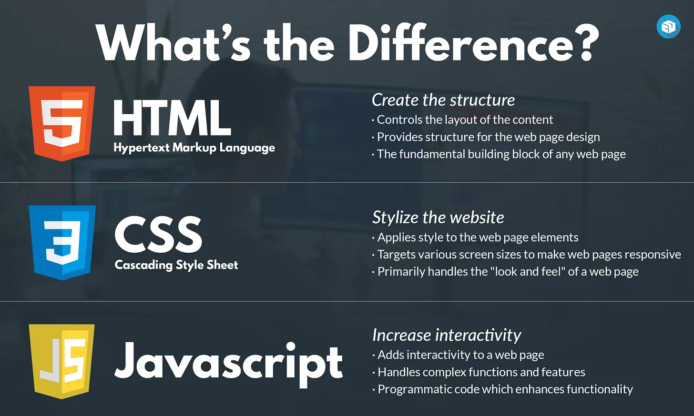

# **`Ngày 16/365: Mối quan hệ giữa HTML, CSS và JavaScript`**

> ***Sau 1 loạt những kiến thức nền tảng từ cách thức hoạt động của Internet và Web, Cách sử dụng công cụ Linux Terminal để thao tác với các File và thư mục, học cơ bản về công cụ quản lý phiên bản phân tán Git, và GitHub. Ta sẽ bắt đầu học cụ thể vào HTML, CSS và JavaScript***.

# `1. Web Development & Coding Languages`

Các websites có thể được phát triển bằng cách sử dụng nhiều ngôn ngữ lập trình và mã hóa khác nhau, một số ngôn ngữ phức tạp hơn những ngôn ngữ khác. Một số ngôn ngữ phát triển web phổ biến nhất bao gồm HTML, CSS, JavaScript, PHP, Python, Ruby và SQL. Trong khi Ruby và PHP cực kỳ phổ biến trong số các doanh nghiệp, công ty khởi nghiệp và nhà phát triển web, thì các ngôn ngữ chính là HTML, CSS và JavaScript sẽ đủ để bạn hiểu được những điều cơ bản về thiết kế và phát triển web.

Mỗi ngôn ngữ phát triển web này có một mục đích khác nhau. Ví dụ, Ruby là ngôn ngữ lập trình có khả năng mở rộng và nhanh chóng (scalable and fast) có thể giúp bạn xây dựng một trang web hoặc chương trình lớn chỉ trong thời gian ngắn. Khi kết hợp với Ruby on Rails framework, ngôn ngữ này cung cấp cho các nhà phát triển hầu như mọi thứ họ cần để xây dựng một trang web. Với một ngôn ngữ như SQL, các nhà phát triển có thể duy trì và tối ưu hóa các cơ sở dữ liệu lớn theo cách hợp lý hơn nhiều.

Các loại dự án khác nhau kết hợp các ngôn ngữ mã khác nhau. Nhiều nhà phát triển web chuyên nghiệp cũng có sở thích riêng về ngôn ngữ mà họ sẽ sử dụng ngay cả khi các ngôn ngữ lập trình khác đã được chứng minh là phổ biến hơn. Nhiều nền tảng khác nhau được xây dựng trên các ngôn ngữ khác nhau. Ví dụ, WordPress chủ yếu được xây dựng bằng mã PHP mạnh mẽ mặc dù HTML và CSS cũng được sử dụng trong đó.

Ngôn ngữ chính mà bạn sử dụng phụ thuộc vào dự án cụ thể và mục tiêu kinh doanh của bạn. Bằng cách xác định những mục tiêu này, bạn sẽ có ý tưởng tốt hơn về ngôn ngữ nào là lý tưởng khi bạn phát triển một trang web hoặc ứng dụng (Có nghĩa là với website này thì sử dụng Ruby những webiste kia lại sử dụng Java thì phù hợp hơn chẳng hạn).
# `2. HTML là gì? (Content & Layout - Nội dung và bố cục)`

HTML là viết tắt của Hypertext Markup Language (Ngôn ngữ đánh dấu siêu văn bản = Ngôn ngữ dùng các thẻ tag để đánh dấu các siêu văn bản). Ngay từ cái tên ta cũng hiểu được HTML không phải là 1 ngôn ngữ lập trình bởi vì nó không có chức năng tính toán logic, mà mục đích của nó là dùng để đánh dấu siêu văn bản. Trong đó nó sử dụng các thẻ tag để đánh dấu. Ví dụ dùng thẻ 
 để đánh dấu đây là 1 đoạn văn bản. Dùng thẻ `<h1>` để đánh dấu đây là 1 tiêu đề.  

**Một số Markup Language (ngôn ngữ đánh dấu)**

- HTML (HyperText Markup Language) Dùng xây dựng cấu trúc web.

- XML (eXtensible Markup Language) dùng để Lưu trữ và truyền dữ liệu có cấu trúc.

- Markdown: Viết tài liệu đơn giản (dùng cho README, blog)

**`Hypertext = Text + Liên kết`**  
- Như vậy Siêu văn bản Là văn bản có liên kết (hyperlink) đến các phần khác trong tài liệu hoặc tài liệu khác. Cho phép người dùng nhảy đến nội dung liên quan bằng cách nhấp vào liên kết.

- **Hypermedia**: Mở rộng của hypertext, bao gồm cả hình ảnh, video có liên kết.

***Mặc dù HTML (và CSS) không thực sự là 1 ngôn ngữ lập trình, nhưng thông thường ở nhiều tài liệu vẫn gọi như vậy, và nó cũng không phải điều gì quá nghiêm trọng, chỉ cần bạn hiểu được bản chất của ngôn ngữ này là được.***

Đây là ngôn ngữ tương đối đơn giản nhưng mạnh mẽ cho phép các nhà phát triển web và chủ sở hữu trang web tạo cấu trúc cho trang web của họ. Nếu bạn chưa từng sử dụng bất kỳ loại ngôn ngữ lập trình nào trong quá khứ, HTML sẽ là nơi tuyệt vời để bắt đầu. Hãy nhớ rằng HTML là nền tảng: Không có HTML, CSS và JavaScript không có gì để tác động.

Lý do chính khiến HTML trở nên quan trọng là vì nó cho phép bạn, với tư cách là 1 nhà phát triển web, tạo cấu trúc cơ bản cho trang web của mình, từ đó bạn có thể sử dụng bất kỳ ngôn ngữ lập trình nào khác để nâng cao thiết kế.

Với HTML, bạn sẽ có thể tạo cấu trúc cho trang web của mình, xác định cách hiển thị tài liệu và trang web trong trình duyệt web, ngôn ngữ xây dựng nên mọi trang web.

*Mặc dù HTML cũng có thể định kiểu đơn giản, ví dụ làm text đậm hoặc in nghiêng, nhưng nên sử dụng CSS làm điều này.*

# `3. CSS là gì ? (Styling &“Look & Feel” - Kiểu dáng, nhìn, cảm nhận)`
CSS (Cascading Style Sheets = Tập hợp các quy tắc định kiểu theo cơ chế ưu tiên xếp tầng, hoặc Bảng quy tắc định kiểu được áp dụng theo cơ chế xếp chồng như thác nước.) là ngôn ngữ bảng định kiểu phổ biến (style sheet language) xác định kiểu (style) cho tài liệu/các thành phần được tạo trong HTML (màu sắc, kiểu phông chữ, bố cục và các tính năng đáp ứng responsive features).

CSS cho phép bạn làm cho trang web trông hấp dẫn hơn về mặt thị giác. CSS tập trung gần như hoàn toàn vào việc cải thiện cách trình bày các thành phần HTML. Mặc dù CSS là ngôn ngữ tĩnh, nhưng nó có thể được sử dụng để làm cho trang web của bạn trông đẹp mắt và hiện đại. Nếu bạn muốn trang web của mình có thiết kế đẹp mắt và phong cách, thì CSS là ngôn ngữ lập trình cần sử dụng. Với hiểu biết cơ bản về CSS, bạn có thể thay đổi giao diện tổng thể của trang web, điều này rất hữu ích khi bạn muốn giao diện của trang web phù hợp với tính thẩm mỹ của thương hiệu.

Mặc dù CSS chủ yếu được sử dụng để tạo hiệu ứng hình ảnh tĩnh, nhưng các phiên bản mới nhất của ngôn ngữ lập trình này cung cấp một số chức năng để tạo hoạt ảnh rất đơn giản.

- Cascading (nghĩa đen là dòng thác đổ thành nhiều tầng nước), dịch là “Xếp tầng”, đây là cơ chế ưu tiên và thứ tự áp dụng kiểu. Nếu có nhiều quy tắc xung đột, CSS sẽ ưu tiên theo cơ chế "xếp tầng" này. Ví dụ 1 đoạn Text chịu sự tác động của 2 tag khác nhau, trong 2 tag này đều định kiểu màu sắc, 1 cái định kiểu là màu đỏ, 1 cái định kiểu là màu xanh. Thì Text có màu xanh hay đỏ sẽ tuân theo quy tắc này (Cụ thể sẽ học sau).

- Style: Quy định kiểu dáng, màu sắc …

- Sheets: Một "sheet" là một bảng/tập hợp các quy tắc quy định kiểu được viết trong một tệp riêng (thường có đuôi .css, ví dụ styles.css) hoặc trong khối mã CSS nhúng trong HTML. (Google Sheets chính là một loại bảng tính)- 
# `4. JavaScript là gì? Interactive Elements (Các yếu tố tương tác)`
JavaScript là một trong những ngôn ngữ lập trình quan trọng nhất đối với những chủ sở hữu trang web muốn làm cho trang web của họ tương tác hơn, khiến đây trở thành ngôn ngữ lập trình chuẩn, phức tạp nhất trong ba ngôn ngữ trong bài viết này.

Trong khi HTML cung cấp cấu trúc cho trang web và CSS cho phép bạn kiểm soát cách trình bày của trang web, ngôn ngữ lập trình JavaScript cung cấp cho bạn các công cụ cần thiết để thay đổi hành vi của các thành phần khác nhau có trên trang web. Với công cụ này, bạn có thể thêm một lớp tương tác vào các thành phần CSS và HTML trên trang web của mình, điều này rất được khuyến khích nếu bạn muốn trang web của mình hấp dẫn khách hàng hiện đại.

Hầu hết các trang web hiện đại đều có nút menu có thể nhấp vào để hiển thị một số khu vực trên trang web mà bạn có thể điều hướng đến. Tất cả những điều này đều được hỗ trợ bởi JavaScript và có thể khiến trang web của bạn trông hiện đại và tinh vi hơn.

Với hiểu biết cơ bản về JavaScript, bạn có thể thao tác các tính năng tương tác khác nhau của trang web để thực hiện nhiều hành động khác nhau. Nếu bạn muốn kiểm soát hoàn toàn thiết kế và chức năng của trang web, bạn nên biết ít nhất một số mã hóa liên quan đến JavaScript.

Các loại công việc bạn có thể làm với JavaScript thực tế là vô hạn. Vì bạn có thể thay đổi các thành phần HTML và CSS của mình bằng JavaScript, đây có thể là một ngôn ngữ rất hữu ích để học.
# `5. Mối quan hệ giữa HTML, CSS và JavaScript`

Ba ngôn ngữ này thường là nền tảng của bất kỳ trang web nào, đó là lý do tại sao điều quan trọng là bạn phải biết những ngôn ngữ này sẽ ảnh hưởng đến trang web của mình như thế nào và chúng thường được sử dụng để làm gì.

>

> ⭐ **Theo dõi [kênh Threads](https://www.threads.com/@kaitaku.88) để đọc bài mới mỗi ngày!** ⭐  

**[<== Bài Trước  ](link)          |[  Trang Chủ  ](./README.md)|           [  Bài Sau ==>](link)**