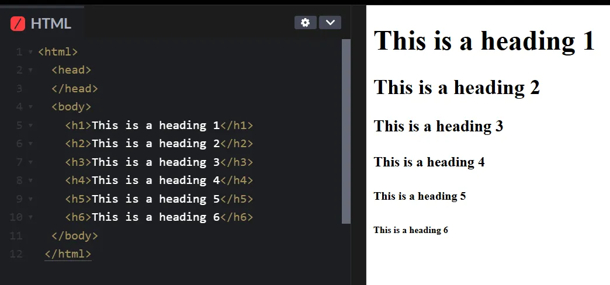
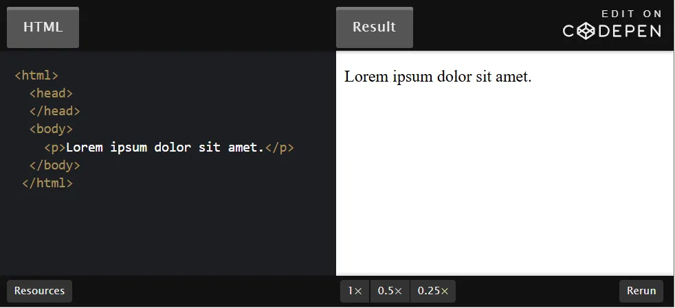

# Ngày 17 HTML Elements
> Hầu hết nội dung trên web đều dựa trên văn bản, vì vậy bạn sẽ thấy mình cần phải làm việc với các thành phần văn bản HTML khá nhiều. Trong bài học này, chúng ta sẽ tìm hiểu về các thành phần dựa trên văn bản mà bạn có khả năng sử dụng nhiều nhất.
# `A. Các Elements phổ biến`

## 1. Paragraphs
Bạn mong đợi văn bản sau sẽ xuất ra gì trên trang HTML?
```
<body>
  Lorem ipsum dolor sit amet, consectetur adipiscing elit, sed do eiusmod tempor
  incididunt ut labore et dolore magna aliqua.

  Ut enim ad minim veniam, quis nostrud exercitation ullamco laboris
  nisi ut aliquip ex ea commodo consequat.
</body>
```
Nó trông giống như hai đoạn văn bản, vì vậy bạn có thể mong đợi nó hiển thị theo cách đó. Tuy nhiên, không phải vậy, như bạn có thể thấy trong output bên dưới:
>

Khi trình duyệt gặp các dòng mới (new lines) như thế này trong HTML của bạn, nó sẽ nén chúng xuống thành một khoảng trắng duy nhất (one single space). Kết quả của quá trình nén này là tất cả văn bản được gom lại thành một dòng dài (one long line).

Nếu chúng ta muốn tạo đoạn văn trong HTML, chúng ta cần sử dụng phần tử đoạn văn (paragraph element), phần tử này sẽ thêm một dòng mới sau mỗi đoạn văn bản của chúng ta. Một paragraph element được định nghĩa bằng cách bao bọc nội dung văn bản bằng thẻ` <p>`.

Thay đổi ví dụ trước bằng cách sử dụng các paragraph elements sẽ khắc phục được sự cố:
> 

## 2. Headings
Headings khác với các phần tử văn bản HTML khác: chúng được hiển thị lớn hơn và đậm hơn các văn bản khác để biểu thị rằng chúng là tiêu đề.

Có 6 cấp độ tiêu đề khác nhau bắt đầu từ `<h1> đến <h6>`. Số trong thẻ tiêu đề biểu thị cấp độ của tiêu đề đó. Tiêu đề lớn nhất và quan trọng nhất là h1, trong khi h6 là tiêu đề nhỏ nhất ở cấp độ thấp nhất.

Tiêu đề được định nghĩa giống như đoạn văn. Ví dụ, để tạo tiêu đề h1, chúng ta sẽ bao bọc văn bản tiêu đề của mình trong thẻ `<h1>`:
>

Sử dụng đúng cấp độ tiêu đề là quan trọng vì các cấp độ cung cấp thứ bậc cho nội dung. Tiêu đề h1 luôn phải được sử dụng cho tiêu đề của toàn bộ trang và các tiêu đề cấp thấp hơn phải được sử dụng làm tiêu đề cho nội dung trong các phần nhỏ hơn của trang.


## 3. `<strong>` element
Phần tử `<strong>` làm cho văn bản được in đậm. Nó cũng đánh dấu văn bản là quan trọng về mặt ngữ nghĩa; điều này ảnh hưởng đến các công cụ, như trình đọc màn hình (screen readers), mà người dùng khiếm thị sẽ dựa vào điều này để sử dụng trang web của bạn. Giọng điệu trên một số trình đọc màn hình sẽ thay đổi để truyền đạt tầm quan trọng của văn bản trong một phần tử `<strong>`. Để định nghĩa một phần tử `<strong>`, chúng ta gói nội dung văn bản trong thẻ `<strong>`.

Bạn có thể sử dụng phần tử `<strong>` một mình:
>

Nhưng thường `<strong>` sẽ được dùng kết hợp với các phần tử khác, ví dụ `<p>`:

>

Đôi khi bạn sẽ muốn làm cho văn bản đậm mà không mang ý nghĩa gì quan trọng. Bạn sẽ học cách làm điều đó trong các bài học CSS sau trong chương trình học.

## 4. `<em>` element
Phần tử `<em>` và phần tử `<strong>` giống nhau về mọi thứ, chỉ khác là phần tử `<em> `sẽ làm cho chữ In Nghiêng thay vì In đậm như phần từ `<strong>`:
>

Có 1 lưu ý rất quan trọng như sau: Khi nhắc đến việc làm Đậm hoặc In nghiêng văn bản, sẽ thấy 1 số tài liệu sử dụng `<b>` để làm đậm, và `<i>` để làm in nghiêng. Và ta sẽ thấy 2 tag này thực sự hoạt động. Điều khác biệt ở đây là việc In Đậm và In Nghiêng do 2 tag này mang lại có tác dụng về mặt thị giác, Nhưng không có tác dụng nhấn mạnh tầm quan trọng của Text được in đậm hay in nghiêng, đặc biệt là đối với trình đọc màn hình. Ví dụ 1 người khiếm thính dùng trình đọc màn hình để truy cập website của bạn, nếu gặp tag `<strong> </strong>` thì nó (trình đọc màn hình) sẽ hiểu đây là 1 đoạn Text quan trọng, cần đọc nhấn mạnh. Còn nếu gặp tag `<b>` thì nó sẽ chỉ coi đây là Text bình thường.

`<strong> hay <em>` cũng giống như thẻ `<h1> đến <h6>` chúng (các thẻ` <h…>`) không chỉ làm cho Text đậm hơn, to hơn, mà thực sự báo cho trình đọc màn hình rằng “Tôi là Tiêu đề”.

## 5. Nesting và indentation (Lồng nhau và thụt lề)
Bạn có thể nhận thấy rằng trong tất cả các ví dụ trong bài học này, chúng ta thụt lề (indent) bất kỳ phần tử nào nằm trong các phần tử khác. Điều này được gọi là các phần tử lồng nhau (nesting elements).

Khi chúng ta lồng các phần tử vào trong các phần tử khác, chúng ta tạo ra mối quan hệ cha và con giữa chúng. Các phần tử bên trong là con, và phần tử bọc bên ngoài là cha.

Trong ví dụ sau, phần tử` <body>` là phần tử cha và `<p> `là phần tử con:
>

Giống như trong các mối quan hệ giữa con người, các phần tử cha HTML có thể có nhiều phần tử con. Các phần tử ở cùng cấp độ lồng nhau được coi là anh chị em ruột.

Ví dụ, hai phần từ `<p>` sau là anh chị em ruột, vì chúng đều là con của phần tử `<body>` và ở cùng cấp độ lồng nhau:


Chúng ta sử dụng thụt lề để làm cho mức độ lồng nhau rõ ràng và dễ đọc đối với chính chúng ta và những nhà phát triển khác sẽ cùng làm việc.

Mối quan hệ cha, con và anh chị em giữa các phần tử sẽ trở nên quan trọng hơn nhiều sau này khi chúng ta bắt đầu định dạng nội dung HTML của mình bằng CSS và thêm hành vi bằng JavaScript. Tuy nhiên, hiện tại, điều quan trọng là phải biết sự khác biệt giữa cách các phần tử liên quan đến nhau và thuật ngữ được sử dụng để mô tả mối quan hệ của chúng.

## 6. HTML comments (Ghi chú trong HTML)
Bình luận/ghi chú HTML không hiển thị với trình duyệt; chúng cho phép chúng ta bình luận về mã của mình để các nhà phát triển khác hoặc chính chúng ta trong tương lai có thể đọc chúng và hiểu được rõ ràng. Để viết bình luận HTML, chúng ta chỉ cần bao quanh bình luận bằng thẻ `<!-- và -->`. Ví dụ:
>

## 7. Phím tắt VSCode
### Phím tắt tạo comments
Nếu bạn thấy việc nhập cú pháp bình luận quá mệt mỏi, phím tắt sau đây sẽ giúp bạn nhanh chóng tạo bình luận mới, chuyển đổi bất kỳ dòng nào thành bình luận hoặc bỏ bình luận bất kỳ dòng nào:

- Người dùng Mac: `Cmd + /`

- Người dùng Windows và Linux: `Ctrl + /`

### Phím tắt tạo văn bản (thay vì gõ)
- Khi thực hành, bạn có thể sử dụng Lorem Ipsum để tạo văn bản giả, thay cho văn bản thực khi bạn xây dựng trang web của mình. VS Code bao gồm một phím tắt để tạo lorem ipsum cho bạn. Để kích hoạt phím tắt, hãy nhập lorem vào dòng mà bạn muốn văn bản giả, sau đó nhấn phím Enter và xong!

- Lorem ipsum là một đoạn văn bản giả (placeholder text) thường được sử dụng trong thiết kế đồ họa, in ấn và xuất bản để minh họa bố cục văn bản khi nội dung thật chưa có sẵn.

# `B. Khi nào thì dùng thẻ <strong>, <b>, <em>, <i>`

Khi HTML tiếp tục phát triển và kết hợp nhiều tính năng gốc hữu ích hơn giúp cải thiện trải nghiệm của cả người dùng và nhà phát triển, sự nhầm lẫn có thể phát sinh khi chọn thẻ tag phù hợp nhất trong danh sách các tùy chọn tương tự.

Một ví dụ điển hình về điều này là khi cố gắng xác định xem có nên sử dụng thẻ `<strong>` hay thẻ `<b>`, thẻ `<em>` hay thẻ `<i>` khi đánh dấu văn bản. Về mặt thị giác, thẻ `<strong> và <b>` đều làm cho văn bản in đậm, cũng như thẻ `<em> và <i>` đều làm cho văn bản in nghiêng.

Cần phải nhấn mạnh rằng : `"HTML là ngôn ngữ đánh dấu ngữ nghĩa (semantic HTML), không chỉ để trang trí"`. Hiểu rõ sự khác biệt giữa các thẻ tag giúp:

- Cải thiện khả năng truy cập (cho người dùng screen reader).

- Tối ưu SEO.

- Dễ bảo trì code hơn.

Điều quan trọng là làm thế nào để phân biệt rõ ràng giữa các thẻ và hiểu khi nào nên dùng thẻ nào để đảm bảo tính ngữ nghĩa và khả năng truy cập (accessibility) ?

Dưới đây là ví dụ minh hoạ, ta sẽ đi phân tích ở dưới:

```html
<p>
  <strong>Nguy hiểm:</strong> Không <em>chạm</em> vào dây điện.  
  <i>Tip:</i> Dùng <b>găng tay cách điện</b> nếu cần.
</p>
```
## 1.  Khi nào thì dùng thẻ `<strong>`
Thẻ `<strong>` được sử dụng khi chúng ta muốn chỉ ra tầm quan trọng, mức độ nghiêm trọng hoặc tính cấp thiết của một từ hoặc phần nội dung mà không làm thay đổi ý nghĩa của chính nội dung đó.

- `<strong>`: Nhấn mạnh sự nguy hiểm (screen reader đọc với giọng nhấn mạnh) trong ví dụ trên.

- Nếu dùng `<b>` thay `<strong>` với từ nguy hiểm thì sẽ ảnh hưởng đến accessibility (khả năng truy cập) của người dùng, vì lúc này trình đọc màn hình sẽ không đọc nhấn mạnh từ nguy hiểm.

## 2. Khi nào thì dùng thẻ `<em>`
Nhấn mạnh sự khác biệt bằng cách sử dụng lời nói, tông giọng căng thẳng. Và sự nhấn mạnh nội dung của thẻ `<em>` sẽ có tác dụng làm thay đổi ngữ nghĩa của nội dung đó. (khác so với thẻ `<strong>`)

- `<em>`: Làm nổi bật hành động "chạm" như một lời cảnh báo trong ví dụ trên.

- Hoặc `"Em <em>thực sự</em> muốn đi chơi."`

## Vậy thẻ `<strong>` thì khác gì thẻ `<em>`
Ngoài việc khác nhau về biểu thị (1 cái in đậm, 1 cái in nghiêng) thì Mặc dù cả 2 thẻ đều nhằm tác dụng nhấn mạnh nhưng mục đích nhấn mạnh là khác nhau:

`<strong>` Nhấn mạnh mức độ quan trọng của nội dung. Dùng cho thông tin cần được chú ý cao (cảnh báo, khẩn cấp, nội dung then chốt). Trình đọc màn hình sẽ đọc nhấn mạnh, hoặc đọc to hơn nhưng sẽ không kèm theo sắc thái, hay cảm xúc …

`<em>` Nhấn mạnh sự khác biệt về ngữ điệu (tâm trạng, giọng điệu). Dùng để thay đổi tông giọng (châm biếm, nghi ngờ, nhấn mạnh ý kiến cá nhân). Ví dụ nói kiểu châm biếm: Ý kiến của em thì luôn đúng rồi,`<em>`em là nhấtttnhấttt`</em>`

## 3. Khi nào thì dùng thẻ `<i>`
Thẻ `<i>` được dùng để thể hiện một tâm trạng hoặc giọng điệu khác so với nội dung xung quanh. Nó thường được sử dụng cho từ nước ngoài, cụm từ thành ngữ, thuật ngữ kỹ thuật, tên tàu, suy nghĩ (nội tâm nhân vật), v.v.

`<i>` chỉ thay đổi cách trình bày (in nghiêng) mà không nhấn mạnh ngữ nghĩa, không làm thay đổi ý nghĩa tổng thể như thẻ `<em>`

- Từ nước ngoài:
```html
<p>Anh ấy nói <i>"Carpe Diem"</i> với một nụ cười.</p>
```
- Thuật ngữ kỹ thuật:
```html
<p>Hiện tượng <i>photosynthesis</i> là quá trình quang hợp.</p>
```
- Tên tàu/xe:
```html
<p>Con tàu <i>Titanic</i> đã chìm vào năm 1912.</p>
```
- Suy nghĩ nội tâm (trong văn học):
```html
<p><i>Mình nên đi hay ở lại đây?</i> cô ấy tự hỏi.</p>
```
## 4. Khi nào thì dùng thẻ `<b>`
Thẻ `<b>` thu hút sự chú ý đến phần nội dung mà không truyền tải thêm tầm quan trọng, sự nhấn mạnh, giọng điệu thay thế hoặc tâm trạng, v.v. Đây là thẻ HTML ít ngữ nghĩa nhất mà chúng ta đã thảo luận trong bài này và chỉ nên sử dụng khi không có thẻ nào khác phù hợp hơn.

- `<b>`: In đậm "găng tay cách điện" để thu hút mắt, không có ý nghĩa ngữ nghĩa.

## Nguyên tắc sử dụng
- Ưu tiên ngữ nghĩa: Dùng `<strong> và <em>` khi cần truyền tải ý nghĩa quan trọng hoặc ngữ điệu.

- Dùng `<i>` trong các trường hợp liệt kê ở trên.

- Chỉ dùng `<b>` cho mục đích trình bày: Khi không có ý nghĩa đặc biệt, hoặc muốn tránh ảnh hưởng đến SEO/accessibility.

# `C. Lists element`
Các danh sách (List) có ở khắp mọi nơi trên web. Và HTML cung cấp 2 loại danh sách: unordered list (danh sách không có thứ tự), và ordered list (danh sách có thứ tự)
## 1. Unordered lists
Nếu bạn muốn có một danh sách các mục mà thứ tự không quan trọng, như danh sách mua sắm có thể mua theo bất kỳ thứ tự nào, thì bạn có thể sử dụng danh sách không có thứ tự. Danh sách không có thứ tự được tạo bằng phần tử `<ul> `và mỗi mục trong danh sách được tạo bằng phần tử `<li>`.

Mỗi mục trong danh sách không có thứ tự bắt đầu bằng một dấu đầu dòng (bullet point):
>

### Thuộc tính type của phần từ `<ul>`
- Bullet Point có thể có 1 số hình dạng như circle, square, triangle. Có thể thực hiện bằng thuộc tính type, ,ví dụ `<ul type = “square”>`

- Tuy nhiên thuộc tính type này không được khuyến khích dùng, thay vì đó sẽ sử dụng `CSS list-style-type`

- Vì vậy có thể nói là phần tử `<ul>` Không có thuộc tính riêng, chỉ dùng global attributes (thuộc tính toàn cục, Là các thuộc tính áp dụng được cho mọi thẻ HTML).

## 2. Ordered lists
Nếu bạn muốn tạo danh sách các mục mà thứ tự thực sự quan trọng, chẳng hạn như hướng dẫn từng bước cho một công thức nấu ăn hoặc 10 chương trình truyền hình yêu thích nhất của bạn, thì bạn có thể sử dụng danh sách có thứ tự.

Danh sách có thứ tự được tạo bằng phần tử `<ol>`. Mỗi mục riêng lẻ trong danh sách đó lại được tạo bằng phần tử `<li>`. Tuy nhiên, mỗi mục trong danh sách bắt đầu bằng một số (number) thay vì một bullet point:
>

### Thuộc tính riêng của phần từ `<ol>`
Phần từ `<ol>` cũng sử dụng tất cả các thuộc tính toàn cục (global attributes). Ví dụ:
```html
<ul class="menu" id="main-list" data-role="navigation" hidden>
  <li>Item 1</li>
</ul>
```
Trong đó ta thấy `class, id, data-role, hidden` là các thuộc tính toàn cục.

Ngoài ra phần tử `<ol>` có 3 thuộc tính riêng riêng là: `start`, `reversed`, `type` :

- `reversed`: (đảo ngược) Thuộc tính Boolean này chỉ định rằng các mục trong danh sách sẽ được đánh số từ cao xuống thấp.
```html
<ol reversed>
    <li>Hoa cúc dại</li>
    <li>Đấu phá thương khung</li>
    <li>Võ thần chúa tể</li>
    <li>Già thiên</li>
    <li>Vĩnh hằng lão tổ</li>
</ol>
```
Kết quả:
>


- `start`: Một số nguyên để bắt đầu đếm các mục danh sách. Luôn là số Ả Rập (1, 2, 3, v.v.), ngay cả khi kiểu đánh số là chữ cái hoặc số La Mã. Ví dụ, để bắt đầu đánh số các phần tử từ chữ cái "d" hoặc số La Mã "iv", hãy sử dụng `start="4"`.

- `type`: Đặt kiểu đánh số:

    - a cho chữ thường
    - A cho chữ hoa
    - i cho số La Mã thường
    - I cho số La Mã hoa
    - 1 cho số (mặc định)

Kiểu được chỉ định sẽ được sử dụng cho toàn bộ danh sách trừ khi thuộc tính kiểu khác được sử dụng trên phần tử `<li>` được bao quanh (có nghĩa là bản thân phần từ `<li>` cũng có thuộc tính type, khi đó nó sẽ ghi đè thuộc tính type khai báo trong phần từ `<ol>` theo cơ chế xếp tầng). Ví dụ về thuộc tính `start` và `type` kết hợp lại như sau:
>
## 3. Danh sách lồng nhau

Các phần từ `<ol> và <ul>` có thể lồng vào lẫn nhau mà không bị hạn chế gì.
```html
<ul>
  <li>first item</li>
  <li>
    second item
    <!-- Look, the closing </li> tag is not placed here! -->
    <ul>
      <li>second item first subitem</li>
      <li>
        second item second subitem
        <!-- Same for the second nested unordered list! -->
        <ul>
          <li>second item second subitem first sub-subitem</li>
          <li>second item second subitem second sub-subitem</li>
          <li>second item second subitem third sub-subitem</li>
        </ul>
      </li>
      <!-- Closing </li> tag for the li that
                  contains the third unordered list -->
      <li>second item third subitem</li>
    </ul>
    <!-- Here is the closing </li> tag -->
  </li>
  <li>third item</li>
</ul>
```
Kết quả:
>

Hoặc :
```html
<ul>
  <li>first item</li>
  <li>
    second item
    <!-- Look, the closing </li> tag is not placed here! -->
    <ol>
      <li>second item first subitem</li>
      <li>second item second subitem</li>
      <li>second item third subitem</li>
    </ol>
    <!-- Here is the closing </li> tag -->
  </li>
  <li>third item</li>
</ul>
```

>
Subscribe để đọc bài mới mỗi ngày

---


> ⭐ **Theo dõi [kênh Threads](https://www.threads.com/@kaitaku.88) để đọc bài mới mỗi ngày!** ⭐  

**[<== Bài Trước  ](link)          |[  Trang Chủ  ](./README.md)|           [  Bài Sau ==>](link)**