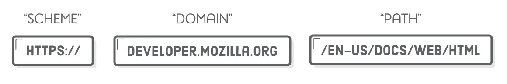
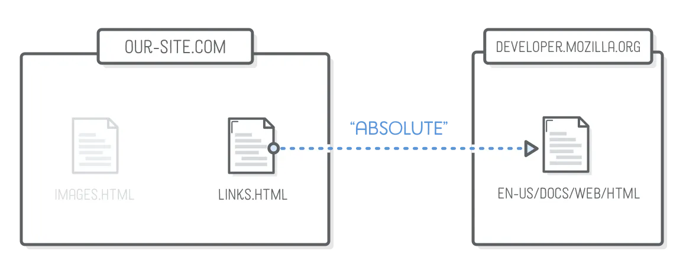
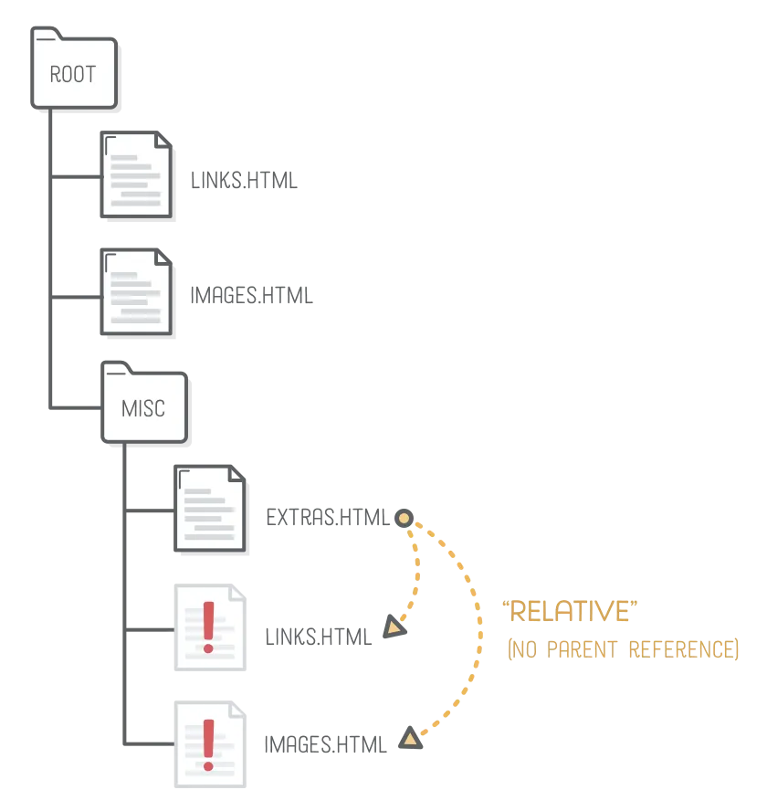
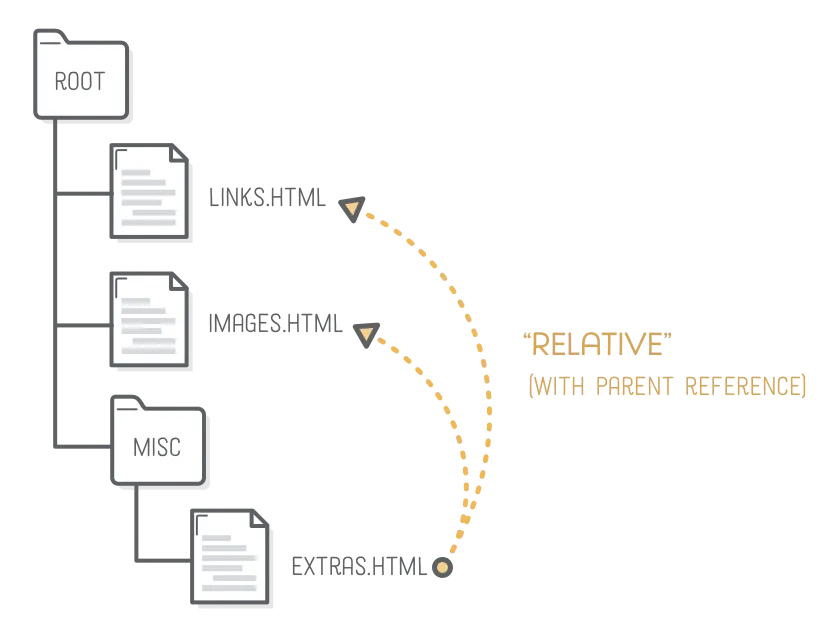
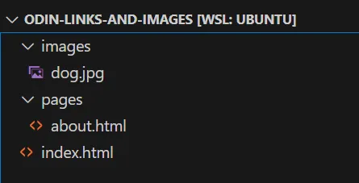
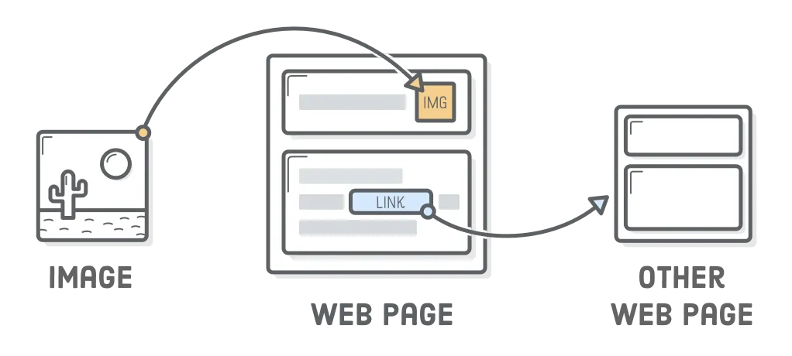

# Ngày 18 Links and Images

# **`A. LINK`**

Liên kết là một trong những tính năng chính của HTML. Chúng cho phép chúng ta liên kết đến các trang HTML khác trên web. Trên thực tế, đây là lý do tại sao nó được gọi là web.

Trong bài học này, chúng ta sẽ tìm hiểu cách tạo liên kết và thêm một số nét trực quan vào trang web của mình bằng cách nhúng hình ảnh:

- Cách tạo liên kết đến các pages đến các websites khác trên Internet.

- Cách tạo liên kết đến các pages trên chính websites đó.

- Sự khác biệt giữa liên kết tương đối và tuyệt đối (absolute and relative links).

- Cách hiển thị hình ảnh trên trang web bằng HTML.

# `1. Chuẩn bị`
Để thực hành sử dụng liên kết và hình ảnh trong suốt bài học này, chúng ta cần một dự án HTML để làm việc.

1. Tạo một thư mục mới có tên là `odin-links-and-images`.

1. Trong thư mục đó, tạo một tệp mới có tên là `index.html`.

1. Mở tệp trong VS Code và sử dụng HTML boilerplate.

1. Cuối cùng, thêm phần tử `<h1>` sau vàovào`:
```html
<h1>Homepage</h1>
```
# `2. Anchor elements <a>`
Để tạo liên kết trong HTML, chúng ta sử dụng phần tử neo (anchor element). Phần tử neo được định nghĩa bằng cách bao quanh văn bản hoặc phần tử HTML khác mà chúng ta muốn là liên kết bằng thẻ `<a>`.

Thêm nội dung sau vào `<body>` của trang `index.html` mà chúng ta đã tạo và mở trong trình duyệt:
```html 
<a>About The Odin Project</a>
```

Bạn có thể nhận thấy rằng việc nhấp vào liên kết này không có tác dụng gì. Điều này là do một thẻ neo (`<a> tag`) tự nó sẽ không biết chúng ta muốn liên kết đến đâu. Chúng ta phải cho nó biết đích đến để đến. Chúng ta thực hiện điều này bằng cách sử dụng thuộc tính HTML (HTML attribute).

Thuộc tính HTML cung cấp thông tin bổ sung cho một phần tử HTML và luôn nằm trong thẻ tag mở (opening tag) của phần tử. Thuộc tính thường bao gồm hai phần: tên và giá trị (name and a value); tuy nhiên, không phải tất cả các thuộc tính đều yêu cầu giá trị. Trong trường hợp của chúng ta, chúng ta cần thêm thuộc tính `href` (hypertext reference - tham chiếu siêu văn bản) vào thẻ neo mở. Giá trị của thuộc tính `href` là đích đến mà chúng ta muốn liên kết của mình hướng đến.

Thêm thuộc tính `href` sau vào phần tử `<a>` mà chúng ta đã tạo trước đó và thử nhấp vào nó một lần nữa, đừng quên làm mới trình duyệt để những thay đổi mới có thể được áp dụng.

```html
<a href="https://www.theodinproject.com/about">About The Odin Project</a>
``` 
Theo mặc định, bất kỳ văn bản nào được bao bọc bằng thẻ `<a>` mà không có thuộc tính `href` sẽ trông giống như văn bản thuần túy. Nếu thuộc tính `href` có mặt, trình duyệt sẽ tô màu xanh cho văn bản và gạch chân để biểu thị đó là liên kết.

Cần lưu ý rằng bạn có thể sử dụng thẻthẻ` để liên kết đến bất kỳ loại tài nguyên nào trên internet, không chỉ các tài liệu HTML khác. Bạn có thể liên kết đến video, tệp pdf, hình ảnh, v.v., nhưng phần lớn, bạn sẽ liên kết đến các tài liệu HTML khác.

# `3. Opening links in a new tab`
## ``Thuộc tính target và rel``
Phương pháp ở trên mở liên kết trong cùng một tab với trang web chứa liên kết. Đây là hành vi mặc định của hầu hết các trình duyệt và có thể thay đổi tương đối dễ dàng. Tất cả những gì chúng ta cần là một thuộc tính khác: thuộc tính target (target attribute).

Trong khi thuộc tính href chỉ định đường liên kết đến tài nguyên, thì thuộc tính target chỉ định nơi tài nguyên đó sẽ được mở. Nếu không chỉ định rõ ràng, thì theo mặc định, nó sẽ lấy giá trị `_self` để mở liên kết trong tab hiện tại. Để mở liên kết trong tab hoặc cửa sổ mới (tùy thuộc vào cài đặt trình duyệt), bạn có thể đặt giá trị thành _blank như sau:
```html 
<a href="https://www.theodinproject.com/about" target="_blank" rel="noopener noreferrer">About The Odin Project</a>
```
Bạn có thể đã nhận thấy ở trên có xuất hiện thuộc tính `rel` là viết tắt của relation. Thuộc tính này được sử dụng để mô tả mối quan hệ giữa trang hiện tại và tài liệu được liên kết. Và `noopener và noreferrer` là giá trị (values) của thuộc tính `rel`, phân tách nhau bằng dấu cách.

## `noopener: (Bảo mật)`
Giá trị `noopener` (có thể hiểu là no + opener) đảm bảo rằng liên kết được mở trong tab hoặc cửa sổ mới không thể tương tác hoặc truy cập ngược lại trang gốc. Nếu không có `noopener`, trang mới có thể sử dụng JavaScript để thao tác ngược trở lại trang gốc, gây ra rủi ro bảo mật.

Khi bạn dùng `<a target="_blank"> mà không có rel="noopener"`:
```html
<a href="https://trang-A.com" target="_blank">Mở trang A</a>
```
Trang A có thể dùng `window.opener` (window.opener là một thuộc tính trong JavaScript, cho phép trang được mở từ một liên kết (target="_blank") truy cập ngược lại trang gốc (trang chứa liên kết) thông qua đối tượng window của trình duyệt) để:
```javascript
//Trên trang A (trang được mở):
console.log(window.opener); 
// Trả về đối tượng `window` của trang gốc
// Thay đổi URL trang gốc
window.opener.location = "https://trang-độc-hại.com"; 

```
→ Trang gốc có thể bị chuyển hướng đến một URL độc hại để lừa người dùng. Hành vi tấn công lừa đảo (phishing attack) này gọi là tabnabbing.

## `noreferrer: (Riêng tư + Bảo mật)`
Giá trị `noreferrer` (có thể hiểu là no + referrer) cung cấp cả quyền riêng tư và bảo mật, giúp ngăn trang mới biết người dùng đến từ đâu (ẩn người giới thiệu - `referrer`) (bằng cách ngăn không cho trang mới biết được địa chỉ của trang giới thiệu) và cũng bao gồm hành vi của `noopener` là ngăn trang mới truy cập vào trang gốc (bảo mật)

Bằng cách sử dụng `rel=”noreferrer”`, bạn sẽ tự động nhận được lợi ích của cả quyền riêng tư và bảo mật (privacy and security). Dù bạn chỉ ghi `rel="noreferrer"`, trình duyệt hiện đại (Chrome, Firefox) mặc định kích hoạt cả `noopener`.

Lưu ý rằng bạn có thể ổn nếu quên thêm `rel="noopener noreferrer"` vì các phiên bản trình duyệt mới hơn cung cấp tính bảo mật nếu chỉ có target="_blank" hiện diện. Tuy nhiên, theo các thông lệ mã hóa tốt (good coding practices) và để thận trọng, bạn `nên luôn ghép target="_blank" với rel="noopener noreferrer".`

Tại sao phải dùng cả 2 giá trị: Trình duyệt cũ: Một số trình duyệt cũ (Edge < 79) không tự động kích hoạt noopener khi dùng noreferrer.

# `4. Absolute và relative links`
Nhìn chung, có hai loại liên kết mà chúng ta sẽ tạo:

- Links đến các pages trên các websites khác trên internet.

- Links đến các pages được đặt trên chính website của chúng ta.

## `Absolute links`
Liên kết đến các pages trên các websites khác trên internet được gọi là liên kết tuyệt đối. Một liên kết tuyệt đối điển hình sẽ bao gồm các phần sau: `scheme://domain/path`. Một liên kết tuyệt đối sẽ luôn chứa scheme and domain của đích đến. scheme thường là `http://` hoặc `https://`

> 

Ví dụ dưới là 1 liên kết tuyệt đối, nó chứa cả scheme và domain:

`https://www.theodinproject.com/about`

Mặc dù có thể sử dụng liên kết tuyệt đối để tham chiếu đến các trang trong trang web của riêng bạn, nhưng việc sử dụng tên miền của bạn ở mọi nơi có thể tạo ra một số tình huống khó khăn. Thường thì tốt hơn là chỉ dành riêng liên kết tuyệt đối để hướng người dùng đến một trang web khác.

> 

## `Relative links`
Liên kết đến các pages khác trong cùng website thì được gọi là liên kết tương đối. Bởi vì các pages đều cùng website có nghĩa là cùng tên miền.

Liên kết tương đối chỉ bao gồm đường dẫn file đến pages khác, liên quan đến page mà bạn đang tạo liên kết trên đó. Điều này khá trừu tượng, chúng ta hãy xem điều này hoạt động như thế nào bằng cách sử dụng một ví dụ.

> 
>  

Trong thư mục `odin-links-and-images`, tạo một tệp HTML khác có tên `about.html` và dán đoạn mã sau vào đó:
```html
<!DOCTYPE html>
<html lang="en">
  <head>
    <meta charset="UTF-8">
    <title>Odin Links and Images</title>
  </head>

  <body>
    <h1>About Page</h1>
  </body>
</html>
```
Quay lại trang index , thêm phần tử `<a>` để tạo liên kết đến trang `about`:
```html
<body>
  <h1>Homepage</h1>
  <a href="https://www.theodinproject.com/about">About The Odin Project</a>

  <a href="about.html">About</a>
</body>
```
Mở file index trong trình duyệt và nhấp vào liên kết about để đảm bảo rằng tất cả được kết nối với nhau một cách chính xác. Nhấp vào liên kết sẽ chuyển đến trang about mà chúng ta vừa tạo.

Điều này có hiệu quả vì trang index và trang about nằm trong cùng một thư mục. Điều đó có nghĩa là chúng ta có thể sử dụng tên của nó (about.html) làm giá trị href của liên kết.

Nhưng chúng ta thường muốn sắp xếp các thư mục trang web của mình tốt hơn một chút. Thông thường chúng ta chỉ có index.html ở thư mục gốc và tất cả các tệp HTML khác trong thư mục riêng của chúng.

Tạo một thư mục có tên là pages trong thư mục odin-links-and-images và di chuyển tệp about.html vào thư mục mới này.

Làm mới trang index trong trình duyệt rồi nhấp vào liên kết about. Bây giờ nó sẽ bị hỏng. Điều này là do vị trí của file của trang about đã thay đổi. Để khắc phục điều này, chúng ta chỉ cần cập nhật giá trị liên kết của href trong file about.html để bao gồm thư mục pages/ vì đó là vị trí mới của tệp about.html tương đối với tệp index.html.
```html
<body>
  <h1>Homepage</h1>
  <a href="pages/about.html">About</a>
</body>
```
Làm mới trang index trong trình duyệt và thử nhấp vào liên kết about một lần nữa, bây giờ nó sẽ hoạt động trở lại.

Trong nhiều trường hợp, cách này sẽ hoạt động tốt; tuy nhiên, bạn vẫn có thể gặp phải các vấn đề không mong muốn với cách tiếp cận này. Việc thêm ./ trước liên kết trong hầu hết các trường hợp sẽ ngăn chặn các vấn đề như vậy. Bằng cách thêm ./, bạn đang chỉ định cho mã của mình rằng nó sẽ bắt đầu tìm kiếm tệp/thư mục liên quan đến thư mục hiện tại. *`(Hãy nhớ lại lệnh trong Linux Terminal thì . chính là thư mục hiện tại current directory, và .. là thư mục cha của thư mục hiện tại)`*
```html
<body>
  <h1>Homepage</h1>
  <a href="./pages/about.html">About</a>
</body>
```
# **`B. IMAGEs`**

Các trang web sẽ khá nhàm chán nếu chúng chỉ có thể hiển thị văn bản. May mắn thay, HTML cung cấp nhiều loại phần tử để hiển thị tất cả các loại phương tiện khác nhau. Phần tử được sử dụng rộng rãi nhất trong số này là phần tử hình ảnh.

# `1. Phần tử `
Để hiển thị hình ảnh trong HTML, chúng ta sử dụng phần tử ``. Không giống như các phần tử khác mà chúng ta đã gặp, phần tử `` là phần tử `void`, phần tử `void` không cần thẻ tag đóng vì chúng vốn rỗng và không chứa bất kỳ nội dung nào.

Thay vì bao bọc nội dung bằng thẻ mở và thẻ đóng, nó nhúng một hình ảnh vào trang pagge bằng thuộc tính `src` để báo cho trình duyệt biết vị trí của tệp hình ảnh (viết tắt của sources). Thuộc tính src hoạt động giống như thuộc tính href của thẻ neo `<a>`. Nó có thể nhúng một hình ảnh bằng cả đường dẫn tuyệt đối và tương đối.

Ví dụ, bằng cách sử dụng đường dẫn tuyệt đối, chúng ta có thể hiển thị một hình ảnh nằm trên trang web The Odin Project:
```html

```
Để hiển thị hình ảnh trên website của bạn được lưu trữ trên máy chủ web của bạn, bạn có thể sử dụng đường dẫn tương đối (relative path):

## Với người dùng Linux, macOS, ChromeOS (Với người dùng WSL2)
Khi bạn tải xuống một tệp từ Internet, Windows có một tính năng bảo mật tạo ra một tệp ẩn `Zone.Identifier` có cùng tên với tệp bạn đã tải xuống và trông giống như `mypicture.jpg:Zone.Identifier`. Mục đích của tệp này là nhăm Đánh dấu tệp là "`đã tải từ Internet" (security zone)` và Cảnh báo người dùng khi mở tệp (tránh mã độc). Tệp này vô hại, nhưng chúng ta không muốn sao chép nó và làm lộn xộn các thư mục của mình.

1. Tạo thư mục `images` trong dự án `odin-links-and-images`.

1. Tiếp theo, [Tải ảnh con chó tại đây](https://unsplash.com/photos/Mv9hjnEUHR4/download?force=true&w=640).

1. Đổi tên bức ảnh thành `dog.jpg`.

1. Di chuyển bức ảnh `dog.jpg` đến thư mục `images`:

- Có thể kéo thả từ thư mục mà bạn tải bức ảnh xuống đến thư mục `images` (xem thư mục này trong VSCode)

- Hoặc sử dụng Ubuntu terminal, điều hướng đến thư mục bạn muốn sao chép hình ảnh vào (`cd ~/odin-links-and-images/images`)

- Gõ `cp <space>`

- Kéo thả `dog.jpg` từ thư mục trên Window vào cửa sổ terminal , WSL sẽ tự động chuyển đổi đường dẫn Windows → Linux khi kéo thả (lưu ý 1 số phiên bản WSL không hỗ trợ tự động chuyển đổi, khi đó có thể dùng lệnh `wsopath` để chuyển đổi đường dẫn từ Window sang Linux) "`/mnt/c/users/username/Downloads/dog.jpg`"

Gõ tiếp `<space>` . để cho `cp` biết bạn muốn sao chép tệp vào thư mục làm việc hiện tại của bạn. Lệnh đầy đủ sẽ trông giống như sau:
```
cp "/mnt/c/users/username/Downloads/dog.jpg" 
```
Nhấn `Enter` để hoàn tất lệnh và sử dụng `ls` để xác nhận tệp hiện đã tồn tại.

Bằng cách di chuyển các tệp từ `Windows` vào vào `WSL2` sẽ ngăn không cho các tệp `Zone.Identifier` bị sao chép. Từ giờ trở đi, bất kỳ lúc nào bạn cần sao chép ảnh hoặc các tệp đã tải xuống khác như thế này vào `WSL2`, bạn có thể thực hiện theo cách này. Nếu bạn vô tình sao chép các tệp `Zone.Identifier` này vào WSL2, bạn có thể xóa chúng một cách an toàn mà không gặp bất kỳ sự cố nào với lệnh:
```
rm *:Zone.Identifier
```
Lưu ý rằng việc kéo thả file từ Window vào VSCode file browser sẽ ngăn chặn không cho các tệp `Zone.Identifier` bị sao chép. Nhưng nếu copy sử dụng dòng lệnh trong Terminal WSL2 thì vẫn có thể bị sao chép.

Cuối cùng thêm hình ảnh vào tệp `index.html` bằng đường dẫn tương đối:
```html
<body>
  <h1>Homepage</h1>
  <a href="https://www.theodinproject.com/about">About The Odin Project</a>

  <a href="./pages/about.html">About</a>

  
</body>
```
Lưu tệp `index.html` và mở nó trong trình duyệt để xem toàn bộ.

# `2. Parent directories (Thư mục cha)`
Đây là cấu trúc thư mục hiện tại :

> 

Nếu chúng ta muốn sử dụng hình ảnh con chó trong trang `about` thì sao? Đầu tiên, chúng ta phải đi lên một cấp từ thư mục pages đến thư mục cha của nó để sau đó có thể truy cập vào thư mục images.

Để đến thư mục cha, chúng ta cần sử dụng hai dấu chấm trong đường dẫn tệp tương đối như thế này: `../`

Hãy xem cách thực hiện, trong phần body của tệp about.html, hãy thêm hình ảnh sau bên dưới tiêu đề mà chúng ta đã thêm trước đó:
```html

```
Để điều hướng qua nhiều thư mục cha , hãy sử dụng nhiều tham chiếu `..`, như sau:
```html
../../elsewhere.html
```
`Tuy nhiên việc sử dụng toàn tham chiếu .. sẽ gây bối rối và khó hiểu, vì vậy tốt nhất là tổ chức các file trong các thư mục riêng tương ứng
`
# `3. Alt attribute (văn bản thay thế)`
Bên cạnh thuộc tính `src`, mọi phần tử hình ảnh cũng phải có thuộc tính `alt` (văn bản thay thế - alternative text).

Thuộc tính `alt` được sử dụng để mô tả hình ảnh. Nó sẽ được sử dụng thay cho hình ảnh nếu không thể tải được. Nó cũng được sử dụng với trình đọc màn hình để mô tả hình ảnh là gì đối với người dùng khiếm thị. Ví dụ:
```html

```
# `4. Image size attributes (kích thước ảnh)`
Mặc dù không bắt buộc, nhưng việc chỉ định các thuộc tính chiều cao và chiều rộng trong thẻ `` giúp trình duyệt bố trí trang mà không khiến trang bị nhảy và nhấp nháy (jump and flash). Luôn chỉ định các thuộc tính này trên mọi hình ảnh là một thói quen tốt, ngay cả khi hình ảnh có kích thước chính xác hoặc bạn đang sử dụng CSS để sửa đổi hình ảnh. Đơn vị mặc định sẽ là px (pixel) và không cần phải thêm px vào làm gì. Ví dụ:
```html
 
 ```
`Lưu ý rằng 2 thuộc tính height và width không bắt buộc phải khai báo đồng thời. Nếu chỉ khai báo height hoặc width thì bức ảnh sẽ giữ nguyên được tỷ lệ, còn nếu khai báo cả 2 thì sẽ bị thay đổi tỷ lệ (ảnh cao hơn hoặc bị giãn ra)`.

# `5. Các định dạng ảnh`
WEBP, PNG, JPG/JPEG, SVG, AVIF, GIF

# `6. Tránh nhầm lẫn src và href`
`src` là thuộc tính của thẻ ``, `href` là thuộc tính của thẻ `<a>`. Điểm chung của 2 thuộc tính này là giá trị của chúng có thể là đường dẫn tương đối hoặc tuyệt đối, tức là đều là đường dẫn. Vậy làm sao để tránh không bị nhầm lẫn, ví dụ sử dụng src trong thẻ `<a>` và dùng href trong thẻ ``

- Khi dùng thẻ `` tức là ta đang muốn nhúng 1 hình ảnh vào trang web, vì vậy cần nhớ đến thuộc tính `src` tức là `source = nguồn/đường dẫn của hình ảnh.`

- Còn khi dùng thẻ `<a>` tức là đang muốn điều hướng đến 1 trang khác thì cần nhớ đến `href` vì bản thân thuộc tính này có từ `reference`.

> 

---

> ⭐ **Theo dõi [kênh Threads](https://www.threads.com/@kaitaku.88) để đọc bài mới mỗi ngày!** ⭐  

**[<== Bài Trước  ](link)          |[  Trang Chủ  ](./README.md)|           [  Bài Sau ==>](link)**