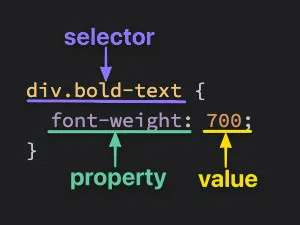

# **Mở đầu về CSS - Selector**

Trong bài học trước, bạn đã học cách viết HTML (xác định cách cấu trúc một trang web). Bước tiếp theo là làm cho cấu trúc đó trông đẹp mắt với một số kiểu style, đó chính xác là mục đích của CSS. Trong một vài bài học tiếp theo, chúng ta sẽ tập trung vào một số khái niệm CSS cơ bản, những điều mà mọi người nên biết ngay từ đầu — cho dù họ mới bắt đầu hay cần ôn lại.

## 1. Nội dung trong bài này
Thêm styles đến HTML với CSS.

Hiểu cách sử dụng thuộc tính class và ID.

Thêm style đến các elements cụ thể bằng cách sử dụng đúng các selectors.

Các loại selectors quan trọng nhất

## 2. Basic syntax (Cú pháp cơ bản)
Ở mức cơ bản nhất, CSS được tạo thành từ nhiều quy tắc (rules) khác nhau. Mỗi quy tắc này bao gồm một bộ chọn (selector, sẽ nói thêm về điều này sau) và một danh sách các khai báo (list of declarations) được phân tách bằng dấu chấm phẩy, trong đó mỗi khai báo được tạo thành từ một cặp `thuộc tính:giá trị (property:value)`



**Lưu ý rằng:**

`<div>` là một trong những phần tử HTML cơ bản. Nó là một container rỗng. Nhìn chung, tốt nhất là sử dụng các thẻ khác như `<h1>` hoặc `<p>` cho nội dung trong các dự án của bạn, nhưng khi chúng ta tìm hiểu thêm về CSS, bạn sẽ thấy rằng có nhiều trường hợp mà thứ bạn cần chỉ là một container cho các phần tử khác. Nhiều bài tập của chúng tôi sử dụng `<div>` đơn giản để đơn giản hóa. Các bài học sau sẽ đi sâu hơn nhiều về thời điểm thích hợp để sử dụng các phần tử HTML khác nhau.

## 3. Selectors (Bộ chọn)
Selectors là gì?

Hay CSS Selectors (Bộ chọn CSS, tức là Chọn phần tử HTML nào sẽ được áp dụng các quy tắc).

Selectors (Bộ chọn) là phần đầu tiên trong một CSS rule (CSS là tập hợp các rules -quy tắc), dùng để chỉ định phần tử HTML mà bạn muốn áp dụng style. Ví dụ:
```css
h1 { color: blue; }  /* `h1` là selector - chọn tất cả thẻ <h1> */
```
→ Ở đây, khai báo` (color: blue;)` sẽ áp dụng cho mọi phần tử `<h1>` trong HTML.

Selectors giống như "điều kiện lọc" để trình duyệt biết phần tử nào sẽ nhận style.
```css
.intro { font-weight: bold; }  /* Chọn mọi phần tử có class="intro" */
```
→ Chỉ các phần tử có `class="intro"` (ví dụ: `<p class="intro">`) được "chọn" để in đậm chữ.

CSS có rất nhiều loại selectors (hơn 30 loại), nhưng những selectors được đề cập trong phần tiếp theo là nhóm quan trọng nhất, chiếm 90% trường hợp thực tế. Những selectors phức tạp hoặc ít dùng sẽ tạm thời bỏ qua.

### 3.1 Universal selector
=Chọn mọi phần tử
Bộ chọn universal (toàn cục) sẽ chọn TẤT CẢ phần tử thuộc mọi loại trong toàn bộ tài liệu HTML, vì thế nó có tên gọi là 'universal'. Cú pháp của nó chỉ là một dấu hoa thị (`*`). Trong ví dụ dưới đây, mọi phần tử đều được áp dụng style color: purple;
```css
* {
  color: purple;
}
```
Là bộ chọn CSS cơ bản nhất, dùng để chọn tất cả phần tử HTML trên trang (bao gồm cả `<body>, <div>, <p>, <span>`,... thậm chí cả `<head>` nếu không được loại trừ).

Như trong ví dụ trên , Tất cả chữ trong trang (từ tiêu đề, đoạn văn, đến nút bấm...) đều thành màu tím, trừ khi bị ghi đè bởi CSS cụ thể hơn.

### 3.2 Type selectors /element selector
= Chọn theo tên phần tử (tên thẻ tag)
A type selector (or element selector) will select all elements of the given element type, and the syntax is just the name of the element:

Bộ chọn kiểu (hoặc bộ chọn phần tử) sẽ chọn tất cả các phần tử của kiểu phần tử (element type) đã cho và cú pháp chỉ là tên của phần tử:
```html
<!-- index.html -->

<div>Hello, World!</div>
<div>Hello again!</div>
<p>Hi...</p>
<div>Okay, bye.</div>
```
```css
/* styles.css */

div {
  color: white;
}
```
Ở đây, cả ba phần tử `<div>` sẽ được chọn, trong khi phần tử `<p>` thì không.

### 3.3 Class selectors
= Bộ chọn theo tên class của phần tử HTML
Đây là một trong những bộ chọn quan trọng và linh hoạt nhất.

Bộ chọn class sẽ chọn TẤT CẢ các phần tử có class được chỉ định (class là một thuộc tính bạn thêm vào phần tử HTML). Cách thêm class vào thẻ HTML và chọn nó trong CSS như sau:

Trong HTML: 
```html
<div class="alert-text">Xin đồng ý với điều khoản.</div>
```

Trong CSS: 
```css
.alert-text { color: red; }
```

Lưu ý cú pháp: Dùng dấu chấm (.) ngay trước tên class (phân biệt chữ hoa/chữ thường). Class không bị giới hạn bởi loại phần tử, nên bạn có thể dùng cùng một class cho nhiều phần tử khác nhau.

Bạn có thể thêm NHIỀU class vào một phần tử bằng cách liệt kê cách nhau bởi dấu cách, ví dụ: `class="alert-text severe-alert"`. Vì dấu cách dùng để phân tách class, bạn KHÔNG nên dùng khoảng trắng trong tên class mà hãy dùng dấu gạch ngang.

class là 1 thuộc tính của các phần tử HTML. Một phần tử HTML có thể có nhiều class, và 1 class có thể cùng xuất hiện ở nhiều phần từ HTML khác nhau. Ví dụ:
```html
<p class =”classA classB>Đây là đoạn văn </p>
<h1 class = “classA class C>Đây là tiêu đề h1 </h1>
```
### 3.4 ID selectors
= Bộ chọn dựa theo tên của ID của phần tử HTML.
Bộ chọn ID tương tự như bộ chọn class. Chúng chọn một phần tử HTML có ID đã cho, ID là một thuộc tính khác của phần tử HTML.

Sự khác biệt chính giữa 2 thuộc tính class và ID là một phần tử chỉ có thể có một ID. ID không thể được lặp lại trên một trang duy nhất (single page) và không được chứa bất kỳ khoảng trắng nào:
```html
<!-- index.html -->

<div id="title">My Awesome 90's Page</div>
```
```css
/* styles.css */

#title {
  background-color: red;
}
```
Cú pháp: Dùng dấu `#` ngay trước tên ID (phân biệt chữ hoa/chữ thường).

Lưu ý quan trọng: Nhiều người lạm dụng ID khi không cần thiết (trong khi class đã đủ). Chỉ nên dùng ID trong trường hợp cụ thể như:

- Tận dụng độ ưu tiên cao của ID. Tức là chỉ nên dùng ID để style bằng CSS nếu muốn tận dụng sự ưu tiên cao, hoặc lý do đặc biệt.

- Tạo liên kết neo (anchor links) đến một section trên trang.
Nên hạn chế tối đa việc sử dụng ID (thậm chí không dùng nếu có thể)


### 3.5 The grouping selector
Nếu chúng ta có hai nhóm phần tử có một số khai báo style giống nhau thì sao?
```css
.read {
  color: white;
  background-color: black;
  /* several unique declarations */
}

.unread {
  color: white;
  background-color: black;
  /* several unique declarations */
}
```
Cả hai bộ chọn `.read` và `.unread `của chúng ta đều chia sẻ các khai báo `color: white;` và `background-color: black;`, nhưng ngoài ra còn có một số khai báo duy nhất của riêng chúng. Nhược điểm: Code bị trùng lặp, khó bảo trì (ví dụ nếu muốn thay đổi màu chung, phải sửa ở 2 nơi).

Để giảm sự lặp lại, chúng ta có thể nhóm hai bộ chọn này lại với nhau thành một danh sách được phân tách bằng dấu phẩy:
```css
/* Nhóm chung */
.read,
.unread {
  color: white;
  background-color: black;
}

/* Phần riêng */
.read { /* Thuộc tính riêng của .read */ }
.unread { /* Thuộc tính riêng của .unread */ }
```
→ Kết quả hiển thị giống nhau, nhưng code sạch và dễ quản lý hơn.

### 3.6 Chaining selectors 
= Một chuỗi các bộ chọn của cùng 1 phần tử HTML
Nếu như 1 group selector thì sẽ phân cách các selectors bởi dấu phẩy, thì chain selector sẽ viết liền nhau, không có dấu phẩy, cũng không có khoảng trắng.

Vì một phần tử HTML chỉ có thể là 1 kiểu (không thể là 2 kiểu khác nhau, ví dụ không thể vừa là `<p> `vừa là `<h1>`), và cũng chỉ có 1 ID cho nên không thể nối ID+ID hoặc type+type để tạo thành chuỗi các bộ chọn được. Ngoài ra, giả sử phần tử `<div> và <p>` mà nối thì lại thành divp, bộ chọn này sẽ không hoạt động vì bộ chọn sẽ cố gắng tìm một phần tử `<divp>` theo nghĩa đen, phần tử này không tồn tại, ví dụ:
```html
<button class="btn">Button thường</button>
<button class="btn btn-primary">Button quan trọng</button>
<button class="btn btn-disabled">Button vô hiệu hóa</button>
```
```css
.btn { /* Style chung cho tất cả button */
  padding: 8px 16px;
}

.btn.btn-primary { /* Chỉ button có CẢ .btn và .btn-primary */
  background: blue;
  color: white;
}

.btn.btn-disabled { /* Chỉ button có CẢ .btn và .btn-disabled */
  opacity: 0.5;
  cursor: not-allowed;
}
```
→ Kết quả:

Cả 3 button đều có padding từ `.btn`.

Chỉ button thứ 2 có nền xanh, button thứ 3 bị mờ.

Tại sao phải dùng đến 2 selector để chọn 1 phần tử HTML, có nhiều lý do, ví dụ chọn chính xác phần tử HTML hơn, và độ ưu tiên cao hơn, tức là khó bị ghi đè hơn so với selector chỉ có 1 phần tử.


### 3.7 Descendant combinator (Tổ hợp con ông cháu cha)
Combinator hay Combinator selector = Tổ hợp selector.  
Các Tổ hợp selector cho phép chúng ta kết hợp nhiều Selector mà có mối quan hệ với nhau (khác so với group selector và chain selector). Có 4 loại tổ hợp selector, nhưng tại thời điểm này chúng ta chỉ học về descendant combinator (Tổ hợp con ông cháu cha).

Về mặt cú pháp thì được biểu thị bởi Selector tổ tiên + dấu cách + selector con cháu

Như vậy Tổ hợp con ông cháu cha Là cách chọn phần tử dựa trên cấu trúc phân cấp HTML (phần tử con/cháu nằm bên trong phần tử cha/ông). Ví dụ:
```
.cha .con { ... }
```
→ Chọn tất cả phần tử có class .con nằm bên trong phần tử có class .cha (dù sâu bao nhiêu cấp).

Xem tiếp ví dụ dưới đây:
```html
<div class="ancestor">  <!-- (A) -->
  <div class="contents">  <!-- (B) ĐƯỢC CHỌN -->
    <div class="contents">  <!-- (C) ĐƯỢC CHỌN -->
    </div>
  </div>
</div>

<div class="contents">  <!-- (D) KHÔNG được chọn -->
</div>
```
```css
.ancestor .contents {
  background: yellow;
}
```
→ Kết quả:

- (B) và (C) có nền vàng vì nằm trong `.ancestor`. Như vậy B (con) và C (cháu) của A sẽ được chọn.

- (D) không có nền vàng vì không nằm trong `.ancestor`. D không được chọn vì không liên quan gì đến A (người xa lạ)

Thực sự không có giới hạn nào về số lượng tổ hợp bạn có thể thêm vào một quy tắc, vì vậy .one .two .three .four sẽ hoàn toàn hợp lệ. Điều này sẽ chỉ chọn một phần tử có lớp là .four nếu nó có tổ tiên có lớp là .three và nếu tổ tiên đó có tổ tiên riêng của nó có lớp là .two , v.v. Tuy nhiên, bạn thường muốn tránh cố gắng chọn các phần tử cần mức độ lồng nhau này vì nó có thể trở nên khá khó hiểu và dài dòng, và nó có thể gây ra vấn đề khi nói đến tính cụ thể.

Việc lồng bao nhiêu cấp sẽ tùy vào tình huống, ví dụ :

```html
<nav class="menu">
  <ul>
    <li><a href="#">Home</a></li>
    <li><a href="#">Products</a></li>
  </ul>
</nav>
```
```css
.menu li a {
  color: blue; /* Đổi màu tất cả link trong menu */
}
```
Trường hợp trên thực ra chỉ cần sử dụng `.menu a` là đủ.

Tuy nhiên hãy xem ví dụ sau:
```html
<nav class="menu">
  <ul>
    <li><a href="#">Link menu</a></li>
  </ul>
  <a href="#">Link trực tiếp trong menu (không thuộc mục nào)</a>
</nav>
```
`.menu a` sẽ chọn tất cả thẻ `<a>` trong `.menu`, bao gồm cả link nằm ngoài `<li>`.

`.menu li a` chỉ chọn link nằm trong` <li>`, giúp tránh style nhầm vào link không mong muốn.

Sao tôi lại gọi đây là tổ hợp con ông cháu cha. Vì nó thực tế như vậy, ví dụ có nhiều suất đi học nước ngoài cho những bạn tên là Thành (có rất nhiều bạn tên Thành). Điều kiện ở đây là trong gia phả ông bà tổ tiên cụ kỵ của bạn Thành nào mà có 1 người tên là Đạt thì bạn Thành đó mới được chọn, còn nếu không thì sẽ không được chọn. Nói cách khác bạn Thành được chọn hoàn toàn là nhờ ông bà tổ tiên.

Tổ hợp này chỉ khác so với chain selector ở 1 điểm là :

- Chain (viết liền): `.btn.active` → chọn phần tử có cả 2 class cùng lúc.

- Còn tổ hợp này (dấu cách): `.btn .active` → chọn` .active` nằm trong `.btn`.


