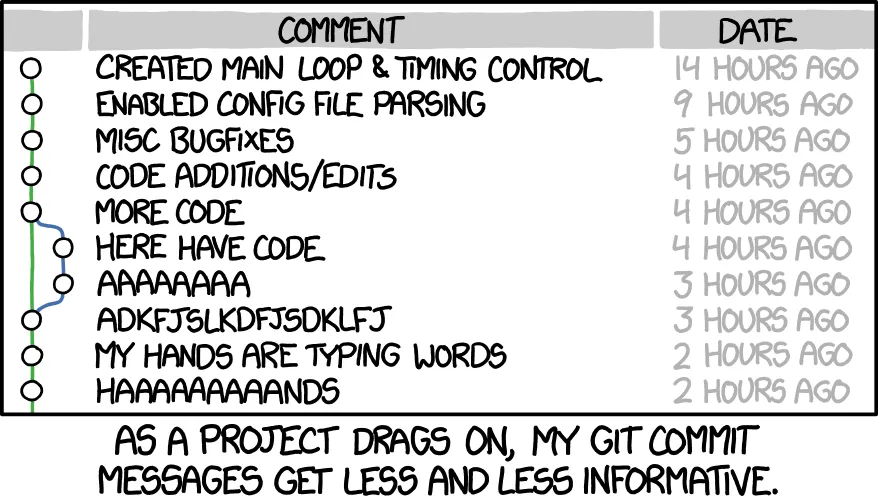
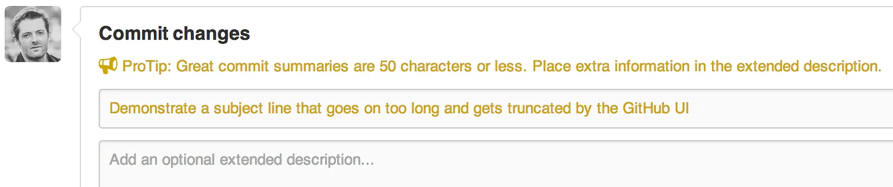
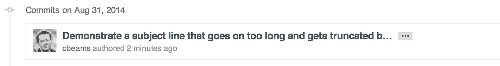

# Ngày 19 Git commit message pro 

> ***`Cách ghi chú chuyên nghiệp trong git`***

# `1. Tiếp tục với hệ thống quản lý phiên bản Git`
***Nội dung trong bài:***

- Giải thích tầm quan trọng của ghi chú (commit messages) khi thực hiện lệnh commit

- Cách viết commit

- Khi nào thì thực hiện commit

- Và tại sao việc có lịch sử commit tốt (commit history) lại quan trọng đến vậy.
> 

# `2. commit messages có quan trọng đến mức cần phải học cách làm hay không?`
Có! Để tôi cho bạn một danh sách nhanh các lý do tại sao:

- Khi bạn nộp đơn xin việc, nhà tuyển dụng sẽ xem qua các dự án của bạn trên GitHub và họ sẽ xem qua lịch sử commit của bạn. Có các good commit message sẽ giúp bạn nổi bật giữa các ứng viên.

- Có good commit message sẽ cho phép bạn (hoặc các nhà phát triển khác đang làm việc trên mã của bạn) nhanh chóng xem những thay đổi nào đã được thực hiện và lý do tại sao. Điều này hữu ích nếu có lỗi (bug) được tìm thấy trong code và cần phải được sửa!

- Có good commit message history cũng sẽ hữu ích nếu bạn quay lại dự án mà bạn đang làm việc sau khi rời xa nó một thời gian. Bạn có thể sẽ không nhớ quá trình suy nghĩ và những thay đổi đã thực hiện khi viết mã ban đầu.

Nếu bạn chưa suy nghĩ nhiều về Điều gì tạo nên một good commit message, có thể là bạn chưa dành nhiều thời gian sử dụng git log và các công cụ liên quan. Có một vòng luẩn quẩn ở đây: commit message history không có cấu trúc và không nhất quán, nên người ta không dành nhiều thời gian để sử dụng hoặc chăm sóc nó. Và vì nó không được sử dụng hoặc chăm sóc, nên nó lại càng trở nên không có cấu trúc và không nhất quán.

Thành công lâu dài của một dự án phụ thuộc (trong số nhiều yếu tố) vào khả năng bảo trì của nó, và một người bảo trì (maintainer) có rất ít công cụ mạnh hơn nhật ký dự án của mình. Vì vậy thật đáng để dành thời gian để tìm hiểu cách chăm sóc nhật ký đúng cách. Những gì có thể là rắc rối lúc đầu sẽ sớm trở thành thói quen.

# `3. Bad vs. good commits`
Khi nói đến việc viết `commit`, điều quan trọng là phải biết cách viết chúng hiệu quả. Sau đây là ví dụ về một bad `commit message`:
```
fix a bug
```
Mặc dù `commit` trên mô tả những gì bạn đã làm nhưng thông điệp quá mơ hồ, khiến các nhà phát triển khác trong nhóm của bạn bối rối. Một `good commit message` sẽ giải thích lý do đằng sau những thay đổi của bạn. Nói cách khác, một `good commit message` mô tả vấn đề mà những thay đổi của bạn giải quyết và cách giải quyết chúng.

Các `commit` tốt bao gồm `hai phần riêng biệt`: chủ đề (subject) và nội dung (body) (cấu trúc commit như thế này la đơn giản nhất):

## Subject
Tóm tắt ngắn gọn về thay đổi bạn đã thực hiện cho dự án.
```
This is the change I made to the codebase
```
GitHub có giới hạn `72 ký tự`, vì vậy nên đặt Chủ đề cho commit trong phạm vi này.

## Body
Mô tả ngắn gọn nhưng rõ ràng về những gì bạn đã làm.
```
Describe the problem your commit solves and how.
```
Bây giờ chúng ta đã biết bí quyết để tạo một `good commit message`, hãy thử sửa `commit message` trước đó:
```
Add missing link and alt text to the company's logo

Screen readers won't read the images to users with disabilities without this information.
```
Bây giờ, các nhà phát triển có thể hiểu rõ hơn về `commit message` này vì nó thực hiện những điều sau:
- Cung cấp một chủ đề về hành động mà bạn thực hiện với code (ví dụ “Add missing link and alt text to the company’s logo” - tức là Thêm đường link bị thiếu và thêm text thay thế cho logo của công ty).
- Bao gồm phần body cung cấp mô tả ngắn gọn nhưng rõ ràng về lý do tại sao commit này cần thực hiện (ví dụ: “Screen readers won’t read the images to users with disabilities without this information.” tức là “Trình đọc màn hình sẽ không đọc hình ảnh cho người dùng khuyết tật nếu không có thông tin này.”).

- Tách chủ đề khỏi phần body bằng một dòng mới/trống. Đây là cách thực hành tốt nhất mà bạn nên làm theo. Nó giúp các nhà phát triển khác dễ đọc commit message hơn.

# `4. Cách để commit có subject và body trên nhiều dòng`
Để thực hiện `commit` với chủ đề và nội dung trong tin nhắn, cách đơn giản nhất là nhập `git commit` (không có tùy chọn-m và đối số tin nhắn).

Làm như vậy sẽ mở một tab Visual Studio Code mới nếu bạn đã đặt Visual Studio Code làm trình soạn thảo Git. Bạn có thể xóa bất kỳ bình luận nào và nhập tin nhắn nhiều dòng của mình. Khi bạn lưu và đóng tab, commit của bạn sẽ được tạo.

(Xem lại bài trước về Git đã nói rất rõ cách làm)

# `5. Khi nào thì commit`
Một cách tốt hình dung là xem commit giống như một "`snapshot`", nghĩa là mỗi khi bạn thực hiện 1 commit sẽ giống như 1 nhà nhiếp ảnh bấm máy để chụp 1 bức ảnh. Một version mới của toàn bộ mã code tính đến thời điểm đó sẽ được lưu lại, cho phép chúng ta phục hồi lại hoặc xem lại thời điểm đó (nó cũng giống như thời điểm khôi phục trên hệ điều hành window, cho phép bạn reset máy về thời điểm hoạt động ổn định nhất).

Khi viết mã, người ta cho rằng cách làm tốt nhất là commit mỗi khi bạn có thay đổi điều gì đó có ý nghĩa trong mã code. Điều này sẽ tạo ra các mốc thời gian (timeline) về quá trình của bạn và cho thấy các code đã hoàn thành của bạn không phải tự nhiên xuất hiện từ hư không.

Nói cách khác, hãy thực hiện commit sau khi bạn thực hiện 1 đoạn code nào đó để nó hoạt động như bạn muốn, ví dụ sửa lỗi đánh máy, sửa lỗi code ... Khi bạn có thêm kinh nghiệm, bạn sẽ có được giác tốt hơn về những gì nên được commit! (tức là mình sẽ biết được khi nào nên commit, khi nào không cần, một cách tự nhiên).

Sẽ đến lúc bạn đang làm việc trên một dự án và CUỐI CÙNG bạn cũng có được thứ gì đó hoàn hảo (đây sẽ là thời điểm tốt để commit), và sau đó có thể 30 giây đến vài ngày sau, nó bị hỏng. Bạn không biết mình đã thay đổi gì, mọi thứ có vẻ vẫn như cũ và bạn không nhớ đã chỉnh sửa gì, chỉ biết rằng lúc này không còn hoạt động theo cách bạn muốn nữa. Bạn có thể quay lại lịch sử commit của mình và hoàn nguyên code của mình về commit cuối cùng, thời điểm mà mọi thứ hoạt động hoàn hảo.

Có thể ví von rằng, Git commit có sức mạnh giống như cỗ máy thời gian cho phép bạn quay trở lại bất kỳ thời điểm nào trong quá khứ.

## [VSCode spell check extensions](https://marketplace.visualstudio.com/items?itemName=streetsidesoftware.code-spell-checker)
Sử dụng VSCode làm trình soạn thảo văn bản ([Xem lại bài học ở đây về Git cơ bản](https://open.substack.com/pub/kaitaku/p/tu-hoc-lap-trinh-full-stack-ngay-24c?r=31jo7q&utm_campaign=post&utm_medium=web&showWelcomeOnShare=false)) sẽ cho phép bạn dễ dàng tạo commit message nhiều dòng, dễ dàng xem độ dài ký tự của mỗi dòng và cho phép bạn đảm bảo chính tả của mình là đúng.


# `6. 7 nguyên tắc của một great commit message`
Có những quy ước được thiết lập tốt về những gì tạo nên good commit message. Thật vậy, nhiều trong số chúng được giả định theo cách hoạt động của một số lệnh Git nhất định. Bạn không cần phải tự phát minh lại bất kì điều gì. Chỉ cần làm theo 7 quy tắc dưới đây và bạn đang trên đường commit như một chuyên gia:

## 1. Separate subject from body with a blank line
Tức là Tách chủ đề khỏi nội dung bằng một dòng trống (đã nói ở trên).

Mặc dù không bắt buộc, nhưng tốt nhất là nên bắt đầu commit message bằng một dòng ngắn (ít hơn 50 ký tự) tóm tắt thay đổi, theo sau là một dòng trống (blank line) và sau đó là mô tả chi tiết hơn. Ví dụ:
```
Tiêu đề ngắn (dưới 50 ký tự)
# (blank line)
Mô tả chi tiết (nếu cần)
```
Văn bản cho tới dòng trống đầu tiên trong commit message được coi là tiêu đề cam kết (commit tittle, chính là commit subject) và tiêu đề đó được sử dụng trong toàn bộ Git. Ví dụ, Git-format-patch biến một commit message thành email, trong đó sử dụng commit title làm tiêu đề cho email, và sử dụng phần còn lại của commit message (ví dụ Mô tả chi tiết) làm nội dung cho email.

Tuy nhiên, không phải mọi commit đều yêu cầu cả chủ đề và nội dung. Đôi khi chỉ cần một dòng là đủ, đặc biệt là khi thay đổi quá đơn giản đến mức không cần thêm ngữ cảnh nào nữa. Ví dụ:
```
Fix typo in introduction to user guide
```
Tuy nhiên, khi một commit cần một chút giải thích và ngữ cảnh (hoàn cảnh xảy ra), bạn cần phải viết một phần nội dung. Ví dụ:
```
Derezz the master control program

MCP turned out to be evil and had become intent on world domination.
This commit throws Tron's disc into MCP (causing its deresolution)
and turns it back into a chess game.
```
Trong mọi trường hợp, việc tách chủ đề khỏi phần thân sẽ có lợi khi duyệt nhật ký commit. Sau đây là mục nhật ký đầy đủ:
```
$ git log
commit 42e769bdf4894310333942ffc5a15151222a87be
Author: Kevin Flynn <kevin@flynnsarcade.com>
Date:   Fri Jan 01 00:00:00 1982 -0200

 Derezz the master control program

 MCP turned out to be evil and had become intent on world domination.
 This commit throws Tron's disc into MCP (causing its deresolution)
 and turns it back into a chess game.
```
Và bây giờ `git log --oneline` chỉ in ra dòng tiêu đề:
```
$ git log --oneline
42e769 Derezz the master control program
```
Hoặc, `git shortlog`, nhóm các commit theo người dùng, một lần nữa chỉ hiển thị dòng chủ đề để ngắn gọn:
```
$ git shortlog
Kevin Flynn (1):
      Derezz the master control program

Alan Bradley (1):
      Introduce security program "Tron"

Ed Dillinger (3):
      Rename chess program to "MCP"
      Modify chess program
      Upgrade chess program

Walter Gibbs (1):
      Introduce protoype chess program
```
`Có rất nhiều ngữ cảnh trong Git mà việc tách biệt giữa chủ đề và phần thân của commit message bằng một dòng trống sẽ phát huy tác dụng. Nếu không có dòng trống thì mọi thứ sẽ không hoạt động.`

## 2. Limit the subject line to 50 characters
Giới hạn dòng chủ đề đến 50 ký tự (mặc dù được cho phép đến 72 ký tự).

50 ký tự không phải là giới hạn cứng, chỉ là quy tắc chung. Giữ dòng chủ đề ở độ dài này đảm bảo rằng chúng có thể đọc được và buộc tác giả phải suy nghĩ một lúc về cách ngắn gọn nhất để giải thích những gì đang diễn ra.

Nếu bạn gặp khó khăn khi gói gọn chủ đề trong 50 lý tự, có thể bạn đang commit quá nhiều thay đổi cùng một lúc. Cố gắng thực hiện các cam kết nguyên tử (xem các bài trước).

Giao diện người dùng của GitHub hoàn toàn nhận thức được các quy ước này. Giao diện này sẽ cảnh báo bạn nếu bạn vượt quá giới hạn 50 ký tự:

> 
Và sẽ cắt bớt bất kỳ dòng tiêu đề nào dài hơn 72 ký tự bằng dấu ba chấm:

> 
Vì vậy hãy giới hạn chủ đề commit message ở 50 ký tự, mặc dù giới hạn cứng là 72 ký tự.

## `3. Capitalize the subject line`
Bắt đầu tất cả các dòng chủ đề bằng chữ in hoa. Ví dụ:
```
Accelerate to 88 miles per hour
```
Thay vì:
```
accelerate to 88 miles per hour
```
## 4. Do not end the subject line with a period
Tức là hãy viết dòng chủ đề mà không có dấu chấm câu ở cuối cùng. Dấu chấm câu theo sau là không cần thiết trong dòng chủ đề. Bên cạnh đó, khoảng trắng rất quý giá khi bạn cố gắng giữ chúng ở mức 50 ký tự hoặc ít hơn. Ví dụ:

Chỉ cần viết:
```
Open the pod bay doors
```
Thay vì:
```
Open the pod bay doors.
```
## 5. Use the imperative mood in the subject line
Có nghĩa là “Sử dụng thể mệnh lệnh/hướng dẫn ở dòng chủ đề”. Ví dụ:
```
Clean your room (dọn phòng)
```
```
Close the door (đóng cửa)
```
```
Take out the trash (đổ rác)
```
Câu mệnh lệnh có thể nghe hơi thô lỗ; đó là lý do tại sao chúng ta không thường sử dụng nó. Nhưng nó hoàn hảo cho dòng chủ đề khi commit message trong Git. Một lý do cho điều này là bản thân Git sử dụng câu mệnh lệnh bất cứ khi nào nó tạo commit cho bạn (Khi bạn thực hiện các hành động như git merge, git revert, hoặc merge pull request trên GitHub, Git sẽ tự động sinh ra commit message mặc định cho bạn. Những message mặc định này luôn dùng imperative mood (thể mệnh lệnh)). Vì vậy Khi bạn sử dụng câu mệnh lên ở chủ đề commit message là bạn đang tuân thủ đúng các quy tắc tích hợp sẵn của Git.

Viết theo cách này lúc đầu có thể hơi khó . Chúng ta quen nói về việc báo cáo sự kiện hơn, kiểu như thế này:
```
Fixed bug with Y (Đã sửa lỗi Y)
```
```
Changing behavior of X (Đang thay đổi hành vi của X)
```
Và đôi khi các commit message được viết dưới dạng mô tả nội dung của chúng:
```
More fixes for broken stuff (Thêm bản sửa lỗi cho những thứ bị hỏng)
```
```
Sweet new API methods (Các API mới tuyệt vời)
```

`Lưu ý rằng việc sử dụng thể mệnh lệnh chỉ cần làm với chủ đề, còn ở phần thân của commit message thì hãy thoải mái.`

## `6. Wrap the body at 72 characters`
Riêng dòng đầu tiên là chủ đề thì giữ ở dưới 50 ký tự. Nhưng từ dòng thứ 3 trở đi thì là body nên hãy giữ ở 72 ký tự mỗi dòng (dòng thứ 2 là dòng trống).

Git không bao giờ tự động ngắt dòng văn bản. Khi bạn viết nội dung của một commit message, bạn phải chú ý đến lề phải của nó và ngắt dòng văn bản theo cách thủ công.

Khuyến nghị là thực hiện việc này ở 72 ký tự, để Git có đủ chỗ để thụt lề văn bản trong khi vẫn giữ mọi thứ dưới 80 ký tự nói chung.

Một trình soạn thảo văn bản tốt có thể giúp ích ở đây. Ví dụ, rất dễ cấu hình Vim để ngắt dòng văn bản ở 72 ký tự khi bạn đang viết một commit Git.

Chúng ta sẽ học cách cấu hình để VSCode tự động ngắt dòng văn bản ở 72 ký tự khi viết commit message ở những bài sau.

## `7. Use the body to explain what and why vs. how`
Trong phần body hãy giải thích Điều gì thay đổi, Tại sao và Đã làm như thế nào. Ví dụ sau đây là 1 commit message đầy đủ (khá dài đúng không):
```
commit eb0b56b19017ab5c16c745e6da39c53126924ed6
Author: Pieter Wuille <pieter.wuille@gmail.com>
Date:   Fri Aug 1 22:57:55 2014 +0200

   Simplify serialize.h's exception handling

   Remove the 'state' and 'exceptmask' from serialize.h's stream
   implementations, as well as related methods.

   As exceptmask always included 'failbit', and setstate was always
   called with bits = failbit, all it did was immediately raise an
   exception. Get rid of those variables, and replace the setstate
   with direct exception throwing (which also removes some dead
   code).

   As a result, good() is never reached after a failure (there are
   only 2 calls, one of which is in tests), and can just be replaced
   by !eof().

   fail(), clear(n) and exceptions() are just never called. Delete
   them.

```
Hãy xem xét toàn bộ sự khác biệt và chỉ cần nghĩ xem tác giả đã tiết kiệm được bao nhiêu thời gian cho những người commit khác và những người commit trong tương lai bằng cách dành thời gian cung cấp bối cảnh này ngay tại đây và ngay bây giờ.

Trong hầu hết các trường hợp, bạn có thể bỏ qua các chi tiết về cách thực hiện thay đổi. Code thường tự giải thích về vấn đề này (và nếu mã quá phức tạp đến mức cần phải giải thích bằng văn xuôi, thì đó là mục đích của các bình luận nguồn). Chỉ cần tập trung vào việc làm rõ lý do tại sao bạn thực hiện thay đổi ngay từ đầu—cách mọi thứ hoạt động trước khi thay đổi (và điều gì sai với điều đó), cách chúng hoạt động bây giờ và lý do tại sao bạn quyết định giải quyết theo cách bạn đã làm.

Trong tương lai có khi bạn sẽ phải cảm ơn chính mình vì điều này.


## Tài liệu phải đọc khi ĐÓNG CỌC LẦN ...

> ⭐ **Theo dõi [kênh Threads](https://www.threads.com/@kaitaku.88) để đọc bài mới mỗi ngày!** ⭐  

**[<== Bài Trước  ](link)          |[  Trang Chủ  ](./README.md)|           [  Bài Sau ==>](link)**