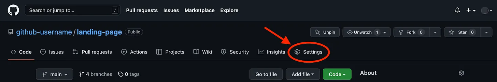
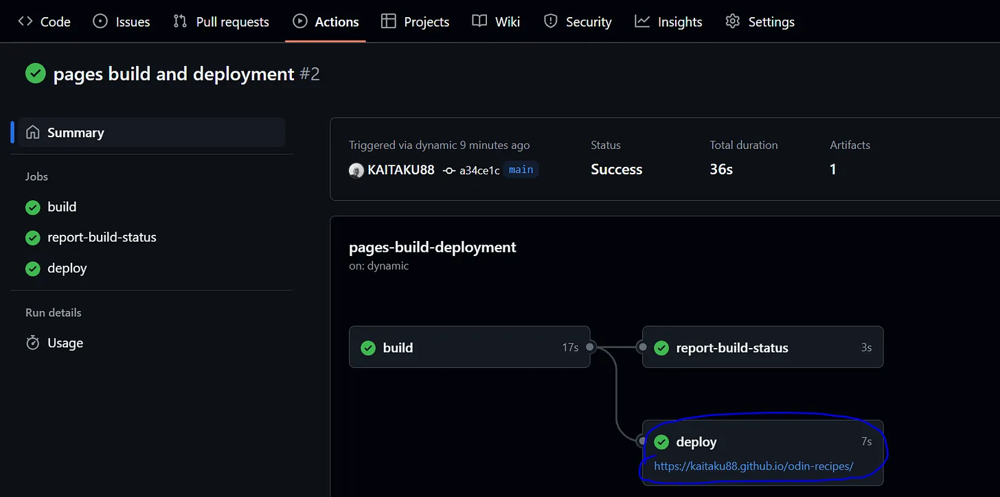

# Day 19: Project: Practice creating food recipe website

> Website đơn giản bằng kiến thức HTML và Git, GitHub đã được học

Đã đến lúc thực hành tất cả kiến ​​thức HTML mà bạn đã học được. Trong dự án này, bạn sẽ xây dựng một trang web công thức nấu ăn cơ bản.

Trang web sẽ bao gồm một trang chỉ mục chính có liên kết đến một số công thức nấu ăn. Trang web sẽ không đẹp lắm khi bạn hoàn thành nhưng điều quan trọng cần nhớ là dự án này chỉ để xây dựng các kỹ năng HTML của bạn; chúng ta sẽ xem lại dự án này trong tương lai để định dạng nó bằng CSS.

# 1. Thiết lập kho lưu trữ GitHub cho dự án của bạn
Như đã đề cập trong bài học Giới thiệu về Git , bạn sẽ muốn sắp xếp tất cả các dự án của mình như một portfolio và liên kết chúng với GitHub để những người khác có thể xem được (nhà tuyển dụng).

## Hãy cẩn thận khi tạo tệp trên GitHub

GitHub cho phép chúng ta thực hiện thay đổi trực tiếp trên trang web của họ. Nếu bạn thực hiện việc này sau khi đã sao chép kho lưu trữ vào máy của mình (clone repo về máy tính), điều này sẽ khiến mã cục bộ của bạn trở thành phiên bản sau mã từ xa, tạo thêm thách thức khi bạn push dự án lên GitHub. Vì vậy sau khi clone repo về máy tính, thì hầu hết thời gian hãy thao tác trên máy tính của bạn (cục bộ).

Khi bạn tiến triển trong khóa học, bạn sẽ học cách xử lý những tình huống này, nhưng hiện tại, điều quan trọng là phải làm theo hướng dẫn cẩn thận để duy trì con đường đơn giản.

1. Tạo một kho lưu trữ mới cho dự án này trên GitHub.com và gọi nó là `odin-recipes` và chọn tùy chọn `public` thay vì tùy chọn `default private`.

1. Sao chép (`clone`) kho lưu trữ đó vào máy cục bộ của bạn, bên trong thư mục repos mà bạn đã tạo trước đó trong bài học về Git Basics. Lệnh sẽ trông giống như `git clone git@github.com:username/odin-recipes.git` (use SSH).

1. Bây giờ hãy cd vào thư mục dự án `odin-recipes` hiện có trên máy cục bộ của bạn.

1. Thiết lập tệp `README.md` của bạn và viết một phần giới thiệu ngắn gọn mô tả dự án hiện tại là gì và những kỹ năng bạn sẽ thể hiện sau khi hoàn thành dự án. (Bạn cũng có thể làm điều này như một sự tự phản ánh vào cuối dự án, đây là một cách tốt để xem lại những gì bạn đã học được.)

Hãy lưu ý rằng trong quá trình làm việc để xây dựng dự án của mình, bạn có thể sẽ phải thực hiện nhiều chu kỳ `git add` và `git commit` trước khi sẵn sàng đẩy dự án lên GitHub bằng lệnh `git push origin main`.

## Initial structure (Cấu trúc ban đầu của dự án)
a. Trong thư mục `odin-recipes`, tạo một tệp `index.html`.

b. Tạo HTML boilerplate vào và thêm tiêu đề h1 `“Odin Recipes”` vào phần nội dung.

## Recipe page (trang công thức nấu ăn)
a. Tạo một thư mục mới trong thư mục odin-recipes và đặt tên là recipes.

b. Tạo một tệp HTML mới trong thư mục recipes và đặt tên theo công thức mà nó sẽ chứa. Ví dụ lasagna.html. Bạn có thể sử dụng tên món ăn yêu thích của mình hoặc nếu cần cảm hứng, bạn có thể tìm công thức để sử dụng tại [Allrecipes](https://www.allrecipes.com/). Hãy đảm bảo bao gồm mã HTML boilerplate. Mã mẫu này phải có trong mọi tệp .html mà bạn tạo.

c. Hiện tại, chỉ cần thêm tiêu đề h1 có tên công thức vào nội dung.

d. Quay lại tệp index.html, thêm liên kết đến trang công thức bạn vừa tạo. Ví dụ: Dưới tiêu đề `<h1>Odin Recipes</h1>`, hãy viết liên kết như sau:
```html
<a href="recipes/recipename.html">Tiêu đề công thức</a>. 
```
Văn bản của liên kết một lần nữa phải là tên công thức.

e. Thêm liên kết trở lại trang index.html trên trang công thức của bạn để điều hướng dễ dàng hơn. Bạn có thể đặt liên kết này ở đầu hoặc cuối trang công thức của mình (ví dụ: lasagna.html). Sau đây là một ví dụ:
```html
<a href="../index.html">Home</a>
```
Điều này cho phép người dùng nhanh chóng quay lại trang chủ sau khi xem công thức.

## Recipe page content (Nội dung của trang công thức)

Trang công thức nấu ăn mới của bạn phải có nội dung sau:

1. Hình ảnh món ăn đã hoàn thành dưới tiêu đề h1 mà bạn đã thêm trước đó. Bạn có thể tìm thấy hình ảnh món ăn trên Google.

1. Bên dưới hình ảnh, cần có tiêu đề “Description” có kích thước phù hợp, theo sau là một hoặc hai đoạn văn mô tả công thức.

1. Trong phần mô tả, hãy thêm tiêu đề “Thành phần” (Ingredients) theo sau là danh sách không theo thứ tự các thành phần cần thiết cho công thức

1. Cuối cùng, bên dưới danh sách nguyên liệu, hãy thêm tiêu đề “Các bước” (Steps) theo sau là danh sách các bước cần thiết để chế biến món ăn.

## Add more recipes (Thêm nhiều công thức)
a. Thêm hai công thức nữa.

b. Đừng quên liên kết đến các công thức nấu ăn mới trên trang index. Ngoài ra, hãy cân nhắc đặt tất cả các liên kết trong một danh sách không có thứ tự để chúng không nằm trên cùng một dòng. Ví dụ:
```html
 <ul>
    <li><a href="recipes/yourrecipe.html">Recipe Title 1</a></li>
    <li><a href="recipes/yourrecipe.html">Recipe Title 2</a></li>
    <li><a href="recipes/yourrecipe.html">Recipe Title 3</a></li>
  </ul>
  ```
Sau khi hoàn thành dự án thì cần push lên GitHub.

# 2. Xem dự án của bạn trên web
Nếu bạn muốn cho người khác xem tác phẩm của mình (dự án) hoặc gửi giải pháp bên dưới, bạn sẽ cần phải xuất bản trang web của mình để người khác có thể truy cập từ web, thay vì chỉ trên máy cục bộ của bạn. Tin tốt là nếu bạn có dự án trên GitHub (như mô tả ở trên), việc này rất đơn giản.

GitHub cho phép bạn xuất bản các dự án web trực tiếp từ kho lưu trữ GitHub. Thực hiện thao tác này sẽ cho phép bạn truy cập dự án của mình từ `your-github-username.github.io/your-github-repo-name`.

Tài khoản GitHub trả phí là bắt buộc để xuất bản các dự án web từ kho lưu trữ riêng tư. Tài khoản miễn phí chỉ có thể xuất bản từ kho lưu trữ công khai.

Có một vài cách để thực hiện việc này, nhưng cách đơn giản nhất là: Đảm bảo rằng tệp HTML chính của dự án của bạn được gọi là index.html. Nếu không phải, bạn sẽ cần đổi tên tệp.

Truy cập kho GitHub của bạn trên web và nhấp vào nút Cài đặt như trong ảnh chụp màn hình bên dưới.

> 

- Nhấp vào Pages ở thanh bên trái.

- Thay đổi Branch từ none thành main branch và bấm nút Save.

- Có thể mất vài phút (Trang web GitHub cho biết có thể mất tới 10 phút, tôi mất chưa tôi 1 phút. Không thêm "theme" vào dự án của bạn, nếu không bạn có thể gặp xung đột git (git conflicts), thay vào đó, hãy kiên nhẫn.) nhưng dự án của bạn có thể truy cập được qua web từ your-github-username.github.io/your-github-repo-name (tất nhiên là phải thay thế thông tin chi tiết của riêng bạn vào liên kết).

- Nếu dự án của bạn không được publish sau 1 giờ, hãy đảm bảo rằng bạn có tệp có tên là index.html trong thư mục gốc của kho lưu trữ và tất cả các cài đặt đã được thiết lập chính xác. Truy cập kho lưu trữ của bạn trên GitHub và nhấp vào Actions, nếu không có mục nào, hãy quay lại cài đặt, đổi Branch từ main branch thành none rồi bấm Save, sau đó lại thay đổi Branch từ none thành main branch và bấm Save.

- Khi publish thành công thành trong phần Action sẽ kiểu như thế này:

> 


## Tài liệu phải đọc khi ĐÓNG CỌC LẦN ...

> ⭐ **Theo dõi [kênh Threads](https://www.threads.com/@kaitaku.88) để đọc bài mới mỗi ngày!** ⭐  

**[<== Bài Trước  ](link)          |[  Trang Chủ  ](./README.md)|           [  Bài Sau ==>](link)**