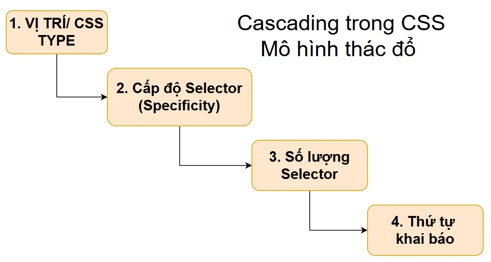

# Day 20 CSS CASCADING 
> Thứ tự ưu tiên của các selector trong CSS 

Trong bài học trước, chúng ta đã tìm hiểu cú pháp CSS cơ bản và bộ chọn selector. Bây giờ, đã đến lúc kết hợp kiến ​​thức của chúng ta về bộ chọn với C của CSS – cascade.

## 1. Nội dung bài
- Cascade thực hiện điều gì?

- Mức độ ưu tiên và sự kết của các CSS selectors.

- Làm thế nào mà sự kế thừa ảnh hướng đến các thuộc tính nhất định nào đó.

## 2. The cascade of CSS
Đôi khi chúng ta có thể có các quy tắc xung đột với nhau và kết thúc với một số kết quả không mong muốn. Ví dụ "tôi muốn các đoạn văn này có màu xanh lam, tại sao chúng lại có màu đỏ như những đoạn văn khác?!" Mặc dù điều này có thể gây khó chịu, nhưng điều quan trọng là phải hiểu rằng CSS không làm những điều trái với mong muốn của chúng ta. CSS chỉ làm những gì chúng ta yêu cầu nó làm. Một ngoại lệ cho điều này là các kiểu mặc định được cung cấp bởi trình duyệt. Các kiểu mặc định này khác nhau tùy theo trình duyệt và đó là lý do tại sao một số elements tạo ra một "khoảng cách (gap)" lớn giữa chúng và các elements khác hoặc tại sao các buttons nhìn theo 1 cách nào đó, mặc dù chúng ta không viết bất kỳ quy tắc CSS nào để định kiểu chúng theo cách đó.

Vì vậy, nếu bạn gặp phải một số hành vi bất ngờ như thế này thì có thể là do các kiểu mặc định này (của trình duyệt), hoặc không hiểu cách hoạt động của một thuộc tính hoặc hoặc là không hiểu thứ nhỏ bé được gọi là Cascade.

Cascade là thứ quyết định những quy tắc nào thực sự được áp dụng khi có sự xung đột về style trong 1 phần tử html. Có nhiều yếu tố khác nhau mà cascade sử dụng để xác định điều này. Chúng ta sẽ xem xét một số yếu tố quan trọng nhất, dưới đây là Mô hình thác đổ mà tôi tự vẽ:

>

## 3. 4 Điều Kiện Xác Định Quy Tắc CSS Áp Dụng (Thứ Tự Ưu Tiên Từ Cao Xuống Thấp)
### 1. Vị trí/ CSS type

>- Inline style (xuất hiện trực tiếp trong thẻ HTML, ví dụ: `<div style="color: red;">`) → Mạnh nhất.

>- Internal (embedded) style trong tag **`<style>`** và External style (trong file` .css`) → Ngang nhau, không phân biệt ưu tiên, vì chúng đều không xuất hiện trực tiếp trong thẻ `html`.

### 2. Cấp độ selector (Specificity = Mức độ ưu tiên)

Khi các quy tắc style có vị trí ngang nhau (tức là không có inline style), xét specificity (mức độ ưu tiên) của quy tắc sẽ phụ thuộc vào cấp độ của selector theo thứ tự:

1. ID selector (#id) → Cấp 1 (mạnh nhất).

1. Class/attribute/pseudo-class selector (.class, [type="text"], :hover) → Cấp 2.

1. Type selector/pseudo-element (div, ::before) → Cấp 3.

1. Các style kế thừa mạnh thứ 4 (Một số thuộc tính dựa trên Typography như color, font-size, font-family… sẽ tự được kế thừa từ phần tử tổ tiên mà không cần khai báo rõ ràng) (xem ví dụ dụ cụ thể phía dưới), ví du:
```css
<div style="color: red;">  <!-- Cha có inline style (ưu tiên cao) -->
  <p>Văn bản này màu gì?</p>  <!-- Phần tử con kế thừa màu -->
</div>

<style>
  * {
    color: blue;  
  }
</style>
```
Vì * selector không được ưu tiên (mức ưu tiện =0) nên màu blue không thể ghi đè màu red được kế thừa từ phần tử cha, nên văn bản có màu red.

5. Universal selector (*) → có mức độ ưu tiên thấp nhất (=0)

Các combinator như >, + , ~, dấu cách sẽ không làm tăng cấp độ ưu tiên, vì vậy khi xét cấp độ của chain combinator hay combinator con ông cháu cha thì phải xét dựa trên các selector thành phần. Ví dụ cả 3 quy tắc sau sẽ ngang bằng khi nói đến cấp độ selector:
```css
/* rule 1 */ Đây là 1 chain selector, không có space 
.class.second-class {  font-size: 12px;}

/* rule 2 */ là 1 descendant combinator, có khoảng trắng 
.class .second-class {  font-size: 24px;}

/* rule 3 */ là 1 child combinator, có dấu > 
.class > .second-class {  font-size: 24px;}
```

Kết luận: trong 2 quy tắc thì quy tắc nào có chứa selector có cấp độ ưu tiên cao hơn thì thắng, ví dụ 1 quy tắc chỉ có 1 ID nhưng sẽ đánh bại 1 quy tắc có 3 Class.

### 3. Số lượng selector (nếu cùng specificity)
Khi mà vị trí và Cấp độ selector cao nhất của 2 quy tắc đều giống nhau. Thì sẽ tính đến số lượng selector, quy tắc nào nhiều selector hơn thì chiến thắng. Ví dụ 2 ID sẽ thắng 1 ID, 2D sẽ thắng 1 ID + 1 Class:
```css
.menu .item { color: red; }   /* có 2 class nên thắng 
.item { color: blue; }        /* có 1 class → thua
```
```css
#header .menu { color: red; }   /*Có 1 ID và 1 class 
#header .nav .menu { color: blue; } /*có 1 ID và 2 class → thắng vì nhiều class hơn */
```
```css
/* rule 1 */
#subsection {  color: blue;} /* có 1 ID nhưng thắng vì ID cấp độ cao hơn class 

/* rule 2 */
.main .list {  
     color: red;
     background-color: yellow;
} /* có 2 class nên thua vì không cùng cấp độ 

/* Lưu ý ở đây, chỉ có thuộc tính color là bị conflic (mẫu thuẫn) thì mới dùng đến quy tắc Cascade để xem xét. Nhưng còn thuộc tính background-color thì không mâu thuẫn vì rule 1 không có thuộc tính này, vì vậy mà mặc dù rule 1 thắng nhưng thuộc tính background-color của rule 2 vẫn được áp dụng.
```

Nhưng hãy xét ví dụ sau:
```css
/*rule 1*/
.para, .small-para { font-size: 22px; }	

/*rule 2 */
.small-para { font-size: 14px; }	
```
Ta thấy rule 1 có 2 selector, nhưng rule 2 mới chiến thắng, và font-size 14px sẽ được áp dụng. Nguyên nhân là bởi vì rule 1 thực chất ra là 2 rule riêng biệt, chỉ là được viết gộp lại cho gọn bằng cách dùng dấu phẩy.

Nên phải lưu ý rằng quy tắc so sánh số lượng selector là so sánh giữa các rule riêng biệt.

### 4. Thứ tự khai báo (nếu tất cả đều ngang nhau)
Nếu tất cả các yếu tố trên đều bằng nhau (Khi mà vị trí tương đương, cấp độ selector cao nhất ngang nhau, số lượng selector cũng ngang nhau thì xét đến thứ tự khai báo trong css). Nguyên tắc nào khai báo sau cùng trong CSS thì chiến thắng vì nó ghi đè khai báo trước đó (dù là Internal hay External) :
```css
/* styles.css */
p { color: red; }
p { color: blue; }  /* Thắng vì khai báo sau */
```
Nếu Internal CSS đặt sau <link> thì nó có thể ghi đè External CSS (nếu cùng specificity)
```css
!important:
```
Có thể ghi đè mọi quy tắc ưu tiên (kể cả inline style), nhưng khuyến cáo tránh dùng vì khó bảo trì.
```css
p { color: red !important; }  /* Luôn thắng */
```


## 4. Exercise
Hoàn thành bài tập trong thư mục [CSS exercises repository’s foundations/cascade](https://github.com/TheOdinProject/css-exercises/tree/main/foundations/cascade)

**Bài tập: 01-cascade-fix**

Cần đọc hướng dẫn cẩn thận trong README.md, và nhớ thực hiện fork repo về GitHub cá nhân, và clone repo và local repo trên máy tính.