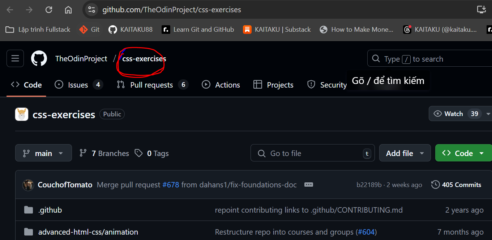
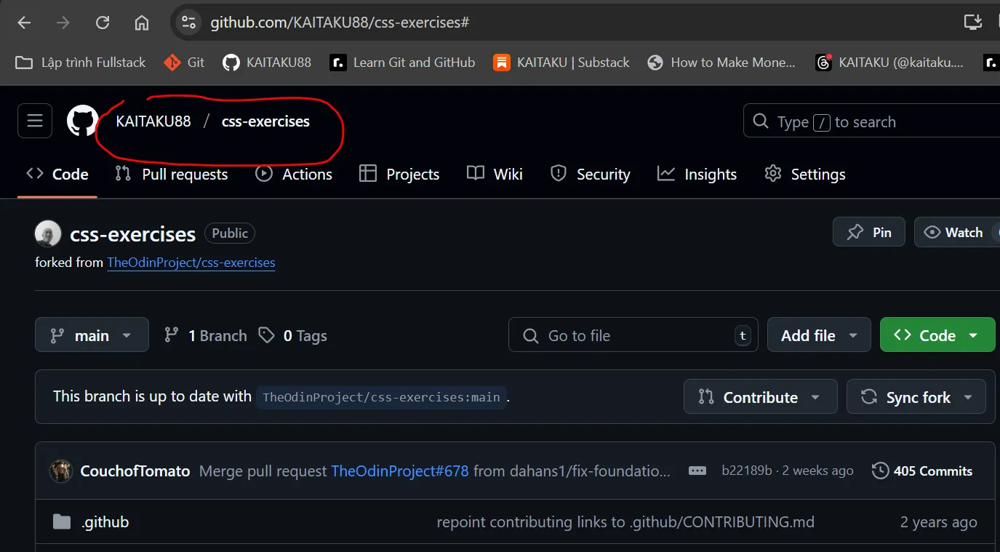
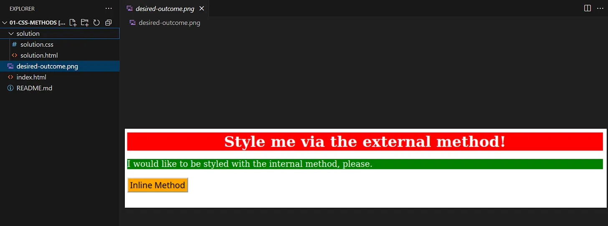
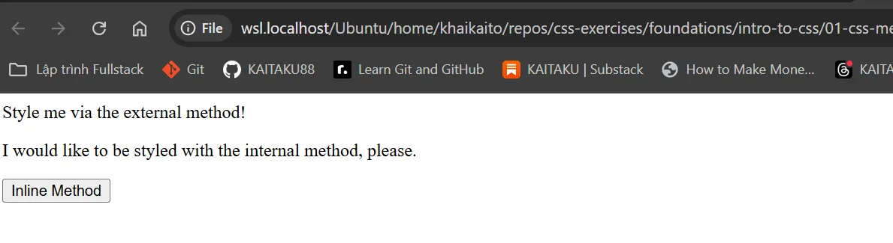

# Day 20 Bài tập CSS 
Sử dụng bất kỳ tài liệu nào, dù là kiến thức đã học, tra cứu Google, đọc tài liệu… để hoàn thành những bài tập dưới đây. Nên thường xuyên sử dụng Git để commit và push các thay đổi lên các nhánh riêng trên GitHub. Tuy nhiên, vui lòng KHÔNG mở Pull Request để hợp nhất các giải pháp của bạn vào kho lưu trữ này hoặc để hiển thị giải pháp của bạn.

Tổng sẽ có 5 bài tập:
- 01-css-methods

- 02-class-id-selectors

- 03-grouping-selectors

- 04-chaining-selectors

- 05-descendant-combinator

# Các bước để làm bài như sau:
## Step 1
Fork repo ở 5 Bài tập CSS về kho chứa cá nhân trên GitHub. Cách thực hiện repo xem tại đây

Đây là [repo bài tập gốc](https://github.com/TheOdinProject/css-exercises) của họ mà ta cần fork:

>
Đây là repo này sau khi được repo về GitHub của tôi:

>

Nói 1 cách ngắn gọn thì Fork 1 repo tức là tạo 1 bản sao repo của người khác, bởi vì bạn không có quyền trực tiếp chỉnh sửa repo của họ, nên khi được sự đồng ý của họ, bạn có thể fork để tạo 1 bản sao y hệt về kho chứa của bạn. Và bạn có thể tùy ý chính sửa trên kho chứa này. (Cụ thể là sao chép repo đó từ GitHub của họ về tài khoản GitHub của bạn).

Còn clone 1 repo là bạn sao chép repo từ tài khoản GitHub của bạn về ổ cứng máy tính cá nhân để làm việc cục bộ/offline được.

## Step 2
Clone repo đó (repo chứa 5 bài tập đó ) về máy tính cá nhân.

## Step 3
Mở repo của bài tập 01 trong VSCode:

>

## Step 4 Trong repo này ta sẽ thấy các file sau:

README.md phải đọc phải này trước khi làm, đây là hướng dẫn.

desised-outcome.png là ảnh minh họa cho kết quả mà ta cần làm được.

index.html là trang web thô chỉ có HTML, cần phải tạo file .css bên ngoài và kết nối vào file này để hoàn thành bài tập.

solution là thư mục chứa lời giải, không xem trước, mà dùng để so sánh kết quả sau khi ta đã thực hiện xong.
## Step 5: Tạo thư mục 

Tôi sẽ tạo thư mục mới tên là CSS, và trong đó tạo 1 file là style.css (cố gắng thực hiện thao tác bằng dòng lệnh)

## Step 6: 
Mở file index.html trong trình duyệt Chrome để xem file thô ban đầu.

>

Mở file ảnh ra xem kết quả yêu cầu như thế nào:

Mở file style.css và file index.html trong VSCode và thực hiện theo yêu cầu mô tả trong README.md