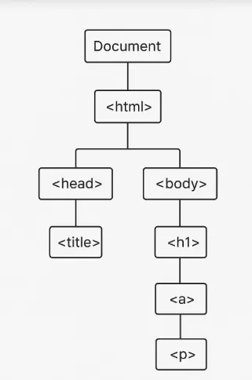

# Day 21: DOM vs HTML, CSS (quan trọng)

# 1. DOM là gì cái ?
DOM là viết tắt của Document Object Model, nghe đã thấy khó hiểu. Thay vì tiếp cận theo định nghĩa kiểu thông thường, chúng ta sẽ xem 1 ví dụ như sau:

Nhà máy sản xuất ra 1 chiếc máy pha cà phê từ rất nhiều chi tiết/bộ phận , trên máy có khá nhiều nút bấm, và bạn (con người) thực hiện điều khiển máy đun nước, xay cà phê, pha cà phê.. thông qua nút bấm, mà không hiểu/cũng không cần hiểu cấu tạo bên trong gồm những bộ phận nào, nguyên lý hoạt động ra sao.

Chúng ta sẽ thay thế các khái niệm in đậm ở trên bằng các thuật ngữ Internet.

Nhà máy = Trình duyệt, Máy pha cà phê = DOM, chi tiết/bộ phận = các phần tử (element) của HTML, nút bấm = các thành phần của DOM, bạn (con người) = ngôn ngữ lập trình như JavaScript, Python… ta sẽ phát biểu như thế này:

Trình duyệt sẽ tạo ra DOM từ các phần tử HTML, DOM có các thành phần của riêng nó (gọi là các node/object), các ngôn ngữ lập trình như Javascript/Python… sẽ tương tác với các phân tử HTML thông qua các node/object của DOM mà không cần biết cấu tạo thực sự của tài liệu HTML như thế nào.

## Vậy DOM có hình dáng đặc trưng như thế nào, “nhìn nó” trông ra sao?
Nếu như HTML là do bạn tự viết, tự tạo ra và nằm trong file .html.

Nếu như CSS cũng là do bạn tự viết, tự tạo ra và nằm trong file .css hoặc nhúng trong file .html .

Thì DOM là do trình duyệt tự tạo ra. Vậy HTML và DOM sẽ khác nhau như thế nào? Giả sử Khi bạn sử dụng trình duyệt web để yêu cầu một trang như

https://example.com

, máy chủ sẽ trả về HTML như sau:
```html
<!doctype html>
<html>
  <head>
    <title>Hello, world!</title>
  </head>
  <body>
    <h1>Hello, world!</h1>
    <p>This is a hypertext document on the World Wide Web.</p>
    <script src="/script.js" async></script>
  </body>
</html>
```
Trình duyệt phân tích cú pháp (parse) HTML và tạo một cây đối tượng như sau:
```
html
  head
    title
  body
    h1
    p
    script
```
Cây đối tượng (object tree) như thế này được gọi là DOM. Trong đó html, head, tittle… được gọi là các nút(node) của cây (hay object/đối tượng).

>


Hiện tại , mã này (DOM) trông giống như HTML, nhưng giả sử tập lệnh JavaScript sau sẽ xoá nút/đối tượng h1 và thêm một nút/đối tượng p khác vào DOM:
```javascript
const h1 = document.querySelector('h1');
h1.parentElement.removeChild(h1);
const p = document.createElement('p');
p.textContent = 'Wildcard!';
document.body.appendChild(p);
```
DOM hoàn chỉnh hiện có dạng như sau:
```
html
  head
    title
  body
    p
    script
    p
```

DOM hiện tại của trang đã khác với HTML. Nói cách khác, HTML đại diện cho nội dung trang ban đầu và DOM đại diện cho nội dung trang hiện tại. Khi JavaScript thêm, xoá hoặc chỉnh sửa các nút, DOM sẽ thay đổi và sẽ khác với HTML.

## Sau phần trên ta đã hiểu phần nào về DOM, bây giờ ta sẽ quay lại các định nghĩa chuẩn về nó.
DOM (Document Object Model) là một tiêu chuẩn do W3C (World Wide Web Consortium) đặt ra để mô tả cấu trúc logic của tài liệu HTML hoặc XML, và cách tài liệu đó có thể được truy cập và thao tác bởi các ngôn ngữ lập trình như JavaScript…

- DOM biến tài liệu HTML/CSS thành một cây các đối tượng (object) mà JavaScript có thể truy cập được.

- Mỗi thành phần trong HTML (như `<div>, <p>, <h1>)` được coi là một node (nút) trong cây DOM.

DOM là 1 tiêu chuẩn chung, và HTML DOM là là 1 loại trong đó HTML được biến thành cây đối tượng DOM.

CSS DOM là 1 loại trong đó CSS được biến thành cây đối tượng DOM để cho phép bạn truy cập và thay đổi các thuộc tính CSS bằng ngôn ngữ lập trình như Javascript

# 2. Tại sao cần đến DOM?
DOM chính là cầu nối giúp JavaScript… tương tác với nội dung HTML và CSS, tạo ra các web app hiện đại mà chúng ta dùng ngày.

Nếu không có DOM thì sao? Trước khi có DOM, các các web tĩnh không thể thay đổi nội dung sau khi đã load, muốn thay đổi nội dung (ví dụ khi bấm 1 button) thì cần phải gửi request lên máy chủ và tải lại toàn bộ nội dung. Khi đó web giống như sách điện tử chỉ để đọc.

Sau khi có DOM các Web động, có thể thay đổi nội dung khi click, nhập dữ liệu, kéo thả... Chỉ cần tải 1 lần, sau đó tương tác trực tiếp thông qua JavaScript... Có thể tìm, thêm, sửa, xóa bất kỳ phần tử nào bằng code. Khi đó web trở thành ứng dụng tương tác thực sự.

# 3. DOM là API, các loại DOM
Mô hình đối tượng tài liệu (DOM) là biểu diễn dữ liệu của các đối tượng tạo nên cấu trúc và nội dung của một tài liệu trên web. DOM biểu diễn một tài liệu bằng một cây logic. Mỗi nhánh của cây kết thúc bằng một nút (node) và mỗi nút chứa các đối tượng (object). Các phương thức DOM (DOM methods) cho phép truy cập theo chương trình vào các nhánh cây. Với chúng, bạn có thể thay đổi cấu trúc, kiểu hoặc nội dung của tài liệu. Các nút (nodes) cũng có thể có trình xử lý sự kiện (event handler) được đính kèm vào chúng. Khi một sự kiện được kích hoạt, trình xử lý sự kiện sẽ được thực thi.

DOM được thiết kế để độc lập với bất kỳ ngôn ngữ lập trình cụ thể nào, giúp biểu diễn cấu trúc của tài liệu có sẵn từ một API duy nhất, nhất quán. Ngay cả khi hầu hết các nhà phát triển web chỉ sử dụng DOM thông qua JavaScript, các triển khai DOM có thể được xây dựng cho bất kỳ ngôn ngữ nào, như ví dụ Python.

API là giao diện cho phép phần mềm giao tiếp với nhau. DOM cung cấp các phương thức (methods) và thuộc tính (properties) để truy cập, sửa đổi, xóa hoặc thêm các phần tử HTML, từ đó tương tác động với trang web. DOM không phải là ngôn ngữ lập trình, mà là một giao diện lập trình (API) được triển khai bởi trình duyệt, có thể truy cập thông qua JavaScript.

DOM ban đầu được thiết kế cho HTML.

Nhưng về sau, DOM mở rộng để áp dụng cho bất kỳ tài liệu có cấu trúc cây – phổ biến nhất là:

- HTML DOM (cho trang web)

- XML DOM (cho dữ liệu có cấu trúc, như RSS)

- SVG DOM (cho đồ họa vector)

- DOM là tiêu chuẩn mở rộng, không chỉ gắn chặt với HTML.

Vậy còn CSS DOM thì sao? Mặc dù CSS không tạo ra một DOM riêng, nhưng trình duyệt cũng chuyển CSS thành một mô hình đối tượng riêng biệt gọi là CSSOM (CSS Object Model).

## CSS DOM hay CSSOM là gì?
Là mô hình đối tượng của stylesheet, giúp JavaScript có thể truy cập và thay đổi các thuộc tính CSS trong khi trang đang chạy.

Như vậy Trình duyệt tạo ra cây các node từ HTML và tạo ra Cấu trúc stylesheet (style rules) từ CSS để cho các ngôn ngữ lập trình như JavaScript có thể tương tác với CSS, HTML. Nếu không thì Javascript sẽ bó tay, không tương tác được.

# 4. Nodes và Objects khác như như thế nào khi nói về DOM
Khi nói đến Notes là nói về mặt cấu trúc dữ liệu, mô tả vị trí và loại phần tử trong cây tài liệu DOM: Ví dụ:
```html
<!-- là Element Node -->
<html> 

<!-- comment --> là Comment Node
 ```

Còn nói đến Objects là nói về lập trình hướng đối tượng, JavaScript sẽ coi mỗi Node trong DOM là 1 đối tượng để thao tác, tức là mỗi Node sẽ tương ứng với 1 đối tượng:
```
Element Node → HTMLElement

Text Node → Text

Document Node → Document
```

## Tài liệu phải đọc khi ĐÓNG CỌC LẦN 2

1. [How to Use CSS Overview in Chrome Dev Tools](https://www.freecodecamp.org/news/how-to-use-css-overview-in-chrome-developer-tools/)
2. [Chỉ dẫn về DOM](https://developer.mozilla.org/en-US/docs/Web/API/Document_Object_Model/Introduction)

> ⭐ **Theo dõi [kênh Threads](https://www.threads.com/@kaitaku.88) để đọc bài mới mỗi ngày!** ⭐  

**[<== Bài Trước  ](link)          |[  Trang Chủ  ](./README.md)|           [  Bài Sau ==>](link)**

