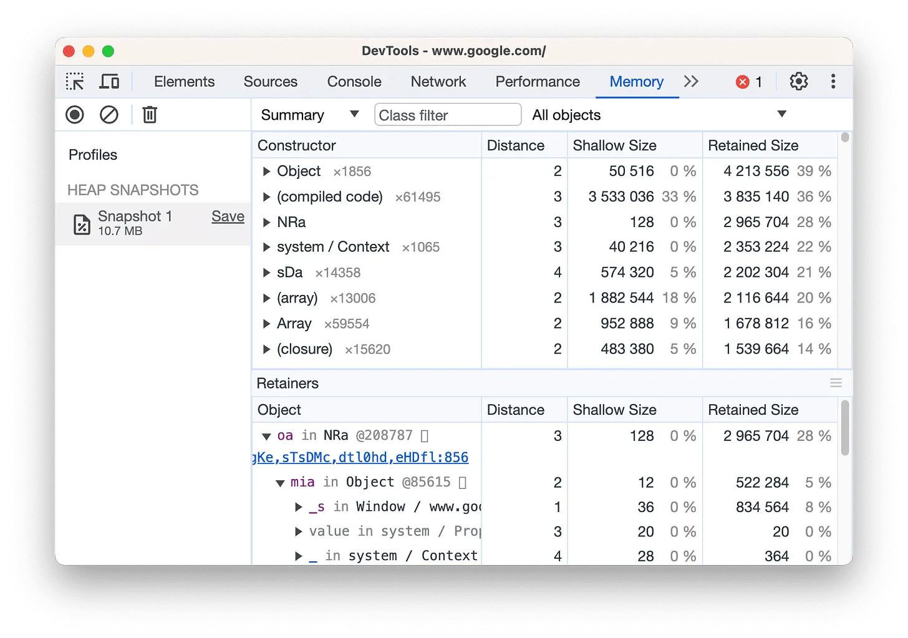

# Làm quen với Chrome DevTools 

Bài học này là bước khởi đầu tuyệt vời để làm quen với Chrome DevTools, đặc biệt cho người học HTML/CSS!

Khả năng kiểm tra và gỡ lỗi (inspect và debug) HTML và CSS của bạn rất quan trọng đối với quá trình phát triển front-end. Bài học này sẽ hướng dẫn chúng ta về Chrome Dev Tools, cho phép bạn xem thông tin chi tiết về các thành phần (elements) và quy tắc CSS của mình (CSS rules), cũng như hỗ trợ bạn tìm và khắc phục sự cố trong mã của mình.

# 1. Nội dung:
Cách Truy cập Element Inspector.

Chọn và kiểm tra phần tử cụ thể.

Thử nghiệm HTML/CSS trong Inspector.

# 2. Mở Chrome DevTools
Mở Chrome DevTools cũng có nhiều cách khác biệt:

Dùng phím tắt: Nhấn F12 hoặc Ctrl+Shift+I (Chữ I là I trong I love You) tức là bạn đang chỉ định mở Chrome DevTools ở tab cuối cùng đã dùng trước đó. Nếu trước đó dùng tab Element thì nó sẽ mở tiếp Element, nếu trước đó dùng tab Console thì giờ nó sẽ mở Console.

Dùng tổ hợp phím: Ctrl+Shift+J sẽ mở cửa sổ tab Console để debug Javascript, J là viết tắt của JavaScript. Còn Ctrl+Shift+C sẽ mở ngay cửa sổ Inspect Element/Element để kiểm tra/chỉnh sửa giao diện nhanh, C là viết tắt của CSS.

Mở bằng chuột/giao diện: Dùng Menu của Chrome ⋮ → Công cụ khác → Công cụ dành cho nhà phát triển. Hoặc Chuột phải vào bất kỳ phần tử nào trên trang web chọn→ "Inspect"

Để Chrome tự động mở Inspector cho mọi Tab mới (tiết kiệm thời gian khi debug nhiều trang, dùng khi phát triển trang web chứ không phải dùng hàng ngày): Trong Command Promt cho Winow nhập: 
```
start chrome --auto-open-devtools-for-tabs . 
```
Với Mac hay Ubuntu cũng gần tương tự.

# 3. Điều hướng trong cửa sổ Chrome DevTools
- Dock DevTools sang cửa sổ riêng:

    - Nhấn `⋮` trong DevTools → Undock into separate window.

    - Lợi ích: Xem code và giao diện song song trên màn hình rộng.

- Dùng Command Menu:

    - Trong cửa sổ DevTools nhấn tổ hợp Ctrl + Shift + P → Gõ tên panel (ví dụ: "Open Console") để chuyển tab siêu nhanh.

# 4. Tổng quan về các công cụ cho nhà phát triển
Trong cửa sổ của DevTools có quá nhiều công cụ dành cho nhà phát triển, có thể hơi choáng ngợp... có quá nhiều thẻ! Tuy nhiên, nếu dành thời gian làm quen với từng thẻ để hiểu những gì có thể, bạn có thể khám phá ra rằng Công cụ cho nhà phát triển có thể tăng đáng kể năng suất của bạn.

Lưu ý rằng: Trong các tài liệu về Công cụ cho nhà phát triển, các thẻ cấp cao nhất được gọi là bảng điều khiển (Panel).

## 4.1 Device toolbar
Chế độ thiết bị giúp mô phỏng các thiết bị di động:
>

## 4.2 Element Panel (Bảng điều khiển phần tử)
Để xem và thay đổi DOM, CSS (Bài tới sẽ tìm hiểu DOM là gì)
>

## 4.3 Console Panel (Bảng điều khiển)
Xem thông báo và chạy script trong bảng điều khiển.
>

## 4.4 Source Panel (Bảng điều khiển nguồn)
Gỡ lỗi JavaScript, duy trì các thay đổi được thực hiện trong Công cụ cho nhà phát triển sau khi tải lại trang, lưu và chạy các đoạn mã JavaScript, cũng như lưu các thay đổi mà bạn thực hiện trong Công cụ cho nhà phát triển vào các nguồn cục bộ.

>

## 4.5 Bảng điều khiển mạng (Network Panel)
Xem và gỡ lỗi hoạt động mạng

>

## 4.6 Recorder Panel (Bảng điều khiển máy ghi âm)
Ghi lại, phát lại và đo lường luồng người dùng.

>

## 4.7 Performance Panel (Bảng điều khiển hiệu suất)
Tìm cách cải thiện hiệu suất tải và thời gian chạy.

>  

## 4.8 Memory Panel (Bảng điều khiển bộ nhớ)
Tìm và khắc phục các vấn đề về bộ nhớ ảnh hưởng đến hiệu suất của trang, ví dụ: rò rỉ bộ nhớ.

>

## 4.9 Application Panel (bảng điều khiển ứng dụng)
Kiểm tra tất cả tài nguyên đã tải, bao gồm cơ sở dữ liệu IndexedDB hoặc Web SQL, bộ nhớ cục bộ và phiên, cookie, Bộ nhớ đệm ứng dụng, hình ảnh, phông chữ và biểu định kiểu. 

>

## 4.10 Security Panel (Bảng điều khiển bảo mật)
Gỡ lỗi các vấn đề về nội dung hỗn hợp, vấn đề về chứng chỉ và nhiều vấn đề khác.  

>

# Đừng choáng ngợp với tất cả các công cụ mà bạn đang thấy! Đối với bài học này, chúng ta chỉ tập trung vào các bảng Elements và Styles.

# 5. Inspecting elements (Kiểm tra các phần tử)
Trong bảng Elements, bạn có thể thấy toàn bộ cấu trúc HTML của trang. Bạn có thể nhấp vào bất kỳ phần tử nào trong bảng này để chọn phần tử cụ thể đó. Ngoài ra, bạn có thể nhấp vào biểu tượng hình mũi tên ở góc trên bên trái và di chuột qua bất kỳ phần tử nào trên trang (chọn trực tiếp trên trang):

>

Khi một phần tử được chọn, tab Styles sẽ hiển thị tất cả các style hiện đang được áp dụng, cũng như bất kỳ style nào đang được ghi đè (được chỉ ra bằng cách gạch ngang văn bản).

>


# 6. Testing styles in the inspector  
Thử nghiệm các style ngay trong inspector   

Bảng Styles cũng cho phép bạn chỉnh sửa trực tiếp các style trong trình duyệt. Bạn có thể nhấp vào bên trong bất kỳ selector nào để thêm quy tắc mới hoặc nhấp vào thuộc tính hoặc giá trị hiện có để thay đổi. Khi thực hiện như vậy, trang web sẽ phản hồi với các thay đổi theo thời gian thực. Điều này sẽ không ảnh hưởng đến mã nguồn trong trình soạn thảo văn bản của bạn, nhưng cực kỳ hữu ích để nhanh chóng kiểm tra các thuộc tính và giá trị khác nhau mà không cần phải tải lại trang nhiều lần.
