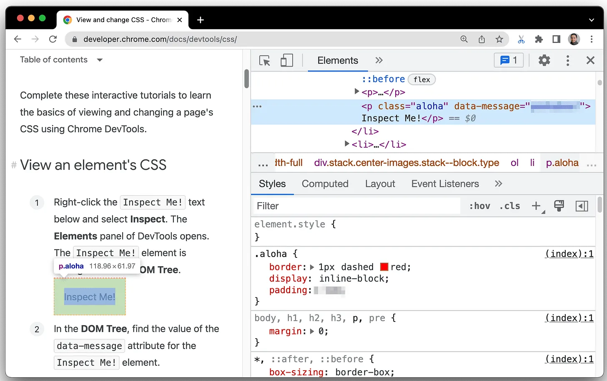
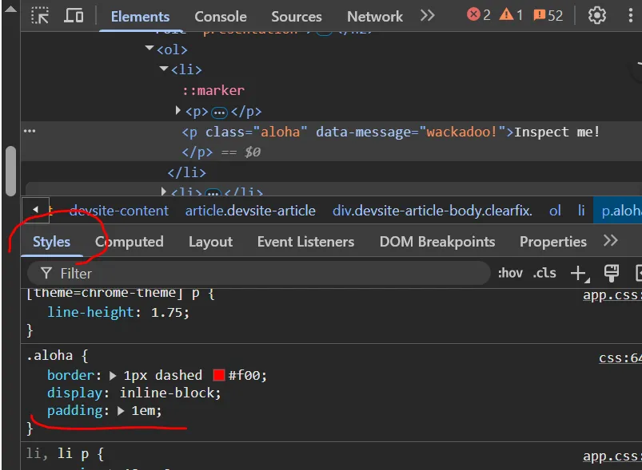
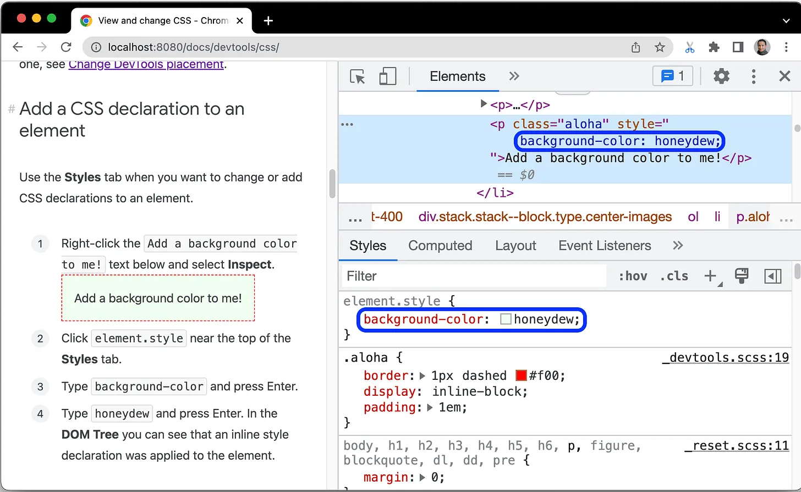
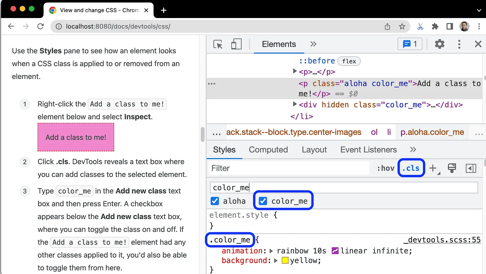
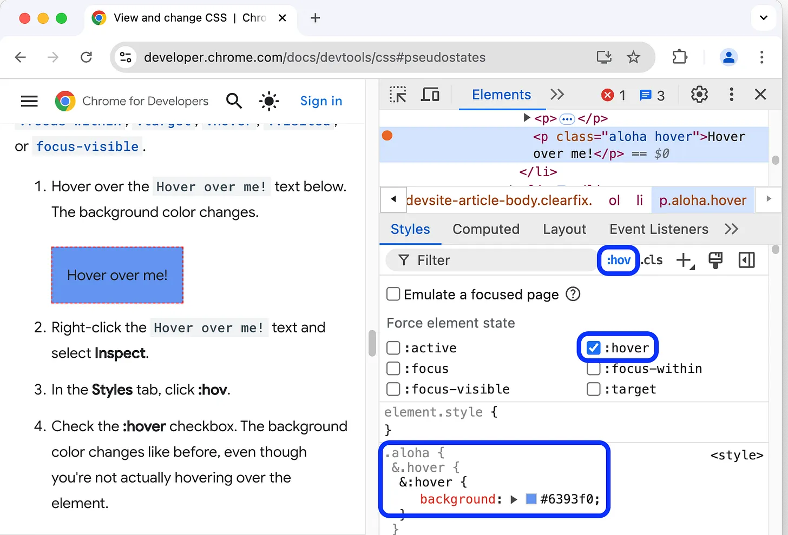
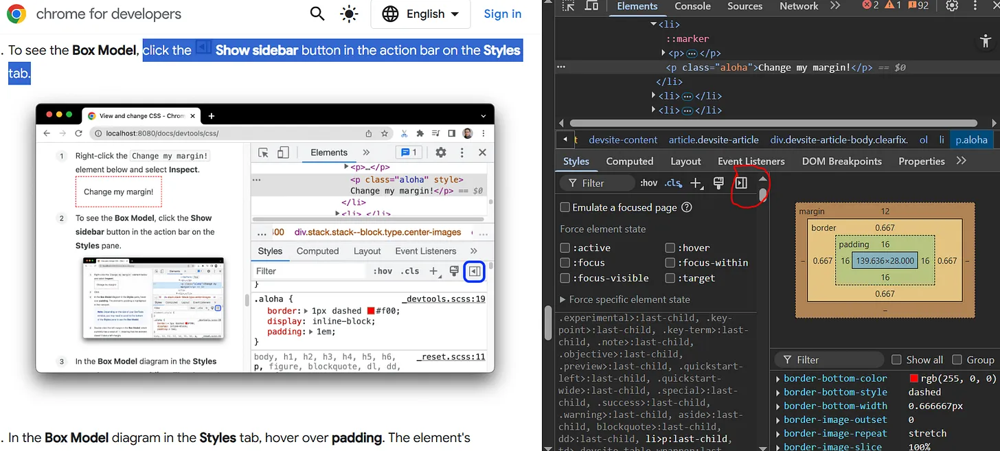
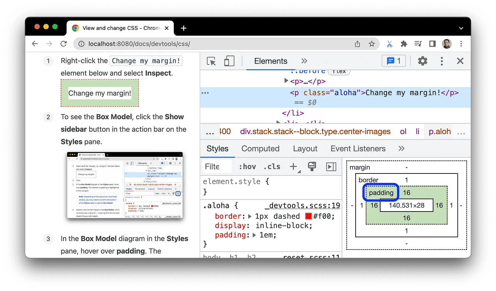
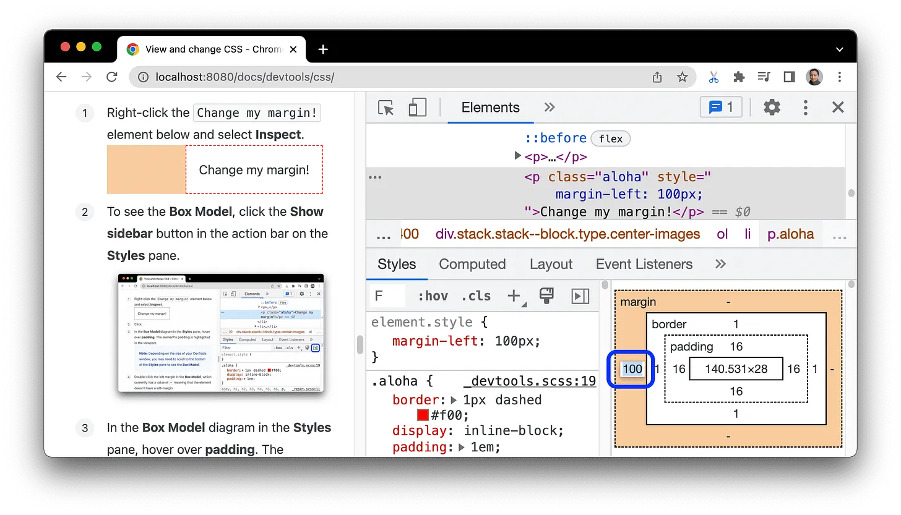

# Day 22: View and Change DOM with DevTools 

Hãy hoàn thành các hướng dẫn tương tác này để tìm hiểu kiến thức cơ bản về cách xem và thay đổi CSS của một trang bằngChrome DevTools.

> **Để thực hiện theo những hướng dẫn dưới đây, hãy sử dụng** [đường link gốc tại đây](https://developer.chrome.com/docs/devtools/css)!

# 1. Xem CSS của một phần tử
Nhấp chuột phải vào văn bản Inspect me! rồi chọn Inspect. Bảng điều khiển Elements Panel của DevTools sẽ mở ra.

Quan sát phần tử Inspect me! được đánh dấu màu xanh dương trong DOM Tree (Cây DOM).

>

Trong DOM Tree (Cây DOM), hãy tìm giá trị của thuộc tính data-message cho phần tử Inspect me!. (Bạn sẽ thấy giá trị này là wackadoo!)

Nhập giá trị của thuộc tính vào hộp văn bản bên dưới (hộp văn bản màu đỏ ở đường link gốc mới có)

Trong Tab Styles tương ứng với Elements Panel hãy tìm aloha class rule.

Tab Styles (Kiểu) liệt kê các quy tắc CSS đang được áp dụng cho bất kỳ phần tử nào được chọn trong DOM Tree (Cây DOM), vẫn đang được chọn là phần tử Inspect me!

>  

Lớp aloha đang khai báo giá trị cho padding. Nhập giá trị này và đơn vị của giá trị đó (không có dấu cách) vào hộp văn bản bên dưới.

# 2. Thêm nội dung khai báo CSS vào một phần tử
Sử dụng thẻ Styles khi bạn muốn thay đổi hoặc thêm nội dung khai báo CSS vào một phần tử (DOM node)

Nhấp chuột phải vào văn bản Add a background color to me! bên dưới rồi chọn Inspect.

Nhấp vào biểu tượng element.style ở gần đầu thẻ Style.

Nhập background-color rồi nhấn Enter.

Nhập honeydew rồi nhấn Enter. Trong cây DOM, bạn có thể thấy rằng phần khai báo kiểu cùng dòng (inline style) đã được áp dụng cho phần tử.

(Lúc này ta hiểu rằng, nếu khai báo style trong Node trong cây DOM, thì rule trong element.style { } ở Styles Tab sẽ được update theo. Và ngược lại, khi ta khai báo ở element.style { } thì phần style kiểu Inline của phần tử cũng được cập nhật theo).

>

# 3. Thêm một lớp CSS vào một phần tử
Sử dụng thẻ Styles để xem giao diện của một phần tử khi một lớp CSS được áp dụng hoặc bị xoá khỏi phần tử đó.

Nhấp chuột phải vào phần tử Add a class to me! bên dưới rồi chọn Inspect (Kiểm tra).

Nhấp vào .cls. DevTools sẽ hiển thị một hộp văn bản để bạn có thể thêm các class vào phần tử đã chọn.

Nhập color_me vào hộp văn bản Add new class rồi nhấn Enter. Một hộp đánh dấu sẽ xuất hiện bên dưới hộp văn bản Add new class, nơi bạn có thể bật và tắt lớp. Nếu phần tử Add a class to me! có bất kỳ class nào khác được áp dụng cho phần tử đó, bạn cũng có thể bật và tắt các lớp đó từ đây. (Như ta thấy phần tử này đang có 2 class được áp dụng là aloha và color_me)

>  

# 4. Thêm trạng thái giả (pseudostate) vào một lớp (class)
Trong CSS, pseudo-state (trạng thái giả) là một loại pseudo-class đại diện cho trạng thái tạm thời của một phần tử — thường thay đổi dựa trên hành động của người dùng, như hover chuột, focus vào input, hoặc chọn checkbox. (Sẽ học sau này). Pseudo-state là một kiểu "trạng thái logic" không tồn tại trong DOM, nhưng được CSS hiểu như một điều kiện để áp dụng style.

Nó thường bắt đầu bằng dấu : và thể hiện sự thay đổi tạm thời của phần tử.

Sử dụng thẻ Styles để áp dụng trạng thái giả lập CSS (CSS pseudostate) cho một phần tử.

Di chuột qua văn bản Hover over me! bên dưới. Màu nền thay đổi.

Nhấp chuột phải vào văn bản Hover over me! rồi chọn Inspect.

Trong thẻ Styles , hãy nhấp vào :hov.

Check vào hộp đánh dấu :hover. Màu nền sẽ thay đổi như trước, mặc dù bạn không thực sự di chuột qua phần tử.

>  
Để biết thêm thông tin, hãy xem phần [Bật/tắt lớp giả.](https://developer.chrome.com/docs/devtools/css/reference?hl=vi#pseudo-class)

# 5. Thay đổi kích thước của một phần tử
Sử dụng sơ đồ tương tác Box Model (Mô hình hộp - học trong bài sau) trong thẻ Styles (Kiểu) để thay đổi chiều rộng, chiều cao, khoảng đệm, lề hoặc chiều dài đường viền của một phần tử.

Nhấp chuột phải vào phần tử Change my margin! bên dưới rồi chọn Inspect (Kiểm tra).

Để xem Box Model nhấn vào nút Show sidebar button trong action bar trên Tab Styles:
>  

Trong biểu đồ Box Model (Mô hình hộp) trong thẻ Styles (Kiểu), hãy di chuột qua padding (khoảng đệm). Khoảng đệm của phần tử được làm nổi bật trong khung nhìn.

>
Nhấp đúp vào lề trái (left margin) trong Box Model (Mô hình hộp). Phần tử hiện tại không có lề, vì vậy margin-left có giá trị là -.

Nhập 100 rồi nhấn Enter.

>
Đơn vị Box Model mặc định là pixel, nhưng cũng chấp nhận các giá trị khác, chẳng hạn như 25% hoặc 10vw.

Lưu ý quan trọng: Ngoài ra, trong phần khai báo quy tắc trong thẻ Styles (Kiểu), bạn có thể thay đổi [các thuộc tính chiều dài và đơn vị của các thuộc tính đó bằng con trỏ.](https://developer.chrome.com/docs/devtools/css/reference?hl=vi#change-length-value)

