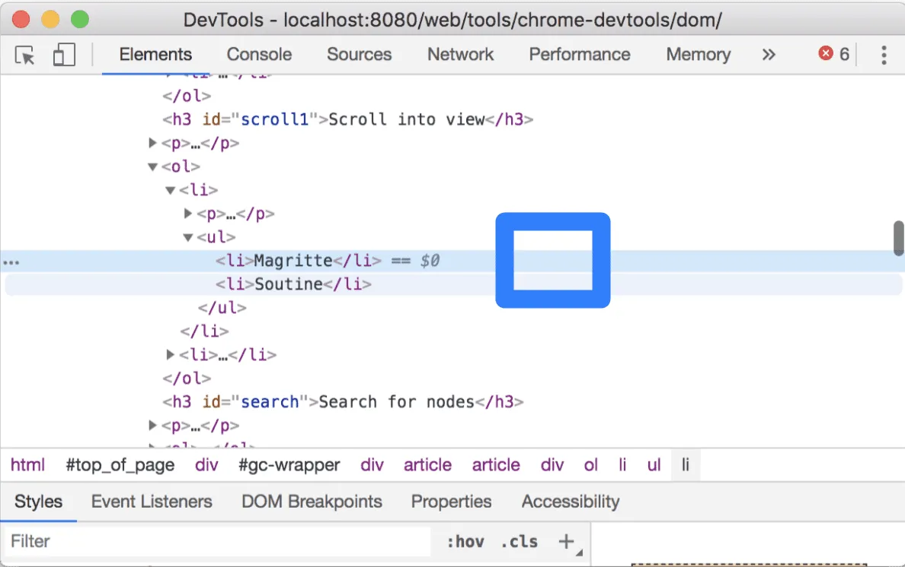

# Day 22 View and Change DOM with DevTools

# **`A. Một cách giải thích dễ hiểu về DOM`**

Khi ở lại với 1 vấn đề lâu hơn thì sẽ đến lúc chúng ta hiểu được bản chất của nó.

Sau bài về DOM ngày 21/365 có lẽ ta sẽ còn cảm thấy khá mơ hồ về DOM. Vẫn câu hỏi cũ DOM sinh ra để làm gì?  DOM là cái gì?

## 1. Trước đây (Khi chưa có DOM):
Khi ta truy cập vào 1 webpage trong trình duyệt, khi ta nhập tên miền cho web đó, ví dụ https://kaitaku.substack.com/ thì trình duyệt sẽ gửi tin nhắn cho máy chủ (request, tôi sẽ dùng ngôn ngữ đời sống cho dễ hiểu), yêu cầu máy chủ gửi các tài nguyên liên quan đến trang web này. Khi đó máy chủ sẽ gửi mã nguồn, trong đó có file .html cho trình duyệt (ví dụ file index.html cho trang chủ, khi ta đang nhập địa chỉ của trang chủ). Trình duyệt sẽ phân tích và ghép các thông tin trong file mã nguồn index.html rồi hiển thị (render) ra màn hình cho người dùng xem. Ta đang nhìn thấy mã nguồn index.html nhưng ở dưới dạng các đối tượng đồ họa (các nút, hình ảnh…).

Khi người dùng bấm vào 1 nút trên trang để chuyển sang 1 trang khác (trên cùng website), lúc này trình duyệt lại gửi tin nhắn liên lạc cho máy chủ, máy chủ sẽ tìm kiếm và trả về toàn bộ tài nguyên cho trang mới này, ví dụ trả về file about.html. Trình duyệt lại phân tích và hiển thị (render) file about.html ra màn hình cho chúng ta xe.

Sau 1 thời gian cả trình duyệt và máy chủ đều rất mệt mỏi. Thằng máy chủ phàn nàn với trình duyệt “Sao mày suốt ngày inbox tao thế, chỉ 1 thay đổi nhỏ tí cũng inbox làm phiền tao, sao mày không tự làm đi, mà có phải mình mày đâu, thằng nào cũng thế, chỉ dựa vào sức một mình tao, tao quá tải rồi ”

Thằng trình duyệt cảm thấy ấm ức nói “Có phải tao không muốn tự làm đâu, nhưng mã nguồn index.html, rồi about.html mà mày gửi cho tao, tao không có quyền thay đổi nó, tao chỉ được phép đọc (read-only) thôi.”

Thằng máy chủ mắng trình duyệt “Sao mày dốt thế, tao gửi cho mày file index.html, mày không biết đường mang ra tiệm photocopy mà sao chép lấy 1 bản à, khi đó mày hoàn toàn được quyền chỉnh sửa bản sao chép đó”

Và thằng trình duyệt nghe theo, đó là sự ra đời của DOM

## 2. KHI CÓ DOM
Khi trình duyệt nhận được file mã nguồn (source code), lúc này nó không render trực tiếp mã nguồn đó thành giao diện cho người dùng xem, mà nó sẽ tạo ra 1 bản sao, đồng thời thay đổi 1 chút, nó dùng khái niệm node/object đại diện cho mỗi phần tử (element) trong file nguồn .html. Bản sao chép này lúc đầu có cấu trúc dạng cây, giống hệt như mã nguồn .html lúc đầu. Nó đặt tên cho bản sao này là DOM. Và thay vì hiển thị nội dung file .html ra màn hình, thì bây giờ nó render nội dung của DOM ra màn hình. File mã nguồn chỉ có tác dụng lần đầu tiên, làm dữ liệu đầu vào để nó (trình duyệt) tạo ra DOM. Khi người dùng tương tác với với màn hình, thì chính là đang tương tác với các đối tượng (object) của DOM, chứ không phải với phần tử (element) của mã nguồn. Mỗi khi người dùng bấm nút hay chuyển trang thì trình duyệt lại tạo ra 1 DOM mới và hiển thị DOM mới lên màn hình dưới dạng các đối tượng.

Như vậy ngay khi ta nhìn thấy giao diện web lần đầu tiên, thì lúc này DOM sẽ giống với .html mã nguồn. Còn sau đó thì DOM sẽ liên tục thay đổi.

DOM chỉ được tạo ra khi mở trình duyệt truy cập web, và DOM được lưu trong bộ nhớ.

>   

# **`B. Xem DOM nodes`**

> (Trong phần này ta sẽ bỏ quả các thứ liên quan đến JavaScript bởi vì chưa học đến phần đó)

> Truy cập bài sau để thực hành theo: [`View DOM`](https://developer.chrome.com/docs/devtools/dom?hl=vi#appendix)

## 1. Inspect a node (kiểm tra một nút trong cây DOM)
Khi bạn quan tâm đến một nút DOM cụ thể, Inspect là cách nhanh chóng để mở DevTools và tìm hiểu nút đó.

Chuột phải vào Michelangelo bên dưới và chọn Inspect.
- Michelangelo
- Raphael
> 

Elements panel của DevTools mở ra. `<li>Michelangelo</li> `được tô sáng trong DOM Tree.

>

Bấm vào biểu tượng Inspect

> 

Bấm vào Tokyo bên dưới:

- Tokyo

- Beirut

Bây giờ, `<li>Tokyo</li>` được tô sáng trong DOM Tree.

Kiểm tra một nút cũng là bước đầu tiên hướng tới việc xem xét và thay đổi style của node.

## 2. Điều hướng DOM Tree với bàn phím
Sau khi chọn một nút trong Cây DOM, bạn có thể điều hướng Cây DOM bằng bàn phím.

Kết hợp 4 phím mũi tên để di chuyển, mở rộng hoặc thu gọn lại node. Thử nghiệm là cách nhanh nhất để hiểu.

## 3. Scroll into view
Trong Element panel, bạn chuột phải vào một node nào đó và chọn Scroll into view, thì phải webpage bên trái (viewport) sẽ cuộn nhanh đến đối tượng đó để bạn xem.

## 4. Show rulers
Với thước kẻ (ruler) ở phía trên và bên trái khung nhìn, bạn có thể đo chiều rộng và chiều cao của một phần tử khi di chuột (hover) qua phần tử đó trong Elements panel.. (Trường hợp bạn không nhìn thấy đối tượng đó ở viewport thì cần chuột phải vào phần tử và chọn Scroll into view)

>

Kích hoạt các thước đo theo một trong hai cách sau:

- Nhấn Control+Shift+P hoặc Command+Shift+P (Mac) để mở menu Command, nhập Show rulers on hover và nhấn Enter.

- Kiểm tra cài đặt Settings (Là Settings của Chrome DevTools) > Preferences > Elements > Show rulers on hover.

Đơn vị kích thước của thước là pixel.

## 5. Search for nodes
Bạn có thể tìm kiếm các nodes trong DOM Tree. Tập ​​trung con trỏ vào bảng Elements. Nhấn Control+F hoặc Command+F (Mac). Thanh Tìm kiếm mở ra ở cuối DOM Tree.

Nhập thông tin muốn tìm kiếm, ví dụ tôi muốn tìm các phần tử img thì nhập img, các phần tử này sẽ được tô sáng, nhấn Enter nhiều lần để chuyển đến các phần tử.

Mặc định khi bạn gõ tìm kiếm đến đâu thì Element panel sẽ khớp lệnh tìm kiếm đến đó, việc này dẫn đến các kết quả trung gian không mong muốn. Ví dụ khi bạn muốn tìm kiếm theo từ khóa “page”, bạn mới gõ đễn “p” thì hàng loạt kết quả có từ p đã hiện ra. Thay vì điều này bạn muốn gõ xong từ khóa “page” rồi nhấn Enter thì mới bắt đầu tìm kiếm.

Để làm được điều này hãy bỏ chọn hộp kiểm `Settings > Preferences > Global > Search as you type checkbox`.

>

# `C. Edit the DOM (chỉnh sửa DOM)`
Bạn có thể chỉnh sửa DOM ngay lập tức và xem những thay đổi đó ảnh hưởng đến trang như thế nào.

## 1. Chỉnh sửa nội dung, thuộc tính,…
Để edit nội dung của một node, kích đúp vào nội dung đó trong DOM Tree. Sau khi chỉnh sửa nội dung, và nhấn Enter để xác nhận thì sự thay đổi sẽ được nhìn thấy ngay trong viewport.

>

- Tương tự ta có thể chỉnh sửa thuộc tính, giá trị : Để xem những thuộc tính này ảnh hưởng ra sao đến node.

>  

Ví dụ thêm style="background-color:gold" rồi nhấn Enter, màu nền của node sẽ chuyển thành màu vàng.

>  

Bạn cũng có thể sử dụng tùy chọn Edit attribute để chỉnh sửa thuộc tính.

>  

- Chỉnh sửa node’ type : Ví dụ ta sẽ sửa <li> thành <button>:

>  

## 2. Edit as HTML

Để chỉnh sửa các nodes dưới dạng HTML với tính năng tô sáng cú pháp và tự động hoàn thành, hãy chọn Edit as HTML từ menu thả xuống của node (chuột phải vào note).

Sau khi nhập code xong, nhấn tổ hợp Ctrl + Enter để xác nhận hoàn thành.

>
>

## 3. Duplicate a node
Trong bảng Elements, chuột phải vào 1 phần tử/node và chọn Duplicate element.

Có thể dùng phím tắt : Shift + Alt + Down arrow (Windows and Linux) , Shift + Option + Down arrow (MacOS).

>  

## 4. Capture a node screenshot

Bạn có thể screenshot bất kỳ node nào trong DOM Tree bằng cách sử dụng tùy chọn Capture node screenshot. Chuột phải vào bất kỳ ảnh nào (bất kỳ đối tượng nào cũng được) trong page và chọn Inspect. Trong Element panel, chuột phải vào image URL và chọn Capture node screenshot.

>

screenshot sẽ được tải xuống.

>  

Xem thêm tại [4 ways to capture screenshots with DevTools](https://developer.chrome.com/blog/devtools-tips-33).

## 5. Reorder DOM nodes
Kéo thả nodes để sắp xếp lại vị trí của chúng.

## 6. Force state
Cho đến hiện tại chúng ta chưa học về JavaScript, và sâu hơn về HTML, CSS nên sẽ tạm thời bỏ qua phần này

You can force nodes to remain in states like :active, :hover, :focus, :visited, and :focus-within.

1. Hover over The Lord of the Flies below. The background color becomes orange.

- The Lord of the Flies

- Crime and Punishment

- Moby Dick

2. Right-click The Lord of the Flies above and select Inspect.

3. Right-click `<li class="demo--hover">`The Lord of the Flies`</li>` and select Force State > :hover. See Appendix: Missing options if you don't see this option. The background color remains orange even though you're not actually hovering over the node.

## 7. Hide a node
Ấn H để ẩn/hiện lại một node. Có thể dùng tùy chọn Hide element trong menu chuột phải.

## 8. Delete a node
Nhấn phím Delete, hoặc chuột phải vào một node và chọn Delete element.

Nhấn Control+Z hoặc Command+Z (Mac) để undo thao tác xóa.

## 9. Truy cập các nodes trong Console
DevTools cung cấp một số phím tắt để truy cập các DOM nodes từ Console hoặc lấy tham chiếu JavaScript tới chúng.

### Tham chiếu đếu node đang được chọn hiện tại với $0
Khi bạn kiểm tra một node, văn bản == $0 bên cạnh node đó có nghĩa là bạn có thể tham chiếu node này trong Console bằng biến $0.

Chọn node có văn bản ==$0 bên cạnh. Rồi nhấn phím ESC để vào Console Drawer (Console).

Gõ $0 và nhấn Enter. Kết quả của phần tử HTML sẽ hiển thị rằng $0 bằng với phần tử đó. Di chuột qua kết quả. Node được tô sáng trong viewport.

>

### Store as global variable
Nếu bạn cần tham chiếu lại một node nhiều lần, hãy lưu nó dưới dạng biến toàn cục (global variable). Chuột phải vào node đó trong DOM tree và chọn Store as global variable. Bạn sẽ thấy tên biến tự động được tạo ra xuất hiện trong Console, ví dụ temp1, temp2. Bạn chỉ cần gõ vào Console temp1 rồi Enter để kiểm tra.

>

## 10. Copy JS path
Copy the JavaScript path to a node when you need to reference it in an automated test.

1. Right-click The Brothers Karamazov below and select Inspect.

    - The Brothers Karamazov

    - Crime and Punishment

1. Right-click <li>The Brothers Karamazov</li> in the DOM Tree and select Copy > Copy JS Path. A document.querySelector() expression that resolves to the node has been copied to your clipboard.

1. Press Control+V or Command+V (Mac) to paste the expression into the Console.

1. Press Enter to evaluate the expression.

>  

## 11. Break on DOM changes
### Lưu ý khi Thiếu các tùy chọn (Missing options)
Nhiều hướng dẫn trong hướng dẫn này hướng dẫn bạn nhấp chuột phải vào một node trong DOM Tree rồi chọn một tùy chọn từ menu ngữ cảnh bật lên. Nếu bạn không thấy tùy chọn được chỉ định trong menu ngữ cảnh, hãy thử nhấp chuột phải ra khỏi vùng văn bản của node.

>  

