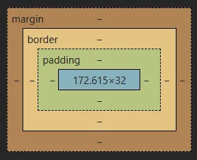

# Day 24: Tìm hiểu Box Model (Rất quan trọng)

> **`Kiến thức về Box Model rất quan trọng để tạo website với bố cục phức tạp`**

# 1. Mở đầu
Bây giờ bạn đã hiểu cú pháp cơ bản của HTML và CSS, chúng ta sẽ đi sâu hơn. Các kỹ năng quan trọng nhất mà bạn cần nắm vững với CSS là định vị (positioning ) và bố cục (layout). Thay đổi phông chữ và màu sắc là một kỹ năng quan trọng, nhưng khả năng đặt mọi thứ chính xác vào vị trí bạn muốn trên một trang web còn quan trọng hơn.

Học cách định vị các phần tử trên trang web không quá khó khi bạn chỉ hiểu một vài khái niệm chính. Thật không may, nhiều người cố gắng học vội vã HTML và CSS để chuyển sang học JavaScript và cuối cùng bỏ lỡ những khái niệm cơ bản này. Điều này dẫn đến sự thất vọng và đau đớn vì tất cả các kỹ năng JavaScript trên thế giới đều vô nghĩa nếu bạn không thể định vị các phần tử của mình vào đúng nơi bạn cần trên trang. Hãy nhớ điều này, và chúng ta sẽ bắt đầu.

Box Model là kiến thức nền tảng rất quan trọng. Vì vậy hãy dành nhiều thời gian một chút để đào sâu về nó trước khi học phần khác.

# 2. The box model là gì?
Khái niệm quan trọng đầu tiên mà bạn cần hiểu để thành công trong CSS là mô hình hộp (box model). Nó không phức tạp, nhưng việc bỏ qua nó ngay bây giờ sẽ khiến bạn rất khó chịu về sau.

Mọi thứ trên trang web đều là một hộp hình chữ nhật, bất kể là 1 text, 1 đoạn văn, 1 nút bấm, 1 đường link, 1 bức ảnh… đều là những khối hình hộp. Các hộp có thể xếp cạnh nhau, hoặc lồng vào nhau. Bạn có thể có ý tưởng sơ bộ về cách thức hoạt động của nó bằng cách áp dụng outline cho mọi thành phần trên trang như thế này:
```css
* {
  outline: 2px solid red;
}
```
>

Bạn có thể thêm CSS ở trên đến trang web này bằng cách bấm vào dấu + ở góc trên bên phải của “Styles” panel trong Element Tab.:

>

Kết quả:

>

Có thể có một số vòng tròn trong hình ảnh trên… nhưng khi nói đến bố cục, chúng khớp với nhau như các hộp chữ nhật chứ không phải hình tròn. Việc bố trí layout một trang web và định vị tất cả các phần tử của nó chính là việc bạn quyết định cách các hộp này sẽ lồng nhau và đặt cạnh nhau như thế nào .

>

**Tạo nên một Box Model trong CSS, chúng ta có các lớp sau:**

- Content box: Khu vực hiển thị nội dung của bạn; kích thước được xác định bằng bằng các thuộc tính như width và height.

- Padding box: Đệm nằm xung quanh nội dung dưới dạng khoảng trắng; định cỡ bằng cách sử dụng padding và các thuộc tính liên quan.

- Border box: Hộp viền bao quanh nội dung và bất kỳ phần đệm nào; định cỡ bằng cách sử dụng border và các thuộc tính liên quan.

- Margin box: Lề là lớp ngoài cùng, bao quanh nội dung, phần đệm và đường viền dưới dạng khoảng trắng giữa hộp này và các phần tử khác (hộp khác); định cỡ bằng cách sử dụng margin và các thuộc tính liên quan.

**Sơ đồ bên dưới hiển thị các lớp này:**

>

Sự phức tạp thực sự duy nhất ở đây là có nhiều cách để thao tác kích thước của các hộp này và khoảng cách giữa chúng, bằng cách sử dụng padding, border và margin. Để tóm tắt ngắn gọn:

- padding tăng khoảng cách giữa đường viền của hộp (border of a box) và nội dung của hộp (content of the box).

- border ngăn cách (kể cả khi chỉ là một hoặc hai pixel) giữa lề (margin) và phần đệm (padding)

- margin tăng khoảng cách giữa đường viền của hộp và đường viền của các hộp liền kề.

**Ta có thể hình dung như thế này:**

- Nội dung của hộp (content) giống 1 ngôi nhà hình chữ nhật.

- Xung quanh ngôi nhà có sân vườn, đó chính là padding

- Ngoài cùng sẽ có tường rào bao quanh, đó là border (đường viền)

- Phạm vi của ngôi nhà sẽ gồm có tường rào, sân vườn và bản thân ngôi nhà. Tức là content, padding, border sẽ nằm trong phần tử HTML.

- Còn phía ngoài tường rào là mương, cánh đồng, hoặc con đường, băng qua đó là đến nhà hàng xóm. Thì những thứ này chính là lề (margin)

**Lưu ý rằng chỉ có 3 yếu tố được tính vào kích thước của hộp (box) là content, padding và border. 3 yếu tố này nằm bên trong phần tử, còn margin nằm ngoài phần tử, nên sẽ không tính vào kích thước của hộp.**

- Ví dụ 1 phần tử có phần nội dung có chiều rộng =100px, chiều cao = 100 px. Nhưng padding và border đều =0, thì kích thước hộp đó chỉ là 100px x 100 px.

- Nếu ta thêm padding xung quanh = 10px thì hộp sẽ được mở rộng ra, và kích thước của phần tử lúc này là 120px x 120 px

- GIờ nếu ta thêm border là 1 đường có chiều dày 5px nữa thì kích thước hộp lúc này sẽ mở rộng thành 130px x 130px.

- Giờ nếu thêm lề (margin) xung quanh là 20px nữa, thì kích thước hộp vẫn là 130 px x 130 px. Lề chỉ có tác dụng trong việc tương tác với khác phần tử (các hộp khác) xung quanh nó.


# 3. Standard Box Model vs Alternate Box Model
Có 2 loại mô hình hộp, là standard box model (mô hình hộp chuẩn) và alternate box model. Theo mặc định, trình duyệt sử dụng mô hình hộp chuẩn.

## 3.1 Standard CSS box model
Trong mô hình hộp tiêu chuẩn, nếu bạn đặt giá trị thuộc tính width và height trên phần tử, các giá trị này sẽ xác định chiều rộng và chiều cao của content box. Bất kỳ phần đệm và đường viền nào sau đó được thêm vào sẽ làm tăng tổng kích thước của hộp.

Nếu chúng ta giả sử rằng một hộp có CSS ​​sau:
```css
.box {
  width: 350px;
  height: 150px;
  margin: 10px;
  padding: 25px;
  border: 5px solid black;
}
```
Không gian thực tế mà hộp chiếm dụng sẽ rộng 410px (350 + 25 + 25 + 5 + 5) và cao 210px (150 + 25 + 25 + 5 + 5). Tức là nói kích thước thực tế của hộp là 410px x 210px.

>
Lưu ý: Lề (margin) không được tính vào kích thước thực tế của hộp — chắc chắn là nó ảnh hưởng đến tổng không gian mà hộp sẽ chiếm trên trang, nhưng chỉ ảnh hưởng đến không gian bên ngoài hộp. Khu vực của hộp dừng lại ở đường viền —

## 3.2 Alternative CSS box model
Trong alternative box model (mô hình hộp thay thế), bất kỳ chiều rộng nào cũng là chiều rộng của hộp hiển thị trên trang. Chiều rộng của content box là chiều rộng đó trừ đi chiều rộng của phần đệm và đường viền (xem hình ảnh bên dưới). Không cần phải cộng đường viền và phần đệm để có được kích thước thực của hộp (như là standard box model ).

Để bật alternative box model cho một phần tử, hãy đặt box-sizing: border-box trên đó:
```css
.box {
  box-sizing: border-box;
}
```
Nếu chúng ta giả sử hộp có cùng mã CSS như trên:
```css
.box {
  width: 350px;
  height: 150px;
  margin: 10px;
  padding: 25px;
  border: 5px solid black;
}
```
Bây giờ, không gian thực tế mà hộp chiếm dụng sẽ là 350px x 150px.

>

Để sử dụng alternative box model cho tất cả các phần tử của bạn (đây là lựa chọn phổ biến của các nhà phát triển), đặt thuộc tính box-sizing trên phần tử<html> và thiết lập tất cả các phần tử khác để kế thừa giá trị đó:
```css
html {
  box-sizing: border-box;
}

*,
*::before,
*::after {
  box-sizing: inherit;
}
```
Theo mặc định `box-sizing: content-box;` đây là mô hình hộp tiêu chuẩn.

Khi khai báo `box-sizing: border-box;` thì ta sẽ có mô hình hộp thay thế.

# 4. Playing with box models
Trong ví dụ bên dưới, bạn có thể thấy hai hộp. Cả hai đều có lớp .box, cung cấp cho chúng cùng width, height, margin, border, và padding. Điểm khác biệt duy nhất là hộp thứ hai đã được thiết lập để sử dụng alternative box model. Bạn có thể thay đổi kích thước của hộp thứ hai (bằng cách thêm CSS vào lớp .alternate) để làm cho nó khớp với hộp đầu tiên về chiều rộng và chiều cao không?
```html
<div class="box">I use the standard box model.</div>
<div class="box alternate">I use the alternate box model.</div>
```
```css
.box {
  border: 5px solid rebeccapurple;
  background-color: lightgray;
  padding: 40px;
  margin: 40px;
  width: 300px;
  height: 150px;
}

.alternate {
  box-sizing: border-box;
}
```
Đáp án: Xem phần dưới cùng bài học này

# 5. Sử dụng DevTools để xem box model
Các công cụ phát triển trình duyệt của bạn có thể giúp hiểu mô hình hộp dễ dàng hơn nhiều — chúng có thể hiển thị cho bạn kích thước của phần tử cùng margin, padding, and border. Kiểm tra một phần tử theo cách này là một cách tuyệt vời để tìm hiểu xem hộp của bạn có thực sự có kích thước như bạn nghĩ không!

>


# Đáp án:
 Thêm width và height vào .alternate dưới đây. Nó sẽ ghi đè width và height ở selector phía trên. Các giá trị 390px và 240px chính là chiều rộng và chiều cao của hộp thứ nhất.
```css
.box {
  border: 5px solid rebeccapurple;
  background-color: lightgray;
  padding: 40px;
  margin: 40px;
  width: 300px;
  height: 150px;
}

.alternate {
  box-sizing: border-box;
  width: 390px;
  height: 240px;
}
```