# Day 25: Inline Box vs Block Box
 
Như ta đã biết mọi phần tử trong HTML dưới góc nhìn của CSS đều là một box. CSS có 2 loại hộp là: Block Box và Inline Box.

Mặc định, các phần tử HTML sẽ được phân làm 1 trong 2 loại là Block Box (hay Block Element) hoặc Inline Box (Inline Element). (Và 1 loại lai giữa 2 loại trên là Inline-Block Box)

Chúng ta có Thuộc tính display kiểm soát cách các phần tử HTML xuất hiện trên trang web. Nhìn chung, bạn có thể thiết lập nhiều giá trị khác nhau cho kiểu hiển thị bằng cách sử dụng thuộc tính display , thuộc tính này có thể có nhiều giá trị khác nhau. Chúng ta sẽ khám phá thêm các tùy chọn khác nhau của nó trong bài học này.

# 1. Block element:
Hầu hết các phần tử mà bạn đã học đến thời điểm này là phần tử kiểu block . Nói cách khác, default style của chúng là display: block. Theo mặc định các phần tử block sẽ xuất hiện trên page xếp chồng lên các phần tử khác, tức là mỗi phần tử sẽ bắt đầu trên 1 dòng mới.

**Đặc điểm của Block Element**:

- Box sẽ ngắt xuống dòng mới.

- Các thuộc tính width và height được tôn trọng.

- Đệm, lề và đường viền (Padding, margin, border)sẽ khiến các phần tử khác bị đẩy ra khỏi hộp.

- Nếu không chỉ định chiều rộng, hộp sẽ mở rộng theo hướng nội tuyến (inline direction, hướng ngang theo writing-mode) để lấp đầy không gian có sẵn trong vùng chứa của nó. Trong hầu hết các trường hợp, hộp sẽ rộng bằng vùng chứa của nó, lấp đầy 100% không gian có sẵn.

**Dưới đây là các phần tử block trong HTML:**
>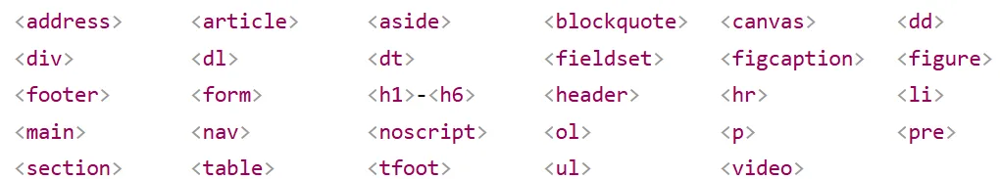


# 2. Inline element:
Các phần tử Inline thì không bắt đầu trên một dòng mới. Chúng xuất hiện trên cùng dòng với bất kỳ phần tử nào khi chúng được đặt cạnh phần tử đó. Một ví dụ của một Inline element là một link, tức là một `<a>` tag. Nếu bạn gắn đoạn [liên kết này vào giữa một đoạn văn bản](https://open.substack.com/pub/kaitaku/p/tu-hoc-lap-trinh-full-stack-ngay-d35?r=31jo7q&utm_campaign=post&utm_medium=web&showWelcomeOnShare=false), liên kết sẽ hoạt động như một phần của đoạn văn. Ngoài ra, padding và margin trên phần tử Inline cũng sẽ hoạt động khác so với block element. Nhìn chung, bạn không nên cố gắng thêm padding hoặc margin vào các phần tử Inline .

**Đặc điểm của Inline element:**

- Hộp sẽ không ngắt xuống dòng mới.

- Các thuộc tính chiều rộng và chiều cao sẽ không được áp dụng.

- padding, margins, and borders trên và dưới sẽ được áp dụng nhưng sẽ không đẩy các Inline element khác ra xa khỏi hộp. Tức là bạn sẽ vẫn thấy padding khiến cho border trên dưới cách xa nội dung, nhưng chúng sẽ đè lên các Inline element khác chứ không đẩy đi xa.
>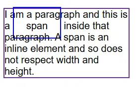
- padding, margins, and borders trái và phải sẽ được áp dụng và đẩy các Inline element khác ra xa khỏi hộp. Như ví dụ dưới ta thấy margin cũng chỉ ảnh hưởng đến 2 phía trái phải, không ảnh hưởng đến trên, dưới.
>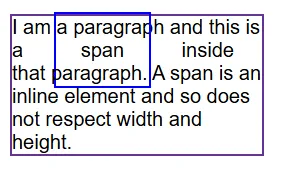

**Dưới đây là các phần tử Inline trong HTML:**
>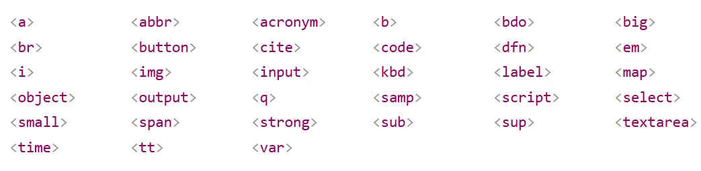


# 3. Divs và spans
Chúng ta không thể nói về block và inline elements mà không thảo luận về div và span. Tất cả các phần tử HTML khác mà chúng ta đã gặp cho đến nay đều có ý nghĩa đối với nội dung của chúng. Ví dụ, các phần tử đoạn văn `<p>` yêu cầu trình duyệt hiển thị văn bản mà nó chứa dưới dạng một đoạn văn. Các phần tử `<strong>` cho trình duyệt biết văn bản nào trong đó là quan trọng, v.v. Tuy nhiên, div và span không có ý nghĩa cụ thể nào đối với nội dung của chúng. Chúng chỉ là các hộp chung chung có thể chứa bất kỳ thứ gì.

Việc có các phần tử như div và span hữu ích hơn nhiều so với vẻ bề ngoài của nó. Chúng ta thường cần các phần tử không phục vụ mục đích nào khác ngoài việc trở thành các thành phần "móc (hook)". Chúng ta có thể cung cấp một id hoặc class để tạo kiểu bằng CSS cho chúng. Một trường hợp sử dụng khác mà chúng ta sẽ thường xuyên gặp phải là nhóm các phần tử liên quan dưới một phẩn tử cha để định vị chính xác chúng trên page. Div và span cung cấp cho chúng ta khả năng thực hiện điều này.

Div theo mặc định là một block element. Nó thường được sử dụng như một phần tử chứa để nhóm các phần tử khác. Div cho phép chúng ta chia trang thành các khối khác nhau và áp dụng styles cho các khối đó.

Span là một inline element theo mặc định. Nó có thể được sử dụng để nhóm nội dung văn bản và các phần tử inline HTML để tạo kiểu và chỉ nên được sử dụng khi không có phần tử HTML ngữ nghĩa (semantic HTML) nào khác phù hợp.

# 4. Box Model và Inline Box.
Nói chúng các hành vi của Mô hình hộp CSS (CSS Box Model) được áp dụng đầy đủ cho các Block Box và xác định cách các phần khác nhau của hộp (lề, đường viền, đệm và nội dung) phối hợp với nhau để tạo ra một hộp mà bạn có thể nhìn thấy trên một trang.

Chỉ có 1 số thuộc tính được áp dụng (có hiệu lực) đối với Inline Box.

Trong ví dụ dưới đây, chúng ta có một `<span>` bên trong một đoạn văn. Chúng ta đã áp dụng width, height, margin, border, và padding cho nó. Bạn có thể thấy rằng width, height bị bỏ qua. margin, border, và padding được tôn trọng nhưng không thay đổi mối quan hệ của nội dung khác với hộp nội tuyến của chúng ta. border, và padding chồng lên các từ khác trong đoạn văn. margin, border, và padding đẩy các nội dung khác ra khỏi hộp.

Copy nội dung dưới vào đây để xem kết quả: https://jsfiddle.net/
```html
<p>
  I am a paragraph and this is a <span>span</span> inside that paragraph. A span
  is an inline element and so does not respect width and height.
</p>
```
```css
body {
  font-family: sans-serif;
}
p {
  border: 2px solid rebeccapurple;
  width: 200px;
}
span {
  margin: 20px;
  padding: 20px;
  width: 80px;
  height: 150px;
  background-color: lightblue;
  border: 2px solid blue;
}
```
>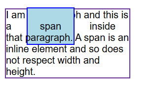  

# 5. Kiểu hiển thị Inline-block :
display: inline-block là 1 giá trị đặc biệt của display, khiến cho padding và margin của phần tử inline cư xử giống như phần tử block. Hãy dùng nó nếu bạn không muốn một mục nào đó break xuống một dòng mới (đặc tính của Inline), nhưng muốn thuộc tính width và height có hiệu lực trên nó.

display: inline-block là một công cụ hữu ích, nhưng trên thực tế, bạn có thể sẽ phải dùng đến flexbox thường xuyên hơn nếu bạn đang cố gắng sắp xếp một loạt các hộp. Flexbox sẽ được trình bày chi tiết trong bài học tiếp theo.

**Đặc điểm của một phần tử với display: inline-block**

- Có tác dụng khi khai báo thuộc tính width và height. (Đây là thuộc tính của block box)

- Không break xuống dòng mới (Thuộc tính của Inline box)

- padding, margin, và border được áp dụng đầy đủ sẽ đẩy các phần tử khác ra xa.

Ví dụ 1: Hãy quan sát phần tử `<span>` .
```html
<p>
  I am a paragraph and this is a <span>span</span> inside that paragraph. A span
  is an inline element and so does not respect width and height.
</p>

<p>
  I am a paragraph and this is a <span class ="span2">span</span> inside that paragraph. A span
  is an inline element and so does not respect width and height.
</p>

<p>
  I am a paragraph and this is a <span class ="span3">span</span> inside that paragraph. A span
  is an inline element and so does not respect width and height.
</p>
```
```css
body {
  font-family: sans-serif;
}
p {
  border: 2px solid rebeccapurple;
  width: 300px;
}

span {
  margin: 20px;
  padding: 20px;
  width: 80px;
  height: 50px;
  background-color: lightblue;
  border: 2px solid blue;
  display: inline-block;

}

.span2 {
  display: inline-block;
}

.span3 {
  display: block;
}
```
Hãy quan sát các box model trên trong DevTools để thấy sự khác biệt:
>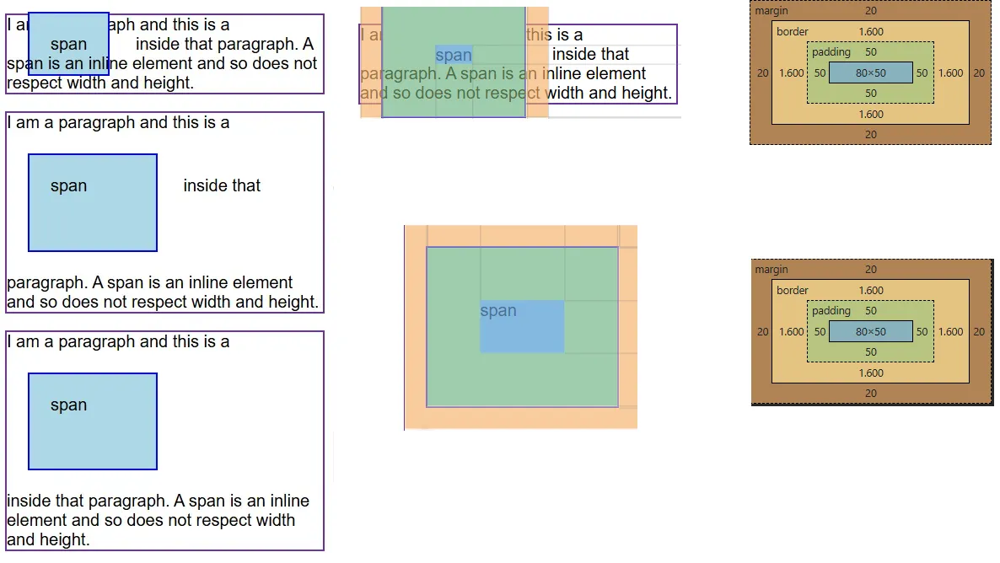  

Ta thấy:

`<span>` đầu tiên mặc dù khai báo width, height, nhưng không có tác dụng (width, height này là của phần content box màu xanh lam ở giữa). Phần padding trái phái thì có tác dụng, khiến border đẩy ra phần content. Phần padding trên dưới cũng khiến border đẩy ra xa content, nhưng không ảnh hưởng đến các dòng trên và dưới. Chỉ có margin trái phải có hiệu lực, trên dưới không có hiệu lực.

`<span>` số 2 và` <span>` số 3 giống nhau, các thuộc tính width, height, margin, padding đều được áp dụng đầy đủ. Chỉ có 1 điểm khác biệt vì `<span>` số 2 là inline-block nên nó không break xuống dòng mới.

Điều này có thể hữu ích khi bạn muốn cung cấp cho liên kết một vùng nhấn lớn hơn bằng cách thêm phần padding. `<a>` là một phần tử inline giống như `<span>`; bạn có thể sử dụng display: inline-block để cho phép đặt phần đệm trên đó, giúp người dùng dễ dàng nhấp vào liên kết hơn. Hãy xem Ví dụ dưới:
```html
<nav>
  <ul class="links-list">
    <li><a href="">Link one</a></li>
    <li><a href="">Link two</a></li>
    <li><a href="">Link three</a></li>
  </ul>
</nav>
```
```css
ul {
  font-family: sans-serif;
  list-style: none;
  border: 1px solid #000;
}

li {
  margin: 5px;
}

.links-list a {
  background-color: rgb(179 57 81);
  color: #fff;
  text-decoration: none;
  padding: 1em 2em;
}

.links-list a:hover {
  background-color: rgb(66 28 40);
  color: #fff;
}
```
Kết quả:
>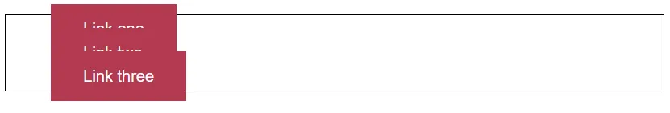

Rõ ràng không phải cái ta mong muốn, cái mà ta mong muốn là như thế này:
>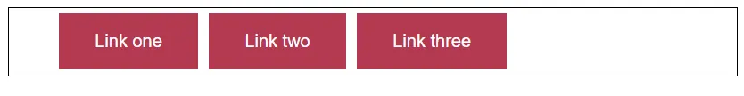

**Phương án 1:**

Khai báo display:flex; trong ul { } để thay đổi Inner Display của `<ul>`. Kết quả như sau:
>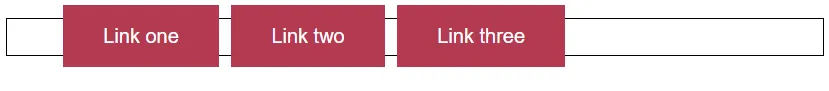

Lúc này 3 button đã nằm trên 1 đường ngang, nhưng lại đè lên viền của `<ul>`. Chứng tỏ là thuộc tính padding và margin phía trên, dưới không có tác dụng. Vì vậy phải thay đổi kiểu Outer Display của 3 phần tử này thành dạng block hoặc inline-block. Trong .links-list a { } ta khai báo display:block; hoặc display:inline-block; thì sẽ được kết quả cuối cùng.
>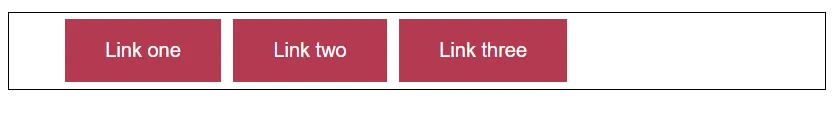
```css
ul {
  font-family: sans-serif;
  list-style: none;
  border: 1px solid #000;
    display: flex;
}

li {
   margin: 5px;  
 
}

.links-list a {
  background-color: rgb(179 57 81);
  color: #fff;
  text-decoration: none;
  padding: 1em 2em;
  display: block;
}

.links-list a:hover {
  background-color: rgb(66 28 40);
  color: #fff;
}
```
### **Câu hỏi đặt ra là:**
Sao không khai báo trong selector li { } mà lại khai báo trong selector a { }. Vì mặt hình thức, ta có thể khai báo khác đi để nhìn giống với kết quả ở trên. Ví dụ :

- Ta không khai báo display: flex; trong ul { }

- Ta không khai báo trong selector a { }

- Mà ta khai báo trong selector li { } vì ta thấy `<a>` được bọc trong `<li>`.
```css
ul {
  font-family: sans-serif;
  list-style: none;
  border: 1px solid #000;
}

li {
  margin: 5px;
  display:inline-block;
  background-color: rgb(179 57 81);
  color: #fff;
  padding: 1em 2em;
}

.links-list a {
  color: #fff;
  text-decoration: none;
}

.links-list a:hover {
  background-color: rgb(66 28 40);
  color: #fff;
}
```
Kết quả nhìn khá ok:
>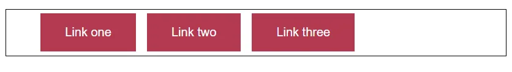

Nhưng khi di chuột vào button thì ta sẽ nhận ra phần màu đỏ đỏ không phải là `<a>`, nó là của `<li>`, phần link thực sự chỉ là phạm vi bao quanh chữ.

### **Câu hỏi tiếp theo:**
Vậy có giải pháp nào khác nữa không. Có, ở phương án 1 ta sử dụng display: flex để thay đổi inner display của `<ul>` khiến các phần tử con là các `<li>` trở thành các flex item. Lần này ta sẽ không tác động gì đến `<ul>` mà sẽ tác động vào `<li>`.

Mặc định `<li>` có outer display là một block box. Giờ ta sẽ khai báo để biến nó thành inline box. Trong selector a { } vẫn khai báo như phương án 1:
```css
ul {
  font-family: sans-serif;
  list-style: none;
  border: 1px solid #000;
}

li {
   margin: 5px;  
  display: inline-block;
 
  
}

.links-list a {
  background-color: rgb(179 57 81);
  color: #fff;
  text-decoration: none;
  padding: 1em 2em;
  display: block;
}

.links-list a:hover {
  background-color: rgb(66 28 40);
  color: #fff;
}
```


# 6. Kiểu hiển thị Inner display vs Outer display
Trong những phần trước ta đã làm quen 3 các kiểu hiển thị là: display: block; display: inline ; display: inline-block.Tất cả các loại này đều là kiểu hiển thị Outer display. Khi nói đến việc bố trí các phần tử (các box) thì bản thân một phần tử (1 box) có 2 kiểu là Outer display và Inner display.

## 6.1 Outer display:
Là kiểu hiển thị tổng thể của một phần tử trong mối quan hệ với các phần tử khác xung quanh nó. Tức là giá trị của Outer display ảnh hưởng đến cách phần tử đó "đứng" trong layout tổng thể. Ví dụ:

- display: block: phần tử chiếm toàn bộ chiều ngang, xuống dòng so với phần tử khác.

- display: inline: phần tử nằm trên cùng dòng với phần tử khác, không xuống dòng.

## 6.2 Inner display:
Các box cũng có một kiểu hiển thị là inner display, cái mà quy định cách các phần tử con bên trong phần tử hiện tại được sắp xếp. Ví dụ:

- display: flex: thiết lập layout dạng flexbox cho các phần tử con.

- display: grid: thiết lập layout dạng lưới cho các phần tử con.

Ngoài flex, grid thì ta sẽ gặp thêm các giá trị Inner display khác khi ta học nhiều hơn về CSS.

## 6.3 Sự kết hợp giữa Outer và Inner display
Ví dụ khi ta khai báo:
```css
ul, div {
  display: flex;
}
```
Bản thân ul, div mặc định là block box. Tức là mặc định display: block; Vậy khi ta khai báo display: flex thì outer display vẫn là block (theo mặc định của div hoặc ul). Chỉ có Inner display = flex (nên các li con được sắp xếp theo dạng flex).

Bất kỳ phần tử con trực tiếp nào của box sẽ trở thành các mục flex và hoạt động theo thông số của kỹ thuật của Flexbox (sẽ có các bài riêng về flex box).

## 6.4 Ví dụ về các kiểu display khác nhau
### Ví dụ 1:
```html
<p>I am a paragraph. A short one.</p>
<ul>
  <li>Item One</li>
  <li>Item Two</li>
  <li>Item Three</li>
</ul>
<p>
  I am another paragraph. Some of the <span class="block">words</span> have been
  wrapped in a <span>span element</span>.
</p>
```
```css
body {
  font-family: sans-serif;
}
p,
ul {
  border: 2px solid rebeccapurple;
  padding: 0.2em;
}

.block,
li {
  border: 2px solid blue;
  padding: 0.2em;
}

ul {
  display: flex;
  list-style: none;
}

.block {
  display: block;
}
```
Kết quả:
>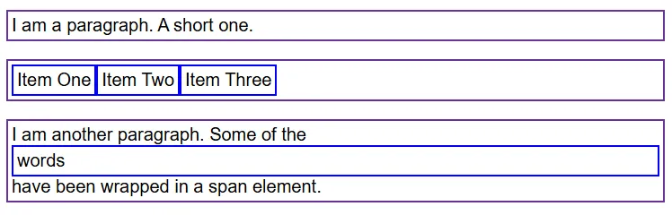  

Trong ví dụ trên chúng ta có 3 phần tử HTML. 2 `<p>` và 1 `<ul>`. Cả 3 phần tử này theo mặc định đều có outer display là kiểu block. Để dễ quan sát tất cả các phần tử đều được thêm border.

- `<p>` đầu tiên chiếm nguyên 1 dòng và mở rộng toàn bộ dòng rộng nhất có thể.

- Một `<ul>` có thuộc tính display: flex Điều này đã thiết lập bố cục cho các phần tử con bên trong nó là flex. Các phần tử con của `<ul>` là `<li>` cũng mặc định có thuộc tính display: block. Tức là sẽ chiếm nguyên 1 dòng, ví dụ thế này:
>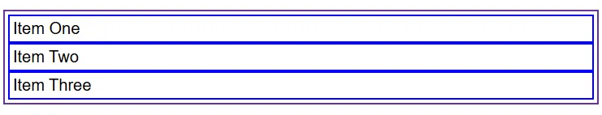

Nhưng vì đã thiết lập display: flex nên sẽ là thế này (Cụ thể ta học trong các bài tiếp theo về flex):
>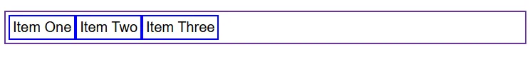

`<p>` ở cuối cùng có chưa 2 phần từ `<span>`. Bản thân `<span> `là phần tử có Outer display mặc định là display: inline.

Tuy nhiên `<span>` đầu tiên được khai báo thuộc tính là display: block điều này dẫn đến nó mở rộng và chiếm nguyên 1 dòng.


### Ví dụ 2
```html
<p>
  I am a paragraph. Some of the
  <span>words</span> have been wrapped in a <span>span element</span>.
</p>
<ul>
  <li>Item One</li>
  <li>Item Two</li>
  <li>Item Three</li>
</ul>
<p class="inline">I am a paragraph. A short one.</p>
<p class="inline">I am another paragraph. Also a short one.</p>
```
```css
body {
  font-family: sans-serif;
}
p,
ul {
  border: 2px solid red;
}

span,
li {
  border: 2px solid blue;
  margin: 3px;
}

ul {
  display: inline-flex;
  list-style: none;
  padding: 0;
}

.inline {
  display: inline;
}
```
Phần tử `<p>` đầu tiên có `<span>, <span>` có kiểu hiển thị outer mặc định là inline ta sẽ thấy `<p>` này hiển thị bình thường, không có gì đặc biệt.
>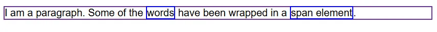  

Ta sẽ đi xem xét các trường hợp khác nhau khi khai báo display của `<ul>` với các giá trị khác nhau để xem giữa `<ul>` và 2 phần tử `<p>` phía dưới sẽ như thế nào:

#### TH1: display:block;
```css
ul {
  display: block;
  list-style: none;
  padding: 0;
}

.inline {
  display: inline;
}
```
>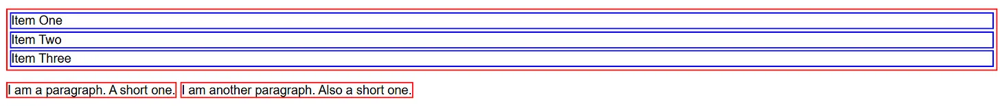

Mặc định kiểu hiển thị outer của `<ul>` là block, cho nên khái báo display: block; cũng giống như là không khai báo. Kết quả sẽ là như sau, `<ul>` sẽ mở rộng hết cỡ, và chiếm nguyên 1 dòng, đẩy 2 `<p>` xuống dòng khác. Viền của` <ul>` và `<p>` màu đỏ, còn viền của `<li>` màu xanh.

#### TH2: display: inline;
```css
ul {
  display: inline;
  list-style: none;
  padding: 0;
}

.inline {
  display: inline;
}
```
>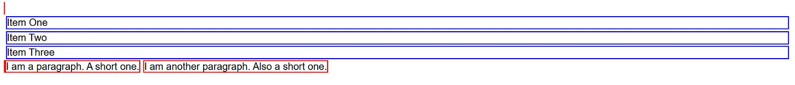  

Khi khai báo như thế này thì bản thân `<ul>` sẽ có kiểu hiển thị outer là inline, tức là nó không chiếm full chiều rộng dòng, và sẽ không đẩy 2 `<p>` xuống dòng mới. Tuy nhiên các phần tử con của nó là `<li>` vẫn là kiểu block nên vẫn xếp theo 1 hàng dọc, và vẫn chiếm nguyên 1 dòng. Ta sẽ thấy `<li>` nhìn không khác gì TH1, nhưng `<ul>` chỉ còn 1 chút màu đỏ (viền).


#### TH3: display: inline-flex;
```css
ul {
  display: flex;
  list-style: none;
  padding: 0;
}

.inline {
  display: inline;
}
```
>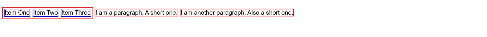

Khi khai báo như thế này thì outer display sẽ chuyển từ block thành inline, và inner display sẽ chuyển thành flex. Khi đó cả `<li> và <ul>` đều sẽ chỉ chiếm tối thiểu không gian, chứ không chiếm nguyên dòng. Lúc này 2 đoạn `<p>` sẽ không bị đẩy xuống dòng mới.


#### TH4: display: flex;
```css
ul {
  display: flex;
  list-style: none;
  padding: 0;
}

.inline {
  display: inline;
}
```
>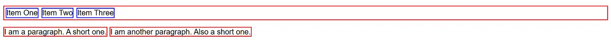
  
Ta thấy là ul mặc định có kiểu hiển thị outer là block, khi khai báo display:flex chỉ làm thay đổi kiểu hiển thị inner. Do đó bản thân `<ul>` vẫn chiếm nguyên 1 dòng. Nhưng 3 `<li>` bên trong nó thì trở thành phần tử flex (bố trí theo kiểu flex, sẽ học trong bài flexbox).

**`Điều quan trọng cần nhớ hiện tại là:`** Thay đổi giá trị của thuộc tính display có thể thay đổi cách mà phần tử hiển thị cùng với các phần tử khác trong bố cục (layout).

