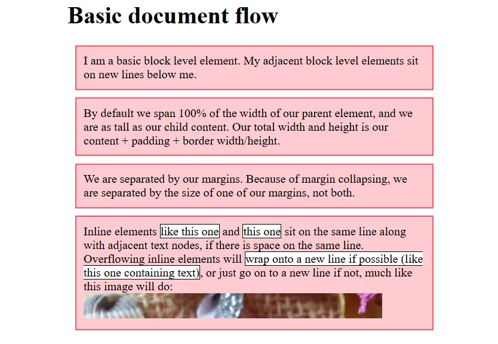

# Day 26 CSS Normal FLow Layout

# 1. What is the CSS Normal flow layout 
Normal flow (hay còn gọi là normal layout flow) là cách mặc định mà trình duyệt sắp xếp các phần tử HTML trên trang web khi mà không có sự can thiệp đặc biệt nào từ CSS như float, position, hay flex/grid.. Tức là Nếu bạn không can thiệp gì bằng CSS , thì trình duyệt sẽ tự động dùng “normal flow” để hiển thị mọi thứ trong viewport.

Các kỹ thuật page layout CSS cho phép chúng ta lấy các elements có trong một webpage và kiểm soát vị trí của chúng sẽ liên quan đến các yếu tố sau:

- Vị trí mặc định của chúng trong luồng bố cục bình thường (Normal flow),

- Các phần tử khác xung quanh chúng

- Container của phần tử cha của chúng

- Cửa sổ/khung nhìn chính (main viewport/window)

Các kỹ thuật bố cục trang đề cập bên dưới đều có công dụng, ưu điểm và nhược điểm riêng. Không có kỹ thuật nào được thiết kế để sử dụng riêng lẻ. Bằng cách hiểu mục đích của từng phương pháp bố cục (layout), bạn sẽ hiểu được phương pháp nào phù hợp nhất cho từng nhiệm vụ.

Các thành phần trên trang web được bố trí theo luồng bình thường (normal flow) nếu bạn chưa áp dụng bất kỳ CSS nào để thay đổi cách chúng hoạt động. Bạn có thể thay đổi cách các phần tử hoạt động bằng cách điều chỉnh vị trí của chúng trong normal flow hoặc xóa chúng hoàn toàn khỏi normal flow. Nếu có thể viết được mã nguồn .html mà có cấu trúc tốt, có thể đọc bình thường ngay cả khi chưa sử dụng CSS thì là tốt nhất. Nó đảm bảo rằng nội dung của bạn có thể đọc được ngay cả khi người dùng sử dụng trình duyệt rất hạn chế hoặc thiết bị như trình đọc màn hình đọc nội dung của trang. Ngoài ra, vì normal flow được thiết kế để tạo ra một tài liệu có thể đọc được, bằng cách bắt đầu theo cách này, bạn đang làm việc với tài liệu thay vì phải vật lộn với nó khi bạn thực hiện các thay đổi đối với bố cục.

Mặc định, một phần tử block (ví dụ: `<div>, <p>, <h1>`) sẽ: Chiếm toàn bộ chiều ngang (inline space) bên trong phần tử cha (nếu không giới hạn width). Và Tự động co giãn chiều cao (block dimension) để chứa hết nội dung bên trong. Hiểu đơn giản: Một block box mặc định sẽ rộng bằng cái hộp chứa nó, và cao lên nếu nội dung bên trong nhiều hơn.

Còn Kích thước của các phần tử inline box chỉ là kích thước của nội dung của chúng. Bạn có thể đặt chiều rộng hoặc chiều cao trên một số phần tử có giá trị thuộc tính hiển thị mặc định là inline, như ``, nhưng giá trị hiển thị vẫn sẽ là inline. Không chiếm full chiều ngang. Không đẩy nội dung khác xuống dòng (nằm cùng dòng với nhau nếu còn chỗ trống).

Nếu bạn muốn kiểm soát thuộc tính display của một inline box element theo cách này, hãy sử dụng CSS để thiết lập cho nó hoạt động giống như một block box element (ví dụ: display: block; or display: inline-block kết hợp các đặc điểm từ cả hai).

**Chúng ta đã biết từng phần tử hoạt động thế nào, vậy khi nhiều phần tử cùng xuất hiện thì chúng sắp xếp với nhau ra sao?**

- Mặc định, các block elements sẽ được sắp xếp theo hướng gọi là "block flow direction". Hướng này phụ thuộc vào thuộc tính CSS là writing-mode của phần tử cha (cách viết). Giá trị mặc định của thuộc tính này là horizontal-tb (ngang - từ trái sang phải, tb là top bottom từ trên xuống dưới). Với tiếng Anh hoặc các ngôn ngữ viết từ trái sang phải và từ trên xuống (như tiếng Việt), các khối được xếp dọc từ trên xuống dưới. (Tiếng Nhật, Tiếng Trung Quốc cổ có thêm cách viết là dọc từ trên xuống dưới, từ phải qua trái). Mỗi phần tử block sẽ nằm trên một dòng riêng, bên dưới phần tử trước đó. Giữa các phần tử có thể có khoảng cách (margin), nếu bạn đặt CSS hoặc có mặc định.

- Các Inline elements có cách hoạt động khác. Chúng không xuất hiện trên các dòng mới; thay vào đó, tất cả chúng đều nằm trên cùng một dòng cùng với bất kỳ nội dung văn bản liền kề nào khác miễn là có đủ không gian để chúng thực hiện việc đó bên trong chiều rộng của phần tử block cha. Nếu không có đủ không gian, thì nội dung tràn sẽ di chuyển xuống một dòng mới. Tức là nếu như phần tử block element sẽ cố gắng chiếm nhiều không gian nhất có thể của phần tử cha, thì inline element sẽ chỉ chiếm chỗ tối thiểu cần thiết.

Margin collapsing: Nếu hai block element theo chiều dọc đều có margin và lề này của chúng chạm vào nhau, lề lớn hơn trong hai lề sẽ vẫn còn và lề nhỏ hơn sẽ biến mất. Điều này được gọi là thu gọn lề (Margin collapsing). Thu gọn lề chỉ có liên quan theo hướng dọc, và chỉ xảy ra đới với block element. (Sẽ học trong 1 bài riêng sau)

# 2. Các ví dụ về Normal Flow:
Mở đường dẫn: https://jsfiddle.net/

hoặc https://developer.mozilla.org/en-US/play

Sau đó Copy đoạn code dưới tương ứng và phần HTML và CSS, sau đó bấm Run sẽ thấy kết quả.

Hoặc bạn có thể tự tạo file .html và .css bằng VSCode và chạy trên trình duyệt.
```html
<h1>Basic document flow</h1>

<p>
  I am a basic block level element. My adjacent block level elements sit on new
  lines below me.
</p>

<p>
  By default we span 100% of the width of our parent element, and we are as tall
  as our child content. Our total width and height is our content + padding +
  border width/height.
</p>

<p>
  We are separated by our margins. Because of margin collapsing, we are
  separated by the size of one of our margins, not both.
</p>

<p>
  Inline elements <span>like this one</span> and <span>this one</span> sit on
  the same line along with adjacent text nodes, if there is space on the same
  line. Overflowing inline elements will
  <span>wrap onto a new line if possible (like this one containing text)</span>,
  or just go on to a new line if not, much like this image will do:
  
</p>
```
```css
body {
  width: 500px;
  margin: 0 auto;
}

p {
  background: rgb(255 84 104 / 30%);
  border: 2px solid rgb(255 84 104);
  padding: 10px;
  margin: 10px;
}

span {
  background: white;
  border: 1px solid black;
}
```
Kết quả:
>  

Lưu ý cách HTML được hiển thị theo đúng thứ tự xuất hiện trong mã nguồn, với các phần tử khối được xếp chồng lên nhau.

Đối với nhiều phần tử trên trang của bạn, luồng bình thường sẽ tạo ra chính xác bố cục bạn cần. Tuy nhiên, đối với các bố cục phức tạp hơn, bạn sẽ cần thay đổi hành vi mặc định này bằng một số công cụ có sẵn trong CSS. Bắt đầu bằng một tài liệu HTML có cấu trúc tốt là rất quan trọng vì sau đó bạn có thể làm việc với cách mọi thứ được bố trí theo mặc định thay vì chống lại nó.


## Tài liệu phải đọc khi ĐÓNG CỌC LẦN 2

1. Tài nguyên học CSS Layout khá hay tại đây: [Learn CSS Layout](https://learnlayout.com/toc)

> ⭐ **Theo dõi [kênh Threads](https://www.threads.com/@kaitaku.88) để đọc bài mới mỗi ngày!** ⭐  

**[<== Bài Trước  ](link)          |[  Trang Chủ  ](./README.md)|           [  Bài Sau ==>](link)**