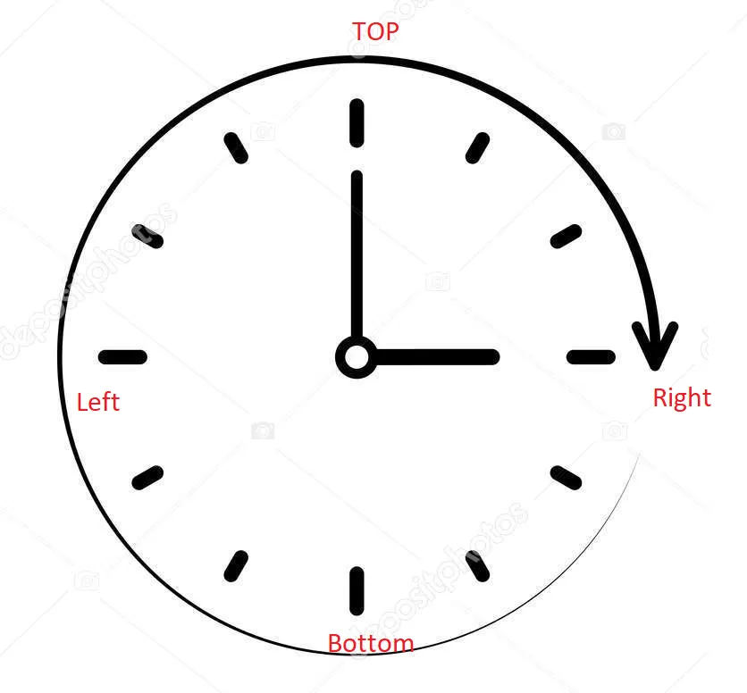
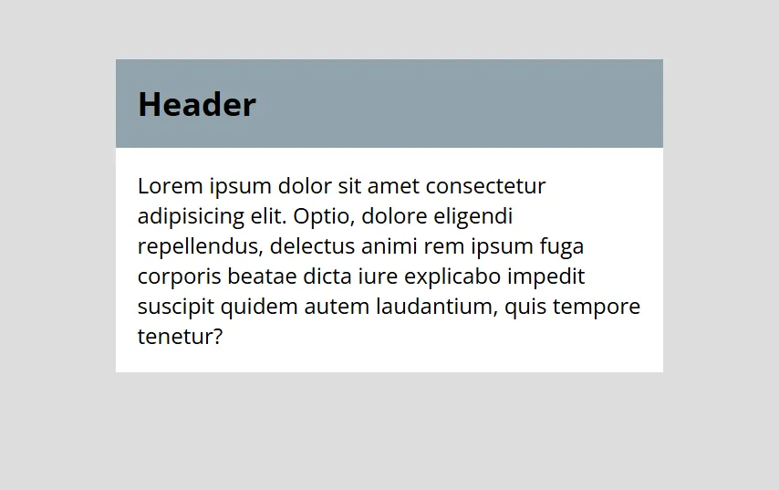
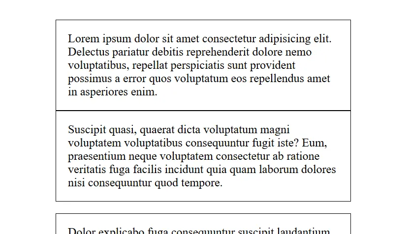
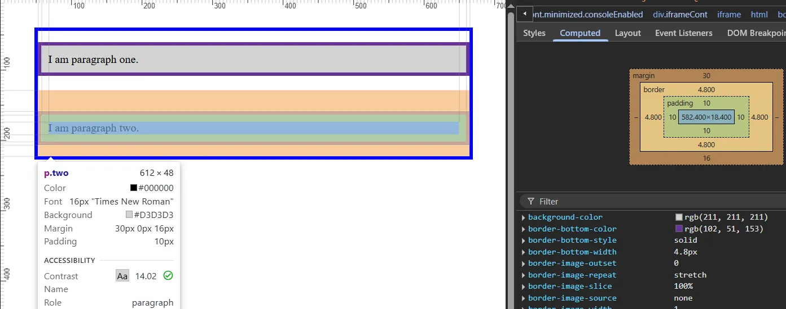
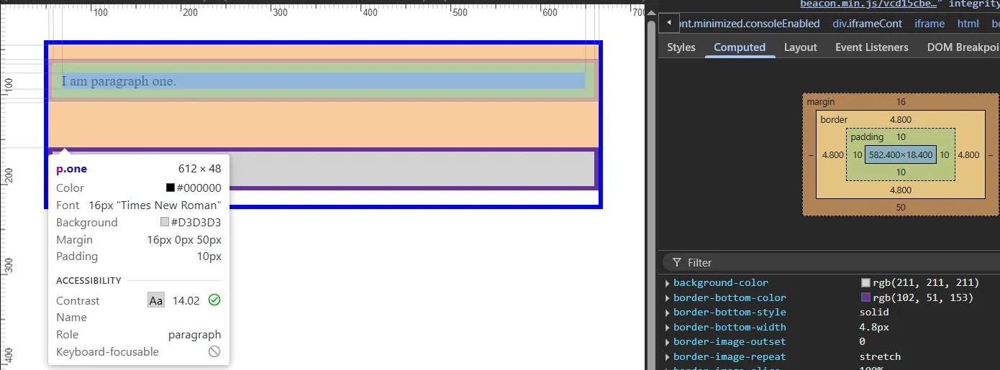
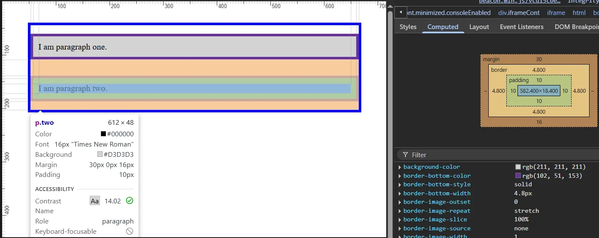
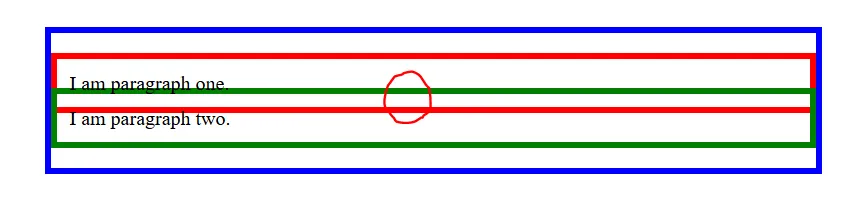
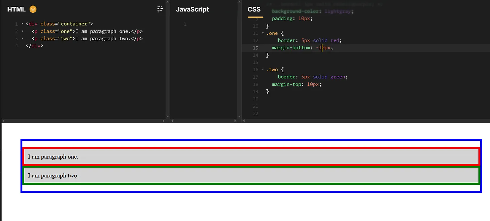
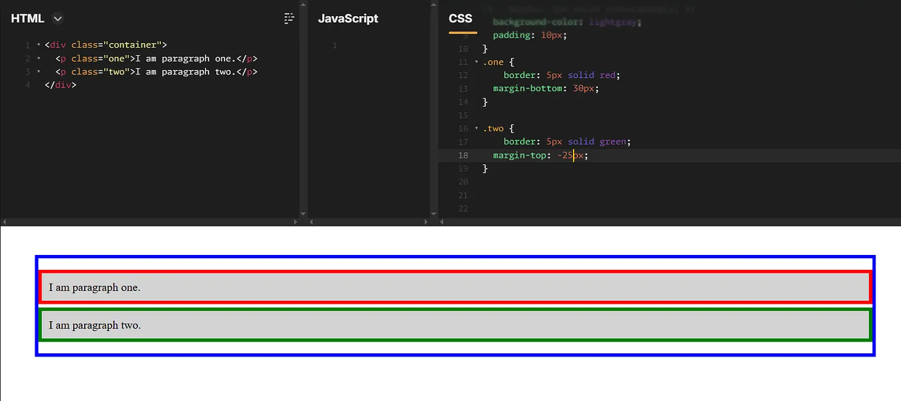
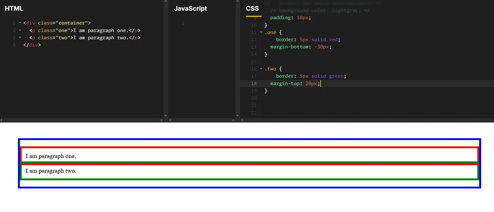

# Day 27: Margin, Padding, Border

# **`A. Margin`**
Thuộc tính margin xác định phần ngoài cùng của mô hình hộp (Box Model), tạo không gian xung quanh một phần tử, bên ngoài đường viền.

Lề (margin) được thiết lập bằng cách sử dụng độ dài, phần trăm hoặc từ khóa auto và có thể có giá trị âm. Sau đây là một ví dụ:
```css
.box {
  margin: 0 3em 0 3em;
}
```
- `em` là một đơn vị tương đối trong CSS. 1 em = kích thước font hiện tại của phần tử đó. Nếu phần tử .box đang có font-size: 16px, thì 1em = 16px, Vậy 3em = 3 × 16px = 48px

- Vì `em` là đơn vị tương đối với font-size, nên nếu font-size thay đổi (do kế thừa hoặc thiết lập riêng), thì 3em cũng sẽ thay đổi theo. em rất hữu ích khi bạn muốn layout có thể co giãn theo cỡ chữ, hỗ trợ tốt cho accessibility (truy cập nội dung dễ dàng hơn khi người dùng tăng cỡ chữ). Nếu bạn muốn layout ổn định bất kể cỡ chữ, có thể dùng px (đơn vị tuyệt đối).

margin là một thuộc tính viết tắt, chấp nhận từ 1 đến tối đa bốn giá trị.

Nếu chỉ có 1 giá trị được khai báo thì tất cả 4 lề (trên dưới trái phải) đều bằng nhau:
```css
.box {
  margin: 2em;
}
```
Nếu khai báo 2, 3, hoặc 4 giá trị thì tuân theo quy tắc thuận chiều kim đồng hồ, bắt đầu từ vị trí 12h=Top Margin Và áp dụng quy tắc đối xứng.
> 

Ví dụ chỉ khai báo 2 giá trị: margin: 20px 40px thì giá trị đầu tiên là Top Margin (tại 12h) = 20px, tiếp theo là 3h là giá trị Right Margin = 40px. Vì chỉ có 2 giá trị nên sẽ theo quy tắc đối xứng, nên Bottom Margin = Top Margin, Left Margin = Right Margin.

Nếu khai báo 3 giá trị ví dụ: margin: 20px 40px 60px thì tương ứng là Top, Right, Bottom. Còn Left Margin sẽ bằng Right Margin = 40px do đối xứng.

Nếu khai báo 4 giá trị rõ ràng, thì thứ tự sẽ là Top, Right, Bottom, Margin, ví dụ: margin: 20px 40px 60px 70px; Lệnh này sẽ tương đương với khai báo riêng lẻ ở phía dưới:

Hoặc có thể khai báo riêng lẻ cho từng vị trí margin:
```css
.box {
  margin-top: 20px;
  margin-right: 40px;
  margin-bottom: 60px;
  margin-left: 70px;
}
```
## Thuộc tính `auto` và việc căn giữa
Mỗi thuộc tính lề cũng có thể chấp nhận giá trị auto. Về cơ bản, giá trị auto sẽ bảo trình duyệt tự xác định margin cho bạn. Trong hầu hết các trường hợp, giá trị auto sẽ tương đương với giá trị 0 (là giá trị ban đầu cho mỗi thuộc tính lề) hoặc bất kỳ khoảng trống nào có sẵn ở phía bên đó của phần tử. Tuy nhiên, auto rất tiện dụng để căn giữa theo chiều ngang:
```css
.container {
  width: 980px;
  margin: 0 auto; 
}
```
Trong ví dụ này, hai điều được thực hiện để căn giữa phần tử này theo chiều ngang trong không gian có sẵn:

- Phần tử được chỉ định chiều rộng

- Lề trái và lề phải được đặt thành auto

Nếu không có chiều rộng được chỉ định, các giá trị auto về cơ bản sẽ không có tác dụng, trình duyệt sẽ tự động coi lề trái phải bằng 0 hoặc dùng hết khoảng không gian có sẵn bên trong phần từ cha mà không căn giữa phần tử con.

Cũng cần lưu ý rằng auto chỉ hữu ích cho việc căn giữa theo chiều ngang, do đó, sử dụng auto cho lề trên và lề dưới sẽ không căn giữa phần tử theo chiều dọc, điều này có thể gây nhầm lẫn cho người mới bắt đầu

Ví dụ, hãy thử nghiệm để xem kết quả:
```html
<div class="container">
  <div class="box">Change my margin.</div>
</div>
.container {
  border: 5px solid blue;
  margin: 40px;
}
```
```css
.box {
  border: 5px solid rebeccapurple;
  background-color: lightgray;
  padding: 10px;
  height: 100px;
  /* try changing the margin properties: */
  margin-top: -40px;
  margin-right: 30px;
  margin-bottom: 40px;
  margin-left: 4em;
}
```
## Negative Margins (Lề âm)
Như bạn có thể nghi ngờ, trong khi giá trị lề dương đẩy các phần tử khác ra xa, thì lề âm sẽ kéo chính phần tử theo hướng đó hoặc kéo các phần tử khác về phía nó.

Sau đây là ví dụ về một vùng chứa có phần đệm và tiêu đề h2 có phần lề âm kéo chính nó qua phần đệm đó trở lại các cạnh:
```html
<div class="module">
  <h2>Header</h2>
  <p>Lorem ipsum dolor sit amet consectetur adipisicing elit. Optio, dolore eligendi repellendus, delectus animi rem
    ipsum fuga corporis beatae dicta iure explicabo impedit suscipit quidem autem laudantium, quis tempore tenetur?</p>
</div>
```
```css
.module {
  padding: 1rem;
  background: white;
}
.module h2 {
  background: #90a4ae;
  margin: -1rem -1rem 1rem -1rem;
  padding: 1rem;
}
.module :last-child {
  margin-bottom: 0;
}

body {
  background: #ddd;
  margin: 1rem;
  padding: 1rem;
  max-width: 400px;
  margin: 2rem auto;
  font-family: "Open Sans", sans-serif;
}
```
>  

Đây là một ví dụ trong đó đoạn văn đầu tiên có lề dưới âm, kéo đoạn văn tiếp theo vào.
```html
<p>Lorem ipsum dolor sit amet consectetur adipisicing elit. Delectus pariatur debitis reprehenderit dolore nemo
  voluptatibus, repellat perspiciatis sunt provident possimus a error quos voluptatum eos repellendus amet in asperiores
  enim.</p>
<p>Suscipit quasi, quaerat dicta voluptatum magni voluptatem voluptatibus consequuntur fugit iste? Eum, praesentium
  neque voluptatem consectetur ab ratione veritatis fuga facilis incidunt quia quam laborum dolores nisi consequuntur
  quod tempore.</p>
<p>Dolor explicabo fuga consequuntur suscipit laudantium et id culpa vero adipisci voluptatem libero quia quam minima
  corrupti nemo officiis, dignissimos ex unde voluptatibus blanditiis molestias vitae! Fugit dolore libero suscipit.</p>
```
```css
body {
  max-width: 400px;
  margin: 0 auto;
  padding: 1rem;
}

p {
  border: 1px solid black;
  padding: 1rem;
}

p:first-child {
  margin-bottom: -1rem;
}
```

>


## Collapsing margins (Thu gọn lề)
Khi 2 box chồng lên nhau.

### 2 box đều là lề dương
```html
<div class="container">
  <p class="one">I am paragraph one.</p>
  <p class="two">I am paragraph two.</p>
</div>
```
```css
.container {
  border: 5px solid blue;
  margin: 40px;
}

p {
  border: 5px solid rebeccapurple;
  background-color: lightgray;
  padding: 10px;
}
.one {
  margin-bottom: 50px;
}

.two {
  margin-top: 30px;
}
```
> 
>

Hai lề dương sẽ kết hợp thành một lề (chứ không phải cộng gộp). Lề chung cuối cùng (khoảng cách giữa 2 border của 2 box) sẽ được tính là lề lớn nhất trong 2 lề.

Trong ví dụ trên, `<p>` đầu tiên có lề dưới là 50px,` <p>` thứ 2 có lề trên là 30px. Vậy lề chung sẽ là 50px.

Hãy thử thay đổi lề dưới của `<p>` đầu tiên xuống còn 15px. Ta sẽ thấy lúc này lề chung là 30px.

>

Kết luận: Khi 2 box cùng đẩy thì thằng nào đẩy mạnh hơn thì thằng đó thắng và lấy margin của thằng đó.

### 2 box đề là lề âm
```css
.container {
  border: 5px solid blue;
  margin: 40px;
}

p {
/*   border: 5px solid rebeccapurple; */
  /* background-color: lightgray; */
  padding: 10px;
}
.two {
    border: 5px solid green;
  margin-top: -10px;
}

.one {
    border: 5px solid red;
  margin-bottom: -20px;
}
```
Trong ví dụ này ta bỏ màu nền, và đặt border của 2 box có màu riêng biệt để dễ quan sát. Ta sẽ thấy 2 box lúc này bị kéo lại gần nhau và đè lên nhau. Khu vực đè lên nhau được tính là margin nào có trị tuyệt đối lớn hơn. Ví dụ box 1 có margin dưới là -20px thì có trị tuyệt đối lớn hơn box 2 có margin trên là -10px. Vậy vùng chồng lấn này sẽ là 20px. Khoảng cách 20px này bao gồm border của mỗi box là 5px, với padding chung là 10px nữa.

>
Kết luận: Khi 2 thằng cùng hút thì thằng nào hút mạnh hơn thì thằng đó thắng, và lấy lực hút của thằng đó.

### 1 box là âm, 1 box lề dương
**`Margin cuối cùng bằng tổng của 2 margin.`**

Ví dụ khi 2 box có tổng margin bằng 0 thì sẽ nằm sát cạnh nhau:
>  

Khi ta để margin dương lớn hơn margin âm (về trị tuyệt đối) thì tổng margin là dương, vì vậy 2 box cách xa nhau. Ví dụ dưới có tổng margin = 5px nên 2 box cách nhau 5 px (nhìn dải màu trắng ở giữa to đúng bằng đường viên 5px)

> 

Nếu ta để margin âm lớn hơn margin dương (về trị tuyệt đối) thì tổng margin là âm, vì vậy 2 hộp đè lên nhau. Ví dụ tổng margin =-10px thì ta thấy 2 box đè lên nhau 1 phần đúng bằng 2 border, mỗi border là 5px:
>

Kết luận: Khi 1 thằng hút 1 thằng đẩy. Thì là vì cùng phía nên tổng lực là cộng của 2 thằng. Kết quả cuối cùng mà dương thì là lực đẩy lớn hơn nên 2 box cách nhau ra, còn kết quả cuối mà âm thì lực hút lớn hơn nên 2 box xếp đè lên nhau.

### Thoạt nhìn việc thu gọn lề có vẻ không trực quan, nhưng thực ra chúng hữu ích vì một số lý do:
Đầu tiên, chúng ngăn các phần tử trống thêm khoảng trống không mong muốn, thường là không mong muốn.

Thứ hai, chúng cho phép có cách tiếp cận nhất quán hơn để khai báo lề chung trên các thành phần trang. Ví dụ, tiêu đề thường có khoảng cách lề dọc và đoạn văn cũng vậy. Nếu lề không thu gọn, tiêu đề theo sau đoạn văn (hoặc ngược lại) thường sẽ yêu cầu đặt lại lề trên một trong các thành phần để đạt được khoảng cách dọc nhất quán.

### Việc thu gọn lề với trường hợp các box lồng nhau:
Ngoài Trường hợp xảy ra Margin Collapsing giữa các phần tử anh em liền kề (Adjacent siblings) như ở trên thì còn xảy ra giữa phần tử Cha và con khi không có nội dung hoặc phần ngăn cách giữa cha và con (Parent–descendant collapse)

Nếu phần tử cha không có các thuộc tính như border, padding, inline content, height, min-height, hay overflow, thì margin-top hoặc margin-bottom của phần tử con sẽ gộp với margin tương ứng của phần tử cha. Ví dụ:
```html
!--html-->
<h2>Collapsing Margins</h2>
<div><p>Example text.</p></div>
```
```css
h2 {    
     margin: 0 0 20px 0;
}

div {    
     margin-top: 40px;  
}

p {    
     margin-top: 30px;
}
```
Ở đây, phần tử đoạn văn có lề trên được đặt ở mức 30px và được lồng bên trong phần tử div có lề trên là 40px. Ngoài ra, phần tử h2 có lề dưới là 20px.

Vì phần tử cha là `<div>` không có gì ngăn cách nên margin -top tổng thể là 40px chứ không phải cộng gộp lại. Margin của phần tử con là `<p>` bị "đẩy ra ngoài" và gộp với cha. Và lúc này cụm `<div>`,` <p>` lại cộng gộp 1 lần nữa với `<h2>`, lúc này 40px lớn hơn lề dưới của của `<h2>` là 20px, nên cuối cùng lề gộp của cả 2 phần tử lúc này là 40px.

Điều này hữu ích trong hầu hết các trường hợp vì không cần phải xác định lại bất kỳ lề trên cùng nào để xóa khoảng cách dọc thừa. Ở ví dụ này vì `<div>` không có border hay padding, chỉ có content chính là `<p>` cho nên margin của `<p>` tràn ra khỏi `<div>`.

Cũng trong ví dụ trên nếu khai báo border cho phần tử `<div>` thì margin của `<p>` sẽ chạm đến border của `<div>` chứ không thể tràn ra khỏi `<div>`, mà margin của `<div>` sẽ tiếp tục hướng về phía `<h2>`. Lúc này giữa `<div>` và `<p>` không xảy ra hiện tượng thu gọn lề giữa cha-con nữa bởi vì `<div>` đã có border. Chỉ xảy ra thu gọn lề giữa `<div>` và `<h2>`.

### Việc thu gọn lề của Phần tử rỗng (Empty block elements)
Khi một block rỗng, không có nội dung, padding, border, height,... thì margin-top và margin-bottom của chính nó sẽ gộp lại.
```html
<div style="margin-top: 30px; margin-bottom: 30px;">

</div>
```
thì Không tạo ra tổng cộng 60px chiều cao margin, mà chỉ có 30px do margin bị collapse với chính nó.

## Một số lưu ý về Gộp lề
Margin chỉ bị collapse theo chiều dọc (top và bottom), không bao giờ collapse theo chiều ngang (left/right).

Margin collapse có thể xảy ra giữa nhiều phần tử cùng lúc, không chỉ 2 phần tử.

Margin vẫn collapse dù là 0: Nếu margin của cha là 0, margin của con vẫn có thể bị đẩy ra ngoài cha nếu không có gì ngăn cách.

Không collapse nếu cha là flex hoặc grid container, khi đó Margin của con sẽ không bị đẩy ra ngoài cha nữa.


# **`B. Borders`**
Để định kiểu đường viền, 1 nhiều thuộc tính khác nhau. Mỗi đường viền sẽ có kiểu dáng, màu sắc, và độ rộng khác nhau.

Ta có thể khai báo thuộc tính cho đường viền (trên, dưới, trái, phải) cùng lúc bằng thuộc tính (shorthand) border.

Để thiết lập các thuộc tính cho từng đường viền riêng thì có thể sử dụng khai báo dạng longhand:

- border-top

- border-right

- border-bottom

- border-left

Để thiết lập width, style, hoặc color cho tất cả các đường viền có thể dùng:

- border-width

- border-style

- border-color

Để thiết lập width, style, color cho đường viền mỗi phía có thể dùng khai báo chi tiết hơn nữa:

- border-top-width

- border-top-style

- border-top-color

- border-right-width

- border-right-style

- border-right-color

- border-bottom-width

- border-bottom-style

- border-bottom-color

- border-left-width

- border-left-style

- border-left-color

Trong ví dụ dưới đây sử dụng các khai báo ngắn gọn và khai báo chi tiết khác nhau để tạo các borders. Hãy thử nghiệm chúng để kiểm tra sự hiểu biết của bạn:

Sử dụng website này để test nhanh:

https://jsfiddle.net/
```html
<div class="container">
  <div class="box">Change my borders.</div>
</div>
```
```css
body {
  font-family: sans-serif;
}
.container {
  margin: 40px;
  padding: 20px;
  border-top: 5px dotted green;
  border-right: 1px solid black;
  border-bottom: 20px double rgb(23 45 145);
}

.box {
  padding: 20px;
  background-color: lightgray;
  border: 1px solid #333333;
  border-top-style: dotted;
  border-right-width: 20px;
  border-bottom-color: hotpink;
}
```

# **`C. Padding`**
Phần đệm nằm giữa đường viền và vùng nội dung và được sử dụng để đẩy đường viền ra xa nội dung. Không giống như lề (margin), có thể có lề âm, nhưng bạn không thể có phần đệm âm. Bất kỳ nền (background) nào được áp dụng cho phần tử của bạn sẽ hiển thị phía sau phần đệm.

Thuộc tính padding (dạng shorthand) kiểm soát phần đệm ở cả 4 phía giống nhau. Để kiểm soát mỗi cạnh riêng biệt, có thể sử dụng các thuộc tính khai báo dạng longhand (viết dài):

- padding-top

- padding-right

- padding-bottom

- padding-left

Trong ví dụ dưới đây bạn có thể thay đổi giá trị padding trong selector .box để xem những thay đổi giữa text và hộp của nó. Bạn cũng có thể thay đổi padding trong selector .container để tạo khoảng trống giữa container và box.

Bạn có thể thay đổi padding trên bất kỳ phần tử nào để tạo khoảng trống giữa border của nó và bất kỳ thứ gì bên trong phần tử đó.
```html
<div class="container">
  <div class="box">Change my padding.</div>
</div>
```
```css
body {
  font-family: sans-serif;
}
.box {
  border: 5px solid rebeccapurple;
  background-color: lightgray;
  padding-top: 0;
  padding-right: 30px;
  padding-bottom: 40px;
  padding-left: 4em;
}

.container {
  border: 5px solid blue;
  margin: 40px;
  padding: 20px;
}
```

> ⭐ **Theo dõi [kênh Threads](https://www.threads.com/@kaitaku.88) để đọc bài mới mỗi ngày!** ⭐  

**[<== Bài Trước  ](link)          |[  Trang Chủ  ](./README.md)|           [  Bài Sau ==>](link)**
