# CSS Fonts
> Việc chọn đúng phông chữ cho trang web của bạn rất quan trọng!

Việc chọn đúng phông chữ có tác động rất lớn đến cách người đọc trải nghiệm một trang web. Phông chữ phù hợp có thể tạo ra bản sắc mạnh mẽ cho thương hiệu của bạn. Sử dụng phông chữ dễ đọc là điều quan trọng. Phông chữ làm tăng giá trị cho văn bản của bạn. Việc chọn đúng màu sắc và kích thước chữ cho phông chữ cũng rất quan trọng.

# **`1. Generic Font Families (Họ font chung)`**
Trong CSS có `5 họ phông chữ chung`, Tất cả các tên phông chữ khác nhau đều thuộc một trong các họ phông chữ chung này:

- `Serif fonts`: Phông chữ Serif có nét nhỏ ở rìa mỗi chữ cái. Chúng tạo cảm giác trang trọng và thanh lịch. Ví dụ Times New Roman, Georgia, Garamond đều thuộc họ Serif

>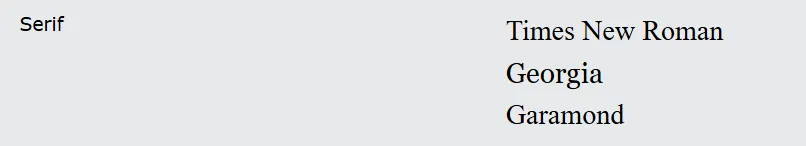

- `Sans-serif fonts`: Phông chữ Sans-serif có các đường nét rõ ràng (không có nét nhỏ kèm theo). Chúng tạo ra vẻ hiện đại và tối giản. Trên màn hình máy tính, phông chữ sans-serif được coi là dễ đọc hơn phông chữ serif.

>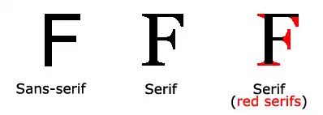

- `Monospace fonts`: Phông chữ Monospace - ở đây tất cả các chữ cái đều có cùng chiều rộng cố định. Chúng tạo ra vẻ máy móc.
>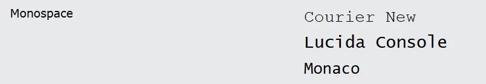

- `Cursive fonts`: Phông chữ viết tay mô phỏng chữ viết tay của con người.
>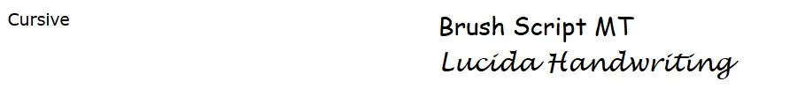

- `Fantasy fonts` : Phông chữ Fantasy là phông chữ trang trí/vui tươi.
>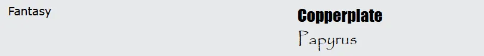

# **`2. Thuộc tính font-family trong CSS`**
Trong CSS, chúng ta sử dụng thuộc tính font-family để chỉ định phông chữ của văn bản. Nếu tên phông chữ có nhiều hơn một từ, thì phải đặt trong dấu ngoặc kép, như: "Times New Roman".

Thuộc tính font-family nên chứa một số tên phông chữ như một hệ thống "dự phòng", để đảm bảo khả năng tương thích tối đa giữa các trình duyệt/hệ điều hành. Bắt đầu bằng phông chữ bạn muốn và kết thúc bằng một họ font chung (để trình duyệt chọn một phông chữ tương tự trong họ font chung, nếu không có phông chữ nào khác khả dụng). Các tên phông chữ nên được phân tách bằng dấu phẩy. Đọc thêm về phông chữ dự phòng trong chương tiếp theo.

Ví dụ cách khai báo:
```css
.p1 {
  font-family: "Times New Roman", Times, serif;
}

.p2 {
  font-family: Arial, Helvetica, sans-serif;
}

.p3 {
  font-family: "Lucida Console", "Courier New", monospace;
}
```
# **`3. Web Safe Fonts`**
Trước khi xuất bản trang web, hãy luôn kiểm tra xem phông chữ của bạn hiển thị như thế nào trên các trình duyệt và thiết bị khác nhau và luôn sử dụng phông chữ dự phòng (fallback fonts).

Dưới đây là các font chữ phổ biến và được hỗ trợ tốt trên hầu hết các thiết bị và trình duyệt:

- Arial (sans-serif)
- Verdana (sans-serif)
- Tahoma (sans-serif)
- Trebuchet MS (sans-serif)
- Times New Roman (serif)
- Georgia (serif)
- Garamond (serif)
- Courier New (monospace)
- Brush Script MT (cursive)
## Arial (sans-serif)
Arial là phông chữ được sử dụng rộng rãi nhất cho cả phương tiện truyền thông trực tuyến và in ấn. Arial cũng là phông chữ mặc định trong Google Docs.

Arial là một trong những phông chữ web an toàn nhất và có sẵn trên tất cả các hệ điều hành chính. Ví dụ (bấm vào ảnh để xem trong đường link)

[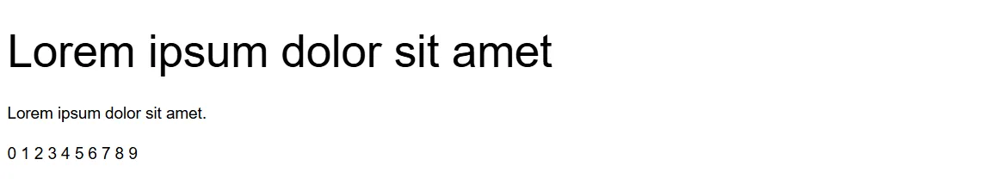](https://www.w3schools.com/cssref/tryit.php?filename=trycss_font_arial)

## Verdana (sans-serif)
Verdana là một phông chữ rất phổ biến. Verdana dễ đọc ngay cả với kích thước phông chữ nhỏ. Ví dụ (bấm vào ảnh để xem trong đường link)

[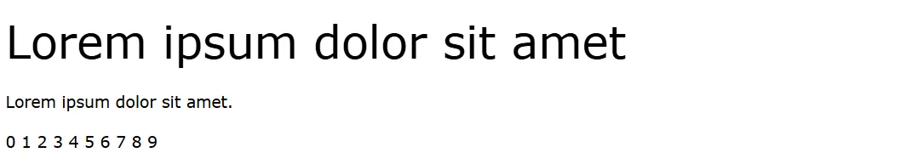](https://www.w3schools.com/cssref/tryit.php?filename=trycss_font_verdana)

## Tahoma (sans-serif)
Phông chữ Tahoma có khoảng cách giữa các ký tự hẹp hơn.

Ví dụ (bấm vào ảnh để xem trong đường link):
[](https://www.w3schools.com/cssref/tryit.php?filename=trycss_font_tahoma)

## Trebuchet MS (sans-serif)
Trebuchet MS được Microsoft thiết kế vào năm 1996. Hãy sử dụng phông chữ này một cách cẩn thận. Không được hỗ trợ bởi tất cả các hệ điều hành di động. Ví dụ (bấm vào ảnh để xem trong đường link):

[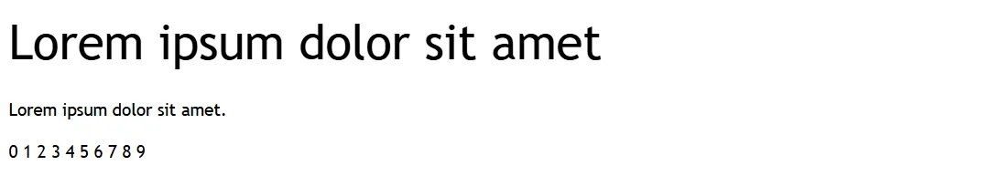](https://www.w3schools.com/cssref/tryit.php?filename=trycss_font_trebuchetms)

## Times New Roman (serif)
Times New Roman là một trong những phông chữ dễ nhận biết nhất trên thế giới. Nó trông chuyên nghiệp và được sử dụng trên nhiều tờ báo và trang web "tin tức". Đây cũng là phông chữ chính cho các thiết bị và ứng dụng Windows. Ví dụ (bấm vào ảnh để xem trong đường link):

[](https://www.w3schools.com/cssref/tryit.php?filename=trycss_font_timesnewroman)  

## Georgia (serif)
Georgia là một phông chữ serif thanh lịch. Nó rất dễ đọc ở nhiều kích cỡ phông chữ khác nhau, vì vậy nó là ứng cử viên tốt cho thiết kế tương thích với thiết bị di động. Ví dụ (bấm vào ảnh để xem trong đường link):

[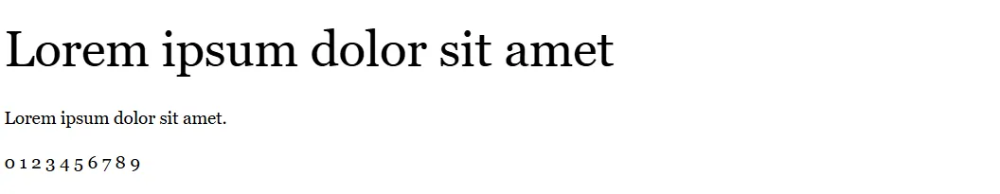](https://www.w3schools.com/cssref/tryit.php?filename=trycss_font_georgia)  

## Garamond (serif)
Garamond là một phông chữ cổ điển được sử dụng cho nhiều sách in. Nó có vẻ ngoài vượt thời gian và dễ đọc. Ví dụ (bấm vào ảnh để xem trong đường link):

[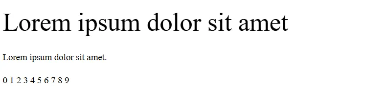](https://www.w3schools.com/cssref/tryit.php?filename=trycss_font_garamond)

## Courier New (monospace)
Courier New là phông chữ serif đơn cách được sử dụng rộng rãi nhất. Courier New thường được sử dụng với màn hình mã hóa và nhiều nhà cung cấp email sử dụng phông chữ này làm phông chữ mặc định của họ. Courier New cũng là phông chữ chuẩn cho kịch bản phim. Ví dụ (bấm vào ảnh để xem trong đường link):

[](https://www.w3schools.com/cssref/tryit.php?filename=trycss_font_courier)

## Brush Script MT (cursive)
Phông chữ Brush Script MT được thiết kế để mô phỏng chữ viết tay. Nó thanh lịch và tinh tế, nhưng có thể khó đọc. Hãy sử dụng cẩn thận. Ví dụ (bấm vào ảnh để xem trong đường link):

[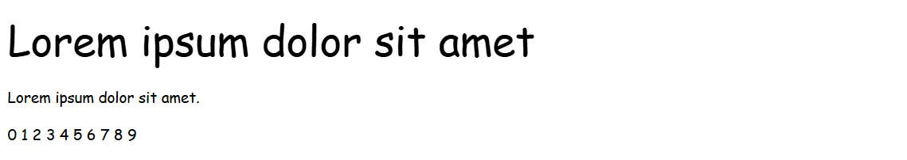](https://www.w3schools.com/cssref/tryit.php?filename=trycss_font_brushscriptmt)

