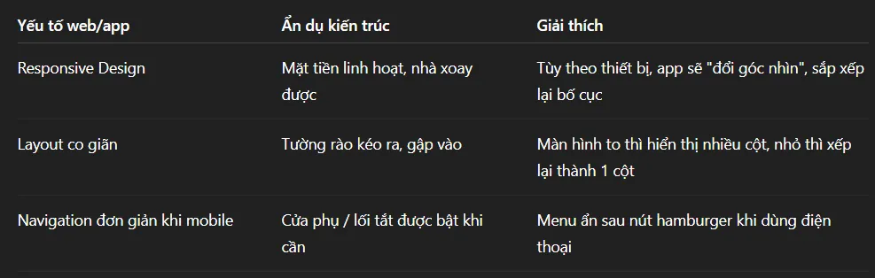

# **`Day 30-33: Tư duy lập trình Full Stack giống như việc xây dựng 1 thành phố `**

Tư duy vĩ mô khi học lập trình Full Stack. Một Full Stack Dev là 1 nhà thiết kế đa năng, làm việc ở các vị trí khác nhau, không khác gì 1 nhà thiết kế máy tính hoặc thiết kế máy bay. Anh ta cần phải biết được trong 1 chiếc máy bay có những bộ phận nào, đặt ở vị trí nào, tại sao cần có bộ phận đó… Nếu không biết được sự tồn tại của 1 bộ phận nào đó, làm sao anh ta thiết kế được. Hoặc đơn giản hơn để nấu được 1 món ăn điều đầu tiên bạn cần biết là thành phần gồm những nguyên liệu nào.

Mình nghĩ việc học lập trình Full Stack (hay bất cứ công nghệ nào cũng vậy). Trước khi bắt tay vào làm 1 cái gì đó cụ thể (vi mô) thì có cái nhìn tổng quan về bức tranh chung (vĩ mô) là rất quan trọng. Nếu không, chúng ta rất dễ rơi vào 1 hội chứng là “Đường hầm không lối thoát” và dễ bỏ cuộc. Vì vậy mình dành thời gian để tìm hiểu và viết lại nội dung này.

Một Full Stack Dev sẽ cần biết đến và có thể sẽ đụng tới những yếu tố nào (công nghệ, nền tảng, thuật ngữ…). Đây là 1 sự hình dung, liên tưởng để khiến dễ nhớ hơn sau này:

## 1. HTML (xây nhà thô):

Ngôn ngữ đánh dấu để tạo nên cấu trúc ban đầu của trang web. Như là xây thô 1 ngôi nhà. Sử dụng xi măng, gạch, đá (các elements) Tạo ra tường, cửa, cột (header, footer, button…). Thiếu HTML thì không có "nhà" (web) để trang trí hay vận hành.

## 2. CSS (trang trí nội thất, Decor) :

Là ngôn ngữ tạo kiểu dáng cho web, giống như là sơn, họa tiết, bố trí đồ đạc (layout), ánh sáng (gradient, shadow), phong cách (responsive design). Phải xây nhà thô xong mới tiến hành trang trí được.

## 3. SASS/SCSS/LESS (Decor, trang trí nội thất cao cấp, thông minh)

Có thể nói rằng đây là phương pháp trang trí nội thất cao cấp hơn so với CSS. Ví dụ nếu như CSS là khuấy sơn bằng tay, thì SASS/SCSS/LESS là khuấy sơn bằng máy.

SASS – Syntactically Awesome Stylesheets, Là một preprocessor CSS giúp viết CSS gọn gàng, linh hoạt và dễ bảo trì hơn. Cú pháp giống với Ruby.

SCSS – Sassy CSS Là một cú pháp của SASS nhưng gần giống với CSS truyền thống hơn. Dùng {}, ; như trong CSS, nên dễ tiếp cận hơn cho người mới.

LESS – Leaner Style Sheets , Cũng là một preprocessor CSS như SASS, nhưng được viết bằng JavaScript.

Tóm lại SASS/SCSS/LESS không phải là CSS thuần, mà là các ngôn ngữ tiền xử lý (preprocessor) cần được biên dịch thành CSS trước khi trình duyệt hiểu:

>

SASS & SCSS dùng chung trình biên dịch sass compiler.

Còn LESS dùng trình biên dịch less compiler.

Cả 2 trình biên dịch này đều được viết bằng JavaScript. Vì vậy cần cài trước Node.js và npm thì mới có thể hoạt động. (Xem phần Node.js và npm)

## 4. Responsive Design (nhà chuyển động)

Responsive Design là việc thiết kế giao diện phù hợp với các loại thiết bị với các kích thước màn hình khác nhau. Nó giống như thiết kế 1 Ngôi nhà biết xoay và biến đổi ngoại thất, nội thất bên trong (backend phía sau web) hoàn toàn không thay đổi. Một ngôi nhà thông minh có thể thay đổi hình dáng bề ngoài, xoay mặt tiền theo hướng mặt trời, thu gọn hoặc mở rộng sân vườn, để phù hợp với vị trí – y như một trang web thay đổi giao diện tùy theo màn hình.

>
>

## 5. JavaScript (lắp điện, nước):

Là ngôn ngữ lập trình giúp trang web trở nên sống động, có thể tương tác được. Được ví như việc sử dụng, lắp đặt đường điện, đường nước để ngôi nhà có thể vận hành. Không chỉ lắp đặt mà còn điều khiển: Bật/tắt đèn (DOM events), điều chỉnh lưu lượng nước (xử lý form).

## 6. TypeScript (Nhà thông minh nâng cấp):

Phiên bản nâng cao của JavaScript, có kiểm tra kiểu dữ liệu, Code dễ bảo trì hơn, phù hợp cho dự án phức tạp.. Được ví như hệ thống tự động phát hiện lỗi (vd: rò rỉ nước → cảnh báo ngay), tự động kiểm tra nước, kiểm tra khí gas rò rỉ, báo cháy, tự động cảnh báo người lạ xâm nhập…

## 7. Frameworks Front end(React, Angular, Vue): (Nhà máy/công ty trong khu công nghiệp)

Các bộ công cụ kết hợp cả HTML, CSS, JavaScript khiến việc xây dựng web trở nên nhanh chóng, đẹp hơn. Được ví như các Công ty xây nhà tiền chế/nhà lắp ghép. Họ Cung cấp sẵn "bộ phận ghép": Component (tường, cửa), Router (lối đi), State Management (hệ thống điện nước ẩn)… Chuẩn hóa quy trình: Không cần tự viết DOM thủ công như JS thuần (đỡ đục tường khoan lỗ). Tối ưu hiệu suất: Như vật liệu nhẹ, cách nhiệt tốt (Virtual DOM, Tree Shaking). Tuy nhiên giữa các công ty cũng có sự khác biệt:

- React.js ≈ Công ty linh hoạt: Chỉ bán khung nhà chắc chắn (core library), muốn trang trí hay lắp điện phải mua thêm đồ (Redux, React Router…).

- Angular ≈ Công ty trọn gói: Tặng kèm cả sơn, gạch men, đèn chiếu sáng (RxJS, Dependency Injection, CLI sẵn).

- Vue.js ≈ Công ty thân thiện: Bán nhà đẹp giá rẻ, dễ tự custom (kết hợp ưu điểm của React + Angular).

Mặc dù có thể custom nhưng các framework Cung cấp một hệ sinh thái hoàn chỉnh với quy trình rõ ràng (coding pattern, folder structure, tool đi kèm). Có Tư vấn sẵn: Bạn phải tuân theo cách họ thiết kế (ví dụ: Angular có Dependency Injection, Vue có Single-File Components). Ít được sáng tạo hơn: Bạn xây nhà theo bản vẽ của họ, nhưng đổi màu sơn thì tùy ý.

Các công ty này đặt trụ sở trong khu công nghiệp Node.js (Xem phía dưới), nhưng chuyên làm dịch vụ xây nhà dân dụng ở ngoài khu công nghiệp.

## 8. Library (Bootstrap, Tailwind, jQuery) (Siêu thị vật liệu xây nhà trong khu công nghiệp) :

Các thư viện này hơi khác so với các Framework (nhiều khi bị dùng lẫn lỗn). Chúng như các Đại siêu thị vật liệu (ví dụ ở Nhật Bản, Mỹ có những siêu thị rất lớn chỉ bán đồ liên quan đến xây dựng). Họ chỉ cung cấp từng phần rời rạc: Ví dụ:

- Bootstrap: Như một siêu thị bán "vật liệu trang trí đóng gói sẵn" (button, card, navbar đã thiết kế mẫu). Kiểu như bán nguyên cả cánh cửa làm sẵn.

- Tailwind: Siêu thị bán "sơn, gạch, đinh ốc nguyên liệu thô" (utility classes để bạn tự mix-match).

Với các thư viện thì bạn tự do sáng tạo, nhưng đổi lại cần phải có kiến thức. Bạn phải biết mình cần gì, ghép thế nào (không có ai hướng dẫn cụ thể).Linh hoạt nhưng đòi hỏi kiến thức: Dùng sai sẽ thành "nhà dị hợm" (CSS conflict, performance issues).

## 9. Node.js (Môi trường chạy JavaScript phía server = Khu công nghiệp)

Khi nói Node.js là môi trường chạy JavaScript thì sẽ đỡ gây nhầm lẫn hơn so với việc nói là Môi trường chạy JavaScript phía server.

Ban đầu các mã JavaScript chỉ chạy trên trình duyệt để xử lý tương tác người dùng, vì bản thân trình duyệt đã có sẵn V8 engine để chạy javascript.

Để các mã Javascript chạy được bên ngoài trình duyệt (như Chrome, Firefox…) thì cũng cần có một môi trường để nó chạy. Node.js chính là môi trường đó. Node.js là một runtime độc lập, hoạt động như một phần mềm riêng biệt.

Các máy chủ có cài sẵn Node.js (hoặc ta có thể tự cài đặt lên máy chủ) nên mã javascript có thể chạy được trên máy chủ.

Nhưng trước đó ta cũng cần cài Node.js trên local (máy cá nhân) để tạo môi trường phát triển và test trước khi deploy lên server thực.

Ta có thể hình dung JavaScript là 1 tập đoàn toàn cầu, trong hệ sinh thái của nó có rất nhiều thư viện, framework (dành cho back end, và front end), công cụ . Hầu hết những công cụ này đều nằm tập trung trong khu công nghiệp gọi là Node.js thuộc sở hữu của tập đoàn JavaScript.

Mặc dù 1 số thư viện, hoặc công cụ nhỏ có thể chạy ngay trong trình duyệt mà không cần Node.js, nhưng đó là “chạy”, còn quá trình phát triển vẫn cần đến Node.js.

Trong thời đại web hiện đại, Node.js gần như là "khu công nghiệp trung tâm" mà hầu hết các thư viện/framework JavaScript phải đi qua — ít nhất là trong giai đoạn phát triển (development).

## 10. Package Manager (Ban quản lý khu công nghiệp)

Trong hệ sinh thái JavaScript hiện đại, các trình quản lý gói như npm, yarn, pnpm đóng vai trò như Ban Quản Lý khu công nghiệp, vì khi bạn muốn cài các thư viện hay framework từ Node.js thì đều phải thông qua Package Manager. Tương tự như vậy, khi ban đến 1 khu công nghiệp để gặp và ký hợp động hợp tác với 1 nhà máy thì bạn buộc phải thông qua ban quản lý khu công nghiệp.
>

📦 npm không trực tiếp tạo ra thư viện, mà quản lý, phân phối, cho phép truy cập đến các thư viện.

📂 npm giống như cổng thông tin trung tâm – nếu bạn muốn “gặp” React, Express hay bất kỳ nhà máy nào, bạn không thể tự tiện vào, mà phải “đăng ký” thông qua npm install.

🛡️ Nó còn chịu trách nhiệm đảm bảo phiên bản, bảo mật, quản lý phụ thuộc → đúng nghĩa quản lý toàn khu.
>

## 11. Frameworks Back end (Express.js / NestJS…) (Công ty xây dựng công nghiệp trong khu công nghiệp Node.js)

Nếu như Framework front end đảm nhiệm xây dựng các công trình dân dụng, cửa hàng… thì các Framework back end đảm nhiểm xây dựng các công trình công nghiệp. Ví dụ nó xây dựng ra nhà máy A, nhà máy A sẽ chuyên làm nhà tiền chế/nhà lắp ghép.
>

Express.js / NestJS = Công ty xây dựng nhà máy
Họ chuyên nhận hợp đồng xây dựng hệ thống backend.

Express giống công ty nhỏ: làm nhanh, linh hoạt, ít thủ tục.

NestJS giống tập đoàn lớn: bài bản, tổ chức rõ ràng, có các phòng ban (module, controller, service).

Một nhà máy sẽ khác so với 1 ngôi nhà, 1 nhà máy có nhiều thành phần khác biệt như Phòng sạch, Kho hàng lưu trữ, Kho lạnh, bộ phận giao hàng.…

Ví dụ Front end framework xây dựng các showroom, siêu thị bán rau thực phẩm ở trong khu dân cư. Back end framework sẽ xây dựng toàn bộ những nhà máy, cơ sở vật chất ở phía sau, từ farm trồng rau ở đâu, thu hoạch, xưởng phân loại, công ty vận chuyển như thế nào…

Node.js vừa ra mắt (2009), nhưng chưa có framework backend để xây dựng ứng dụng web. Lập trình viên phải tự xử lý mọi thứ từ đầu bằng core HTTP module của Node.js, dẫn đến: Code rườm rà, khó bảo trì. Không có routing, middleware, hay công cụ hỗ trợ xử lý request/response.

Express.js ra đời (2010) - Giải quyết bài toán "Tạo server đơn giản hơn". Mục tiêu: Cung cấp bộ công cụ tối giản để xây dựng web server/API. Giúp lập trình viên không phải tự viết lại những thứ cơ bản. Tuy nhiên nhược điểm là Không có kiến trúc chuẩn, Thiếu tính mở rộng: Khó áp dụng cho dự án lớn, microservices.

NestJS ra đời (2017) - Giải quyết bài toán "Kiến trúc ứng dụng doanh nghiệp". Express.js quá "tự do", dẫn đến khó bảo trì ở dự án lớn. Cần một framework "opinionated" (có kiến trúc rõ ràng) như Angular (frontend) nhưng cho backend.

Dự án nhỏ, cần MVP nhanh thì dùng Express.js. Ứng dụng doanh nghiệp, cần bảo trì tốt thì dùng NestJS.

## 12. Git, GitHub, GitLab (Nhật ký xây dựng công trình).

Git, GitHub, GitLab:Quản lý mã nguồn, làm việc nhóm

Có thể ví Git, GitHub, GitLab, BitBucket như là nhật ký xây dựng, "Nhật ký công trình" . Trong thế giới lập trình, Dù bạn xây cửa hàng (frontend) hay nhà máy (backend), Dù dùng React, Vue hay NestJS, Express, Thì Git chính là cuốn nhật ký công trình, nơi mọi thay đổi đều được ghi chép lại: 👉 Ai thay đổi, thay đổi gì, lúc nào, lý do vì sao?

Git là cuốn sổ nhật ký cục bộ, chính là cuốn sổ mà mỗi nhân viên xây dựng mang theo người, commit là họ ghi lại nhật ký vào sổ.

GitHub, GitLab, BitBucket là phòng lưu trữ hồ sơ xây dựng, nhật ký xây dựng chung của cả dự án.

## 13. Các Database (Các tòa nhà/kho chứa hàng cực lớn)

Cơ sở dữ liệu = Hệ thống kho lưu trữ khổng lồ. Có 2 tập đoàn là tập đoàn SQL quản lý các tòa nhà kho là MySQL, PostgreSQL, SQL Server, và tập đoàn NoSQL sở hữu các tòa nhà kho MongoDB, Firebase, CouchDB. Với triết lý làm việc khác biệt:

>


MySQL: như một kho hàng của siêu thị lớn: mọi thứ được đặt đúng chỗ, mã vạch rõ ràng.

MongoDB: như một kho lưu đồ cá nhân cao cấp: bạn thuê kho riêng, sắp xếp đồ theo cách bạn muốn.

PostgreSQL: như trung tâm phân loại hàng cao cấp: vừa có cấu trúc, vừa có linh hoạt – doanh nghiệp rất thích.

Lưu ý rằng các tòa nhà kho này của 2 tập đoàn riêng, nên không nằm trong khu công nghiệp Node.js của tập đoàn JavaScript.

## 14. ORM: Là người quản lý kho, giúp bạn lấy, cất đồ dễ dàng mà không cần tự mình đi tìm từng món.

ORM (Object-Relational Mapping) là một kỹ thuật (và cũng là một loại thư viện) giúp bạn thao tác với cơ sở dữ liệu quan hệ (như MySQL, PostgreSQL, SQLite...) thông qua code hướng đối tượng.

ORM giúp bạn làm việc với database bằng cách dùng object (đối tượng trong code) thay vì phải viết câu lệnh SQL thủ công. Tức là hầu hết sẽ dùng chính ngôn ngữ JavaScript để làm việc với Database thay vì sử dụng ngôn ngữ SQL phức tạp.
>

Ở đây ta chỉ đề cập đến các ORM dành cho JavaScript/TypeScript. Các ORM này cũng cần môi trường Node.js để có thể chạy. Và cần được cài đặt thông quan Package Manager như npm.

>
  

Với các database dạng NoSQL, vẫn có những ORM hoặc thư viện tương đương ORM để giúp bạn thao tác dễ dàng bằng code — tuy nhiên, chúng thường được gọi là ODM (Object Document Mapper) thay vì ORM (Object Relational Mapper), vì NoSQL không phải là “relational database”.

Mặc dù các cơ sở dữ liệu NoSQL không dùng ngôn ngữ SQL, nhưng vẫn cần đến các ODM, bởi vì ODM không chỉ đơn thuần là giải quyết vấn đề phức tạp của ngôn ngữ mà còn với mục đích khác.

## 15. Linux, CLI, Bash (Chính quyền – Hành chính – Ngôn ngữ làm việc)
>

Bạn là doanh nghiệp/tập đoàn công nghệ muốn hoạt động tại quốc gia Linux. Ví dụ tập đoàn JavaScript muốn xây khu công nghiệp Node.js, tập đoàn NoSQL muốn xây dựng tòa nhà cơ sở dữ liệu, (cài bất kỳ phần mềm nào…), đều phải:

- Viết đơn (gõ lệnh) bằng ngôn ngữ hành chính – Bash

- Gửi tại trung tâm hành chính (CLI-Command Line Interface)

- Hệ điều hành Linux xét duyệt và cấp phép

>
Lưu ý rằng apt/yum là Package Manager của Linux, nó hoàn toàn khác so với npm/pnpm là Package Manager của Node.js

## 16. Các ngôn ngữ lập trình khác như Java, Python, PHP, C#, Ruby... (các tập đoàn khác)

Các “tập đoàn công nghệ Python, PHP, C#, Ruby…” hoạt động song song – vừa đối thủ cạnh tranh, vừa đối tác hợp tác. Mỗi tập đoàn có một thế mạnh riêng.

>
Ví dụ Mối quan hệ cạnh tranh – hợp tác:

>

Nếu như tập đoàn JavaScript có khu công nghiệp riêng là Node.js thì các tập đoàn khác cũng có khu công nghiệp riêng, hoặc khu công nghiệp liên kết. Ví dụ:

Các tập đoạn C#, F#, VB.NET bắt tay xây dựng chung khu công nghiệp .NET (.NET (CLR - Common Language Runtime) là Môi trường runtime của Microsoft, chạy Intermediate Language (IL) (từ file .dll/.exe))

Các tập đoàn Java, Kotlin, Scala,… bắt tay xây dựng chung khu công nghiệp JVM (Java Virtual Machine), là Máy ảo chạy bytecode (từ file .class sau khi biên dịch Java). Hỗ trợ ngôn ngữ Java, Kotlin, Scala, Groovy...

Tập đoàn Java có khu công nghiệp riêng, trong đó có công ty Spring Boot .(Ngôn ngữ và framework mạnh mẽ, bảo mật cao.)

Tập đoàn PHP có khu công nghiệp riêng, trong đó có công ty Laravel (Đây là tập đoàn và công ty lâu đời, dễ tiếp cận). Lavarel là 1 framework back end của PHP, có PHP engine đóng vai trò tương tự như Node.js để thực thi code. Nên dùng xây dựng web app truyền thống, cần phát triển nhanh với ít code. Với các hệ thống cực lớn, cần performance cao (ưu tiên Java/.NET) hoặc ứng dụng real-time như chat (ưu tiên Node.js) thì không phù hợp.

Tập đoàn Python có khu công nghiệp riêng, trong khu đó có công ty Django, Flask.

(Ngôn ngữ và framework phổ biến cho backend): Django là Một “công ty xây dựng trọn gói”, khi bạn ký hợp đồng là họ lo từ móng đến mái (quản lý user, database, admin dashboard...). Còn Flask Giống như đội xây dựng tự do, bạn muốn xây cái gì cũng được nhưng phải tự lo từ bản vẽ, giám sát đến mua vật liệu.

>
## 17. Server, Cloud

Máy chủ (Server) là thuật ngữ chung để chỉ hệ thống phần cứng gồm hàng triệu máy tính cấu hình mạnh mẽ kết nối với nhau. Được sử dụng với mục đích không giới hạn, ví dụ Chạy website, Cung cấp API, Lưu trữ file, hình ảnh, Chạy cơ sở dữ liệu (database), Xử lý AI/ML, tính toán, v.v..

Các hệ thống Cloud (như AWS, Google Cloud, Azure...) = Các siêu đô thị cho thuê hạ tầng. Cloud không phải là 1 loại server đơn thuần – mà là “tổ hợp hạ tầng vật lý khổng lồ gồm hàng triệu máy chủ vật lý, đặt trong các data center, có thể cho bạn thuê bất cứ thứ gì”. Hãy tưởng tưởng các hệ thống máy chủ giống như 1 khu vực đô thị rộng 1000 hecta. Với đầy đủ mọi cơ sở hạ tầng từ điện - đường - trường trạm - y tế - trường học - siêu thị… Và họ cho thuê 1 phần đất trong khu vực đó. Đó gọi là Cloud.

Các máy chủ lưu cơ sở dữ liệu (database server) như các tòa nhà lớn, thuộc sở hữu của tập đoàn NoSQL & SQL. Nhưng bản thân các tập đoàn này có thể không phải là chủ sở hữu mảnh đất mà họ xây dựng, có thể là họ chỉ thuê đất lâu năm để xây. Nhiều nền tảng database như MongoDB, PostgreSQL, Redis... thực chất là thuê lại hạ tầng của các Cloud lớn (AWS, GCP, Azure, Oracle) để xây dựng dịch vụ của họ. Tức là các tòa nhà Cơ sở dữ liệu có thể chỉ là 1 phần nằm trong vùng đất siêu đô thị 1000 hecta.

Trong vùng đất siêu đô thị này có thể có nhiều tòa nhà máy chủ khác:
>
>
>
>

## 18. Testing (Bộ phận kiểm soát chất lượng)
Với các công trình thì có bộ phận kiểm soát chất lượng, thì với việc phát triển web, ứng dụng cũng có các công cụ, các bước kiểm thử để đảm bảo không xảy ra lỗi.

Nói về Testing thì có thể là kiểm thử giao diện (front end) gọi là UI Testing.

Hoặc kiểm thử back end.

Có thể là kiểm tra từng bước, từng component, từng chức năng nhỏ. Gọi là Unit Test, Component Test. Hoặc kiểm tra toàn diện trước khi deploy, đây là End-to-End Test (E2E).

Có nhiều công cụ Testing khác nhau như Jest, Cypress, Mocha, JUnit. Chúng thực chất chính là các thư viện/phần mềm được viết bằng JavaScript. Được cài đặt vào dự án thông qua npm, và cần môi trường Node.js để chạy.

## 19. Bundler (Webpack, Vite) (Bộ phận đóng gói ngoại thất ngoài nhà)
Bundler là công cụ giúp đóng gói và tối ưu mã nguồn frontend (HTML, CSS, JavaScript, ảnh, font...) để chuẩn bị deploy (triển khai) lên môi trường thực tế (production).

Bundler giống như một tổ đội kỹ sư đóng gói toàn bộ những thứ phía ngoài ngôi nhà như kiểu hàng rào, chậu cảnh, … — để dễ dàng vận chuyển và lắp ráp ngoài thực địa. Trước khi vận chuyển, họ:

- Nén kích thước đồ đạc

- Loại bỏ phần thừa

- Ghép các mảnh nhỏ thành khối lớn để tiết kiệm không gian

- Gắn nhãn, đặt thứ tự hợp lý, để khi bung ra là dùng được ngay
>
>
>


Webpack và Vite đều là các công cụ được viết bằng JavaScript, chạy trong môi trường Node.js, và được cài đặt thông qua npm (hoặc yarn, pnpm).

Lưu ý rằng các Công cụ Bundler này đều là dùng cho front-end, chứ không phải là back-end. Bởi vì tất cả mã nguồn front-end (.html, .css…) đều được lưu trữ trên máy chủ, và sẽ được truyền tải đến trình duyệt khi người dùng truy cập vào web thông qua tên miền. Vì vậy cần phải đóng gói để Tối ưu dung lượng để tải nhanh hơn, Gộp các file nhỏ để giảm số lượng request, Minify (rút gọn) để bảo mật và tăng hiệu năng.

Còn Backend code (Node.js, Python, Go...) chạy ở server, không bị tải qua mạng mỗi lần người dùng truy cập. Không cần rút gọn, không cần gộp file ,Do đó, Bundler không cần thiết cho backend trong đa số trường hợp.

Tất nhiên back-end cũng có công cụ riêng để đóng gói nhưng với mục đích khác.

## 20. Docker (Đóng gói nội thất, mọi thứ phía trong của ngôi nhà)
Docker và Bundler (Webpack, Vite...) đều đóng gói, nhưng chúng đóng gói những thứ rất khác nhau.
>  

Mục đích của chúng rất khác nhau. Bundler giúp frontend chạy nhanh, nhẹ trong trình duyệt. Docker giúp toàn bộ hệ thống backend chạy đúng ở mọi nơi.

Khi App và Môi trường chạy app được Docker đóng gói lại thành 1 container duy nhất thì sẽ chạy ở bất cứ nơi nào có Docker. Ví dụ bạn gửi container đó cho 1 người khác, trên máy học cài Docker là sẽ chạy được app . Hoặc nếu trên máy chủ có cài Docker thì khi bạn deploy app lên máy chủ là chạy được bình thường. (Kiểu như mua chung cư cao cấp thì sẽ có luôn cả phòng Gym, hồ bơi, siêu thị, công viên, trường học, bệnh viện… trong khu đó, đủ hết mọi thứ để sinh sống bình thường, chứ không phải chạy ra ngoài để sử dụng những dịch vụ đó nữa).

Nếu không sử dụng Docker đóng gói thành container, khi Bạn gửi app cho người khác, họ phải cài Node.js, PostgreSQL, chỉnh đủ thứ cấu hình. Mỗi người cài mỗi kiểu, dễ bị lỗi “chạy được trên máy bạn, không chạy trên máy người khác ”.

**Ưu điểm của Docker:**

- Đồng nhất môi trường: Môi trường dev/test/prod đều như nhau.

- Không phụ thuộc hệ điều hành: Viết trên macOS, deploy trên Linux vẫn chạy.

- Không cần setup phức tạp: Không cần cài từng thư viện, công cụ riêng lẻ.


## 21. CI/CD (GitHub Actions, Jenkins):
CI/CD bản chất là quy trình (process, workflow) Tự động hóa kiểm thử, build, deploy.

Jenkins, GitHub Actions, GitLab CI/CD, CircleCI – là các app giúp thực hiện quy trình CI/CD.

>
>
>


CI/CD giúp bạn phát triển phần mềm nhanh hơn, ổn định hơn, ít lỗi hơn. Nó là một phần cốt lõi của DevOps hiện đại. Nếu bạn làm startup, web app, API, SaaS... thì nên dùng CI/CD từ sớm.

Ví dụ bình thường khi ta dùng lệnh Git push mã nguồn lên GitHub thì không có quá trình CI/CD xảy ra.

Để workflow CI/CD tự động xảy ra mỗi khi push code lên GitHub thì ta phải cấu hình nó. Với mỗi dự án (tương ứng là mỗi repo trên GitHub) ta thì chỉ cần cấu hình 1 lần workflow này là được. Ví dụ trong workflow này sẽ gồm nhiều bước, bước đầu tiên ta sẽ sử dụng công cụ Jest (công cụ kiểm thử ở phần trước đã học), sau đó đến bước sau lại dùng 1 công cụ khác chẳng hạn.

Nếu Testing là bộ phận kiểm soát chất lượng thì CI/CD là quy trình tự động, tức là các bước được xây dựng theo trình tự nhất định, tùy vào dự án. Ví dụ có dự án phức tạp thì có thể xây dựng quy trình CI/CD phức tạp hơn (gồm nhiều nhân viên kiểm soát hơn, có thể áp dụng cả máy móc tự động scan), còn dự án đơn giản thì quy trình CI/CD sẽ đơn giản, ít bước hơn.
>  

**Mối quan hệ giữa CI/CD và Testing:**
- Testing là một phần trong CI/CD.

- Trong CI, thường có bước chạy Testing tự động → nếu fail thì quá trình dừng lại ngay. (tất nhiên là sẽ có cả Testing thủ công)

- Nếu Testing pass, thì CD (triển khai tự động) mới tiếp tục thực hiện.

## 22.  HTTP / HTTPS (Con đường giao tiếp)
Đây là 2 Giao thức truyền thông tin qua internet giữa client (người dùng) và server (máy chủ). Giống như con đường từ nhà bạn đến trung tâm mua sắm, hoặc từ showroom cửa hàng đến nhà máy sản xuất, kho hàng phân loại, farm nông trại vậy.

HTTP: Không mã hóa dữ liệu. Kiểu như con đường bình thường, hơi hoang vắng, có vẻ nguy hiểm, chất lượng đường cũng không an toàn cho lắm.

HTTPS: Có mã hóa (bảo mật cao hơn). Kiểu như cũng là con đường mà có các trạm kiểm soát, trạm kiểm tra, lắp các loại camera kiểm soát, phạt nguội.

## 23. APIs (Cánh cửa giao tiếp)
API (Application Programming Interface) – "Cửa giao tiếp giữa 2 hệ thống". Về bản chất, API là một tập hợp các quy tắc (giao thức) và định dạng chuẩn cho phép một phần mềm này truy cập và sử dụng chức năng của phần mềm khác — mà không cần biết chi tiết nội bộ bên trong phần mềm đó.

API là một hợp đồng giao tiếp giữa hai hệ thống: "Nếu bạn gửi dữ liệu đúng cấu trúc này, tôi sẽ trả lại kết quả theo cấu trúc kia."

API không bắt buộc phải có – nó là một chức năng tùy chọn mà lập trình viên có thể xây dựng để cho phép các hệ thống/phần mềm khác giao tiếp hoặc tích hợp với hệ thống của mình.

🧱 API gồm những gì?

Một API thường bao gồm:

- Endpoint: Điểm truy cập – URL cụ thể mà bạn gọi đến.

- Method: Hành động – như GET (lấy dữ liệu), POST (gửi dữ liệu), PUT, DELETE.

- Request: Gửi yêu cầu (có thể kèm dữ liệu).

- Response: Nhận phản hồi (thường ở dạng JSON, XML...).

Có thể hình dung thế này:

- Hệ thống phần mềm = Nhà hàng

- API = Thực đơn (menu) của nhà hàng

- Người dùng/API client = Khách gọi món

Gọi đúng món có trong menu → Nhận món ăn đúng. Tương đương với gọi đúng endpoint, đúng tham số → Nhận đúng dữ liệu

Gọi sai món (menu không có món đó) → Nhà bếp từ chối. Tương đương gọi sai API hoặc sai định dạng → Nhận lỗi

Gọi món đúng nhưng bạn không đủ quyền (chưa thanh toán). Tương đương API có thể từ chối truy cập nếu không có quyền.

4Bạn không cần biết bên trong nhà bếp nấu món như thế nào. API giúp ẩn đi sự phức tạp nội bộ của hệ thống.

## 24. API Design (REST API, RESTful APIs, GraphQL API)
API Design là cách các lập trình viên (chính bạn) thiết kế, tổ chức và xây dựng các API cho hệ thống/ứng dụng.

MộtAPI được thiết kế tốt sẽ Dễ hiểu, dễ sử dụng, Dễ bảo trì, mở rộng, Giảm lỗi khi kết nối giữa client-server, Tăng hiệu suất phát triển.


Chúng ta sẽ nói về các kiểu thiết kế API phổ biến: REST API, RESTful API, GraphQL.

REST APIs nói chung là các APIs được thiết kế theo nguyên lý REST (viết tắt của REpresentational State Transfer) là một kiến trúc thiết kế API được dùng rất phổ biến, đặc biệt với các hệ thống web hiện đại. REST là một tập hợp các nguyên lý (không phải là công nghệ hay framework) để thiết kế API sao cho client và server giao tiếp đơn giản, rõ ràng, không phụ thuộc trạng thái, và dùng chuẩn HTTP để thao tác với các tài nguyên (resources).

Thực tế thì RESTful API: Là REST API tuân thủ đầy đủ 6 nguyên lý của REST (stateless, cacheable, layered system, uniform interface, client-server, code on demand).

Còn REST APIs là API Chỉ cần giao tiếp qua HTTP và truy xuất tài nguyên là được gọi là REST API, dù có thể làm chưa đúng chuẩn.
>

GraphQL APIs là các API không được thiết kế theo nguyên lý REST mà dựa trên schema (schema-based design truy vấn và thao tác dữ liệu theo lược đồ (schema)). Do Facebook phát triển, rất linh hoạt nhưng cũng phức tạp hơn REST. Cho phép client chỉ yêu cầu đúng dữ liệu cần, thay vì lấy toàn bộ như REST.

Ta có thể hình dung như thế này:


## 25. schema (lược đồ, đồ hình)
Trong phần trên ta nói GraphQL API là loại API được thiết kế dựa trên lược đồ (schema-based design). Vậy schema là cái gì?

Ta sẽ gặp thuật ngữ này trong nhiều tình huống khác nhau, nhưng chúng sẽ khác nhau trong các tình huống đó.

**`🧠 Hiểu đơn giản:`**

**Schema = “bản thiết kế" hoặc "sơ đồ cấu trúc” của một thứ. Nó định nghĩa xem 1 thứ gì đó :**

- Có những thành phần gì

- Mỗi thành phần thuộc kiểu dữ liệu nào

- Có được phép rỗng không, bắt buộc không

- Có quan hệ thế nào với nhau

>  

Tức là Schema sẽ Định nghĩa trước một khuôn mẫu để các thành phần khác tuân theo.

## 26. Kubernetes
Docker là "công cụ tạo ra container". Kubernetes là "nhà điều phối container" giúp bạn.

Container hóa (Ví dụ Docker đóng gói app và môi trường cần thiết thành các gói gọi là container). Công nghệ này ra đời năm 2013. Điều này giúp app được đóng gói để có thể chạy ở mọi nơi (xem bài viết trước).

Với những ứng dụng đơn giản, tất cả các chức năng (Web, API, xử lý dữ liệu, database...) nằm chung 1 khối, có thể chạy trong 1 container (Monolith). Khi đó chỉ còn Docker là đủ. Không cần đến Kubernetes.

Tuy nhiên, Khi ứng dụng trở nên phức tạp hơn, mỗi chức năng sẽ được chia thành các dịch vụ riêng, nhỏ, độc lập - gọi là Microservices. Mỗi microservice này có thể chạy trong 1 container riêng. Một nguyên tắc quan trọng trong Docker là "One container = One responsibility" tức là mỗi container chỉ nên làm 1 việc. Ví dụ:

- 1 container chỉ phục vụ web (frontend)

- 1 container xử lý backend API

- 1 container chạy database

- 1 container xử lý background jobs (như gửi email)

- 1 container chạy Redis làm cache

Với 1 hệ thống gồm rất nhiều container riêng như vậy, có hàng loạt vấn đề như:

- Làm sao quản lý hàng trăm container?

- Làm sao tự động restart nếu container chết?

- Làm sao biết container nào đang healthy?

- Làm sao scale lên/down linh hoạt?

- Làm sao phân phối traffic hợp lý (load balancing)?

- Làm sao triển khai version mới mà không downtime?

Trước Kubernetes, DevOps phải tự viết shell script hoặc dùng các công cụ rời rạc để lo các việc trên → cực kỳ khó, dễ lỗi. Và Google đã tạo ra một nền tảng điều phối container, đó chính là Kubernetes.

Về bản chất Kubernetes không điều phối trực tiếp các container, mà là các pods. Pod là đơn vị nhỏ nhất mà Kubernetes deploy và quản lý. Pod = container + các cấu hình đi kèm (network, volume, metadata, env var, IP riêng...). Hay nói cách khác Pod sẽ là lớp vỏ ngoài, bên trong là container chính (app chính) và các container phụ.

Pod không phải viết tắt, mà là một danh từ lấy cảm hứng từ sinh học 🌱: Giống như một “hạt đậu trong vỏ” (pod of peas).

Một Pod có thể chứa 1 hoặc nhiều container, nhưng thường chỉ chứa 1 container duy nhất trong phần lớn trường hợp phổ biến.

**Ví dụ về sức mạnh của Kubernetes mà Docker không thể làm được.**  

Bạn có 1 container web app → nếu có 1.000 user cùng truy cập vào 1 container → app quá tải, response chậm, crash... Lúc này Kubernetes tạo nhiều bản sao Pod → mỗi Pod chạy bản sao web app giống hệt nhau. Kubernetes sẽ phân phối request đều đặn đến từng Pod → mỗi Pod chỉ xử lý 1 phần lưu lượng → Load Balancing.

>
  

## 27. ES6+ Features
ES6+ Features là tập hợp các tính năng hiện đại của JavaScript giúp:

- Code gọn gàng hơn

- Dễ đọc, dễ bảo trì

- Hiệu quả hơn khi xử lý bất đồng bộ, làm việc với object, function, module, v.v.

- Ví dụ: Dùng let và const Khai báo biến với phạm vi khối (block scope), thay thế cho var.
```javascript
let name = "Kai";
const age = 25;
```
## 28.  DOM Manipulation
DOM Manipulation = dùng JavaScript để tương tác và điều khiển nội dung HTML, giúp trang web trở nên động và tương tác hơn thay vì chỉ là trang tĩnh.
```javascript
//Dùng javascript lấy thông tin phần tử HTML 
const title = document.querySelector("h1");
const para = document.getElementById("info");
```
```javascript
para.remove(); // Xóa thẻ <p id="info"> 
```
```javascript
//Thay đổi CSS 
title.style.color = "red";
title.classList.add("highlight");
```
## 29.  Authentication (JWT Auth, OAuth)
🔐 Authentication (Xác thực người dùng) là quá trình xác minh danh tính của người dùng — tức là kiểm tra xem “bạn là ai”.

**Có 2 hình thức xác thực phổ biến trong web app:**

- **JWT Authentication (JSON Web Token)**: Tự quản lý danh tính, App tự xác thực người dùng.

    - Đăng nhập bằng email + mật khẩu

    - Nếu đang làm web app bình thường có đăng nhập/đăng ký, thì dùng JWT Auth là đủ.

    - Tuy nhiên Dễ bị tấn công nếu không quản lý tốt token (XSS, CSRF, token leak...)

- **OAuth 2.0 (ủy quyền qua bên thứ ba)**: Đăng nhập qua bên thứ ba:

    - Ví dụ Người dùng chọn Login with Google/Facebook/GitHub…

    - Nếu app cần cho phép người dùng đăng nhập bằng Google, GitHub, Facebook, thì dùng OAuth 2.0.

    - Bảo mật cao vì tận dụng bảo mật từ Google/Facebook...

    - Đây là viết tắt của Open Authorization tức là Ủy quyền mở.

## 30. WebSocket (Đường dây nóng)
WebSocket giống như “đường dây nóng” giữa client và server – nơi liên lạc hai chiều, liên tục, theo thời gian thực.

WebSocket là giao thức mạng cho phép kết nối lâu dài, hai chiều (bi-directional) giữa trình duyệt (hoặc client) và server.

Không giống HTTP – chỉ gửi một chiều rồi đóng lại, WebSocket giữ kết nối mở liên tục để gửi/nhận dữ liệu bất cứ lúc nào.

>
>

WebSocket là cực kỳ mạnh mẽ cho realtime, nhưng không nên dùng đại trà, vì chi phí tài nguyên cao hơn nhiều so với HTTP (để giữ kết nối liên tục). Chỉ nên dùng khi thật sự cần duy trì kết nối liên tục giữa client và server.

### Trong thuật ngữ WebSocket có từ Socket, vậy nó là cái gì:
- Hệ điều hành là 1 phần mềm quản lý tài nguyên máy tính,trong đó có quản lý phần cứng mạng (network interface card). Bản thân hệ điều hành cũng như các phần mềm khác, có API của chính nó. Và Socket chính là API của hệ điều hành làm nhiệm vụ giao tiếp với mạng, chúng giúp các phần mềm (chạy trên hệ điều hành) có thể giao tiếp với mạng mà không cần phải quan tâm đến chi tiết phức tạp của phần cứng hay giao thức TCP/IP bên dưới.

- Khi một chương trình muốn gửi/nhận dữ liệu qua mạng (ví dụ gửi đến server), nó không thể trực tiếp làm việc với TCP/IP hay card mạng, mà nó sẽ phải gọi Socket API (là các hàm socket ). Hệ điều hành sẽ đảm nhận việc đóng gói dữ liệu thành các gói TCP/IP rồi gửi qua phần cứng mạng. Tương tự khi nhận dữ liệu, hệ điều hành sẽ nhận gói từ phần cứng, giải mã rồi đưa lên cho ứng dụng qua socket API.


## 31. Caching
Caching là kỹ thuật lưu trữ tạm thời những dữ liệu mà ứng dụng hay sử dụng, nhằm giảm thời gian truy xuất, giảm tải cho database và cho hệ thống chính.

📦 Tưởng tượng hệ thống dữ liệu của bạn như một nhà kho lớn (Database), mỗi lần đi lấy đồ (truy vấn dữ liệu), bạn phải đi rất sâu vào trong kho ⇒ mất thời gian.

Vì vậy, bạn tạo thêm một “kho phụ tạm thời” (cache) gần ngay cửa ra vào – nơi lưu sẵn những món thường dùng nhất. Khi cần, bạn chỉ cần lấy ở đây, nhanh gấp nhiều lần.
>

### **Cache thường được lưu ở đâu?**
- Chủ yếu là lưu trong RAM (bộ nhớ truy xuất ngẫu nhiên). RAM rất nhanh: Truy xuất dữ liệu trong RAM nhanh hơn ổ cứng hàng chục đến hàng trăm lần.

- Không lưu trên ổ cứng như HDD/SSD (vì sẽ quá chậm, mất ý nghĩa của "cache").
>

**Ví dụ thực tế: Bạn có một web bán hàng:**
- Người dùng truy cập sản phẩm A rất nhiều.

- Thay vì mỗi lần đều truy vấn DB để lấy thông tin sản phẩm A, bạn lưu thông tin đó vào cache (Redis chẳng hạn).

- Khi có người truy cập, hệ thống sẽ kiểm tra cache trước, nếu có ⇒ trả luôn.

- Nếu không có (cache miss) ⇒ truy DB, sau đó lưu vào cache cho lần sau.

### Trong ví dụ này chúng ta cần phần biệt “2 loại cache”:
**Nếu nói về cache ở phía server (Redis):**  
- Đây là caching logic mà lập trình viên xây dựng:

- Client → Backend

- Backend → Kiểm tra Redis

- Nếu có (cache hit): trả luôn

- Nếu không (cache miss): truy DB → trả kết quả → lưu vào Redis

- Redis cache này nằm trong RAM của server, không phải ổ cứng.

**Nếu bạn nói về cache ở phía browser (ảnh, JS, v.v.):**  
- Ví dụ: người dùng truy cập /product/A, trình duyệt cache lại HTML, ảnh sản phẩm, CSS...

- Lần sau quay lại, trình duyệt không cần tải lại toàn bộ => load nhanh hơn.

- Lưu ở ổ cứng (browser cache)

Hai cơ chế khác nhau, dùng cho hai mục tiêu khác nhau:
>

## 32. Redis (Công cụ cache)
Ở trên chúng ta có nhắc đến Redis, nó là một công cụ cực kỳ quan trọng trong hệ sinh thái backend hiện đại, cực nhanh và cực mạnh.

Redis (REmote DIctionary Server) là một hệ thống lưu trữ dữ liệu trong bộ nhớ (RAM), được thiết kế để:

- Truy xuất siêu nhanh

- Lưu trữ dữ liệu dạng key-value

- Hỗ trợ cache, message queue, session storage, pub/sub v.v.

Redis chủ yếu được dùng như một “kho dữ liệu tạm thời” để tăng tốc xử lý.
>

Mặc dù mạnh mẽ và nhanh nhưng Redis không thay thế Database truyền thống, mà nó bổ sung cho DB. Redis dùng để lưu cache hoặc dữ liệu tạm, còn DB (MySQL, PostgreSQL...) vẫn là nơi lưu trữ lâu dài.

## 33. CDN (Hệ thống nhiều kho chứa đặt rải rác khắp nơi)
Ví dụ thực tế bạn đặt mua 1 chiếc điện thoại ở Thế Giới Di Động, đặt trên trang chủ. Thì họ sẽ điều phối để sản phẩm sẽ được gửi từ cửa hàng gần nhất đến cho bạn. CDN cũng hoạt động gần tương tự như vậy.

CDN là viết tắt của Content Delivery Network – Mạng phân phối nội dung. Nó là một mạng lưới các máy chủ phân phối nội dung (như hình ảnh, video, mã website...) đến người dùng từ vị trí gần họ nhất – giúp tăng tốc độ tải trang, giảm độ trễ và cải thiện trải nghiệm người dùng.

Ví dụ có 1 người Mỹ quay 1 video và Upload lên mạng, video đó được lưu trữ đầu tiên ở trên máy chủ gốc đặt tại Mỹ. 1 người nào đó ở Việt Nam lần đầu tiên tải video đó về máy (xem video đó trên Youtube), thì lần này máy chủ từ Mỹ sẽ gửi video gốc đến cho người kia , đồng thời lưu bản sao (cache) của video đó lên 1 máy chủ CDN đặt tại Singapo.

Khi bạn hoặc người khác ở Việt Nam truy cập và xem video đó, thì lần này bạn sẽ nhận được video gửi từ máy chủ CDN tại Singapo (máy chủ gần nhất) chứ không phải gửi từ máy chủ tại Mỹ.

Như vậy là cùng 1 video nhưng, thay vì tất cả mọi người đều phải kết nối sang máy chủ tại Mỹ (rất chậm) thì:

- Người Việt xem từ máy chủ CDN ở Singapore.

- Người Pháp xem từ máy chủ CDN ở Paris.

- Người Nhật xem từ máy chủ CDN ở Tokyo.

Cơ chế cache CDN như thế này: RAM của các máy chủ CDN tùy từng cấp độ có thể trừ vài trăm GB đến vài TB. Nhưng không phải video nào cũng được cache tại RAM. Cache sẽ dựa trên tần suất và độ phổ biến.

- Video "hot trend" sẽ cache trong RAM

- Video ít người xem sẽ cache xuống SSD

- Video quá cũ sẽ xóa khỏi cache, nếu có người xem thì lại nhận video từ máy chủ gốc và cache lại từ đầu.

**Để Cân bằng tài nguyên: Các máy chủ CDN sử dụng các thuật toán thông minh như:**  

- LRU (Least Recently Used) – Xóa nội dung ít được truy cập gần đây nhất

- Time-to-live (TTL) – Hết hạn sau thời gian nhất định

- Edge policies – Tuỳ biến cho từng vùng và loại nội dung

## 34. Monitoring (Phòng giám sát)
Monitoring trong Full Stack Development là gì? Giống như 1 phòng giám sát có người theo dõi hàng trăm camera khác nhau đặt khắp mọi ngóc ngách, từ mọi bước của quá trình thi công đến khi đưa sản phẩm vào vận hành.

**Là quá trình theo dõi toàn diện các thành phần trong ứng dụng web hoặc hệ thống phần mềm, bao gồm:**

- Frontend: hiệu năng, lỗi JavaScript, trải nghiệm người dùng

- Backend: API response time, lỗi server, tải CPU/RAM

- Database: truy vấn chậm, kết nối

- Infrastructure: máy chủ, container, network

**Mục đích là để:**

- Phát hiện nhanh các vấn đề (bug, quá tải, downtime)

- Đảm bảo hệ thống luôn hoạt động ổn định, mượt mà

- Có dữ liệu để tối ưu và cải thiện hiệu suất

>  

### **Ví dụ Sentry sẽ giám sát lỗi cả frontend và backend:**

**Với front end:**

- Thêm Sentry vào mã nguồn frontend: Bạn cài và cấu hình SDK Sentry trong code frontend (React, Vue, Vanilla JS…) như bình thường.

- Frontend được đóng gói (build): Khi bạn build frontend bằng công cụ như Vite, Webpack, Parcel… thì SDK Sentry sẽ được đóng gói cùng với mã nguồn, thành 1 bundle gửi lên server lưu trữ (hosting).

- Frontend chạy trên trình duyệt người dùng:Khi người dùng truy cập website, mã frontend (bao gồm SDK Sentry) sẽ chạy trên trình duyệt của họ.

- Lỗi frontend được phát hiện và gửi về Sentry: SDK Sentry trên trình duyệt sẽ tự động bắt lỗi runtime, sau đó gửi báo cáo lỗi đó trực tiếp về tài khoản Sentry của bạn trên cloud (Sentry chạy trên server của họ, không phải server frontend của bạn).

- Sentry không chạy trên máy chủ frontend của bạn: SDK chỉ chạy trên trình duyệt người dùng (frontend client), báo cáo lỗi qua internet đến hệ thống Sentry. Máy chủ bạn chỉ lưu mã frontend tĩnh, không chạy Sentry.

**Với backend:**

- Cũng thêm Sentry vào mã nguồn backend. Vì frontend chạy trên trình duyệt nên Sentry chạy trên trình duyệt, còn app backend chạy trên server nên Sentry cũng chạy trên server cùng với app (thì mới theo dõi được chứ)

## 35. Heroku, 3 cấp độ Cloud
**Heroku là một nền tảng đám mây (PaaS - Platform as a Service).**

**Heroku dùng để làm gì?**

Heroku cho phép bạn:

- Deploy (triển khai) ứng dụng chỉ với vài dòng lệnh.

- Lưu trữ và chạy các ứng dụng web (ví dụ: Node.js, Python, Ruby, Java, PHP…).

- Tích hợp cơ sở dữ liệu như PostgreSQL, Redis, và nhiều tiện ích khác.

- Tự động scale ứng dụng (tăng/giảm tài nguyên theo nhu cầu).

- Thiết lập CI/CD đơn giản.

Heroku hỗ trợ rất nhiều ngôn ngữ: Node.js, Python, Ruby, Java, PHP, Go...

Heroku có thể xem là một nền tảng all-in-one đủ để bạn triển khai một ứng dụng web hoàn chỉnh — từ front-end, back-end đến cơ sở dữ liệu. Nhưng nếu bạn tối ưu chi phí hoặc hiệu năng, có thể chia nhỏ ra dùng các nền tảng chuyên biệt. Ví dụ:

- Vercel/Netlify (cho front-end).

- Render/Fly.io (back-end miễn phí).

- Supabase/PlanetScale (database).

Ta nói Heroku là 1 nền tảng đám mây (Cloud), vậy nó khác gì so với các Cloud khác ?? 

### Có 3 cấp độ/mô hình điện toán đám mây (cloud):
> Ở cấp độ 1: IaaS (Infrastructure as a Service), đây là nền tảng quan trọng, lớn nhất. Ví dụ AWS EC2, GCP Compute Engine, Microsoft Azure

- Dịch vụ mà họ cung cấp cho bạn cả 1 cơ sở hạ tầng vật lý được ảo hóa rộng lớn (Infrastructure ).như máy chủ, lưu trữ, mạng…

>Cấp độ 2: PaaS, (Platform as a Service) ví dụ như Heroku, Render, Railway. Những nền tảng này thường nằm trên IaaS.

- Dịch vụ mà họ cung cấp cho bạn là nguyên 1 nền tảng sẵn sàng để bạn chạy ứng dụng, tức là bạn không cần tự thiết lập, tự cài đặt môi trường như kiểu hệ điều hành, ... như khi sử dụng IaaS. Ví dụ như Heroku, Render, Railway chính là các nền tảng sẵn, bạn chỉ cần code mã nguồn -> deploy và chạy app trên nền tảng đó.

- Nhiều PaaS bản thân nó được xây dựng trên IaaS, ví dụ Heroku chạy trên AWS, Render dùng GCP...

>Cấp độ 3: SaaS (Software as a Service), ví dụ Notion, Email, Canva, Figma

- Dịch vụ mà họ cung cấp cho bạn chính là 1 ứng dụng hoàn chỉnh chạy trên cloud, bạn chỉ dùng chứ chẳng phải lập trình gì cả. Ví dụ Notion, Gmail, Figma, Zoom.

- Một SaaS có thể được deploy trên PaaS, hoặc nếu muốn tùy chỉnh sâu thì có thể deploy một SaaS lên thẳng IaaS.

Các dev thường dùng Heroku để chạy MVP/demo nhanh, sau đó nếu app lớn hơn thì chuyển sang AWS/GCP/Azure để tối ưu chi phí & tùy biến sâu.

### Hình dung như thế này:
- Dùng SaaS giống như là bạn đi mua luôn 1 căn chung cư, có sẵn mọi thứ, chỉ vào ở.

- Dùng PaaS thì giống như bạn phải tự thiết kế, làm cách nào đó để có bản thiết kế ngôi nhà hoàn thiện (mã nguồn). Việc thi công, xin giấy phép xây dựng, lắp điện nước… thì do công ty thi công lo hết.

- Dùng IaaS thì giống như là bạn phải tự thiết kế bản vẽ (mã nguồn), tự thi công hoặc tìm kiếm thợ rồi tự chỉ đạo xây dựng (phải tự cài đặt môi trường, hệ điều hành…), tự liên hệ để kéo đường điện, nước sạch, tự xin giấy phép xây dựng…

### Cloud và Server khác nhau như thế nào?
- Server là một máy tính (thực hoặc ảo) dùng để chạy phần mềm, ứng dụng hoặc dịch vụ. Nó có thể là:

    - Server vật lý (bare metal): máy thật đặt trong datacenter.

    - Server ảo (VM, container): chạy bên trong một hệ thống lớn hơn.

- Khi nói "server", ta thường nhấn mạnh đến máy chủ cụ thể đang xử lý công việc (host một ứng dụng, lưu trữ file, v.v.).

- Cloud (điện toán đám mây) là một mô hình cung cấp tài nguyên điện toán (server, storage, network, database...) thông qua internet.

- Cloud là một lớp trừu tượng phía trên server, thường ẩn đi phần “phần cứng” và cung cấp tính năng theo nhu cầu (on-demand), dễ mở rộng (scalable) và tự động hóa.

- Ta cứ hình dung Server (máy chủ) giống như chủ 1 khu đất, là cơ sở hạ tầng phía dưới. Còn Cloud giống như những bề nổi phía trên, CLoud là tập tập hợp nhiều tài nguyên lại cùng 1 chỗ cho phép người dùng chọn và sử dụng, như kiểu quán nước, quán cơm, cửa hàng cho thuê đồ thể thao, mát xa… đều tập trung quanh sân chơi Tennis…

- Ví dụ Heroku là Cloud, cụ thể là PaaS — vì nó ẩn hết server bên dưới, bạn chỉ cần git push để deploy app. Nhưng rõ ràng là: đằng sau Heroku vẫn có server thật hoặc ảo đang chạy app của bạn. Nó dùng các "dynos" (container chạy Node, Python, Ruby...) — chính là những đơn vị server ảo hóa.


## 36. Máy chủ web (Nginx, Apache…)
Cả Nginx và Apache đều là các máy chủ web (web server). Nhưng chúng có cách hoạt động khác nhau.

(Lưu ý Nginx là 1 phần mềm máy chủ web, chỉ sau khi được cài lên 1 hệ điều hành ví dụ Linux, cài trên Cloud như kiểu AWS thì mới trở thành máy chủ web, nhiều nền tảng họ đã cài sẵn Nginx/Apache rồi như AWS Lightsail, Cloudflare CDN. Nếu muốn tiết kiệm chi phí thì có thể thuê VPS giá rẻ và cài Nginx trên đó)

Trước Nginx (trước năm 2004), Apache là web server phổ biến nhất thế giới. Apache hoạt động theo mô hình: Mỗi request được xử lý bằng một thread/process riêng biệt. Điều đó dẫn đến:

- Mỗi user truy cập → tạo 1 process (nặng nề).

- Nếu có hàng ngàn user cùng lúc, server phải tạo hàng ngàn process → ngốn RAM, CPU.

- Tắc nghẽn xảy ra, hiệu năng giảm mạnh.

- Bài toán ở thời điểm đó: C10k Problem

    - "C10k" = "Concurrent 10,000 connections". Là thách thức xử lý 10.000 kết nối đồng thời trên cùng một máy chủ.

    - Apache gặp khó khăn khi phải phục vụ nhiều kết nối như vậy.

Tác giả Igor Sysoev (người Nga) phát triển Nginx để giải quyết bài toán C10k — tức là cần một web server có thể xử lý hàng chục ngàn kết nối đồng thời với tài nguyên rất thấp. Nginx sử dụng kết nối bất đồng bộ.

- Nginx Không phải viết tắt mà "Nginx" = "Engine-X" (chơi chữ để chỉ hiệu suất mạnh mẽ như một “engine”), (đọc như là E Nờ GIN -X)

Mặc dù Nginx tốt như vậy, nhưng Apache cũng không tệ — chỉ là Nginx tối ưu hơn cho môi trường traffic cao, hiện đại, microservices hoặc reverse proxy.

### Vậy bản chất của Nginx khác với Apache ở chỗ nào??
> Apache hoạt động theo cơ chế multi-thread blocking I/O:

- Với mỗi request từ client thì Apache sẽ tạo 1 thread riêng (tạo luồng riêng để xử lý yêu cầu từ client) => multi-thread

- Apache là nó hướng đến request, request nào đến trước xử lý trước (trong 1 request có thể có thể nhiều sự kiện), nếu request đó mà bị chậm (ví dụ do kết nối mạng) thì thread tương ứng sẽ chờ để xử lý. Đó gọi là blocking

- hãy tưởng tượng để hoàn thành 1 request có nhiều bước (nhiều sự kiện) như: Kết nối đến, Nhận được dữ liệu, Socket sẵn sàng để ghi dữ liệu, Request đến proxy được xử lý xong. Nếu 1 bước nào đó như “Nhận được dữ liệu” chưa hoàn thành, thì thread sẽ chờ, cứ chờ.

> Nginx hoạt động theo cơ chế event-driven non-blocking I/O:

- Nginx thì khác nó không tạo một thread riêng cho mỗi request mà dùng vòng lặp hướng sự kiện (event loop hay event-driven loop) để xử lý hàng nghìn request bất đồng bộ.

- Gọi là vòng lặp bởi vì nó chạy liên tục trong 1 vòng lặp để theo dõi xem có sự kiện nào được kích hoạt hay không. Các “sự kiện I/O” như là Kết nối đến, Nhận được dữ liệu, Socket sẵn sàng để ghi dữ liệu, Request đến proxy được xử lý xong…

- Gọi là “hướng sự kiện” tức là Nginx nó không quan đến xem sự kiện hiện tại đến từ client nào, cứ sự kiện nào đến thì nó xử lý trước. Chứ nó không chờ đợi cho bất kỳ request nào, đó gọi là non-blocking.

### HÌNH DUNG 1 CÁCH DỄ HIỂU NHƯ THẾ NÀY:
- Cả Nginx và Apache là 2 công ty trung chuyển hàng hóa khác nhau, hoạt động theo cơ chế khác nhau:

- Ở Apache họ quan tâm đến từng xe tải riêng, mỗi xe tải vào công ty để bốc hàng (1 request), có 1 nhân viên được phân công để làm việc với xe tải (1 thread được tạo ra). Một trăm xe tải vào cùng lúc thì công ty này sẽ cần đến 100 nhân viên (multi-thread) đồng thời (trong khi công ty chỉ có 80 nhân viên => quá tải máy chủ, nổ RAM). Khi làm việc với xe tải thì có rất nhiều khâu, ví dụ kiểm tra yêu cầu lấy hàng, kiểm hàng, xuất hàng, đóng dấu bàn giao… (chính là các sự kiện trong 1 request). Nếu như 1 khâu nào đó bị gặp vấn đề, ví dụ đang bốc hàng thì tài xế bị đau bụng đi vệ sinh 30 phút (như mạng chậm, file tải về chậm...), thì nhân viên kia sẽ “ngồi chơi xơi nước” và đợi để làm việc tiếp với tài xế (cơ chế blocking). Rõ ràng là sẽ lãng phí tài nguyên và không hiệu quả khi số lượng xe tải quá nhiều (công ty tốn nhiều nhân lực…)

- Nginx không xử lý từng xe tải (request), mà xử lý các biển hiệu sự kiện được giơ lên — xe nào giơ biển ‘Sẵn sàng’ thì mới nhảy vào xử lý. Đó chính là cơ chế event-driven. Công ty họ thực ra có nguồn lực không lớn (RAM, CPU không quá mạnh), vì vậy họ không phân công mỗi xe tải 1 nhân viên (không tạo multi-thread). Mà họ quy định như thế này, các xe tải đi vào công ty, xe nào đã sẵn sàng làm việc và làm ở bước nào thì giơ 1 cái biển lên. Ví dụ Biển màu xanh (sẵn sàng làm) ghi chữ Sẵn sàng lấy hàng (event, đây chính là 1 sự kiện xảy ra), xe nào có sự cố chưa sẵn sàng thì không giơ biển. Công ty này chỉ có 10 nhân viên, họ cũng không được giao cụ thể làm việc với xe nào, mà nhiệm vụ của họ là liên tục quan sát xung quanh (loop, vòng lắp), quan sát đi quan sát lại, nhìn thấy xe nào giơ biển thì chạy ngay đến xử lý. Giả sử đang xử lý mà gặp sự cố thì họ sẽ không đợi, mà sẽ quan sát tiếp xem xe nào khác giơ biển, họ sẽ chạy đến xe đó để giải quyết nhanh (non-blocking). Nhưng vậy họ chỉ cần có 10 nhân viên nhưng vẫn giải quyết được cả 100 lượt xe tải cùng lúc.

### Nginx là một web server… nhưng KHÔNG nhất thiết dùng để host mã nguồn web.
Nginx là một công cụ đa năng, và vai trò của nó phụ thuộc vào cách bạn sử dụng trong hệ thống.
>

>Cách 1 – Dùng Nginx như một web server "tĩnh"
- Dùng khi bạn chỉ có một trang web đơn giản (HTML/CSS/JS)

- Không có backend phức tạp

>Cách 2 – Dùng Nginx làm gateway (reverse proxy) cho hệ thống lớn
Bạn có frontend riêng (React/Vue), backend riêng (Node/Go/Python), và có thể thêm auth, API, admin... Nginx không host mã nguồn trực tiếp, mà chuyển tiếp (proxy) request đến các service này. Bạn có thể xem Nginx là một lớp điều phối, bảo vệ và tối ưu hệ thống backend.


**VÍ DỤ:**

- Frontend: React app — được build thành static file (index.html, .js, .css)

- Backend: Node.js server xử lý API

- Database: MongoDB

- Nginx: Đứng ở giữa, làm "gateway" nhận request từ client

- Có 10.000 request đồng thời gửi đến hệ thống.

- Tất cả request đi vào Nginx trước

- Nginx sẽ:

    - Nếu là request cho React frontend → Trả file tĩnh (HTML, JS, CSS)

    - Nếu là request /api/ → proxy đến backend Node.js

    - Backend sẽ xử lý logic, gọi database, trả response về → Nginx → client

## 37. Máy chủ ứng dụng (WebLogic, Node.js,…)
Application Server Được thiết kế để phục vụ ứng dụng web hoàn chỉnh, đặc biệt là các ứng dụng doanh nghiệp lớn. Ví dụ WebLogic, Node.js, GlassFish, Tomcat…

WebLogic là một application server (máy chủ ứng dụng) được phát triển bởi Oracle. Nó được dùng chủ yếu để chạy các ứng dụng Java EE (Enterprise Edition) — tức là các ứng dụng doanh nghiệp lớn, phức tạp.

Trước khi có WebLogic (và các Java EE App Servers khác như JBoss, GlassFish):

- Lập trình viên phải tự cấu hình mọi thứ khi triển khai ứng dụng Java: từ xử lý thread, database pooling, session management...

- Các ứng dụng Java doanh nghiệp thiếu môi trường chuẩn hóa, dễ mở rộng.

Máy chủ web (Web server) đơn giản hơn so với máy chủ ứng dụng (Application Server). Web Server là gì?

- Chức năng chính: Phục vụ nội dung tĩnh (HTML, CSS, JS, hình ảnh) và chuyển tiếp request đến backend nếu có.

- Không xử lý logic nghiệp vụ (business logic).

- Không tự chạy ứng dụng mà chỉ "phân phối" nội dung hoặc đóng vai trò trung gian.

- 👉 Ví dụ: Nginx, Apache HTTP Server là các máy chủ web
>

WebLogic chạy trên các hệ điều hành như Linux/Windows.

Nó có thể kết nối tới Oracle DB, MySQL, hoặc bất kỳ CSDL nào hỗ trợ JDBC.

Được sử dụng trong các tổ chức lớn có hệ thống kế thừa viết bằng Java EE.
>

🔁 Dòng xử lý điển hình:
1. Trình duyệt truy cập trang web ⇒ gửi request đến Nginx (Web Server)

1. Nginx phục vụ file tĩnh React → hiển thị UI

1. React gọi API như POST /api/order

1. Nginx chuyển request API đến Application Server (Node.js, WebLogic...)

1. Backend xử lý và gọi tới Database

1. Kết quả trả về → frontend hiển thị

>
>

## 38. IaC (Infrastructure as Code) (Ansible vs Terraform)
IaC tức là "Hạ tầng dưới dạng mã nguồn" - tức là bạn tạo mới, cấu hình, quản lý và triển khai hạ tầng như (server, network, database...) bằng mã code thay vì làm thủ công qua giao diện như AWS Console, GCP UI...

Giống như thay vì dùng giao diện đồ họa, bấm chuột phải rồi chọn “Delete” để xóa 1 file, thì bạn dùng cửa sổ lệnh (CLI) rồi gõ lệnh rm để xóa file.

Theo truyền thống, trước khi có sự ra đời của IaC thì: Bạn vào AWS Console, click từng bước:

1. > Tạo EC2

1. > Chọn cấu hình

1. > Gắn IP

1. > Thiết lập firewall

1. > Bấm Launch

>**Vừa tốn thời gian, vừa dễ sai, không tái sử dụng được.**

Với IaC Bạn viết đoạn code như sau, ví dụ:
```
resource "aws_instance" "web" {
  ami           = "ami-123456"
  instance_type = "t2.micro"
}
```
Chỉ cần chạy:
```
terraform apply
```
Máy chủ sẽ được tạo tự động theo đúng config. Muốn tái tạo lại? Chỉ cần chạy lại.
>
>


**So sánh đơn giản thế này:**
> 

### Ansible vs Terraform
Đây là 2 công cụ hạ tầng (Infrastructure).

Mặc dù Ansible và Terraform đều dùng để tự động hoá hạ tầng, nhưng mục tiêu và cách hoạt động của chúng khác nhau.
> 

Như vậy Terraform dùng để tạo mới hạ tầng cloud, Ansible dùng để cấu hình và quản lý hạ tầng. Có thể dùng riêng hoặc dùng kết hợp với nhau.

## 39. DevOps, YAML, Pipeline
DevOps là viết tắt của Development (phát triển) + Operations (vận hành), là tư duy và mô hình làm việc kết hợp giữa hai đội: lập trình viên và đội vận hành hệ thống — để giúp:

- Tạo ra phần mềm nhanh hơn

- Ổn định hơn

- Tự động hóa nhiều công đoạn triển khai và quản lý hệ thống

**DevOps không chỉ là công cụ, mà:** 

- Là Văn hóa làm việc : Giúp phá bỏ rào cản giữa dev và ops, cùng trách nhiệm

- Là quy trình phát triển tự động: Tự động từ viết code → kiểm thử → triển khai → theo dõi.

DevOps là hệ thống quy trình tự động gồm nhiều bước, gọi là pipepline. Ví dụ:

- [Code] → [Build] → [Test] → [Release] → [Deploy] → [Operate] → [Monitor]

- Mỗi bước này sẽ sử dụng công cụ khác nhau. Ví dụ Hệ thống CI/CD (như GitHub Actions hoặc Jenkins) tự động build, test và deploy code lên môi trường staging/production. Hệ thống được monitor bằng Grafana + Prometheus.

### Một số công cụ phổ biến trong pipeline:
- Source code: Git, GitHub, GitLab

- CI/CD: GitHub Actions, GitLab CI, Jenkins

- Container: Docker

- Orchestration: Kubernetes

- Deploy: Heroku, Vercel, AWS, Railway

- Infra as Code: Terraform, Ansible

- Monitoring: Prometheus, Monit, Grafana, ELK Stack

Để mô tả pipeline thì sẽ dùng một ngôn ngữ định dạng là `YAML (YAML Ain’t Markup Language)`. Nó sẽ mô tả dữ liệu theo cấu trúc cây (dạng key–value, giống JSON nhưng dễ đọc hơn).

**YAML thường được dùng để viết:**

- File cấu hình cho pipeline (CI/CD)

- Docker Compose

- Kubernetes Deployment

- Terraform Variables

- ...

Các file YAML được lưu dưới dạng đuôi .yml (kiểu như .html của HTML), ví dụ đây là 1 file .yml:
```
name: Deploy Pipeline

on:
  push:
    branches:
      - main

jobs:
  build-and-deploy:
    runs-on: ubuntu-latest

    steps:
      - name: Lấy code từ GitHub
        uses: actions/checkout@v3

      - name: Cài Node.js
        uses: actions/setup-node@v3
        with:
          node-version: '18'

      - name: Cài dependencies
        run: npm install

      - name: Chạy test
        run: npm test

      - name: Deploy lên server
        run: echo "Deploy lệnh tùy bạn viết ở đây"
```
### Chúng ta có thể hiểu đơn giản:
- Pineline là quy trình tự động (dây truyền sản xuất tự động) cụ thể nào đó. (Có nhiều quy trình, từ đơn giản đến phức tạp, tùy dự án)

- YAML là bản mô tả quy trình.

- Trong file .yml sẽ chỉ định các công cụ cụ thể (Người thực hiện)

## 40. CRUD Oparations
CRUD Operations là viết tắt của 4 thao tác cơ bản mà bất kỳ ứng dụng nào làm việc với dữ liệu cũng đều thực hiện:
>

### Áp dụng CRUD ở đâu?
- Các hệ quản trị CSDL như PostgreSQL, MongoDB, MySQL... vẫn tổ chức dữ liệu xoay quanh CRUD.

- Các hệ thống admin, quản lý dữ liệu, dashboard, CMS... vẫn vận hành trên cơ sở CRUD.

- Trong front-end (React, Vue...): Gửi request để thực hiện các hành động CRUD từ giao diện.

- Gần như mọi API RESTful vẫn dựa trên CRUD. Trong REST API:
>

Mặc dù có 1 số xu hướng, mô hình hiện đại bổ sung hoặc mở rộng CRUD để phù hợp với các hệ thống phức tạp hơn thì CRUD Operations vẫn cực kỳ phổ biến và là nền tảng cơ bản không thể thay thế trong mọi ứng dụng có liên quan đến dữ liệu — từ các hệ thống truyền thống đến những hệ thống hiện đại như microservices, serverless, hay cloud-native apps.

## 41. Form & Validate
Form & Validation là 2 khái niệm rất quan trọng trong phát triển web/mobile app – đặc biệt là khi bạn muốn người dùng nhập dữ liệu vào hệ thống một cách đúng định dạng, đúng logic.

Form là một tập hợp các trường nhập liệu (input fields) cho phép người dùng nhập thông tin vào ứng dụng.

**🔸 Ví dụ phổ biến:**
- Form đăng nhập: email + mật khẩu

- Form đăng ký tài khoản

- Form thanh toán: tên, địa chỉ, số thẻ

- Form tạo bài viết: tiêu đề, nội dung, tag...

Validation (Xác thực dữ liệu) là quá trình kiểm tra dữ liệu người dùng nhập vào có hợp lệ hay không, trước khi gửi lên server.
>

### Mục tiêu của Validation:
- Tránh lỗi & dữ liệu không hợp lệ gửi lên server

- Tránh tấn công bảo mật (SQL injection, XSS…)

- Cải thiện UX (trải nghiệm người dùng) bằng phản hồi trực tiếp

- Đảm bảo dữ liệu chuẩn hoá khi lưu vào database

### Ví dụ Validation:


Nếu người dùng nhập sai (ví dụ để trống email), hệ thống sẽ hiển thị lỗi:
“Vui lòng nhập địa chỉ email hợp lệ.”

## 42. State Management
State Management (quản lý trạng thái) là cách bạn lưu trữ, cập nhật và chia sẻ dữ liệu (gọi là state) giữa các phần khác nhau trong một ứng dụng — đặc biệt là ứng dụng web hiện đại như React, Vue, Angular…

Ví dụ về các trạng thái như: trạng thái đăng nhập của người dùng (Auth State), Dữ liệu người dùng nhập vào form (Form State)...

Tại backend cũng diễn ra state management. Nhưng frontend state là nơi State Management trở nên phức tạp và cần kỹ thuật riêng.

Ví dụ thế này: Bạn đang ở trong trang hiển thị danh sách sản phẩm. Khi bạn bấm vào nút “Thêm vào giỏ hàng”. Thì khi đó một biến trạng thái State Variable đã được cập nhật, vậy thì phạm vi của biến này không thể chỉ trong trang đó (mỗi trang là 1 file mã nguồn riêng). Khi người dùng bấm nút chuyển trang, hoặc chuyển đến Giỏ hàng để thanh toán thì trạng thái hiện tại của giỏ hàng phải được truyền từ trang hiện tại đến trang giỏ hàng.

Tùy theo phạm vi của biến, mà Có Local state (chỉ dùng trong nội bộ component), hay Context API (truyền state xuyên suốt qua nhiều component), hoặc Props (truyền từ component cha xuống con)...

Trong các ứng dụng di động sẽ có: App State, Page State, Component State, Widget State…
>  

## 43. Routing (phân làn đường)
Routing (định tuyến) là quá trình xác định đường đi cho request (yêu cầu từ người dùng) đến đúng nơi xử lý tương ứng trong hệ thống, và ngược lại, trả về đúng response (kết quả) cho người dùng.

**Nói đơn giản:** Routing là cách hệ thống quyết định “URL này thì xử lý ở đâu?”

### Routing sẽ diễn ra ở các tầng khác nhau:

#### 1. Ở Trình duyệt (front-end routing)
- Thường dùng trong SPA (Single Page App – React, Vue…)

- Dựa vào URL để render component tương ứng (mà không reload trang).

- Ví dụ: /about thì hiển thị AboutPage, /contact thì hiển thị ContactPage.

- Thư viện thường dùng: React Router, Vue Router, Next.js routing...

#### 2. Back-end routing
- Khi client gửi HTTP request, server sẽ bắt route và xử lý logic và dữ liệu phù hợp.

#### 3. Network routing (ở tầng hạ tầng)
- Nginx, Apache, Load Balancer, Gateway cũng làm routing để chuyển tiếp request tới đúng dịch vụ.

- Ví dụ:

    - /api/* chuyển tiếp đến server backend Node.js

    - /static/* chuyển đến S3 bucket

## 44. Deployment
Deployment (trong tiếng Việt thường dịch là triển khai) là quá trình đưa một ứng dụng, phần mềm hoặc hệ thống từ môi trường phát triển (development) sang môi trường hoạt động thực tế (production) để người dùng cuối có thể sử dụng được.

Đây là bước cuối trong quá trình phát triển phần mềm để đưa sản phẩm đến tay người dùng thật.

### Các bước cơ bản của Deployment thường bao gồm:
1. Build ứng dụng – Chuyển mã nguồn thành dạng máy có thể hiểu được.

1. Kiểm thử (optional) – Chạy các bài test để đảm bảo ứng dụng không lỗi.

1. Upload lên server / cloud – Đưa ứng dụng lên máy chủ hoặc nền tảng đám mây.

1. Cấu hình môi trường – Thiết lập biến môi trường, database, bảo mật...

1. Chạy ứng dụng – Khởi động ứng dụng để phục vụ người dùng.

### Ví dụ nền tảng Deployment phổ biến:
1. Với web: Vercel, Netlify, GitHub Pages, Firebase Hosting,

1. Với backend/API: Render, Railway, Heroku, AWS, Google Cloud, DigitalOcean

1. Với mobile app: Đưa lên App Store hoặc Google Play

### Vậy có các phương án nào để Deploy một ứng dụng web/web :
Có rất nhiều phương án để triển khai một ứng dụng web, dưới đây chỉ là một số ví dụ:

#### 1. Chỉ cần Dùng GitHub Pages/ Netlify/ Vercel/ Cloudflare Pages:
- Nếu bạn chỉ cần host một web tĩnh (HTML/CSS/JS) đơn giản, thì chỉ cần dùng GitHub Pages, Netlify, Vercel, Cloudflare Pages, v.v... là đủ.

- Chỉ cần push code lên là xong, miễn phí. Ví dụ: anding page, CV online, giới thiệu sản phẩm

#### 2. Chỉ dùng Nginx làm web server – cho web tĩnh hoặc tài nguyên nhẹ, ít logic
- Nếu cần cấu hình linh hoạt hơn, traffic lớn hơn, cần server riêng để tự cấu hình thì sử dụng Nginx như 1 máy chủ web.

#### 3. Chỉ Dùng Heroku – giai đoạn MVP hoặc app đơn giản
- Có thể deploy frontend (React), backend (Node.js, Django…), Database (PostgreSQL, Redis) dễ dàng.

- Có thể thống routing/gateway sẵn, không cần cấu hình Nginx.

- Cấu hình đơn giản, thân thiện với dev

- Không cần lo hạ tầng, scale nhanh

- Nhưng Giới hạn kiểm soát, chi phí cao dần khi scale.

- Thường phù hợp với startup trong giai đoạn MVP hoặc app đơn giản.

#### 4. Dùng Nginx làm web server + Kết nối nhiều thành phần phân tán.
- Đây là kiến trúc phân tán, mỗi thành phần outsource cho một nhà cung cấp SaaS/PaaS khác nhau → dễ bắt đầu, khó mở rộng. Mỗi thành phần sống ở một nơi → khó đồng bộ log, monitor, debug chéo hệ thống.

- Frontend host tĩnh bằng Nginx. (Nginx chỉ host homepage tĩnh hoặc làm reverse proxy rất đơn giản)

- Backend deploy tại nơi khác (ex: Vercel, Render, Railway).

- Database đặt trên MongoDB Atlas hoặc Supabase.

- Cách này có thể giúp chủ động chọn giải pháp tối ưu hiệu nhất cho từng phần (fronend, backend, DB), nhưng có thể mất thời gian tích hợp và vận hành.

- Kiểm soát từng phần, nhưng phần lớn lại phụ thuộc vào nền tảng của bên thứ ba.

#### 5. Dùng Nginx làm Gateway (không phải làm web server) + Kết nối với IaaS (AWS, GCP, Azure)
- Đây là kiến trúc tập trung. Kiểm soát toàn bộ hạ tầng (server, network, bảo mật...). Tất cả deploy trên cùng 1 cloud provider (AWS, GCP...) → dễ scale, monitor

- Cách này phù hợp với web app lớn, nhiều traffic, cần tối ưu hiệu năng và chi phí.

- Sử dụng Nginx làm gateway trung tâm, điều phối traffic nội bộ giữa các microservice trong cùng hạ tầng

- Tất cả hệ thống Nginx, frontend, backend, database đều được triển khai trên các dịch vụ của hệ sinh thái AWS.

- Ví dụ Nginx sử dụng dịch vụ EC2, Frontend sử dụng S3+CloudFront, Backend dùng EC2, Database dùng AmazonRDS, Static Assets dùng S3 bucket. Các dịch vụ này đều thuộc IaaS AWS .

- Phù hợp cho App lớn, tự build mọi thứ từ A–Z, chủ động triển khai CI/CD, autoscale, v.v. Rẻ hơn về lâu dài khi scale lớn vì kiểm soát chi phí tốt

- Hệ thống này tùy biến mạnh, kiểm soát toàn diện hệ thống, scale theo nhu cầu, nhưng phức tạp hơn, cần kiến thức DevOps, hiểu CI/CD, monitor, log...


---
> ⭐ **Theo dõi [kênh Threads](https://www.threads.com/@kaitaku.88) để đọc bài mới mỗi ngày!** ⭐  

**[<== Bài Trước  ](link)          |[  Trang Chủ  ](./README.md)|           [  Bài Sau ==>](link)**


