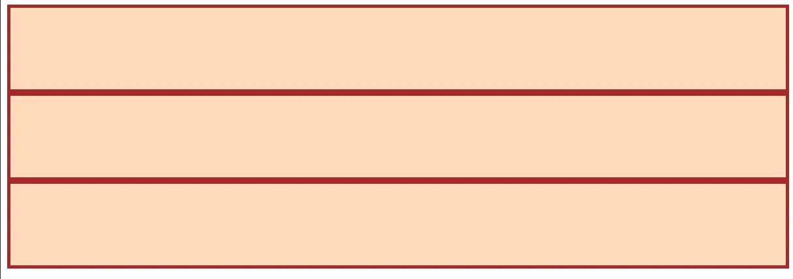
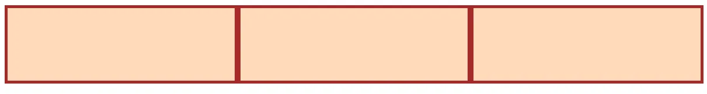
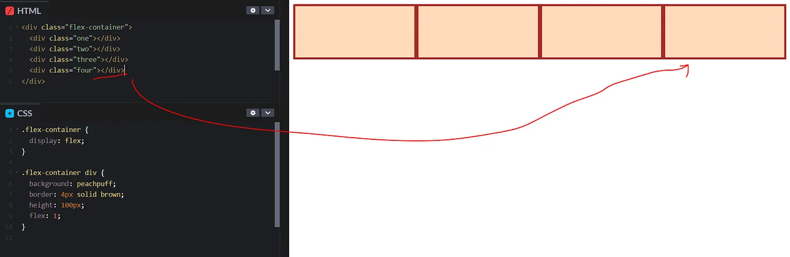
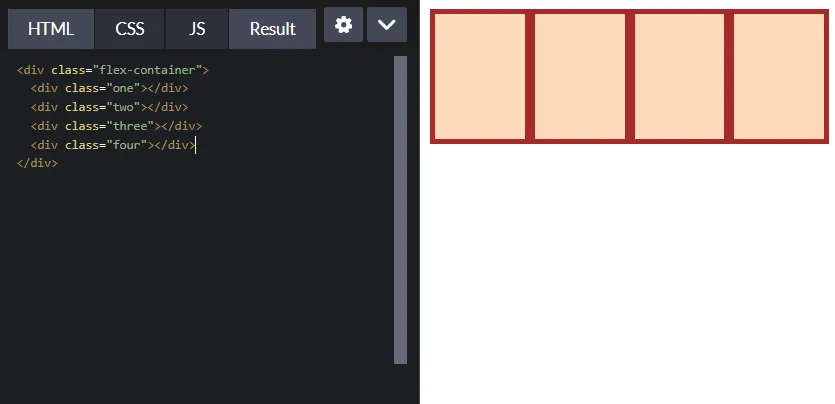
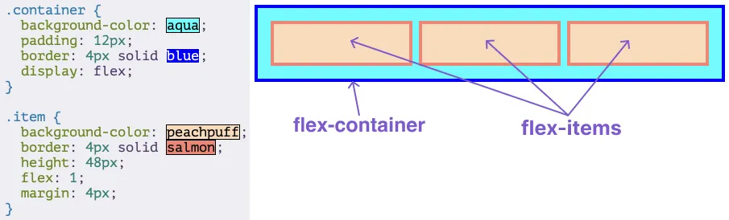
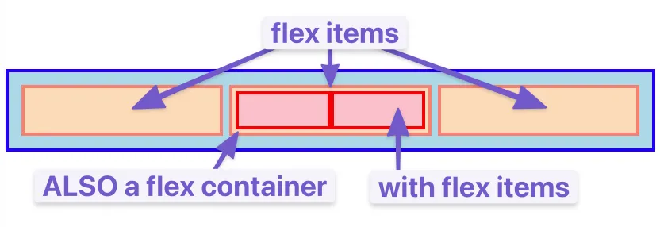
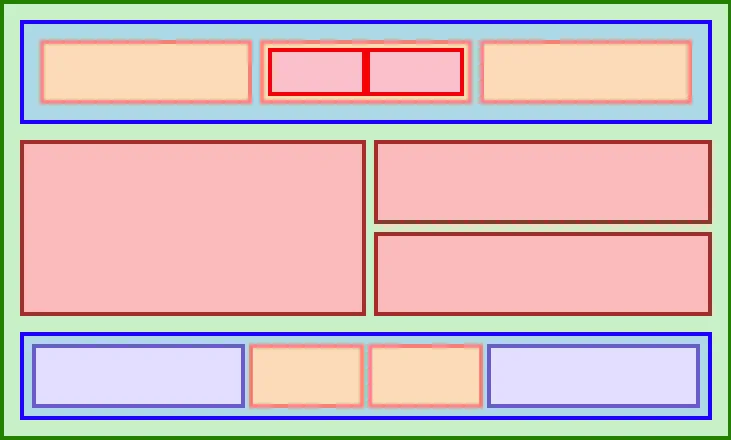

# Day 34: Tìm hiểu về FlexBox , flex container và flex items

Nhiều nguồn tài liệu giảng dạy đưa FlexBox vào gần cuối chương trình giảng dạy của họ vì nó là một công nghệ khá mới. Nhưng tại thời điểm này, nó đã trở thành cách định vị các thành phần mặc định cho nhiều nhà phát triển. Flexbox là một trong những công cụ được sử dụng nhiều nhất trong các công cụ của bạn, vậy tại sao không học nó trước?

# **`1. Những điều cần lưu ý trước khi bắt đầu`**
Bố cục Flexbox có thể hơi phức tạp. Trong bài học trước, bạn đã học cách kiểm tra và gỡ lỗi mọi thứ bằng các Chrome DevTools. Các công cụ đó sẽ rất quan trọng đối với bạn trong các bài học sau. Mỗi lần (everytime) có điều gì đó không hoạt động theo cách bạn mong đợi, hãy kiểm tra nó trong các DevTools.

Flexbox không khó hơn các khái niệm khác mà chúng ta đã đề cập cho đến nay, tuy nhiên Sẽ hơi khó để sử dụng bất kỳ điều gì bạn học được trong các bài học đầu tiên cho đến khi bạn học đến các bài cuối và có thể kết hợp tất cả lại với nhau. Nhưng, với mỗi ví dụ đưa ra, hãy thử nghiệm thật nhiều để có thể hiểu được cách mà FlexBox hoạt động.

Bạn gần như chắc chắn sẽ cần quay lại và tham khảo các bài học này khi bạn học đến các bài tập ở cuối phần flexbox. Lưu ý rằng việc thường xuyên phải xem lại (và cũng nên xem lại) các bài học cũ là việc hết sức bình thường (thực ra là quan trọng).

# **`2. FlexBox là gì?`**
Flexbox (Flexible Box)là một cách sắp xếp các items thành hàng hoặc cột. Các items này sẽ flex (tức là mở rộng hoặc thu hẹp) dựa trên một số quy tắc mà bạn có thể xác định.

Chúng ta sẽ xem các tình huống ở ví dụ này ([bấm vào link này](https://codepen.io/TheOdinProjectExamples/pen/QWgNxrp?editors=1100))

**`Ban đầu, khi .flex-container chưa bật thuộc tính display:flex; và /* flex: 1; */`**
```html
<div class="flex-container">
  <div class="one"></div>
  <div class="two"></div>
  <div class="three"></div>
</div>
```
```css
.flex-container {
/*   display: flex; */
}

/* this selector selects all divs inside of .flex-container */
.flex-container div {
  background: peachpuff;
  border: 4px solid brown;
  height: 100px;
  width: 100px;
  /* flex: 1; */
}
```
3 hộp div sẽ được xếp theo cột dọc như thế này (Normal flow Layout):

> 

**`Khi bật thuộc tính display:flex và flex: 1 bằng cách xóa dấu comment:`**

Lúc này :

- Ba khối div sẽ được xếp ngang trên một hàng.

- Mỗi khối sẽ tự động co giãn để chiếm diện tích đều nhau trong phần không gian có sẵn.

>  

Nếu bạn thêm một div nữa vào bên trong .flex-container, tất cả các div sẽ co lại vừa đủ chỗ để nằm cùng một hàng.
>  

Nếu ta thay đổi kích thước trình duyệt, khiến viewport nhỏ lại, các hộp cũng sẽ tự động co giãn để vừa nằm trên cùng 1 hàng.
>  

# **`3. Flex containers và flex items`**
Một flex container là bất kỳ phần tử nào có display: flex trên đó. Một flex item là bất kỳ phần tử nào nằm trực tiếp bên trong một flex container.

Như bạn đã thấy, flexbox không chỉ là 1 thuộc tính CSS đơn lẻ mà là một hộp công cụ các thuộc tính mà bạn có thể dùng để đặt mọi thứ vào nơi mà bạn muốn. Trong số những thuộc tính này, sẽ có những thuộc tính thuộc về flex container, và có những thuộc tính khác thuộc về flex items.
>  


Bất kỳ phần tử nào cũng có thể vừa là flex container vừa là flex item : Nghĩa là: Một phần tử HTML có thể cùng lúc đóng hai vai trò:

- Là một “flex item”: Nó là con của một phần tử dùng display: flex.

- Là một “flex container”: Nó chính nó cũng dùng display: flex để sắp xếp các phần tử con bên trong nó.

>  

Tạo và lồng nhiều flex container và flex item là cách chính mà chúng ta sẽ xây dựng các bố cục phức tạp. Hình ảnh sau đây được tạo ra chỉ bằng cách sử dụng flexbox để sắp xếp, định cỡ và đặt các thành phần khác nhau. Flexbox là một công cụ rất mạnh mẽ.

>  


