# **Day 35 Định vị trí Flex Item thông qua chính nó và Flex Container**

# **`Nội dung bài:`**
- Dùng display: flex; để tạo một flex container.

- Dùng justify-content để căn chỉnh các mục theo hướng trục chính của flex container (mặc định là trục nằm ngang).

- Dùng align-items để căn chỉnh các mục theo phương vuông góc với trục chính của flex container (mặc định là trục thẳng đứng)

- Dùng flex-direction nếu muốn một column thay vì row.

- Dùng row-reverse hoặc column-reverse để lật các item trên cùng 1 hàng/1 cột.

- Dùng order để tùy chỉnh thứ tự của các item (bất kể hàng/cột)

- Dùng align-self để căn chỉnh riêng từng item theo phương dọc .

- Dùng flex để tạo các flexible boxes có thể (giãn ra và co vào) stretch and shrink.

# **`A. ĐỊNH VỊ TRÍ CÁC Flex Item thông qua Flex Container`**
## 1. Flexbox vs Float
Chế độ bố cục “Flexible Box” hoặc “Flexbox” cung cấp một giải pháp thay thế cho Floats để xác định giao diện tổng thể của trang web. Trong khi float chỉ cho phép chúng ta định vị hộp theo chiều ngang, flexbox cho phép chúng ta kiểm soát hoàn toàn sự căn chỉnh (alignment), hướng (direction), thứ tự (order) và kích thước (size) của hộp.

>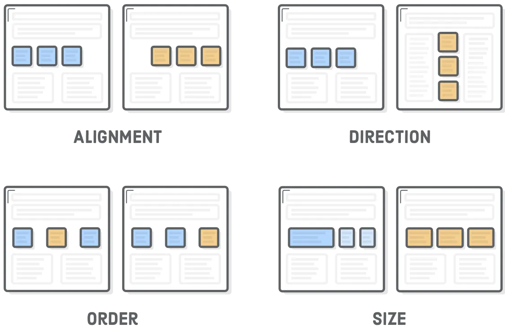

Trong khoảng một thập kỷ trở lại đây, float là lựa chọn duy nhất để bố trí một trang web phức tạp. Do đó, chúng được hỗ trợ tốt ngay cả trong các trình duyệt cũ và các nhà phát triển đã sử dụng chúng để xây dựng hàng triệu trang web. Điều này có nghĩa là bạn chắc chắn sẽ gặp phải float trong sự nghiệp phát triển web của mình.

Tuy nhiên Các loại bố cục bạn có thể tạo bằng float thực sự có phần hạn chế, ngay cả với 1 bố cục sidebar đơn giản. Flexbox được phát minh ra để thoát khỏi những hạn chế này.

Với các trình duyệt hiện đại ngày nay các nhà phát triển có thể bắt đầu xây dựng các trang web đầy đủ với flexbox. Chúng tôi khuyên bạn nên sử dụng flexbox để bố trí các trang web của bạn càng nhiều càng tốt, chỉ dùng các float cho khi bạn cần văn bản chạy quanh một hộp (tức là bố cục theo kiểu tạp chí) hoặc khi bạn cần hỗ trợ các trình duyệt web cũ.

>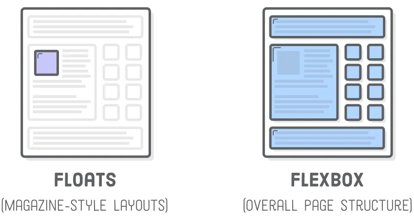

Với Flexbox bạn có thể thoải mái xây dựng gần như bất kỳ bố cục nào mà một nhà thiết kế web có thể cung cấp cho bạn.

## 2. Setup
Ví dụ cho chương này tương đối đơn giản, nhưng nó minh họa rõ ràng tất cả các thuộc tính flexbox quan trọng. Chúng ta sẽ kết thúc với một cái gì đó trông như thế này:
>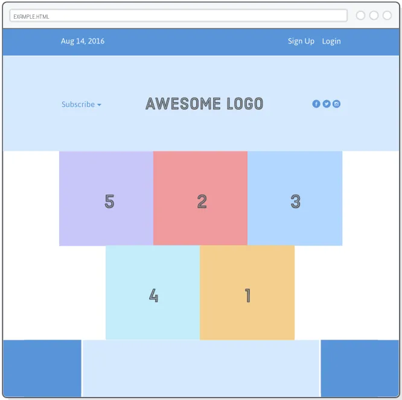

Để bắt đầu, chúng ta cần một tài liệu HTML trống không chứa gì ngoài thanh manu bar. Tạo một dự án mới có tên là flexbox để chứa tất cả các tệp ví dụ cho chương này. Sau đó, tạo flexbox.html:
```html
<!DOCTYPE html>
<html lang='en'>
  <head>
    <meta charset='UTF-8'/>
    <title>Some Web Page</title>
    <link rel='stylesheet' href='styles.css'/>
  </head>
  <body>
    <div class='menu-container'>
      <div class='menu'>
        <div class='date'>Aug 14, 2016</div>
        <div class='signup'>Sign Up</div>
        <div class='login'>Login</div>
      </div>
    </div>
  </body>
</html>
```
Tiếp theo, chúng ta cần tạo stylesheet styles.css tương ứng. Trông sẽ không có gì đặc biệt: chỉ là một thanh menu màu xanh toàn chiều rộng với một hộp viền trắng. Lưu ý rằng chúng ta sẽ sử dụng flexbox thay vì kỹ thuật auto-margin truyền thống để căn giữa menu.
```css
* {
  margin: 0;
  padding: 0;
  box-sizing: border-box;
}

.menu-container {
  color: #fff;
  background-color: #5995DA;  /* Blue */
  padding: 20px 0;
}

.menu {
  border: 1px solid #fff;  /* For debugging */
  width: 900px;
}
```
Cuối cùng, [tải xuống một số hình ảnh](https://internetingishard.netlify.app/html-and-css/flexbox/flexbox-images-449705.zip) để sử dụng cho trang web mẫu của chúng ta. Giải nén chúng vào dự án flexbox, giữ nguyên thư mục hình ảnh gốc. Dự án sẽ trông như thế này trước khi tiếp tục:

>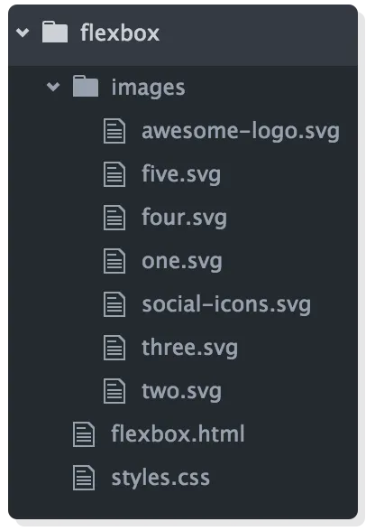

## 3. Tổng quan Flexbox
Trong bài trước ta đã học : Flexbox sử dụng hai loại hộp là “flex containers” và “flex items”. Nhiệm vụ của flex container là nhóm một loạt các flex items lại với nhau và xác định cách chúng được định vị.

>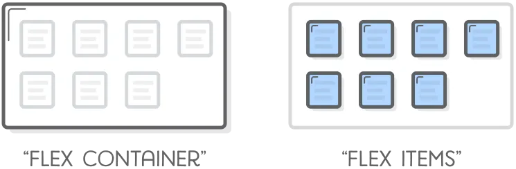

Mỗi phần tử HTML là con trực tiếp của một flex container là một "item". Các flex item có thể được thao tác riêng lẻ, nhưng phần lớn, việc xác định bố cục của chúng là tùy thuộc vào container. Mục đích chính của flex item là để cho container của chúng biết có bao nhiêu thứ cần định vị.

Giống như float-based layouts, việc định nghĩa các trang web phức tạp bằng flexbox đều liên quan đến các hộp lồng nhau. Bạn căn chỉnh một loạt các flex items bên trong một container và ngược lại, các flex items có thể đóng vai trò là flex containers cho các items của riêng chúng. Hãy nhớ rằng nhiệm vụ cơ bản của việc bố trí một trang vẫn không thay đổi: chúng ta vẫn chỉ di chuyển một loạt các hộp lồng nhau xung quanh trang.

## 4. Flex Containers
Bước đầu tiên trong việc sử dụng flexbox là biến một trong các phần tử HTML của chúng ta thành một flex container. Chúng ta thực hiện điều này với thuộc tính display, thuộc tính này quen thuộc với chương CSS Box Model. Bằng cách cung cấp cho nó một giá trị flex, chúng ta đang cho trình duyệt biết rằng mọi thứ trong hộp nên được hiển thị bằng flexbox thay vì box model mặc định (block box, inline box).

Thêm dòng sau vào quy tắc .menu-container để biến nó thành một flex container:
```css
.menu-container { 
  /* ... */
  display: flex;
}
```
Điều này cho phép chế độ bố cục flexbox được sẵn sàng—nếu không có nó, trình duyệt sẽ bỏ qua tất cả các thuộc tính flexbox mà chúng ta sẽ khai báo. Việc định nghĩa rõ ràng các flex containers có nghĩa là bạn có thể kết hợp flexbox với các mô hình bố cục khác (ví dụ: float …).

>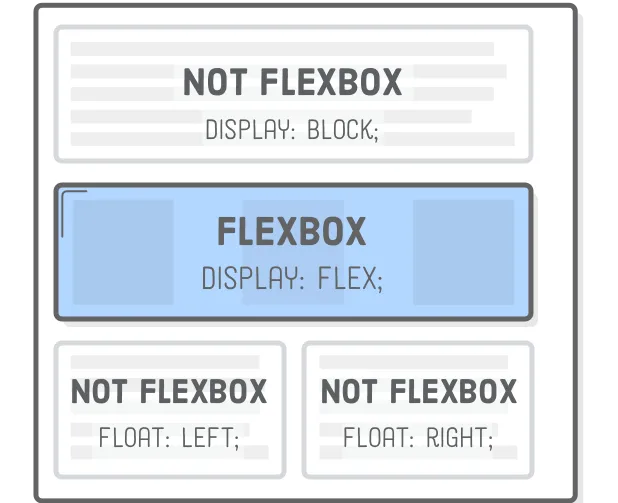

Bây giờ chúng ta đã có một flex container với một flex item trong đó. Tuy nhiên, trang của chúng ta sẽ chưa có gì thay đổi vì chúng ta chưa cho container biết cách hiển thị item của nó.

## 5. Aligning a Flex Item (Căn chỉnh một Flex Item)
Sau khi bạn có một flex container, công việc tiếp theo của bạn là xác định việc căn chỉnh theo chiều ngang của các Items. Đó là mục đích của thuộc tính justify-content. Chúng ta có thể sử dụng nó để căn giữa .menu, như sau:
```css
.menu-container {
  /* ... */
  display: flex;
  justify-content: center;    /* Add this */
}
```
Điều này có tác dụng tương tự như việc thêm một khai báo `margin: 0 auto` vào phần tử .menu. Nhưng hãy chú ý cách chúng ta thực hiện điều này bằng cách thêm một thuộc tính vào phần tử cha (flex container) thay vì trực tiếp vào phần tử mà chúng ta muốn căn giữa (flex item). Việc thao tác các Items thông qua các container của chúng như thế này là một chủ đề phổ biến trong flexbox và nó hơi khác so với cách chúng ta định vị các hộp cho đến nay.

>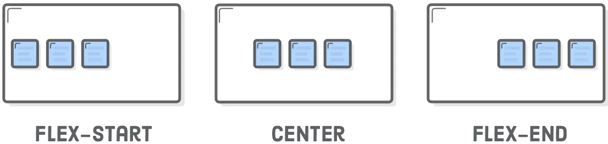

Các giá trị khác cho justify-content được hiển thị bên dưới:

- center

- flex-start

- flex-end

- space-around

- space-between

Hãy thử thay đổi justify-content thành flex-start và flex-end. Thao tác này sẽ căn chỉnh menu sang bên trái và bên phải của cửa sổ trình duyệt. Hãy chắc chắn thay đổi lại thành center trước khi tiếp tục. Hai tùy chọn cuối là space-around và space-between cùng chỉ hữu ích khi bạn có nhiều Flex Items trong một Flex Container.

## 6. Điều phối nhiều Flex Items
Flexbox không thể hiện sức mạnh thực sự của nó cho đến khi chúng ta có nhiều hơn một Item trong một container. Thuộc tính justify-content cũng cho phép bạn phân phối các mục đều nhau bên trong một container.


>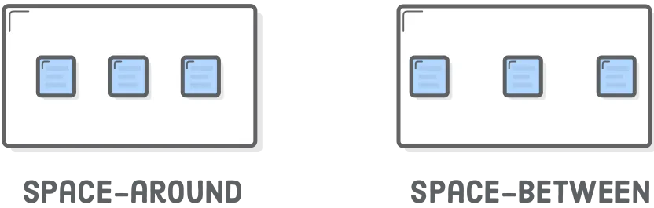

Thay đổi quy tắc .menu như sau:
```css
.menu {
  border: 1px solid #fff;
  width: 900px;
  display: flex;
  justify-content: space-around;
}
```
Điều này biến .menu của chúng ta thành một flex container lồng nhau và giá trị space-around sẽ trải rộng các Items của nó trên toàn bộ chiều rộng của nó, Flex container tự động phân phối thêm khoảng cách theo chiều ngang ngang cho cả hai bên của mỗi Item:

>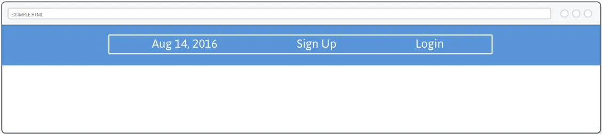

Giá trị space-between cũng tương tự, nhưng nó chỉ thêm khoảng cách giữa các mục (Không có khoảng cách đầu và cuối). Đây là những gì chúng ta thực sự muốn cho trang ví dụ của mình, vì vậy hãy tiếp tục và cập nhật dòng justify-content:
```css
justify-content: space-between;
```
Tất nhiên, bạn cũng có thể sử dụng center, flex-start, flex-end ở đây nếu bạn muốn đẩy tất cả các mục sang một bên (trái hoặc phải), nhưng hãy để nó là space-between.

## 7. Grouping Flex Items (Nhóm các mục lại)
Flex container chỉ biết cách định vị các phần tử ở độ sâu cấp 1 (tức là các phần tử con của chúng). Chúng không quan tâm một chút nào đến những gì bên trong các Flex item con của chúng. Điều này có nghĩa là việc nhóm các Flex item là một vũ khí khác trong kho vũ khí tạo bố cục của bạn. Việc gói một loạt các Items trong một `<div>` bổ sung sẽ tạo ra một trang web hoàn toàn khác.

>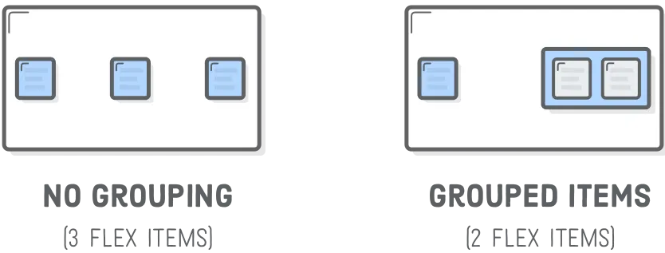
Ví dụ, giả sử bạn muốn cả liên kết Sign Up và Login đều nằm ở bên phải trang, như trong ảnh chụp màn hình bên dưới. Tất cả những gì chúng ta cần làm là gắn chúng vào một `<div>` khác:
```html
<div class='menu'>
  <div class='date'>Aug 14, 2016</div>
  <div class='links'>
    <div class='signup'>Sign Up</div>      <!-- This is nested now -->
    <div class='login'>Login</div>         <!-- This one too! -->
  </div>
</div>
```
Thay vì có ba items, flex container .menu hiện chỉ có hai items (.date và.links). Theo giá trị space-between hiện tại, chúng sẽ bám vào bên trái và bên phải của trang.

>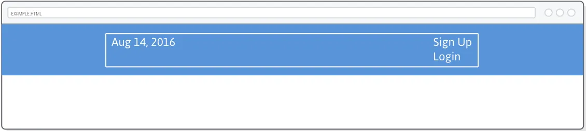

Nhưng bây giờ chúng ta cần bố trí phần tử .links vì nó đang sử dụng chế độ bố trí khối mặc định (default block layout mode). Giải pháp là gì: nhiều flex containers lồng nhau hơn! Thêm một quy tắc mới vào tệp styles.css của chúng ta để biến phần tử .links thành flex container:
```css
.links {
  border: 1px solid #fff;  /* For debugging */
  display: flex;
  justify-content: flex-end;
}

.login {
  margin-left: 20px;
}
```
Điều này sẽ đặt các links của chúng ta đúng nơi chúng ta muốn. Lưu ý rằng margins vẫn hoạt động giống như trong CSS Box Model. Và, giống như box model thông thường, auto margins có ý nghĩa đặc biệt trong flexbox (xem phần cuối bài).

>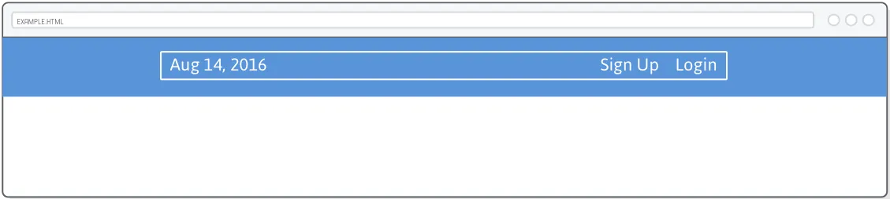

Chúng ta sẽ không cần những đường viền trắng đó nữa, vì vậy bạn có thể xóa chúng nếu muốn.

## 8. Cross-Axis (Vertical) Alignment (Căn chỉnh theo phương còn lại - trục dọc)
Cho đến nay, chúng ta đã thao tác căn chỉnh theo chiều ngang, nhưng các flex container cũng có thể xác định căn chỉnh theo chiều dọc của các items của chúng. Đây là điều mà các float không thể thực hiện được.

>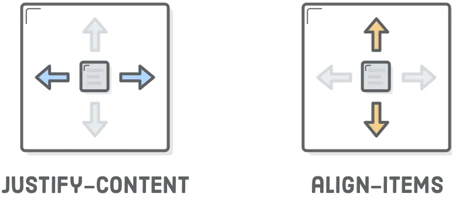

Để khám phá điều này, chúng ta cần thêm một header bên dưới menu của mình. Thêm đánh dấu sau vào flexbox.html sau phần tử .menu-container:
```html
<div class='header-container'>
  <div class='header'>
    <div class='subscribe'>Subscribe &#9662;</div>
    <div class='logo'></div>
    <div class='social'></div>
  </div>
</div>
```
Tiếp theo, thêm một styles cơ bản để căn chỉnh với phần tử .menu:
```css
.header-container {
  color: #5995DA;
  background-color: #D6E9FE;
  display: flex;
  justify-content: center;
}

.header {
  width: 900px;
  height: 300px;
  display: flex;
  justify-content: space-between;
}
```
Tất cả những điều này hẳn là quen thuộc; tuy nhiên, kịch bản này hơi khác so với menu của chúng ta. Vì .header có chiều cao rõ ràng, các items có thể được định vị theo chiều dọc bên trong nó. Thông số kỹ thuật chính thức gọi đây là căn chỉnh "trục chéo" (“cross-axis” alignment) (chúng ta sẽ thấy lý do tại sao sau một lát), nhưng đối với mục đích của chúng ta, nó cũng có thể được gọi là căn chỉnh "dọc"(“vertical” alignmen).

>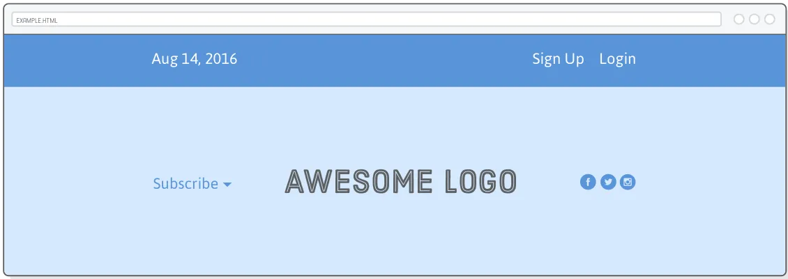

Căn chỉnh theo chiều dọc được xác định bằng cách thêm thuộc tính align-items vào một flex container. Làm cho trang ví dụ của chúng ta khớp với ảnh chụp màn hình ở trên với dòng sau:
```css
.header {
  /* ... */
  align-items: center;  /* Add this */
}
```
Các tùy chọn có sẵn cho align-items tương tự như justify-content:

- center

- flex-start (top)

- flex-end (bottom)

- stretch

- baseline

>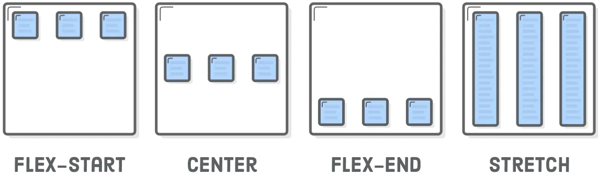 

Hầu hết các tùy chọn này đều đơn giản. Tùy chọn stretch cho phép bạn hiển thị nền của từng phần tử. Hãy cùng xem qua bằng cách thêm nội dung sau vào styles.css.

Hộp của mỗi item mở rộng toàn bộ chiều cao của flex container, bất kể nó chứa bao nhiêu nội dung. Một trường hợp sử dụng phổ biến cho hành vi này là tạo các cột có chiều cao bằng nhau với lượng nội dung thay đổi trong mỗi cột—điều rất khó thực hiện với các float.

Hãy đảm bảo xóa các thay đổi trên và căn giữa nội dung của chúng ta theo chiều dọc bên trong .header trước khi tiếp tục:
```css
.header {
  /* ... */
  align-items: stretch;    /* Change this */
}

.social,
.logo,
.subscribe {
  border: 1px solid #5995DA;
}
```
Kết quả:
  >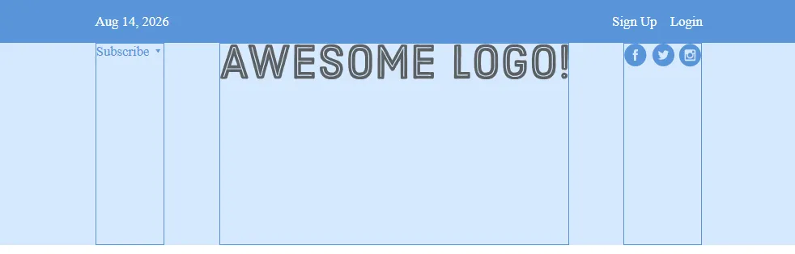 


## 9. Wrapping Flex Items
Flexbox là một giải pháp thay thế mạnh mẽ hơn cho lưới dạng float (float-based grids). Không chỉ có thể render các Items dưới dạng lưới, nó còn có thể thay đổi alignment, direction, order, and size. Để tạo lưới, chúng ta cần thuộc tính flex-wrap.
>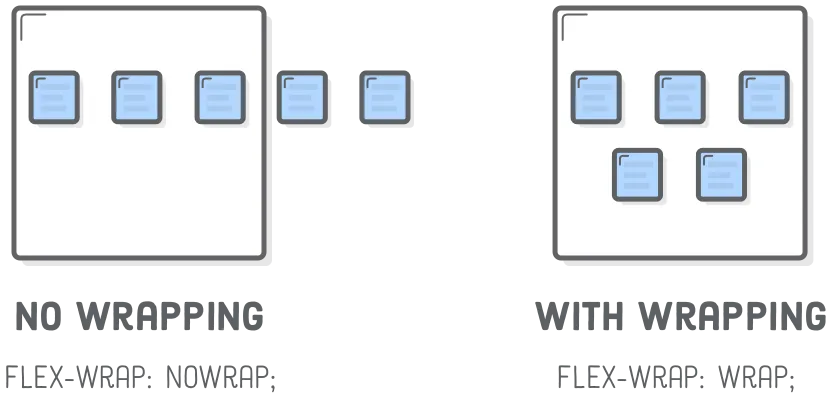

Thêm một hàng ảnh vào flexbox.html để chúng ta có thứ gì đó để làm việc. Điều này sẽ nằm bên trong <body>, dưới phần tử .header-container:
```html
<div class='photo-grid-container'>
  <div class='photo-grid'>
    <div class='photo-grid-item first-item'>
      
    </div>
    <div class='photo-grid-item'>
      
    </div>
    <div class='photo-grid-item'>
      
    </div>
  </div>
</div>
```
Một lần nữa, mã CSS tương ứng có thể đã quen thuộc ở các phần trước:
```css
.photo-grid-container {
  display: flex;
  justify-content: center;
}

.photo-grid {
  width: 900px;
  display: flex;
  justify-content: flex-start;
}

.photo-grid-item {
  border: 1px solid #fff;
  width: 300px;
  height: 300px;
}
```
  >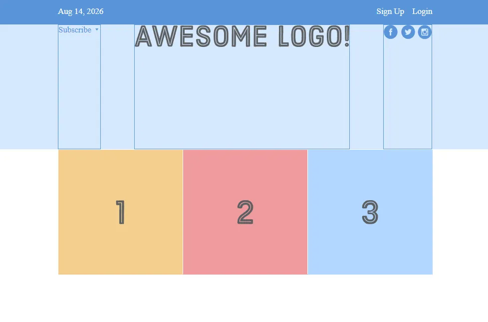

Điều này sẽ hoạt động như mong đợi, nhưng hãy xem điều gì xảy ra khi chúng ta thêm nhiều items hơn mức có thể chứa trong flex container. Chèn thêm hai ảnh vào .photo-grid::
```html
<div class='photo-grid-item'>
  
</div>
<div class='photo-grid-item last-item'>
  
</div>
```
Theo mặc định, chúng sẽ tràn ra khỏi mép trang:

>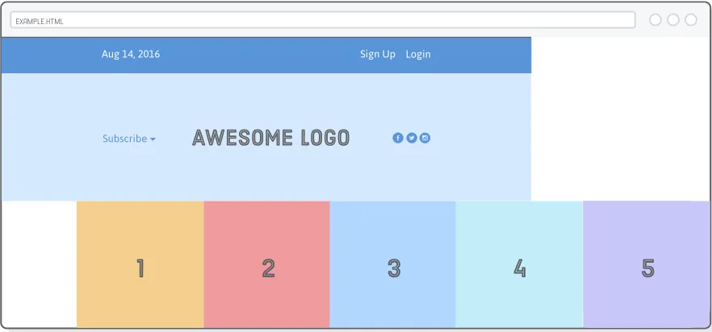

Nếu bạn đang cố gắng xây dựng một hero banner cho phép người dùng cuộn ngang qua một loạt ảnh, thì đây có thể là hành vi mong muốn, nhưng đó không phải là điều chúng ta muốn. Thêm thuộc tính flex-wrap sau đây sẽ buộc các mục không vừa phải được đẩy xuống hàng tiếp theo:
```css
.photo-grid {
  /* ... */
  flex-wrap: wrap;
}
```
>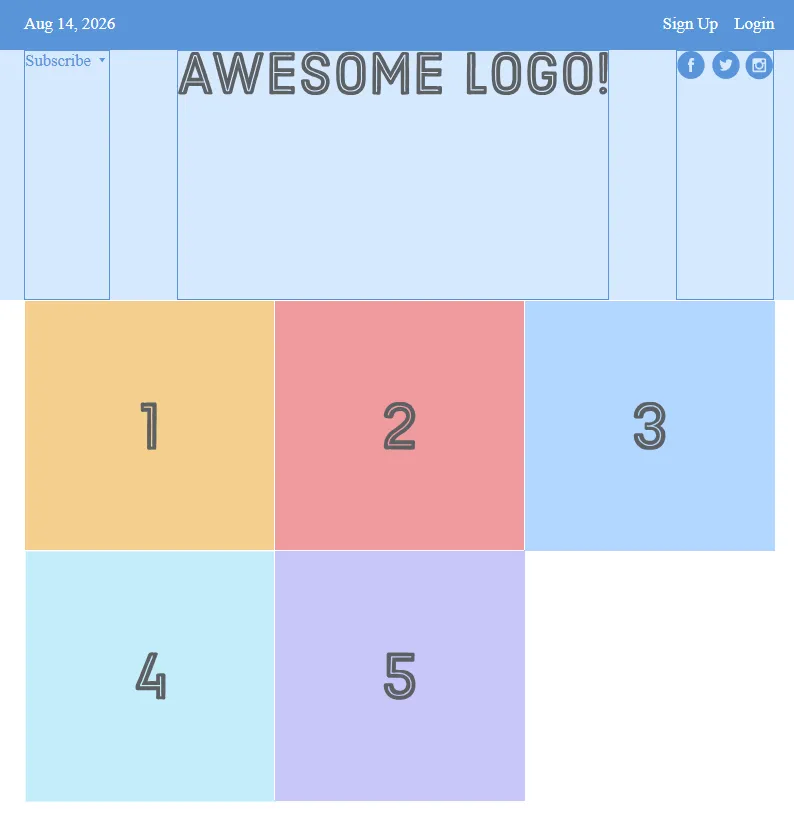

Bây giờ, các flex items của chúng ta hoạt động giống như các hộp nổi (floated boxes), ngoại trừ flexbox cho chúng ta nhiều quyền kiểm soát hơn đối với cách các mục được căn chỉnh trong hàng cuối cùng thông qua thuộc tính justify-content. Ví dụ, dòng cuối cùng hiện đang được căn trái. Hãy thử căn giữa bằng cách cập nhật quy tắc .photo-grid của chúng ta, như sau:
```css
.photo-grid {
  width: 900px;
  display: flex;
  justify-content: center;    /* Change this */
  flex-wrap: wrap;
}
```
Để đạt được điều này với các bố cục dựa trên float sẽ rất phức tạp..
>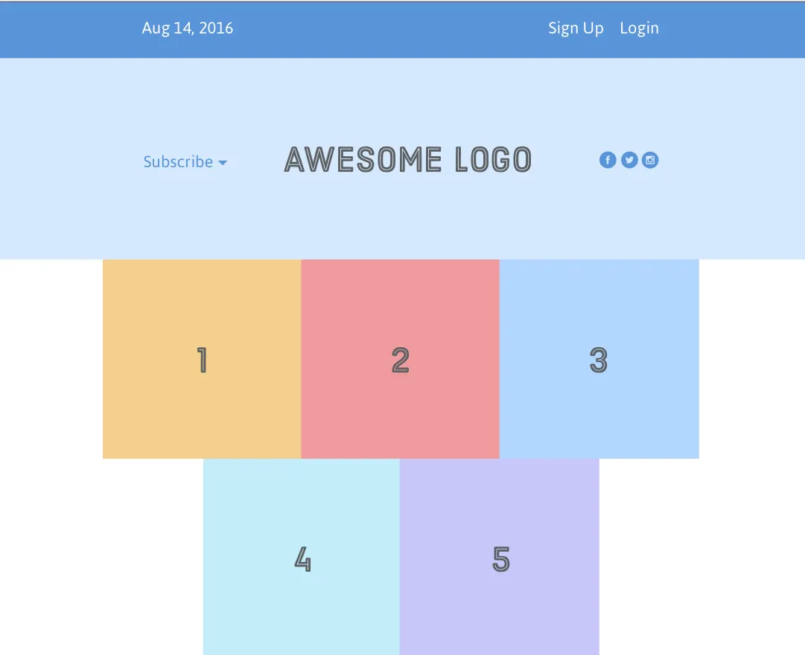

## 10. Flex Container Direction
“Direction” đề cập đến việc một container hiển thị các Items theo chiều ngang hay chiều dọc. Cho đến nay, tất cả các container mà chúng ta đã thấy đều sử dụng hướng ngang mặc định, nghĩa là các mục được vẽ lần lượt trong cùng một hàng trước khi chuyển xuống cột tiếp theo khi hết chỗ.
>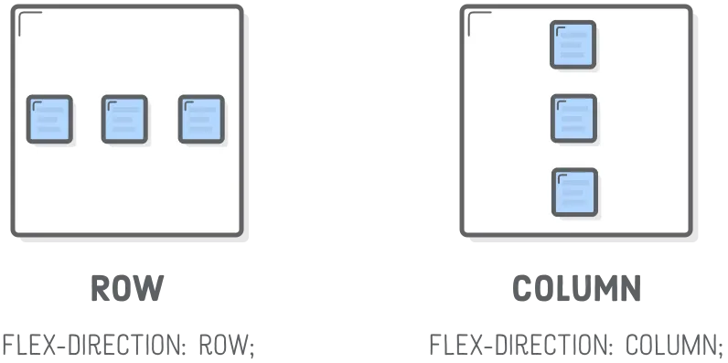

Một trong những điều tuyệt vời nhất về flexbox là khả năng chuyển đổi hàng thành cột chỉ bằng một dòng CSS. Hãy thử thêm khai báo flex-direction sau vào quy tắc .photo-grid:
```css
.photo-grid {
  /* ... */
  flex-direction: column;
}
```
Điều này thay đổi hướng của container từ giá trị row mặc định. Thay vì lưới, trang của chúng ta hiện có một cột dọc duy nhất:
>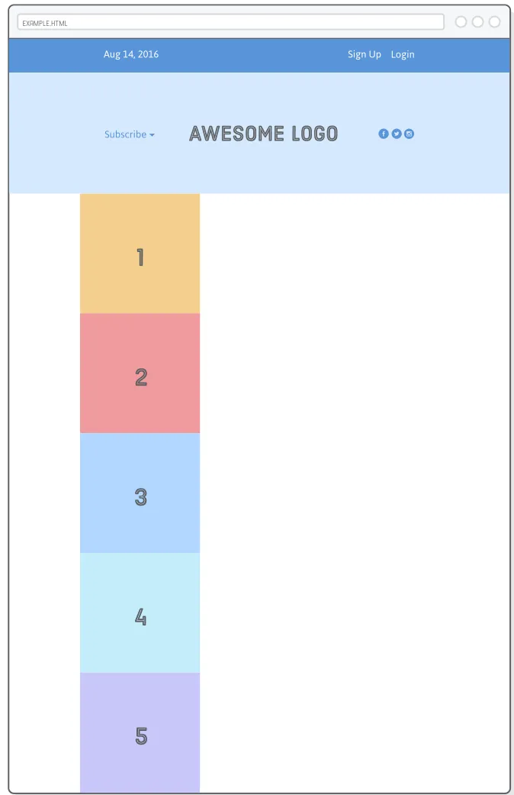

Một nguyên tắc chính của thiết kế đáp ứng (responsive design) là trình bày cùng một HTML markup cho cả người dùng thiết bị di động và máy tính để bàn. Điều này gây ra một chút vấn đề, vì hầu hết các bố cục trên thiết bị di động là một cột duy nhất, trong khi hầu hết các bố cục trên máy tính để bàn xếp chồng các thành phần theo chiều ngang. Bạn có thể tưởng tượng flex-direction sẽ hữu ích như thế nào khi chúng ta bắt đầu xây dựng các bố cục đáp ứng.

## 11. Alignment Considerations
Lưu ý rằng cột này đang ôm lấy phía bên trái của vùng chứa flex của nó mặc dù chúng ta đã khai báo justify-content: center;. Khi bạn xoay hướng của vùng chứa, bạn cũng xoay hướng của thuộc tính justify-content. Bây giờ nó tham chiếu đến căn chỉnh theo chiều dọc của vùng chứa—không phải căn chỉnh theo chiều ngang của nó.

Lưu ý rằng, một cách tổng quát, thuộc tính justify-content sẽ căn chỉnh các items theo Flex Container Direction. Còn Align-items sẽ căn chỉnh các items theo trục còn lại (vuông góc với trục mặc định).

Vì hiện tại flex-direction: column nên hướng của Flex Container là trục đứng. Khi đó thuộc tính justify-content: center; sẽ áp dụng cho trục đứng chứ không phải trục ngang, cho nên ta thấy cột các ảnh lúc này vẫn nằm ở phía bên trên.

>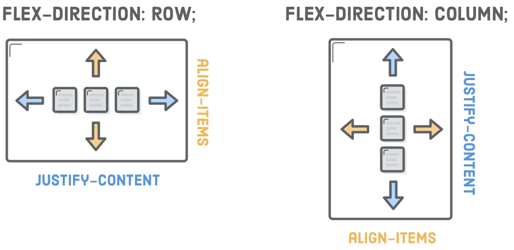

Để căn giữa cột theo chiều ngang, chúng ta cần xác định thuộc tính align-items trên .photo-grid của mình:
```css
.photo-grid {
  /* ... */
  flex-direction: column;
  align-items: center;      /* Add this */
}
```
## 12. Flex Container Order
Cho đến nay, có một mối tương quan chặt chẽ giữa thứ tự các HTML element và cách các hộp được hiển thị trong một trang web. Với các kỹ thuật float hoặc flexbox mà chúng ta đã thấy cho đến nay, cách duy nhất chúng ta có thể làm cho một hộp xuất hiện trước hoặc sau một hộp khác là di chuyển xung quanh HTML markup cơ bản. Tức là muốn 1 box xuất hiện trước 1 box khác trên trang web thì phần tử HTML tương ứng của nó phải được khai báo trước. Tuy nhiên điều này sắp thay đổi.

>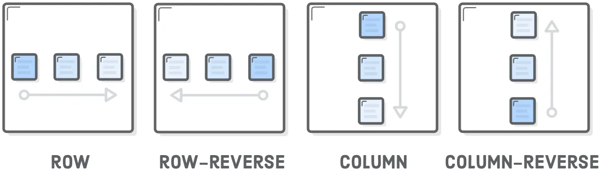

Thuộc tính flex-direction cũng cung cấp cho bạn quyền kiểm soát thứ tự xuất hiện của các mục thông qua thuộc tính row-reverse và column-reverse. Để xem điều này hoạt động, hãy biến đổi cột của chúng ta trở lại thành lưới, nhưng lần này chúng ta sẽ đảo ngược thứ tự của mọi thứ:
```css
.photo-grid {
  width: 900px;
  display: flex;
  justify-content: center;
  flex-wrap: wrap;
  flex-direction: row-reverse;  /* <--- Really freaking cool! */
  align-items: center;
}
```
Cả hai hàng hiện được hiển thị từ phải sang trái thay vì từ trái sang phải. Nhưng hãy chú ý cách này chỉ hoán đổi thứ tự theo từng hàng: hàng đầu tiên không bắt đầu từ 5, mà bắt đầu từ 3. Đây là hành vi hữu ích cho nhiều mẫu thiết kế phổ biến (đặc biệt là column-reverse mở ra nhiều cánh cửa cho bố cục di động). Chúng ta sẽ tìm hiểu cách để có được chi tiết hơn nữa trong phần tiếp theo:

>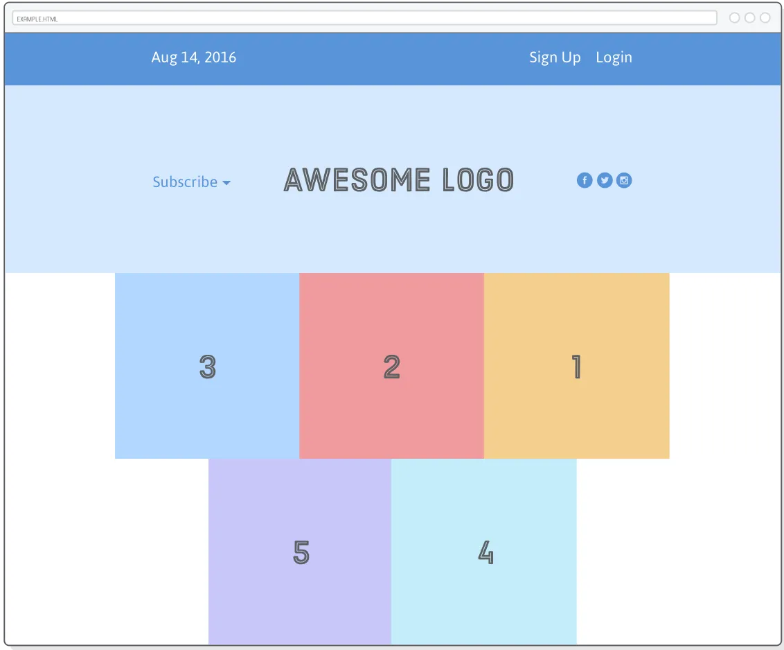

Sắp xếp lại các phần tử từ bên trong một stylesheet là một vấn đề lớn. Trước khi có flexbox, các nhà phát triển web phải dùng đến các thủ thuật JavaScript để thực hiện loại việc này. Tuy nhiên, đừng lạm dụng điều này. Bạn nên luôn tách nội dung khỏi phần trình bày. Việc thay đổi thứ tự như thế này hoàn toàn mang tính trình bày.

# **`B. ĐỊNH VỊ TRÍ CÁC FLEX ITEM THÔNG QUA CHÍNH NÓ`**
## 13. Flex Item Order
Từ đầu bài viết này nói về việc định vị các Flex Item thông qua các Flex Container, nhưng cũng có thể thao tác với các Flex Items riêng lẻ. Phần còn lại của chương này sẽ chuyển trọng tâm từ các Flex Container sang các Flex Items.

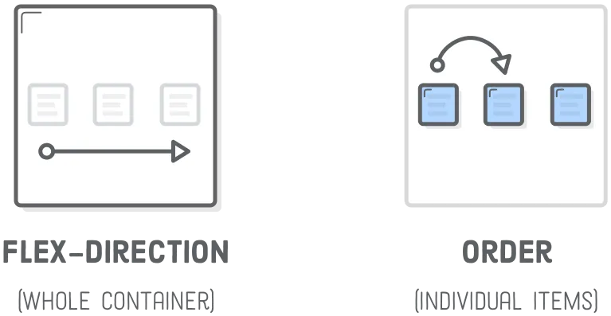

Thêm thuộc tính order vào một flex item sẽ xác định thứ tự của mục đó trong flex container mà không ảnh hưởng đến các flex item xung quanh. Giá trị mặc định của thuộc tính này là 0, và việc tăng hoặc giảm thuộc tính này từ đó sẽ di chuyển flex item sang phải hoặc sang trái tương ứng.

Ví dụ, điều này có thể được sử dụng để hoán đổi thứ tự của phần tử .first-item và .last-item trong lưới của chúng ta. (Chúng ta cũng nên thay đổi giá trị row-reverse từ phần trước trở lại row vì nó sẽ giúp các chỉnh sửa của chúng ta dễ nhìn hơn một chút):
```css
.photo-grid {
  /* ... */
  flex-direction: row;  /* Update this */
  align-items: center;
}

.first-item {
  order: 1;
}

.last-item {
  order: -1;
}
```
Không giống như thiết lập row-reverse và column-reverse trên một flex container, hoạt động trên từng hàng/từng cột. order hoạt động vượt qua ranh giới hàng/cột. Đoạn mã trên sẽ chuyển đổi item đầu tiên và item cuối cùng, mặc dù chúng xuất hiện trên các hàng khác nhau.

## 14. Flex Item Alignment
Chúng ta có thể làm điều tương tự với căn chỉnh theo chiều dọc. Nếu chúng ta muốn liên kết Subscribe và các biểu tượng mạng xã hội đó nằm ở cuối tiêu đề thay vì ở giữa thì sao? Hãy căn chỉnh chúng riêng lẻ! Đây là nơi thuộc tính align-self xuất hiện. Thêm thuộc tính này vào một flex item sẽ ghi đè giá trị align-items từ flex container của nó:
```css
.social,
.subscribe {
  align-self: flex-end;
  margin-bottom: 20px;
}
```
**Kết quả:**

>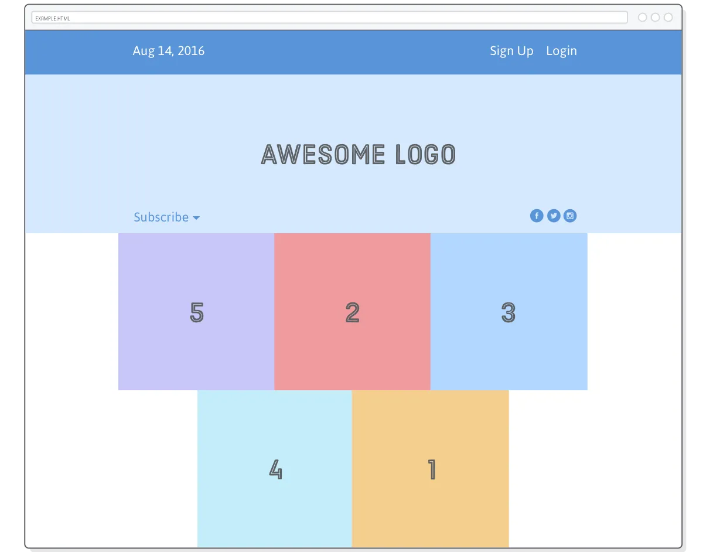

Bản thân thuộc tính align-self cũng có các giá trị giống thuộc tính align-items:

- center

- flex-start (top)

- flex-end (bottom)

- stretch

- baseline


## 15. Flexible Items
Tất cả các ví dụ của chúng ta đều xoay quanh các items có chiều rộng cố định hoặc được xác định theo nội dung. Điều này cho phép chúng ta tập trung vào các khía cạnh định vị của flexbox, nhưng cũng có nghĩa là chúng ta đã bỏ qua bản chất "flexible box" của nó. Các Flex items có tính linh hoạt (flexible): chúng có thể co lại (shrink ) và kéo dài (stretch) để phù hợp với chiều rộng của flex container của chúng.

Thuộc tính flex xác định chiều rộng của từng item trong một flex container. Hay nói chính xác hơn, nó cho phép chúng có chiều rộng linh hoạt. Thuộc tính này hoạt động như một trọng số cho flex container biết cách phân bổ không gian bổ sung cho từng flex item. Ví dụ, một flex item có giá trị flex là 2 sẽ phát triển nhanh gấp đôi so với các flex item có giá trị mặc định là 1.

>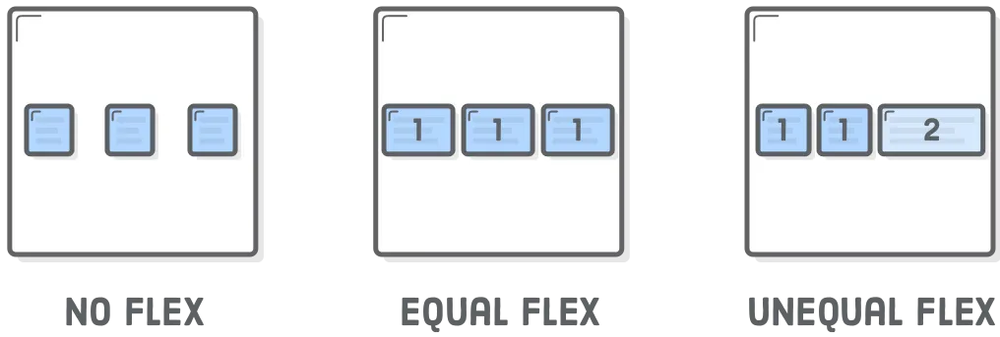

Đầu tiên, chúng ta cần một footer để thử nghiệm. Thêm mã HTML này sau phần tử .photo-grid-container:
```html
<div class='footer'>
  <div class='footer-item footer-one'></div>
  <div class='footer-item footer-two'></div>
  <div class='footer-item footer-three'></div>
</div>
```
Và thêm style CSS:
```css
.footer {
  display: flex;
  justify-content: space-between;
}

.footer-item {
  border: 1px solid #fff;
  background-color: #D6E9FE;
  height: 200px;
  flex: 1;
}
```
Dòng flex: 1; đó yêu cầu các items kéo giãn để phù hợp với chiều rộng của .footer. Vì tất cả chúng đều có cùng trọng số, nên chúng sẽ kéo giãn như nhau:

>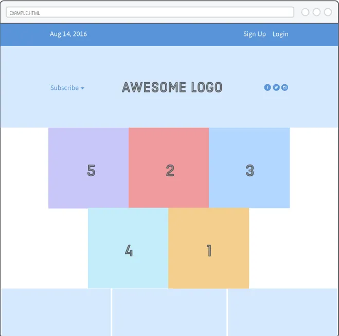

Tăng trọng số của một trong các item sẽ làm cho item đó phát triển nhanh hơn các item khác. Ví dụ, chúng ta có thể làm cho item thứ ba phát triển nhanh gấp đôi hai item kia bằng quy tắc sau:
```css
.footer-three {
  flex: 2;
}
```
So sánh điều này với thuộc tính justify-content, cái mà phân phối thêm không gian giữa các item. Điều này tương tự, nhưng bây giờ chúng ta phân phối không gian đó vào chính các items. Kết quả là kiểm soát hoàn toàn cách các flex items vừa khít với các flex container của chúng.

## 16. Static Item Widths
Chúng ta thậm chí có thể kết hợp các hộp linh hoạt (flexible boxes) với các hộp có chiều rộng cố định (fixed-width boxes). flex: initial sẽ trả hộp chiều rộng rõ ràng của hộp trong thuộc tính width. Điều này cho phép chúng ta kết hợp các hộp tĩnh và hộp linh hoạt theo những cách phức tạp.

>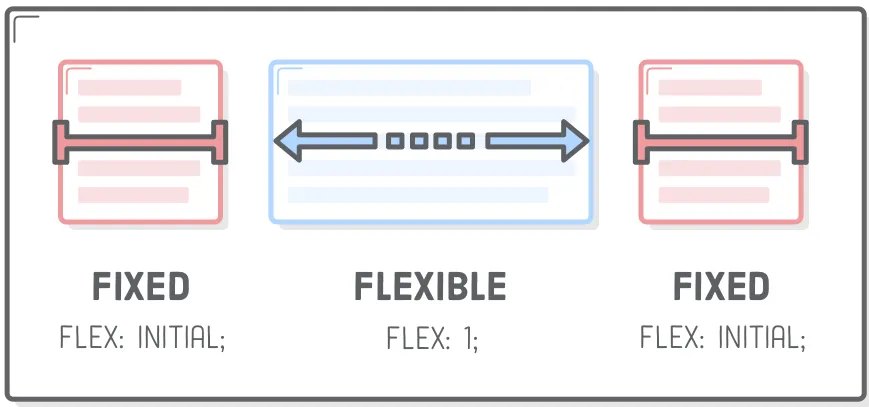

Chúng ta sẽ làm cho footer của chúng ta hoạt động giống như sơ đồ trên. Item ở giữa linh hoạt, nhưng các mục ở hai bên luôn có cùng kích thước. Tất cả những gì chúng ta cần làm là thêm quy tắc sau vào stylesheet của chúng ta:
```css
.footer-one,
.footer-three {
  background-color: #5995DA;
  flex: initial;
  width: 300px;
}
```
Nếu không có dòng flex: initial; thì khai báo flex: 1; sẽ được kế thừa từ quy tắc .footer-item, khiến các thuộc tính width bị bỏ qua. Với initial chúng ta có được một bố cục linh hoạt cũng chứa các items có chiều rộng cố định. Khi bạn thay đổi kích thước cửa sổ trình duyệt, bạn sẽ thấy rằng chỉ có hộp giữa trong footer được thay đổi kích thước.
>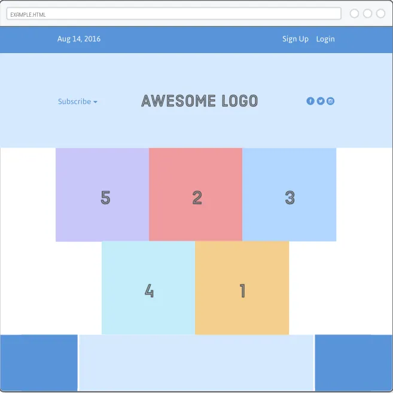

Đây là một bố cục khá phổ biến, và không chỉ trong phần chân trang. Ví dụ, nhiều trang web có thanh bên (sidebar) có chiều rộng cố định (hoặc nhiều thanh bên) và nội dung linh hoạt chứa văn bản chính của trang.

## 17. Flex Items and Auto-Margins
Auto-margin trong flexbox là đặc biệt. Chúng có thể được sử dụng như một giải pháp thay thế cho một phần tử `<div>` bổ sung khi cố gắng căn chỉnh một nhóm các flex items sang trái/phải của một container. Hãy nghĩ về auto-margin như một "bộ chia (divider)" cho các flex items trong cùng một flex container.

Chúng ta hãy xem xét bằng cách làm phẳng các mục trong .menu để nó khớp với nội dung sau (bỏ .link đi):
```html
<div class='menu-container'>
  <div class='menu'>
    <div class='date'>Aug 14, 2016</div>
    <div class='signup'>Sign Up</div>
    <div class='login'>Login</div>
  </div>
</div>
```
Tải lại trang sẽ làm cho các items được trải đều qua menu của chúng ta, giống như lúc bắt đầu. Chúng ta có thể tạo ra bố cục mong muốn bằng cách sử dụng lề tự động giữa các items mà chúng ta muốn tách, như thế này:
```css
.signup {
  margin-left: auto;
}
```
Lề tự động sẽ chiếm hết không gian thừa trong một flex container, do đó thay vì phân phối các items đều nhau, điều này sẽ di chuyển .signup và bất kỳ item nào theo sau (.login) sang bên phải của flex container. Điều này sẽ cung cấp cho bạn cùng một bố cục chính xác như trước đây, nhưng không có `<div>` lồng nhau để nhóm chúng lại. Đôi khi, giữ cho HTML của bạn phẳng hơn cũng là một điều tốt.

# C. KẾT LUẬN:
Flexbox cung cấp cho chúng ta rất nhiều công cụ mới tuyệt vời để bố trí một trang web. So sánh các kỹ thuật này với những gì chúng ta có thể làm với float, và có thể thấy rõ ràng rằng flexbox là một lựa chọn sạch hơn để bố trí các trang web hiện đại:

Hãy nhớ rằng các thuộc tính flexbox này chỉ là một ngôn ngữ cho phép bạn nói cho trình duyệt biết cách sắp xếp một loạt các thành phần HTML. Phần khó không thực sự là viết mã HTML và CSS, mà là tìm ra, về mặt khái niệm (trên một tờ giấy), hành vi của tất cả các hộp cần thiết để tạo ra một bố cục nhất định.

Khi một nhà thiết kế đưa cho bạn một bản mockup để triển khai, nhiệm vụ đầu tiên của bạn là vẽ một loạt các hộp trên đó và xác định cách chúng được xếp chồng, kéo giãn và thu nhỏ để đạt được thiết kế mong muốn. Sau khi hoàn thành, bạn có thể dễ dàng code nó bằng các kỹ thuật flexbox này.

Chế độ bố cục flexbox nên được sử dụng cho hầu hết các trang web của bạn, nhưng có một số thứ mà nó không tốt lắm, như điều chỉnh nhẹ nhàng vị trí của các phần tử và ngăn chúng tương tác với phần còn lại của trang. Sau khi tìm hiểu các loại kỹ thuật nâng cao này trong bài tiếp theo, bạn sẽ trở thành chuyên gia positioning HTML và CSS.


> ⭐ **Theo dõi [kênh Threads](https://www.threads.com/@kaitaku.88) để đọc bài mới mỗi ngày!** ⭐  

**[<== Bài Trước  ](link)          |[  Trang Chủ  ](./README.md)|           [  Bài Sau ==>](link)**