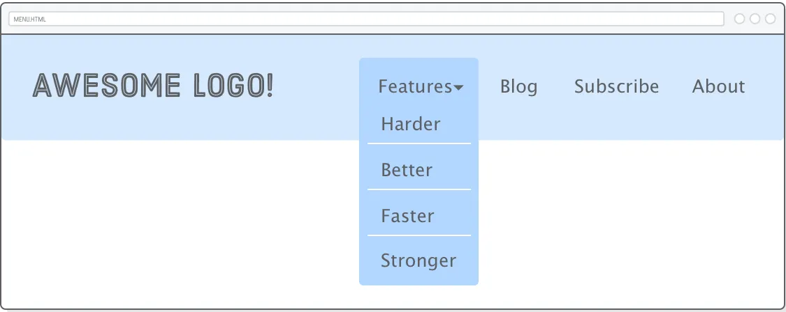

# Day 36 Advanced Positioning
# **`A. Advanced Positioning`**
# 1. Static vs Relative, Absolute, Fixed position
“Định vị tĩnh (Static positioning)” ám chỉ luồng bình thường (normal flow layout) của trang mà chúng ta đã làm việc cho đến thời điểm này. CSS Box Model, float và các lược đồ bố trí flexbox đều hoạt động trong luồng “tĩnh” này, nhưng đó không phải là lược đồ định vị duy nhất có trong CSS.

>

Ba loại định vị khác là “tương đối-relative”, “tuyệt đối-absolute” và “cố định-fixed”. Mỗi loại cho phép bạn định vị thủ công các phần tử bằng tọa độ cụ thể, trái ngược với các tùy chọn ngữ nghĩa (semantic options) hơn trong flexbox và float. Thay vì nói “Gắn hộp này vào giữa vùng container của nó”, định vị nâng cao cho phép bạn nói những điều như “Đặt hộp đó cách 20 pixel phía trên và 50 pixel bên phải từ gốc của phần tử cha”.

Phần lớn các elements trên trang web phải được bố trí theo luồng tĩnh của trang (normal flow layour). Các lược đồ định vị nâng cao sẽ phát huy tác dụng khi bạn muốn thực hiện những việc nâng cao hơn như điều chỉnh vị trí của một element cụ thể hoặc tạo hoạt ảnh cho một thành phần UI mà không làm hỏng các element xung quanh.

Chương này được chia thành hai phần. Chúng ta sẽ bắt đầu bằng định vị trí tương đối, tuyệt đối và cố định một cách riêng biệt, sau đó chúng ta sẽ áp dụng mọi thứ đã học vào một dropdown menu lạ mắt.

# 2. Thiết lập ban đầu để thực hành
Tạo 1 dự án mới gọi là advanced-positioning, trong đó tạo file schemes.html :
```html
<!DOCTYPE html>
<html>
  <head>
    <meta charset='UTF-8'/>
    <title>Positioning Is Easy!</title>
    <link href='styles.css' rel='stylesheet'/>
  </head>
  <body>

    <div class='container'>
      <div class='example relative'>
        <div class='item'></div>
        <div class='item item-relative'></div>
        <div class='item'></div>
      </div>
    </div>
    
    <div class='container'>
      <div class='example absolute'>
        <div class='item'></div>
        <div class='item item-absolute'></div>
        <div class='item'></div>
      </div>
    </div>

    <div class='container'>
      <div class='example fixed'>
        <div class='item'></div>
        <div class='item item-fixed'></div>
        <div class='item'></div>
      </div>
    </div>

  </body>
</html>
```
Chúng tôi có ba ví dụ để làm việc, tất cả đều có cùng cấu trúc HTML. Thay đổi hành vi định vị bên trong mỗi ví dụ sẽ có hiệu ứng khác nhau đáng kể.

>

Trang này dựa vào [một số hình ảnh](https://internetingishard.netlify.app/html-and-css/advanced-positioning/images-89bc45.zip) để làm cho ví dụ của chúng tôi rõ ràng hơn một chút. Giữ nguyên thư mục hình ảnh gốc khi giải nén các tệp vào dự án của bạn, như hiển thị ở trên. Đảm bảo tạo styles.css và điền vào đó các kiểu cần thiết:
```css
* {
  margin: 0;
  padding: 0;
  box-sizing: border-box;
}

body {
  height: 1200px;
}

.container {
  display: flex;
  justify-content: center;
}

.example {
  display: flex;
  justify-content: space-around;
  
  width: 800px;
  margin: 50px 0;
  background-color: #D6E9FE;
}

.item img {
  display: block;
}
```
Không có gì mới ở đây, chỉ là một số kỹ thuật flexbox quen thuộc để tạo lưới các mục. Điều kỳ lạ duy nhất là chiều cao height rõ ràng trên phần tử `<body>`, cho phép chúng ta cuộn lên và xuống trang để trình bày các hành vi định vị khác nhau.

>

# 3. Positioned Elements (Các phần tử được định vị)
Thuộc tính position của CSS cho phép bạn thay đổi sơ đồ định vị (positioning scheme) của một phần tử cụ thể. Giá trị mặc định của nó là static. Khi thuộc tính position của một phần tử không có giá trị static, nó được gọi là "positioned element". Phần tử được định vị là nội dung của toàn bộ chương này.

>


Có thể kết hợp (trộn lẫn) các lược đồ định vị khác nhau. Một lần nữa, hầu hết trang web của bạn phải được định vị tĩnh, nhưng thường thấy các phẩn tử được định vị tương đối và tuyệt đối bên trong các phần tử khác là một phần của normal flow của trang.

# 4. Relative Positioning (Định vị tương đối)
Static flow là cách mà các phần tử HTML hiển thị mặc định – theo thứ tự từ trên xuống dưới, trái sang phải.

Khi bạn dùng position: relative, phần tử vẫn chiếm đúng chỗ cũ trong Static flow, nhưng bạn có thể đẩy nó đi một chút bằng các thuộc tính như top, left, right, bottom.

Nó không phá vỡ cấu trúc xung quanh, các phần tử khác vẫn xem như nó nằm ở vị trí cũ.

Khi giao diện trông gần đúng nhưng chưa hoàn hảo, bạn có thể dùng position: relative để "nắn chỉnh nhẹ" các phần tử cho thẳng hàng, cân đối hơn mà không làm xáo trộn toàn bộ bố cục. Tức là nó dùng để tinh chỉnh vị trí, chứ không phải để bố trí lại toàn bộ layout.

>

Hãy biến phần tử .item-relative trong schemes.html thành một phần tử có vị trí tương đối. Thêm quy tắc sau vào styles.css:
```css
.item-relative {
  position: relative;
  top: 30px;
  left: 30px;
}
```
Dòng position: relative; làm cho nó trở thành một positioned element, và các thuộc tính top và left cho phép bạn xác định độ lệch của nó so với vị trí tĩnh của nó. Điều này giống như việc thiết lập tọa độ (x, y) cho phần tử.

>

Định vị tương đối hoạt động tương tự như margins, với một điểm khác biệt rất quan trọng: các phần tử xung quanh hoặc phần tử cha không bị ảnh hưởng bởi các giá trị top và left . Mọi thứ khác được hiển thị như thể .item-relative ở vị trí ban đầu của nó. Có thể hình dung là sau khi trình duyệt hoàn tất việc bố trí trang, thì nó mới dịch chuyển .item-relative một chút tương đối.

Các thuộc tính top, left, bottom, right đó từ cạnh tương ứng của hộp gốc.

>

Ví dụ, lệnh sau sẽ đẩy hộp theo hướng ngược lại:
```css
.item-relative {
  position: relative;
  bottom: 30px;
  right: 30px;
}
```
Lưu ý rằng các thuộc tính này chấp nhận các giá trị âm, nghĩa là có hai cách để chỉ định cùng một offset. Chúng ta cũng có thể dễ dàng sử dụng top: -30px; thay cho bottom: 30px; trong khai báo ở trên.

# 5. Absolute Positioning
“Định vị tuyệt đối” cũng giống như định vị tương đối, nhưng độ lệch là tương đối với toàn bộ cửa sổ trình duyệt thay vì vị trí ban đầu của phần tử. Vì không còn bất kỳ mối quan hệ nào với luồng tĩnh (static flow) của trang, hãy coi đây là cách thủ công nhất để bố trí một phần tử.

>

Hãy cùng xem xét bằng cách thêm quy tắc sau vào bảng định kiểu của chúng ta:
```css
.item-absolute {
  position: absolute;
  top: 10px;
  left: 10px;
}
```
Cấu trúc HTML của chúng tôi giống hệt như ví dụ trước, nhưng điều này sẽ dán hình ảnh màu tím ở góc trên bên trái của cửa sổ trình duyệt. Bạn cũng có thể thử đặt giá trị bottom hoặc right để có ý tưởng rõ ràng hơn về những gì đang diễn ra.

>

Hiệu ứng thú vị khác của absolute là nó loại bỏ hoàn toàn một phần tử khỏi luồng bình thường của trang. Điều này dễ thấy hơn với các phần tử căn trái, vì vậy hãy tạm thời thay đổi thuộc tính justify-content trong quy tắc .example của chúng ta:
```css
.example {
  display: flex;
  justify-content: flex-start;  /* Update this */
  /* ... */
}
```
Trong ví dụ định vị tương đối của chúng ta (hàng đầu tiên), vẫn còn một khoảng trống nơi phần tử được định vị từng ở, nhưng với định vị tuyệt đối, khoảng trống đó đã biến mất. Giống như thể .item-absolute thậm chí không tồn tại đối với phần tử cha và các phần tử xung quanh. Hãy chắc chắn thay đổi justify-content trở lại space-around trước khi tiếp tục.

>

Hành vi này không thực sự hữu ích trong hầu hết thời gian vì nó có nghĩa là mọi thứ trên trang của bạn cần phải được định vị tuyệt đối—nếu không, chúng ta sẽ có sự chồng chéo không thể đoán trước của các phần tử tĩnh (static elements) với các phần tử tuyệt đối (absolute elements). Vậy, tại sao tuyệt đối lại tồn tại?

# 6. (Relatively) Absolute Positioning (Định vị tuyệt đối 1 cách tương đối)
Vị trí tuyệt đối trở nên thực tế hơn nhiều khi nó liên quan đến một số phần tử khác trong luồng tĩnh của trang. May mắn thay, có một cách để thay đổi hệ tọa độ của một phần tử được định vị tuyệt đối.

>

Tọa độ của 1 phần tử tuyệt đối được tính khi so sánh tương đối với container gần nhất, mà container này phải là 1 phần tử được định vị - positioned element. Tức là flex container của phần tử tuyệt đối phải được định vị là relative, absolute hoặc fixed.

Trường hợp mà phần tử tuyệt đối không có flex container nào được định vị, thì tọa độ của nó sẽ được tính so với cửa sổ trình duyệt. Vì vậy trong ví dụ này, nếu thay đổi phần tử cha của .item-absolute thành định vị tương đối, thì nó sẽ xuất hiện ở góc trên bên trái của phần tử đó thay vì cửa sổ trình duyệt:
```css
.absolute {
  position: relative;
}
```
absolute được bố trí theo luồng bình thường của trang và chúng ta có thể di chuyển thủ công .item-absolute của mình đến bất cứ nơi nào chúng ta cần. Điều này thật tuyệt, vì nếu chúng ta muốn thay đổi luồng bình thường của container, chẳng hạn như đối với bố cục di động (mobile layout), bất kỳ phần tử nào được định vị tuyệt đối sẽ tự động di chuyển theo nó.

>

Lưu ý ở đây chúng ta không chỉ định bất kỳ tọa offset nào bên trong .absolute. Chúng ta sử dụng định vị tương đối với mục đích duy nhất là để phần tử tuyệt đối của chúng ta móc trở lại luồng bình thường của trang (mặc dù .absolute được khai báo là 1 phần tử được định vị tương đối, nhưng không có offset, nên nó vẫn nằm đúng vị trí, giống hệ như 1 phần tử tĩnh trong normal flow layer. Chỉ có tác dụng là nơi neo tọa độ cho phần tử tuyệt đối). Đây là cách chúng ta kết hợp định vị tuyệt đối (absolute positioning) với định vị tĩnh (static positioning) một cách an toàn.

# 7. Fixed Positioning
“Định vị cố định” có nhiều điểm chung với định vị tuyệt đối: rất thủ công, phần tử được loại bỏ khỏi luồng thông thường của trang và hệ thống tọa độ tương đối với toàn bộ cửa sổ trình duyệt. Sự khác biệt chính là các phần tử cố định không cuộn cùng với phần còn lại của trang.

>

Hãy tiếp tục và cập nhật ví dụ thứ ba:
```css
.item-fixed {
  position: fixed;
  bottom: 0;
  right: 0;
}
```
Thao tác này sẽ đặt hình ảnh màu đỏ ở góc dưới bên phải của màn hình. Hãy thử cuộn trang và bạn sẽ thấy rằng nó không di chuyển cùng với các phần tử còn lại trên trang, trong khi hình ảnh màu tím được định vị tuyệt đối thì có.

Tính năng này cho phép bạn tạo các thanh điều hướng luôn nằm trên màn hình, cũng như các biểu ngữ bật lên gây khó chịu không bao giờ biến mất.

# 8. Positioned Elements for Animation
Điều này hơi ngoài phạm vi, vì hướng dẫn này nói về HTML và CSS, không phải JavaScript. Tuy nhiên, hoạt ảnh (animation) là một trong những trường hợp sử dụng chính cho vị trí tương đối và tuyệt đối, vì vậy hãy xem qua một chút về cách hoạt ảnh một trong các phần tử của chúng ta.

Các advanced positioning schemes cho phép JavaScript di chuyển các phần tử xung quanh trong khi tránh mọi loại tương tác với các phần tử xung quanh nó. Ví dụ, hãy thử sao chép và dán nội dung sau vào schemes.html sau phần tử .container thứ ba. Phần tử `<script>` phải là phần tử cuối cùng bên trong `<body>`.
```javascript
<script>
    let left = 0;

    function frame() {
        let element = document.querySelector('.item-relative');
        left += 2;
        element.style.left = left + 'px';
        if (left >= 300) {
        clearInterval(id)
        }
    }

    let id = setInterval(frame, 10)
</script>
```
Mã JavaScript này tạo ra một hoạt ảnh đơn giản liên tục cập nhật thuộc tính left của .item-relative. Khi bạn tải lại trang, bạn sẽ thấy hình ảnh màu xanh nổi lên cạnh phải của vùng chứa.
>

Đây là một ví dụ khá cơ bản, Nếu bạn cố gắng đạt được hiệu ứng tương tự bằng cách thao tác các thuộc tính margin hoặc padding, bạn sẽ vô tình di chuyển các hộp được định vị tĩnh và/hoặc phần tử .example chứa nó.


# **`B. Thực hành tạo Navagation menu với các phần tử được định vị`**

## 1. Positioned Elements cho Menus
Phần này chúng ta sẽ áp dụng những kỹ thuật đã học để tạo 1 menu điều hướng với một dropdown cho 1 trong các liên kết của nó. Chúng ta sẽ xây dựng trang này từ đầu. [Kết quả mong muốn như trong link này](https://internetingishard.netlify.app/html-and-css/advanced-positioning/example/menu):

>

Fixed positioning sẽ cho phép chúng ta làm cho menu dính vào đầu trang và relative positioning sẽ cung cấp cho chúng ta một điểm neo cho dropdown được định vị tuyệt đối (absolutely positioned dropdown). Chúng ta cũng sẽ có cơ hội nói về các phương pháp làm hay nhất của navigation menu và xem một số ứng dụng thực tế của các lớp giả (pseudo-classes) trong CSS Selectors.

Để bắt đầu ta tạo file menu.html có tiêu đề và menu top-level đơn giản:
```html
<!DOCTYPE html>
<html lang='en'>
  <head>
    <meta charset='UTF-8'/>
    <title>Awesome!</title>
    <link href='menu.css' rel='stylesheet'/>
  </head>
  <body>

    <div class='header'>
      <div class='logo'></div>
      <ul class='menu'>
        <li class='dropdown'><span>Features ▾</span></li>
        <li><a href='#'>Blog</a></li>
        <li><a href='#'>Subscribe</a></li>
        <li><a href='#'>About</a></li>
      </ul>
    </div>

  </body>
</html>
```
Navigation menus gần như luôn được đánh dấu là `<ul>` list thay vì một nhóm các phần tử `<div>`. Các ngữ nghĩa này làm cho việc điều hướng trang web của bạn dễ tiếp cận hơn nhiều đối với các công cụ tìm kiếm. Ngoài ra, hãy lưu ý cách chúng ta chuẩn bị cho dropdown menu bằng cách thêm thuộc tính class vào `<li>` đầu tiên trong danh sách. `<span>` đó sẽ giúp phân biệt label với menu phụ mà nó hiển thị.

Tiếp theo, chúng ta cần một bảng định kiểu mới có tên là menu.css giúp cho .header của chúng ta trông giống một tiêu đề hơn một chút:
```css
* {
  margin: 0;
  padding: 0;
  box-sizing: border-box;
}

body {
  height: 1200px;
  font-size: 18px;
  font-family: sans-serif;
  color: #5D6063;
}

a:link,
a:visited {
  color: #5D6063;
  text-decoration: none;
}
a:hover {
  text-decoration: underline;
}

.header {
  position: fixed;
  display: flex;
  justify-content: space-between;
  
  width: 100%;
  padding: 50px;
  background: #D6E9FE;
}
```
Tất cả những điều này đều quen thuộc, nhưng hãy lưu ý fixed của .header, giúp giữ navigation menu của chúng ta ở trên cùng của bất kỳ nội dung nào sẽ xuất hiện trên trang.

>

## 2. Inline Menu Items
Mặc dù được đánh dấu là danh sách không có thứ tự (unordered lists), menu điều hướng cho hầu hết các trang web thực sự không giống như một list. Chúng ta có thể khắc phục điều này bằng cách tạo các Inline boxes cho các mục danh sách thay vì các Block Box thông qua thuộc tính display . Thêm nội dung sau vào menu.css:
```css
.menu {
  margin-top: 15px;
}

.menu > li {
  display: inline;
  margin-right: 50px;
}

.menu > li:last-of-type {
  margin-right: 0;
}
```
Chúng ta phải sử dụng các child selectors ở đây thay vì các descendant selectors vì chúng ta chỉ muốn chọn các phần tử `<li>` nằm trực tiếp bên trong.menu. Điều này sẽ trở nên quan trọng khi chúng ta thêm menu con, menu con này có các phần tử `<li>` riêng mà chúng ta không muốn định dạng theo quy tắc này. Đoạn mã này cũng thêm lề vào tất cả các mục danh sách, nhưng xóa nó khỏi `<li>` cuối cùng bằng cách sử dụng lớp giả (pseudo-class) là :last-of-type. Đây là một kỹ thuật khá phổ biến để tạo lề giữa các mục.

>

## 3. Submenus (menu phụ/con)
submenu sẽ trông giống hệt top-level menu, ngoại trừ toàn bộ sẽ được lồng vào bên trong một list item. Thay đổi phần tử .menu như sau, đảm bảo rằng toàn bộ .features-menu list được bao bọc trong `<li>` đầu tiên của phần tử .menu.
```html
<ul class='menu'>
  <li class='dropdown'><span>Features &#9662;</span>
    <ul class='features-menu'>           <!-- Start of submenu -->
      <li><a href='#'>Harder</a></li>
      <li><a href='#'>Better</a></li>
      <li><a href='#'>Faster</a></li>
      <li><a href='#'>Stronger</a></li>
    </ul>                                <!-- End of submenu -->
  </li>
  <li><a href='#'>Blog</a></li>          <!-- These are the same -->
  <li><a href='#'>Subscribe</a></li>
  <li><a href='#'>About</a></li>
</ul>
```
Điều này cung cấp nhiều thông tin quan trọng cho các công cụ tìm kiếm. Nó cho phép Google thấy rằng tất cả các mục mới này đều được liên kết với nhãn Features và chúng tạo thành một phần riêng biệt của trang web. Bạn nên luôn đánh dấu các navigation menus phức tạp bằng loại cấu trúc này.

Ngay bây giờ, chúng ta hãy làm cho submenu trông như chúng ta muốn:
```css
.features-menu {
  display: flex;
  flex-direction: column;
  background: #B2D6FF;
  border-radius: 5px;
  padding-top: 60px;
}

.features-menu li {
  list-style: none;
  border-bottom: 1px solid #FFF;

  padding: 0 40px 10px 20px;
  margin: 10px;
}

.features-menu li:last-of-type {
  border-bottom: none;
}
```
Bản thân submenu được style đúng, nhưng nó hiển thị sai vị trí và làm hỏng nghiêm trọng các items còn lại trong top-level menu. Điều này có thể dự đoán được vì nó vẫn được định vị tĩnh (statically positioned), nghĩa là nó vẫn tương tác với phần tử cha và các phần tử xung quanh.

>

Lúc này chúng ta cần đến các kỹ thuật định vị các phần tử.

## 4. (Relatively) Absolute Submenus
Chúng ta muốn các items của top-level menu hiển thị giống như trước khi chúng tôi thêm submenu, như thể submenu thậm chí không có ở đó. Nói cách khác là submenu có ở đó mà không làm ảnh hưởng gì đó các item khác trong top-level menu. Đó chính xác là hành vi của các phần tử được định vị tuyệt đối. Thêm một vài dòng vào quy tắc .features-menu:
```css
.features-menu {
  display: flex;
  flex-direction: column;
  background: #B2D6FF;
  border-radius: 5px;
  padding-top: 60px;

  position: absolute;      /* Add these */
  top: -25px;
  left: -30px;
}
```
Điều mà chúng ta muốn là submenu được định vị tuyệt đối không phải vởi cửa sổ browser, mà là một cách tương đối với Features label. Để làm điều này ta cần `<li class='dropdown'>` trở thành 1 phần tử được định vị:
```css
.dropdown {
  position: relative;
}
```
Menu phụ của chúng ta nằm đúng vị trí, nhưng giờ nó che mất Features label.

>

## 5. Z-Index
Chúng ta chưa bao giờ phải giải quyết các vấn đề về "độ sâu" trước đây. Cho đến bây giờ, tất cả các phần tử HTML được hiển thị ở above hoặc below theo cách trực quan. Nhưng vì chúng ta đang thực hiện các công việc nâng cao, nên việc dựa vào trình duyệt để xác định các phần tử nào xuất hiện phía trên top các thành phần khác sẽ không hiệu quả.

Thuộc tính z-index cho phép bạn kiểm soát độ sâu của các phần tử trên trang. Nếu bạn nghĩ màn hình của mình là không gian 3D, các giá trị z-index âm sẽ đi sâu hơn vào trang và các giá trị z-index dương sẽ đi ra khỏi trang.

>

Nói cách khác, phần tử .features-menu cần có z-index thấp hơn Features label. Giá trị z-index mặc định là 0, vì vậy hãy làm cho cả hai đều cao hơn thế. Chúng ta đã gói nhãn Features một cách tiện lợi trong `<span>`, điều này cho phép chúng ta định kiểu cho nó thông qua chile selector:
```css
.dropdown > span {
  z-index: 2;
  position: relative;  /* This is important! */
  cursor: pointer;
}

.features-menu {
  /* ... */
  z-index: 1;
}
```
Features label bây giờ sẽ xuất hiện ở lớp trên của submenu. Hãy lưu ý dòng position: relative;. Nó là bắt buộc vì thuộc tính z-index chỉ có ý nghĩa (hiệu lực) với các phần tử được định vị. Điều này dễ quên, vì vậy hãy ghi nhớ để lần sau khi bạn gặp sự cố về độ sâu và các quy tắc CSS của bạn dường như không có tác dụng gì.

>

Chúng tôi đã đưa vào một ví dụ về thuộc tính con trỏ cursor để làm cho nó trông giống như một liên kết khi người dùng di chuột qua nhãn Features . Bạn có thể đọc thêm về nó tại [Mozilla Developer Network](https://developer.mozilla.org/en-US/docs/Web/CSS/cursor).

## 6. Pseudo-Classes for Dropdown Menus
Nhiệm vụ cuối cùng của chúng ta là ẩn Dropdown menu cho đến khi người dùng di chuột qua. Ta sẽ sử dụng :hover pseudo-class. Chúng ta có thể sử dụng nó để biến submenu thành một dropdown tương tác.

Đầu tiên, chúng ta cần thay đổi quy tắc .features-menu hiện tại để chỉ hiển thị submenu khi người dùng di chuột qua nó bằng cách thêm :hover descendant selector phía trước:
```css
.dropdown:hover .features-menu {    /* This used to be `.features-menu` */
  display: flex;                    /* Leave everything else alone */
  flex-direction: column;
  background: #B2D6FF;
  /* ... */
}
```
Sau đó, chúng ta cần ẩn submenu ban đầu bằng cách sử dụng thuộc tính display. Thêm một quy tắc mới vào menu.css:
```css
.features-menu {                    /* Add this as a new rule */
  display: none;
}
```
Thiết lập display thành none làm cho một phần tử biến mất hoàn toàn. Bằng cách ghi đè giá trị đó bằng flex trong quy tắc :hover, chúng ta thực sự đang yêu cầu trình duyệt hiển thị lại .features-menu. Sự kết hợp thông minh này giữa các bộ chọn con cháu (descendant selectors) và các lớp giả (pseudo-classes) cho phép chúng ta ẩn hoặc hiển thị một phần tử theo điều kiện.

## 7. Review lại bài này
- Relative positioning: Định vị tương đối là để điều chỉnh vị trí của một phần tử mà không ảnh hưởng đến các hộp xung quanh.

- Absolute positioning: Định vị tuyệt đối lấy các phần tử ra khỏi luồng tĩnh của trang và đặt chúng tương đối với cửa sổ trình duyệt,

- Relatively absolute positioning: Trong khi định vị tuyệt đối một cách tương đối cho phép chúng ta kết nối trở lại luồng tĩnh của trang.

- fixed positioning: định vị cố định cho phép chúng ta tạo các phần tử không cuộn theo phần còn lại của trang.

> 

Chúng ta đã sử dụng các kỹ thuật định vị này để tạo ra một menu điều hướng khá tinh vi. Nếu bạn cảm thấy phức tạp, thì đó là vì nó thực sự phức tạp, chứ không phải do bạn kém. Nhưng đừng lo lắng, bạn không nên cảm thấy áp lực phải ghi nhớ HTML và CSS đằng sau menu này. Mục tiêu của bạn là có khả năng xem lại ví dụ này sau ba tháng nữa và hiểu tất cả các khai báo position: relative; và position: absolute đó là gì.

**Không cần học thuộc.**

- Chỉ cần hiểu nguyên lý, để sau này khi xem lại, bạn biết mỗi dòng CSS đó đang làm gì.

**Vẫn còn một vấn đề lớn với menu này:**
- Nó không được xây dựng cho các thiết bị di động. Điện thoại thông minh và máy tính bảng không có cách nào để di chuột qua. Điều này đòi hỏi một chút phép thuật JavaScript (hoặc một số CSS thực sự nâng cao), vì vậy chúng ta sẽ thực hiện trong 1 hướng dẫn khác.

- Và bố cục này không hiển thị tốt khi trình duyệt hẹp hơn 960 pixel. Chúng ta sẽ có thể giải quyết vấn đề này bằng một số thiết kế đáp ứng (responsive design) trong các bài tiếp theo.

