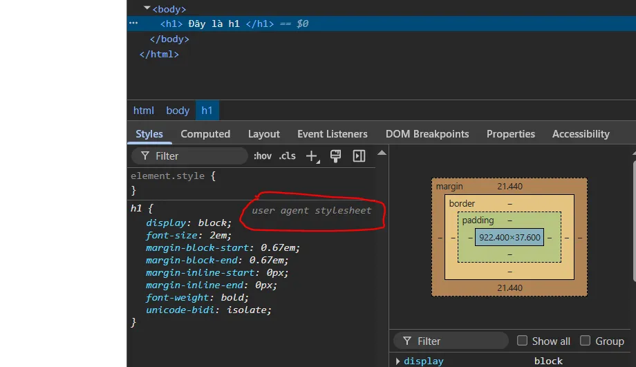

# 37/365: CSS User-agent stylesheet
> User-agent stylesheet - đáy của tháp ưu tiên CSS

Hiểu được user-agent stylesheet sẽ giúp bạn nắm rõ cách trình duyệt xử lý CSS ngay cả khi bạn chưa viết dòng CSS nào.

## User-agent stylesheet là gì?
Là bộ quy tắc CSS mặc định do trình duyệt (như Chrome, Firefox, Safari...) tự động áp dụng cho các phần tử HTML, ngay cả khi bạn không khai báo CSS nào cả.

Bạn viết HTML như sau, không có CSS nào cả:
```html
<h1>Tiêu đề</h1>
<p>Đoạn văn</p>
<ul>
  <li>Item 1</li>
</ul>
```
Trình duyệt vẫn hiển thị:

- h1 to hơn chữ thường
- p có khoảng cách dưới

- ul có bullet

- li được thụt vào

Tất cả Là nhờ vào user-agent stylesheet của trình duyệt.

## Cách trình duyệt hoạt động:
Trước tiên, trình duyệt áp dụng user-agent stylesheet cho tất cả thẻ HTML.

Sau đó, nó áp dụng:

1. CSS bạn viết

1. CSS từ framework (Tailwind, Bootstrap...)

1. Inline styles

1. Và các nguyên tắc ưu tiên CSS (specificity)

Ví dụ khi bạn tạo một `<h1>` :
```html
<body>
    <h1> Đây là h1 </h1>
</body>
```
Trên Chrome, bạn có thể thấy đoạn CSS mặc định như sau (khi mở DevTools → tab “Styles”):
```css
h1 {
  display: block;
  font-size: 2em;
  margin-block-start: 0.67em;
  margin-block-end: 0.67em;
  font-weight: bold;
}
```
>
⟶ Những cái này không đến từ bạn — mà là từ user-agent stylesheet.

`User-agent stylesheet` là Bộ CSS mặc định do trình duyệt cung cấp cho các thẻ HTML.

Nó Là lớp nền CSS mặc định, đứng ở đáy của tháp ưu tiên CSS.