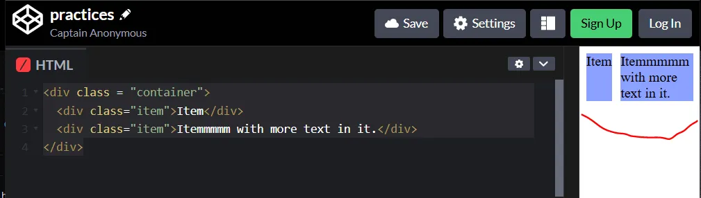

#  Day 38: Growing và Shrinking
Trong bài trước chúng ta đã sử dụng display: flex và flex: 1. Hãy tìm hiểu sâu hơn để xem điều gì thực sự xảy ra khi đặt flex: 1 trên các flex items.

# 1. flex shorthand (Cú pháp dạng ngắn gọn/viết tắt)
Khai báo flex thực chất là viết tắt của 3 thuộc tính mà bạn có thể thiết lập trên một mục flex. Các thuộc tính này ảnh hưởng đến cách các flex item tự định kích thước trong container chứa chúng.

Thuộc tính viết tắt là thuộc tính CSS cho phép bạn đặt giá trị của nhiều thuộc tính CSS khác cùng lúc. Sử dụng thuộc tính viết tắt, bạn có thể viết các bảng định kiểu (stylesheets) ngắn gọn hơn (và thường dễ đọc hơn), tiết kiệm thời gian và năng lượng.

Xem thêm tại: [Shorthand properties on MDN](https://developer.mozilla.org/en-US/docs/Web/CSS/Shorthand_properties)

>

Trong ví dụ trên flex: 1 bằng với 3 thuộc tính flex-grow: 1, flex-shrink: 1, flex-basis: 0.

Chúng ta sẽ thường xuyên nhìn thấy lệnh flex được định nghĩa chỉ với 1 giá trị. Khi bạn viết flex: 1, thì thực chất nó là viết tắt của flex: 1 1 0

## 1. Flex-grow
flex-grow — là cách các phần tử trong Flexbox mở rộng chiếm không gian tương đối với nhau, dựa trên giá trị số bạn gán cho thuộc tính flex.

flex-grow nhận một số (number) làm giá trị, gọi là “growth factor” – yếu tố tăng trưởng:
```css
div {
  flex: 1;
}
```
Thì tất cả các div sẽ tăng trưởng với tỷ lệ như nhau, chia đều phần không gian còn lại trong container. ⟶ Kết quả: mọi div có cùng kích thước.

Còn nếu viết:
```css
.div1 { flex: 1; }
.div2 { flex: 1; }
.div3 { flex: 2; }
```
Thì: div1 và div2 chiếm 1 phần, div3 chiếm 2 phần, ⟶ div3 sẽ rộng gấp đôi div1 và div2.

Hãy thử với ví dụ code sau:
```html
<div class="flex-container">
  <div class="one"></div>
  <div class="two"></div>
  <div class="three"></div>
</div>
```
```css
.flex-container {
  display: flex;
}

/* this selector selects all divs inside of .flex-container */
.flex-container div {
  background: peachpuff;
  border: 4px solid brown;
  height: 100px;
  flex: 1 1 0%;
}

/* only div.two is selected here */
.flex-container .two {
  flex: 2 1 0%;
}
```
## 2. Flex-shrink
Giống như flex-grow, nhưng thay vì mở rộng, flex-shrink kiểm soát việc co lại của các phần tử khi container quá nhỏ. Nó được khai báo hệ số “shrink factor” gọi là “hệ số co lại”.

flex-shrink hoạt động chỉ khi tổng kích thước của các phần tử vượt quá kích thước của flex-container. Ví dụ:
```css
.flex-item {
  width: 100px;
}
```
- Có 3 .flex-item → tổng 300px.

- Nhưng .flex-container chỉ rộng 250px ⟶ các item phải co lại để vừa khít.

Khi các phần tử có flex-shrink: 1 thì tất cả phần tử sẽ co lại đều nhau. Hệ số thu nhỏ mặc định là flex-shrink: 1, nghĩa là tất cả các mục sẽ thu nhỏ đều. Còn nếu bạn muốn một phần tử nào đó không bị co lại thì gán flex-shrink: 0, khi đó phần tử này sẽ không bị co lại, giữ nguyên kích thước.

Nếu muốn phần tử co lại với tốc độ nhanh hơn thì gán hệ số lớn hơn flex-shrink: 2.

Hãy thử nghiệm với ví dụ sau:
```html
<div class="flex-container">
  <div class="one"></div>
  <div class="two"></div>
  <div class="three"></div>
</div
```
```css
.flex-container {
  display: flex;
}

/* this selector selects all divs inside of .flex-container */
.flex-container div {
  background: peachpuff;
  border: 4px solid brown;
  height: 100px;
  width: 250px;
  flex: 1 1 auto;
}

.flex-container .two {
  flex-shrink: 0;
}
```
Ở ví dụ trên flex-basis đã được thay đổi vì những lý do sẽ được giải thích ngay sau đây. Nếu bạn thu nhỏ cửa sổ trình duyệt, bạn sẽ thấy rằng .two không bao giờ nhỏ hơn chiều rộng đã cho là 250px, mặc dù quy tắc flex-grow sẽ chỉ định rằng mỗi phần tử phải có kích thước bằng nhau.

**Điểm quan trọng:**  
Khi bạn dùng flex-grow hoặc flex-shrink, các phần tử không còn "tôn trọng" thuộc tính width nữa — tức là chúng sẽ nở ra hoặc co lại theo không gian container, bất kể bạn đã đặt width: 250px hay bao nhiêu. Đây không phải là lỗi, mà là hành vi bình thường của Flexbox.

## 3. Flex-basis
flex-basis xác định kích thước ban đầu của một phần tử Flex trước khi bất kỳ việc co lại (shrink) hay nở ra (grow) nào diễn ra. Vì vậy bất kỳ loại flex-growing hay flex-shrinking nào cũng bắt đầu từ kích thước cơ sở đó. Mặc định của flex-basis: 0%.

Lý do ở ví dụ trên chúng ta phải thay đổi thành flex-basis: auto bởi vì khi nếu để bằng 0% thì các items sẽ bỏ qua chiều rộng được khai báo của chúng ban đầu, và mọi thứ sẽ được co lại (shrink) bằng nhau, khi đó flex-shrink: 0 của item số 2 sẽ không có tác dụng nữa.

Ví dụ nếu khai báo:
```css
.item {
  flex-basis: 100px;
  flex-grow: 1;
  flex-shrink: 1;
}
```
Tức là phần tử bắt đầu với kích thước 100px. Sau đó, nếu còn không gian, nó có thể nở ra (do flex-grow: 1), Nếu thiếu không gian, nó sẽ co lại (do flex-shrink: 1).

- Nếu bạn viết flex-basis: 0, thì trình duyệt bỏ qua thuộc tính width.

- Nếu bạn viết flex-basis: auto, thì trình duyệt sẽ ưu tiên lấy giá trị width đã được khai báo (nếu có).

**Mặc dù mặc định của flex-basic =auto.**
- Nhưng khi khai báo: flex : 1 thì lại bằng flex : 1 1 0

- Còn nếu khai báo flex: auto thì lại bằng flex: 1 1 auto

Tức là khi ta khai báo flex : 1 thì flex-basic sẽ là 0 chứ không phải là giá mặc định của nó là auto. (auto tức là item sẽ sử dụng kích thước ban đầu của thuộc tính width được khai báo)

**min-content, min-width / min-height**
- Theo mặc định, các phần tử trong flex sẽ không co nhỏ hơn kích thước tối thiểu cần thiết để hiển thị nội dung (min-content). Nếu bạn muốn chúng co nhỏ hơn mức đó (ví dụ để nội dung bị cắt đi hoặc bị tràn), thì bạn cần đặt min-width: 0; hoặc min-height: 0; cho phần tử đó. Ví dụ:
```html
<div class = "container">
  <div class="item">Item</div>
  <div class="item">Itemmmmm with more text in it.</div>
</div>
.container {
  display: flex;
  gap: 10px;
}
```
```css
.item {
/*   min-width: 10px; */
  background-color: #8ca0ff;
  margin-bottom: 1em;
}
```
Khi này ta sẽ thấy min-width của các item chính là mặc định bằng min-content. Với phần item đầu tiên là chiều rộng của Item, với phần tử item thứ 2 là chiều rộng của Itemmmmm.
>

Khi ta sử dụng min-width: 10px; thì ta sẽ thấy các item (màu nền màu xanh) co lại còn nhỏ hơn phần nội dung tối thiếu.
>

## 4. flex Values (Các giá trị của thuộc tính flex)
Thuộc tính flex có thể nhân 1, 2 hoặc 3 giá trị.
```css
flex: none; /* 0 0 auto */
```
- Không phát triển, không co lại.
- flex-grow: 0; flex-shrink: 0; flex-basis: auto;

- Phần tử giữ đúng kích thước nội dung/được khai báo, không thay đổi theo không gian container.
```css
flex: 2; /* 2 1 0% */
```
- flex-grow: 2; (một số dương)

- flex-shrink: 1;

- flex-basis: 0%

- Tăng gấp đôi phần tử có flex-grow: 1, co lại bình thường, bắt đầu từ kích thước 0%.
```css
flex: auto; /* 1 1 auto */
```
- flex-grow: 1; flex-shrink: 1; flex-basis: auto;

- Phần tử co dãn và co lại được, kích thước ban đầu tự động theo nội dung.
```css
flex: 10em;
flex: 30%;
flex: min-content;
```
- flex-grow: 1; flex-shrink: 1; flex-basis: 10em / 30% / min-content

- Co dãn/co lại được, kích thước cơ sở do bạn đặt.
```css
flex: 1 30px; /* 1 1 30px */
```
- flex-grow: 1; flex-shrink: 1; flex-basis: 30px
```css
flex: 2 2; /* 2 2 0% */
```
- flex-grow: 2; flex-shrink: 2; flex-basis: 0%

- Co dãn và co lại gấp đôi bình thường, bắt đầu từ 0%.
```css
flex: 2 2 10%;
```
- flex-grow: 2; flex-shrink: 2; flex-basis: 10%

- Kích thước cơ bản là 10%, nhưng có thể dãn và co lại gấp đôi.
```css
flex: inherit;
```
Có nghĩa là: “Hãy kế thừa giá trị flex từ phần tử cha của tôi.” Bạn phải khai báo inherit tường minh nếu muốn kế thừa. Lưu ý rằng Chỉ kế thừa được nếu phần tử cha cũng có thuộc tính flex. Nếu Phần tử cha KHÔNG có flex thì Không kế thừa được → flex không có tác dụng. Còn ví dụ Phần tử cha có flex: 1 1 auto; Phần tử con sẽ có flex: 1 1 auto;
```css
flex: initial;
```
Quay về mặc định ban đầu (0 1 auto). Flex Item không mở rộng nhưng có thể co lại. Item được định cỡ theo thuộc tính width hoặc height của nó, tùy thuộc vào flex-direction. Nếu có không gian khả dụng âm (tức là kích thước container hẹp hơn tổng kích thước các item), mục sẽ co lại đến kích thước tối thiểu để vừa với vùng chứa nhưng sẽ không giãn ra để để vừa với container trong trường hợp thừa không gian.

initial là một giá trị toàn cục trong CSS, áp dụng được cho mọi thuộc tính, chứ không phải chỉ có mỗi flex. Các giá trị mặc định của các thuộc tính được quy định trong đặc tả CSS (CSS specification).
```css
flex: revert;
```
Quay về giá trị mặc định trong stylesheet gốc của trình duyệt. (Xem bài user-agent stylesheet).
```css
flex: revert-layer;
```
Tương tự revert, nhưng áp dụng theo tầng CSS.
```css
flex: unset;
```
flex: unset; là một giá trị toàn cục trong CSS, có nghĩa:
- Nếu thuộc tính có thể kế thừa thì sẽ kế thừa từ cha
- Nếu không thể kế thừa thì sẽ reset về giá trị mặc định (initial)

**`Lưu ý về giá trị thứ 3 là flex-basis :`**

- flex-basis: 30%: bắt đầu với 30% chiều rộng container cha

- flex-basis: min-content: chiều rộng tối thiểu đủ để hiển thị nội dung mà không bị gãy dòng (nếu là text), hoặc nhỏ nhất có thể hiển thị toàn bộ nội dung. Rất hữu ích trong bố cục linh hoạt theo nội dung. (Bắt đầu với chiều rộng tối thiểu cần thiết)

- flex-basic: 10em: Bắt đầu với 10em (có thể dùng các loại đơn vị khác, như cm, in, px)

- flex-basis: auto nghĩa là Kích thước cơ sở của phần tử sẽ được tính theo width hoặc height đã khai báo (tùy theo hướng của flex container). Nếu không có width /height, nó sẽ dùng kích thước nội dung (content size).


## 5. Thực tế sư dụng
Trong thực tế, bạn có thể sẽ không sử dụng các giá trị phức tạp cho flex-grow, flex-shrink hoặc flex-basis. Nhìn chung, bạn có nhiều khả năng sử dụng các khai báo như flex: 1; để làm cho các div phát triển đều và flex-shrink: 0 để giữ cho một số div nhất định không bị thu hẹp.

Mặc dù bạn có thể thiết lập bố cục theo cách cầu kỳ, trong đó 1 số column liên quan đến nhau theo tỷ lệ cụ thể nào đó, tức là bạn có thể sử dụng các giá trị khác nhau. Nhưng những giá trị này tương đối hiếm.

**Trong hầu hết các trường hợp sử dụng, lập trình viên nên thiết lập thuộc tính flex bằng một trong các giá trị sau...**

✅flex: auto ~ flex: 1 1 auto;
- Nghĩa là: phần tử có thể co lại (shrink), có thể giãn ra (grow) và kích thước ban đầu dựa theo width hoặc content.

- Phù hợp khi bạn muốn phần tử linh hoạt cả co và giãn, chia đều không gian với các phần tử khác.

✅flex: initial ~ flex: 0 1 auto;
- Nghĩa là: phần tử không giãn ra (grow = 0), có thể co lại (shrink = 1), và kích thước ban đầu dựa vào nội dung hoặc width.

- Dùng khi bạn không muốn phần tử tự mở rộng ra thêm chỗ khi còn không gian trống.

✅ flex: none ~ flex: 0 0 auto;
- Nghĩa là: không co, không giãn → giữ nguyên kích thước ban đầu.

- Phù hợp khi bạn muốn giữ nguyên kích thước cố định, bất chấp container rộng hay hẹp.

✅ flex: a ~ flex: a 1 0%
- a là 1 số dương không có đơn vị, ví dụ 1, 2, 3… (nếu a mà có đơn vị ví dụ 2cm, 10px thì flex : a sẽ tương đương flex-basis: a)

- Nghĩa là: phần tử có thể co và giãn, với tỉ lệ giãn theo số được chỉ định.

- **`Ví dụ:`**

    - flex: 1 tương đương flex: 1 1 0% → tỉ lệ 1

    - flex: 2 tương đương flex: 2 1 0% → tỉ lệ 2 (gấp đôi phần tử có flex: 1)

    - Dùng để chia không gian theo tỷ lệ giữa các phần tử.

Ví dụ:
```html

<div class="flex-container">
  <div class="item auto">auto</div>
  <div class="item auto">auto</div>
  <div class="item auto">auto</div>
</div>

<div class="flex-container">
  <div class="item auto">auto</div>
  <div class="item initial">initial</div>
  <div class="item initial">initial</div>
</div>

<div class="flex-container">
  <div class="item auto">auto</div>
  <div class="item auto">auto</div>
  <div class="item none">none</div>
</div>

<div class="flex-container">
  <div class="item initial">initial</div>
  <div class="item none">none</div>
  <div class="item none">none</div>
</div>

<div class="flex-container">
  <div class="item four">4</div>
  <div class="item two">2</div>
  <div class="item one">1</div>
</div>
```
```css

* {
  box-sizing: border-box;
}

.flex-container {
  background-color: #f4f7f8;
  resize: horizontal;
  overflow: hidden;
  display: flex;
  margin: 1em;
}

.item {
  margin: 1em;
  padding: 0.5em;
  width: 110px;
  min-width: 0;
  background-color: #1b5385;
  color: white;
  font-family: monospace;
  font-size: 13px;
}

.initial {
  flex: initial;
}

.auto {
  flex: auto;
}

.none {
  flex: none;
}

.four {
  flex: 4;
}

.two {
  flex: 2;
}

.one {
  flex: 1;
}
```
Kết quả:
>

## Tài liệu phải đọc khi ĐÓNG CỌC LẦN 2
1. [Video exploring how flexbox works and why.](https://www.youtube.com/watch?v=u044iM9xsWU&t=1s)

> ⭐ **Theo dõi [kênh Threads](https://www.threads.com/@kaitaku.88) để đọc bài mới mỗi ngày!** ⭐  

**[<== Bài Trước  ](link)          |[  Trang Chủ  ](./README.md)|           [  Bài Sau ==>](link)**

