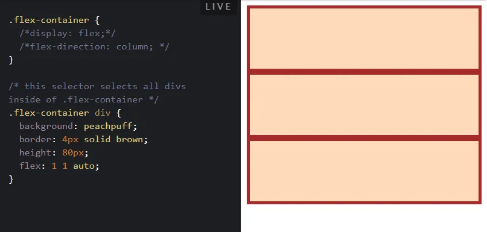
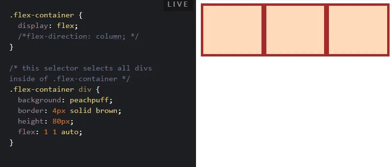
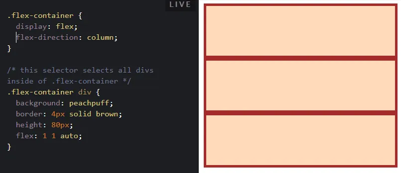
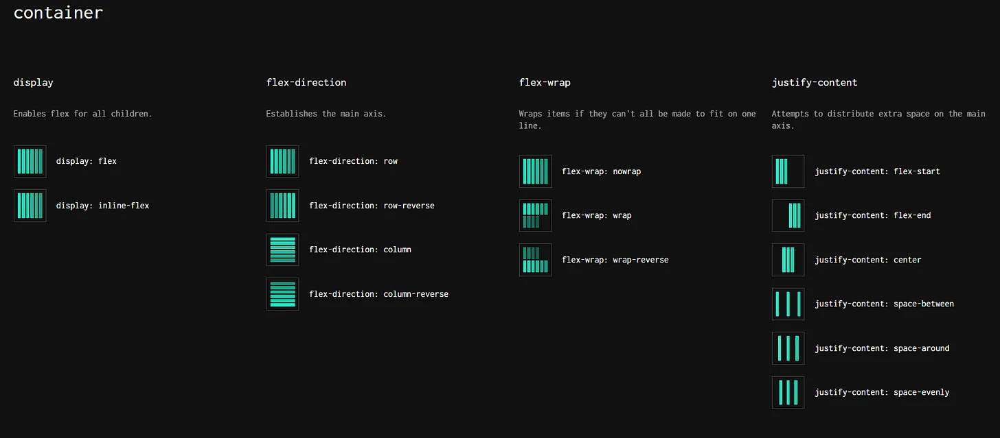

# Day 39: Flexbox  - Axes

Chúng ta đã học về hướng của flexbox trong [bài ngày 35](./Day35-Display-flex.md).
 
**Trong bài này chúng ta sẽ học sâu hơn về nó.**

Điều khó hiểu nhất về flexbox là nó có thể hoạt động theo chiều ngang hoặc chiều dọc và một số quy tắc thay đổi một chút tùy thuộc vào hướng bạn đang làm việc. Hướng mặc định cho một flex container là chiều ngang hoặc row, nhưng bạn có thể thay đổi hướng thành chiều dọc hoặc column. Hướng có thể được chỉ định trong CSS như sau:
```css
.flex-container {
  flex-direction: column;
}
```
Bất kể bạn đang sử dụng hướng nào, bạn cần nghĩ rằng flex-container của mình có 2 trục: trục chính (main axis) và trục chéo (cross axis). Hướng của các trục này thay đổi khi flex-direction thay đổi. Trong hầu hết các trường hợp, flex-direction: row đặt trục chính theo chiều ngang (từ trái sang phải) và column đặt trục chính theo chiều dọc (từ trên xuống dưới).

Xem ví dụ sau:
```html
<div class="flex-container">
  <div class="one"></div>
  <div class="two"></div>
  <div class="three"></div>
</div>
```
Mặc định ban đầu khi chưa sử dụng Flexbox thì 3 phần tử `<div>` đều là dạng Block box, nên sẽ chiếm 3 hàng riêng, và xếp chồng lên nhau:
>

Khi sử dụng display: flex. Ta thấy 3 `<div>` đã xếp theo 1 hàng ngang. Bởi vì mặc định là flex-direction: row:
>

Bây giờ nếu khai báo flex-direction: column thì các `<div>` lại được sắp xếp theo chiều dọc.

>

Một điều cần lưu ý là trong ví dụ này, flex-direction: column sẽ không hoạt động như mong đợi nếu chúng ta sử dụng lệnh viết tắt flex: 1. Tương đương với flex: 1 1 0%; Bạn có thể tìm ra lý do tại sao nó không hoạt động nếu sử dụng flex: 1 không? Các div sẽ thu gọn, mặc dù chúng rõ ràng có chiều cao được xác định là 80px ở đó.

Chúng ta sẽ giải thích như sau: Khi flex: 1. Tương đương với flex: 1 1 0%;nghĩa là các flex-grow và flex-shrink sẽ bắt đầu tính từ 0. Và giãn ra/co vào để vừa với flex-container. Nhưng theo mặc định các div trống sẽ có chiều cao bằng 0, do đó các flex-item của chúng không cần phải co/giãn để có bất kỳ chiều cao nào.

**Có 2 cách để các flex-item có chiều cao (giãn ra) là:**

- Khai báo chiều cao cho flex-container của nó.

- Sử dụng flex: 1 1 auto; và khai báo chiều cao của chính các flex-item, khi đó các flex-grow và flex-shrink sẽ bắt đầu với chiều cao này.

Một chi tiết khác cần lưu ý: khi chúng ta thay đổi flex-direction thành column, flex-basis tham chiếu đến height thay vì width. Xét theo ngữ cảnh thì điều này có thể hiển nhiên, nhưng bạn cần lưu ý. Nguyên nhân bởi vì các phần tử đều đặt trong `<body>`. Mặc định thì chiều rộng của body là chiều rộng của trình duyệt. Nhưng không rõ chiều cao là bao nhiêu. Vì vậy:

- Hành vi mặc định khi flex-direction: row là mọi thứ sẽ được sắp xếp theo chiều ngang. Và điều này thường hoạt động tốt mà không cần thay đổi các chi tiết khác trong CSS, bởi vì theo mặc định các block element sẽ giãn ra để rộng bằng với phần tử cha của nó.

- Nhưng khi flex-direction: column mọi thứ được xếp theo chiều dọc sẽ phức tạp hơn, vì các block element mặc định sẽ có chiều cao bằng với content của chúng, chứ không phải cao bằng phần tử cha.

Có những trường hợp mà hành vi của flex-direction có thể thay đổi nếu bạn sử dụng ngôn ngữ được viết từ trên xuống dưới hoặc từ phải sang trái, nhưng bạn không nên lo lắng về điều đó cho đến khi bạn bắt đầu tạo một trang web bằng tiếng Ả Rập hoặc tiếng Do Thái.

**Tham khảo bảng flexbox cheatsheet sau (bấm vào ảnh):**
>[](https://flexbox.malven.co/)

