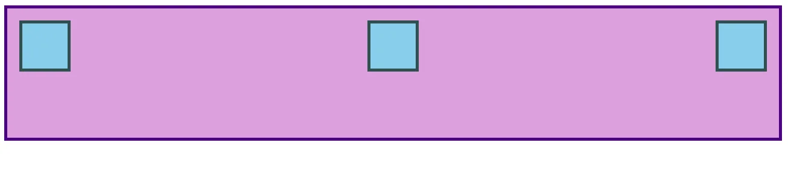

# Day 40: Flexbox - Alignment (căn chỉnh), thực hành 7 bài tập CSS

## **`1. Alignment`**
Hãy xem ví dụ sau: ([Mở Link này để thao tác](https://codepen.io/TheOdinProjectExamples/pen/MWoyBzR?editors=1100))
```html
<div class="container">
  <div class="item"></div>
  <div class="item"></div>
  <div class="item"></div>
</div>
```
```css
.container {
  height: 140px;
  padding: 16px;
  background: plum;
  border: 4px solid indigo;
  display: flex;
}

.item {
  width: 60px;
  height: 60px;
  border: 4px solid darkslategray;
  background: skyblue;
}
```
>  

Nếu sử dụng flex: 1 trong .item thì các mục sẽ giãn đều nhau điền đầy không gian.
>  

Bây giờ nếu bạn không muốn các item giãn ra mà muốn chúng giữ nguyên kích thước width, height nhưng được phân bố khác nhau trong container thì làm thế nào?

Hãy gỡ flex: 1 từ.item và thêm justify-content: space-between vào .container. Kết quả sẽ như thế này:

>


justify-content sẽ căn chỉnh các item theo main axis. Có vài giá trị có thể dùng cho thuộc tính này. Ví dụ nếu sử dụng justify-content: center; thì các item sẽ được căn chỉnh vào giữa của flex-container:

>

Để thay đổi vị trí (căn chỉnh) các item theo trục chéo (cross axis) thì dùng align-items. Thử dùng align-items: center; lúc này các items sẽ được căn vào chính giữa của .container:
>


Mặc định thì main axis là trục ngang và cross axis là trục dọc. Cho nên mặc định thì justify-content sẽ căn chỉnh item theo trục ngang và align-items sẽ căn chỉnh item theo trục dọc. Tuy nhiên hành vì của 2 thuộc tính này phụ thuộc vào flex-direction của container. Cho nên khi flex-direction thay đổi thành column thì justify-content sẽ căn chỉnh item theo trục dọc và align-items sẽ căn chỉnh item theo trục ngang.

## **`2. Gap`**
Một tính năng rất hữu ích của flex là thuộc tính gap. Thiết lập gap trên một flex container sẽ thêm một khoảng cách được chỉ định giữa các flex item, tương tự như việc thêm margin vào chính các mục đó. gap là một thuộc tính mới nên nó chưa xuất hiện trong nhiều tài nguyên, nhưng nó hoạt động đáng tin cậy trong tất cả các trình duyệt hiện đại, do đó nó an toàn để sử dụng và rất tiện dụng! Thêm gap: 8px vào ví dụ ở trên ở trên sẽ tạo ra kết quả bên dưới.
>

## Tài liệu phải đọc khi ĐÓNG CỌC LẦN 2

- [Interactive Guide to Flexbox (Nền tảng ở đây là quan trọng)](https://www.joshwcomeau.com/css/interactive-guide-to-flexbox/)

- [Typical use cases of Flexbox (Có một số tài tập tương tác ở đây)](https://developer.mozilla.org/en-US/docs/Web/CSS/CSS_Flexible_Box_Layout/Typical_Use_Cases_of_Flexbox)

- [The CSS Tricks “Guide to Flexbox” (giữ nó như 1 bảng cheetsheet để tham khảo, có thể in ra)](https://css-tricks.com/snippets/css/a-guide-to-flexbox/)

- [Thực hành bài tập trong repo sau: CSS exercises repository’s foundations/flex directory (cần đọc hướng dẫn trong file README trong từng bài)](https://github.com/TheOdinProject/css-exercises/tree/main/foundations/flex)

    - 01-flex-center

    - 02-flex-header

    - 03-flex-header-2

    - 04-flex-information

    - 05-flex-modal

    - 06-flex-layout

    - 07-flex-layout-2

- [Flexbox Froggy game nhỏ sử dụng flexbox (24 cấp độ)](https://flexboxfroggy.com/)
- [Flexbox Zombies game nhỏ sử dụng flexbox.](https://mastery.games/flexboxzombies/)

- [Basic Concepts of Flexbox có 1 số ví dụ và bài tập tương tác](https://developer.mozilla.org/en-US/docs/Web/CSS/CSS_Flexible_Box_Layout/Basic_Concepts_of_Flexbox)

- [Aligning Items in a Flex Container đi sâu vào align-items và justify-content.](https://developer.mozilla.org/en-US/docs/Web/CSS/CSS_Flexible_Box_Layout/Aligning_Items_in_a_Flex_Container)

- [Flexbox Tutorial từ freeCodeCamp](https://www.freecodecamp.org/news/css-flexbox-tutorial-with-cheatsheet/)

- [Flexbox Crash Course](https://www.youtube.com/watch?v=3YW65K6LcIA)

- [Scrim on the justify-content property và Scrim on the align-items property.](https://scrimba.com/learn/flexbox/justify-content-flexbox-tutorial-cVWPacR)


> ⭐ **Theo dõi [kênh Threads](https://www.threads.com/@kaitaku.88) để đọc bài mới mỗi ngày!** ⭐  

**[<== Bài Trước  ](link)          |[  Trang Chủ  ](./README.md)|           [  Bài Sau ==>](link)**