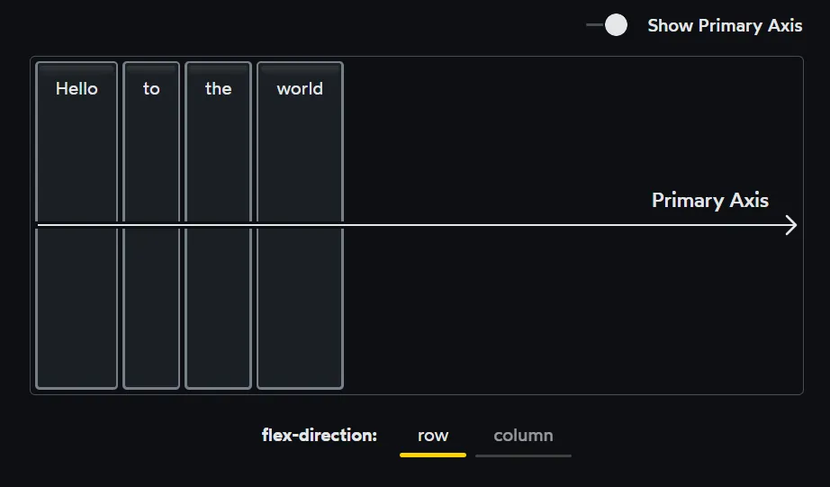
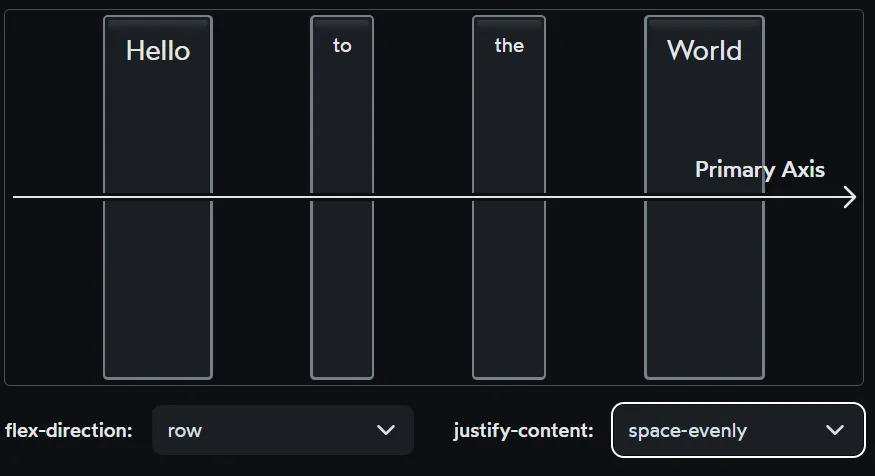

# DAY 41 : MORE FLEXBOX 
# 1. 4 chế độ bố cục (Layout Mode)
## 4 chế độ layout chính trong CSS hiện đại
### Normal Flow (còn gọi là Block/Inline Flow):

- Layout mặc định: phần tử block xếp theo chiều dọc, inline xếp theo chiều ngang

- Khi bạn chưa dùng float, flex, hay grid gì cả. Đủ cho bố cục đơn giản như đoạn văn bản, tiêu đề, v.v.

- Cần học căn bản để đọc, hiểu mã cũ

### Float Layout (Còn gọi là Float):

- Dùng float: left/right để đẩy phần tử sang trái/phải, thường kèm clear

- Chỉ nên dùng cho: hình ảnh trong văn bản, hoặc sửa mã cũ. Không dùng để tạo layout mới

- Cần học căn bản để đọc, hiểu mã cũ

### Flexbox Layout:

- Layout 1 chiều (ngang hoặc dọc), rất linh hoạt và dễ kiểm soát

- Dùng cho hầu hết layout hiện đại: menu, danh sách sản phẩm, các thẻ (card), căn giữa, v.v.

- Cần học kỹ

### Grid Layout:

- Layout 2 chiều (hàng & cột), phù hợp cho bố cục phức tạp

- Dùng để làm layout chính của trang, dashboard, bảng,...

- Sau khi học xong Flex thì cần học, học kỹ.

Flexbox là một chế độ bố cục cực kỳ mạnh mẽ. Khi chúng ta thực sự hiểu cách thức hoạt động của nó, chúng ta có thể xây dựng các bố cục động tự động tương thích, tự sắp xếp lại khi cần.

CSS bao gồm nhiều loại bố cục khác nhau (layout modes), mỗi bố cục này sử dụng 1 thuật toán riêng. Chế độ bố cục mặc định là Normal Flow layout (bố cục Flow), nhưng chúng ta có thể chuyển sang Flexbox layout bằng cách thay đổi thuộc tính display trên vùng chứa cha. Mỗi chế độ bố cục sử dụng ngôn ngữ của riêng nó trong CSS. Ví dụ thuộc tính flex dùng cho Flexbox layout, nhưng không dùng cho Normal Flow Layout. Hoặc có thuộc tính chỉ dùng cho Grid layout, không dùng cho Flexbox layout.

Khi chúng ta chuyển sang chế độ Flexbox layout (bằng lệnh display: flex), điều này có nghĩa là tất cả các phần tử con sẽ được định vị theo thuật toán của bố cục Flexbox.

Mỗi thuật toán bố cục được thiết kế để giải quyết một vấn đề cụ thể. Bố cục "Flow" mặc định để tạo tài liệu kỹ thuật số; về cơ bản là thuật toán bố cục của Microsoft Word. Tiêu đề và đoạn văn xếp chồng theo chiều dọc thành các khối, trong khi những thứ như văn bản, liên kết và hình ảnh nằm ẩn bên trong các khối này.

Vậy, Flexbox giải quyết vấn đề gì? Flexbox là Flexibility Box, nói đến nó là nói đến tính linh hoạt, cho chúng ta khả năng kiểm soát kinh khủng đối với việc phân phối, căn chỉnh, sắp xếp một nhóm các Items theo hàng (row) hoặc cột (column). Chúng ta có thể kiểm soát rất nhiều thứ, ví dụ việc các Items co lại hay Giãn ra, phân phối không gian …

Đó là lý do vì sao nhiều người nói rằng: "Sau khi học Flexbox, bạn sẽ không muốn quay lại dùng float hay table layout nữa!"

Vậy nếu Flexbox tuyệt vời như vậy thì sao lại có thêm Grid layout nữa ? Giờ đây khi CSS Grid Layout được hỗ trợ tốt trong các trình duyệt hiện đại, Flexbox có phải đã lỗi thời không?

Tất nhiên là Grid Layout là một chế độ bố cục tuyệt vời, nhưng nó không thay thế Flexbox mà nó giải quyết các vấn đề khác với Flexbox. Chúng ta nên tìm hiểu cả hai chế độ bố cục và sử dụng đúng công cụ cho công việc.

Có thể ví Grid là 1 con dao lớn, dùng để mổ trâu. Flexbox là con dao nhỏ hơn, linh hoạt hơn. Khi mổ gà mà dùng Grid thì sẽ không hiệu quả.

Chiến lược phổ biến và mạnh mẽ là kết hợp Grid với Flexbox. Ví dụ dùng Grid cho các bố cục tổng thể, layout, chia thành các vùng. Còn trong các vùng đó thì dùng Flexbox để căn chỉnh các thành phần bên trong:

>

# 2. Flex Direction
Như đã đề cập, Flexbox là tất cả về việc kiểm soát sự phân phối của các phần tử trong một hàng hoặc cột. Theo mặc định, các phần tử sẽ xếp chồng cạnh nhau (stack side-by-side) trong một hàng, nhưng chúng ta có thể lật sang một cột với thuộc tính flex-direction:

>

>


Với flex-direction: row, trục chính chạy theo chiều ngang, từ trái sang phải.

Khi chúng ta lật sang flex-direction: column, trục chính chạy theo chiều dọc, từ trên xuống dưới.

Trong Flexbox, mọi thứ đều dựa trên trục chính (primary axis/main axis). Thuật toán không quan tâm đến chiều dọc/ngang, hoặc thậm chí là hàng/cột. Tất cả các quy tắc đều được cấu trúc xung quanh trục chính này và trục chéo chạy vuông góc với nó (cross axis).

Điều này khá thú vị: Khi chúng ta học các quy tắc của Flexbox, chúng ta có thể chuyển đổi liền mạch từ bố cục ngang sang bố cục dọc. Hầu hết tất cả các quy tắc đều tự động thích ứng. Điều này chỉ có ở chế độ bố cục Flexbox. Ví dụ khi flex-direction: row, thì thuộc tính justify-content: sẽ căn chỉnh các mục theo chiều ngang. Nhưng nếu flex-direction: column thì vẫn là thuộc tính justify-content nhưng lại căn chỉnh các mục theo chiều dọc.

Các flex-items sẽ được định vị mặc định theo 2 quy tắc sau:

- Primary axis/Main axis: Các flex-items sẽ được tập hợp lại một chỗ ở vùng bắt đầu của vùng chứa (start of the flex-container).

- Cross axis: Children will stretch out to fill the entire container. Các flex-items sẽ giãn ra để lấp đầy toàn bộ vùng chứa (stretch out to fill the flex-container)

>


Trong Flexbox, chúng ta quyết định trục chính chạy theo chiều ngang hay chiều dọc. Tất cả các phép tính trong thuật toán của Flexbox đều dựa trên điều này.

# 3. Alignment (Căn chỉnh)
Chúng ta có thể thay đổi cách phân bổ phần tử con dọc theo trục chính bằng cách sử dụng thuộc tính justify-content:

**`Khi trục chính là chiều ngang (trục dọc sẽ tương tự)`**
>

>

>

>

>

>


Khi nói đến trục chính là nói đến sự phân bổ của nhóm, cả nhóm các phần tử, chứ không phải là căn chỉnh một phần tử (trong nhóm).

Chúng ta có thể gom tất cả các phần tử vào một vị trí cụ thể (với flex-start, center và flex-end), hoặc chúng ta có thể phân tán chúng ra (với space-between, space-around và space-evenly).

Đối với Trục chéo (cross axis), mọi thứ hơi khác một chút. Chúng ta dùng thuộc tính align-items (chứ không phải align-content).

Giả sử lúc này justify-content: flex-start (các vị trí khác tương tự), hãy xem các giá trị khác nhau của align-items sẽ tác động đến các items ra sao:

>
align-items: stretch là giá trị mặc định trong Flexbox.

>
>
Hãy để ý nó khác so với khi align-items: flex-start
>
>

Thật thú vị… Với align-items, chúng ta có một số tùy chọn giống như justify-content, nhưng không có sự chồng chéo hoàn hảo.
>

Tại sao chúng không chia sẻ cùng các tùy chọn? Để trả lời câu hỏi này trước hết chúng ta cần tìm hiểu 1 thuộc tính căn chỉnh nữa: align-self.

Không giống như justify-content và align-items, align-self được áp dụng cho phần tử con, không phải cho container (tức là được khai báo trong flex item chứ không phải trong flex-container). Nó cho phép chúng ta căn chỉnh một phần tử con cụ thể dọc theo trục chéo:
>
>
>
>
>


align-self có tất cả các giá trị giống như align-items. Trên thực tế, chúng thay đổi chính xác cùng một thứ. align-items là syntactic sugar, một cách viết tắt tiện lợi tự động thiết lập căn chỉnh trên tất cả các phần tử con cùng một lúc. Có nghĩa là thay vì sử dụng align-self với cùng giá trị cho từng phần tử thì dùng align-items cho nhanh.

Lưu ý rằng Không có justify-self. Để hiểu lý do tại sao, chúng ta cần đào sâu hơn vào thuật toán Flexbox.

## 3.1 Content vs. items
Dựa trên những gì chúng ta đã học cho đến nay, Flexbox có vẻ khá tùy ý.

Tại sao lại là justify-content và align-items, mà không phải justify-items hoặc align-content ?

Tại sao lại có align-self mà không có justify-self ?

Những câu hỏi này nhắm vào một trong những điều quan trọng nhất và bị hiểu lầm nhất về Flexbox. Chúng ta sẽ sử dụng 1 phép ẩn dụ thế này:

Trong Flexbox, các phần tử con được phân phối dọc theo trục chính. Theo mặc định, chúng được xếp thẳng hàng, cạnh nhau. Tôi có thể vẽ một đường ngang thẳng xiên tất cả các phần tử con, giống như một xiên thịt nướng?:
>

Tuy nhiên, theo hướng trục chéo thì khác. Một đường thẳng đứng chỉ có thể xiên qua 1 trong số các phần tử. Nó không giống xiên thịt nướng, mà giống xiên xúc xích hơn.
>

Có một sự khác biệt đáng kể ở đây. Với xiên xúc xích, mỗi món có thể di chuyển dọc theo que xiên của nó mà không ảnh hưởng đến bất kỳ món nào khác:
>

Ngược lại, với trục chính của chúng ta xiên từng phần tử anh chị em, một phần tử đơn lẻ không thể di chuyển dọc theo thanh của nó mà không va vào các phần tử anh chị em của nó!

>
>


Đây là sự khác biệt cơ bản giữa trục chính/trục chéo. Khi chúng ta nói về sự căn chỉnh theo trục chéo, mỗi phần tử có thể làm bất cứ điều gì nó muốn, độc lập với các phần tử khác. Còn theo trục chính, chúng ta chỉ có thể nghĩ về cách phân phối nhóm các phần tử, chúng không độc lập.

Đó là lý do tại sao không có justify-self. Ví dụ với phần từ màu vàng ở giữa khi ta thiết lập justify-self: flex-start; thì vô nghĩa, vì đã có 1 phần tử khác ở đó rồi (phần tử màu đỏ)

Với tất cả những điều vừa tìm hiểu, chúng ta có thể đưa ra định nghĩa phù hợp cho tất cả 4 thuật ngữ mà chúng ta đã nói đến:

- justify — để định vị một cái gì đó dọc theo trục chính - primary axis.

- align — để định vị một cái gì đó dọc theo trục chéo - cross axis.

- content — một nhóm “phần tử” có thể phân phối được.

- items — các phần tử riêng lẻ có thể được định vị riêng lẻ.

Và như vậy chúng ta sử dụng hai thuộc tính chính để quản lý bố cục với Flexbox:

- justify-content để kiểm soát việc phân phối nhóm dọc theo trục chính

- align-items để định vị từng phần tử riêng lẻ dọc theo trục chéo.

- Không có justify-items.

- Còn về align-content thì sao? Thực ra nó có tồn tại trong Flexbox. Nhưng chúng ta sẽ nói về nó sau, vì nó liên quan đến thuộc tính flex-wrap.


# 4. Hypothetical size (Kích thước giả thuyết)
Hãy nói về một trong những nhận thức giúp mở mang tầm mắt nhất về Flexbox. Giả sử tôi có mã CSS sau:
```css
.item {
  width: 2000px;
}
```
Bình thường chúng ta cho rằng chúng ta sẽ có một item có chiều rộng 2000 pixel. Nhưng điều đó có luôn đúng không?

Ví dụ ta có đoạn code sau:
```html
<div class="item">item 1</div>

<div class="flex-wrapper">
  <div class="item">item 2</div>
</div>
```
```css
.flex-wrapper {
    display: flex;
  }

.item {
  height: 50px;
  width: 2000px;
  border: 2px solid;
  border-radius: 4px;
  background: hotpink;
  margin: 16px;
}
```
Kết quả:
 

Cả hai item đều được áp dụng cùng một CSS. Mỗi item có chiều rộng: 2000px. Tuy nhiên thực tế, item đầu tiên lại rộng hơn item thứ hai rất nhiều!

Sự khác biệt là do Layout Mode. Item đầu tiên được hiển thị bằng Flow layout (mặc định) và trong bố trí Flow, chiều rộng là một ràng buộc cứng (hard constraint). Khi chúng ta đặt chiều rộng: 2000px, chúng ta sẽ có một phần tử rộng 2000 pixel, ngay cả khi nó phải xuyên qua cạnh của khung nhìn (viewport).

Tuy nhiên, trong Flexbox, thuộc tính width được triển khai theo cách khác. Nó giống một gợi ý hơn là một ràng buộc cứng.

Có 1 thuật ngữ cho điều này gọi là : kích thước giả định (hypothetical size). Đó là kích thước của một phần tử trong thế giới lý tưởng, khi không có gì cản trở.

Than ôi, mọi thứ hiếm khi đơn giản như vậy. Trong trường hợp này, yếu tố cản trở là phần tử cha - nó không có đủ chỗ cho phần tử con rộng 2000px. Và do đó, kích thước của phần tử con được thu nhỏ lại để vừa vặn.

Đây là một phần cốt lõi của triết lý Flexbox. Mọi thứ đều linh hoạt và mềm dẻo, có thể điều chỉnh theo những hạn chế của thế giới.

Chúng ta có xu hướng nghĩ về ngôn ngữ CSS như một tập hợp các thuộc tính, nhưng tôi nghĩ đó là mô hình tâm trí (mental model) sai lầm. Như chúng ta đã thấy, thuộc tính width hoạt động khác nhau tùy thuộc vào chế độ bố cục được sử dụng! Vì vậy tôi nghĩ về CSS như một tập hợp các chế độ bố cục. Mỗi chế độ bố cục là một thuật toán khác nhau có thể triển khai hoặc xác định lại từng thuộc tính CSS.

Nói cách khác, khi chúng ta khai báo các thuộc tính CSS giống như ta đang truyền đối số vào các hàm (thuật toán). Vì vậy chỉ học cách khai báo các thuộc tính là không đủ, để thực sự làm chủ CSS chúng ta phải học cách mà các thuật toán sử dụng các thuộc tính này như thế nào.

Nói dễ hiểu là tìm hiểu thật sâu cách thức hoạt động của các loại bố cục. Đó là cốt lõi của CSS, chứ không phải là học thuộc các thuộc tính.

# 5. Growing và shrinking
Chúng ta đã thấy thuật toán Flexbox có một số tính linh hoạt sẵn có, với các kích thước giả định. Nhưng để thực sự thấy Flexbox có thể linh hoạt như thế nào, chúng ta cần nói về 3 thuộc tính: flex-grow, flex-shrink và flex-basis.

Hãy cùng xem xét từng thuộc tính.

## 5.1 flex-basis
Nói một cách đơn giản: Trong một hàng , flex-basis thực hiện cùng một chức năng như width. Trong một cột Flex, flex-basis thực hiện cùng một chức năng như height.

Như chúng ta đã biết, mọi thứ trong Flexbox đều được gắn với primary/cross axis. Ví dụ, justify-content sẽ phân phối các phần tử con dọc theo trục chính và hoạt động theo cùng một cách cho dù trục chính chạy theo chiều ngang hay chiều dọc.

width và height không tuân theo quy tắc này! width sẽ luôn ảnh hưởng đến kích thước theo chiều ngang. Nó không đột nhiên trở thành height khi chúng ta lật flex-direction từ hàng sang cột.

Và vì vậy, các tác giả Flexbox đã tạo ra một thuộc tính "kích thước" chung được gọi là flex-basis. Nó giống như chiều rộng hoặc chiều cao, nhưng được gắn vào trục chính, giống như mọi thứ khác. Nó cho phép chúng ta đặt kích thước giả định của một phần tử theo hướng trục chính, bất kể đó là chiều ngang hay chiều dọc.

Giống như chúng ta đã thấy với width, flex-basis giống một gợi ý hơn là một ràng buộc cứng. Đến một thời điểm nào đó, khi không có đủ không gian cho tất cả các phần tử nằm ở kích thước được chỉ định của chúng, và do đó chúng phải thỏa hiệp, để tránh tràn ra khỏi phần tử cha.

Kết luận: flex-basic là kích thước danh nghĩa của một flex-item theo trục chính.

Tuy nhiên nói như vậy không có nghĩa là flex-basic và width giống hệt nhau, mặc dù trong nhiá»u trường hợp có thể dùng flex-basic thay thế cho width. Đặc biệt là khi sử dụng với các Replaced elements, đây là các phần tử mà nội dung bên trong do trình duyệt quyết định (ví dụ: `, <input>, <video>`...). Ví dụ đoạn mã sau:
```html
<div class="flex-container">
   //đường dẫn ảnh của bạn 
</div>
```
```css
.flex-container {
  display: flex;
}

img {
  width: 300px;
  /* flex: 1 1 300px; */
  
}
```
Nếu khai báo width: 300px thì ảnh sẽ thay đổi kích thước (và giữ nguyên tỷ lệ).

Nhưng hãy thử tắt width: 300px, mà sử dụng flex: 1 1 300px; Tức là nói với trình duyệt là “Hãy bắt đầu bức ảnh với chiều rộng 300px, cho phép co giãn để vừa với container”. Ta sẽ thấy chẳng có tác dụng gì. Nếu đây là 1 bức ảnh lớn ta thấy nó vẫn tràn ra khỏi viewport. Bởi vì là do img không bị giới hạn bởi kích thước của phần tử cha.

- Với Normal Flow Layout thì dùng width, vì không thể dùng flex-basic.

- Với Flexbox layout, khi dùng cả width và flex-basic thì flex-basis sẽ được ưu tiên hơn. Ví dụ flex: 1 tức là flex-basis: 0; thì sẽ bỏ qua width luôn. Hoặc flex-basis: 200px; width: 300px thì sẽ sử dụng 200px thì ưu tiên flex-basis.

- Một trường hợp khá phổ biến là kết hợp cả 2, khai báo width, và flex-basis: auto; khi đó flex-basis sẽ tham chiếu đến width.

- Với các phần tử mà kích thước do trình duyệt quyết định thì cần phải xử lý khác một chút (nằm ngoài phạm vi bài này, sẽ học sau).

## 5.2 flex-grow
Theo mặc định, các phần tử trong ngữ cảnh Flex sẽ thu nhỏ xuống kích thước thoải mái tối thiểu của chúng dọc theo trục chính. Điều này thường tạo ra thêm không gian trống.


Chúng ta có thể chỉ định cách sử dụng không gian đó bằng thuộc tính flex-grow:


Giá trị mặc định cho flex-grow là 0. Nếu chúng ta muốn một phần tử con chiếm hết bất kỳ không gian thừa nào trong container, chúng ta cần phải nói rõ ràng với nó.

Nếu nhiều phần tử con đặt flex-grow thì sao? Trong trường hợp này, không gian thừa được chia theo tỷ lệ giữa các chúng dựa trên giá trị flex-grow của chúng. Lưu ý để tránh nhầm lẫn.

Ban đầu khi học tôi cũng bị nhầm lẫn và cho rằng kích thước cuối cùng cả các item sẽ chia đều theo tỉ lệ flex-grow của chúng. Thực ra là phần không gian thừa sẽ được chia theo tỷ lệ của flex-grow của chúng, và cộng với kích thước ban đầu thì sẽ ra kích thước cuối cùng. Ví dụ như sau:
```html
<div class="flex-container">
  <div class="one"></div>
  <div class ="two"></div>
</div>
```
```css
/* ta giới hạn kích thước của container, để dễ dàng quan sát */
.flex-container {
  width: 600px;
  height: 50vh;
  background: blue;
  display: flex;
}


.one {
  color: #fff;
  background: green;
}

.two {
  background: yellow;
}
```


Ta thấy phần tử .one và .two không hiện ra vì kích thước mặc định của chúng bằng 0. Bây giờ ta khai báo như sau:
```css
.one {
  color: #fff;
  background: green;
  flex-basis: 200px; //thêm dòng này 
}
```
Ta thấy lúc này phần từ .one sẽ có chiều rộng là 200px; Phần không gian thừa còn lại (màu xanh dương) bên phải có chiều rộng 400px.


Lúc này ta sẽ thêm flex-grow vào 2 phần tử với tỉ lệ khác nhau. Khi đó phần không gian thừa sẽ bị chia theo tỉ lệ:
```css
.one {
  color: #fff;
  background: green;
  flex-basis: 200px;
  flex-grow: 1;      //thêm dòng này 
}

.two {
  background: yellow;
  flex-grow: 3;      //thêm dòng này 
}
```


Ta thấy kết quả cuối cùng 2 phần tử đều có chiều rộng là 300px. Bởi vì phần tử .one có flex-grow: 1; phần tử 2 có flex-grow: 3. Nên phần tử .one sẽ lấy thêm 1/4 phần không gian thừa, tức là 100px, cộng với kích thước ban đầu là 200px, tổng là 300px. Phần tử .two bắt đầu với kích thước bằng 0, và có flex-grow: 3 nên chiếm thêm 3/4 không gian thừa, là 300px.

flex-grow là tỷ lệ dùng để phân chia phần không gian thừa, chứ không phải là tỷ lệ kích thước cuối cùng của các phần tử.

## 5.3 flex-shrink
flex-shrink sẽ hoạt động khác so với flex-grow (phức tạp hơn).

Theo mặc định trong CSS thì flex-grow: 0; flex-basis: auto; và flex-shrink: 1; tức là tự động nếu không khai báo thì trình duyệt tự động áp dụng flex: 0 1 auto; cho các phần tử flex-item.

Khi flex-shrink : 1; mặc định thuật toán của Flexbox sẽ shrink các phần tử nhưng luôn duy trì tỉ lệ kích thước giữa chúng. Ví dụ:


Trong ví dụ trên để dễ theo dõi đã để kích thước ban đầu của 2 item đều là 250px. Khi flex-shrink bằng 1 thì Flexbox sẽ shrink 2 phần tử và luôn duy trì tỉ lệ (trong trường hợp này chúng luôn bằng nhau).

Nếu phần tử 1 rộng gấp đôi phần tử 2 thì khi flex-shrink: 1; 2 phần tử luôn giữ tỷ lệ kích thước là 2: 1.

Nhưng mọi chuyện sẽ phức tạp hơn khi flex-shrink khác 1. Tức là nếu flex-shrink bằng 2 chẳng hạn. Thì kích thước của các item sẽ không còn duy trì tỷ lệ ban đầu nữa.

Vì vậy trong hầu hết các trường hợp sẽ sử dụng flex-shrink bằng 0 hoặc 1.

## 5.4 Preventing shrinking/growing
Trong 1 số trường hợp, chúng ta không muốn flex-item nào đó (ví dụ thanh sidebar) co lại. Khi đó ta sử dụng flex-shrink: 0;Khi đó Thuật toán Flexbox sẽ coi flex-basis (hoặc width) là 1 giới hạn tối thiểu cứng (hard minimum limit).


(ta thấy khi flex-shrink: 1; thì 2 hình tròn màu vàng bị co lại thành hình ô van)

Ngoài việc sử dụng flex-shrink: 0 để ngăn 1 phần tử bị co lại, còn có thể dùng giải pháp khác là :

min-width

# 6. Hiểu sâu hơn về kích thước tối thiểu (minimum size)
Đây là 1 điều cực kỳ quan trọng.

Ngoài kích thước giả định (hypothetical size) thì thuật toán của Flexbox còn quan tâm đến 1 loại kích thước khác là kích thước tối thiểu (minimum size).

Thuật toán Flexbox từ chối thu nhỏ phần tử con xuống dưới kích thước tối thiểu của nó. Nội dung sẽ tràn thay vì thu nhỏ hơn nữa, bất kể chúng ta tăng flex-shrink lên bao nhiêu!

Text input có kích thước tối thiểu mặc định là 170px -200px (khác nhau tùy trình duyệt).

Trong những trường hợp khác, yếu tố hạn chế có thể là nội dung của phần tử đó (min-content). Xem phần min-content, min-width ở bài trước:

**Tự học lập trình Full Stack ngày 38/365: FlexBox P5 - Growing và Shrinking
KAITAKU**
·


Đối với một phần tử chứa văn bản, mặc định thì chiều rộng tối thiểu là độ dài của chuỗi ký tự dài nhất không thể ngắt. Nhưng chúng ta có thể xác định lại kích thước tối thiểu bằng thuộc tính min-width.

Bằng cách đặt min-width: 0; trực tiếp trên flex-item, chúng ta yêu cầu thuật toán Flexbox ghi đè chiều rộng tối thiểu mặc định . Vì chúng ta đã đặt thành 0px, nên phần tử có thể thu nhỏ tùy ý.

Lưu ý : Cần lưu ý rằng kích thước tối thiểu mặc định có tác dụng như một rào chắn, để ngăn chặn điều gì đó thậm chí còn tệ hơn xảy ra. Vì vậy cần đặt min-width cẩn thận. min-width: là 1 thuộc tính đặc biệt mãnh mẽ, nó cho phép chúng ta có nhiều quyèn lực hơn, nhưng vì vậy nên phải rất cẩn thận.

# 7. Gap
Đây là 1 trong những cải tiến lớn của Flexbox trong những năm gần đây và đã được hỗ trợ bởi tất cả các trình duyệt hiện đại.

gap cho phép chúng ta tạo khoảng cách giữa mỗi flex-item. Điều này rất tuyệt vời cho những thứ như tiêu đề điều hướng:


## 7.1 margin: auto;
Có một mẹo khác liên quan đến khoảng cách. Nó đã có từ những ngày đầu của Flexbox.

Thuộc tính margin được dùng để thêm khoảng cách xung quanh 1 phần tử cụ thể. Trong 1 số chế độ bố cục như Flow, Positioned nó còn được sử dụng để căn giữa 1 phần tử bằng cách sử dụng margin: auto;

Thuộc tính này có thú vị hơn nhiều khi sử dụng trong Flexbox. Ví dụ ta có 3 flex-item trong 1 hàng như thế này. Hãy xem việc dùng margin lên phần tử đầu tiên ảnh hưởng như thế nào.

>
khi margin-left và margin-right đều =0 theo mặc định
>
margin-left:auto nên chiếm toàn bộ không gian còn lại

>
>
Khi margin-left và margin-right đều là auto, phần tử được căn giữa

Trước đó, chúng ta đã thấy cách thuộc tính flex-grow có thể chiếm hết bất kỳ không gian thừa nào. Nhưng nó áp dụng cho bản thân flex-item.

Còn margin:auto cũng có thể chiếm hết phần không gian thừa. Nhưng nó áp dụng cho margin của flex-item. Nó cho chúng ta quyền kiểm soát chính xác nơi phân bổ không gian thừa.

Bố cục tiêu đề (header layout) phổ biến có logo ở một bên và một số liên kết điều hướng (navigation links) ở bên kia. Sau đây là cách chúng ta có thể xây dựng bố cục này bằng cách sử dụng lề tự động margin: auto:
```html
<nav>
  <ul>
    <li class="logo">
      <a href="/">
        Corpatech
      </a>
    </li>
    <li>
      <a href="">
        Mission
      </a>
    </li>
    <li>
      <a href="">
        Contact
      </a>
    </li>
  </ul>
</nav>

```css
body {
  padding: 0;
}
nav {
  padding: 12px;
  border-bottom: 1px dotted
    hsl(0deg 0% 0% / 0.2);
}
ul {
   display: flex;
   gap: 12px;
  list-style-type: none;
  align-items: baseline;
  padding: 0px;
  margin: 0;
}
ul a {
  color: inherit;
  text-decoration: none;
  font-size: 0.875rem;
}
.logo a {
  font-size: 1.125rem;
  font-weight: 500;
}


li.logo {
  margin-right: auto;
}
```
>

Chúng ta có thể xem những gì đang diễn ra ở đây bằng cách sử dụng DevTools của trình duyệt:
>

Có rất nhiều cách khác để chúng ta có thể giải quyết vấn đề này: chúng ta có thể nhóm các liên kết điều hướng trong flex-container riêng của chúng hoặc chúng ta có thể mở rộng flex-item đầu tiên bằng flex-grow. Nhưng cá nhân tôi thích giải pháp tự động căn lề. Chúng ta đang coi không gian thừa như một nguồn tài nguyên và quyết định chính xác nơi nó sẽ đi.


# 8. Wrapping
Mặc định các flex-item sẽ xếp cạnh nhau trên cùng 1 hàng hoặc một cột. Tức là thuộc tính flex-wrap: nowrap; sẽ là mặc định.

Khi chúng ta đặt flex-wrap: wrap, các item sẽ không thu nhỏ xuống dưới kích thước giả định của chúng.

Ví dụ:
```html
<div class="parent">
  <div class="box">1</div>
  <div class="box">2</div>
  <div class="box">3</div>
</div>
```
```css
.parent {
  display: flex;
  flex-wrap: wrap;
  justify-content: center;
  height: 300px;
}

.box {

  flex: 1 1 200px; 
  margin: 5px;
  background: red;
}
```
Kích thước giả định của 3 item là 200px. Khi kích thước của .parent lớn hơn 600px thì các .box sẽ grow theo 1 dòng:
>

Khi kích thước .parent nhỏ hơn 600px thì .box thứ 3 sẽ bị ngắt xuống dòng mới:
>

Và khi chiều rộng .parent nhỏ hơn 400px thì .box thứ 2 tiếp tục bị ngắt xuống dòng mới:
>

Ta thấy trong cú pháp :
```css
.box {

  flex: 1 1 200px; 
  margin: 5px;
  background: red;
}
có thể thay thế bằng cú pháp dưới, kết quả vẫn tương tự. Vì flex-basis và width đều là kích thước giả định.

.box {
  width: 200px;
  flex: 1 1 auto; 
  margin: 5px;
  background: red;
}
```
Khi ta tiếp tục thu hẹp chiều rộng của màn hình thì các .box vẫn tiếp tục thu nhỏ lại, cho thấy chúng rất linh hoạt.

>

Vậy nếu ta sử dụng min-width: 200px thì sao:
```css
.box {
  min-width: 200px;
  flex: 1 1 auto; 
  margin: 5px;
  background: red;
}
```
Khi đó nếu thu hẹp kích thước màn hình lại đến khi chiều rộng của .parent nhỏ hơn 200px thì các .box sẽ không co lại, mà sẽ tràn ra khỏi .parent:
>

Lý do là bởi flex-basis và width là kích thước giả định, nhưng min-width là kích thước cứng của phần tử. Không thể giảm xuống dưới kích thước đó.

Thứ tự ưu tiên khi trình duyệt xử lý layout trong flexbox với flex-wrap và flex-shrink:

1. Shrink các phần tử trên dòng hiện tại khi không gian bị thiếu

1. Nếu shrink không đủ → Wrap sang dòng mới (flex-wrap: wrap)

1. Khi container tiếp tục nhỏ đi, Flexbox tiếp tục Lặp lại quá trình: shrink → wrap → shrink → wrap...

1. Nếu không thể shrink và không thể wrap nữa → Tràn (overflow)

Với flex-wrap: wrap, chúng ta không còn một đường trục chính duy nhất có thể xiên từng mục. Trên thực tế, mỗi hàng hoạt động như một mini flex-container của riêng nó. Thay vì 1 xiên lớn, mỗi hàng có xiên riêng của nó:

>

Lúc này thuộc tính justify-content vẫn hoạt động bình thường, áp dụng cho từng dòng.

Nhưng bây giờ Align-items hoạt động như thế nào khi chúng ta có nhiều hàng? Trục chéo có thể giao nhau với nhiều mục!

Bởi vì lúc này mỗi hàng là 1 mini flex-container riêng, nên align-items sẽ được sử dụng cho từng hàng riêng, tức là sẽ tác động đến vị trí từng mục trong mỗi hàng, chứ không căn chỉnh vị trí của cả hàng đó.

Nhưng nếu chúng ta muốn căn chỉnh các hàng thì sao. Chúng ta có thể làm điều này với thuộc tính align-content:
>

Khi align-content: flex-start; thì dòng 1 và dòng 2 được tập trung ở Top của trục chéo.
>

Khi align-content: space-between ta thấy 2 hàng bị đẩy về phía Top và Bottom của trục chéo. Nhưng để ý dù 2 hàng di chuyển nhưng 2 phần tử 1, 2 trong mỗi hàng không thay đổi vị trí so với nhau.

Để căn chỉnh vị trí 2 phần tử 1, 2 trong 1 hàng thì cần dùng align-items. Ví dụ dùng align-items: center; thì phần tử 1, 2 sẽ căn giữa nhau theo trục chéo.
>

🎯 **Kết luận:**
- align-content chỉ có tác dụng khi flex-wrap hoạt động và có nhiều dòng.

- Khi flex-wrap hoạt động và có nhiều dòng, thì align-content trên trục chéo sẽ hoạt động giống hệt như justify-content trên trục chính, cả 2 thuộc tính dùng chung các giá trị:
flex-start, flex-end, center, space-between, space-around, space-evenly.


## Tài liệu phải đọc khi ĐÓNG CỌC LẦN .2
1. https://developer.mozilla.org/en-US/docs/Web/CSS/CSS_flexible_box_layout/Typical_use_cases_of_flexbox

1. https://www.freecodecamp.org/news/css-flexbox-tutorial-with-cheatsheet/

1. https://developer.mozilla.org/en-US/docs/Web/CSS/CSS_flexible_box_layout/Aligning_items_in_a_flex_container

> ⭐ **Theo dõi [kênh Threads](https://www.threads.com/@kaitaku.88) để đọc bài mới mỗi ngày!** ⭐  

**[<== Bài Trước  ](link)          |[  Trang Chủ  ](./README.md)|           [  Bài Sau ==>](link)**


Các nguồn tài liệu tham khảo thêm:  
