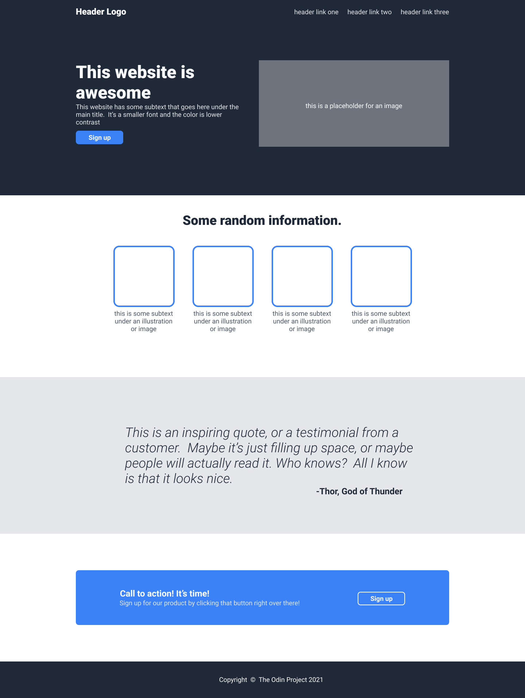
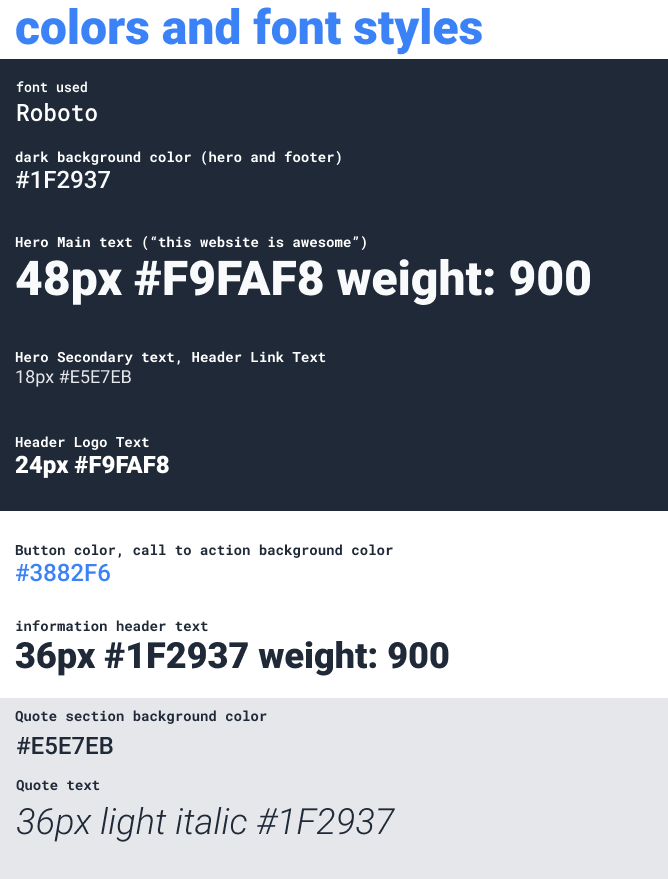
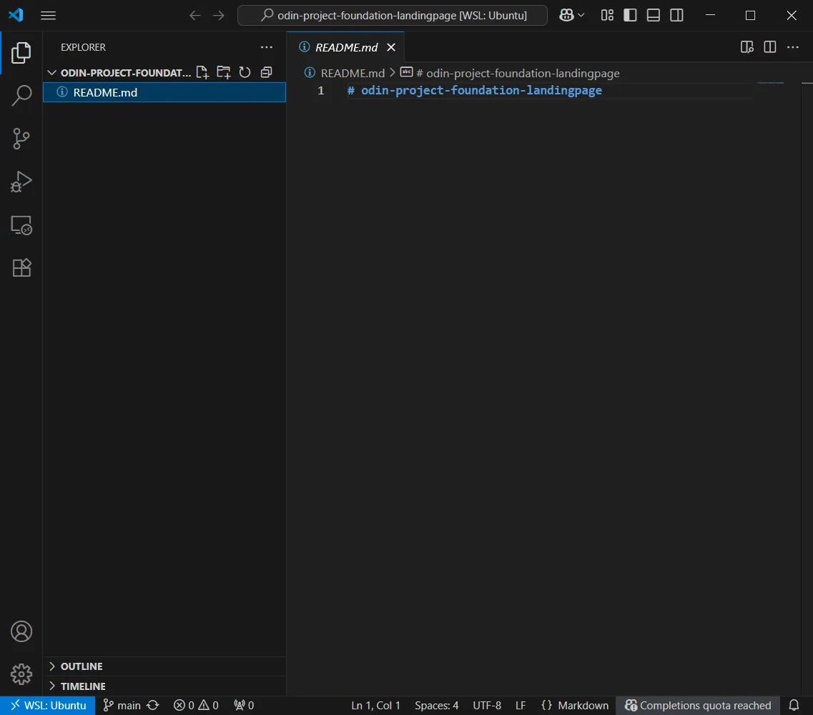
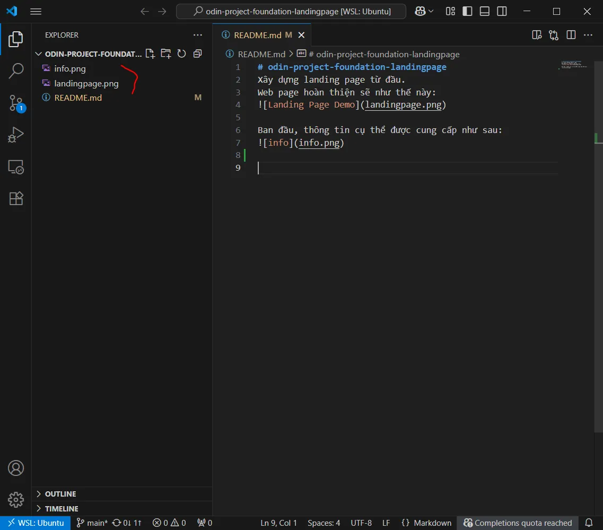

# Day 42 Project: Landing Page
> Thực hành tạo toàn bộ 1 web page với HTML và CSS đã học trong các bài trước  

# 1. Lưu ý trước khi bắt đầu
Nhiệm vụ: Tạo một trang Landing page hoàn chỉnh dựa trên bản thiết kế được cung cấp (gồm 2 hình ảnh: toàn bộ thiết kế và 1 bản chỉ có font/màu sắc).

Kỹ năng: Dự án đòi hỏi bạn áp dụng tất cả những gì đã học, và có thể tra cứu thêm khi gặp khó khăn (Google, AI… lưu ý không hỏi theo kiểu yêu cầu AI đưa ra lời giải).

Mục tiêu: Không cần làm chính xác từng pixel, chỉ cần bố cục tổng thể và các phần tử gần giống là được. Ví dụ trong dự án mẫu margin 48px, nhưng của bạn là 30px cũng không ảnh hưởng gì.

Nội dung cá nhân hóa: Bạn có thể thay thế nội dung giả bằng nội dung thực tế, tự chọn hình ảnh, font, màu sắc để sáng tạo thêm. Ví dụ hình ảnh, logo…

Lưu ý về hình ảnh: Không dùng hình ảnh có bản quyền tùy tiện. Hãy tìm ảnh miễn phí từ Pexels, Pixabay hoặc Unsplash, và ghi nguồn trong file README.

Thiết lập GitHub: Tạo repository Git để lưu trữ dự án, như đã làm với bài Recipes project. Đây sẽ là phần trong portfolio của bạn mà nhà tuyển dụng sẽ xem

Cảnh báo về việc xem trước lời giải:

Không xem code mẫu của người khác trước khi bạn hoàn thành dự án.

Những code đó không hẳn là đúng hoặc tối ưu, bởi vì nó được viết bởi những người cũng đang học giống bạn.

Việc tự mày mò giúp bạn rèn kỹ năng giải quyết vấn đề – một yếu tố quan trọng trong lập trình thực tế.

Nhớ rằng “Học lập trình bằng cách nhìn code hoàn chỉnh giống như học làm bánh pizza chỉ bằng cách nhìn một chiếc bánh đã nướng xong.” Khi bạn nhìn code, có thể bạn sẽ hiểu được toàn bộ các chi tiết, nhưng khi cho bạn tự làm từ đầu có thể bạn sẽ không làm được.

Sau khi tự hoàn thành dự án, bạn có thể xem bài của người khác để tham khảo thêm, so sánh về cách thực hiện. Bởi vì cùng 1 kết quả có thể có nhiều cách khác nhau.

> **`git commit  `**
Nhớ rằng cần liên tục commit sớm và thường xuyên.

# 2. Bắt đầu dự án
1. Tải 2 ảnh về và xem để hình dung về web page sẽ làm : [Image One (Full Design)](https://cdn.statically.io/gh/TheOdinProject/curriculum/81a5d553f4073e593d23a6ab00d50eef8620796d/foundations/html_css/project/imgs/01.png), [Image Two (Color and Fonts)](https://cdn.statically.io/gh/TheOdinProject/curriculum/a38403e7d81cc8305af16ac48985cfbde87834d6/foundations/html_css/flexbox/project-landing-page/imgs/02.png). Đây là kết quả cuối cùng mà chúng ta mong đợi.

>

Đây là thông tin được cung cấp:
>

- Có nhiều cách để giải quyết một dự án như thế này, và có thể rất choáng ngợp khi nhìn vào một tài liệu HTML trống và không biết bắt đầu từ đâu. Gợi ý của chúng tôi: thực hiện từng phần một. Trang web bạn đang tạo có 4 phần chính (và một phần chân trang), vì vậy hãy chọn một phần và hoàn thiện nó trước khi tiếp tục. Bắt đầu từ Top luôn là một kế hoạch vững chắc.

- Đối với phần bạn đang làm, hãy thực hiện HTML rồi mới thực hiện CSS (xây thô xong mới trang trí). Với dự án này thì chỉ cần một file .css là đủ, không cần nhiều hơn.

- Đừng lo lắng về việc làm cho dự án của bạn trông đẹp trên thiết bị di động. Chúng ta sẽ tìm hiểu điều đó sau.

- Khi bạn hoàn thành, đừng quên push nó lên GitHub!

2. Tạo 1 repo tên là odin-project-foundation-landingpage trên GitHub.

3. Mở WSL Terminal ra, cd vào thư mục repos (đã tạo trong các phần trước, hoặc tạo mới thư mục tên repos).

4. Clone repo trên GitHub về thư mục repos. Rồi mở thư mục vừa clone về trong VSCode. Hiện tại dự án chưa có gì, chỉ có mỗi file README.md được tạo ra khi tạo repo trên GitHub:
>

5. Ghi chú nội dung dự án vào file README, sau đó tiến hành commit.

6. Tải 2 ảnh phía trên về rồi kéo thả vào cây thư mục ở sidebar của VSCode.
>

7. Tạo mới file index.html, styles.css bằng lệnh touch

7. Sau đó commit

7. Cứ tiếp tục cho đến khi hoàn thành dự án

7. Hãy resize cửa sổ trình duyệt để thấy sự hoạt động của flex-wrap, flex-shrink, flex-grow…