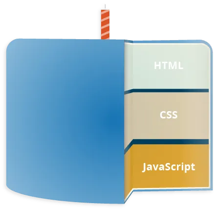
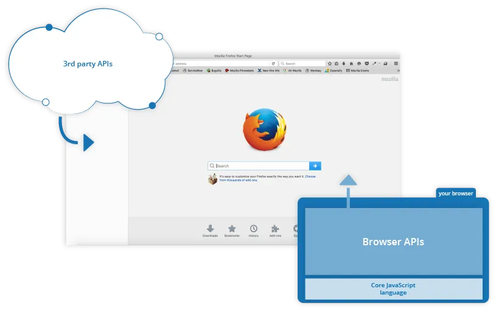
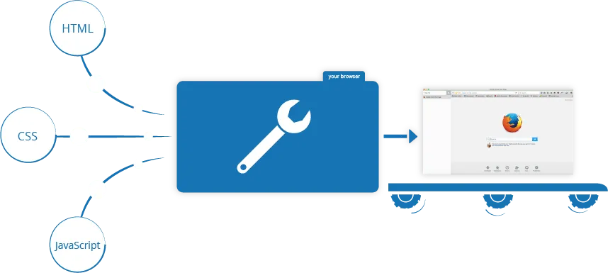
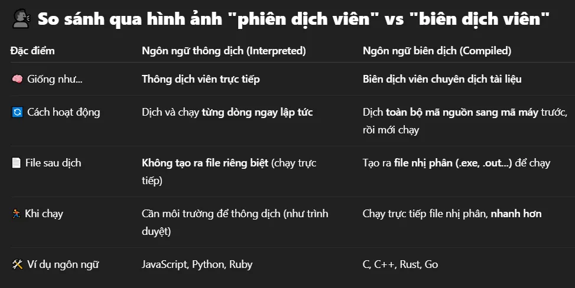
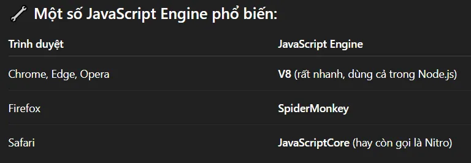

# Day 43: JavsScript là gì & Nó thực sự làm gì trên webpage của bạn?


> **`Đây phải là bài mở đầu khi học về JavaScript !`**

JavaScript là một chủ đề lớn, với rất nhiều tính năng, phong cách và kỹ thuật khác nhau để học, và rất nhiều API và công cụ được xây dựng trên đó.

Mục tiêu của bài này là giúp chúng ta trả lời được:

- JavaScript là gì?

- Bạn có thể làm gì với nó? Hay nó đang làm những gì với page của bạn?

- Và Làm thế nào mà JavaScript lại phù hợp với một trang web?

# **`1. Định nghĩa JS ở cấp độ cao`**
JavaScript là một ngôn ngữ lập trình hoặc viết kịch bản cho phép bạn triển khai các tính năng phức tạp trên các trang web — mỗi khi một trang web thực hiện điều gì đó và hiển thị thông tin tĩnh để bạn xem — hiển thị các bản cập nhật nội dung kịp thời, bản đồ tương tác, đồ họa 2D/3D động, v.v. — bạn có thể chắc chắn rằng JavaScript có liên quan. Đây là lớp thứ ba của công nghệ web tiêu chuẩn, hai trong số đó là HTML và CSS.
>


HTML là ngôn ngữ đánh dấu mà chúng ta sử dụng để cấu trúc và tạo ý nghĩa cho nội dung web của mình, ví dụ như xác định đoạn văn, tiêu đề và bảng dữ liệu hoặc nhúng hình ảnh và video vào trang.

CSS là ngôn ngữ của các quy tắc về kiểu mà chúng ta sử dụng để áp dụng kiểu cho nội dung HTML của mình, ví dụ như thiết lập màu nền và phông chữ, và bố trí nội dung của chúng ta thành nhiều cột.

JavaScript là ngôn ngữ kịch bản cho phép bạn tạo nội dung cập nhật động, kiểm soát đa phương tiện, tạo hoạt ảnh và hầu như mọi thứ khác. Thật tuyệt vời khi bạn có thể đạt được điều đó chỉ với một vài dòng mã JavaScript.

Ba lớp (layer) được xây dựng chồng lên nhau một cách đẹp mắt. Hãy lấy một nút làm ví dụ:
```html
    <!-- HTML tạo ra button bằng html Layer 1 -->
    <button type="button">Player 1: Chris</button>
```


```css
/* Tạo kiểu cho button bằng CSS  */

button {
    font-family: "helhelvetica neue", helvetica, sans-serif;
    letter-spacing: 2px;
    text-transform: uppercase;
    border: 2px solid rgb(200 200 0 / 60%);
    background-color: rgb(0 217 217 / 60%);
    color: rgb(100  0 0 / 100%);
    box-shadow: 1px 1px 2px rgb(0 0 200 / 40%);
    border-radius: 10px;
    padding: 3px 10px;
    cursor: pointer;
}
```


```javascript
//Và cuối cùng, chúng ta thêm mã JavaScript để triển khai hành vi động

const button = document.querySelector("button");

function updateName() {
    const name = prompt("Enter a new name"); 
    button.textContent = `Player 1: ${name}`;

}

button.addEventListener("click", updateName);
```
Hãy chạy thử đấy thấy kết quả.

## Chuỗi mẫu template literal
Lưu ý trong ví dụ trên trong mã JavaScript có dòng:
```javascript
button.textContent = `Player 1: ${name}`;
```
Ở đây ta sử dụng cặp dấu `` (vị trí ngay trên phím Tab trên bàn phím). Đây là dấu backtick ` ⇒ Đây là template literal (chuỗi mẫu). JavaScript sẽ nội suy (interpolate) giá trị của biến name vào trong chuỗi.

Còn nếu ta dùng cặp dấu nháy đơn : `button.textContent = 'Player 1: ${name}';` thì JavaScript coi đây là 1 chuỗi bình thường (string literal). JavaScript không hiểu ${name} là biến, nó giữ nguyên như một chuỗi ký tự.

# **`2. JavaScript có thể làm gì?`**
JavaScript chạy phía trình duyệt (client-side JavaScript language) có những tính năng cốt lõi (core features) mà cho phép bạn thực hiện những điều như:

Lưu các giá trị hữu ích vào trong các biến. Trong ví dụ trên, chúng ta đã yêu cầu người dùng nhập một name mới và sau đó lưu name đó vào biến gọi là name

Thao tác trên các đoạn văn bản, chính là “string” trong lập trình. Trong ví dụ trên chúng ta sử dụng một chuỗi là “Player 1:” và nối nó với biến name để tạo ra label hoàn chỉnh cho button, ví dụ: “Player 1: Chris”

Chạy code tương ứng khi sự kiện nào đó xảy ra trên webpage. Ở ví dụ trên chúng ta sử dụng sự kiện click để phát hiện thời điểm mà label (button) được click và sau đó chạy code để update text label.

Và nhiều hơn nữa…

Tuy nhiên, điều thậm chí còn thú vị hơn là chức năng được xây dựng trên ngôn ngữ JavaScript phía máy khách. Cái gọi là Giao diện lập trình ứng dụng (APIs - Application Programming Interfaces) cung cấp cho bạn siêu năng lực bổ sung để sử dụng trong mã JavaScript của mình.

API là các bộ khối xây dựng mã được tạo sẵn (code building blocks) cho phép nhà phát triển triển khai các chương trình mà nếu không có nó thì sẽ khó hoặc không thể triển khai được. Chúng thực hiện cùng một chức năng lập trình như các bộ đồ nội thất làm sẵn để xây dựng nhà — dễ dàng hơn nhiều khi lấy các tấm gỗ cắt sẵn và bắt vít chúng lại với nhau để làm giá sách hơn là tự mình thiết kế, đi tìm loại gỗ phù hợp, cắt tất cả các tấm gỗ theo đúng kích thước và hình dạng, tìm các vít có kích thước phù hợp, sau đó lắp chúng lại với nhau để làm giá sách.

**`Các APIs thường rơi vào 2 loại:`**


**`Browser APIs`** được tích hợp vào trình duyệt web của bạn và có thể hiển thị dữ liệu từ môi trường máy tính xung quanh (Môi trường/Tài nguyên bao quanh máy tính mà trình duyệt đang chạy trên máy tính đó có thể bao gồm :Thông tin hệ điều hành, độ phân giải, thông tin về mang, vị trí địa lý, thiết bị ngoại vi như camera, micro...) hoặc thực hiện những việc phức tạp hữu ích. Ví dụ:

- DOM (Document Object Model) API cho phép bạn thực hiện thao tác tạo, xóa và thay đổi HTML, áp dụng động các kiểu CSS mới vào trang của bạn, v.v. Mỗi khi bạn thấy một cửa sổ bật lên (popup window) xuất hiện trên một trang hoặc một số nội dung mới được hiển thị, thì đó chính là DOM đang hoạt động.

- Geolocation API sẽ truy xuất thông tin địa lý. Đây là cách mà Google Maps có thể tìm thấy vị trí của bạn và vẽ vị trí đó trên bản đồ.

- Canvas và WebGL APIs cho phép bạn tạo đồ họa 2D và 3D động. Mọi người đang làm một số điều tuyệt vời bằng cách sử dụng các công nghệ web này (Tham khảo Chrome Experiments và webglsamples)

- Audio and Video APIs như HTMLMediaElement và WebRTC cho phép bạn thực hiện những điều thực sự thú vị với đa phương tiện, chẳng hạn như phát âm thanh và video ngay trong trang web hoặc lấy video từ camera web của bạn và hiển thị trên máy tính của người khác (Thử Snapshot đơn giản để hiểu ý tưởng).

**`Third party APIs`** theo mặc định, không được tích hợp sẵn trong trình duyệt và bạn thường phải lấy mã và thông tin của họ từ đâu đó trên Web. Ví dụ:

- Bluesky API cho phép bạn thực hiện những việc như hiển thị bài đăng mới nhất trên trang web của bạn.

- Google Maps API và OpenStreetMap API cho phép bạn nhúng bản đồ tùy chỉnh vào trang web của mình và các chức năng tương tự khác.

Lưu ý: CácAPIs này là nâng cao và chúng ta sẽ không đề cập đến bất kỳ API nào bây giờ, sau này có thể tham khảo tại đây [Client-side web APIs module](https://developer.mozilla.org/en-US/docs/Learn_web_development/Extensions/Client-side_APIs)

Ngoài ra còn có nhiều API khác nữa! Tuy nhiên, đừng quá phấn khích ngay bây giờ. Chúng ta sẽ không thể xây dựng Facebook, Google Maps hoặc Instagram tiếp theo sau khi học JavaScript trong 24 giờ — có rất nhiều kiến ​​thức cơ bản cần tìm hiểu trước.

# **`3. JavaScript đang làm gì trên page của bạn?`**
Khi bạn tải một trang web trong trình duyệt của mình, bạn đang chạy mã của mình (HTML, CSS và JavaScript) bên trong môi trường thực thi (execution environment, browser tab). Điều này giống như một nhà máy tiếp nhận nguyên liệu thô (code) và tạo ra sản phẩm (trang web).


Một cách sử dụng JavaScript rất phổ biến là sửa đổi HTML và CSS động (dynamically modify HTML and CSS) để cập nhật giao diện người dùng thông qua DOM API (như đã đề cập ở trên).

## 3.1 Browser security (Bảo mật trình duyệt)
Mỗi tab trình duyệt (browser tab) có một bucket riêng để chạy mã (các bucket này được gọi là "môi trường thực thi - execution environments" theo thuật ngữ kỹ thuật) — điều này có nghĩa là trong hầu hết các trường hợp, mã trong mỗi tab được chạy hoàn toàn riêng biệt và mã trong một tab không thể ảnh hưởng trực tiếp đến mã trong tab khác — hoặc trên một trang web khác. Đây là một biện pháp bảo mật tốt — nếu không, thì những kẻ vi phạm bản quyền có thể bắt đầu viết mã để đánh cắp thông tin từ các trang web khác và những thứ xấu khác tương tự.

Lưu ý: Có nhiều cách để gửi mã và dữ liệu giữa các trang web/tab khác nhau một cách an toàn, nhưng đây là những kỹ thuật nâng cao mà chúng ta sẽ không nói ở đây.

## 3.2 Thứ tự chạy mã JavaScript
Khi trình duyệt gặp một khối JavaScript, nó thường chạy theo thứ tự, từ trên xuống dưới. Điều này có nghĩa là bạn cần phải cẩn thận về thứ tự bạn đặt mọi thứ. Ví dụ, hãy quay lại khối JavaScript mà chúng ta đã thấy trong ví dụ đầu tiên:
```javascript
function updateName() {
  const name = prompt("Enter a new name");
  button.textContent = `Player 1: ${name}`;
}

const button = document.querySelector("button"); //dòng 1 

button.addEventListener("click", updateName);    //dòng 2
```
Nếu chúng ta đổi vị trí của dòng 1 và dòng 2 — thì mã JS sẽ không chạy, mà sẽ báo lỗi trong browser developer console —` Uncaught ReferenceError: Cannot access 'button' before initialization`. Lỗi ngày nghĩa là đối tượng button vẫn chưa được khởi tạo, và không thể thêm 1 sự kiện vào nó được.

Lưu ý: JavaScript không phải lúc nào cũng chạy chính xác theo thứ tự từ trên xuống dưới do các hành vi như `hoisting`, nhưng hiện tại, hãy lưu ý rằng nhìn chung các mục cần được định nghĩa trước khi bạn có thể sử dụng chúng. Đây là một nguồn lỗi phổ biến.

### Hoisting trong JavaScript là gì? (Giải thích ngắn gọn)
Hoisting là một cơ chế mặc định của JavaScript, trong đó:

Khai báo biến (variable) và hàm (function) sẽ được "đưa lên đầu (hoisted to the top)" của phạm vi chứa chúng — tức là trình thông dịch sẽ xử lý các khai báo này trước khi chạy code, bất kể chúng được viết ở đâu trong phạm vi đó. Ví dụ:
```javascript
sayHi(); // Vẫn chạy được
function sayHi() {
  console.log("Hi!");
}
```
Hàm sayHi được hoisting toàn bộ (cả tên và thân hàm), nên ta có thể gọi trước khi định nghĩa.

## 3.3 Interpreted vs compiled code
Bạn có thể nghe thấy các thuật ngữ interpreted (thông dịch) và compiled (biên dịch) trong bối cảnh lập trình.

Trong các ngôn ngữ thông dịch, mã được chạy từ trên xuống dưới và kết quả của việc chạy mã được trả về ngay lập tức. Bạn không cần phải chuyển đổi mã thành một dạng khác trước khi trình duyệt chạy nó. Mã được nhận ở dạng văn bản thân thiện với lập trình viên và được xử lý trực tiếp từ đó.

Ngược lại, ngôn ngữ biên dịch được chuyển đổi (biên dịch) thành một dạng khác trước khi được máy tính chạy. Ví dụ, C/C++ được biên dịch thành mã máy sau đó được máy tính chạy. Chương trình được thực thi từ định dạng nhị phân, được tạo từ mã nguồn chương trình gốc.


JavaScript là ngôn ngữ thông dịch nhẹ. Trình duyệt web nhận mã JavaScript ở dạng văn bản gốc thuần túy, nó phân tích và chạy trực tiếp tập lệnh từ đó. Về mặt kỹ thuật, hầu hết các trình thông dịch (interpreters) JavaScript hiện đại thực sự sử dụng một kỹ thuật gọi là biên dịch just-in-time (biên dịch tức thời) để cải thiện hiệu suất, Có thể gọi đây là một kiểu kết hợp giữa thông dịch và biên dịch, nhưng diễn ra tự động, ẩn bên trong trình duyệt, và chỉ chạy tại thời điểm chạy (runtime). Khi trình duyệt nhận được mã JS dưới dạng văn bản, trình thông dịch sẽ phân tích và chạy từng dòng ngay lập tức, điều này sẽ giúp JS phản hồi nhanh, phù hợp với môi trường web. Đồng thời, nếu trình duyệt thấy đoạn mã nào đó được dùng lặp đi lặp lại, nó sẽ biên dịch đoạn mã đó thành mã máy (binary) bằng kỹ thuật Just-In-Time. Sau đó, các lần chạy tiếp theo sẽ dùng bản biên dịch đó, thay vì thông dịch lại từng dòng, giúp mã chạy nhanh hơn nhiều.

Tuy nhiên, JavaScript vẫn được coi là ngôn ngữ được thông dịch, vì quá trình biên dịch được xử lý tại thời điểm chạy, chứ không phải là biên dịch xong rồi mới chạy.

Cả ngôn ngữ thông dịch hay biên dịch đều có những ưu điểm riêng, nhưng ta sẽ không bàn đến ở đây.

### JavaScript Engine
Khi bạn mở một trang web có chứa mã JavaScript, trình duyệt không tự mình chạy JavaScript, mà nó giao việc đó cho một "JavaScript Engine" tích hợp sẵn. Engine này có cả trình thông dịch và trình biên dịch tức thời bên trong.


JavaScript Engine thường gồm các thành phần:

- Parser: Phân tích cú pháp mã JS (dưới dạng văn bản)

- Interpreter: Thông dịch và chạy mã ngay lập tức

- Just in Time Compiler: Biên dịch ngầm một số đoạn mã được dùng nhiều thành mã máy để chạy nhanh hơn

- Runtime Environment: Gồm bộ nhớ, call stack, garbage collector, v.v.

3.4 Server-side vs client-side code
Bạn cũng có thể nghe đến các thuật ngữ server-side và client-side code, đặc biệt là trong bối cảnh phát triển web. Client-side code là mã được chạy trên máy tính của người dùng — khi một trang web được xem, Client-side code của trang sẽ được tải xuống, sau đó chạy và hiển thị trên trình duyệt.

Ngược lại, Server-side code được chạy trên máy chủ, sau đó kết quả của nó sẽ được tải xuống và hiển thị trên trình duyệt. Các ngôn ngữ web phía máy chủ phổ biến bao gồm PHP, Python, Ruby, C# và thậm chí cả JavaScript! JavaScript cũng có thể được sử dụng làm ngôn ngữ phía máy chủ, ví dụ như trong môi trường Node.js phổ biến — Tham khảo [Dynamic Websites – Server-side programming](https://developer.mozilla.org/en-US/docs/Learn_web_development/Extensions/Server-side).

## 3.5 Dynamic vs static code

Từ dynamic được dùng để mô tả cả client-side JavaScript và server-side languages — nó đề cập đến khả năng cập nhật hiển thị của trang web/ứng dụng để hiển thị những thứ khác nhau trong những hoàn cảnh khác nhau, tạo ra nội dung mới khi cần.

Server-side code tạo ra nội dung mới một cách dynamically trên máy chủ, ví dụ: kéo dữ liệu từ cơ sở dữ liệu, trong khi client-side JavaScript tạo ra nội dung mới một cách dynamically bên trong trình duyệt trên máy khách, ví dụ: tạo bảng HTML mới, điền vào bảng dữ liệu được yêu cầu từ máy chủ, sau đó hiển thị bảng trong trang web hiển thị cho người dùng. Ý nghĩa hơi khác nhau trong hai ngữ cảnh, nhưng có liên quan và cả hai cách tiếp cận (phía máy chủ và phía máy khách) thường hoạt động cùng nhau.

Một trang web không có nội dung cập nhật động được gọi là static (tĩnh) — nó chỉ hiển thị cùng một nội dung mọi lúc.

# **`4. Làm thế nào để thêm JavaScript vào trang của bạn?`**
JavaScript được áp dụng cho trang HTML của bạn theo cách tương tự như CSS.

Trong khi CSS sử dụng các phần tử `<link>` để áp dụng các external stylesheets (bảng định kiểu bên ngoài) và các phần tử `<style>` để áp dụng các internal stylesheets (bảng định kiểu bên trong) cho HTML.

Thì JavaScript chỉ sử dụng phần tử `<script>`, bất kể là external file hay internal.

## 4.1 Internal JavaScript
Thêm phần sau vào cuối phần `<body>` của bạn — ngay trước khi kết thúc `</body>` tag, để đảm bảo toàn bộ code HTML và CSS tải xong trước khi thực thi mã JS:
```javascript
<script>
  // JavaScript goes here
</script>
```
## 4.2 External JavaScript
Tạo 1 file với đuôi .js, ví dụ script.js .Thêm đoạn code sau trong phần `<head>` ngay trước thẻ đóng `</head>`. Điều này giúp trình duyệt load file sớm hơn trường hợp Internal.
```javascript
<script type="module" src="script.js"></script>
```
## 4.3 Inline JavaScript handlers
Lưu ý rằng đôi khi bạn sẽ bắt gặp các đoạn mã JavaScript thực tế nằm bên trong HTML. Nó có thể trông giống như thế này:
```javascript
function createParagraph() {
  const para = document.createElement("p");
  para.textContent = "You clicked the button!";
  document.body.appendChild(para);
}
<button onclick="createParagraph()">Click me!</button>
```
Tuy nhiên, vui lòng không làm như vậy. Việc làm bẩn HTML bằng JavaScript là một thói quen xấu và không hiệu quả — bạn sẽ phải bao gồm thuộc tính `onclick="createParagraph() `trên mọi button mà bạn muốn áp dụng JavaScript.

## 4.4 Sử dụng addEventListener()
Thay vì đưa JavaScript vào HTML, hãy sử dụng một cấu trúc JavaScript thuần túy. Hàm `querySelectorAll()` cho phép bạn chọn tất cả các button trên một trang. Sau đó, bạn có thể lặp qua các button, gán một handler (trình xử lý) cho từng nút bằng cách sử dụng `addEventListener()`:
```javascript
const buttons = document.querySelectorAll("button");

for (const button of buttons) {
  button.addEventListener("click", createParagraph);
}
```
Điều này có thể dài hơn một chút so với thuộc tính onclick, nhưng nó sẽ hoạt động với tất cả các buttons— bất kể có bao nhiêu buttons trên trang, cũng như có bao nhiêu buttons được thêm vào hoặc xóa đi. Không cần phải thay đổi mã JavaScript.

## 4.5 Script loading strategies
Tất cả HTML trên một trang được tải theo thứ tự xuất hiện. Nếu bạn sử dụng JavaScript để thao tác các thành phần trên trang (hay chính xác hơn là dùng Document Object Model), mã của bạn sẽ không hoạt động nếu JavaScript được tải và phân tích trước HTML. Có một số chiến lược khác nhau để đảm bảo JavaScript của bạn chỉ chạy sau khi mã HTML được phân tích cú pháp (parsed):

- Đối với internal JavaScript, phần tử` <script>` được đặt ở cuối phần `<body>` của tài liệu và do đó chỉ chạy sau khi phần còn lại của phần thân HTML được phân tích cú pháp.

- Đối với external JavaScript , phần tử `<script>` được đặt ở phần `<head>` của tài liệu, trước khi phần `<body>` HTML được phân tích cú pháp. Nhưng vì chúng ta đang sử dụng `<script type="module">`, mã được coi là một module và trình duyệt sẽ đợi tất cả HTML được xử lý trước khi thực thi các module JavaScript. (Bạn cũng có thể đặt các tập lệnh external JavaScript ở cuối phần `<body>`. Nhưng nếu có nhiều HTML và mạng chậm, có thể mất nhiều thời gian trước khi trình duyệt có thể bắt đầu tìm nạp và tải tập lệnh, vì vậy việc đặt các tập lệnh bên ngoài vào phần đầu thường tốt hơn.)

## 4.6 href vs src
Để ý thấy sự khác nhau :
```html
<link href = "styles.css" rel ="stylesheet>;
<script src = "javascript.js">
```
Tại sao với mã CSS lại dùng href mà với mã JavaScript lại dùng src.

Bởi vì Trình duyệt sẽ tham chiếu đến file styles.css, áp dụng nó vào trình bày của trang, nhưng không thực thi nội dung. Các mã .css không cần phải “chạy”, mà trình duyệt chỉ cần biết các style mà mã .css đó quy định là được. Chứ không cần tải file đó. Và href chỉ ra nơi tham chiếu.

Còn Trình duyệt sẽ tải javascript.js, đọc nội dung và thực thi nó ngay. Tức là Trình duyệt thực thi nội dung của file. Các mã .js không thể được tham chiếu, mà cần được “chạy” trên máy của người dùng, vì vậy cần phải tải về. Và src chỉ ra nơi để tải về.

# 5. Comments (Viết chú thích)
Viết chú thích trên 1 dòng
```javascript
// I am a comment
```
Viết chú thích trên nhiều dòng
```javascript
/*
  I am also
  a comment
*/
```
Phím tắt chung để tạo bình luận trong VSCode là Ctrl + /, dù là trong file .html, .css hay .js

