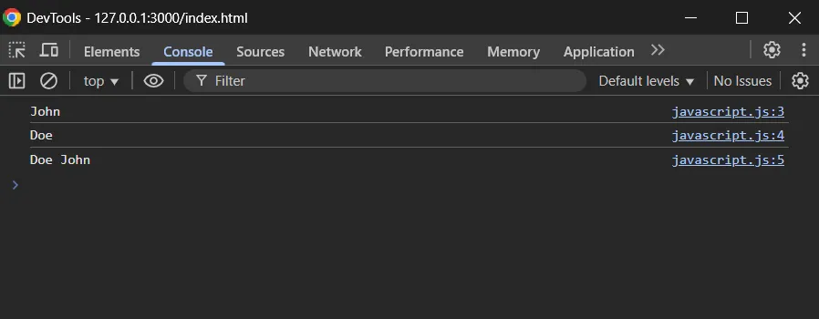

# Day 44 JavaScript Basics - Variables and Operators

Trong phần này, chúng ta sẽ tập trung vào những nguyên tắc cơ bản của JavaScript và cách bạn có thể sử dụng nó để điều khiển mọi tương tác khác nhau giữa trang web và người dùng. Nội dung bài này:

- Chạy mã JavaScript bằng tệp HTML.

- Khai báo biến bằng let và const.

- Thực hiện các phép toán số.

- Thực hiện các phép toán chuỗi.

- Sử dụng các toán tử logic và toán học.

# 1. Cách để chạy JavaScript code
Tất cả JavaScript mà chúng ta sẽ viết trong những bài học đầu sẽ được chạy qua trình duyệt. Các bài học sau chúng ta sẽ học cách để chạy JavaScript bên ngoài môi trường trình duyệt. Bởi vì nếu ngay bây giờ chúng ta chạy JavaScript bên ngoài trình duyệt sẽ có thể gặp phải những lỗi không mong muốn.

Cách đơn giản nhất để bắt đầu là tạo một tệp HTML có mã JavaScript bên trong. Sử dụng VS Code , gõ ! + TAB để tạo bộ khung HTML cơ bản. Đảm bảo bao gồm thẻ `<script>`:
```html
<!DOCTYPE html>
<html lang="en">
<head>
  <meta charset="UTF-8">
  <meta name="viewport" content="width=device-width, initial-scale=1.0">
  <title>Document</title>
</head>
<body>

  <script>
    // Your JavaScript goes here!
    console.log("Hello, World!")
  </script>

</body>
</html>
```
Lưu rồi mở file này trong trình duyệt. Sau đó mở DevTools của trình duyệt. Chuyển đến Console sẽ thấy dòng chữ “Hello, World!”:


### Live Preview
Bạn có thể sử dụng [Live Preview extension](https://marketplace.visualstudio.com/items?itemName=ms-vscode.live-server) trong Visual Studio Code để tự động cập nhật trình duyệt khi bạn lưu tệp thay vì phải làm mới trang thủ công để xem bất kỳ thay đổi nào khi bạn chỉnh sửa mã.

Sau khi cài đặt xong Live Preview, trong VSCode. Nhấp chuột phải vào file index.html, chọn : Open Automatically on Server Start


Sau đó tiếp tục chuột phải vào index.html chọn Show Preview.:


Khi đó sẽ xuất hiện 1 cửa sổ preview ngay trong VSCode:


Ta sẽ địa chỉ của máy chủ webview. Ta chỉ cần copy nguyên dòng URL đó dán vào thanh địa chỉ của trình duyệt Chrome nếu như muốn xem ở trình duyệt ngoài. http://127.0.0.1:3000/index.html

Khi này bất cứ khi nào ta thay đổi code trong file index.html thì bên phía preview sẽ lập tức update mà không cần phải F5 thủ công (chưa cần save bên file nguồn mà ngay lập tức bên giao diện đã update ngay lập tức).

console.log() là lệnh in một cái gì đó vào bảng điều khiển dành cho nhà phát triển trong trình duyệt của bạn (developer console). Bạn có thể sử dụng lệnh này để in kết quả từ bất kỳ bài viết và bài tập nào sau đây vào bảng console. Hãy thực hành viết mã tất cả các bài học chứ không chỉ xem.

Một cách khác để đưa JavaScript vào trang web là thông qua một tập lệnh bên ngoài. Điều này rất giống với việc liên kết các tài liệu CSS bên ngoài với trang web của bạn.
```javascript
<script src="javascript.js"></script>
```
Các tệp JavaScript có phần mở rộng .js tương tự như .css cho các bảng định kiểu. Các tệp JavaScript bên ngoài được sử dụng cho các kịch bản phức tạp hơn.

Chúng ta đặt tên tệp của mình là javascript.js nhưng chúng ta cũng có thể chọn bất kỳ tên nào như my-script.js …. Điều thực sự quan trọng là phần mở rộng .js.

# 2. Variables (Biến)
Biến là nền tảng xây dựng (building blocks) lên bất kỳ chương trình nào. Bạn có thể coi biến là "storage container" cho dữ liệu trong mã của mình.


Bạn có thể khai báo biến bằng từ khóa let: Hãy xem console.log in ra điều gì :
```javascript
let name = "John";
let surname = "Doe";

console.log(name);
console.log(surname);
```

Bạn cũng có thể gán lại (re-assign) giá trị khác cho biến:
```javascript
let age = 11;
console.log(age); // Xuất ra 11 đến console

age = 54;
console.log(age); // Cái gì sẽ được in ra ?
```
Lưu ý rằng không có let ở dòng 4 - chúng ta không cần nó vì biến đã được khai báo trước đó và chúng ta chỉ cần gán lại nó ở đây!

Việc gán lại thì rất tuyệt, nhưng nếu chúng ta không muốn điều đó xảy ra thì sao? Ví dụ, chúng ta có thể có một hằng số pi mà không bao giờ cần phải gán lại. Chúng ta có thể thực hiện điều này bằng cách sử dụng từ khóa const thay vì let:
```javascript
const pi = 3.14;
pi = 10;

console.log(pi); 
```


Khi ta gán 10 cho pi thì 1 lỗi được đưa ra.

Như vậy, có 2 cách để khai báo 1 biến :
- let : Dùng khai báo các biến mà có thể được gán lại giá trị khác.

- const : Khi khai báo thì biến sẽ không thể được gán lại, dùng cho những biến mà có giá trị cố định.

Ngoài ra cần lưu ý rằng trước let, const chúng ta sử dụng cách khai báo với từ khóa var. Đây là cách ban đầu để khai báo biến trong JavaScript, nó tương tự let ở chỗ các biến có thể được gán lại, nhưng nó cũng có những điểm kỳ quặc khác mà đã được giải quyết khi let và const ra đời.

Nhìn dùng var không còn được sử dụng nữa, tuy nhiên có thể chúng ta sẽ bắt gặp mã sử dụng var ở đâu đó, vì vậy biết rằng nó tồn tại là rất hữu ích.

# 3. Numbers (Số)
Numbers là nền tảng của logic lập trình! Trên thực tế, thật khó để nghĩ ra bất kỳ nhiệm vụ lập trình hữu ích nào mà không liên quan đến ít nhất một chút toán học cơ bản… vì vậy, việc biết cách các con số hoạt động rõ ràng là khá quan trọng. May mắn thay, nó cũng khá đơn giản. Ví dụ, biểu thức toán học (3 + 2) - 76 * (1 + 1) cũng là JavaScript hợp lệ. Nếu bạn đưa biểu thức đó vào console.log, nó sẽ đánh giá biểu thức và đưa ra số chính xác. Hãy thử xem!
```javascript
console.log(3+2 - 76 * (1+1));
```
Trong JavaScript, mọi số (number) — dù bạn viết là 1, 3.14, 123456789, hay 0.00001 — đều được lưu trữ theo cùng một định dạng: 64-bit floating point (số thực dấu chấm động 64-bit). JavaScript tuân theo chuẩn IEEE 754 để lưu trữ số thực. Đây là chuẩn toán học toàn cầu dùng cho máy tính để lưu trữ số thực bằng nhị phân. Trong đó:

- Từ bit 0 đến bit 51: Lưu trữ số (phân số) tức là phần trị số/số chính (number (the fraction))

- Từ bít 52 đến bit 63: Lưu trữ số mũ (exponent)

- Và bit 63: Lưu trữ dấu , 0 là +, 1 là - (âm) (sign)

//Đây là định dạng của mọi số thực khi lưu trữ theo chuẩn IEEE 754 
```javascript
(-1)^sign × 1.fraction × 2^(exponent - 1023)
```
Nếu như nhiều ngôn ngữ khác như C, Java, Python, có nhiều kiểu số như: int (số nguyên), float (số thực), long, short, double, v.v. Thì JavaScript thì chỉ có duy nhất 1 kiểu số cho tất cả (trừ BigInt mới được thêm sau này).

JavaScript chỉ có một loại Number, nó có thể được viết có hoặc không có số thập phân.
```javascript
let x = 3.14;    // Một number có phần thập phân
let y = 3;       // Một number không có phần thập phân 
```
Các số cực lớn hoặc cực nhỏ có thể được viết theo ký hiệu e, ví dụ:
```javascript
let x = 123e5;    // 12300000
let y = 123e-5;   // 0.00123
```
Nhớ rằng:

- e trong123e55 là chuẩn viết khoa học (scientific notation) từ các ngôn ngữ như C, C++, Python, Java, v.v.

- 10^x là cách viết của toán học trên giấy, không phải cú pháp của các ngôn ngữ lập trình.

- Không được viết là e2 một mình, Vì e2 không phải là cú pháp hợp lệ trong JavaScript. JavaScript không hiểu e là một toán tử hay biến riêng lẻ. Trong 10e2, e2 chỉ là phần mở rộng của số (một phần của literal), chứ không phải là một biểu thức độc lập.

## 3.1 Độ chính xác của số nguyên
Mặc dù JavaScript không có kiểu int, nhưng nếu bạn viết một số không có dấu chấm hoặc ký hiệu mũ e, thì nó được gọi là số nguyên (integer) về mặt hình thức (cho người đọc dễ nhận biết), dù thực ra vẫn là kiểu number.

Trong JavaScript, tất cả các số nguyên có tối đa 15 ký tự sẽ được biểu diễn chính xác. Nếu vượt quá 15 ký tự sẽ có thể bị làm tròn:
```javascript
let x = 999999999999999;   // 15 chữ số → chính xác
let y = 9999999999999999; // y sẽ được làm tròn 10000000000000000
```

## 3.2 Độ chính xác của số thực
Việc nói “số nguyên” hay “số thực” chỉ để người đọc dễ hiểu, chứ về kỹ thuật thì JavaScript chỉ có kiểu number.

Trong JavaScript kiểu số thực không phải lúc nào cũng đúng, ví dụ:
```javascript
console.log(0.1); //Kết quả in ra là 0.1 
console.log(0.2); //kết quả in ra là 0.2
let x = 0.1 + 0.2;
console.log(x); //kết quả in ra là 0.30000000000000004
```
Tại sao lại như vậy.

Thực ra 0.1 và 0.2 in ra console là giá trị đã được trình duyệt hoặc Node.js làm tròn để người đọc dễ nhìn. Nhưng trong bộ nhớ, 0.1 KHÔNG ĐƯỢC LƯU CHÍNH XÁC tuyệt đối — nó là một giá trị nhị phân xấp xỉ gần nhất với 0.1.

Hãy dùng phương thức .toPrecision() để kiểm tra. Phương thức này dùng để biểu diễn số với số lượng chữ số có nghĩa cụ thể.
```javascript
console.log(0.1.toPrecision(17)); 
//kết quả 0.10000000000000001 với 17 số sau dấu .
console.log(0.2.toPrecision(17)); 
//kết quả 0.20000000000000001 với 17 số sau dấu .
```
Nếu như vậy tại sao khi in 0.1+0.2 thì lại không được làm tròn. Bởi vì với 0.1 và 0.2 khi in riêng ra console thì sai số của nó đủ nhỏ nên sẽ được làm tròn, nhưng với (0.1+0.2) thì sai số được cộng dồn đủ lớn nên sẽ được in ra với sai số.

Vậy có những số thực nào có thể biểu diễn chính xác mà không có sai số không.

Ta biết 0.1 và 0.2 là 1/10 và 2/10 là các số thập phân có thể biểu diễn chính xác trong hệ thập phân. Nhưng các số này lại không thể biểu diễn chính xác trong hệ nhị phân. Cho nên 0.1 và 0.2 khi biểu diễn trong hệ nhị phân cũng tương tự như 1/3 trong hệ thập phân, sẽ các số vô hạn.

Vậy những số thực nào có thể biểu diễn chính xác trong hệ nhị phân. Một số để biểu diễn được chính xác trong hệ nhị phân phải thỏa mãn đủ 2 điều kiện:

- Một là khi ở dạng phân số nó phải có mẫu số dạng 2 mũ n. Ví dụ: 1/2, 3/4, 234/8… vì 2, 4, 8 đều là dạng 2 lũy thừa n.

- Hai là tổng số các chữ số ở dạng thập phân phải dưới 17 ký tự. Nếu mà số ký tự quá lớn thì sẽ không thể biểu diễn chính xác. Đây là giới hạn về độ chính xác của định dạng 64-bit float (IEEE 754 double).

## 3.3 Giải pháp cho vấn đề sai số
Trong ví dụ trên:
```javascript
let x = 0.1 + 0.2;
console.log(x); //kết quả in ra là 0.30000000000000004
```
Vì bản thân 0.1 và 0.2 đều không được biểu diễn chính xác trong hệ nhị phân, nên về bản chất chúng ta đang cộng 2 số được làm tròn, và khi in ra lại là 1 số gần đúng.

Để giải quyết vấn đề này thì cần đảm bảo các tính toán trong quá trình xảy ra giữa các số có thể biểu diễn chính xác trong hệ nhị phân. Chỉ cần làm tròn kết quả cuối cùng nếu nó không thể biểu diễn chính xác trong hệ nhị phân.

Ví dụ nhân với 10 rồi lại chia cho 10:
```javascript
console.log((0.1*10+0.2*10)/10); 
//kết quả hiển thị là 0.3 
```
0.1*10 bằng 1, 0.2*10 bằng 2 là các số nguyên nhỏ, có thể biểu diễn chính xác trong hệ nhị phân. Tổng là 3 cũng được biểu diễn chính xác trong hệ nhị phân.

Kết quả là 3/10 mặc dù không được biểu diễn chính xác trong hệ nhị phân (vì mẫu số 10 không phải là dạng 2 mũ n). Nhưng sai số sẽ ít nhất. Hãy thử xem số này ở 17 ký tự xem bằng bao nhiêu:
```javascript
let x = 3/10;
console.log(x.toPrecision(17));
```
Kết quả: 0.29999999999999999  
Vì vậy nó được làm tròn thành 0.3
# 4. Cộng số và Nối chuỗi
JavaScript dùng toán tử + để cộng (addition ) các số và nối các chuỗi (concatenation).
```javascript
//Cộng 2 số:
let x = 10;
let y = 20;
let z = x + y;
console.log(z);

//kết quả: 30 
//Nối 2 chuỗi 
let x = "10";
let y = "20";
let z = x + y;
console.log(z);

//Kết quả: 1020 
```
Trong phép cộng a + b, nếu một toán hạng là 1 chuỗi thì toàn bộ sẽ bị ép kiểu thành chuỗi.

Trong JavaScript toán tử + sẽ được thực hiện theo thứ tự trừ Trái sang Phải, ví dụ:
```javascript
console.log("This is " + 10 + 20);
//Bước 1: "This is" + 10 sẽ thành "This is 10", đây là 1 chuỗi 
//Bước 2: "This is 10" + 20 sẽ thành "This is 1020"
console.log(10 + 20 + " This is");
//Bước 1: 10 + 20 sẽ bằng 30 vì đây là 2 số
//Bước 2: 30 + " This is" sẽ thành "30 This is". Đây là 1 chuỗi.
```
Khi đảo thứ tự các toán hạng thì kết quả đã khác nhau. 
# 5. Numeric Strings
Numeric string là một chuỗi (string) có chứa giá trị số hợp lệ, tức là chuỗi có thể được chuyển đổi sang kiểu number một cách hợp lệ. Ví dụ:
```javascript
let x = 100;         // x là 1 number

let y = "100";       // y là một number string
```
Riêng toán tử + sẽ hoạt động như phần 4 phía trên (ép số thành chuỗi)

Còn với các toán tử khác như -, *, / thì JavaScript sẽ cố gắng ép kiểu các chuỗi thành số để thực hiện tính toán. Ví dụ:
```javascript
let x = "100";
let y = 10; 
console.log(x/y);  //Kết quả là 10 
console.log(x*y);  //Kết quả là 1000 
console.log(x-y);  //Kết quả là 90 
console.log(x+y);  //Kết quả là "10010", đây là 1 chuỗi 
```
# 6. NaN - Not a Number
NaN là một từ dành riêng của JavaScript cho biết một số không phải là số hợp lệ.

Cố gắng thực hiện phép tính với một chuỗi không phải số sẽ cho kết quả là NaN (Không phải số):


Có thể sử dụng hàm JavaScript toàn cục isNaN() để tìm hiểu xem một giá trị có phải là số hay không:
```javascript
let x = 100 / "10";
console.log(isNaN(x));

//kết quả false, tức là x không phải NaN vì x = 10 là một number 
let x = 100 / "Apple";
console.log(isNaN(x));

//kết quả là true, tức là x là NaN tức là không phải number 
```
Một điều nguy hiểm cần lưu ý là: Khi các phép toán không hợp lệ kiểu như 100/”apple”. Javascript sẽ không báo lỗi mà sẽ trả về NaN.

Nếu trong 1 phép toán chỉ cần có 1 toán hạng là NaN thì kết quả cuối cùng là NaN.

Mặc dù ta không chủ động để đưa 1 toán hạng là NaN vào để tính toán, nhưng dùng nó để gỡ rối , ví dụ:
```javascript
let x = 100 / "Apple";
let y = 100/"10";
console.log(x+y);
```
Nếu kết quả trả về NaN thì chắc chắn là 1 toán hạng nào đó phải là NaN, ta sẽ truy vết ngược lại để tìm ra toán hạng đó.

Tuy nhiên hãy tiếp tục xem ví dụ sau, sử dụng typeof để xem kiểu của phần tử là gì:


Ta thấy y là một NaN và x là một number. Nhưng chúng đều có kiểu là number.

NaN là một number.

typeof NaN sẽ trả về number

# 7. Infinity
Infinity là một number

typeof Infinity sẽ trả về number


Infinity (hoặc -Infinity) là giá trị JavaScript sẽ trả về nếu bạn tính một số nằm ngoài số lớn nhất có thể.

Ví dụ :
```html
<!DOCTYPE html>
<html lang="en">
<head>
    <meta charset="UTF-8">
    <meta name="viewport" content="width=device-width, initial-scale=1.0">
    <title>Document</title>
    <link rel="stylesheet" href="styles.css">
    <script src="./javascript.js"></script>
</head>
<body>
    <h2>JavaScript Numbers</h2>

    <p>Infinity is returned if you calculate a number outside the largest possible number:</p>

    <p id="demo"></p>

</body>
</html>
```
```javascript
//nội dung file javascript ngoài 
//đảm bảo sau khi toàn bộ html và css được tải thì mã javascript mới chạy
//nếu không sẽ phát sinh lỗi 

window.onload = function() { 
let myNumber = 2; 
let txt = "";
while (myNumber != Infinity) {
    myNumber = myNumber * myNumber;
   txt = txt + myNumber + "<br>";
}
document.getElementById("demo").innerHTML = txt;
};
```
Kết quả:
    


Hoặc chia 1 số cho 0:
    


# 8. Hexadecimal (Hệ thập lục phân)
JavaScript sẽ diễn giải các hằng số thành hệ thập lục phân nếu chúng được đặt sau 0x.

Ví dụ:
```javascript
let x = 0xFF;
console.log(x);
//kết quả: 255 
```
Chú ý: Không bao giờ viết số có số 0 đứng đầu (như 07). Một số phiên bản JavaScript diễn giải số này là hệ bát phân nếu chúng được viết có số 0 đứng đầu.

Theo mặc định, JavaScript hiển thị số dưới dạng số thập phân cơ số 10.

Nhưng bạn có thể sử dụng phương thức toString() để xuất số từ cơ số 2 đến cơ số 36.

Hệ thập lục phân là cơ số 16. Hệ thập phân là cơ số 10. Hệ bát phân là cơ số 8. Hệ nhị phân là cơ số 2.
```javascript
let x = 255;
console.log(x.toString(2)); //11111111 trong hệ nhị phân 
console.log(x.toString(8)); //377 trong hệ bát phân 
console.log(x.toString(10)); //255 trong hệ thập phân 
console.log(x.toString(16)); //ff trong hệ hexa, viết đầy đủ là 0xff 
console.log(x.toString(32)); //7v trong hệ 32 
```
# 9. Primitive Number vs Number Object
Các số mà chúng ta thường sử dụng là các số nguyên thủy (Primitive Number).
```javascript
let x = 123; // x là một số nguyên thủy (primitive number)
```
Nhưng các số cũng có thể được định nghĩa thành 1 đối tượng (Object) bằng cú pháp

new Number(), ví dụ:
```javascript
let y = new Number(123); // y là một đối tượng (object) kiểu Number
```
Thực tế trong JavaScript không chỉ có new Number(), còn có new String(), new Boolean().

Tuy nhiên lưu ý là không nên sử dụng new Number(), new String(), new Boolean(). Thay vào đó, hãy sử dụng dữ liệu kiểu nguyên thủy. Bởi vì từ khóa new tạo ra các đối tượng sẽ làm cho mã phức tạp, chậm tốc độ thực thi, và có thể sinh ra những kết quả không mong muốn.

Một câu hỏi đặt ra là: Nếu như không nên sử dụng từ khóa new để tạo ra các Objects, thì tại sao lại tạo ra nó để làm gì?

Câu trả lời là do tính lịch sử: Những ngày đầu khi mới tạo ra JavaScript thì tác giả đã tạo ra các Object bằng từ khóa new. Khi đó có sự vay mượn từ các ngôn ngữ khác.

Tóm lại là: các cú pháp dùng từ khóa new với kiểu dữ liệu nguyên thủy thì không nên dùng nữa. new Number(123), new String(“abc”), new Boolean(true);

Tuy nhiên vẫn dùng new với các kiểu dữ liệu khác (học sau)

# 10. Variable naming (Đặt tên biến)
Quy định đặt tên :
Trong JavaScript, tên biến (identifier) phải tuân theo các quy tắc sau:

- Bắt đầu bằng:

- một chữ cái (a–z, A–Z)

- hoặc ký tự gạch dưới _

- hoặc ký tự $

- Các ký tự tiếp theo có thể là chữ cái, số, _, hoặc $

- Không được bắt đầu bằng số

- Không được trùng với từ khóa của JavaScript (như if, for, let, const, v.v.)

Khi tên chứa nhiều từ, camelCase thường được sử dụng. Nghĩa là: các từ được sắp xếp theo thứ tự, từ đầu tiên trong mỗi từ được viết bằng in hoa, trừ ký tự đầu tiên của biến ví dụ myVeryLongName.

Điều thú vị là – ký hiệu đô la '$' và dấu gạch dưới '_' cũng có thể được sử dụng trong tên biến. Chúng là những ký hiệu thông thường, giống như chữ cái, không có ý nghĩa đặc biệt nào.

Ví dụ các tên biến sau đều hợp lệ về mặt quy tắc:
```javascript
let abc12
let  sb
let _ = 2;
let $ = 1;
let  _a2
let  $12b
let  $14

alert($ + _); //Kết quả bằng 3 
```
Ví dụ sau là tên biến không hợp lệ:
```javascript
let 1a; // không được bắt đầu với chữ cái 

let my-name; // dấu gạch ngang không được phép 
```
### Tên biến là phân biệt chữ Hoa với chữ thường.
Ví dụ Apple và apple là 2 biến khác nhau.

### Các chữ cái không phải chữ Latin:
Được phép, nhưng không khuyến khích. Có thể dùng bất kỳ ngôn ngữ nào, kể cả chữ tượng hình, ví dụ:
```javascript
let имя = '...';
let 我 = '...';
```
Về mặt kỹ thuật, không có lỗi nào ở đây. Những tên như vậy được phép, nhưng có một quy ước quốc tế về việc sử dụng tiếng Anh trong tên biến. Ngay cả khi chúng ta đang viết một tập lệnh nhỏ, nó vẫn có thể tồn tại lâu dài. Những người ở các quốc gia khác có thể cần đọc nó vào một lúc nào đó.

### Tên dành riêng (Reserved names)
Có một [danh sách các từ dành riêng](https://developer.mozilla.org/en-US/docs/Web/JavaScript/Reference/Lexical_grammar#Keywords), không thể dùng làm tên biến vì chúng được chính ngôn ngữ đó sử dụng.

Ví dụ: let, class, return, function …

Đoạn code sau sẽ gây lỗi:
```javascript
let let = 5; // can't name a variable "let", error!
let return = 5; // also can't name it "return", error!
```
### Tạo biến chỉ bằng cách gán khi không dùng use strict
Thông thường trong JS hiện đại ta phải khai báo biến trước bằng let, const trước khi dùng biến đó. Ví dụ:
```javascript
let x = 10;
alert(x); //kết quả 5 
```
Trong các phiên bản JavaScript cũ, bạn có thể tạo ra biến chỉ bằng cách gán giá trị cho nó mà không cần let, var, hay const. Code vẫn hoạt động trong trình duyệt hiện nay nếu chúng ta không sử dụng chế độ nghiêm ngặt (use strict) trong script để duy trì sự tương thích với các script cũ.

// khi không bật "use strict" 
```javascript
num = 5; // biến "num" được tạo nếu nó chưa tồn tại trước đó
alert(num); // 5
```


Nhưng khi chế độ nghiêm ngặt (use strict) được bật lên thì việc dùng biến mà không khai báo với let, const là một bad practice và sẽ gây ra lỗi:
```javascript
"use strict";

num = 5; // error: num is not defined
```

### Cách bật chế độ "use strict" trong JavaScript
- Bật cho toàn bộ file/script: Đặt dòng "use strict"; ngay dòng đầu tiên của file .js. Lưu ý: Dòng "use strict"; phải nằm ở đầu toàn bộ script. Nếu bạn đặt sau một dòng khác, nó sẽ không có tác dụng.

- Bật strict mode cho một hàm cụ thể: Bạn có thể chỉ bật strict mode bên trong một hàm nếu không muốn ảnh hưởng toàn bộ file. Ví dụ:
```javascript
function myFunction() {
  "use strict";
  let x = 20;
  console.log(x);
}
```
- Dùng type="module" trong HTML khi import file .js từ bên ngoài. Khi đó strict mode được bật mặc định, không cần viết "use strict";
```javascript
<script type="module" src="javascript.js"></script>
```
**Trong các môi trường hiện đại nên bật chế độ nghiêm ngặt để đảm bảo an toàn:**

- Báo lỗi nếu bạn gán giá trị cho biến chưa khai báo

- Ngăn bạn đặt tên biến trùng với từ khóa (let, eval, arguments)

- Giúp bạn viết code an toàn và dễ debug hơn

# 11. Basic operators, maths
## 2.1 “unary”, “binary”, “operand”
Trước khi tiếp tục, chúng ta cần nắm 1 số thuật ngữ:

Toán hạng (An operand) – là cái mà các toán tử (operator) áp dụng lên nó. Ví dụ trong phép nhân 5 * 2 thì có 2 toán hạng, toán hạng trái là 5 và toán hạng phải là 2. Thi thoảng mọi người cũng gọi là “đối số (argument) thay vì toán tử.

Một toán tử là toán tử đơn (unary) nếu nó chỉ có 1 toán hạng. Ví dụ toán tử - để đảo ngược dấu của 1 số:
```javascript
let x = 1;

x = -x;
alert( x ); // -1, unary được áp dụng 
```
Một toán tử là toán tử kép (binary) nếu nó có 2 toán hạng. Toán tử - cũng tồn tại ở dạng kép:
```javascript
let x = 1, y = 3;
alert( y - x ); // 2, Toán tử kép trừ 2 số
```
## 2.2 Maths
Các phép toán sau đây được hỗ trợ:

Addition +, (Cộng)

Subtraction -, (Trừ)

Multiplication *, (Nhân)

Division /, (Chia)

Remainder %, (Phần dư)

Exponentiation **. (số mũ)

Bốn toán tử đầu tiên khá dễ hiểu, trong khi % và ** cần một vài từ để giải thích.

### Remainder % (còn gọi là Modulo)
Toán tử % (không liên quan đến phần trăm) là toán tử phần dư. Trong phép toán a%b sẽ trả về phần dư của phép chia 2 số nguyên. Ví dụ:
```javascript
alert( 5 % 2 ); // 1, phần dư của 5 chia cho 2 
alert( 8 % 3 ); // 2, phần dư của 8 chia cho 3
alert( 8 % 4 ); // 0, phần dư của 8 chia cho 4 
```
### Exponentiation **
Toán tử lũy thừa a ** b có cách viết toán học trong trường học là ab. Là a mũ b hay a lũy thừa b. Ví dụ:
```javascript
alert( 2 ** 2 ); // 2² = 4
alert( 2 ** 3 ); // 2³ = 8
alert( 2 ** 4 ); // 2⁴ = 16
```
Trong toán hạng trên thì 2 toán tử a và b có thể không cần là số nguyên: Ví dụ:
```javascript
alert( 4 ** (1/2) ); // 2, chính là căn bậc 2 của 4 
alert( 8 ** (1/3) ); // 2 , chính là căn bậc 3 của 8
alert( 25 ** (1/3) ); // 2.924017738212866 , là căn bậc 3 của 25
```
## 2.3 Nối chuỗi với toán tử kép +
Xem bài trước đã nói về điều này. Hãy ôn tập 1 chút, thử xem kết quả các ví dụ này là gì:
```javascript
let s = "my" + "string";
alert(s); //kết quả ?
alert( '1' + 2 ); 
alert( 2 + '1' ); 
alert(2 + 2 + '1' ); 
alert('1' + 2 + 2); 
```
Nhắc lại: Chỉ có toán tử kép + sẽ hỗ trợ strings, và ép kiểu number về strings. Còn các toán tử số học khác sẽ chỉ làm việc với numbers và luôn cố gắng ép kiểu các toán hạng về numbers
```javascript
alert('6' + '2'); // kết quả là chuỗi '62'
alert('6' + 2) ; //kết quả là chuỗi '62'
alert( 6 - '2' ); // 4, ép kiểu '2' thành 2 
alert( '6' / '2' ); // 3, ép kiểu tất cả toán hạng thành number 
aleart( '6' ** '2'); //36
```
## 2.4 Chuyển đổi số sử dụng unary + (toán tử cộng đơn)
Toán tử + tồn tại cả ở 2 dạng là dạng kép (binary) và dạng đơn (unary).

Với toán tự unary + nếu được áp dụng cho một number thì sẽ không có điều gì thay đổi. Tuy nhiên nếu toán hạng không phải là 1 number thì toán tử unary + sẽ chuyển đổi nó thành number. Ví dụ:
```javascript
// unary + không ảnh hưởng gì đến number 
let x = 1;
alert( +x ); // 1

let y = -2;
alert( +y ); // -2

// Chuyển đổi toán hạng non-numbers thành number 
alert( +true ); // 1
alert( +"" );   // 0
```
Điều này tương tự như sử dụng Number(...), nhưng mà ngắn gọn hơn. Thay vì viết Number(true); thì chỉ cần +true;

Nhu cầu cần chuyển đổi các strings thành numbers rất thường xuyên. Ví dụ, chúng ta nhận các values từ HTML form mà người dùng điền vào, chúng thực sự là các strings. Vậy giờ chúng ta muốn cộng chúng thì làm thế nào.

Toán tử kép binary + sẽ nối 2 chuỗi:
```javascript
let apples = "2";
let oranges = "3";

alert( apples + oranges ); // "23" 
```
Nếu chúng ta muốn xử lý chúng như các numbers chúng ta cần phải chuyển đổi chúng thành number rồi mới cộng chúng:
```javascript
let apples = "2";
let oranges = "3";

// biến thể dài dòng 
// alert( Number(apples) + Number(oranges) ); // 5

// biến thể ngắn gọn 
alert( +apples + +oranges ); // 5
```
Trong biến thể ngắn gọn hoạt động như sau:

- Đầu tiên toán tử đơn unary + sẽ chuyển chuỗi thành số, tức là +apples thành 2, +oranges thành 3.

- Sau đó toán tử kép binary + sẽ cộng 2 số lại, kết quả là 5.

Toán tử unary+ có mức độ ưu tiên cao hơn so với toán tử binary + (higher precedence)

Từ quan điểm của 1 nhà toán học thì có nhiều loại toán tử + có vẻ lạ, nhưng với các lập trình viên thì không có gì đặc biệt.

## 2.4 Operator precedence
Nếu một biểu thức có nhiều hơn một toán tử, thứ tự thực thi được xác định theo thứ tự ưu tiên (precedence) của chúng, hay nói cách khác, là thứ tự ưu tiên mặc định của các toán tử.

Từ hồi đi học, chúng ta đều biết rằng phép nhân trong biểu thức 1 + 2 * 2 phải được tính trước phép cộng. Đó chính xác là thứ tự ưu tiên. Phép nhân được cho là có thứ tự ưu tiên cao hơn phép cộng.

Dấu ngoặc đơn ghi đè bất kỳ thứ tự ưu tiên nào, vì vậy nếu chúng ta không hài lòng với thứ tự mặc định, chúng ta có thể sử dụng chúng để thay đổi thứ tự đó. Ví dụ, hãy viết (1 + 2) * 2.

Có nhiều toán tử trong JavaScript. Mỗi toán tử có một số thứ tự ưu tiên tương ứng. Toán tử có số lớn hơn sẽ thực thi trước. Nếu thứ tự ưu tiên giống nhau, thứ tự thực thi sẽ từ trái sang phải.

[Xem bảng ưu tiên ở đây](https://developer.mozilla.org/en-US/docs/Web/JavaScript/Reference/Operators/Operator_precedence#table). Bạn không cần nhớ, nhưng chú ý rằng unary operators có thứ tự ưu tiên cao hơn binary operator tương ứng.

Ví dụ toán tử unary + có thứ tự là 14, còn binary + có thứ tự là 11. Vì vậy unary + sẽ thực hiện trước binary +.

**Thứ tự ưu tiên của toán tử hay Độ ưu tiên (precedence):**
- Quyết định toán tử nào được gắn với toán hạng nào trước (tức là phân tích cú pháp, chứ chưa thực hiện gì cả).

- Còn Thứ tự thực thi (execution order): Quyết định giá trị nào được tính toán trước tại thời điểm chạy chương trình.


## 2.5 Assignment (Phép gán)
Hãy lưu ý rằng phép gán = cũng là một toán tử. Nó được liệt kê trong bảng ưu tiên với mức ưu tiên rất thấp là 2.

Đó là lý do tại sao khi chúng ta gán một biến, như x = 2 * 2 + 1, các phép tính được thực hiện trước rồi sau đó toán tử = mới được thư hiện, lưu trữ kết quả trong x.
```javascript
let x = 2 * 2 + 1;

alert( x ); // 5
```
### Assignment = returns a value
Thực tế thì ký hiệu = là một toán tử, không phải là 1 cái gì đó ma thuật, hoặc đặc biệt.

Tất cả các toán tử trong JavaScript đều trả về 1 giá trị (value). Toán tử +, - thì quá rõ ràng rồi. Nhưng toán tử gán như = cũng vậy.

Phép toán x = value sẽ:

- “Ghi” giá trị value cho biến x

- Trả về giá trị đó. (return a value)

Ví dụ sau sử dụng một toán tử gán như là 1 phần của 1 biểu thức phức tạp:
```javascript
let a = 1;
let b = 2;

let c = a + b - (a = b +1);

alert( a ); // 3
alert( c ); // 0
```
Trong ví dụ này thì toán tử binary + và binary - có thứ tự ưu tiên ngang nhau nên sẽ thực hiện từ trái qua phải. Đầu tiên là a + b = 3;

Tiếp theo trong ngoặc đơn thì toán tử binary + có mức ưu tiên cao hơn toán tử gán = nên đầu tiền b+1 bằng 3, sau đó gán cho a = 3 và trả về giá trị 3 cho biểu thức trong ngoặc.

Kết quả cuối cùng là a = 3 và c = 0;

Khá thú vị đúng không. Chúng ta nên hiểu cách mà nó hoạt động, bởi vì thỉnh thoảng chúng ta sẽ nhìn thấy nó trong các thư viện JavaScript.

Tuy nhiên, vui lòng không viết code giống như vậy. Nó sẽ không khiến code sạch sẽ hoặc là dễ đọc hơn.

### Chaining assignments (nối các phép gán)
Một tính năng thú vị khác là khả năng nối các phép gán liên tục:
```javascript
let a, b, c;

a = b = c = 2 + 2;

alert( a ); // 4
alert( b ); // 4
alert( c ); // 4
```
Các phép gán trong 1 chuỗi sẽ được thực hiện từ Phải sang trái .

Đầu tiên, biểu thức ngoài cùng bên phải 2 + 2 được thực hiện và sau đó được gán cho các biến bên trái: c, b và a. Cuối cùng, tất cả các biến chia sẻ một giá trị duy nhất.

Một lần nữa, vì mục đích dễ đọc, tốt hơn là chia đoạn mã này thành vài dòng. Điều này giúp dễ đọc hơn, đặc biệt là khi quét mã nhanh bằng mắt:
```javascript
c = 2 + 2;
b = c;
a = c;
```
### Toán tử “modify-and-assign”
Chúng ta thường có nhu cầu áp dụng 1 toán tử đến một biến và rồi lưu ngay kết quả mới vào đúng biến đó. ví dụ:
```javascript
let n = 2;
n = n + 5;
n = n * 2;
```
Việc tính toán và gán lại cho chính biến đó được gọi là modify-and-assign, và có dạng viết ngắn gọn là: += và *=
```javascript
let n = 2;
n += 5; // n = 7 (giống như n = n + 5)
n *= 2; // n = 14 (giống như n = n * 2)

alert( n ); // 14
```
Các toán tử “modify-and-assign” tồn tại cho tất cả các toán tử Arithmetical Operators (Toán tử số học) và Bitwise Operators (Toán tử thao tác bit) như: *=, /=, +=, -=

Các toán tử modify-and-assign có mức độ ưu tiên thấp giống như toán tử gán = . Ví dụ:
```javascript
let n = 2;

n *= 3 + 5; // bên phải tính toán trước , giống như n *= 8

alert( n ); // 16
```
## 2.6 Toán tử Increment/decrement (++/--)
Tăng hoặc giảm một số là một trong những hoạt động phổ biến nhất. Vì vậy có những toán tử đặc biệt dành cho nó:

Toán tử ++ để tăng một biến lên 1 đơn vị:
```javascript
let counter = 2;
counter++;        // Giống như counter = counter + 1, nhưng ngắn gọn hơn 
alert( counter ); // 3
```
Toán tử -- giảm một biến xuống 1 đơn vị:
```javascript
let counter = 2;
counter--;        // giống như counter = counter - 1, nhưng ngắn gọn hơn
alert( counter ); // 1
```
### Lưu ý quan trọng:
Toán tử ++/-- chỉ có thể áp dụng cho các biến khai báo với let. Thử sử dụng nó trên một giá trị như 5++ hoặc cho một biến khai báo với const sẽ cho ra lỗi.

**postfix form vs prefix form**

Toán tử ++/-- có thể được đặt trước hoặc sau biến. Khi đặt sau biến nó là dạng “postfix form”, ví dụ: counter++. Khi đặt trước biết nó là dạng “prefix form”, ví dụ: ++counter.

Tuy nhiên khi đó giá trị trả về của chúng là khác nhau . Ta biết tất cả các toán tử đều trả về 1 giá trị. Toán tử ++/-- cũng không ngoại lệ.
```javascript
let counter = 1;
let a = ++counter; //tăng counter lên 1 đơn vị trước, sau đó gán kết quả cho a.

alert(a); // 2
alert(counter); //2
let counter = 1;
let a = counter++; //gán giá trị của counter cho a trước, sau đó tăng counter lên 1 đơn vị 

alert(a); // 1
alert(counter);//2 
```
Ở 2 ví dụ trên là ta sử dụng toán tử ++/-- cùng với phép gán, sẽ khá dễ hiểu. Tiếp theo ta sẽ xem 3 ví dụ sau:

//nếu kết quả của ++/-- không được sử dụng, thì không có sự khác biệt giữa postfix form và prefix form
```javascript
let counter = 0;
counter++; //tăng lên 1 
++counter; //tăng lên 1 nữa 
alert( counter ); // 2
//Nếu chúng ta muốn tăng giá trị và sử dụng ngay kết quả của toán tử, chúng ta cần dạng prefixform:


let counter = 0;
alert( ++counter ); // 1, tăng lên 1 rồi dùng giá trị đó cho alert()
alert( counter); // 1 
//Nếu chúng ta muốn tăng 1 giá trị nhưng không sử dụng ngay giá trị mới, mà dùng giá trị cũ trước đó, thì dùng postfixform

let counter = 0;
alert( counter++ ); //0, sử dụng giá trị cũ cho alert(), rồi mới tăng lên
alert( counter ); //1 giá trị mới sau khi được tăng lên 
```
### Sử dụng toán tử ++/-- giữa các toán tử khác
Các toán tử ++/-- có thể được dùng bên trong các biểu thức. Độ ưu tiên của chúng cao hơn hầu hết các toán tử toán học ([xem bảng ưu tiên](https://developer.mozilla.org/en-US/docs/Web/JavaScript/Reference/Operators/Operator_precedence#table)):
```javascript
let counter = 1;
alert( 2 * ++counter ); // 4
Trong ví dụ trên, counter đầu tiên tăng lên 2, sau đó mới nhân với 2 và bằng 4.

let counter = 1;
alert( 2 * counter++ ); // 2,
```
Như đã nói ở trên toán tử ++ có độ ưu tiên cao hơn *, nên có thể chúng ta sẽ cho rằng counter++ được thực hiện trước, sau đó mới nhân với 2 và kết quả bằng 4.

Nhưng cần lưu ý rằng: Độ ưu tiên của toán tử là nói đến khía cạnh toán tử đó được gắn với toán hạng nào, chứ không phải thứ tự thực hiện. Ví dụ a + b * c thì toán tử * gắn với b, c còn toán tử + thì gắn với a và (b*c) chứ toán tử + không gắn với b. Tức là nếu nhìn vào toán hạng b, nó có 2 toán từ + và * ở 2 bên, vì toán tử * có độ ưu tiên cao hơn nên b sẽ gắn với * chứ không gắn với +.

Vì vậy trong ví dụ trên, 2 * counter++ thì có thể viết thành 2 * (counter++) vì ++ gắn với counter. Và (counter++) sẽ trả về giá trị cũ của counter để sử dụng ngay cho phép nhân.

Mặc dù về mặt kỹ thuật thì ổn, nhưng ký hiệu như vậy thường khiến mã khó đọc hơn. Một dòng thực hiện nhiều việc – không tốt.

Khi đọc mã, việc quét mắt “theo chiều dọc” nhanh có thể dễ dàng bỏ sót một số thứ như counter++ và sẽ không rõ ràng rằng biến đã tăng.

Vì vậy nên sử dụng kiểu “một dòng – một hành động”:
```javascript
let counter = 1;
alert( 2 * counter );
counter++;
```
## 2.7 Các toán tử Bit (Bitwise operators)
Các toán tử bitwise xử lý các đối số như các số nguyên 32 bit và hoạt động ở cấp độ biểu diễn nhị phân của chúng.

Các toán tử này không dành riêng cho JavaScript. Chúng được hỗ trợ trong hầu hết các ngôn ngữ lập trình.

Danh sách các toán tử:
- AND ( & )

- OR ( | )

- XOR ( ^ )

- NOT ( ~ )

- LEFT SHIFT ( << )

- RIGHT SHIFT ( >> )

- ZERO-FILL RIGHT SHIFT ( >>> )

Các toán tử này rất hiếm khi được sử dụng, khi chúng ta cần phải xử lý các con số ở mức thấp nhất (bitwise). Chúng ta sẽ không cần đến các toán tử này trong thời gian tới, vì phát triển web ít sử dụng chúng, nhưng trong một số lĩnh vực đặc biệt, chẳng hạn như mật mã (cryptography), chúng lại hữu ích. Bạn có thể đọc chương [Toán tử Bitwise trên MDN khi cần.](https://developer.mozilla.org/en-US/docs/Web/JavaScript/Guide/Expressions_and_Operators#bitwise_operators)

## 2.8 Toán tử Comma (dấu phẩy)
Toán tử dấu phẩy , là một trong những toán tử hiếm và ít dùng nhất. Đôi khi, nó được sử dụng để viết mã ngắn hơn, vì vậy chúng ta cần biết nó để hiểu những gì đang diễn ra.

Toán tử dấu phẩy cho phép chúng ta đánh giá nhiều biểu thức, chia chúng bằng dấu phẩy ,. Mỗi biểu thức được đánh giá nhưng chỉ trả về kết quả của biểu thức cuối cùng:
```javascript
let a = (1 + 2, 3 + 4);

alert( a ); // 7 (kết quả của 3 + 4)
```
Ở đây, biểu thức đầu tiên 1 + 2 được đánh giá và kết quả của nó bị loại bỏ. Sau đó, 3 + 4 được đánh giá và trả về dưới dạng kết quả.

**Toán tử dấu phẩy có độ ưu tiên rất thấp**  
Xin lưu ý rằng toán tử dấu phẩy có mức độ ưu tiên rất thấp, thấp hơn =, do đó dấu ngoặc đơn rất quan trọng trong ví dụ trên.

Không có cặp ngoặc đơn thì : a = 1 + 2, 3 + 4 đầu tiên là toán tử + cộng các số thành a = 3, 7, sau đó toán tử gán = gán a = 3, và phần còn lại bị bỏ qua. Giống như (a = 1 + 2), 3 + 4.

Tại sao chúng ta cần một toán tử loại bỏ mọi thứ ngoại trừ biểu thức cuối cùng? Đôi khi, mọi người sử dụng nó trong các cấu trúc phức tạp hơn để đưa nhiều hành động vào một dòng. Ví dụ:
```javascript
// 3 toán tử trên 1 dòng
for (a = 1, b = 3, c = a * b; a < 10; a++) {
 ...
}
```
Những trick (thủ thuật, kỹ thuật) như vậy được sử dụng trong nhiều Framework JavaScript. Đó là lý do tại sao chúng ta đề cập đến chúng. Nhưng thông thường chúng không cải thiện khả năng đọc mã nên chúng ta nên suy nghĩ kỹ trước khi sử dụng chúng.

## 2.9 toFixed() method
Làm tròn 1 số thập phân đến số chữ số thập phân được chỉ định sau dấu chấm.
```javascript
const a = 1.798523075;
const b = a.toFixed(3);   //làm tròn đến 3 chữ số phần thập phân 
console.log(a); //1.798523075
console.log(b);  //1.799
```
## 2.10 Number();
Trả về một number của một chuỗi mà có nội dung bên trong là chuỗi.
```javascript
console.log(typeof Number("75.423"));  //number 
```
Phần trước ta đã học sử dụng toán tử unary + cũng có tác dụng tương tự.
```javascript
let a = "15";
let b = +a;        //15
let c = Number(a); //15
```
# Tasks (Thực hành bài tập)
//The postfix và prefix forms
```javascript
let a = 1, b = 1;

console.log(++a); //?
console.log(a); //?
console.log(b++); //?
console.log(b); //?
```
```javascript
//Toán tử gán 
let a = 2;

let x = 1 + (a *= 2);
console.log(a); //?
console.log(x); //?
```
```javascript
//Đổi kiểu, ép kiểu 

"" + 1 + 0      //?
"" - 1 + 0      //?
true + false      //?
6 / "3"      //?
"2" * "3"      //?
4 + 5 + "px"      //?
"$" + 4 + 5      //?
"4" - 2      //?
"4px" - 2      //?
"  -9  " + 5      //?
"  -9  " - 5      //?
null + 1      //?
undefined + 1      //?
" \t \n" - 2      //?
```
```javascript
//Vì sao kết quả là 12, hãy sửa lại a + b để kết quả bằng 3 

let a = prompt("First number?", 1);
let b = prompt("Second number?", 2);

Console.log(a + b); // 12
```
# 12. Comparison operators (Toán tử so sánh)
Đôi khi chúng ta muốn chạy các bài kiểm tra true/false, sau đó hành động theo kết quả của bài kiểm tra đó — để thực hiện việc này, chúng ta sử dụng các toán tử so sánh.


Lưu ý: Bạn có thể thấy một số người sử dụng == và != trong các bài kiểm tra của họ về sự bằng nhau và không bằng nhau. Đây là các toán tử hợp lệ trong JavaScript, nhưng chúng khác với ===/!==.

== và != kiểm tra xem các giá trị có giống nhau không nhưng không kiểm tra xem kiểu dữ liệu của các giá trị (values' datatypes) có giống nhau không. Đây là kiểu so sánh lỏng lẻo, chúng sẽ cố gắng ép kiểu các toán hạng để so sánh giá trị của chúng.
```javascript
"1" == 1; //true, vì "1" bị ép kiểu thành 1 
```
===/!== (Các phiên bản nghiêm ngặt, không ép kiểu) kiểm tra sự bằng nhau của cả các giá trị và kiểu dữ liệu của chúng. Các phiên bản nghiêm ngặt có xu hướng dẫn đến ít lỗi hơn, vì vậy chúng ta nên sử dụng chúng.
```javascript
"1" === 1; //false, vì giá trị bên trong thì giống nhau, nhưng 1 cái là kiểu chuỗi, 1 cái là kiểu number.
```
Các toán tử so sánh trả về true/false rất hữu ích vì cho phép chúng ta thực hiện các quyết định trong code của chúng ta. Chúng được sử dụng mỗi lần mà chúng ta muốn thực hiện 1 lựa chọn. Ví dụ như:

Hiển thị đúng Label trên 1 Button tùy thuộc vào một tính năng được On/Off

Hiển thị Gameover Message nếu một game bị over hoặc Victory Message nếu chiến thắng …

Hãy làm ví dụ sau để thấy tác dụng của toán tử so sánh:
```html
//mã HTML
<!DOCTYPE html>
<html lang="en">
<head>
    <meta charset="UTF-8">
    <meta name="viewport" content="width=device-width, initial-scale=1.0">
    <title>Document</title>
    <link rel="stylesheet" href="styles.css">

    //defer sẽ đảm bảo mã .js chạy sau khi html và css đã tải xong 
    <script src="./javascript.js" defer></script>  
</head>
<body>
    <button>Start machine</button>
    <p>The machine is stopped.</p>

</body>
</html>
```
```css
//mã CSS
* {
    margin: 0;
    padding: 0;
    box-sizing: border-box;
}

body {
    font-family: 'Courier New', Courier, monospace;
    padding: 20px;
}

button {
    padding:5px 15px;
    border-radius: 10px;
    background-color: green;
}
```
```javascript
//mã JavaScript
const btn = document.querySelector("button");
const txt = document.querySelector("p");

btn.addEventListener("click", updateBtn);

function updateBtn() {
    if(btn.textContent === "Start machine") {
        btn.textContent = "Stop machine";
        txt.textContent = "The machine has started!";
        btn.style.backgroundColor = "red";
        
    }
    else {
        btn.textContent = "Start machine";
        txt.textContent = "The machine is stopped.";
        btn.style.backgroundColor = "Green";
    }
}
```
[**`Có thể xem kết quả (tương tự) tại đây!`**](https://mdn.github.io/learning-area/javascript/introduction-to-js-1/maths/conditional.html)

Lưu ý: Một điều khiển như vậy hoán đổi giữa hai trạng thái thường được gọi là toggle. Nó chuyển đổi giữa trạng thái này sang trạng thái khác — ví dụ đèn bật, đèn tắt, v.v.

# 13. [**`Danh sách đầy đủ JavaScript Operator Precedence`**](https://www.w3schools.com/js/js_precedence.asp)