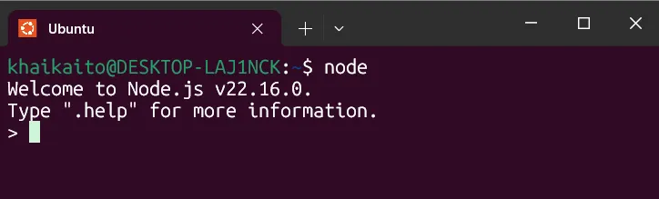
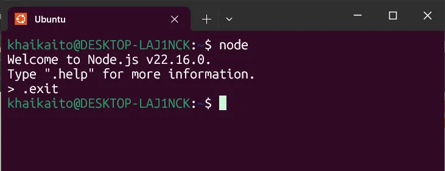

# Day 45:  Cài đặt Node.js 


Bài này chúng ta sẽ tìm hiểu:
Node.js là gì?

- Mục đích sử dụng của nó?

- Những lợi ích của việc sử dụng nó so với các công nghệ backend khác?

- Và Tại sao nó là một lựa chọn phổ biến trong ngành.

# 1. Node.js là gì ?
Node.js là môi trường chạy JavaScript (JavaScript runtime environment) mã nguồn mở và đa nền tảng để cho phép bạn chạy JavaScript bên ngoài trình duyệt web của mình. Nó không phải là một ngôn ngữ lập trình hay một framework, mà là một môi trường cho phép JavaScript hoạt động ở phía máy chủ. Khi chúng ta deploy ứng dụng lên 1 máy chủ nào đó, có thể máy chủ đó đã cài sẵn môi trường Node.js (nếu không thì chúng ta có thể tự cài đặt).

Chúng ta sẽ cần môi trường này cho một số bài tập trong các bài học sắp tới. Để bắt đầu, có một số công cụ bắt buộc mà chúng ta cần trước khi có thể cài đặt Node trên hệ thống của mình. Việc cài Node.js trên máy của chúng ta là tạo ra một môi trường để chạy, kiểm tra trước khi deploy ứng dụng lên máy chủ.

# 2. Mục đích chính của Node.js
Node.js chủ yếu được sử dụng để "xây dựng các dịch vụ backend, còn được gọi là API (giao diện lập trình ứng dụng)." Các dịch vụ backend này là những dịch vụ cung cấp sức mạnh cho các ứng dụng của chúng ta như một ứng dụng web chạy bên trong trình duyệt web hoặc ứng dụng di động chạy trên thiết bị di động. Các ứng dụng này cần giao tiếp với các dịch vụ trên máy chủ để thực hiện các chức năng như lưu trữ dữ liệu, gửi email, gửi thông báo đẩy, và khởi động các luồng công việc.

Node.js "lý tưởng để xây dựng các dịch vụ backend có khả năng mở rộng cao, chuyên sâu về dữ liệu và thời gian thực" cung cấp sức mạnh cho các ứng dụng khách hàng.

# 3. Tại sao chọn Node.js so với các công cụ/framework khác?
Mặc dù có nhiều công cụ và framework khác để xây dựng dịch vụ backend (như ASP.NET, Ruby on Rails, Django), Node.js nổi bật nhờ một số lợi thế đáng kể:

>Dễ bắt đầu và phát triển nhanh chóng: Node.js dễ bắt đầu và có thể được sử dụng để tạo mẫu và phát triển nhanh.

>Hiệu suất và khả năng mở rộng cao: Nó có thể được sử dụng để "xây dựng các dịch vụ siêu nhanh và có khả năng mở rộng cao."

    Ví dụ của PayPal: PayPal đã xây dựng lại một trong các ứng dụng dựa trên Java và Spring của họ bằng Node.js và nhận thấy rằng ứng dụng Node "được xây dựng nhanh gấp đôi với ít người hơn, ít hơn 33% dòng mã và ít hơn 40% tệp." Quan trọng hơn, họ "tăng gấp đôi số lượng yêu cầu được phục vụ mỗi giây trong khi giảm thời gian phản hồi trung bình 35%." Điều này nhấn mạnh Node.js là một "lựa chọn tuyệt vời để xây dựng các dịch vụ có khả năng mở rộng cao."

>Tái sử dụng kỹ năng JavaScript: Một lợi thế đáng kể là việc sử dụng JavaScript trong các ứng dụng Node. Nếu một nhà phát triển đã là "nhà phát triển front-end và biết JavaScript," họ có thể "tái sử dụng kỹ năng JavaScript của mình và trở thành một nhà phát triển full-stack và có một công việc tốt hơn với mức lương cao hơn." Điều này giúp tránh việc phải học một ngôn ngữ lập trình mới.

>Mã nguồn sạch hơn và nhất quán hơn: Vì JavaScript có thể được sử dụng cả ở front-end và back-end, "mã nguồn của bạn sẽ sạch hơn và nhất quán hơn," sử dụng "các quy ước đặt tên giống nhau, các công cụ giống nhau và các phương pháp hay nhất giống nhau."

>Hệ sinh thái thư viện mã nguồn mở lớn nhất: Node.js có "hệ sinh thái thư viện mã nguồn mở lớn nhất hiện có." Điều này có nghĩa là "đối với hầu hết mọi tính năng hoặc khối xây dựng bạn muốn thêm vào ứng dụng của mình, có một thư viện mã nguồn mở miễn phí ở ngoài kia mà bạn có thể sử dụng." Điều này cho phép các nhà phát triển "không phải xây dựng các khối xây dựng này từ đầu và thay vào đó có thể tập trung vào phần cốt lõi của ứng dụng của bạn."

Tóm lại, Node.js là một công cụ mạnh mẽ và linh hoạt cho các ứng dụng phía máy chủ, mang lại lợi ích về tốc độ phát triển, hiệu suất, khả năng mở rộng và khả năng tận dụng các kỹ năng JavaScript hiện có.

# 4. Cài đặt Node.js (với Linux) từng bước
## 4.1 Cài đặt curl
curl là viết tắt của Client for URLs

Để cài đặt nvm đúng cách, bạn sẽ cần curl. Chạy lệnh bên dưới để cài đặt curl:
```
sudo apt install curl
```
Lưu ý: Bạn có thể cần cập nhật danh sách gói Ubuntu lên phiên bản mới nhất để cài đặt Curl hoàn tất. Nếu vậy, hãy chạy lệnh bên dưới:
```
sudo apt update && sudo apt upgrade
```
## 4.2 Cài đặt nvm
`nvm` (Node Version Manager) là trình quản lý phiên bản Node, nó giúp dễ dàng thay đổi phiên bản Node và nâng cấp Node. Việc cài đặt Node bằng nvm cũng rất dễ dàng.

Chạy lệnh này để cài đặt nvm:
```
curl -o- https://raw.githubusercontent.com/nvm-sh/nvm/v0.40.1/install.sh | bash
```
Có một công cụ khác có tên là `npm` mà sau này chúng ta sẽ sử dụng để cài đặt các thư viện và công cụ khác nhau được sử dụng trong môi trường JavaScript. Có thể dễ nhầm lẫn giữa hai công cụ này, vì vậy hãy đọc kỹ!

## 4.3 Khởi tạo nvm
Trong terminal sẽ có một số hướng dẫn về cách khởi tạo nvm. Nếu không, (hoặc nếu bạn không muốn sao chép từ terminal), hãy chạy các lệnh sau:
```
export NVM_DIR="$([ -z "${XDG_CONFIG_HOME-}" ] && printf %s "${HOME}/.nvm" || printf %s "${XDG_CONFIG_HOME}/nvm")"
[ -s "$NVM_DIR/nvm.sh" ] && \. "$NVM_DIR/nvm.sh" # This loads nvm
```
Bạn có thể xác minh nvm đã được cài đặt bằng cách chạy lệnh:
```
command -v nvm
```
Nếu lệnh trả về lỗi nvm: command not found, hãy đóng terminal và mở lại.

Nếu trả về nvm thì là đã cài đặt thành công.

[Với MacOS để cài đặt nvm thì xem tại đây](https://github.com/nvm-sh/nvm#installation-and-update)

## 4.4 Cài đặt Node
Sau khi đã cài đặt nvm, chúng ta có thể cài đặt Node. Chạy lệnh sau:
```
nvm install --lts
```
Thao tác này sẽ cài đặt phiên bản ổn định mới nhất của Node trong ‘hỗ trợ dài hạn’ (‘long-term support’ (LTS)) và bạn sẽ thấy rất nhiều kết quả đầu ra trong terminal.

Nếu mọi thứ hoạt động đúng, bạn sẽ thấy một cái gì đó tương tự như thế này ở đâu đó trong các dòng đầu ra (với các X được thay thế bằng các con số thực tế):
```
Downloading and installing Node vXX.xx.x...
```
Nếu không, hãy đóng terminal, mở lại và chạy lại lệnh nvm install --lts

## 4.5 Thiết lập phiên bản Node
Chúng ta cần cho nvm biết phiên bản Node nào sẽ sử dụng khi chúng ta chạy lệnh node. Thật dễ dàng, chỉ cần chạy lệnh sau:
```
nvm use --lts
```
Chúng ta đã yêu cầu nvm sử dụng phiên bản LTS mới nhất của Node được cài đặt trên máy tính của chúng ta trước đó. Bạn phải sử dụng phiên bản LTS của Node để tránh sự không tương thích với các gói mà chúng ta sẽ cài đặt trong các bài học sau. Phiên bản LTS của Node là phiên bản được đảm bảo hỗ trợ trong ba mươi tháng sau khi phát hành lần đầu. Phiên bản này ổn định hơn và tương thích với nhiều gói hơn so với phiên bản Node không phải LTS.

Bây giờ khi bạn chạy node -v, bạn sẽ thấy vXX.xx.x hoặc một cái gì đó tương tự (với X được thay thế bằng số thực tế).

Nếu bạn thấy điều đó, bạn đã cài đặt Node thành công, đó chính là phiên bản của Node đang được sử dụng.

## 4.6 Using Node console
Để thuận tiện, Node cung cấp một interactive console (bảng điều khiển tương tác) cho phép bạn chạy và chỉnh sửa mã JavaScript ngay trong thiết bị đầu cuối của mình, Điều này khá hữu ích để gỡ lỗi hoặc kiểm tra các đoạn mã nhỏ của bạn một cách nhanh chóng mà không cần mở trình duyệt mỗi lần.

Để chạy bảng điều khiển Node, hãy mở terminal và nhập node


Nhập .exit để thoát khỏi bảng điều khiển Node và quay trở lại terminal :



# 5. Tư duy 1 chút
Tại sao không cài đặt luôn Node.js mà còn phải thông qua nhiều bước phức tạp như vậy?

    Nếu cài đặt Node trực tiếp bằng lệnh apt install nodejs thì nhanh, đơn giản, nhưng phiên bản cũ, khó thay đổi, bởi vì nếu cài bằng apt thì mỗi lần chỉ cài được một phiên bản. Muốn cài phiên bản khác phải gỡ phiên bản trước đó đi. 
Nếu như cài được 1 phiên bản thì dùng bản mới nhất là được đúng không?

    - Ví dụ có dự án A triển khai từ năm 2021, đang chạy ổn định trên Node 14. Việc nâng cấp lên Node 20 có thể gây rủi ro, vì vậy tốt nhất là giữ nguyên Node 14 sẽ an toàn và tiết kiệm hơn.
    - Hoặc Dự án B dùng thư viện express@4 vốn chỉ được kiểm thử kỹ trên Node 14. Nếu chạy trên Node 20 có thể gặp lỗi do không tương thích API. Bởi vì không phải thư viện nào cũng luôn cập nhật kịp với Node mới nhất.
    - Tuy nhiên dự án hiện tại cả team đang dùng Node 20 mới nhất chẳng hạn.
    Như vậy cùng lúc có thể dùng Node ở nhiều phiên bản khác nhau là "nhu cầu thiết yếu"
Bởi vì cần phải dùng Node ở nhiều phiên bản khác nhau, nên cần phải cài đặt nvm trước, vì nó là công cụ quản lý các phiên bản của Node, cho phép dễ dàng chuyển đổi giữa các phiên bản khác nhau.

Vậy nvm thì liên quan gì đến curl, tại sao phải cài curl trước?

    - nvm không được cài đặt qua trình quản lý gói như apt mà thường được cài bằng cách chạy script cài đặt từ GitHub:
```
curl -o- https://raw.githubusercontent.com/nvm-sh/nvm/v0.39.7/install.sh | bash
```
- Và curl chính là công cụ dòng lệnh dùng để tải script từ internet.
- curl là viết tắt của Client for URLs: Nghĩa là công cụ dòng lệnh dùng để truy xuất tài nguyên qua URL, ví dụ HTTP, FTP, SFTP, v.v.
- Vậy nên: không có curl, không thể dễ dàng tải và cài đặt nvm