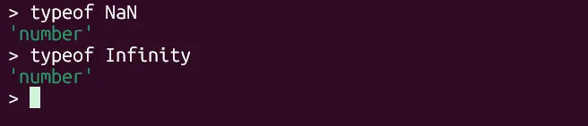

# Day 46 Data Types - 8 kiểu dữ liệu trong JavaScript

Có một số loại dữ liệu cực kỳ phổ biến mà bạn sẽ gặp trong JavaScript và những bài học về các nguyên tắc cơ bản này sẽ cung cấp cho bạn nền tảng thực sự vững chắc về tất cả chúng.

**8 Data Types (8 kiểu dữ liệu)**  
Giá trị trong JavaScript luôn có một kiểu dữ liệu nhất định. Ví dụ, một chuỗi hoặc một số.

Có 8 kiểu dữ liệu cơ bản trong JavaScript. Chúng ta có thể đặt bất kỳ kiểu nào vào một biến. Ví dụ, một biến có thể tại một thời điểm là một chuỗi và sau đó lưu trữ một số:
```javascript
let message = "hello";
message = 123456; //bình thường, không lỗi 
```
Các ngôn ngữ lập trình cho phép những điều như vậy, chẳng hạn như JavaScript, được gọi là "kiểu động - dynamically typed", nghĩa là có tồn tại các kiểu dữ liệu, nhưng các biến không bị ràng buộc với bất kỳ kiểu nào trong số chúng.

**8 kiểu dữ liệu cơ bản trong JavaScript gồm:**  
> 7 Kiểu nguyên thủy (primitive) gồm: Number, BigInt, String, Boolean, Undefined, Null, Symbol.

> 1 kiểu không phải dữ liệu nguyên thủy (non-primitive): Object (dành cho các cấu trúc dữ liệu phức tạp)

# 1. Number
```javascript
let n = 123;
n = 12.345;
```
Kiểu number biểu diễn cả các số integer (số nguyên) và các số thực chấm động (floating point).

Bên cạnh các số thông thường, còn có cái gọi là “giá trị số đặc biệt - special numeric values ” cũng thuộc về kiểu dữ liệu này: Infinity, -Infinity và NaN.

Infinity biểu thị cho Vô cực toán học ∞. Đây là một giá trị đặc biệt lớn hơn bất kỳ con số nào. Chúng ta có thể có được nó bằng cách chia 1 số cho 0:
```javascript
alert(1 / 0); //Infinity
```
hoặc sử dụng nó trực tiếp:
```javascript
alert( Infinity ); //Infinity 
```
NaN biểu thị lỗi tính toán. Nó là kết quả của một phép toán không chính xác hoặc không xác định, ví dụ:
```javascript
alert( "not a number" / 2 ); //NaN 
```
NaN là “sticky- dính”, tức là một khi nó là NaN thì bất kỳ phép toán nào với nó đều sẽ là NaN:
```javascript
alert( NaN + 1 ); // NaN
alert( 3 * NaN ); // NaN
alert( "not a number" / 2 - 1 ); // NaN
```
Vì vậy, nếu có NaN ở đâu đó trong biểu thức toán học, nó sẽ lan truyền đến toàn bộ kết quả (chỉ có một ngoại lệ: NaN ** 0 là 1).

Thực hiện tính toán là “an toàn” trong JavaScript. Chúng ta có thể làm bất cứ điều gì: chia cho số không, xử lý các chuỗi không phải số như số, v.v. Script sẽ không bao giờ dừng lại với lỗi nghiêm trọng (“die”). Tệ nhất, chúng ta sẽ nhận được NaN làm kết quả.


Các giá trị số đặc biệt về mặt hình thức thuộc về loại "number". Tất nhiên chúng không phải là số theo nghĩa thông thường của từ này.

# 2. BigInt
Trong JavaScript, kiểu "number" không thể biểu diễn an toàn các giá trị số nguyên lớn hơn (2^53-1) (tức là 9007199254740991) hoặc nhỏ hơn -(2^53-1) đối với số âm.

Kiểu "number" có thể lưu trữ các số nguyên lớn, nhưng bên ngoài phạm vi số nguyên an toàn ±(253-1) sẽ có lỗi độ chính xác, vì không phải tất cả các chữ số đều vừa với bộ nhớ cố định 64 bit. Do đó, có thể lưu trữ một giá trị "xấp xỉ". Ví dụ, cả 2 số sau đều vượt qua giới hạn 1 chút, và sẽ có kết quả xấp xỉ giống nhau:
```javascript
console.log(9007199254740991 + 1); // 9007199254740992
console.log(9007199254740991 + 2); // 9007199254740992
```
Có thể nói, tất cả các số nguyên lẻ lớn hơn (2^53-1) không thể được lưu trữ trong kiểu "number". Số nguyên chẵn thì sẽ có số lưu được, có số không lưu được.

Đối với hầu hết các mục đích, phạm vi ±(253-1) là đủ, nhưng đôi khi chúng ta cần toàn bộ phạm vi các số nguyên thực sự lớn, ví dụ như đối với mật mã hoặc dấu thời gian có độ chính xác đến micro giây.

Kiểu BigInt gần đây đã được thêm vào ngôn ngữ để biểu diễn các số nguyên có độ dài tùy ý.

Giá trị BigInt được tạo bằng cách thêm n vào cuối một số nguyên, ví dụ:
```javascript
const bigInt = 1234567890123456789012345678901234567890n;
```
BigInt hiếm khi cần dùng đến, vì vậy trong trường hợp cần đến có thể [tham khảo tại đây](https://javascript.info/bigint) 

# 3. String
Tùy thuộc vào loại công việc bạn đang làm, bạn có thể làm việc nhiều hơn với các đoạn văn bản hơn là số. Chuỗi (string) là một đoạn văn bản… và là khối xây dựng (building block) cơ bản của ngôn ngữ.

Trong JavaScript, mọi dữ liệu dạng văn bản (textual data) đều được lưu trữ dưới dạng string. JavaScript luôn dùng chuẩn UTF-16 để lưu trữ nội dung chuỗi trong bộ nhớ, bất kể trang HTML hay file mã nguồn của bạn dùng encoding gì (ví dụ UTF-8 hay ISO-8859-1). Nghĩa là bên trong JavaScript, mỗi chuỗi đều được biểu diễn theo mã hóa UTF-16. Ví dụ:
```javascript
let s = 'A';      // 1 ký tự, mã UTF-16 là U+0041
```
Một chuỗi trong JavaScript phải được bao quanh bởi dấu nháy (quotes). Trong JavaScript, sử dụng 3 loại dấu nháy:

1. `Dấu nháy kép (Double quotes)` và `dấu nháy đơn (Single quotes)` là dấu nháy “đơn giản -simple”. Thực tế là không có sự khác biệt nào giữa chúng trong JavaScript. Ví dụ:
```javascript
let str = "Hello";
let str = 'Hello'; //Giống như trên 
```
2. `Backticks (Dấu nháy ngược)` là “extended functionality” quotes (dấu nháy mở rộng chức năng). Chúng cho phép chúng ta nhúng các biến và biểu thức vào trong 1 chuỗi bằng cách bọc biến/biểu thức trong ${…}. Ví dụ:
```javascript
let name = "John";

// Nhúng 1 biến 
alert( `Hello, ${name}!` ); // Hello, John!

// Nhúng 1 biểu thức 
alert( `the result is ${1 + 2}` ); // Kết quả là 3
```
Biểu thức bên trong ${…} được đánh giá và kết quả trở thành một phần của chuỗi. Chúng ta có thể đặt bất cứ thứ gì vào đó: một biến như name hoặc một biểu thức số học như 1 + 2 hoặc một cái gì đó phức tạp hơn.
```javascript
function sum(a, b) {
  return a + b;
}

alert(`1 + 2 = ${sum(1, 2)}.`); // 1 + 2 = 3.
```
Một lợi thế khác của việc sử dụng dấu nháy ngược là chúng cho phép một chuỗi trải dài trên nhiều dòng:
```javascript
let guestList = `Guests:
 * John
 * Pete
 * Mary
`;

alert(guestList); // 1 danh sách nhiều dòng được output 
```
Xin lưu ý rằng điều này chỉ có thể thực hiện bằng Dấu nháy ngược. Các dấu ngoặc khác không có chức năng nhúng này! Bởi vì Dấu nháy đơn và dấu nháy kép có nguồn gốc từ thời xa xưa khi ngôn ngữ được tạo ra, khi nhu cầu về chuỗi nhiều dòng chưa được tính đến. Dấu nháy ngược xuất hiện muộn hơn nhiều và do đó linh hoạt hơn.

Ngoài ra cặp dấu nháy ngược còn cho phép sử dụng template function, nó cũng hiếm gặp, có thể x[em tại đây.](https://developer.mozilla.org/en-US/docs/Web/JavaScript/Reference/Template_literals#Tagged_templates)

Trong vài ngôn ngữ, như C, Java có kiểu “char” để biểu diễn một ký tự đơn. Trong JavaScript không có kiểu như vậy, chỉ có 1 loại là string. Một chuỗi có thể chứa 0 ký tự, 1 hoặc nhiều ký tự.


# 4. Boolean (logical type)
Kiểu boolean chỉ có hai giá trị: true và false.

Kiểu này thường được dùng để lưu trữ các giá trị yes/no values: true nghĩa là“yes, correct”, và false nghĩa là “no, incorrect”.

Ví dụ :
```javascript
let nameFieldChecked = true; // yes, trường name đã được check
let ageFieldChecked = false; // no, trường age chưa được check 
```
Giá trị Boolean cũng xuất hiện như là kết quả của phép so sánh:
```javascript
let isGreater = 4 > 1;

alert( isGreater ); // true 
```
# 5. The “null” value
Giá trị null đặc biệt không thuộc về bất kỳ loại nào được mô tả ở trên.

Nó tạo thành một kiểu riêng biệt chỉ chứa giá trị null:
```javascript
let age = null;
```
Trong JavaScript, null không phải là “tham chiếu đến một đối tượng không tồn tại - reference to a non-existing object” hoặc “con trỏ null - null pointer” như trong một số ngôn ngữ khác.

Nó chỉ là một giá trị đặc biệt biểu thị “không có gì (nothing)”, “trống rỗng (empty)” hoặc “giá trị không xác định (value unknown)”.

Mã ở trên nêu rõ rằng age là không xác định.

# 6. The “undefined” value
Giá trị đặc biệt undefined cũng tách biệt. Nó tạo ra một kiểu riêng, giống như null.

Ý nghĩa của undefined là “giá trị không được gán - value is not assigned”.

Nếu một biến được khai báo nhưng không được gán, thì giá trị của nó là undefined::
```javascript
let age;

alert(age); // shows "undefined"
```
Về mặt kỹ thuật, có thể gán rõ ràng undefined cho một biến:
```javascript
let age = 100;

// thay đổi giá trị của age thành undefined
age = undefined;

alert(age); // "undefined"
```
…Nhưng điều này không được khuyến khích bởi. Thông thường, người ta sử dụng null để gán giá trị “empty” hoặc “unknown” cho một biến, trong khi undefined được dành riêng làm giá trị khởi tạo mặc định cho những thứ chưa được gán.

# 7. Objects và Symbols
Kiểu object là đặc biệt.

Tất cả các kiểu khác được gọi là kiểu "nguyên thủy (primitive)" vì giá trị của chúng chỉ có thể chứa một thứ duy nhất (có thể là chuỗi hoặc số hoặc bất kỳ thứ gì). Ngược lại, object được sử dụng để lưu trữ các tập hợp dữ liệu (collections of data) và các thực thể phức tạp hơn.

Vì quan trọng như vậy, các object xứng đáng được đối xử đặc biệt.

Kiểu symbol được sử dụng để tạo ra các định danh duy nhất (unique identifiers) cho các object .

# 8. Toán tử typeof
Toán tử typeof trả về kiểu của toán hạng. Nó hữu ích khi chúng ta muốn xử lý các giá trị của các kiểu khác nhau theo cách khác nhau hoặc chỉ muốn kiểm tra nhanh.

Một lệnh gọi đến typeof x trả về tên kiểu giá trị của x dưới dạng 1 chuỗi :
```javascript
typeof null // "null"

typeof undefined // "undefined"

typeof 0 // "number"

typeof 10n // "bigint"

typeof true // "boolean"

typeof "foo" // "string"

typeof Symbol("id") // "symbol"

typeof Math // "object"  (1)

typeof null // "object"  (2)

typeof alert // "function"  (3)
```
## 3 dòng lệnh cuối cùng cần giải thích 1 chút:
- Math là một built-in object (đối tượng tích hợp) cung cấp các phép toán.

- Kết quả của typeof null là "object". Đây là một bug trong thiết kế ban đầu của JavaScript và đã không thể sửa được vì lý do tương thích ngược (backward compatibility). Nếu sửa typeof null thành 'null', hàng triệu dòng code cũ sẽ hỏng. Vì vậy, ECMAScript tiêu chuẩn hóa luôn lỗi này, và chấp nhận typeof null === 'object' là "quirk" (dị thường) của ngôn ngữ.

- Kết quả của typeof alert là "function", vì alert là một hàm. Chúng ta sẽ nghiên cứu các hàm sau này, trong đó chúng ta cũng sẽ thấy rằng không có kiểu "function" đặc biệt nào trong JavaScript, tức là không có kiểu dữ liệu nào gọi là function. Các hàm, mảng (array) thuộc về kiểu object (đối tượng). Nhưng typeof xử lý chúng theo cách khác, trả về "function". Điều đó cũng xuất phát từ những ngày đầu của JavaScript. Về mặt kỹ thuật, hành vi như vậy là không đúng, nhưng có thể thuận tiện trong thực tế.

## Cú pháp typeof(x)
Bạn cũng có thể gặp một cú pháp khác: typeof(x). Nó giống như typeof x.

Cần phải làm rõ ràng: typeof là một toán tử, không phải là một hàm. Các dấu ngoặc đơn (parentheses ) ở đây không phải là một phần của typeof. Đây là loại dấu ngoặc đơn được sử dụng để nhóm toán học.

Thông thường, các dấu ngoặc đơn như vậy chứa một biểu thức toán học, chẳng hạn như (2 + 2), nhưng ở đây chúng chỉ chứa một đối số (x). Về mặt cú pháp, chúng cho phép tránh khoảng cách giữa toán tử typeof và đối số của nó, và một số người thích điều đó.

Một số người thích typeof(x), mặc dù cú pháp typeof x phổ biến hơn nhiều.