# TẠO PSEUDOCODE DẠNG SƠ ĐỒ VỚI MERMAID SYNTAX
> ***Cần xem nội dụng bài này trên trình duyệt để thấy được sơ đồ được render***.

# 1. Cú pháp cho flowchart
Có thể dùng cú pháp Mermaid để tạo ra nhiều dạng sơ đồ khác nhau như: flowchart, pie chart, Git diagram ... 
Ở đây chúng ta chỉ học cơ bản về flowchart.

Thay vì sử dụng text để tạo pseudocode khi lập trình, chúng ta sẽ sử dụng cú pháp Mermaid để tạo sơ đồ dạng flowchart, dễ hiểu hơn nhiều (1 bức tranh bằng 1000 lời nói).

**Cú pháp chung như sau:**

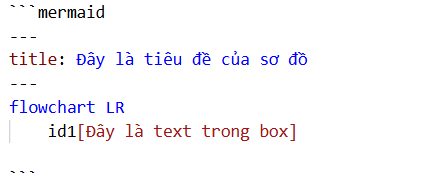

Kết quả như ta thấy dưới đây: 

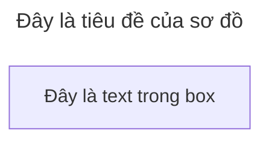
- Ngay sau **```** là **mermaid**, báo hiệu bắt đầu đoạn mã tạo biểu đồ 
- Phần `title` là tiêu đề, là tên của biểu đồ. Tùy chọn, không có cũng được.
- Phần **flowchart** là kiểu sơ đồ 
- **TD** chính là TOP-DOWN tức là sơ đồ từ trên xuống dưới. Các tùy chọn khác là:
  - **TB** - Top to bottom
  - **TD** - Top-down/ tương tự top to bottom
  - **BT** - Bottom to top
  - **RL** - Right to left
  - **LR** - Left to right

Ví dụ: Khi sử dụng `flowchart TB` 
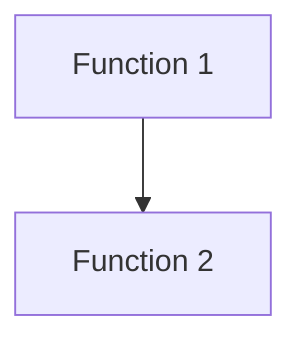

Ví dụ khi sử dụng `flowchart LR`:
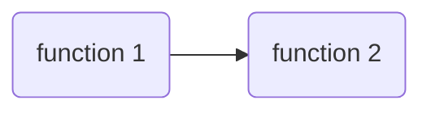

**Chú ý**: Thay vì sử dụng **flowchart**, ta có thể sử dụng **graph** cũng được.

# 2. [Node Shapes](https://mermaid.js.org/syntax/flowchart.html#a-node-default)

Mỗi 1 phần tử trong flowchart được gọi là 1 node. Có nhiều loại hình dạng khác nhau. Vì mục đích của chúng ta đơn giản thì là tạo pseudocode nên ở đây sẽ chỉ giới thiệu các loại hình dạng cơ bản.
## 2.1 Node với các cạnh bo tròn 
Cú pháp:
```
flowchart LR
    id1(Đây là node dạng bo tròn cạnh)
```
Tức là sử dụng cặp dấu ngoặc đơn `( )`
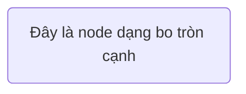
## 2.2 Node có dạng giống sân vận động
Cú pháp:
```
flowchart LR
    idid([Đây là node dạng sân vận động])
```

Tức là sử dụng 2 loại dấu ngoặc `([ ])`
## 2.3 Node dạng chương trình con 
Cú pháp:
```
flowchart LR
    id[[Đây là node dạng chương trình con]]
```

Tức là sử dụng 2 cặp ngoặc vuông `[[ ]]`

## 2.4 Node dạng hình trụ
Cú pháp:
```
flowchart TD
    id[(Đây là node dạng hình trụ )]
```
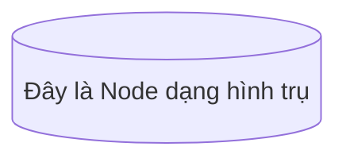
Tức là sử dụg 2 cặp ngoặc `[( )]`
## 2.5 Node dạng hình tròn
Cú pháp sử dụng 2 cặp ngoặc `(( ))`
```
flowchart TD
    id((Đây là Node dạng hình tròn ))
```
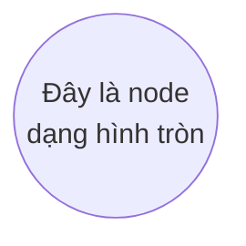
## 2.6 Node dạng 1 nửa là ruy băng
Cú pháp sử dụng `> ]`
```
flowchart TD
    id > Đây là node dạng 1 nửa là ruy băng ]
```


## 2.7 Node dạng hình thoi
Cú pháp dùng cặp dấu `{ }`
```
flowchart TD
    id {Đây là Node dạng hình thoi }
```

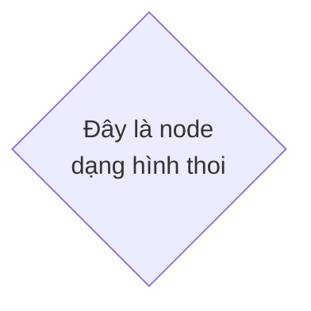

- Chú ý: Nếu để nguyên 1 dòng thì hình dạng của node sẽ to hơn để vừa với text. Ví dụ:

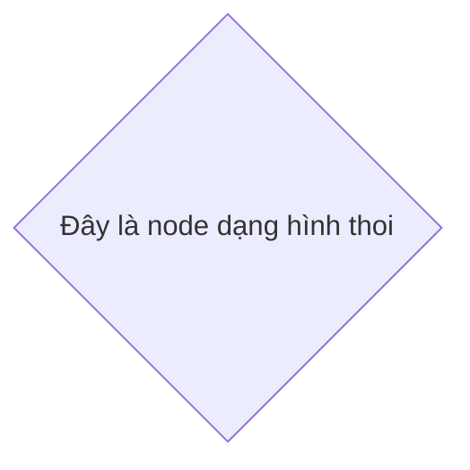
## 2.8 Node dạng hình lục giác
Sử dụng cú pháp là 2 cặp dấu `{{ }}`
```
flowchart TD
    id{{Đây là node dạng hình lục giác}}
```
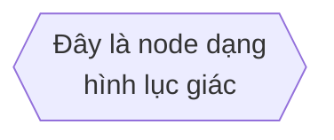
## 2.9 Node dạng hình bình hành, hình thang
Sử dụng 1 cặp ngoặc vuông `[ ]` bên ngoài, bên trong sẽ là :
- `\ \` hoặc `/ /` cho hình bình hành, và 
-` \ /` hoặc `/ \ `cho hình thang.
Ví dụ:
```
flowchart TD
    id1[/Đây là hình bình hành 1/]
    id2[\Đây là hình bình hành 2\]
    id3[/Đây là hình thang\]
```

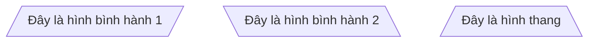
## 2.10 Node dạng 2 vòng tròn lồng nhau
Cú pháp dùng 3 cặp ngoặc đơn `((( )))`
```
flowchart TD
    id(((Đây là node dạng vòng tròn kép )))
```
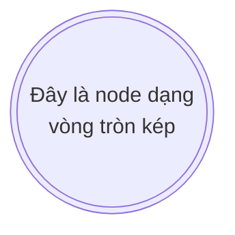

# 3. [Links between Nodes](https://mermaid.js.org/syntax/flowchart.html#links-between-nodes)

Xem cú pháp tương ứng với sơ đồ trong ví dụ:  
```
flowchart TD
    % Nodes 
    A[A]
    B(B)
    C(C)
    D(D)
    A2[A2]
    B2[B2]
    C2[C2]
    D2[D2]

    % Connections 
    A-->B
    A2-.->B2
    A---C
    A2-.-C2
    B--text---C 
    B2-.text.-C2
    A-->|Text|D
    A2-.Text.->D2 
    D==>C 
    B==Text==>D
    A2<==>A
    A<-->C2
    D2===A
```
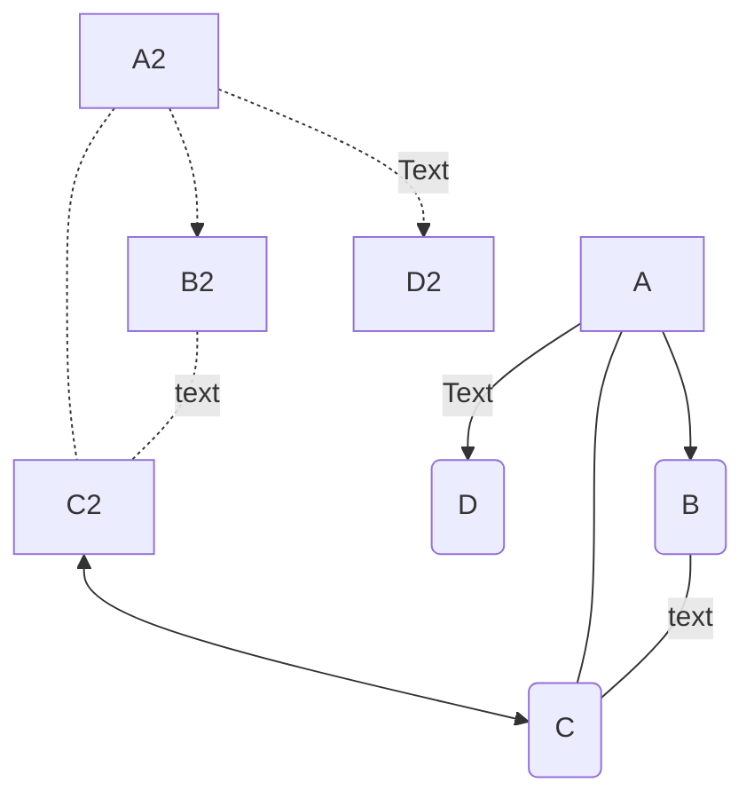

Ngoài ra, tham khảo thêm các liên kết sau, sử dụng `=` thay vì `-`, sẽ khiến nét đậm hơn.  
> A==>B   
> A==Text==>B  
> A<==>B  
> A===B  
# 4. [Comments](https://mermaid.js.org/syntax/flowchart.html#a-node-default)

Trong trường hợp chúng ta muốn ghi chú thích cho các Node, có thể sử dụng comment với 2 dấu phần trăm `%%`. Ví dụ:
```
flowchart TD
    %% Đây là các Nodes
    A[function 1]
    B[function 2]
    C[function 3]


    %% Liên kết
    A==>B
    B---C
```


## Tài liệu đầy đủ xem tại đây
1. https://mermaid.js.org/syntax/flowchart.html#dotted-link-with-text 

> ⭐ **Theo dõi [kênh Threads](https://www.threads.com/@kaitaku.88) để đọc bài mới mỗi ngày!** ⭐  

**[<== Bài Trước  ](link)          |[  Trang Chủ  ](./README.md)|           [  Bài Sau ==>](link)**
