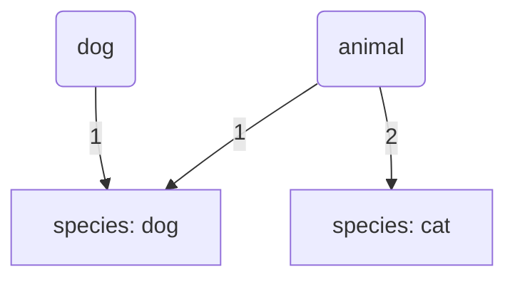

# Các Khái Niệm Cơ Bản về Đối Tượng (Object) trong JavaScript (Đóng cọc lần 1)

## **1. Đối tượng là gì? (What is an object?)**
Trong JavaScript, một đối tượng (object) là một **tập hợp các dữ liệu và/hoặc chức năng liên quan**. Chúng thường bao gồm nhiều biến (variables) và hàm (functions). Khi các biến và hàm này nằm bên trong một đối tượng, chúng được gọi là các **thuộc tính** (properties) và **phương thức** (methods) của đối tượng đó.

Khác với các kiểu dữ liệu nguyên thủy (primitive data types) như chuỗi (string), số (number), boolean, v.v., mà chỉ chứa một giá trị duy nhất, các đối tượng được sử dụng để **lưu trữ một tập hợp dữ liệu được đánh khóa** (keyed collections of various data) và các thực thể phức tạp hơn. Các đối tượng thâm nhập hầu hết mọi khía cạnh của ngôn ngữ JavaScript.

## **2. Tạo Đối Tượng (Creating Objects)**
Có hai cách chính để tạo một đối tượng trong JavaScript:

*   **Cú pháp hàm tạo đối tượng (Object constructor syntax)**: `let user = new Object();`
*   **Cú pháp đối tượng nguyên bản (Object literal syntax)**: `let user = {};`

Phương pháp sử dụng dấu ngoặc nhọn `{...}` được gọi là một **đối tượng nguyên bản** (object literal) và thường được ưu tiên sử dụng.

Để bắt đầu, bạn có thể tạo một đối tượng trống:
```javascript
const person = {};
```
Khi bạn gõ `person` vào console của trình duyệt, bạn sẽ nhận được kết quả như `[object Object] Object { }` hoặc `{ }`.

Bạn có thể tạo một đối tượng và ngay lập tức đặt một số thuộc tính (properties) vào bên trong `{...}` dưới dạng cặp "khóa: giá trị" (key: value).
Ví dụ:
```javascript
const person = {
  name: ["Bob", "Smith"],
  age: 32,
  bio: function () {
    console.log(`${this.name[0]} ${this.name[1]} is ${this.age} years old.`);
  },
  introduceSelf: function () {
    console.log(`Hi! I'm ${this.name[0]}.`);
  },
};
```
Trong ví dụ trên, đối tượng `person` có các thành viên (members) như `name` (một mảng - array), `age` (một số - number), và `bio` cùng `introduceSelf` (là các hàm - functions). Hai mục đầu tiên là các mục dữ liệu (data items) và được gọi là **thuộc tính** (properties) của đối tượng. Hai mục cuối cùng là các hàm cho phép đối tượng thực hiện điều gì đó với dữ liệu và được gọi là **phương thức** (methods) của đối tượng.

Có một cú pháp ngắn gọn hơn cho các phương thức khi các thành viên của đối tượng là hàm:
Thay vì `bio: function ()`, bạn có thể viết `bio()`:
```javascript
const person = {
  name: ["Bob", "Smith"],
  age: 32,
  bio() { // Shorter syntax for methods
    console.log(`${this.name[0]} ${this.name[1]} is ${this.age} years old.`);
  },
  introduceSelf() { // Shorter syntax for methods
    console.log(`Hi! I'm ${this.name[0]}.`);
  },
};
```
Một đối tượng như thế này được gọi là một **đối tượng nguyên bản** (object literal) — nội dung của đối tượng được viết ra ngay tại thời điểm tạo.

## **3. Truy cập các thành viên của đối tượng (Accessing Object Members)**
Bạn có thể truy cập các thuộc tính (properties) và phương thức (methods) của đối tượng bằng hai cách chính:

*   **Cú pháp dấu chấm (Dot notation)**
    Đây là cách phổ biến nhất để truy cập các thành viên của đối tượng. Tên đối tượng (ví dụ: `person`) hoạt động như một **không gian tên** (namespace) – nó phải được nhập trước để truy cập bất cứ thứ gì bên trong đối tượng. Sau đó, bạn viết một dấu chấm (dot), rồi đến mục bạn muốn truy cập.
    Ví dụ:
    ```javascript
    person.name;      // Truy cập thuộc tính 'name'
    person.name[0];   // Truy cập phần tử đầu tiên của mảng 'name'
    person.age;       // Truy cập thuộc tính 'age'
    person.bio();     // Gọi phương thức 'bio'
    person.introduceSelf(); // Gọi phương thức 'introduceSelf'
    ```
    Một thuộc tính của đối tượng cũng có thể là một đối tượng. Để truy cập các mục này, bạn chỉ cần nối thêm một bước với một dấu chấm khác.
    Ví dụ:
    ```javascript
    const person = {
      name: {
        first: "Bob",
        last: "Smith",
      },
      // ...
    };
    person.name.first; // Truy cập thuộc tính 'first' của đối tượng 'name' bên trong 'person'
    person.name.last;  // Truy cập thuộc tính 'last' của đối tượng 'name' bên trong 'person'
    ```

*   **Cú pháp dấu ngoặc vuông (Bracket notation)**
    Cú pháp dấu ngoặc vuông cung cấp một cách thay thế để truy cập các thuộc tính của đối tượng. Thay vì sử dụng cú pháp dấu chấm, bạn có thể sử dụng dấu ngoặc vuông:
    ```javascript
    person["age"];
    person["name"]["first"];
    ```
    Điều này trông rất giống cách bạn truy cập các mục trong một mảng (array), và về cơ bản nó giống nhau — thay vì sử dụng một số chỉ mục (index number) để chọn một mục, bạn đang sử dụng tên (chuỗi) được liên kết với giá trị của mỗi thành viên. Đó là lý do tại sao các đối tượng đôi khi được gọi là **mảng liên kết** (**associative arrays**) – chúng ánh xạ chuỗi đến giá trị theo cùng một cách mà mảng ánh xạ số đến giá trị.

    Mặc dù cú pháp dấu chấm thường được ưu tiên vì nó ngắn gọn và dễ đọc hơn, nhưng có một số trường hợp bạn **phải sử dụng dấu ngoặc vuông**. Ví dụ, nếu tên thuộc tính của đối tượng được lưu trữ trong một biến, thì bạn không thể sử dụng cú pháp dấu chấm để truy cập giá trị, nhưng bạn có thể truy cập giá trị bằng cú pháp dấu ngoặc vuông.
    Ví dụ:
    ```javascript
    const person = { name: ["Bob", "Smith"], age: 32, };
    function logProperty(propertyName) {
      console.log(person[propertyName]); // Sử dụng bracket notation với biến
    }
    logProperty("name"); // Kết quả: ["Bob", "Smith"]
    logProperty("age");  // Kết quả: 32
    ```
    Bạn cũng có thể sử dụng dấu ngoặc vuông trong một đối tượng nguyên bản (object literal) khi tạo đối tượng, đây được gọi là **thuộc tính được tính toán** (computed properties).
    Ví dụ:
    ```javascript
    let fruit = prompt("Which fruit to buy?", "apple");
    let bag = {
      [fruit]: 5, // Tên thuộc tính được lấy từ biến 'fruit'
    };
    alert( bag.apple ); // 5 nếu fruit="apple"
    ```

## **4. Thiết lập / Cập nhật các thành viên của đối tượng (Setting Object Members)**
Bạn không chỉ có thể truy xuất (getting) các thành viên của đối tượng, mà còn có thể **thiết lập** (set) hoặc **cập nhật** (update) giá trị của chúng bằng cách khai báo thành viên bạn muốn thiết lập (sử dụng cú pháp dấu chấm hoặc dấu ngoặc vuông).
Ví dụ:
```javascript
person.age = 45;             // Cập nhật giá trị của thuộc tính 'age'
person["name"]["last"] = "Cratchit"; // Cập nhật giá trị của thuộc tính 'last' bên trong 'name'
```
Việc thiết lập thành viên không chỉ dừng lại ở việc cập nhật giá trị của các thuộc tính và phương thức hiện có; bạn cũng có thể **tạo ra các thành viên hoàn toàn mới**.
Ví dụ:
```javascript
person["eyes"] = "hazel"; // Tạo thuộc tính mới 'eyes'
person.farewell = function () { // Tạo phương thức mới 'farewell'
  console.log("Bye everybody!");
};
```
Một khía cạnh hữu ích của cú pháp dấu ngoặc vuông là nó có thể được sử dụng để thiết lập không chỉ các giá trị của thành viên một cách động (dynamically), mà cả tên của thành viên nữa. Cú pháp dấu chấm không thể làm được điều này vì nó chỉ chấp nhận một tên thành viên cố định (literal member name), không phải một giá trị biến trỏ đến một tên.
Ví dụ:
```javascript
const person = {};
const myDataName = "height";
const myDataValue = "1.75m";
person[myDataName] = myDataValue; // Tạo thuộc tính với tên từ biến 'myDataName'
console.log(person.height); // Kết quả: "1.75m"
```

## **5. Từ khóa "this" (The "this" keyword)**
Trong các phương thức của đối tượng, từ khóa `this` thường đề cập đến **đối tượng hiện tại mà đoạn mã đang được thực thi trong đó**. Cụ thể, trong ngữ cảnh của một phương thức đối tượng, `this` đề cập đến **đối tượng mà phương thức đó được gọi trên**. Điều này cho phép định nghĩa cùng 1 phương thức hoạt động cho nhiều đối tượng khác nhau.
Ví dụ:
```javascript
const person1 = {
  name: "Chris",
  introduceSelf() {
    console.log(`Hi! I'm ${this.name}.`); //(this ở đây là person1)
  },
};

const person2 = {
  name: "Deepti",
  introduceSelf() {
    console.log(`Hi! I'm ${this.name}.`); //(this ở đây là person2)
  },
};

person1.introduceSelf(); // Kết quả: "Hi! I'm Chris." 
person2.introduceSelf(); // Kết quả: "Hi! I'm Deepti." 
```
Hoặc ta sẽ viết 1 cách khác dễ hiểu hơn:
```javascript 
function introduceSelf() {
  console.log(`Hi! I'm ${this.name}.`);
}

const person1 = {
  name: "Chris",
  introduceSelf: introduceSelf
};

const person2 = {
  name: "Deepti",
  introduceSelf: introduceSelf
};

person1.introduceSelf(); //Hi! I'm Chris.
person2.introduceSelf(); //Hi! I'm Deepti.
```
Hàm `introduceSelf()` sử dụng `this.name` — nhưng không hề gán trực tiếp giá trị nào bên trong hàm.

Khi hàm này được gán vào mỗi đối tượng (`student1`, `student2`) → `this` sẽ tham chiếu đến chính đối tượng đó tại thời điểm gọi.

## **6. Hàm tạo (Constructors)**
Việc sử dụng đối tượng nguyên bản (object literals) là tốt khi bạn chỉ cần tạo một đối tượng. Tuy nhiên, nếu bạn phải tạo nhiều đối tượng giống nhau, việc này sẽ rất không hiệu quả vì bạn phải viết lại cùng một mã cho mỗi đối tượng.

Để giải quyết vấn đề này, chúng ta cần một cách để định nghĩa "**hình dạng**" (shape) của một đối tượng — tập hợp các phương thức (methods) và thuộc tính (properties) mà nó có thể có — và sau đó tạo bao nhiêu đối tượng tùy thích, chỉ cập nhật các giá trị cho các thuộc tính khác nhau.

Một cách đầu tiên để làm điều này là sử dụng một hàm (function):
```javascript
function createPerson(name) {
  const obj = {};
  obj.name = name;
  obj.introduceSelf = function () {
    console.log(`Hi! I'm ${this.name}.`);
  };
  return obj;
}
```
Hàm này tạo và trả về một đối tượng mới mỗi khi chúng ta gọi nó. Bây giờ chúng ta có thể tạo bao nhiêu đối tượng tùy thích, tái sử dụng định nghĩa:
```javascript
const salva = createPerson("Salva");
salva.introduceSelf(); // Kết quả: "Hi! I'm Salva."

const frankie = createPerson("Frankie");
frankie.introduceSelf(); // Kết quả: "Hi! I'm Frankie."
```
Cách này hoạt động tốt nhưng hơi dài dòng. Một cách tốt hơn là sử dụng một **hàm tạo** (**constructor**). Một hàm tạo chỉ đơn giản là một hàm được gọi bằng từ khóa `new`. Khi bạn gọi một hàm tạo, nó sẽ:
*   Tạo một đối tượng mới.
*   Liên kết `this` với đối tượng mới, để bạn có thể tham chiếu đến `this` trong mã hàm tạo của mình.
*   Chạy mã trong hàm tạo.
*   Trả về đối tượng mới.

Theo quy ước, các hàm tạo thường bắt đầu bằng một chữ cái viết hoa và được đặt tên theo loại đối tượng mà chúng tạo (**Ví dụ nếu các đối tượng là con người thì tên hàm tạo là Person, nếu các đối tượng là động vật thì tên hàm tạo là Animal**). Vì vậy, chúng ta có thể viết lại ví dụ trên như sau:
```javascript
function Person(name) {
  this.name = name;
  this.introduceSelf = function () {
    console.log(`Hi! I'm ${this.name}.`);
  };
}
```
Để gọi `Person()` như một hàm tạo, chúng ta sử dụng `new`:
```javascript
/* Chạy dòng dưới đây sẽ tạo 1 đối tượng mới là salva
- this sẽ được liên kết với đối tượng salva 
*/
const salva = new Person("Salva");
salva.introduceSelf(); // Kết quả: "Hi! I'm Salva."

const frankie = new Person("Frankie");
frankie.introduceSelf(); // Kết quả: "Hi! I'm Frankie."
```
Ví dụ khác:
```javascript
function Animal(name, numsLeg, say) {
    this.name = name;
    this.numsLeg = numsLeg;
    this.say = say;
    this.tell = function () {
        console.log(`I'm a ${this.name}, I say ${this.say}`);
    }
}

const dog = new Animal("Dog", 4, "Gâu Gâu");
const duck = new Animal("Duck", 2, "Cạc Cạc");
console.log(dog);
console.log(duck);

dog.tell();
duck.tell();
```
## **7. Bạn đã sử dụng đối tượng từ lâu (You've been using objects all along)**
Bạn có thể nhận thấy rằng cú pháp dấu chấm (dot notation) rất quen thuộc. Đó là bởi vì bạn đã sử dụng nó trong suốt quá trình học! Mỗi khi bạn làm việc với một API tích hợp sẵn của trình duyệt (built-in browser API) hoặc đối tượng JavaScript, bạn đã sử dụng đối tượng rồi.

*   Khi bạn sử dụng các phương thức chuỗi (string methods) như `myString.split(",")`, bạn đang sử dụng một phương thức có sẵn trên một đối tượng `String`. Mỗi khi bạn tạo một chuỗi, chuỗi đó sẽ tự động được tạo như một phiên bản của `String` và do đó có một số phương thức và thuộc tính chung có sẵn trên đó.
*   Khi bạn truy cập đối tượng mô hình tài liệu (document object model - DOM) bằng các dòng như `document.createElement("div")` hoặc `document.querySelector("video")`, bạn đang sử dụng các phương thức có sẵn trên một đối tượng `Document`. Đối với mỗi trang web được tải, một phiên bản của `Document` được tạo, gọi là `document`, đại diện cho toàn bộ cấu trúc, nội dung và các tính năng khác của trang.
*   Điều tương tự cũng đúng với hầu hết các đối tượng hoặc API tích hợp sẵn khác mà bạn đã sử dụng — `Array`, `Math`, v.v..

## **8. Sự khác biệt giữa đối tượng và kiểu dữ liệu nguyên thủy (Differences between objects and primitives)**
Kiểu dữ liệu nguyên thủy (primitive data types) có thể chứa một thứ duy nhất (chuỗi, số, v.v.). Trong khi đó, kiểu dữ liệu đối tượng (object data types), bao gồm nhưng không giới hạn ở đối tượng `{key: value}`, mảng (arrays) và hàm (functions), được sử dụng để lưu trữ một tập hợp dữ liệu và các thực thể phức tạp hơn.

Ngoài những khác biệt về hình thức, còn có những khác biệt kỹ thuật ảnh hưởng đến cách chúng ta sử dụng từng kiểu dữ liệu:

*   **Kiểu dữ liệu nguyên thủy (Primitive data types)**: Khi bạn định nghĩa một biến nguyên thủy, nó sẽ chứa một **bản sao** (copy) của thông tin được cung cấp cho nó.
    Ví dụ:
    ```javascript
    let data = 42;
    let dataCopy = data; // dataCopy sẽ lưu trữ một bản sao của giá trị trong data (42)
    dataCopy = 43;      // Thay đổi dataCopy sẽ không ảnh hưởng đến data
    console.log(data);      // Kết quả: 42
    console.log(dataCopy);  // Kết quả: 43
    ```
*   **Kiểu dữ liệu đối tượng (Object data types)**: Khi bạn định nghĩa một biến đối tượng, nó sẽ chứa một **tham chiếu** (reference) đến đối tượng được cung cấp cho nó. Điều này có nghĩa là nhiều biến có thể trỏ đến cùng một đối tượng.
    Ví dụ:
    ```javascript
    const obj = { data: 42 }; // obj chứa một tham chiếu đến đối tượng { data: 42 }
    const objCopy = obj;     // objCopy cũng sẽ chứa một tham chiếu đến cùng đối tượng đó
    objCopy.data = 43;       // Thay đổi objCopy sẽ thay đổi đối tượng mà nó tham chiếu đến
    console.log(obj);       // Kết quả: { data: 43 }
    console.log(objCopy);   // Kết quả: { data: 43 }
    ```
    ```mermaid
      graph TD
        obj(obj)
        objCopy(objCopy)
        value(data: 42)
        newValue(data: 43)

        obj --1--> value
        obj --2--> newValue
        objCopy --1--> value
        objCopy --2--> newValue
    ```
    
    Hành vi này cũng cần được xem xét khi chúng ta truyền đối số (arguments) vào một hàm.
    Ví dụ:
    ```javascript
    function increaseCounterObject(objectCounter) {
      objectCounter.counter += 1; // Thay đổi đối tượng được tham chiếu
    }

    function increaseCounterPrimitive(primitiveCounter) {
      primitiveCounter += 1; // Chỉ thay đổi bản sao cục bộ trong hàm
    }

    const object = { counter: 0 };
    let primitive = 0;

    increaseCounterObject(object);
    increaseCounterPrimitive(primitive);

    console.log(object.counter);  // Kết quả: 1 (đã thay đổi)
    console.log(primitive);       // Kết quả: 0 (không thay đổi)
    ```
    Biến `objectCounter` chứa một **tham chiếu** đến cùng đối tượng với biến `object`, trong khi `primitiveCounter` chỉ chứa một **bản sao** của giá trị nguyên thủy.

    **Gán lại biến kiểu đối tượng (Reassigning object data type variables)**: Trong khi việc thay đổi đối tượng mà chúng ta có tham chiếu đến sẽ ảnh hưởng đến tất cả các biến khác tham chiếu đến nó, việc gán lại (reassigning) một biến thì không làm thay đổi những gì các biến khác tham chiếu đến.
    Ví dụ:
    ```javascript
    let animal = { species: "dog" }; // animal tham chiếu đến { species: "dog" }
    let dog = animal;                // dog cũng tham chiếu đến { species: "dog" }

    // Gán lại biến animal với một đối tượng hoàn toàn mới
    animal = { species: "cat" };     // animal bây giờ tham chiếu đến { species: "cat" }

    console.log(animal); // Kết quả: { species: "cat" }
    console.log(dog);    // Kết quả: { species: "dog" } (vẫn tham chiếu đến đối tượng cũ)
    ```

## **9. Hạn chế tên thuộc tính (Property names limitations) và toán tử `in`**

*   **Hạn chế tên thuộc tính**: Đối với một thuộc tính của đối tượng, **không có hạn chế nào về tên thuộc tính**. Chúng có thể là bất kỳ chuỗi (strings) hoặc ký hiệu (symbols) nào. Các kiểu khác sẽ tự động được chuyển đổi thành chuỗi.
    Ví dụ:
    ```javascript
    let obj = {
      for: 1,      // Tên thuộc tính có thể là từ khóa dành riêng
      "let": 2,    // Tên thuộc tính có thể là chuỗi
      0: "test"    // Số 0 sẽ được chuyển đổi thành chuỗi "0" làm khóa
    };
    alert( obj.for + obj.let + obj["0"] ); // Kết quả: 1 + 2 + "test" (nối chuỗi) -> "3test"
    alert( obj ); // Kết quả: "test" (truy cập bằng số 0, cũng được chuyển thành chuỗi "0")
    ```
    Có một trường hợp đặc biệt với thuộc tính có tên `__proto__`. Bạn không thể gán nó cho một giá trị không phải đối tượng.

*   **Kiểm tra sự tồn tại của thuộc tính, toán tử "in" (Property existence test, "in" operator)**
    Trong JavaScript, khi đọc một thuộc tính không tồn tại, nó chỉ trả về `undefined` chứ không gây ra lỗi. Do đó, bạn có thể kiểm tra sự tồn tại của thuộc tính bằng cách so sánh với `undefined`:
    ```javascript
    let user = {};
    alert( user.noSuchProperty === undefined ); // Kết quả: true (không có thuộc tính này)
    ```
    Ngoài ra, có một toán tử đặc biệt là `"in"` để kiểm tra sự tồn tại của thuộc tính.
    Cú pháp là: `"key" in object`.
    Ví dụ:
    ```javascript
    let user = { name: "John", age: 30 };
    alert( "age" in user );      // Kết quả: true (user.age tồn tại)
    alert( "blabla" in user );   // Kết quả: false (user.blabla không tồn tại)
    ```
    Lưu ý rằng bên trái của `in` phải là **tên thuộc tính** (property name), thường là một chuỗi được đặt trong dấu ngoặc kép.
    Toán tử `in` hữu ích hơn khi một thuộc tính thực sự tồn tại nhưng giá trị của nó là `undefined`.
    Ví dụ:
    ```javascript
    let obj = { test: undefined };
    alert( obj.test );       // Kết quả: undefined (có vẻ như không có thuộc tính này)
    alert( "test" in obj );  // Kết quả: true (thuộc tính thực sự tồn tại!)
    ```

**10. Vòng lặp "for..in" (The "for..in" loop)**
Để duyệt qua tất cả các khóa (keys) của một đối tượng, có một dạng vòng lặp đặc biệt: `for..in`.
Cú pháp:
```javascript
for (key in object) {
  // thực thi phần thân cho mỗi khóa trong thuộc tính của đối tượng
}
```
Ví dụ, để xuất tất cả các thuộc tính của `user`:
```javascript
let user = { name: "John", age: 30, isAdmin: true };
for (let key in user) {
  // keys
  alert( key );        // Kết quả: name, age, isAdmin
  // values for the keys
  alert( user[key] );  // Kết quả: John, 30, true
}
```
**Thứ tự thuộc tính (Ordered like an object)**:
Các đối tượng có được sắp xếp không? Khi chúng ta lặp qua một đối tượng, liệu chúng ta có nhận được tất cả các thuộc tính theo cùng thứ tự mà chúng được thêm vào không? Câu trả lời ngắn gọn là: "được sắp xếp theo một cách đặc biệt": **các thuộc tính số nguyên (integer properties) được sắp xếp, các thuộc tính khác xuất hiện theo thứ tự tạo**.

*   **Thuộc tính số nguyên (Integer properties)**: Là một chuỗi có thể được chuyển đổi thành số nguyên và ngược lại mà không thay đổi. Các thuộc tính này sẽ được sắp xếp theo thứ tự tăng dần.
    Ví dụ:
    ```javascript
    let codes = {
      "49": "Germany",
      "41": "Switzerland",
      "44": "Great Britain",
      "1": "USA"
    };
    for (let code in codes) {
      alert(code); // Kết quả: 1, 41, 44, 49 (được sắp xếp theo số nguyên)
    }
    ```
*   **Thuộc tính không phải số nguyên (Non-integer properties)**: Nếu các khóa không phải là số nguyên, chúng sẽ được liệt kê theo thứ tự tạo.
    Ví dụ:
    ```javascript
    let user = { name: "John", surname: "Smith" };
    user.age = 25; // Thêm một thuộc tính mới
    for (let prop in user) {
      alert( prop ); // Kết quả: name, surname, age (theo thứ tự tạo)
    }
    ```

**11. Tóm tắt (Summary)**
Các đối tượng trong JavaScript là các mảng liên kết (associative arrays) với một số tính năng đặc biệt.
Chúng lưu trữ các thuộc tính (cặp khóa-giá trị), trong đó:
*   Các khóa thuộc tính phải là chuỗi (strings) hoặc ký hiệu (symbols) (thường là chuỗi).
*   Các giá trị có thể là bất kỳ kiểu nào.

Để truy cập một thuộc tính, chúng ta có thể sử dụng:
*   **Cú pháp dấu chấm (Dot notation)**: `obj.property`.
*   **Cú pháp dấu ngoặc vuông (Square brackets notation)**: `obj["property"]`. Dấu ngoặc vuông cho phép lấy khóa từ một biến, như `obj[varWithKey]`.

Các toán tử bổ sung:
*   Để xóa một thuộc tính: `delete obj.prop`.
*   Để kiểm tra xem một thuộc tính với khóa đã cho có tồn tại không: `"key" in obj`.
*   Để lặp qua một đối tượng: vòng lặp `for (let key in obj)`.

Những gì chúng ta đã nghiên cứu trong chương này được gọi là "đối tượng thuần túy" (plain object), hoặc chỉ đơn giản là `Object`.
Có nhiều loại đối tượng khác trong JavaScript, ví dụ như `Array` để lưu trữ các bộ sưu tập dữ liệu có thứ tự, `Date` để lưu trữ thông tin về ngày và giờ, `Error` để lưu trữ thông tin về lỗi, v.v.. Mặc dù đôi khi người ta gọi chúng là "kiểu Array" hoặc "kiểu Date", nhưng về mặt hình thức, chúng không phải là kiểu riêng mà thuộc về một kiểu dữ liệu "đối tượng" duy nhất và mở rộng nó theo nhiều cách khác nhau.


## Tài liệu phải đọc khi ĐÓNG CỌC LẦN 2
>1. https://www.theodinproject.com/lessons/foundations-object-basics
>2. https://javascript.info/object
>3. https://developer.mozilla.org/en-US/docs/Learn/JavaScript/Objects/Basics 

> ⭐ **Theo dõi [kênh Threads](https://www.threads.com/@kaitaku.88) để đọc bài mới mỗi ngày!** ⭐  

**[<== Bài Trước  ](link)          |[  Trang Chủ  ](./README.md)|           [  Bài Sau ==>](link)**