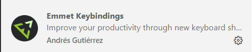

# Ngày 79: Emmet là gì?
> # [Emmet Cheatsheet](https://docs.emmet.io/cheat-sheet/)
Emmet là một công cụ cực kỳ hữu ích giúp bạn viết mã HTML và CSS nhanh hơn và hiệu quả hơn, nâng cao năng suất lập trình . 

### 1. Emmet là gì và tại sao nên sử dụng?
**Emmet** là một (plugin) tiện ích mở rộng được tích hợp sẵn trong **Visual Studio Code (VS Code)**. Nó giúp bạn viết mã HTML và CSS hiệu quả hơn bằng cách cung cấp một loạt các phím tắt (shortcuts) và đoạn mã (snippets) thông minh. Với Emmet, bạn chỉ cần gõ một lượng nhỏ mã và Emmet sẽ tự động mở rộng nó thành cấu trúc mã phức tạp hơn.

**Lợi ích khi sử dụng Emmet:**
*   **Tăng tốc độ viết mã:** Bạn có thể tạo các cấu trúc HTML hoặc CSS phức tạp chỉ với vài phím gõ.
*   **Giảm lỗi chính tả:** Bằng cách tự động tạo các thẻ đóng và thuộc tính cần thiết.
*   **Dễ học:** Nếu bạn đã biết cách viết HTML và CSS, bạn sẽ không gặp khó khăn khi làm quen với các viết tắt (abbreviations) của Emmet.

### 2. Cài đặt và Phím tắt (Keybindings) của Emmet
Emmet thường được tích hợp sẵn trong VS Code, cho phép bạn sử dụng ngay lập tức trong các tệp HTML. Tuy nhiên, bạn cũng có thể cài đặt các bộ phím tắt bổ sung để nâng cao năng suất:

**Cài đặt Emmet Keybindings:**
*   Mở **VS Code Quick Open** (Ctrl+P trên Windows/Linux).
*   Dán lệnh sau và nhấn Enter: `ext install agutierrezr.emmet-keybindings`.
> 

**Thiết lập phím tắt tùy chỉnh trong VS Code:**
*   Mở cửa sổ phím tắt (keyboard shortcuts) bằng cách nhấn **Cmd + K** sau đó **Cmd + S** trên Mac, hoặc **Ctrl + K** sau đó **Ctrl + S** trên Windows/Linux.
*   Tìm kiếm các hành động của Emmet bằng cách nhập `Emmet:<action>` (ví dụ: `Emmet:Wrap With Abbreviation` hoặc `Emmet:Remove tag`).
*   Nhấp vào dấu cộng để thêm phím tắt bạn muốn cho hành động đó.

**Một số phím tắt Emmet thực tế (Practical Keybindings) (khi đã cài đặt Emmet Keybindings của Andrés Gutiérrez):**
*   **Cân bằng (Balance) (Outward/Inward):**
    *   Mac: `Cmd + M Cmd + O` / `Cmd + M Cmd + I`
    *   Windows/Linux: ``Ctrl + M` `Ctrl + O`` / ``Ctrl + M` `Ctrl + I``  
    Tình huống: Chọn nhanh các phần tử HTML theo cấp độ. Code ban đầu:
    ```html
    <div class="container">
        <header>
            <nav>
                <ul>
                    <li><a href="#">Home</a></li>
                    <li><a href="#">About</a></li>
                </ul>
            </nav>
        </header>
    </div>  
    ```
    Sử dụng:

- Đặt con trỏ tại từ "Home"
- Nhấn Ctrl + M Ctrl + O (Balance Outward) lần lượt:
- Lần 1: Chọn `<a href="#">Home</a>`
- Lần 2: Chọn `<li><a href="#">Home</a></li>`
- Lần 3: Chọn toàn bộ `<ul>...</ul>`
- Lần 4: Chọn `<nav>...</nav>`
- Nhấn `Ctrl + M` `Ctrl + I` (Balance Inward): Thu hẹp lại từng cấp  
> - Balance rất hữu ích khi làm việc với HTML phức tạp
*   **Đánh giá biểu thức toán học (Evaluate Math Expression):**
    *   Mac: `Cmd + M Cmd + =`
    *   Windows/Linux: `Ctrl + M Ctrl + =`
    Tình huống: Tính toán trực tiếp trong CSS. Code ban đầu:
    ```css
    .container {
        width: 1200px;
        padding: 20px;
        /* Muốn tính content width = 1200 - (20*2) */
        max-width: 1200-20*2px;
    }
    ```
    Sử dụng:

    Chọn biểu thức `1200-20*2`
    Nhấn `Ctrl + M Ctrl + =` 
    Kết quả: `1160`

    Ví dụ khác:
    ```css
    .grid-item {
        /* Tính width cho 3 cột với gap 20px */
        width: (100%-20*2)/3%;
    }
    ```

    Chọn `(100%-20*2)/3` → Nhấn `Ctrl + M Ctrl + =` → Kết quả: 20
    > - Math Expression tiết kiệm thời gian tính toán trong CSS
*   **Đi đến cặp thẻ tương ứng (Go to Matching Pair):**
    *   Mac: `Cmd + M Cmd + M`
    *   Windows/Linux: `Ctrl + M Ctrl + M`
    Tình huống: Di chuyển nhanh giữa thẻ mở và đóng. Code ban đầu:
    ```html
    <div class="wrapper">
        <section class="content">
            <article>
                <h1>Title</h1>
                <p>Long content here...</p>
                <!-- 50 dòng code ở giữa -->
                <footer>Footer content</footer>
            </article>
        </section>
    </div>
    ```
    Sử dụng:

    - Đặt con trỏ tại 1 nơi nào đó trong đoạn code 
    - Nhấn `Ctrl + M Ctrl + M`
    - Con trỏ sẽ nhảy đến thẻ mở gần nhất , khi nhấn `Ctrl + M Ctrl + M` tiếp thì con trỏ lại nhảy đến thẻ đóng tương ứng.
    >- Matching Pair giúp navigate nhanh trong file lớn
*   **Xóa thẻ (Remove Tag):**
    *   Mac: `Cmd + M Cmd + Backspace`
    *   Windows/Linux: `Ctrl + M Ctrl + Backspace`
    Tình huống: Loại bỏ thẻ wrapper không cần thiết.  
    Code ban đầu:
    ```html
    <div class="unnecessary-wrapper">
        <h1>Important Title</h1>
        <p>Important content that should stay</p>
    </div>
    ```
    Sử dụng:

    - Đặt con trỏ bên trong thẻ div  
    - Nhấn Ctrl + M Ctrl + Backspace

    Kết quả:  
    ```html
    <h1>Important Title</h1>
    <p>Important content that should stay</p>
    ```
    >- Remove Tag thường dùng khi refactor code
*   **Chuyển đổi chú thích (Toggle Comment):**
    *   Mac: `Cmd + M Cmd + /`
    *   Windows/Linux: `Ctrl + M Ctrl + /`
    Tình huống: Comment/Uncomment code HTML nhanh  
**Code ban đầu:**
    ```html
    <nav class="main-navigation">
        <ul>
            <li><a href="#home">Home</a></li>
            <li><a href="#about">About</a></li>
        </ul>
    </nav>
    ```
    **Sử dụng:**

    - Đặt con trỏ trong thẻ `<nav>`  
    - Nhấn `Ctrl + M Ctrl + /`   

    **Kết quả:**
    ```html
    <!-- <nav class="main-navigation">
        <ul>
            <li><a href="#home">Home</a></li>
            <li><a href="#about">About</a></li>
        </ul>
    </nav> -->
    ```
    > Nếu chỉ sử dụng `Ctr /` thì chỉ có tác dụng trên 1 dòng 
    >- Toggle Comment nhanh hơn comment thông thường
*   **Bao bọc bằng viết tắt (Wrap with Abbreviation):**
    *   Mac: `Cmd + M Cmd + W`
    *   Windows/Linux: `Ctrl + M Ctrl + W`
    Tình huống: Chuyển danh sách text thành HTML list  
    **Code ban đầu:**  
    ```html 
    Home
    About
    Services
    Contact
    Portfolio
    ```
    **Sử dụng:**

    - Chọn tất cả 5 dòng text  
    - Nhấn `Ctrl + M Ctrl + W`  
    - Nhập viết tắt: `ul>li*`  
    - Nhấn `Enter`  

    **Kết quả:**
    ```html
    <ul>
        <li>Home</li>
        <li>About</li>
        <li>Services</li>
        <li>Contact</li>
        <li>Portfolio</li>
    </ul>
    ```
    **Tình huống 2: Thêm container wrapper cho content có sẵn**b  
    Code ban đầu:  
    ```html
    <h1>Page Title</h1>
    <p>Some content here</p>
    <button>Click me</button>
    ```
    ***Sử dụng:***

    - Chọn tất cả 3 dòng code
    - Nhấn `Ctrl + M Ctrl + W`
    - Nhập viết tắt: `div.container>div.content`
    - Nhấn `Enter`

    **Kết quả:**
    ```html
    <div class="container">
        <div class="content">
            <h1>Page Title</h1>
            <p>Some content here</p>
            <button>Click me</button>
        </div>
    </div>
    ```
>- Wrap with Abbreviation tuyệt vời cho việc convert data, và hữu ích khi thêm structure 
    

### 3. Các khái niệm cốt lõi về viết tắt (Abbreviation) trong Emmet

#### 3.1. Tạo thẻ HTML cơ bản
*   **Boilerplate HTML:** Gõ `!` và nhấn Enter sẽ tạo ra cấu trúc HTML cơ bản (boilerplate) cho một tài liệu.
    *   **Ví dụ:** Gõ `!` và nhấn Enter
        ```html
        <!DOCTYPE html>
        <html lang="en">
        <head>
            <meta charset="UTF-8">
            <meta name="viewport" content="width=device-width, initial-scale=1.0">
            <title>Document</title>
        </head>
        <body>

        </body>
        </html>
        ```
*   **Tạo bất kỳ thẻ HTML nào:** Chỉ cần gõ tên thẻ và nhấn Enter. Emmet sẽ tự động thêm thẻ mở và thẻ đóng.
    *   **Ví dụ:**
        *   Gõ `span` -> `<span></span>`
        *   Gõ `div` -> `<div></div>`
        *   Gõ `a` -> `<a href=""></a>` (tự động điền thuộc tính `href` và đặt con trỏ vào đó)
        *   Gõ `button` -> `<button></button>`

#### 3.2. Thêm lớp (Classes) và ID
Bạn có thể thêm các lớp và ID vào thẻ bằng cách sử dụng cú pháp tương tự như bộ chọn (selector) CSS.
*   **Thêm lớp:** Sử dụng dấu chấm (`.`) theo sau là tên lớp.
    *   **Ví dụ:** Gõ `span.purple` -> `<span class="purple"></span>`
*   **Thêm ID:** Sử dụng dấu thăng (`#`) theo sau là tên ID.
    *   **Ví dụ:** Gõ `div#myId` -> `<div id="myId"></div>`
*   **Kết hợp lớp và ID:**
    *   **Ví dụ:** Gõ `div.class1.class2#id1` -> `<div class="class1 class2" id="id1"></div>`
*   **Thẻ `div` mặc định:** Emmet hiểu rằng `div` là phần tử phổ biến nhất. Nếu bạn chỉ gõ `.className` hoặc `#idName`, Emmet sẽ tự động tạo một thẻ `div` với lớp hoặc ID đó.
    *   **Ví dụ:**
        *   Gõ `.myClass` -> `<div class="myClass"></div>`
        *   Gõ `#myId` -> `<div id="myId"></div>`

#### 3.3. Thêm thuộc tính (Attributes)
Sử dụng dấu ngoặc vuông `[]` để thêm thuộc tính và giá trị của chúng.
*   **Ví dụ:**
    *   Gõ `button[type=button]` -> `<button type="button"></button>`
    *   Gõ `div[data-selected]` -> `<div data-selected></div>` (tự động thêm thuộc tính không có giá trị)
    *   Gõ `div[data-selected].active` -> `<div data-selected class="active"></div>` (kết hợp thuộc tính và lớp)

#### 3.4. Phần tử con (Child Elements)
Sử dụng dấu lớn hơn (`>`) để chỉ định một phần tử là con của phần tử khác.
*   **Ví dụ:**
    *   Gõ `div.purple>span.cyan` ->
        ```html
        <div class="purple">
            <span class="cyan"></span>
        </div>
        ```
       
    *   Gõ `header>nav>ul` ->
        ```html
        <header>
            <nav>
                <ul></ul>
            </nav>
        </header>
        ```
       

#### 3.5. Phép nhân (Multiplication)
Sử dụng dấu sao (`*`) theo sau là số lần lặp lại để tạo nhiều phần tử giống nhau.
*   **Ví dụ:** Gõ `ul>li*3` ->
    ```html
    <ul>
        <li></li>
        <li></li>
        <li></li>
    </ul>
    ```
   
    *   Bạn có thể nhấn `Tab` để di chuyển qua từng phần tử đã tạo.

#### 3.6. Thêm văn bản (Text)
Sử dụng dấu ngoặc nhọn `{}` để thêm văn bản vào bên trong một phần tử.
*   **Ví dụ:** Gõ `ul>li*3{Random text}` ->
    ```html
    <ul>
        <li>Random text</li>
        <li>Random text</li>
        <li>Random text</li>
    </ul>
    ```
   

#### 3.7. Đánh số (Numbering) với dấu đô la ($)
Sử dụng dấu đô la (`$`) bên trong văn bản hoặc tên lớp để tự động đánh số các phần tử được lặp lại.
*   **Ví dụ:**
    *   Gõ `li{List Item $}` ->
        ```html
        <li>List Item 1</li>
        <li>List Item 2</li>
        <li>List Item 3</li>
        ```
       
    *   Gõ `li.class$` ->
        ```html
        <li class="class1"></li>
        <li class="class2"></li>
        <li class="class3"></li>
        ```
       
*   **Đánh số với số 0 ở đầu (Zero-padding):** Thêm nhiều dấu đô la để có số 0 ở đầu.
    *   **Ví dụ:** Gõ `li.class$$` ->
        ```html
        <li class="class01"></li>
        <li class="class02"></li>
        <li class="class03"></li>
        ```
       

#### 3.8. Phần tử ngang hàng (Sibling Elements)
Sử dụng dấu cộng (`+`) để tạo các phần tử ngang hàng (ở cùng cấp độ).
*   **Ví dụ:** Gõ `header+main+footer` ->
    ```html
    <header></header>
    <main></main>
    <footer></footer>
    ```
   

#### 3.9. Leo lên (Climb up) và Nhóm (Grouping)
*   **Leo lên (^):** Sử dụng dấu mũ (`^`) để "thoát" khỏi phạm vi của một phần tử con và quay lại cấp độ cha, cho phép bạn thêm các phần tử ngang hàng ở cấp độ đó.
    *   **Ví dụ:** Gõ `header>nav^main+footer` ->
        ```html
        <header>
            <nav></nav>
        </header>
        <main></main>
        <footer></footer>
        ```
       
*   **Nhóm ():** Sử dụng dấu ngoặc đơn `()` để nhóm các phần tử, tương tự như thứ tự phép toán trong toán học. Điều này rất hữu ích để kiểm soát phạm vi của các toán tử con (`>`).
    *   **Ví dụ:** Gõ `(header>nav)+main+footer` sẽ cho kết quả tương tự như ví dụ trên, vì `nav` là con của `header` trong một nhóm, và `main` cùng `footer` là ngang hàng với cả nhóm `(header>nav)`.

#### 3.10. Ví dụ phức tạp
*   **Cấu trúc tài liệu hoàn chỉnh:**
    *   Gõ `(header>h2{Heading}+nav>ul>li*5>a[href=""]{Link $})+main+footer`
    *   Kết quả:
        ```html
        <header>
            <h2>Heading</h2>
            <nav>
                <ul>
                    <li><a href="">Link 1</a></li>
                    <li><a href="">Link 2</a></li>
                    <li><a href="">Link 3</a></li>
                    <li><a href="">Link 4</a></li>
                    <li><a href="">Link 5</a></li>
                </ul>
            </nav>
        </header>
        <main></main>
        <footer></footer>
        ```
*   **Tạo biểu mẫu (Form):**
    *   Gõ `form[method=post]>div.group*2>(label[for=]+input[type=text name id])`
    *   Kết quả:
        ```html
        <form method="post">
            <div class="group">
                <label for=""></label>
                <input type="text" name="" id="">
            </div>
            <div class="group">
                <label for=""></label>
                <input type="number" name="" id="">
            </div>
        </form>
        ```
       

### 4. Emmet trong CSS
Emmet không chỉ hữu ích cho HTML mà còn cho CSS. Bạn có thể gõ các viết tắt cho các thuộc tính CSS và Emmet sẽ mở rộng chúng.
*   **Ví dụ:**
    *   Gõ `pos` -> `position: relative;`
    *   Gõ `bg` -> `background:`
    *   Gõ `bgc` -> `background-color:`
    *   **Thêm giá trị và đơn vị:**
        *   Gõ `w10` -> `width: 10px;`
        *   Gõ `h10em` -> `height: 10em;`
        *   Gõ `w10%` -> `width: 10%;`
*   Có hàng trăm, thậm chí hàng nghìn bộ chọn CSS mà Emmet hỗ trợ. Intellisense trong VS Code thường hiển thị các gợi ý viết tắt của Emmet khi bạn gõ.

### 5. Các hành động (Actions) và công cụ (Tools) hữu ích của Emmet

#### 5.1. Bao bọc bằng viết tắt (Wrap with Abbreviation)
Đây là một công cụ rất mạnh mẽ của Emmet.
*   Nó nhận một viết tắt, mở rộng nó và đặt nội dung hiện được chọn vào phần tử cuối cùng của đoạn mã được tạo.
*   Nếu không có lựa chọn nào, hành động sẽ tự động gọi "Match Tag Pair" để bao bọc phần tử ngữ cảnh.
*   **Ví dụ:** Nếu bạn có `<p>Hello world</p>` và con trỏ ở bên trong thẻ `<p>`, sau đó chạy hành động "Wrap with Abbreviation" và nhập `.wrapper>h1{Title}+.content`, bạn sẽ nhận được cấu trúc mới bao bọc nội dung `Hello world`.
*   **Bao bọc các dòng riêng lẻ (Wrapping individual lines):** Rất hữu ích khi bạn cần bao bọc nhiều dòng văn bản bằng các thẻ HTML (ví dụ: mỗi đoạn văn bản bằng thẻ `<p>` hoặc danh sách các mục menu bằng cấu trúc `<ul>/<li>`).
    *   Bạn sử dụng toán tử `*` **mà không cần số** (ví dụ: `li*`) để Emmet hiểu rằng phần tử được đánh dấu sẽ lặp lại theo số lượng dòng được bao bọc.
    *   **Ví dụ:** Chọn các dòng văn bản và nhập `nav>ul.nav>li.nav-item$*>a`.
*   **Xóa ký hiệu danh sách (Removing list markers):** Khi sao chép văn bản có ký hiệu danh sách (ví dụ: `* Unordered item` hoặc `1. Ordered item`), bạn có thể thêm bộ lọc `|t` (pipe-t) vào cuối viết tắt (ví dụ: `ul.nav>li.nav-item$*>a|t`) để tự động loại bỏ các ký hiệu này khỏi nội dung được bao bọc.
*   **Kiểm soát vị trí đầu ra (Controlling output position):** Mặc định, Emmet đặt nội dung gốc vào phần tử cuối cùng. Bạn có thể kiểm soát vị trí đầu ra bằng cách sử dụng trình giữ chỗ `$#` bên trong giá trị thuộc tính hoặc nút văn bản.
    *   **Ví dụ:** `ul>li[title=$#]*>{$#}+img[alt=$#]`.

#### 5.2. Xóa thẻ (Remove Tag)
Hành động này nhanh chóng xóa một thẻ được tìm thấy bởi hành động "Balance" từ vị trí con trỏ hiện tại và điều chỉnh thụt lề.
*   **Ví dụ:** Nếu con trỏ ở trong một thẻ `div` bao bọc nhiều nội dung, "Remove Tag" sẽ xóa thẻ `div` đó.
*   Nó sử dụng "HTML Matcher" nội bộ, nên có thể hoạt động trong cả các cú pháp không phải HTML.

#### 5.3. Các công cụ khác của Emmet
*   **Emmet LiveStyle:** Công cụ chỉnh sửa hai chiều thời gian thực cho CSS, LESS và SCSS.
*   **Emmet Re:view:** Cách nhanh chóng và dễ dàng để kiểm tra thiết kế đáp ứng (responsive design) song song.
*   **Emmet Live (tiện ích mở rộng của Yurii Semeniuk):** Mở rộng các viết tắt Emmet của bạn một cách linh hoạt trong khi bạn gõ. Nó có thể liên tục tạo cấu trúc HTML tương ứng khi bạn chỉnh sửa các viết tắt của Emmet.

Tham khảo thêm "cheat sheet" của Emmet để làm quen với nhiều cách sử dụng khác nhau.


## Tài liệu phải đọc khi ĐÓNG CỌC LẦN 2
- https://www.theodinproject.com/lessons/node-path-intermediate-html-and-css-emmet  
- https://docs.emmet.io/actions/wrap-with-abbreviation/  
- https://docs.emmet.io/actions/remove-tag/  
- https://www.youtube.com/watch?v=V8vizNQKtx0  
- https://docs.emmet.io/cheat-sheet/  
- https://marketplace.visualstudio.com/items?itemName=agutierrezr.emmet-keybindings  
- https://marketplace.visualstudio.com/items?itemName=ysemeniuk.emmet-live  


> ⭐ **Theo dõi [kênh Threads](https://www.threads.com/@kaitaku.88) để đọc bài mới mỗi ngày!** ⭐  

**[<== Bài Trước  ](link)          |[  Trang Chủ  ](./README.md)|           [  Bài Sau ==>](link)**