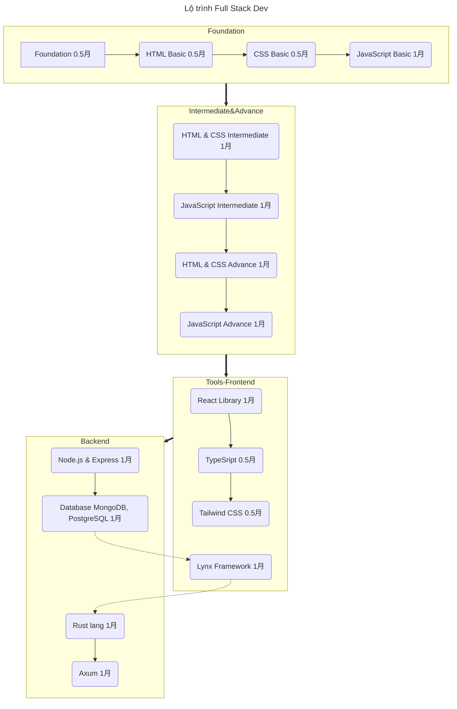

# LỘ TRÌNH HỌC FULL STACK 

## A. **Khóa nền tảng**

### Mở đầu
> Ngày 01: [Nhật ký tự học Full Stack](./Day01-Diary.md)  
> Ngày 01: [Tại sao tự học lập trình rất khó](./Day01-WhyDifficultToLearn.md)  
> Ngày 01: [Tại sao tôi tự học lập trình](./Day01-WhyILearnProgramming.md)  
> Ngày 02: [Giữ tư duy tăng trưởng khi học lập trình](./Day02-KeepGrowthMindset.md)  
> Ngày 02: [Chế độ tập trung và phân tán](./Day02-FocusAndDiffuseMode.md)  
> Ngày 02: [Bí quyết đạt tới thành công bất kể lĩnh vực nào ](Day02-SuccessSecret.md)    
> Ngày 02: [Những cạm bẫy cần tránh khi học lập trình](Day02-AvoidPitfalls.md)   
> Ngày 03: [Cách hỏi để được giúp đỡ](./Day03-HowToAsk.md)    
> Ngày 04: [Cách giúp đỡ người khác](./Day04-HowTOHelp.md)   
> Ngày 04: [Vấn đề XY là gì?](./Day04-XYProblems.md)  

### Điều kiện cần thiết
> Ngày 05: [Internet làm việc như thế nào?](./Day05-HowInternetWork.md)  
> Ngày 06: [Web hoạt động như thế nào?](./Day06-HowWebWork.md)  
> Ngày 07: [Tên miền ](./Day07-DomainName.md)  
> Ngày 08: [Môi trường Linux, WSL](./Day08-LinuxAndWSL.md)  
> Ngày 09: [Terminal , VSCode](./Day09-TerminalVSCode.md)  
> Ngày 09: [Text Editor](./Day09-TextEditorVSCode.md)  
> Ngày 10: [Command Line Basic](./Day10-CommandLineBasic.md)    
> Ngày 10: [Shell vs Bash](./Day10-ShellVsBash.md)    
> Ngày 10: [Unix Shell](./Day10-UnixShell.md)  
> Ngày 11: [Điều hướng file và thư mục](./Day11-NagigateFileDirectory.md)    
> Ngày 12: [Làm việc với File và Thư mục](./Day12-WorkingWithFileDirectory.md)  
> Ngày 13: [Cài đặt Git](./Day13-Git-Install.md)  
> Ngày 14: [SSH Key Pairs](./Day14-SSHKeyPair.md)  
> Ngày 15: [Hệ thống Git và Lệnh thường dùng](./Day15-GitSystem.md)  

### Nền tảng về HTML
> Ngày 16: [Giới thiệu về HTML](./Day16-HTMLIntroduce.md)   
> Ngày 16: [HTML Element, Tag, Boilerplate](./Day16-HTML-tag-element-boilerplate.md)  
> Ngày 17: [Các phần tử HTML](./Day17-HtmlElements.md)

### Nền tảng về CSS
### Flexbox
### JavaScript cơ bản
> Ngày 71: [Tạo Alias cho Git](./Day71-create-alias-git.md)  
> Ngày 72: [DOM và Các sự kiện (Events)](./Day72-DOMandEvents.md)  
> Ngày 73: [Git Branching và Mergin căn bản](./Day72-GitBranchingBasics.md)  
> Ngày 74: [Tạo pseudocode Diagram bằng Mermaid syntax](./Day74-PseudocodeDiagramMermaid.md)    
> Ngày 75: [Cơ bản về Object trong JS](./Day75-ObjectBasics.md)  
> Ngày 76-77-78 : [Dự án Calculator]  

## B. Intermediate HTML and CSS
### Intermediate HTML Concepts 
> Ngày 79: [Introduction](./Day79-IntroductionHTML-CSSIntermediate.md)  
> Ngày 79: [Introduction với ví dụ kèm theo](./Day79-Introduction-with-example.md)  
> Ngày 79: [Emmet](./Day79-emmet.md)   
> Ngày 80: [SVGs](./Day80-SVG.md)  
> Ngày 81: [Table](./Day81-Table.md)  

### Intermediate CSS Concepts 
> Ngày 81: [Default Style](./Day81-CSS-Default-Styles.md)
> 
### Forms (1 day)
### Grid (2 day)

## C. **JAVASCRIPT**
## D. **Advanced HTML and CSS**
## E. **React**
## F. **TypeScript**
## G. **Tailwind CSS**
## H. **Node.js + Express**
## I. **Database (MongoDB, PostgreSQL)**
## J. **Lynx framework (cross-platform frontend)**
## K. **Rust lang**
## L. **Axum framework (backend)**
## M. **Bổ sung freeCodeCamp.com**
## N. **Bổ sung fullstackopen.com** 
## O. **Kênh Video Youtube freeCodeCamp**
## P. **Khóa Full Stack trên Udemy**
## Q. **BỔ sung theo lộ trình roadmap.sh**
